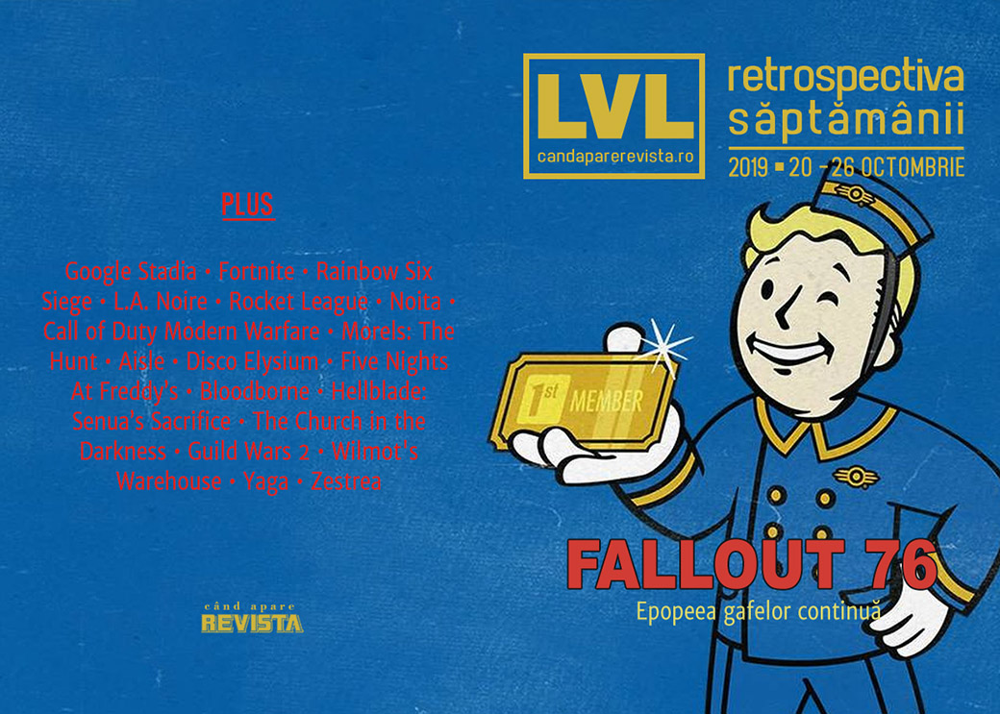

Fallout 76 o comite din nou, mai întâi anunțând un abonament plătit (scump) pentru funcționalități exclusive, apoi pentru că acele funcționalități nu... funcționează. Și, în plus, asta se întâmplă în aceeași săptămână în care s-a lansat The Outer Worlds. Apoi, acțiunile Ubisoft se prăbușesc după ce recunoaște eșecul titlurilor de anul acesta, în frunte cu Breakpoint, Fornite stabilește recoduri de vizionare după ce a distrus harta jocului, Google își deschide studio de jocuri pentru Stadia, Yaga are dată de lansare și niște clujeni lansează un boardgame bazat pe tradițiile românești de nuntă cu grafică originală.

Linkuri rapide:

* [Știri](#știri)
* [Articole (critică, dev, design)](#articole-critică-dev-design)
* [Made în România](#made-în-românia)
* [Anunţuri şi lansări de jocuri](#anunţuri-şi-lansări-de-jocuri)
* [Prăvălii de jocuri](#prăvălii-de-jocuri)

## Știri
* Într-un raport pentru investitori, Ubisoft anunță că titlurile cele mai importante de anul acesta, **The Division 2** și **Ghost Recon Breakpoint** au produs încasări sub așteptări și amână lansarea a trei dintre titlurile aflate în dezvoltare (Watch Dogs Legion, Gods & Monsters and Rainbow Six Quarantine). Ca urmare a anunțului, prețul acțiunilor Ubisoft a scăzut cu până la 29%. ([VideoGamesChronicle](https://www.videogameschronicle.com/news/ubisoft-stock-dives-after-games-underperform-and-titles-delayed/), [PCGamesN](https://www.pcgamesn.com/ghost-recon-breakpoint/ubisoft-stock))
* Google deschide în Montreal primul studio de jocuri dedicat dezvoltării de titluri pentru Stadia. ([TechRaptor](https://techraptor.net/gaming/news/google-stadia-announces-first-game-studio), [VentureBeat](https://venturebeat.com/2019/10/24/stadia-studio-montreal/), [PCGamesInsider.biz](https://www.pcgamesinsider.biz/job-news/69892/googles-first-stadia-studio-is-in-montral/), [Wccf tech](https://wccftech.com/google-stadia-multiple-first-party-studios-montreal/), [GameDaily.biz](https://gamedaily.biz/article/1335/google-stadia-unveils-new-montreal-studio-to-bolster-exclusive-content))
* După ce Organizația Mondială a Sănătății [a propus anul trecut]() includerea tulburărilor legate de gaming pe lista bolilor mentale recunoscute, un studiu făcut de două universități britanice aduce informații noi în domeniu, sugerând că dependența nesănătoasă de jocuri ar fi mai degrabă un simptom al unor probleme preexistente. ([VideoGamesChronicle](https://www.videogameschronicle.com/news/study-finds-insufficient-evidence-of-gaming-as-a-clinical-disorder/), [Ars Technica](https://arstechnica.com/gaming/2019/10/study-casts-doubt-on-value-of-whos-gaming-disorder-diagnoses/), [GamesIndustry.biz](https://www.gamesindustry.biz/articles/2019-10-21-academic-research-finds-no-evidence-of-gaming-as-a-clinical-disorder))
* Children's Commissioner din Marea Britanie (o organizație non-guvernamentală publică responsabilă cu apărarea drepturilor copiilor) a solicitat guvernului britanic să includă _loot boxes_ pe lista formelor de jocuri de noroc și să fie supuse astfel reglementărilor aferente. ([Eurogamer](https://www.eurogamer.net/articles/2019-10-22-uk-gambling-laws-called-into-question-again-after-new-report-highlights-childrens-worries-about-spending-in-online-games), [PC Gamer](https://www.pcgamer.com/childrens-commissioner-report-calls-for-loot-boxes-to-be-classified-as-gambling/), [VideoGamesChronicle](https://www.videogameschronicle.com/news/loot-boxes-should-be-classed-as-gambling-says-childrens-commissioner/), [GamesIndustry.biz](https://www.gamesindustry.biz/articles/2019-10-22-childrens-commissioner-urges-ban-on-all-non-cosmetic-in-game-purchases))
* Evenimentul organizat de Fortnite pentru a marca trecerea la un „capitol” nou, respectiv distrugerea hărții și închiderea serverelor de joc timp de două zile, a stabilit recorduri de audiență pe Twitch și Twitter. ([The Verge](https://www.theverge.com/2019/10/23/20929589/fortnite-black-hole-event-season-11-viewers-twitch-twitter-youtube-live), [GamesIndustry.biz](https://www.gamesindustry.biz/articles/2019-10-23-fortnites-the-end-event-set-a-new-twitch-record-for-concurrent-viewers-of-a-single-game), [VentureBeat](https://venturebeat.com/2019/10/23/fortnites-black-hole-event-broke-twitch-records/))
* Și, totodată, Epic dă în judecată un tester de Fortnite care a scurs informații despre noul capitol al jocului înainte de eveniment. ([Polygon](https://www.polygon.com/fortnite/2019/10/25/20932658/epic-games-fortnite-lawsuit-chapter-2-leak), [RPS](https://www.rockpapershotgun.com/2019/10/26/epic-games-sue-tester-for-spoiling-chapter-2/), [PC Gamer](https://www.pcgamer.com/epic-sues-former-fortnite-tester-who-leaked-chapter-2-secrets/), [Eurogamer](https://www.eurogamer.net/articles/2019-10-26-epic-sues-fortnite-tester-for-leaking-chapter-two-map-swimming-and-more))
* Un litigiu e deschis și de Ubisoft, care dă în judecată creatorul unui program de trișat pentru Rainbow Six Siege. ([Ars Technica](https://arstechnica.com/gaming/2019/10/rainbow-six-cheat-maker-faces-ubisoft-lawsuit-after-bbc-appearance/), [Kotaku](https://kotaku.com/ubisoft-sues-creators-of-popular-rainbow-six-siege-chea-1839323924), [PC Gamer](https://www.pcgamer.com/ubisoft-sues-rainbow-six-siege-cheat-maker-who-appeared-on-the-bbc/), [Polygon](https://www.polygon.com/2019/10/24/20929739/ubisoft-rainbow-six-siege-lawsuit-hackers-mizusoft-cheapboost))

## Articole (critică, dev, design)
* [Interrogating detective mechanics with a real-life detective](https://www.eurogamer.net/articles/2019-10-20-interrogating-detective-mechanics-with-a-real-life-detective) (Eurogamer)
* [How being the first to finish a raid can change your life](https://www.pcgamer.com/how-being-the-first-to-finish-a-raid-can-change-your-life/) (PC Gamer)
* [Joystick Fantasia: Inside the Spectacle of Video Games Live](https://egmnow.com/joystick-fantasia-inside-the-spectacle-of-video-games-live/) (EGM)
* [Blast from the Past: Behind the Rise of the Throwback Shooter](https://egmnow.com/blast-from-the-past-behind-the-rise-of-the-throwback-shooter/) (EGM)
* [Video games in China: beyond the great firewall](https://www.eurogamer.net/articles/2019-10-26-gaming-beyond-the-great-firewall-of-china) (Eurogamer)
* [The Glory and Carnage of Rocket League&#039;s Underground Fight Club](https://www.usgamer.net/articles/the-glory-and-carnage-of-rocket-leagues-underground-fight-club) (USgamer)
* [Four Months Later, Auto Chess&#039; Successors Are Rewriting the Genre](https://www.usgamer.net/articles/four-months-later-auto-chess-successors-are-rewriting-the-genre) (USgamer)

---

### Actualitate
* [The bestest games of EGX 2019](https://www.rockpapershotgun.com/2019/10/21/the-bestest-games-of-egx-2019/) (RPS)
* [EGX 2019 - 17 of the Best Indie Games From The Show Floor](http://fingerguns.net/features/2019/10/22/egx-2019-15-of-the-best-indie-games-from-the-show-floor/) (Finger Guns)

#### Fallout 76
* [The real enemy within Fallout 76 is capitalism](https://www.polygon.com/2019/10/25/20930536/fallout-76-subscription-capitalism-controversy) (Polygon)
* [Fallout 76 Just Threw Out Months of Goodwill in a Single Day](https://www.usgamer.net/articles/fallout-76-just-threw-out-months-of-goodwill-in-a-single-day) (USgamer)
* [Fallout 1st&#039;s unlimited stash makes loyal Fallout 76 players feel like second class citizens](https://www.vg247.com/2019/10/25/fallout-1s-unlimited-stash-fallout-76/) (VG247)

---

### _Not-a-review_
* [‘Fallout 76’: the video game saved by its community of fans](https://theface.com/culture/fallout-76-video-gaming-fanbase) (The Face)
* [Noita rewards you for being reckless, so set everything on fire](https://www.rockpapershotgun.com/2019/10/21/noita-rewards-you-for-being-reckless-so-set-everything-on-fire/) (RPS)
* [Noita is very good even if you are very bad at it](https://www.rockpapershotgun.com/2019/10/25/noita-is-very-good-even-if-you-are-very-bad-at-it/) (RPS)
* [I played Morels: The Hunt with a mycologist, who also happens to be my father](https://www.rockpapershotgun.com/2019/10/20/i-played-morels-the-hunt-with-a-mycologist-who-also-happens-to-be-my-father/) (RPS)
* [Opened World: Shattered Memories](http://www.haywiremag.com/columns/opened-world-shattered-memories/) (Haywire Magazine)
* [Coming to terms with brutality in Call of Duty: Modern Warfare](https://venturebeat.com/2019/10/25/the-deanbeat-coming-to-terms-with-brutality-in-call-of-duty-modern-warfare/) (VentureBeat)
* [Red Dead Redemption 2 is a Pale Imitation of its Inspirations](https://www.kotaku.co.uk/2019/10/26/red-dead-redemption-2-is-a-pale-imitation-of-its-inspirations) (Kotaku)

#### Disco Elysium
* [Disco Elysium puts a full party of NPC companions in your head](https://www.pcgamer.com/disco-elysium-puts-a-full-party-of-npc-companions-in-your-head/) (PC Gamer)
* [All The Dumb Ways I Died Or Almost Died in Disco Elysium](https://www.usgamer.net/articles/all-the-dumb-ways-i-died-in-disco-elysium) (USgamer)
* [How Disco Elysium&#8217;s opening sets the stage for existential revolt](https://www.rockpapershotgun.com/2019/10/25/how-disco-elysiums-opening-sets-the-stage-for-existential-revolt/) (RPS)

---

### Industrie
* [Report: Oculus Quest has sold 400,000 units, will 'leapfrog PC headsets' [SuperData]](https://gamedaily.biz/article/1337/report-oculus-quest-has-sold-400000-units-will-leapfrog-pc-headsets-superdata) (GameDaily.biz)
* ['Mozart would have made video game music': composer Eímear Noone on a winning art form](https://www.theguardian.com/games/2019/oct/22/mozart-video-game-music-composer-eimear-noone) (The Guardian)
* [Yodo1's AI-driven whale hunt is a bad look for the games industry](https://www.gamesindustry.biz/articles/2019-10-21-yodo1s-ai-driven-whale-hunt-is-a-bad-look-for-the-games-industry-opinion) (GamesIndustry.biz)
* [Andrew Yang: &quot;Games are intrinsic to the human experience&quot;](https://www.gamesindustry.biz/articles/2019-10-23-andrew-yang-games-are-intrinsic-to-the-human-experience) (GamesIndustry.biz)
* [Xbox Has Paid Over $1.7 Billion To Indies This Generation](https://www.kotaku.com.au/2019/10/xbox-one-has-paid-over-1-7-billion-to-indie-games-this-generation-microsoft/) (Kotaku)
* [Google Stadia's stealth launch does not inspire confidence](https://www.gamesindustry.biz/articles/2019-10-25-stadias-stealth-launch-does-not-inspire-confidence-opinion) (GamesIndustry.biz)

---

### Istorie, retrospectivă
* [Five years of Five Nights At Freddy’s](https://games.avclub.com/five-years-of-five-nights-at-freddy-s-1839089503) (A.V. Club)
* [The Best Things Xbox One Has Done This Generation](https://kotaku.com/the-best-things-xbox-one-has-done-this-generation-1839269521) (Kotaku)
* [A Fan-Made Festival of Blood](https://egmnow.com/a-fan-made-festival-of-blood/) (EGM)
* [How Crusader Kings 2 Turned Paradox Into a Powerhouse](https://www.usgamer.net/articles/how-crusader-kings-2-changed-paradox-feature-interview) (USgamer)
* [How Hellblade: Senua&#8217;s Sacrifice changed lives with its thoughtful portrayal of mental illness](https://venturebeat.com/2019/10/26/how-hellblade-senuas-sacrifice-changed-lives-with-its-thoughtful-portrayal-of-mental-illness/) (VentureBeat)
* [The Game Archaeologist: A brief history of Multi-User Dungeons](https://massivelyop.com/2019/10/26/the-game-archaeologist-a-brief-history-of-multi-user-dungeons/) (Massively OP)

---

### Dev, making of, mecanici
* [How Guild Wars 2&#8217;s mounts were made](https://www.rockpapershotgun.com/2019/10/23/how-guild-wars-2s-mounts-were-made/) (RPS)
* [Key design lessons devs can learn from  The Church in the Darkness](https://www.gamasutra.com/view/news/350569/Key_design_lessons_devs_can_learn_from_The_Church_in_the_Darkness.php) (Gamasutra)
* [Game Design Deep Dive: The creative camaraderie behind  Wilmot's Warehouse](https://www.gamasutra.com/view/news/352585/Game_Design_Deep_Dive_The_creative_camaraderie_behind_Wilmots_Warehouse.php) (Gamasutra)
* [Video: Inside the graphics tech of Remedy's Northlight engine](https://www.gamasutra.com/view/news/352841/Video_Inside_the_graphics_tech_of_Remedys_Northlight_engine.php) (Gamasutra)

---

### Design, world-building, artă
* [Video: Curating the Victoria & Albert Museum's video game exhibition](https://www.gamasutra.com/view/news/352753/Video_Curating_the_Victoria_amp__Albert_Museums_video_game_exhibition.php) (Gamasutra)
* [I Will Always Love Where A Good 2D-Style Background Takes My Imagination](https://kotaku.com/i-will-always-love-where-a-good-2d-background-takes-my-1839229573) (Kotaku)
* [Old Arcade Games Had Just The Most Beautiful Typography](https://kotaku.com/old-arcade-games-had-just-the-most-beautiful-typography-1839240326) (Kotaku)
* [Professional Photographer Takes Super Mario Odyssey Shots With Intricate Detail](https://kotaku.com/professional-photographer-takes-super-mario-odyssey-sho-1839339802) (Kotaku)
* [Game Art: Total Refusal's How To Disappear. Deserting Battlefield](https://www.gamescenes.org/2019/10/game-art-total-refusals-how-to-disappear-2019.html) (GAMESCENES)
* [Introducing The Oktorok-3000](https://kotaku.com/introducing-the-oktorok-3000-1839148166) (Kotaku)
* [Whoso Pulleth Out This Carrot Of This Dirt Is Rightwise King Born Of All England](https://kotaku.com/whoso-pulleth-out-this-carrot-of-this-dirt-is-rightwise-1839216599) (Kotaku)
* [Nope No Thank You](https://kotaku.com/nope-no-thank-you-1839278443) (Kotaku)

## Made în România
* Un grup de designeri și artiști din Cluj au creat un boardgame bazat pe tradițiile românești de nuntă numit **Zestrea**, pentru care caută finanțare pe Kickstarter, ajutați de Laura Bularca (Lara de la Level). ([Kickstarter](https://www.kickstarter.com/projects/valiant-game-studio/zestrea-a-marriage-negotiation-board-game/), [Playtech](https://playtech.ro/2019/cele-mai-ridicole-traditii-romanesti-devin-acum-subiect-de-joc-de-societate/), [Utopia Balcanică](http://utopiabalcanica.net/2019/10/25/am-jucat-zestrea-jocul-de-societate-romanesc-care-face-feudalismul-sa-fie-iar-palpitant/))
* **Yaga** are acum dată de lansare pe PC - apare pe 12 noiembrie ([GameSpace](https://www.gamespace.com/all-articles/news/action-rpg-yaga-is-launching-november-12th), [VGChartz](http://www.vgchartz.com/article/441042/yaga-launches-november-12-for-switch-ps4-xbox-one-and-epic-games-store/)). Jocul e deja disponibil în Apple Arcade ([TechRaptor](https://techraptor.net/gaming/news/another-five-games-join-apple-arcade))

## Anunţuri şi lansări de jocuri
### Anunţate
* **Vampire: The Masquerade - Swansong** ([Eurogamer](https://www.eurogamer.net/articles/2019-10-19-swansong-is-the-name-of-the-vampire-the-masquerade-game-due-out-2021))
* **Uragun** ([DSOGaming](https://www.dsogaming.com/news/uragun-is-a-new-cool-mech-top-down-shooter-coming-to-pc-in-2020/))
* **Project Haven** ([GameSpace](https://www.gamespace.com/all-articles/news/foresight-games-unveil-project-haven))
* **Hotel Barcelona**, un  horror game de la Suda51 și SWERY ([Shacknews](https://www.shacknews.com/article/114608/suda-51-and-swery-65-announced-joint-horror-game-hotel-barcelona))
* **The Drifter** ([Destructoid](https://www.destructoid.com/the-drifter-is-a-pulp-adventure-game-from-the-folks-behind-crawl-570339.phtml))
* **Artificial Extinction** ([PC Gamer](https://www.pcgamer.com/artificial-extinction-is-first-person-tower-defense-with-robots/))
* **Panzer Dragoon: Remake** ([DSOGaming](https://www.dsogaming.com/news/panzer-dragoon-remake-is-officially-coming-to-the-pc-in-winter-2019/))

### Acum cu dată de lansare
* **Yaga**: 12 noiembrie ([GameSpace](https://www.gamespace.com/all-articles/news/action-rpg-yaga-is-launching-november-12th))
* **Kingdom Under Fire 2**: 14 noiembrie ([PC Gamer](https://www.pcgamer.com/kingdom-under-fire-2-finally-arrives-on-november-14th/))
* **Narcos: Rise of the Cartels**: 19 noiembrie ([DSOGaming](https://www.dsogaming.com/news/netflix-narcos-rise-of-the-cartels-releases-on-november-19th-pc-system-requirements-revealed/))
* **Vampire: The Masquerade – Coteries of New York**: 4 decembrie ([EGM](https://egmnow.com/vampire-the-masquerade-coteries-of-new-york-gets-a-release-date/))
* **Darksiders Genesis**: 5 decembrie ([Destructoid](https://www.destructoid.com/darksiders-genesis-arrives-in-december-for-pc-and-stadia-february-2020-for-consoles-570194.phtml))
* **Monster Hunter World: Iceborne**: 9 ianuarie ([EGM](https://egmnow.com/monster-hunter-world-iceborne-gets-a-pc-release-date-and-trailer/))
* **Romance Of The Three Kingdoms 14**: 28 februarie ([PC Gamer](https://www.pcgamer.com/romance-of-the-three-kingdoms-14-marches-onto-pc-in-february/))

### Amânate
* **Watch Dogs Legion**, **Gods & Monsters** și **Rainbow Six Quarantine**: amânate de la începutul anului 2020 pentru a doua jumătate a anului sau chiar 2021 ([VideoGamesChronicle](https://www.videogameschronicle.com/news/ubisoft-delays-watch-dogs-legion-gods-monsters-and-rainbow-six-quarantine/))

### Lansate
* 22 octombrie: **The Long Dark Episode 3: Crossroads Elegy** ([Steam](https://store.steampowered.com/app/305620/The_Long_Dark/))
* 22 octombrie: **AI War 2** (iese din early access) ([Steam](https://store.steampowered.com/app/573410/AI_War_2/), [gog.com](https://www.gog.com/game/ai_war_2))
* 22 octombrie: **Tangle Tower** ([Steam](https://store.steampowered.com/app/359510/Tangle_Tower/))
* 22 octombrie: **Abandon Ship** (iese din early access)  ([Steam](https://store.steampowered.com/app/551860/Abandon_Ship/))
* 22 octombrie: **Moons of Madness** ([Steam](https://store.steampowered.com/app/1012840/Moons_of_Madness/))
* 23 octombrie: **Crossroads Inn** ([Steam](https://store.steampowered.com/app/867290/Crossroads_Inn/), [gog.com](https://www.gog.com/game/crossroads_inn))
* 24 octombrie: **Rise Of Industry: 2130** ([Steam](https://store.steampowered.com/app/1139110/Rise_of_Industry_2130/), [gog.com](https://www.gog.com/game/rise_of_industry_2130))
* 24 octombrie: **Space Company Simulator** (early access) ([Steam](https://store.steampowered.com/app/923970/Space_Company_Simulator/))
* 25 octombrie: **Call of Duty: Modern Warfare** ([Site Call of Duty](https://www.callofduty.com/modernwarfare/buy))

## Prăvălii de jocuri
### Știri
* [Steam Remote Play Together is now available to try in beta](https://www.pcgamer.com/steam-remote-play-together-is-now-available-to-try-in-beta/) (PC Gamer)
* [Steam asks user if they want to &#8220;revise&#8221; Destiny 2 review after 93 more hours](https://www.pcgamesn.com/destiny-2/steam-review-edit) (PCGamesN)

### Articole
* [Playing local multiplayer games over the internet with Steam works surprisingly well](https://www.pcgamer.com/playing-local-multiplayer-games-over-the-internet-with-steam-works-surprisingly-well/) (PC Gamer)
* [Epic Games Store: Nearly one year from launch, how is it to use?](https://www.rockpapershotgun.com/2019/10/23/epic-games-store-nearly-one-year-from-launch-how-is-it-to-use/) (RPS)

### Update catalog
* [Seven new games are lined up for Xbox Game Pass in the next two weeks](https://www.destructoid.com/seven-new-games-are-lined-up-for-xbox-game-pass-in-the-next-two-weeks-570248.phtml) (Destructoid)

### Jocuri gratis și free weekends
* [Take on a deadly monster in free horror adventure Zermatt: Zero](https://www.pcgamer.com/take-on-a-deadly-monster-in-free-horror-adventure-zermatt-zero/) (PC Gamer)
* [Layers of Fear and Q.U.B.E. 2 are now available for free on the Epic Games Store](https://www.dsogaming.com/news/layers-of-fear-and-q-u-b-e-2-are-now-available-for-free-on-the-epic-games-store/) (DSOGaming)
* [Play NBA 2K20 for free this weekend](https://egmnow.com/play-nba-2k20-for-free-this-weekend/) (EGM)
* [Battlefield 5 free weekend trials extended to include War in the Pacific](https://www.videogameschronicle.com/news/battlefield-5-free-weekend-trials-extended-to-include-war-in-the-pacific/) (VideoGamesChronicle)
* [Mortal Kombat Project 4.1 Remastered &amp; The King of Fighters free games available for download](https://www.dsogaming.com/news/mortal-kombat-project-4-1-remastered-the-king-of-fighters-free-games-available-for-download/) (DSOGaming)

### Reduceri și promoții
* [Epic Games store launches ‘up to 65% off’ Halloween sale](https://www.videogameschronicle.com/news/epic-games-store-launches-up-to-65-off-halloween-sale/) (VideoGamesChronicle)
* [Best PC gaming deals of the week &#8211; 25th October 2019](https://www.rockpapershotgun.com/2019/10/25/best-pc-gaming-deals-of-the-week-25th-october-2019/) (RPS)
* [Weekend PC Download Deals for Oct. 25: Dying Light x Left 4 Dead 2](https://www.shacknews.com/article/114662/weekend-pc-download-deals-for-oct-25-dying-light-x-left-4-dead-2) (Shacknews)
* [Weekend Console Download Deals for Oct. 25: NBA 2K20 tips off](https://www.shacknews.com/article/114660/weekend-console-download-deals-for-oct-25-nba-2k20-tips-off) (Shacknews)

---

{}
**Retrospectiva săptămânii** este rubrica duminicală în care trecem în revistă evenimentele săptămânii de pe frontul de gaming: știri şi articole (scrise de alții, bineînțeles, că e mai ușor aşa), industrie, lansări, oferte de jocuri, toate numai de savurat la cafeaua de duminică dimineața.

De asemenea, rubrica e deschisă oricui vrea și poate contribui. Dacă ai citit vreun articol sau vreo știre interesantă și crezi că merită incluse în retrospectiva săptămânii, te așteptăm pe forum pe unul dintre topicurile dedicate: [Știri](https://forum.candaparerevista.ro/viewtopic.php?f=4&t=46), [Articole](https://forum.candaparerevista.ro/viewtopic.php?f=4&t=206), [Gaming România](https://forum.candaparerevista.ro/viewtopic.php?f=4&t=1622)].
{}
