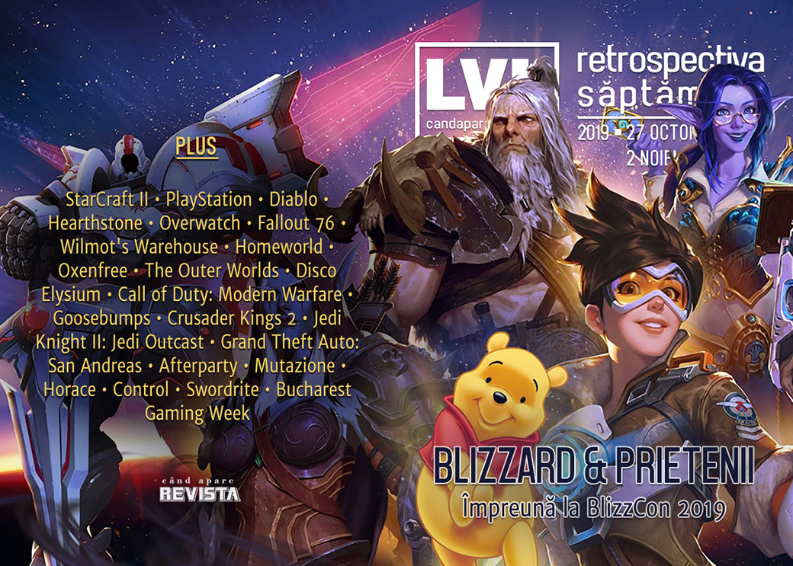

Săptămâna a fost dominată de știrile legate de Blizzard, care a organizat ediția 2019 a BlizzCon. Evenimentul a fost marcat atât de proteste și opinii legate de recentul scandal Hong Kong, cât și de anunțuri mult anticipate precum Diablo IV sau Overwatch 2. În alte știri, AI-ul lui Google bate tot ce prinde la Starcraft II, iar Valve lansează așteptatul update al clientului de Steam.

Linkuri rapide:

* [Știri](#știri)
* [Articole (critică, dev, design)](#articole-critică-dev-design)
* [Made în România](#made-în-românia)
* [Anunţuri şi lansări de jocuri](#anunțuri-şi-lansări-de-jocuri)
* [Prăvălii de jocuri](#prăvălii-de-jocuri)

## Știri
* AI-ul AlphaStar, dezvoltat de Google DeepMind, poate să joace StarCraft 2 la nivel Grandmaster, mai bine decât "99.8 din oponenții umani".([Ars Technica](https://arstechnica.com/science/2019/10/leveling-up-deepminds-alphastar-achieves-grandmaster-level-in-starcraft-ii/), [The Verge](https://www.theverge.com/2019/10/30/20939147/deepmind-google-alphastar-starcraft-2-research-grandmaster-level), [VentureBeat](https://venturebeat.com/2019/10/30/deepminds-alphastar-final-beats-99-8-of-human-starcraft-2-players/), [Kotaku](https://kotaku.com/ai-masters-starcraft-ii-ranked-higher-than-99-8-of-hu-1839481042), [VentureBeat](https://venturebeat.com/2019/11/01/blizzcon-fans-will-be-able-to-battle-deepminds-ai-in-starcraft-2/), [USgamer](https://www.usgamer.net/articles/deepminds-starcraft-2-ai-ranks-higher-than-998-of-human-players))
* Sony înregistrează trademark-uri pentru PlayStation de la 6 până la 10. ([EGM](https://egmnow.com/sony-files-trademarks-for-ps6-7-8-9-and-10/), [Destructoid](https://www.destructoid.com/sony-interactive-entertainment-japan-trademarks-ps6-through-ps10-570833.phtml), [Eurogamer](https://www.eurogamer.net/articles/2019-10-29-sony-secures-trademarks-for-ps6-ps7-ps8-ps9-and-even-ps10), [GamesIndustry.biz](https://www.gamesindustry.biz/articles/2019-10-29-sony-files-trademarks-for-playstation-6-7-8-9-and-10))
* Și, în același timp, Sony anunță că producția de PS4 a depășit 100 de milioane de unități, fiind acum a doua cea mai bine vândută consolă din istorie.([Kotaku](https://kotaku.com/sony-has-shipped-102-million-ps4s-1839462520), [The Verge](https://www.theverge.com/2019/10/30/20939639/ps4-lifetime-sales-vs-ps1-wii-sony), [VG247](https://www.vg247.com/2019/10/30/playstation-4-lifetime-sales-102-8-million/), [Gamasutra](https://www.gamasutra.com/view/news/353117/The_PS4_has_become_the_second_bestselling_home_console_of_all_time.php))
* Valve interzice schimburile de chei pentru cutiile de CS:GO pentru a combate „spălarea de bani”. ([Polygon](https://www.polygon.com/2019/10/29/20937992/csgo-counter-strike-valve-key-trading-banned-fraud-network), [Vice](https://www.vice.com/en_us/article/8xw7nx/nearly-all-counter-strike-microtransactions-are-being-used-for-money-laundering), [GamesIndustry.biz](https://www.gamesindustry.biz/articles/2019-10-29-money-laundering-prompts-valve-to-halt-cs-go-in-game-key-sales), [PCGamesN](https://www.pcgamesn.com/counter-strike-global-offensive/csgo-keys-money-laundering), [USgamer](https://www.usgamer.net/articles/valve-disables-counter-strike-key-trading-because-nearly-all-were-used-for-money-laundering))
* Chiar înainte de debutul BlizzCon aflăm că Blizzard a pierdut un sponsor important pentru competițiile sale de esports din cauza controversei Hong Kong. E vorba de Mistubishi Taiwan, care a renunțat la a mai colabora cu Blizzard la numai două zile după anunțul privind suspendarea jucătorului Blitzchung. ([Eurogamer](https://www.eurogamer.net/articles/2019-10-30-major-blizzard-sponsor-withdraws-over-hong-kong-controversy), [Kotaku](https://kotaku.com/blizzard-loses-sponsor-over-hong-kong-actions-1839454172), [GamesIndustry.biz](https://www.gamesindustry.biz/articles/2019-10-30-sponsor-abandoned-blizzard-esports-league-after-blitzchung-controversy), [Polygon](https://www.polygon.com/2019/10/29/20939214/mitsubishi-taiwan-pulls-hearthstone-sponsorship-blizzard-hong-kong-suspension), [PCGamesN](https://www.pcgamesn.com/hearthstone/lost-sponsor), [VideoGamer](https://www.videogamer.com/news/blizzards-hong-kong-controversy-cost-it-an-esports-sponsor-), [TechRaptor](https://techraptor.net/gaming/news/mitsubishi-drops-blizzard-after-free-hong-kong-ban))

#### BlizzCon
În perioada 1-3 noiembrie are loc BlizzCon 2019, convenția anuală dedicată jocurilor Blizzard:

* Evenimentul a început cu CEO-ul Blizzard, J. Allen Brack, cerându-și scuze pentru reacția rapidă și în „neconcordanță cu valorile și standardele Blizzard” de suspendare a jucătorului de Hearthstone de acum două săptămâni care a dat naștere controverselor privind China (dar nici nu schimbă în vreun fel suspendarea jucătorului sau a prezentatorilor). ([Ars Technica](https://arstechnica.com/gaming/2019/11/blizzard-president-gives-vague-apology-for-hong-kong-protest-response/), [USgamer](https://www.usgamer.net/articles/blizzard-president-apologizes-for-hearthstone-controversy-doesnt-change-ruling), [PC Gamer](https://www.pcgamer.com/blizzard-president-apologizes-over-hong-kong-controversy/), [Eurogamer](https://www.eurogamer.net/articles/2019-11-01-blizzard-ceo-apologises-for-hearthstone-hong-kong-controversy), [Kotaku](https://kotaku.com/we-moved-too-quickly-blizzard-president-apologizes-for-1839540746), [VG247](https://www.vg247.com/2019/11/01/blizzard-hong-kong-apology-blizzcon/))
* Dintre noutățile mai importante de la ceremonia de deschidere se remarcă anunțarea lui Diablo IV și Overwatch 2. Sumar ceremonie: [Destructoid](https://www.destructoid.com/everything-that-happened-at-blizzcon-2019-s-opening-ceremony-571189.phtml), [VentureBeat](https://venturebeat.com/2019/11/01/blizzcon-2019/), [Polygon](https://www.polygon.com/blizzcon/2019/11/1/20943998/blizzcon-2019-diablo-4-overwatch-2-hong-kong).
* La porțile centrului unde se desfășoară evenimentului au fost prezenți protestatari îmbrăcați în costume Winnie the Pooh cu pancarte anti-Blizzard și pro-Hong Kong.([TechRaptor](https://techraptor.net/gaming/news/blizzcon-protests-supporting-hong-kong-are-underway), [Spiel Times](https://www.spieltimes.com/news/protestors-rally-outside-blizzcon-2019-with-winnie-the-pooh-costumes/), [Kotaku](https://kotaku.com/hong-kong-protest-is-growing-outside-of-blizzcon-1839542568), [Vice](https://www.vice.com/en_us/article/59nan3/as-promised-protesters-showed-up-to-blizzcon-today), [Variety](https://variety.com/2019/digital/news/blizzcon-protest-activision-blizzard-hong-kong-blitzchung-1203387207/))
* Protestele nu au încetat după scuzele prezentate lui J. Allen Brack ([Eurogamer](https://www.eurogamer.net/articles/2019-11-01-blizzard-apology-does-not-silence-protestors-at-blizzcon-2019))
* S-a desfășurat finala turneului mondial de Hearthstone, câștigat pentru prima dată de o femeie, o jucătoare din China. ([PC Gamer](https://www.pcgamer.com/vkliooon-is-the-first-woman-to-become-hearthstone-global-champion/), [Kotaku](https://kotaku.com/chinese-player-xiaomeng-vkliooon-li-has-won-the-heart-1839571770), [Shacknews](https://www.shacknews.com/article/114768/vkliooon-becomes-first-woman-to-win-hearthstone-world-championship))
* Alte articole:
  * [Blizzard president clarifies decision to ban Hearthstone player and two casters over Hong Kong controversy](https://www.pcgamer.com/blizzard-president-clarifies-decision-to-ban-hearthstone-player-and-two-casters-over-hong-kong-controversy/) (PC Gamer)

## Articole (critică, dev, design)

* [Can You Get Too Old to Be Good at Video Games?](https://www.vice.com/en_us/article/pa7w9z/can-you-get-too-old-to-be-good-at-video-games) (Vice)
* [Analog Horror: Why Tapes Are Such Fertile Ground for Video Game Scares](https://egmnow.com/analog-horror-why-tapes-are-such-fertile-ground-for-video-game-scares/) (EGM)
* [The race to save Japan's incredible '80s PC gaming history before it's gone](https://www.pcgamer.com/game-preservation-society-japanese-pc-games-square-enix-game-arts/) (PC Gamer)
* [Horror Master Junji Ito Doesn’t Know Video Games—But Video Games Certainly Know Him](https://egmnow.com/horror-master-junji-ito-doesnt-know-video-games-but-video-games-certainly-know-him/) (EGM)
* [The creepy allure of video game dungeons](https://www.eurogamer.net/articles/2019-10-31-the-creepy-allure-of-video-game-dungeons) (Eurogamer)
* [Fear Paradox: How the Best Horror Games Scare Us](https://egmnow.com/fear-paradox-how-the-best-horror-games-scare-us/) (EGM)

---

### Actualitate
* [Blizzard’s complicated history with China looms over BlizzCon 2019](https://www.polygon.com/2019/10/31/20941754/blizzcon-2019-hong-kong-protests-blizzard-entertainment) (Polygon)
* [I spoke to Google about their AI that can play at StarCraft 2 Grandmaster level](https://www.rockpapershotgun.com/2019/11/01/we-spoke-to-google-about-their-ai-that-can-play-at-starcraft-2-grandmaster-level/) (RPS)
* [Discover the best games of EGX Berlin with Indies Uncovered](https://www.rockpapershotgun.com/2019/11/01/discover-the-best-games-of-egx-berlin-with-indies-uncovered/) (RPS)

---

### _Not-a-review_
* [Fallout 76 players have a decidedly mixed response to the Fallout 1st subscription](https://www.rockpapershotgun.com/2019/10/29/fallout-76-players-have-a-decidedly-mixed-response-to-the-fallout-1st-subscription/) (RPS)
* [The Joy of Labor in Wilmot&#039;s Warehouse](https://unwinnable.com/2019/10/30/the-joy-of-labor-in-wilmots-warehouse/) (Unwinnable)
* [The unsung horror potential of Homeworld](https://www.rockpapershotgun.com/2019/10/31/the-unsung-horror-potential-of-homeworld/) (RPS)
* [Oxenfree and the horror of grieving](https://www.rockpapershotgun.com/2019/10/31/oxenfree-and-the-horror-of-grieving/) (RPS)

#### The Outer Worlds
* [The Splendor but Crucial Importance of The Outer Worlds’ Companions](https://www.hardcoregamer.com/2019/10/27/the-splendor-but-crucial-importance-of-the-outer-worlds-companions/360386/) (Hardcore Gamer)
* [The Outer Worlds Hilariously Rewards Your Incompetence](https://techraptor.net/originals/outer-worlds-dumb-character-hero) (TechRaptor)
* [How the Space Western Evolved from Star Trek to The Outer Worlds](https://www.escapistmagazine.com/v2/how-the-space-western-evolved-from-star-trek-to-the-outer-worlds/) (Escapist)

#### Disco Elysium
* [Disco Elysium’s Voice Acting Is Good Enough Not To Skip](https://kotaku.com/disco-elysium-s-voice-acting-is-good-enough-not-to-skip-1839509295) (Kotaku)
* [No Truce With The Disco](https://timber-owls.com/2019/10/28/no-truce-with-the-disco/) (Timber Owls)
* [Disco Elysium has ruined The Outer Worlds for me](https://www.pcgamer.com/disco-elysium-has-ruined-the-outer-worlds-for-me/) (PC Gamer)
* [The Outer Worlds is the RPG Genre&#039;s Past, Disco Elysium is Its Future](https://www.usgamer.net/articles/the-outer-worlds-disco-elysium-and-the-rpg-genre) (USgamer)

#### Call of Duty: Modern Warfare
* [Call of Duty: Modern Warfare angers Russians who call it 'propaganda'](https://www.pcgamer.com/call-of-duty-modern-warfare-angers-russians-who-call-it-propaganda/) (PC Gamer)
* [Call of Duty: Modern Warfare’s Highway of Death controversy, explained](https://www.polygon.com/2019/10/30/20938550/call-of-duty-modern-warfare-highway-of-death-controversy) (Polygon)
* [&#39;Modern Warfare,&#39; The Highway of Death, and Call of Duty&#39;s Exploitation of the Past](https://www.vice.com/en_us/article/mbmwgn/modern-warfare-the-highway-of-death-and-call-of-dutys-exploitation-of-the-past) (Vice)

---

### Industrie
* [Is Bethesda Becoming Irrelevant?](https://www.hardcoregamer.com/2019/10/30/is-bethesda-becoming-irrelevant/360865/) (Hardcore Gamer)
* [EA returns to Steam](https://www.gamesindustry.biz/articles/2019-10-29-ea-returns-to-steam) (GamesIndustry.biz)
* [Sega's commitment to better localization brings more Western players to popular Japanese franchises](https://gamedaily.biz/article/1346/segas-commitment-to-better-localization-brings-more-western-players-to-popular-japanese-franchises) (GameDaily.biz)
* [What it was like working at Kojima Productions Los Angeles](https://www.polygon.com/2019/10/30/20939334/what-it-was-like-working-at-kojima-productions-los-angeles) (Polygon)
* [Player Two: An Interview with Stefano Gualeni](https://invalidmemory.wordpress.com/2019/10/29/player-two-an-interview-with-stefano-gualeni/) (Invalid Memory)
* [Why the Creator of Disco Elysium Hasn&#039;t Read the Reviews, and What&#039;s Next for the IP](https://www.escapistmagazine.com/v2/why-the-creator-of-disco-elysium-hasnt-read-the-reviews-and-whats-next-for-the-ip/) (Escapist)

---

### Istorie, retrospectivă
* [Let's all relive that time Jeff Goldblum played Dracula in an FMV Goosebumps game](https://www.pcgamer.com/lets-all-relive-that-time-jeff-goldblum-played-dracula-in-an-fmv-goosebumps-game/) (PC Gamer)
* [End of a Reign: The Final Days of Crusader Kings 2](https://www.usgamer.net/articles/end-of-a-reign-the-final-days-of-crusader-kings-2) (USgamer)
* [How Crusader Kings 2 Turned Paradox Into a Powerhouse](https://www.usgamer.net/articles/how-crusader-kings-2-changed-paradox-feature-interview) (USgamer)
* [Tales from the making of  Jedi Knight II: Jedi Outcast](https://www.gamasutra.com/view/news/351746/Tales_from_the_making_of_Jedi_Knight_II_Jedi_Outcast.php) (Gamasutra)
* [How the Souls series redefined our relationship with failure](https://www.pcinvasion.com/how-dark-souls-redefined-failure/) (PC Invasion)
* ["Remember, No Russian:" Critics and Developers Remember Call of Duty's Most Infamous Mission](https://www.usgamer.net/articles/no-russian-call-of-duty-modern-warfare-2-infamous-mission-critics-developers-lookback-feature) (USgamer)
* [Grand Theft Auto: San Andreas is 15 years old and sounds as clear as ever](https://www.videogamer.com/features/grand-theft-auto-san-andreas-is-15-years-old-and-sounds-as-clear-as-ever) (VideoGamer)
* [Meet the VHD, a failed LaserDisc competitor and the biggest damn floppy disk ever](https://www.pcgamer.com/meet-the-vhd-a-failed-laserdisc-competitor-and-the-biggest-damn-floppy-disk-ever/) (PC Gamer)
* [Modern Warfare. Modern Warfare never changes.](https://www.gamesindustry.biz/articles/2019-11-01-modern-warfare-modern-warfare-never-changes) (GamesIndustry.biz)

---

### Dev, making of, mecanici
* [How Blizzard builds the bosses behind Hearthstone’s solo campaigns](https://www.polygon.com/gaming/2019/10/29/20936555/blizzard-hearthstone-campaign-boss-design-blizzcon-2019) (Polygon)
* [The Making of Afterparty, the Indie From Hell](https://www.usgamer.net/articles/the-making-of-afterparty-the-indie-from-hell) (USgamer)
* [Watch  Afterparty  director Adam Hines break down the game's drink-fueled design](https://www.gamasutra.com/view/news/353129/Watch_Afterparty_director_Adam_Hines_break_down_the_games_drinkfueled_design.php) (Gamasutra)
* [Watch Tim Cain and Leonard Boyarsky discuss the development of  The Outer Worlds](https://www.gamasutra.com/view/news/353205/Watch_Tim_Cain_and_Leonard_Boyarsky_discuss_the_development_of_The_Outer_Worlds.php) (Gamasutra)
* [Deep Dive: Inside the narrative design and 'multiple middles' of  Mutazione](https://www.gamasutra.com/view/news/352967/Deep_Dive_Inside_the_narrative_design_and_multiple_middles_of_Mutazione.php) (Gamasutra)
* [Horace's incredible journey](https://www.eurogamer.net/articles/2019-11-03-horaces-incredible-journey) (Eurogamer)

---

### Design, world-building, artă
* [The role of posters in video game worldbuilding](https://theface.com/culture/video-gaming-posters-bloober-remedy-entertainment) (The Face)
* [What If World War Two Tanks, But Also Mechs](https://kotaku.com/what-if-world-war-two-tanks-but-also-mechs-1839459065) (Kotaku)

## Made în România
* Un joc nou a fost anunțat și stă să se lanseze: Swordrite, un roguelike pixelat care apare pe 4 noiembrie. ([Steam](https://store.steampowered.com/app/1169770/Swordrite/))
* În perioada 4-10 noiembrie se va desfășura [Bucharest Gaming Week](https://bucharestgamingweek.ro/), cu diverse [evenimente dedicate jocurilor](https://bucharestgamingweek.ro/despre-bgw19/evenimente-conexe/) desfășurate pe tot parcursul săptămânii în mai multe locuri din București, urmând ca la sfârșitul săptămânii să aibă loc [evenimentul central](https://bucharestgamingweek.ro/despre-bgw19/program/) la Palatul Parlamentului.  

## Anunțuri şi lansări de jocuri

### Anunţate
#### Titluri noi anunțate la BlizzCon 2019
* **Diablo IV** ([RPS](https://www.rockpapershotgun.com/2019/11/01/diablo-4-announced/), [Eurogamer](https://www.eurogamer.net/articles/2019-11-01-diablo-4-announced), [PC Gamer](https://www.pcgamer.com/diablo-4-trailer/), [The Verge](https://www.theverge.com/2019/11/1/20942565/diablo-4-announced-release-date-blizzcon-2019), [Polygon](https://www.polygon.com/2019/11/1/20942471/diablo-4-blizzard-blizzcon-release-date-announcement), [VG247](https://www.vg247.com/2019/11/01/blizzcon-2019-kicks-off-with-a-trailer-for-diablo-4/))
* **Overwatch 2** ([VG247](https://www.vg247.com/2019/11/01/overwatch-2-announced-blizzcon-2019-trailer/), [Eurogamer](https://www.eurogamer.net/articles/2019-11-01-blizzard-officially-announces-overwatch-2), [Games Informer](https://www.gameinformer.com/blizzcon-2019/2019/11/01/blizzard-officially-unveils-overwatch-2-details-new-pvp-and-pve-modes), [Escapist](https://www.escapistmagazine.com/v2/overwatch-2-revealed-has-shared-multiplayer-experience-with-original/))
* **World of Warcraft Shadowlands** ([Eurogamer](https://www.eurogamer.net/articles/2019-11-01-new-world-of-warcraft-expansion-announced), [VG247](https://www.vg247.com/2019/11/01/world-warcraft-shadowlands-next-expansion-long-running-mmo/), [VideoGamesChronicle](https://www.videogameschronicle.com/news/world-of-warcraft-expansion-shadowlands-announced/))
* **Hearthstone: Descent of Dragons** și **Hearthstone Battlegrounds** ([Games Informer](https://www.gameinformer.com/blizzcon-2019/2019/11/01/blizzard-announces-hearthstone-descent-of-dragons-and-new-battlegrounds), [TechRaptor](https://techraptor.net/gaming/news/blizzard-announces-new-expansion-auto-battler-mode-for-hearthstone), [RPS](https://www.rockpapershotgun.com/2019/11/01/hearthstone-is-getting-battlegrounds-an-auto-chess-ish-mode/))

#### Alte anunțuri:
* **Death Stranding** vine și pe PC ([Ars Technica](https://arstechnica.com/gaming/2019/10/kojimas-death-stranding-coming-to-pc-next-summer/))
* **Chains of Fury** ([TechRaptor](https://techraptor.net/gaming/news/chains-of-fury-brings-comicbook-fps-to-switch-and-pc))
* **Faith: The Unholy Trinity** ([PC Gamer](https://www.pcgamer.com/the-retro-horror-game-faith-is-coming-to-steam-with-a-brand-new-chapter/))

### Acum cu dată de lansare
* **Mad Games Tycoon**: 12 noiembrie ([GameSpace](https://www.gamespace.com/all-articles/news/mad-games-tycoon-goes-live-this-november))
* **Still There**: 20 noiembrie ([VGChartz](http://www.vgchartz.com/article/441120/still-there-launches-november-20-for-switch-and-pc/))
* **Black Future ’88**: 21 noiembrie ([DSOGaming](https://www.dsogaming.com/news/2d-synth-punk-roguelike-action-shooter-black-future-88-releases-on-november-21st/))
* **Lost Ember**: 22 noiembrie ([GameSpace](https://www.gamespace.com/all-articles/news/lost-ember-finally-has-a-release-date))
* **Phoenix Point**: 3 decembrie ([VGChartz](http://www.vgchartz.com/article/441181/phoenix-point-release-date-announced/))
* **Nioh 2**: 13 martie 2020 ([PlayStation.Blog.Europe](https://blog.eu.playstation.com/2019/10/30/nioh-2-release-date-announced-special-editions-revealed-new-open-beta-goes-live-this-week/))

### Lansate
* 29 octombrie: **Afterparty** ([Epic Store](https://www.epicgames.com/store/en-US/product/afterparty/))
* 29 octombrie: **Disney Classic Games: Aladdin and the Lion King** ([Steam](https://store.steampowered.com/app/1126190/Disney_Classic_Games_Aladdin_and_The_Lion_King/), [gog.com](https://www.gog.com/game/disney_classic_games_aladdin_and_the_lion_king))
* 29 octombrie: **Atelier Ryza: Ever Darkness & the Secret Hideout** ([Steam](https://store.steampowered.com/app/1121560/Atelier_Ryza_Ever_Darkness__the_Secret_Hideout/))
* 31 octombrie: **The 13th Doll: A Fan Game of The 7th Guest** ([Steam](https://store.steampowered.com/app/1107230/The_13th_Doll_A_Fan_Game_of_The_7th_Guest/), [gog.com](https://www.gog.com/game/the_13th_doll_a_fan_game_of_the_7th_guest))
* 31 octombrie: **Luigi's Mansion 3** ([Nintendo Store](https://www.nintendo.com/games/detail/luigis-mansion-3-switch/))
* 31 octombrie: **Song of Horror** ([Steam](https://store.steampowered.com/app/1096570/SONG_OF_HORROR/))
* 31 octombrie: **Cathedral** ([Steam](https://store.steampowered.com/app/1056180/Cathedral/), [gog.com](https://www.gog.com/game/cathedral))

## Prăvălii de jocuri
### Știri
* [So long, Origin? EA comes back to Steam with new games](https://arstechnica.com/gaming/2019/10/so-long-origin-ea-comes-back-to-steam-with-new-games/) (Ars Technica)
* [Steam's big library update is now live for everyone](https://www.pcgamer.com/steams-big-library-update-is-now-live-for-everyone/) (PC Gamer)
* [Epic Game Store redesign live, wishlists and critic reviews on the way](https://www.vg247.com/2019/11/01/epic-game-store-redesign-live-wishlists-critic-reviews-way/) (VG247)

### Update catalog
* [Free November PS Plus games are Nioh and Outlast 2](https://www.shacknews.com/article/114718/free-november-ps-plus-games-are-nioh-and-outlast-2) (Shacknews)

### Jocuri gratis și free weekends
* [Costume Quest and Soma free on Epic Games Store, Nuclear Throne and Ruiner next](https://www.vg247.com/2019/11/01/costume-quest-soma-free-epic-games-store-nuclear-throne-ruiner/) (VG247)
* [Play EA Sports UFC 3 and F1 2019 for free this weekend](https://egmnow.com/play-ea-sports-ufc-3-and-f1-2019-for-free-this-weekend/) (EGM)
* [Battlefield 5 and Generation Zero are free to play this weekend](https://www.dsogaming.com/news/battlefield-5-and-generation-zero-are-free-to-play-this-weekend/) (DSOGaming)

### Reduceri și promoții
* [Get some cheap scares in the GOG Halloween sale](https://www.pcgamer.com/get-some-cheap-scares-in-the-gog-halloween-sale/) (PC Gamer)
* [Humble Bundle Celebrates Day of the Devs with Games and Tickets](https://techraptor.net/gaming/news/humble-bundle-celebrates-day-of-devs-with-games-and-tickets) (TechRaptor)
* [Soulcalibur 6, Yakuza Kiwami and My Time at Portia are just £10 in the December Humble Monthly](https://www.eurogamer.net/articles/2019-11-01-soulcalibur-6-yakuza-kiwami-and-my-time-at-portia-are-just-gbp-10-in-the-december-humble-monthly) (Eurogamer)
* [Humble Store Demonic Week Sale Now Live](https://techraptor.net/deals/humble-store-demonic-week-sale-now-live) (TechRaptor)
* [Learn to Code VR Games with Humble Bundle](https://techraptor.net/deals/learn-how-to-code-vr-and-ar-games-with-humble-bundle) (TechRaptor)
* [Best PC gaming deals of the week &#8211; 1st November 2019](https://www.rockpapershotgun.com/2019/11/01/best-pc-gaming-deals-of-the-week-1st-november-2019/) (RPS)

---

{}
**Retrospectiva săptămânii** este rubrica duminicală în care trecem în revistă evenimentele săptămânii de pe frontul de gaming: știri şi articole (scrise de alții, bineînțeles, că e mai ușor aşa), industrie, lansări, oferte de jocuri, toate numai de savurat la cafeaua de duminică dimineața.

De asemenea, rubrica e deschisă oricui vrea și poate contribui. Dacă ai citit vreun articol sau vreo știre interesantă și crezi că merită incluse în retrospectiva săptămânii, te așteptăm pe forum pe unul dintre topicurile dedicate: [Știri](https://forum.candaparerevista.ro/viewtopic.php?f=4&t=46), [Articole](https://forum.candaparerevista.ro/viewtopic.php?f=4&t=206), [Gaming România](https://forum.candaparerevista.ro/viewtopic.php?f=4&t=1622)].
{}
