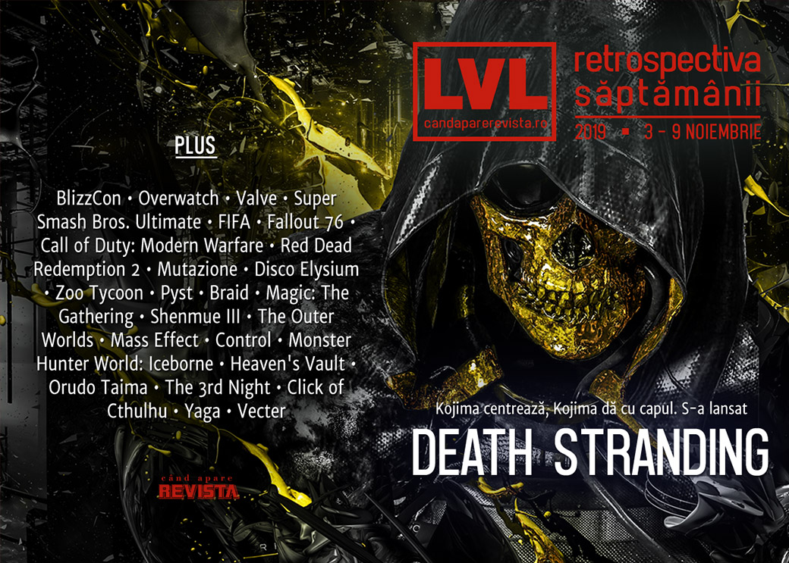

Două lansări importante săptămâna aceasta - **Death Stranding** al lui Hideo Kojima, lansat pe PS4 (iar din vară și pe PC), și **Red Dead Redemption 2**, care ajunge în sfârșit și pe PC. Animațiile din **Gris** au fost plagiate, Valve ne pregătește noutăți importante, lumea analizează încă BlizzCon 2019 și implicațiile sale, Eurogamer scoate la iveală o înțelegere de culise privind meciurile din **FIFA** (and in the game), iar un român pasionat a lansat un joc gratuit pe Steam: **Vecter**.

Linkuri rapide:

* [Știri](#știri)
* [Articole (critică, dev, design)](#articole-critică-dev-design)
* [Made în România](#made-în-românia)
* [Anunţuri şi lansări de jocuri](#anunțuri-şi-lansări-de-jocuri)
* [Prăvălii de jocuri](#prăvălii-de-jocuri)

## Știri

* Surprinzând pe nimeni, Hideo Kojima afirmă că vrea ca studioul lui să facă și filme în viitor. ([Kotaku](https://kotaku.com/in-the-future-hideo-kojima-says-his-studio-will-make-f-1839603527), [Polygon](https://www.polygon.com/2019/11/4/20948432/kojima-productions-movies-future-death-stranding), [Escapist](https://www.escapistmagazine.com/v2/hideo-kojima-says-his-studio-will-eventually-make-movies/))
* Jocul Gris a fost plagiat, publisher-ul Devolver acuzând o companie franceză că filmul de prezentare pentru aplicația lor de mobil a copiat scene, animații și alte elemente din jocul lor. Compania în cauză, The Fabulous, a șters filmul respectiv și a recunosc greșeala unuia dintre artiștii lor. ([Polygon](https://www.polygon.com/2019/11/5/20949895/devolver-digital-gris-the-fabulous-plaigiarism), [Vice](https://www.vice.com/en_us/article/8xw3mk/devolver-digital-alleges-self-help-app-rips-off-artistic-platformer-gris), [RPS](https://www.rockpapershotgun.com/2019/11/06/devolver-digital-allege-self-care-app-ripped-off-platformer-gris/), [PC Gamer](https://www.pcgamer.com/wellness-app-apologizes-for-ripping-off-devolvers-gris-in-its-intro-animation/#comment-jump))
* Super Smash Bros. Ultimate a devenit cel mai vândut joc de lupte din istorie, depășind, cu cele 53 de milioane de unități vândute, serii precum Tekken sau Street Fighter. ([Shacknews](https://www.shacknews.com/article/114799/super-smash-bros-ultimate-now-best-selling-fighting-game-ever), [Destructoid](https://www.destructoid.com/in-under-a-year-super-smash-bros-ultimate-is-the-best-selling-fighting-game-of-all-time-beating-nearly-three-decades-of-street-fighter-ii-history-571678.phtml))
* China impune noi restricții de gaming pentru minori, stabilind o limită de maxim 90 de minute de joc pe zi, precum și un prag monetar lunar pentru microtranzacții. ([PC Gamer](https://www.pcgamer.com/china-cracks-down-on-online-gaming-with-a-curfew-and-time-limits/), [Eurogamer](https://www.eurogamer.net/articles/2019-11-07-china-imposes-online-gaming-curfews-for-kids-to-tackle-addiction), [GameSpace](https://www.gamespace.com/no-index-follow/china-limits-gaming-screen-time-monetization-for-children/), [Shacknews](https://www.shacknews.com/article/114816/china-imposes-gaming-curfew-to-battle-video-game-addiction), [Kotaku](https://kotaku.com/china-bans-kids-from-playing-games-after-10pm-caps-mic-1839676106))
* Se pare că Valve ar lucra cu Apple pentru la un headset de AR (_augmented reality_), care ar urma să fie lansat cel mai devreme în la sfârșitul anului viitor. Se zvonește. ([VideoGamesChronicle](https://www.videogameschronicle.com/news/apple-reportedly-collaborating-with-valve-on-ar-headset/), [Eurogamer](https://www.eurogamer.net/articles/2019-11-04-valve-reportedly-working-with-apple-on-new-ar-head-mounted-display-devices), [PC Gamer](https://www.pcgamer.com/valve-and-apple-are-rumoured-to-be-developing-an-ar-headset/), [Shacknews](https://www.shacknews.com/article/114778/apple-is-reportedly-partnering-with-valve-for-ar-headset))
* Un alt zvon indică, pe baza unor mențiuni găsite în codul site-ului unor parteneri Steam, că Valve ar pregăti un serviciu de _cloud streaming_. ([Ars Technica](https://arstechnica.com/?p=1598301), [The Verge](https://www.theverge.com/2019/11/6/20952028/steam-valve-code-stadia-xcloud-cloud-gaming-service-competitor-streaming), [Destructoid](https://www.destructoid.com/valve-might-be-working-on-a-cloud-gaming-competitor-to-google-stadia-571736.phtml))

## Articole (critică, dev, design)

* [Video game design has tragically changed how I look at the world](https://www.polygon.com/2019/11/5/20930301/video-game-design-school-shootings-violence) (Polygon)
* [Congressman Shames Blizzard for Letting Nazis Run Wild in &#39;World of Warcraft&#39;](https://www.vice.com/en_us/article/3kxw4b/congressman-lou-correa-shames-blizzard-for-letting-nazis-run-wild-in-world-of-warcraft) (Vice)
* [The Guilty Pleasures of Video Game Violence Are a Mirror for Our Consumerist Nightmare](https://egmnow.com/the-guilty-pleasures-of-video-game-violence-are-a-mirror-for-our-consumerist-nightmare/) (EGM)
* [In 2020, I can no longer abide the 100-hour RPG](https://www.polygon.com/2019/11/7/20952172/outer-worlds-rpg-length-20-hour-game-100-hour-story-campaign) (Polygon)
* [My obsession with progression meters, and the art of shaping the player experience](https://www.eurogamer.net/articles/2019-11-09-my-obsession-with-progression-meters-and-the-art-of-shaping-the-player-experience) (Eurogamer)
* [In Japan's '80s PC magazines, games were included as sound on cheap vinyl 'albums'](https://www.pcgamer.com/in-japans-80s-pc-magazines-games-were-included-as-sound-on-cheap-vinyl-albums/) (PC Gamer)
* [2019 was the year that capitalism became video games&#039; greatest villain](https://www.windowscentral.com/2019-year-capitalism-became-video-games-greatest-villain) (Windows Central)

---

### Actualitate
#### BlizzCon
* [Despite Hong Kong protests, the mood at BlizzCon was cheerful](https://www.pcgamer.com/despite-hong-kong-protests-the-mood-at-blizzcon-was-cheerful/) (PC Gamer)
* [It was business as usual at Blizzcon despite Hong Kong protests](https://www.rockpapershotgun.com/2019/11/04/blizzcon-protestors-have-nothing-against-blizzards-developers/) (RPS)
* [Hearthstone Developers Wish Blizzard Had Handled Hong Kong Controversy Differently](https://kotaku.com/hearthstone-developers-wish-blizzard-had-handled-hong-k-1839616541) (Kotaku)
* ['I care about Blizzard but the Hong Kong situation is dire': the gaming convention rocked by protest](https://www.theguardian.com/games/2019/nov/08/blizzard-blizzcon-protest-hong-kong-world-of-warcraft) (The Guardian)
* [Blizzard's substance-less BlizzCon statement speaks volumes](https://www.gamesindustry.biz/articles/2019-11-04-blizzards-substance-less-blizzcon-statement-speaks-volumes-opinion) (GamesIndustry.biz)
* [At BlizzCon, most fans found a reason to move on from Hong Kong](https://venturebeat.com/2019/11/06/at-blizzcon-most-fans-found-a-reason-to-move-on-from-hong-kong/) (VentureBeat)
* [Hong Kong protesters shine, but don't quite spark at BlizzCon](https://www.gamasutra.com/view/news/353339/Hong_Kong_protesters_shine_but_dont_quite_spark_at_BlizzCon.php) (Gamasutra)

---

### Reportaj
* [Inside FIFA's &quot;dodging Discord&quot; scandal](https://www.eurogamer.net/articles/2019-11-07-inside-fifas-dodging-discord-scandal) (Eurogamer)  (TL;DR pe [Polygon](https://www.polygon.com/2019/11/8/20955150/fifa-20-collusion-match-dodging-discord-nycchris-kurt0411-esports))
* [Fallout 76’s aristocrats are fighting against ‘peasants’ without a subscription](https://www.polygon.com/2019/11/6/20950122/fallout-76-apocalyptic-aristocracy-peasants-class-war-bethesda-subscription-1st) (Polygon)

---

### _Not-a-review_
* [Call of Duty: Modern Warfare Is a Brutal and Disconcerting Portrayal of Combat](https://egmnow.com/call-of-duty-modern-warfare-is-a-brutal-and-disconcerting-portrayal-of-combat/) (EGM)
* [Death Stranding is so good that it shouldn’t have a sequel](https://www.theverge.com/2019/11/7/20953031/death-stranding-hideo-kojima-metal-gear-solid-sequel) (The Verge)
* [&#39;The Outer Worlds&#39; Isn&#39;t Revolutionary, It&#39;s a Warm Blanket](https://www.vice.com/en_us/article/bjwbx8/the-outer-worlds-isnt-revolutionary-its-a-warm-blanket) (Vice)
* [Goodbye Django, hello Westworld - why Red Dead Redemption 2&#039;s PC roleplay scene will be awesome](https://www.vg247.com/2019/11/08/red-dead-redemption-2-pc-roleplay-scene/) (VG247)
* [Planting Seeds in the Apocalypse](https://unwinnable.com/2019/11/07/planting-seeds-in-the-apocalypse/) (Unwinnable)
* [Let me tell you about my cockroach obsession in Disco Elysium](https://www.rockpapershotgun.com/2019/11/08/let-me-tell-you-about-my-cockroach-obsession-in-disco-elysium/) (RPS)
* (spoilers Disco Elysium) [The World is a Tough Place, but We All Live in It](http://www.bulletpointsmonthly.com/2019/11/06/the-world-is-a-tough-place-but-we-all-live-in-it/) (Bullet Points Monthly)

---

### Industrie
* [Cyrille Imbert, the Man Who Brings Gaming’s Past Back to Life](https://egmnow.com/cyrille-imbert-the-man-who-brings-gamings-past-back-to-life/) (EGM)
* [&quot;If we're going to be drug dealers, let's not literally mine for addicts&quot;](https://www.gamesindustry.biz/articles/2019-11-03-if-were-going-to-be-drug-dealers-lets-offer-people-psychedelics) (GamesIndustry.biz)
* [Report: Augmented reality hits the mainstream (SuperData)](https://gamedaily.biz/article/1365/report-augmented-reality-hits-the-mainstream-superdata) (GameDaily.biz)
* [A Knight In Shining Armor – Swen Vincke Talks The Long Road Of Larian Studios](https://www.gameinformer.com/interview/2019/11/07/a-knight-in-shining-armor-swen-vincke-talks-the-long-road-of-larian-studios) (Games Informer)
* [Has Blizzard solved the sequel dilemma?](https://www.gamesindustry.biz/articles/2019-11-08-has-blizzard-solved-the-sequel-dilemma-opinion) (GamesIndustry.biz)
* [Marc Merrill interview: Why Riot Games took a decade to come up with new games](https://venturebeat.com/2019/11/02/marc-merrill-interview-why-riot-games-took-a-decade-to-come-up-with-new-games/) (VentureBeat)
* [The DeanBeat: Gaming is still at the mercy of larger forces](https://venturebeat.com/2019/11/08/the-deanbeat-gaming-is-still-at-the-mercy-of-larger-forces/) (VentureBeat)
* [Death Stranding: Hideo Kojima on games, film, and their convergence](https://www.pcinvasion.com/death-stranding-kojima-games-cinema-convergence/) (PC Invasion)
* [A world  without bosses? The rise of the worker co-op](https://wireframe.raspberrypi.org/articles/a-world-without-bosses-the-rise-of-the-worker-co-op) (Wireframe magazine)

---

### Istorie, retrospectivă
* [Red Dead Redemption 2: one year after the hype](https://www.polygon.com/2019/4/22/18298277/red-dead-redemption-2-pc-review-rdr2-story-design-criticism) (Polygon)
* [18 years before Planet Zoo, everyone loved Zoo Tycoon](https://www.polygon.com/2019/11/5/20678783/zoo-tycoon-retrospective-blue-fang-games-planet-zoo) (Polygon)
* [Five Years Of &#x27;F&#x27; To Pay Respects](https://kotaku.com/five-years-of-f-to-pay-respects-1839604767) (Kotaku)
* [I Installed Windows 3.1 To Play A Myst Parody Starring John Goodman](https://kotaku.com/i-installed-windows-3-1-to-play-a-myst-parody-starring-1839618943) (Kotaku)
* [The most important games of the 2010s](https://games.avclub.com/the-most-important-games-of-the-2010s-1839520536) (A.V. Club)
* [Braid and the beauty of not wasting time](https://www.gamesindustry.biz/articles/2019-11-04-braid-and-the-beauty-of-not-wasting-time) (GamesIndustry.biz)
* Polygon’s “decade in review” (Polygon):
  * [The 100 best games of the decade (2010-2019): 100-51](https://www.polygon.com/features/2019/11/4/20944265/best-games-2019-2010-ps4-switch-xbox-pc-100-51) 
  * [The 100 best games of the decade (2010-2019): 50-11](https://www.polygon.com/features/2019/11/4/20944573/best-games-2019-2010-ps4-switch-xbox-pc-50-11) 
  * [The 100 best games of the decade (2010-2019): 10-1](https://www.polygon.com/features/2019/11/4/20947389/best-games-2019-2010-ps4-switch-xbox-pc-10-1) 
  * [League of Legends transformed the video game industry over the last decade](https://www.polygon.com/2019/11/6/20949846/league-of-legends-video-game-industry-riot-games)
  * [Nine new genres that defined the decade in games](https://www.polygon.com/features/2019/11/8/20943571/new-game-genres-decade-in-review-2020-battle-royale-fortnite-dark-souls)
  * [The Fallout franchise has had a risky roller coaster of a decade](https://www.polygon.com/2019/11/8/20937599/fallout-76-4-new-vegas-shelter-bethesda-obsidian)

---

### Dev, making of, mecanici
* [How Magic: The Gathering card sets are designed](https://www.rockpapershotgun.com/2019/11/06/how-magic-the-gathering-card-sets-are-designed/) (RPS)
* [Inside The Bizarre Development Of Shenmue III](https://www.gameinformer.com/2019/11/06/inside-the-bizarre-development-of-shenmue-iii) (Games Informer)
* [How Tim Cain's hatred of white chocolate made it into The Outer Worlds as an Easter egg](https://www.pcgamer.com/how-tim-cains-hatred-of-white-chocolate-made-it-into-the-outer-worlds-as-an-easter-egg/) (PC Gamer)
* [Video: A chat with Mac Walters on the unsolved mysteries of the Mass Effect universe](https://arstechnica.com/gaming/2019/11/video-a-chat-with-mac-walters-on-the-unsolved-mysteries-of-the-mass-effect-universe/) (Ars Technica)
* [Playing piano with a sledgehammer: creating Death Stranding’s unidentifiable score](https://www.theverge.com/2019/11/8/20954112/death-stranding-score-music-interview-joel-corelitz-ludvig-forssell) (The Verge)
* [The Sound of Death Stranding: Behind the Score of Hideo Kojima's New Game](https://www.pastemagazine.com/articles/2019/11/death-stranding-sound-design-interview.html) (Paste)
* [New York Tango: How Finnish Music and Culture Define Control](https://egmnow.com/new-york-tango-how-finnish-music-and-culture-define-control/) (EGM)
* [When Theme and Mechanics Collide](https://www.gamasutra.com/blogs/JamesMargaris/20191105/353367/When_Theme_and_Mechanics_Collide.php) (Gamasutra)
* [Monster Hunter World: Iceborne Postmortem: The Making of the Expansion and the Future of the Series](https://www.usgamer.net/articles/the-monster-hunter-world-iceborne-postmortem-interview) (USgamer)
* [Video: Game preservation lessons learned on EA's biggest sports games](https://www.gamasutra.com/view/news/353446/Video_Game_preservation_lessons_learned_on_EAs_biggest_sports_games.php) (Gamasutra)
* [Video: How Inkle created a dynamic detective story in  Heaven's Vault](https://www.gamasutra.com/view/news/353519/Video_How_Inkle_created_a_dynamic_detective_story_in_Heavens_Vault.php) (Gamasutra)

---

### Design, world-building, artă
* [Dali's take on Portal, and other gaming masterpieces](https://www.pcgamer.com/dalis-take-on-portal-and-other-gaming-masterpieces/) (PC Gamer)
* [Kristoffer Zetterstrand: A Video Essay](https://www.gamescenes.org/2019/11/video-kristoffer-zetterstrand-a-video-essay.html) (GAMESCENES)
* [Check out the gorgeous loading screens in The Outer Worlds](https://www.rockpapershotgun.com/2019/11/04/check-out-the-gorgeous-loading-screens-in-the-outer-worlds/) (RPS)
* [Ground Control To Major Dimitri](https://kotaku.com/ground-control-to-major-dimitri-1839487469) (Kotaku)

## Made în România

* AMC scrie despre prima ediție a RADAR (Romanian Artists Developing Alternative Realities). ([Blog AMC Studio](https://amcstudio.ro/amc_blog/video-games-art-at-the-1st-edition-of-radar-romanian-artists-developing-alternative-realities/))
* Un interviu sponsorizat pe Shacknews cu creatorii lui Yaga. ([Shacknews](https://www.shacknews.com/article/114857/yaga-interview-creativity-inspired-by-folklore-and-bad-luck-sponsored))
* S-a lansat **Vecter**, un _infinite runner_ gratuit creat de Taranasus. ([Romanian Game Developers](https://rogame.dev/2019/11/04/taranasus-a-lansat-vecter/), [Steam](https://store.steampowered.com/app/1175140/Vecter/))

## Anunțuri şi lansări de jocuri
* [Square Enix developing new IP that 'goes beyond the framework of existing action games'](https://www.destructoid.com/square-enix-developing-new-ip-that-goes-beyond-the-framework-of-existing-action-games--571666.phtml) (Destructoid)
* [Hitman 3 Is &#039;Well Underway,&#039; According to Hitman 2 Roadmap](https://www.escapistmagazine.com/v2/hitman-3-is-well-underway-according-to-hitman-2-roadmap/) (Escapist)

### Anunţate
* **Nebuchadnezzar**, un nou city builder cu tematică istorică în genul vechilor jocuri Impressions ([PC Gamer](https://www.pcgamer.com/nebuchadnezzar-channels-classic-city-builders-like-pharaoh-and-zeus/))
* **The Hive** ([DSOGaming](https://www.dsogaming.com/news/the-hive-is-a-new-round-based-first-person-looter-shooter-coming-to-the-pc-in-2020/))
* **I.G.I. Origins**, un prequel pentru seria **Project I.G.I** ([DSOGaming](https://www.dsogaming.com/news/i-g-i-origins-is-the-prequel-to-project-i-g-i-coming-to-the-pc-in-2021-first-details-and-screenshots/))
* **AO Tennis 2** ([DSOGaming](https://www.dsogaming.com/news/bigben-officially-announces-ao-tennis-2-coming-to-the-pc-in-january-2020/))

### Acum cu dată de lansare
* **Superliminal**: 12 noiembrie ([PC Gamer](https://www.pcgamer.com/superliminal-the-perspective-warping-puzzle-game-comes-out-next-week/))
* **Transport Fever 2**: 12 noiembrie ([GameSpace](https://www.gamespace.com/all-articles/news/transport-fever-2-release-date-announcement-trailer))
* **The Endless Mission**: 14 noiembrie ([PC Invasion](https://www.pcinvasion.com/the-endless-mission-steam-early-access/))
* **Mosaic**: 5 decembrie ([RPS](https://www.rockpapershotgun.com/2019/11/05/mosaic-brings-maximum-discomfort-on-pc-next-month/))

### Lansate
* 1 noiembrie: **Mario & Sonic at the Olympic Games Tokyo 2020** ([Nintendo Store](https://www.nintendo.com/games/detail/mario-and-sonic-at-the-olympic-games-tokyo-2020-switch/))
* 4 noiembrie: **Vecter** (early access) ([Steam](https://store.steampowered.com/app/1175140/Vecter/))
* 5 noiembrie: **Red Dead Redemption 2** ([Epic Store](https://www.epicgames.com/store/en-US/product/red-dead-redemption-2), [Rockstar Social Club](https://socialclub.rockstargames.com/store/rdr2))
* 5 noiembrie: **MOLEK-SYNTEZ** (early access) ([Steam](https://store.steampowered.com/app/1168880/MOLEKSYNTEZ/))
* 5 noiembrie: **Planet Zoo** ([Steam](https://store.steampowered.com/app/703080/Planet_Zoo/))
* 6 noiembrie: **Meteorfall: Krumit's Tale** (early access) ([Steam](https://store.steampowered.com/app/1073320/Meteorfall_Krumits_Tale/))
* 6 noiembrie: **A Year Of Rain** (early access) ([Steam](https://store.steampowered.com/app/319540/A_Year_Of_Rain/))
* 7 noiembrie: **Skybolt Zack** ([Steam](https://store.steampowered.com/app/909670/Skybolt_Zack/))
* 7 noiembrie: **1001st Hyper Tower** (iese din early access) ([Steam](https://store.steampowered.com/app/958050/1001st_Hyper_Tower/))
* 7 noiembrie: **Gangsters 1920** ([Steam](https://store.steampowered.com/app/1163490/Gangsters_1920/))
* 7 noiembrie: **Stay Cool, Kobayashi-San!** ([Steam](https://store.steampowered.com/app/836590/STAY_COOL_KOBAYASHISAN_A_RIVER_CITY_RANSOM_STORY/))
* 7 noiembrie: **Headsnatchers** ([Steam](https://store.steampowered.com/app/797410/Headsnatchers/))
* 8 noiembrie: **Need For Speed Heat** ([EA Store](https://www.ea.com/games/need-for-speed/need-for-speed-heat/buy))
* 8 noiembrie: **Death Stranding** ([PS Store](https://www.playstation.com/en-us/games/death-stranding-ps4/))

## Prăvălii de jocuri
### Știri
* [Epic Games Store exploit allows you to play and keep a game forever, without even buying it - DSOGaming](https://www.dsogaming.com/news/epic-games-store-exploit-allows-you-to-play-and-keep-a-game-forever-without-even-buying-it/) (DSOGaming)
* [Valve might be working on &quot;Steam Cloud Gaming](https://www.dsogaming.com/news/valve-might-be-working-on-steam-cloud-gaming/) (DSOGaming)
* [Indie storefront Itch.io now boasts 200,000 games](https://www.pcgamesinsider.biz/news/69987/itchio-reaches-200000-games/) (PCGamesInsider.biz)

### Articole
* [Sony has a PlayStation Now problem](https://arstechnica.com/gaming/2019/11/sony-has-a-playstation-now-problem/) (Ars Technica)

### Update catalog
* [Persona 5 and Hollow Knight added to PlayStation Now](https://egmnow.com/persona-5-and-hollow-knight-added-to-playstation-now/) (EGM)

### Jocuri gratis și free weekends
* [Fight and build in novel free platformer Orudo Taima](https://www.pcgamer.com/fight-and-build-in-novel-free-platformer-orudo-taima/) (PC Gamer)
* [Play The Elder Scrolls Online for free this week](https://www.shacknews.com/article/114798/play-the-elder-scrolls-online-for-free-this-week) (Shacknews)
* [Cities: Skylines is free to play this weekend, new DLC released](https://egmnow.com/cities-skylines-is-free-to-play-this-weekend-new-dlc-released/) (EGM)
* [The 3rd Night is a free adventure game that evokes classic survival horror](https://www.pcgamer.com/the-3rd-night-is-a-free-adventure-game-that-evokes-classic-survival-horror/) (PC Gamer)
* [Nuclear Throne and Ruiner are now free on the Epic Games store](https://www.videogameschronicle.com/news/nuclear-throne-and-ruiner-are-now-free-on-the-epic-games-store/) (VideoGamesChronicle)
* [American Truck Simulator is free for the weekend](https://www.destructoid.com/american-truck-simulator-is-free-for-the-weekend-571918.phtml) (Destructoid)
* [You can now play Just Cause 4 Reloaded for free on Steam until November 11th - DSOGaming](https://www.dsogaming.com/news/you-can-now-play-just-cause-4-reloaded-for-free-on-steam-until-november-11th/) (DSOGaming)
* [Summon the old gods with this free eldritch clicking game](https://www.pcgamer.com/summon-the-old-gods-with-this-free-eldritch-clicking-game/) (PC Gamer)

### Reduceri și promoții
* [Weekend PC Download Deals for Nov. 8: Four free Steam weekends](https://www.shacknews.com/article/114888/weekend-pc-download-deals-for-nov-8-four-free-steam-weekends) (Shacknews)
* [Weekend Console Download Deals for Nov. 8: Free Elder Scrolls Online weekend](https://www.shacknews.com/article/114881/weekend-console-download-deals-for-nov-8-free-elder-scrolls-online-weekend) (Shacknews)
* [Best PC gaming deals of the week &#8211; 8th November 2019](https://www.rockpapershotgun.com/2019/11/08/best-pc-gaming-deals-of-the-week-8th-november-2019/) (RPS)
* [StoryBundle Offers Nine Video Game Books](https://techraptor.net/gaming/news/storybundle-offers-nine-video-game-books) (TechRaptor)

---

{}
**Retrospectiva săptămânii** este rubrica duminicală în care trecem în revistă evenimentele săptămânii de pe frontul de gaming: știri şi articole (scrise de alții, bineînțeles, că e mai ușor aşa), industrie, lansări, oferte de jocuri, toate numai de savurat la cafeaua de duminică dimineața.

De asemenea, rubrica e deschisă oricui vrea și poate contribui. Dacă ai citit vreun articol sau vreo știre interesantă și crezi că merită incluse în retrospectiva săptămânii, te așteptăm pe forum pe unul dintre topicurile dedicate: [Știri](https://forum.candaparerevista.ro/viewtopic.php?f=4&t=46), [Articole](https://forum.candaparerevista.ro/viewtopic.php?f=4&t=206), [Gaming România](https://forum.candaparerevista.ro/viewtopic.php?f=4&t=1622)].
{}
