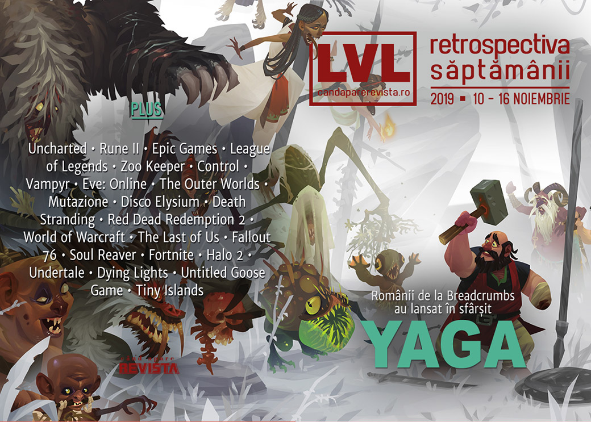

Conferința anuală Xbox și câteva lansări importante, aceasta a fost pe scurt săptămâna. Microsoft a organizat XO2019, unde a anunțat niște titluri noi și interesante, s-a închis studioul Human Head Studios, a fost anunțat și **Path of Exile 2** la doar o săptămână după anunțarea Diablo IV și s-au lansat **Age of Empires II: Definitive Edition** și **Star Wars Jedi: Fallen Order**. Iar pe plaiuri românești, s-a lansat **Yaga** pe Epic Store, iar alte două jocuri au demo, inclusiv **Unbound**.

Linkuri rapide:

* [Știri](#știri)
* [Articole (critică, dev, design)](#articole-critică-dev-design)
* [Made în România](#made-în-românia)
* [Anunţuri şi lansări de jocuri](#anunțuri-şi-lansări-de-jocuri)
* [Prăvălii de jocuri](#prăvălii-de-jocuri)

## Știri

* S-a închis studioul Human Head Studios, responsabil pentru seria Rune și vechiul Prey, după 22 de ani de activitate și la numai o zi după lansarea Rune II. Toți membrii studioului au primit oferte de angajare de la Bethesda, unde au format un studio nou: Roundhouse Studios ([PC Gamer](https://www.pcgamer.com/human-head-studios-is-closing-but-everyones-been-offered-jobs-at-bethesda/), [Eurogamer](https://www.eurogamer.net/articles/2019-11-13-prey-dev-human-head-studios-shut-as-team-joins-new-bethesda-studio), [Polygon](https://www.polygon.com/2019/11/13/20961896/decade-of-early-access-minecraft-star-citizen-fortnite), [VideoGamesChronicle](https://www.videogameschronicle.com/news/new-bethesda-studio-formed-as-human-head-studios-closes/), [Destructoid](https://www.destructoid.com/original-prey-studio-closes-bethesda-reopens-it-under-a-new-name-572349.phtml)). Anunțul a luat pe toată lumea prin surprindere, inclusiv pe publisher-ul Rune II, care a promis totuși că jocul va primi suport în continuare. ([PC Gamer](https://www.pcgamer.com/rune-2-publisher-promises-ongoing-support-despite-closure-of-human-head-studios/), [Shacknews](https://www.shacknews.com/article/114975/rune-2-will-continue-to-be-supported-after-human-head-closure))
* John Carmack renunță la rolul de CTO al Oculus (păstrând o poziție consultativă) pentru a se dedica domeniului inteligenței artificiale. ([PC Gamer](https://www.pcgamer.com/john-carmack-is-stepping-back-from-oculus-to-work-on-artificial-intelligence/), [Kotaku](https://kotaku.com/oculus-rift-s-john-carmack-is-stepping-down-from-his-ro-1839845797), [Variety](https://variety.com/2019/digital/news/oculus-cto-john-carmack-to-step-down-1203404229/))
* Epic Games cumpără compania Quixel, specializate pe crearea de [modele 3D ultrarealiste](https://www.youtube.com/watch?v=wnt64H-Wouk) prin tehnica fotogrammetriei. Toată librăria companiei este acum disponbilă gratuit utilizatorilor de Unreal Engine. ([PC Gamer](https://www.pcgamer.com/epic-games-acquires-quixel-and-its-huge-library-of-photogrammetry-assets/), [Eurogamer](https://www.eurogamer.net/articles/2019-11-12-megascans-becomes-free-for-unreal-engine-users-following-epics-acquisition-of-quixel))
* Și încă un tester e dat în judecată de Epic Games pentru leak-uri despre capitolul 2 al Fortnite. ([PC Gamer](https://www.pcgamer.com/another-fortnite-play-tester-is-being-sued-for-chapter-2-leaks/), [VideoGamesChronicle](https://www.videogameschronicle.com/news/epic-sues-another-alleged-fortnite-chapter-2-leaker/), [Eurogamer](https://www.eurogamer.net/articles/2019-11-13-epic-sues-yet-another-tester-for-leaking-info-on-fortnite-chapter-2), [GamesIndustry.biz](https://www.gamesindustry.biz/articles/2019-11-13-another-tester-is-being-sued-by-epic-games-for-leaking-fortnite-chapter-2))
* Mark Wahlberg a primit un rol în viitorul film Uncharted. Interesant e că e vorba de personajul Sully, după ce acum mai mulți ani, când s-a născut ideea filmului, Wahlberg era în discuții pentru rolul principal, cel al lui Nathan Drake. ([Kotaku](https://kotaku.com/the-uncharted-movie-has-been-in-hell-so-long-its-turned-1839839310), [VideoGamesChronicle](https://www.videogameschronicle.com/news/uncharted-movie-to-star-mark-wahlberg-as-sully/), [Destructoid](https://www.destructoid.com/mark-wahlberg-set-to-join-uncharted-movie-as-drake-s-mentor-sully-572473.phtml))
* Toate conturile de social media ale 2K au fost sparte, iar hackerii s-au distrat postând tot felul de mesaje (înțelegeți voi). ([Kotaku](https://kotaku.com/2ks-social-media-accounts-have-been-hacked-to-post-some-1839901366), [Eurogamer](https://www.eurogamer.net/articles/2019-11-16-2k-apologises-for-racist-social-media-posts-following-hack), [Polygon](https://www.polygon.com/2019/11/16/20968095/ronnie-2k-twitter-hacked-2k-games-borderlands-facebook), [PC Invasion](https://www.pcinvasion.com/2ks-social-accounts-have-been-hacked-and-its-pretty-bad/))

### XO2019
În perioada 14-16 noiembrie Microsoft a organizat X019, conferința anuală dedicată ecosistemului Xbox, de acum prezent în bună parte și pe PC. Sumarul anunțurilor: [PC Gamer](https://www.pcgamer.com/x019-event-news-how-to-watch/), [Kotaku](https://kotaku.com/everything-announced-for-xbox-one-and-pc-at-x019-1839867694), [Destructoid](https://www.destructoid.com/everything-that-happened-at-microsoft-s-x019-event-572541.phtml), [GameSpace](https://www.gamespace.com/all-articles/news/announcements-trailers-from-x019/), [The Verge](https://www.theverge.com/2019/11/14/20965398/microsoft-xbox-event-x019-news-xcloud-game-pass-updates), [PCGamesN](https://www.pcgamesn.com/x019-news-announcements-age-of-empires-4-halo-reach), [USgamer](https://www.usgamer.net/articles/microsoft-x019-recap-rares-new-game-yakuza-and-final-fantasy-on-game-pass-and-project-xcloud). Dintre noutăți:

* Project xCloud se lansează în 2020 ([Polygon](https://www.polygon.com/2019/11/14/20965401/project-xcloud-release-date-pc-dual-shock-4-support))
* Abonații Xbox Game Pass vor avea acces la game streaming prin Project xCloud ([Ars Technica](https://arstechnica.com/gaming/2019/11/stadia-what-xbox-game-streaming-will-become-part-of-game-pass-in-2020/), [PC Gamer](https://www.pcgamer.com/xcloud-game-streaming-is-coming-to-xbox-game-pass-and-windows-next-year/), [Destructoid](https://www.destructoid.com/project-xcloud-is-branching-out-to-windows-pc-next-year-572442.phtml))
* S-au decernat premiile Golden Joystick Awards 2019. Printre câștigători se numără **Outer Wilds** (Best Indie) și **Resident Evil 2** (GOTY). ([PC Gamer](https://www.pcgamer.com/how-to-watch-the-golden-joystick-awards-2019/))
* Alte articole:
  * [How RPG studio Obsidian ended up making a survival game](https://www.pcgamer.com/how-rpg-studio-obsidian-ended-up-making-a-survival-game/) (PC Gamer)
  * [The big XO19 interview: Xbox boss Phil Spencer on Game Pass, streaming and Project Scarlett](https://www.eurogamer.net/articles/2019-11-15-the-big-xo19-interview-xbox-boss-phil-spencer) (Eurogamer)
  * [“The pipeline of games that we have coming is more than we’ve ever had at any time in our history” - Xbox](https://www.vg247.com/2019/11/14/pipeline-games-coming-weve-ever-time-history-xbox/) (VG247)

## Articole (critică, dev, design)

* [Designing League of Legends’ stunning holographic Worlds opening ceremony](https://www.theverge.com/2019/11/11/20959206/league-of-legends-worlds-2019-opening-ceremony-holograms-holonet) (The Verge)
* [I visited locations from Yakuza and Shenmue in real life and it was very surreal](https://www.pcgamer.com/i-visited-locations-from-yakuza-and-shenmue-in-real-life-and-it-was-very-surreal/) (PC Gamer)
* [The Final Days Of Japan&#x27;s Most Incredible Arcade](https://kotaku.com/the-final-days-of-japans-most-incredible-arcade-1839860694) (Kotaku)
* [Impact of In-Game Items on Virtual Economy](https://www.gamespace.com/all-articles/news/impact-of-in-game-items-on-virtual-economy/) (GameSpace)
* [Gaming’s Pleasure Principle: How Virtual Worlds Make Our Creative Brains Come Alive­](https://egmnow.com/gamings-pleasure-principle-how-virtual-worlds-make-our-creative-brains-come-alive/) (EGM)
* [There&#8217;s serious potential in serious games](https://venturebeat.com/2019/11/12/theres-serious-potential-in-serious-games/) (VentureBeat)

---

### Actualitate
* [What happens if Stadia wins?](https://www.pcgamer.com/what-happens-if-stadia-wins/) (PC Gamer)
* [The world is waiting for Google Stadia to flop](https://www.theverge.com/2019/11/14/20964386/google-stadia-pre-launch-editorial-cloud-gaming) (The Verge)

---

### _Not-a-review_
* [What a Real Zoo Keeper Thinks of Planet Zoo](https://www.hardcoregamer.com/2019/11/11/what-a-real-zoo-keeper-thinks-of-planet-zoo/361705/) (Hardcore Gamer)
* [Remedy’s Control Is Actually a Cold War Thriller](https://egmnow.com/remedys-control-is-actually-a-cold-war-thriller/) (EGM)
* [Vampyr Quietly Raised the Bar for Video Game Romances](https://www.escapistmagazine.com/v2/vampyr-raised-the-bar-for-video-game-romance/) (Escapist)
* [The Last of Us is a game about lies](https://www.eurogamer.net/articles/2019-11-10-the-last-of-us-is-a-game-about-lies) (Eurogamer)
* [The 9-year journey to explore each of EVE Online's 7,805 solar systems](https://www.pcgamer.com/the-9-year-journey-to-explore-each-of-eve-onlines-7805-solar-systems/) (PC Gamer)
* [The Outer Worlds and Fallout: New Vegas Aren’t the Same](https://www.hardcoregamer.com/2019/11/11/the-outer-worlds-and-fallout-new-vegas-arent-the-same/361696/) (Hardcore Gamer)
* [The Personal Story Behind Parvati, the Surprise Star of &#39;The Outer Worlds&#39;](https://www.vice.com/en_us/article/3kxm43/the-personal-story-behind-parvati-the-surprise-star-of-the-outer-worlds) (Vice)
* [Mutazione Is a Quiet Lesson in Spiritual Botany](https://www.pastemagazine.com/articles/2019/11/mutazione-gardening.html) (Paste)
* [A Storm Is Blowing from Paradise: Disco Elysium on the Past and Present](https://medium.com/@alastairhadden/a-storm-is-blowing-from-paradise-disco-elysium-on-the-past-and-present-e2fff5d629be) (Medium)
* [American Nomad – Death Stranding and Public Infrastructure](https://www.rebind.io/american-nomad-death-stranding-and-public-infrastructure-3436/) (RE:BIND)

#### Death Stranding
* [Death Stranding Is a Collective Power Fantasy About Infrastructure and Aid](https://www.vice.com/en_us/article/a35md4/death-stranding-is-a-collective-power-fantasy-about-infrastructure-and-aid) (Vice)
* [Delivering Pizza Is the Best Part of Death Stranding](https://www.vice.com/en_us/article/kz4j8w/delivering-pizza-is-the-best-part-of-death-stranding) (Vice)
* [Death Stranding’s product placement is an act of vandalism](https://www.polygon.com/2019/11/14/20955496/death-stranding-monster-energy-product-placement-kojima) (Polygon)
* [Together, alone: the radical promise of pathfinding in Death Stranding](https://www.eurogamer.net/articles/2019-11-15-together-alone-the-radical-promise-of-pathfinding-in-death-stranding) (Eurogamer)
* [Spamming Like In Death Stranding Makes You Feel Real Good](https://kotaku.com/spamming-the-like-button-in-death-stranding-feels-reall-1839891971) (Kotaku)

---

### Industrie
* [Visiting post-acquisition Obsidian to see how much has changed](https://www.eurogamer.net/articles/2019-11-14-visiting-obsidian-post-acquisition-to-see-what-has-changed) (Eurogamer)
* [Doom creator John Romero on what's wrong with modern shooter games](https://www.theguardian.com/games/2019/nov/12/doom-creator-john-romero-shooter-games-id-software) (The Guardian)
* [Ignore the critics -- Tax Relief is vital to the UK games industry](https://www.gamesindustry.biz/articles/2019-11-12-ignore-the-critics-tax-relief-is-vital-to-the-uk-games-industry-opinion) (GamesIndustry.biz)
* [&quot;I believe I am preserving digital art in a physical form&quot;](https://www.gamesindustry.biz/articles/2019-11-13-i-believe-i-am-preserving-digital-art-in-a-physical-form) (GamesIndustry.biz)
* [The AR revolution creeps closer](https://www.gamesindustry.biz/articles/2019-11-15-the-ar-revolution-creeps-closer-opinion) (GamesIndustry.biz)
* [Xbox Game Pass frees developers from business model concerns, says Microsoft](https://gamedaily.biz/article/1403/xbox-game-pass-frees-developers-from-business-model-concerns-says-microsoft) (GameDaily.biz)
* [How Game Pass is transforming Xbox](https://www.gamesindustry.biz/articles/2019-11-14-how-game-pass-is-transforming-xbox) (GamesIndustry.biz)

---

### Istorie, retrospectivă
* [Forget Red Dead Redemption 2, Grand Theft Auto: San Andreas is Rockstar's most ambitious project](https://www.pcgamer.com/forget-red-dead-redemption-2-grand-theft-auto-san-andreas-is-rockstars-most-ambitious-project/) (PC Gamer)
* [&#39;World of Warcraft&#39; Changed Video Games and Wrecked Lives](https://www.vice.com/en_us/article/ywaj4w/world-of-warcraft-changed-video-games-and-wrecked-lives) (Vice)
* [Fallout 76, One Year Later](https://kotaku.com/fallout-76-one-year-later-1839873134) (Kotaku)
* [Soul Reaver: Audacious, pulpy, intelligent, trashy, uncompromising](https://www.gamesindustry.biz/articles/2019-11-11-soul-reaver-audacious-pulpy-intelligent-trashy-uncompromising) (GamesIndustry.biz)
* [How Fortnite made gaming accessible to everyone, one dab at a time](https://games.avclub.com/how-fortnite-made-gaming-accessible-to-everyone-one-da-1839671386) (A.V. Club)
* [When ‘Halo 2’ Invaded Planet Earth](https://www.theringer.com/2019/11/11/20958715/halo-2-anniversary-first-person-shooter-xbox-master-chief-history-i-love-bees) (The Ringer)
* [15 Years Later, November 2004 Might Still Be One Of The Best Months In Video Game History](https://kotaku.com/15-years-later-november-2004-might-still-be-one-of-the-1839905549) (Kotaku)
* Polygon’s “decade in review” (Polygon): 
  * [The most important games of the decade](https://www.polygon.com/2019/11/11/20955352/most-important-games-of-the-decade-2010-2019) 
  * [It’s been a weird decade for Warcraft](https://www.polygon.com/2019/11/11/20950708/world-of-warcraft-3-reforged-cataclysm-legion-azeroth-pandaria-warlords-blizzard-decade) (Polygon)
  * [Early access changed everything about games](https://www.polygon.com/2019/11/13/20961896/decade-of-early-access-minecraft-star-citizen-fortnite) (Polygon)
  * [The indie explosion that’s been going on for 30 years (give or take)](https://www.polygon.com/2019/11/15/20962788/indie-development-history-handmade-pixels) (Polygon)
  * [The decade when online video games changed everything](https://www.polygon.com/features/2019/11/11/20947872/decade-in-review-online-games-as-a-service) (Polygon)

---

### Dev, making of, mecanici
* [How the &quot;Last Living Soviet Video Game Developers&quot; Recruited Chapo Trap House for Disco Elysium](https://www.usgamer.net/articles/disco-elysium-chapo-trap-house-podcast-voice-acting-feature) (USgamer)
* [The Hidden Level Design of Undertale](https://www.gamasutra.com/blogs/SindenEnter/20191111/353699/The_Hidden_Level_Design_of_Undertale.php) (Gamasutra)
* [Video: How Techland built Dying Light 's remarkable parkour system](https://www.gamasutra.com/view/news/353952/Video_How_Techland_built_Dying_Lights_remarkable_parkour_system.php) (Gamasutra)
* [Tim Cain and Leonard Boyarsky's design lessons from The Outer Worlds](https://www.gamasutra.com/view/news/353939/Tim_Cain_and_Leonard_Boyarskys_design_lessons_from_The_Outer_Worlds.php) (Gamasutra)
* [How Mario 64 inspired that horrible goose's moveset](https://www.gamasutra.com/view/news/354076/How_Mario_64_inspired_that_horrible_gooses_moveset.php) (Gamasutra)
* [Designing Interesting Decisions in Games (And When Not To)](https://remptongames.com/2019/11/16/designing-interesting-decisions-in-games-and-when-not-to/) (Rempton Games)

---

### Design, world-building, artă
* [Function and Fiction](https://unwinnable.com/2019/11/12/destiny-2-function-fiction/) (Unwinnable)
* [Game Box Art Critique November: Death Stranding, Star Wars Jedi: Fallen Order, Pok&eacute;mon Sword](https://www.videogamer.com/features/game-box-art-critique-november-death-stranding-star-wars-jedi-fallen-order-pokemon-sword) (VideoGamer)
* [Gonna Take An Eva To Punch This Nazi](https://kotaku.com/gonna-take-an-eva-to-punch-this-nazi-1839815707) (Kotaku)

## Made în România
* S-a lansat **Yaga** pe Epic Store și primește și atenția presei internaționale, inclusiv de la PC Gamer. ([Go4Games](http://jocuri.go4it.ro/stiri-si-articole/rpg/yaga-action-rpg-ul-romanesc-de-inspiratie-folclorica-este-disponibil-acum-18576808), [PC Gamer](https://www.pcgamer.com/folklore-monsters-romanian-hip-hop-and-a-one-armed-blacksmith-star-in-this-action-rpg/), [PC Invasion](https://www.pcinvasion.com/yaga-the-years-quirkiest-rpg-is-out-today/))
* Alte două jocuri românești au acum demo jucabil: **WarriOrb** ([Steam](https://store.steampowered.com/app/1193760/WarriOrb_Prologue/)) și **Unbound: Worlds Apart**. ([Steam](https://store.steampowered.com/app/814680/Unbound_Worlds_Apart/))

## Anunțuri şi lansări de jocuri
### Anunţate

#### Titluri anunțate la XO2019
* **Last Stop**, un nou adventure de la creatorii lui Virginia și publicat de Annapurna ([RPS](https://www.rockpapershotgun.com/2019/11/14/last-stop-is-the-new-game-from-the-makers-of-virginia/))
* **Grounded**, un survival RPG la firul ierbii de la Obsidian ([Kotaku](https://kotaku.com/obsidian-s-next-game-is-a-survival-adventure-where-your-1839858401), [Polygon](https://www.polygon.com/2019/11/14/20964912/grounded-cooperative-survival-launch-date-price-obsidian-microsoft), [VideoGamesChronicle](https://www.videogameschronicle.com/news/obsidian-reveals-passion-project-survival-game-grounded/), [PC Gamer](https://www.pcgamer.com/in-grounded-an-adorable-survival-game-from-obsidian-youre-a-shrunken-kid-in-a-giant-backyard/))
* **Everwild** ([VideoGamesChronicle](https://www.videogameschronicle.com/news/rare-announces-everwild-a-truly-original-new-ip-led-by-conker-artist/), [PC Gamer](https://www.pcgamer.com/everwild-is-a-new-adventure-from-rare/), [Polygon](https://www.polygon.com/2019/11/14/20965184/rare-everwild-game-announced-xbox-one-windows-pc-x019))
* **West of Dead** un western twin stick shooter cu grafică cel-shaded și vocea lui Ron Perlman ([PC Gamer](https://www.pcgamer.com/west-of-dead-is-a-supernatural-wild-west-twin-stick-shooter-starring-ron-perlman/))
* **Tell Me Why**, un nou adventure episodic de la Dontnod ([PC Gamer](https://www.pcgamer.com/tell-me-why-is-a-new-adventure-game-from-the-life-is-strange-devs/), [Polygon](https://www.polygon.com/2019/11/14/20964705/dontnod-tell-me-why-life-is-strange-xbox-microsoft-release-date))
* **Drake Hollow**, un team-based builder-shooter de la creatorii lui The Flame in the Flood ([PC Gamer](https://www.pcgamer.com/drake-hollow-is-the-next-game-from-the-flame-in-the-flood-team/))

#### Alte anunțuri
* **Plan 8** ([PC Gamer](https://www.pcgamer.com/plan-8-is-a-gritty-looking-exosuit-mmo-shooter-coming-from-the-developers-of-black-desert-online/))
* **Path of Exile 2** ([PC Gamer](https://www.pcgamer.com/path-of-exile-2-announced-but-its-not-a-separate-game/), [Polygon](https://www.polygon.com/2019/11/15/20967242/path-of-exile-2-announced-exilecon-trailer-gameplay), [Kotaku](https://kotaku.com/path-of-exile-is-getting-a-sequel-1839898119)), iar primul Path of Exile primește și o versiune pentru mobil ([Polygon](https://www.polygon.com/2019/11/15/20967299/path-of-exile-mobile-grinding-gear-games-exilecon))

### Acum cu dată de lansare
* **Railroad Corporation** (iese din early access): 18 noiembrie ([PC Invasion](https://www.pcinvasion.com/railroad-corporation-leaves-early-access-on-november-18/))
* **Halo: Reach**: 3 decembrie ([PC Gamer](https://www.pcgamer.com/halo-reach-launches-december-3-on-pc/))
* **Wattam**: 17 decembrie ([PC Gamer](https://www.pcgamer.com/wattam-a-weird-new-game-from-the-creator-of-katamari-damacy-hits-pc-next-month/))
* **Commandos 2 HD Remastered** și **Praetorians HD Remastered**: 24 ianuarie 2020 ([PC Gamer](https://www.pcgamer.com/commandos-2-and-praetorians-remasters-are-coming-in-january/))
* **One-Punch Man: A Hero Nobody Knows**: 28 februarie ([Polygon](https://www.polygon.com/2019/11/15/20966715/one-punch-man-video-game-release-dates-ps4-pc-xbox-one))
* **Wasteland 3**: 19 martie 2020 ([VideoGamesChronicle](https://www.videogameschronicle.com/news/wasteland-3-release-set-for-may-2020/))
* **Bleeding Edge**: 24 martie 2020 ([Shacknews](https://www.shacknews.com/article/114996/bleeding-edge-celebrates-its-release-date-announcement-with-a-new-trailer))

### Lansate
* 12 noiembrie: **Unity of Command II** ([Steam](https://store.steampowered.com/app/809230/Unity_of_Command_II/))
* 12 noiembrie: **The Legend Of Bum-Bo** ([Steam](https://store.steampowered.com/app/1148650/The_Legend_of_BumBo/))
* 12 noiembrie: **Superliminal** ([Epic Store](https://www.epicgames.com/store/en-US/product/superliminal/))
* 12 noiembrie: **Rune II** ([Epic Store](https://www.epicgames.com/store/en-US/product/rune-2/))
* 12 noiembrie: **Yaga** ([Epic Store](https://www.epicgames.com/store/en-US/product/yaga/))
* 13 noiembrie: **Battle Breakers** ([Epic Store](https://www.epicgames.com/store/en-US/product/battle-breakers))
* 14 noiembrie: **Bee Simulator** ([Epic Store](https://www.epicgames.com/store/en-US/product/bee-simulator/home))
* 14 noiembrie: **Sparklite** ([Steam](https://store.steampowered.com/app/943140/Sparklite/), [gog.com](https://www.gog.com/game/sparklite))
* 14 noiembrie: **Terminator: Resistance** ([Steam](https://store.steampowered.com/app/954740/Terminator_Resistance/))
* 14 noiembrie: **Blacksad: Under The Skin** ([Steam](https://store.steampowered.com/app/1003890/Blacksad_Under_the_Skin/), [gog.com](https://www.gog.com/game/blacksad_under_the_skin))
* 14 noiembrie: **Age of Empires II: Definitive Edition** ([Steam](https://store.steampowered.com/app/813780/Age_of_Empires_II_Definitive_Edition/))
* 15 noiembrie: **Star Wars Jedi: Fallen Order** ([EA Store](https://www.ea.com/games/starwars/jedi-fallen-order/buy))

## Prăvălii de jocuri
### Știri
* [Steam now lets you ditch its fancy new library for a more compact alternative](https://www.rockpapershotgun.com/2019/11/15/steam-now-lets-you-ditch-its-fancy-new-library-for-a-more-compact-alternative/) (RPS)
* [Indie developer praises Steam's discoverability feature](https://www.gamereactor.eu/indie-developer-praises-steams-discoverability-feature/) (Gamereactor)

### Articole
* [Key resellers claim legitimacy -- the courts say otherwise](https://www.gamesindustry.biz/articles/2019-11-11-key-resellers-claim-legitimacy-the-courts-say-otherwise) (GamesIndustry.biz)

### Update catalog
* [Halo Reach, Flight Simulator, and Yakuza games are coming to Xbox Game Pass PC](https://www.pcgamer.com/halo-reach-flight-simulator-and-yakuza-games-are-coming-to-xbox-game-pass-pc/) (PC Gamer)
* [Xbox Game Pass now $1 for three months, with a ton of new games coming](https://www.polygon.com/2019/11/14/20965134/xbox-game-pass-games-deals-library-list-new-users-pc-xbox-one) (Polygon)

### Jocuri gratis și free weekends
* [Tiny Islands lets you pen the perfect archipelago](https://www.rockpapershotgun.com/2019/11/11/tiny-islands-lets-you-pen-the-perfect-archipelago/) (RPS)
* [Pick up The Messenger for free on the Epic Games Store](https://www.destructoid.com/pick-up-the-messenger-for-free-on-the-epic-games-store-572508.phtml) (Destructoid)
* [Survive the robocalypse in stealthy free game The Last Resistance](https://www.pcgamer.com/survive-the-robocalypse-in-stealthy-free-game-the-last-resistance/) (PC Gamer)
* [Squad is free to play this weekend](https://www.pcgamer.com/squad-is-free-to-play-this-weekend/) (PC Gamer)

### Reduceri și promoții
* [Weekend PC Download Deals for Nov. 15: Free Company of Heroes 2](https://www.shacknews.com/article/115028/weekend-pc-download-deals-for-nov-15-free-company-of-heroes-2) (Shacknews)
* [Weekend Console Download Deals for Nov. 15: X019 Flash Sale](https://www.shacknews.com/article/115027/weekend-console-download-deals-for-nov-15-x019-flash-sale) (Shacknews)
* [Best PC gaming deals of the week &#8211; 15th November 2019](https://www.rockpapershotgun.com/2019/11/15/best-pc-gaming-deals-of-the-week-15th-november-2019/) (RPS)

---

{}
**Retrospectiva săptămânii** este rubrica duminicală în care trecem în revistă evenimentele săptămânii de pe frontul de gaming: știri şi articole (scrise de alții, bineînțeles, că e mai ușor aşa), industrie, lansări, oferte de jocuri, toate numai de savurat la cafeaua de duminică dimineața.

De asemenea, rubrica e deschisă oricui vrea și poate contribui. Dacă ai citit vreun articol sau vreo știre interesantă și crezi că merită incluse în retrospectiva săptămânii, te așteptăm pe forum pe unul dintre topicurile dedicate: [Știri](https://forum.candaparerevista.ro/viewtopic.php?f=4&t=46), [Articole](https://forum.candaparerevista.ro/viewtopic.php?f=4&t=206), [Gaming România](https://forum.candaparerevista.ro/viewtopic.php?f=4&t=1622)].
{}
