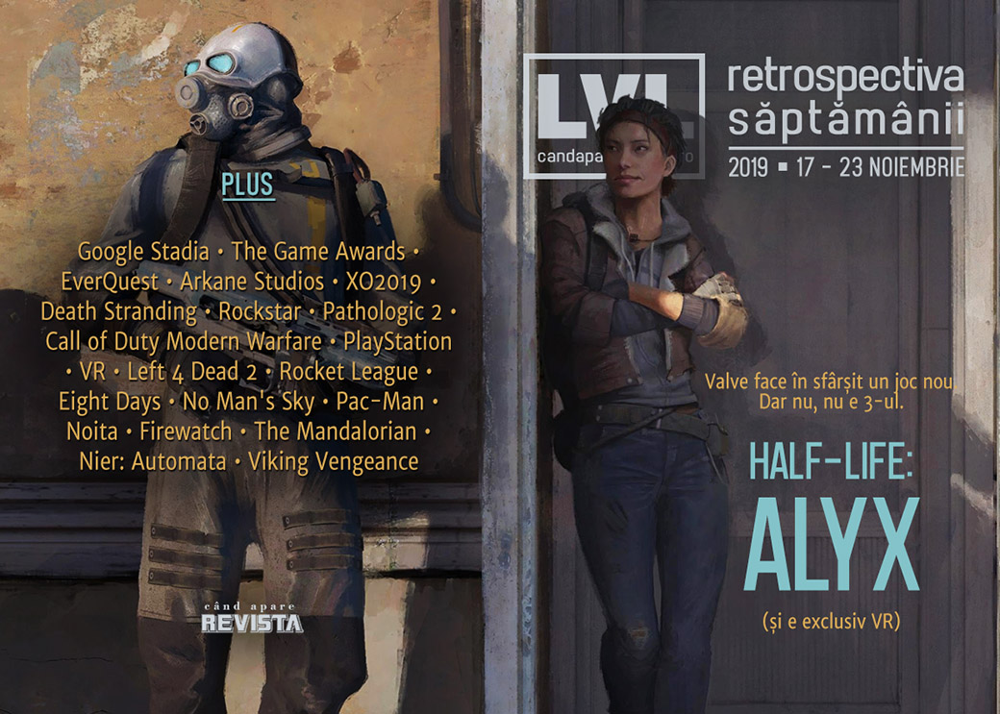

Știrea săptămânii e că vom avea un joc Half-Life. Controversa săptămânii e că noul joc Half-Life va fi exclusiv VR. Și Google Stadia s-a lansat, cu impresii pe măsura așteptărilor: tehnologie bună, dar ofertă slabă. Dar profităm de ocazie pentru articole pe temele VR și _cloud streaming_, avem oferte de Black Friday la magazinele de jocuri și un nou joc românesc caută finanțare pe Kickstarter: **Viking Vengeance**.

Linkuri rapide:

* [Știri](#știri)
* [Articole (critică, dev, design)](#articole-critică-dev-design)
* [Made în România](#made-în-românia)
* [Anunţuri şi lansări de jocuri](#anunțuri-şi-lansări-de-jocuri)
* [Prăvălii de jocuri](#prăvălii-de-jocuri)

## Știri

* S-a lansat Google Stadia, dar primirea nu a fost una foarte pozitivă - tehnologia de streaming funcționează bine, dar modelul de afaceri și catalogul foarte redus de jocuri nu alcătuiesc o ofertă atractivă. ([GamesIndustry.biz](https://www.gamesindustry.biz/articles/2019-11-21-google-stadia-critical-consensus), [VG247](https://www.vg247.com/2019/11/18/google-stadia-reviews-round-up/), [PCGamesN](https://www.pcgamesn.com/stadia/review))
* Au fost anunțate nominalizările pentru The Game Awards 2019 - Death Stranding și Control sunt prezente în cele mai multe categorii. ([PC Gamer](https://www.pcgamer.com/death-stranding-and-control-lead-the-game-awards-2019-nominations/), [VideoGamesChronicle](https://www.videogameschronicle.com/news/death-stranding-and-control-lead-game-awards-2019-nominations/), [Destructoid](https://www.destructoid.com/death-stranding-and-control-lead-the-way-among-2019-game-awards-nominees-572959.phtml), [Shacknews](https://www.shacknews.com/article/115081/the-game-awards-2019-nominees-and-how-to-vote), [EGM](https://egmnow.com/the-game-awards-2019-nominees-revealed/))
* A murit Brad McQuaid la vârsta de 51 de ani. Veteran al industriei, McQuaid a avut o influență importantă în dezvoltarea MMO-urilor, fiind cunoscut în principal pentru rolul de _lead developer_ pentru EverQuest. ([Ars Technica](https://arstechnica.com/gaming/2019/11/everquest-lead-producer-and-designer-brad-mcquaid-has-passed-away/), [Destructoid](https://www.destructoid.com/everquest-designer-and-producer-brad-mcquaid-has-passed-away-573038.phtml))
* Fondatorul Arkane Studios, Raphael Colantonio, care părăsise compania în 2017, a înființat un studio nou, WolfEye și lucrează la un joc nou ce va fi anunțat în cadrul The Game Awards. ([PC Gamer](https://www.pcgamer.com/former-arkane-bosses-launch-a-new-studio-first-game-will-be-revealed-at-the-game-awards/), [VideoGamesChronicle](https://www.videogameschronicle.com/news/former-arkane-president-forms-new-studio-wolfeye/), [Escapist](https://www.escapistmagazine.com/v2/former-arkane-devs-to-reveal-new-studios-first-project-at-game-awards/), [GameDaily.biz](https://gamedaily.biz/article/1411/arkane-founder-and-former-executive-producer-team-up-to-form-wolfeye-studios), [GamesIndustry.biz](https://www.gamesindustry.biz/articles/2019-11-20-arkane-veterans-launch-wolfeye-a-small-studio-making-big-games))

## Articole (critică, dev, design)

* [Fear of an Irradiated Planet](https://egmnow.com/fear-of-an-irradiated-planet/) (EGM)
* [In The Era Of &#x27;Live&#x27; Games Like Fortnite And Overwatch, Sequels Are Changing](https://kotaku.com/in-the-era-of-live-games-like-fortnite-and-overwatch-s-1839922028) (Kotaku)
* [With Overwatch 2 and Path of Exile 2, sequels are really challenging the meaning of '2'](https://www.pcgamer.com/with-overwatch-2-and-path-of-exile-2-sequels-are-really-challenging-the-meaning-of-2/) (PC Gamer)
* [Competition is wild, joyous and fulfilling &#8211; except when it isn&#8217;t](https://www.rockpapershotgun.com/2019/11/21/competition-is-wild-joyous-and-fulfilling-except-when-it-isnt/) (RPS)
* [Video Game Ladders Suck. Here&#039;s Why that Matters](https://egmnow.com/video-game-ladders-suck-heres-why-that-matters/) (EGM)
* [Building Stronger Communities](https://www.gameinformer.com/feature/2019/11/18/building-stronger-communities) (Games Informer)
* [Video game influencers are disrupting data capitalism and building new communities](https://qz.com/1749836/video-game-influencers-are-disrupting-data-capitalism-and-building-communities/) (Quartz)
* [The evolution of online gaming threatens extinction for the disconnected life](https://games.avclub.com/the-evolution-of-online-gaming-threatens-extinction-for-1839897254) (A.V. Club)
* [Neo-Retro: Modern games that build on the past](https://wireframe.raspberrypi.org/articles/neo-retro-modern-games-that-build-on-the-past) (Wireframe magazine)

---

### Actualitate
* [The X019 Experience](https://www.kotaku.co.uk/2019/11/18/the-x019-experience) (Kotaku)
* [Remembering the life and work of legendary MMO designer Brad &#8216;Aradune&#8217; McQuaid](https://massivelyop.com/2019/11/20/reminiscing-on-the-life-and-work-of-legendary-mmo-designer-brad-aradune-mcquaid/) (Massively OP)
* [Death Stranding&#x27;s Nominations At The Game Awards Can&#x27;t Help But Raise Questions](https://kotaku.com/death-strandings-nominations-at-the-game-awards-cant-he-1840005746) (Kotaku)
* [The Biggest Game Awards 2019 Snubs and Surprises: Disco Elysium and Outer Wilds Miss Out](https://www.usgamer.net/articles/the-biggest-game-awards-2019-snubs-disco-elysium-and-outer-wilds-miss-out) (USgamer)
* [A new Half-Life would have to be VR](https://www.eurogamer.net/articles/2019-11-19-a-new-half-life-would-have-to-be-vr) (Eurogamer)
* [Half-Life: Alyx Can Be the Killer App to Push VR into the Mainstream](https://www.escapistmagazine.com/v2/half-life-alyx-killer-app-vr-valve-index-oculus/) (Escapist)

#### Stadia
* [Stadia's bizarre business model means it's swimming upstream at launch](https://www.eurogamer.net/articles/2019-11-18-google-stadias-bizarre-business-model-means-its-swimming-upstream-at-launch) (Eurogamer)
* [Stadia delivers on low-latency, high quality cloud gaming - but is that enough?](https://www.gamasutra.com/view/news/354209/Stadia_delivers_on_lowlatency_high_quality_cloud_gaming__but_is_that_enough.php) (Gamasutra)

---

### _Not-a-review_
* [The past, present, and future of Rockstar&rsquo;s world-conquering Grand Theft Auto Online](https://www.pcgamer.com/the-past-present-and-future-of-rockstars-world-conquering-grand-theft-auto-online/) (PC Gamer)
* [A Russian Crucible: Pathologic 2 and the Problem of Video Game Difficulty](https://egmnow.com/a-russian-crucible-pathologic-2-and-the-problem-of-video-game-difficulty/) (EGM)
* [How Modern Warfare smooths over the horrors of war](https://arstechnica.com/gaming/2019/11/how-modern-warfare-smooths-over-the-horrors-of-war/) (Ars Technica)

#### Death Stranding
* [Kojima Uses Poop and Pee with Purpose in Metal Gear &amp; Death Stranding](https://www.escapistmagazine.com/v2/kojima-uses-poop-and-pee-with-purpose-in-metal-gear-death-stranding/) (Escapist)
* [Unlucky Skin](http://deep-hell.com/unlucky-skin/) (DEEP HELL)
* [Does Death Stranding capture the essence of the delivery driver?](https://www.videogamer.com/features/does-death-stranding-capture-the-essence-of-the-delivery-driver) (VideoGamer)

---

### Industrie
* [Diablo's creators talk about Blizzard's past and present, China, and Diablo 4's reveal](https://www.pcgamer.com/diablos-creators-talk-about-blizzards-past-and-present-china-and-diablo-4s-reveal/) (PC Gamer)
* [Patrice D&eacute;silets on building his studio and leaning into being 'the Assassin's Creed guy'](https://gamedaily.biz/article/1421/patrice-deacutesilets-on-building-his-studio-and-leaning-into-being-the-assassins-creed-guy) (GameDaily.biz)
* [PlayStation has 100 million reasons to feel confident](https://www.gamesindustry.biz/articles/2019-11-19-opinion-playstation-has-100-million-reasons-to-feel-confident) (GamesIndustry.biz)
* [The State of Cloud Gaming in the Lead Up to Google Stadia](https://gamedaily.biz/article/1409/the-state-of-cloud-gaming-in-the-lead-up-to-google-stadia) (GameDaily.biz)
* [VR would be &quot;a really dark space right now&quot; without Facebook's money](https://www.gamesindustry.biz/articles/2019-11-21-vr-would-be-a-really-dark-space-right-now-without-facebooks-money) (GamesIndustry.biz)

---

### Istorie, retrospectivă
* [As Left 4 Dead 2 turns 10, we speak to its creators about the Valve game that won't die](https://www.eurogamer.net/articles/2019-11-17-as-left-4-dead-2-turns-10-we-speak-to-its-creators-about-the-game-that-wont-die) (Eurogamer)
* [Rocket League was secretly way ahead of its time](https://www.polygon.com/gaming/2019/11/21/20963896/rocket-league-cross-platform-twitch-esports) (Polygon)
* [The story of Eight Days, one of Sony’s canceled big bets](https://www.polygon.com/features/2019/11/20/20973181/the-story-of-eight-days-one-of-sonys-canceled-big-bets) (Polygon)
* [The never-ending journey of No Man's Sky](https://www.gamesindustry.biz/articles/2019-11-18-the-never-ending-journey-of-no-mans-sky) (GamesIndustry.biz)
* [From Jedi: Fallen Order to Bushido Blade: The 35 Year Quest for the Perfect Video Game Lightsaber](https://www.usgamer.net/articles/from-history-of-the-lightsaber-in-games) (USgamer)
* [Pac-Man Patterns: The Secret to a High Score](https://tedium.co/2019/11/19/pac-man-patterns-history/) (Tedium)

---

### Dev, making of, mecanici
* [Why you can anger the gods in Noita](https://www.rockpapershotgun.com/2019/11/20/why-you-can-anger-the-gods-in-noita/) (RPS)
* [Video: How Rockstar tackles environment design as spatial cinematography](https://www.gamasutra.com/view/news/354268/Video_How_Rockstar_tackles_environment_design_as_spatial_cinematography.php) (Gamasutra)
* [Video: Inside the art design of  Firewatch](https://www.gamasutra.com/view/news/354435/Video_Inside_the_art_design_of_Firewatch.php) (Gamasutra)
* [Why &#8216;The Mandalorian&#8217; cites Fortnite dev Epic Games in its credits](https://venturebeat.com/2019/11/19/why-the-mandalorian-cites-fortnite-dev-epic-games-in-its-credits/) (VentureBeat)

---

### Design, world-building, artă
* [Space and Place(lessness) in NieR: Automata](https://egmnow.com/space-and-placelessness-in-nier-automata/) (EGM)

## Made în România
* **Viking Vengeance** a pornit o campanie de finanțare pe Kickstarter. ([Kickstarter](https://www.kickstarter.com/projects/vikingvengeance/viking-vengeance))
* [Industria studiourilor dezvoltatoare de jocuri video din România continuă să crească](https://jocuri.go4it.ro/stiri-si-articole/diverse/industria-studiourilor-dezvoltatoare-de-jocuri-video-din-romania-continua-sa-creasca-18591649) (bazat pe [Raportul RGDA pentru anul 2018](http://rgda.ro/romanian-industry-report/)). (Go4Games) 

## Anunțuri şi lansări de jocuri
* [Reports: Resident Evil 3 Remake Planned For 2020](https://kotaku.com/reports-resident-evil-3-remake-planned-for-2020-1840001343) (Kotaku)

### Anunţate
* **Half-Life: Alyx** ([PC Gamer](https://www.pcgamer.com/half-life-alyx-is-a-full-length-game-set-before-half-life-2/), [Kotaku](https://kotaku.com/half-life-alyx-takes-place-between-half-life-1-and-hal-1839979794), [RPS](https://www.rockpapershotgun.com/2019/11/21/half-life-alyx-is-a-vr-prequel-to-hl2-coming-in-march-2020/), [Ars Technica](https://arstechnica.com/gaming/2019/11/half-life-alyx-will-fill-in-the-gaps-between-half-life-and-half-life-2/)) (plus [Valve explains why Half-Life: Alyx is a VR exclusive](https://www.eurogamer.net/articles/2019-11-22-valve-explains-why-half-life-alyx-is-a-vr-exclusive) (Eurogamer))
* **Broken Lines** ([PC Gamer](https://www.pcgamer.com/broken-lines-looks-like-x-com-mixed-with-darkest-dungeons-in-an-alt-history-ww2/))
* **Dragon Quest Builders 2** vine și pe PC ([Eurogamer](https://www.eurogamer.net/articles/2019-11-18-dragon-quest-builders-2-is-heading-to-pc-in-december))

### Acum cu dată de lansare
* **Detroit: Become Human** (PC): 12 decembrie ([Eurogamer](https://www.eurogamer.net/articles/2019-11-19-detroit-become-human-arrives-on-pc-next-month))

### Lansate
* 19 noiembrie: **Gylt** ([Site oficial Gylt](http://www.gyltthegame.com/))
* 19 noiembrie: **Narcos Rise Of The Cartels** ([Steam](https://store.steampowered.com/app/914110/Narcos_Rise_of_the_Cartels/))
* 19 noiembrie: **Shenmue III** ([Epic Store](https://www.epicgames.com/store/en-US/product/shenmue-3))
* 19 noiembrie: **Football Manager 2020** ([Steam](https://store.steampowered.com/app/1100600/Football_Manager_2020/))
* 20 noiembrie: **Still There** ([Steam](https://store.steampowered.com/app/1063490/Still_There/), [gog.com](https://www.gog.com/game/still_there))
* 21 noiembrie: **Black Future ’88** ([Steam](https://store.steampowered.com/app/751820/Black_Future_88/), [gog.com](https://www.gog.com/game/black_future_88))
* 21 noiembrie: **BATTLETECH Heavy Metal** ([Steam](https://store.steampowered.com/app/1151170/BATTLETECH_Heavy_Metal/), [gog.com](https://www.gog.com/game/battletech_heavy_metal))
* 21 noiembrie: **Bug Fables: The Everlasting Sapling** ([Steam](https://store.steampowered.com/app/1082710/Bug_Fables_The_Everlasting_Sapling/))
* 21 noiembrie: **Sigma Theory: Global Cold War** ([Steam](https://store.steampowered.com/app/716640/Sigma_Theory_Global_Cold_War/), [gog.com](https://www.gog.com/game/sigma_theory_global_cold_war))
* 22 noiembrie: **Wrath: Aeon of Ruin** (early access) ([Steam](https://store.steampowered.com/app/1000410/WRATH_Aeon_of_Ruin/), [gog.com](https://www.gog.com/game/wrath_aeon_of_ruin))
* 22 noiembrie: **Kings of Lorn: The Fall of Ebris** ([Steam](https://store.steampowered.com/app/605140/Kings_of_Lorn_The_Fall_of_Ebris/))
* 22 noiembrie: **Lost Ember** ([Steam](https://store.steampowered.com/app/563840/LOST_EMBER/), [gog.com](https://www.gog.com/game/lost_ember))
* 22 noiembrie: **Sniper Ghost Warrior Contracts** ([Steam](https://store.steampowered.com/app/973580/Sniper_Ghost_Warrior_Contracts/), [gog.com](https://www.gog.com/game/sniper_ghost_warrior_contracts))

## Prăvălii de jocuri
### Știri
* [Steam Remote Play Together launches today, taking couch co-op online](https://www.polygon.com/2019/11/20/20974781/steam-remote-play-together-release-date-pc-linux-ios-android-mac) (Polygon)

### Update catalog
* [Darksiders 3, Subnautica, and more are now on Game Pass for PC](https://www.pcgamesn.com/darksiders-3/game-pass) (PCGamesN)

### Jocuri gratis și free weekends
* [Bad North now free on the Epic Games store, Rayman Legends is up next](https://www.videogameschronicle.com/news/bad-north-now-free-on-the-epic-games-store-rayman-legends-is-up-next/) (VideoGamesChronicle)
* [Vermintide 2 is free for the weekend on Steam](https://www.pcgamer.com/vermintide-2-is-free-for-the-weekend-on-steam/) (PC Gamer)
* [Rainbow Six Siege partners with Netflix for a free week of crime](https://www.rockpapershotgun.com/2019/11/20/rainbow-six-siege-partners-with-netflix-for-a-free-week-of-crime/) (RPS)
* [Co-op rat-smasher Warhammer: Vermintide 2 is free to play on Steam this weekend](https://www.eurogamer.net/articles/2019-11-21-co-op-rat-smasher-warhammer-vermintide-2-is-free-to-play-on-steam-this-weekend) (Eurogamer)
* [Star Citizen's 12-day Free Fly event kicks off this Sunday](https://www.eurogamer.net/articles/2019-11-22-star-citizens-12-day-free-fly-event-kicks-off-this-sunday) (Eurogamer)

### Reduceri și promoții
* [Red Dead Redemption 2 and The Outer Worlds are on sale in the Humble Store Fall Sale](https://www.pcgamer.com/red-dead-redemption-2-and-the-outer-worlds-are-on-sale-in-the-humble-store-fall-sale/) (PC Gamer)
* [Epic Games Store slashes prices on Red Dead Redemption 2, Borderlands 3, and more for Black Friday](https://www.theverge.com/good-deals/2019/11/22/20978000/epic-games-store-black-friday-cyber-monday-sale-discount-deal) (The Verge)
* [Weekend Console Download Deals for Nov. 22: Pre-Black Friday 2019](https://www.shacknews.com/article/115149/weekend-console-download-deals-for-nov-22-pre-black-friday-2019) (Shacknews)
* [Weekend PC Download Deals for Nov. 22: Pre-Black Friday 2019](https://www.shacknews.com/article/115150/weekend-pc-download-deals-for-nov-22-pre-black-friday-2019) (Shacknews)
* [PlayStation Store's PS4 Black Friday sale has begun](https://www.destructoid.com/playstation-store-s-ps4-black-friday-sale-has-begun-573218.phtml) (Destructoid)
* [Best PC gaming deals of the week &#8211; 22nd November 2019](https://www.rockpapershotgun.com/2019/11/22/best-pc-gaming-deals-of-the-week-22nd-november-2019/) (RPS)

---

{}
**Retrospectiva săptămânii** este rubrica duminicală în care trecem în revistă evenimentele săptămânii de pe frontul de gaming: știri şi articole (scrise de alții, bineînțeles, că e mai ușor aşa), industrie, lansări, oferte de jocuri, toate numai de savurat la cafeaua de duminică dimineața.

De asemenea, rubrica e deschisă oricui vrea și poate contribui. Dacă ai citit vreun articol sau vreo știre interesantă și crezi că merită incluse în retrospectiva săptămânii, te așteptăm pe forum pe unul dintre topicurile dedicate: [Știri](https://forum.candaparerevista.ro/viewtopic.php?f=4&t=46), [Articole](https://forum.candaparerevista.ro/viewtopic.php?f=4&t=206), [Gaming România](https://forum.candaparerevista.ro/viewtopic.php?f=4&t=1622)].
{}
