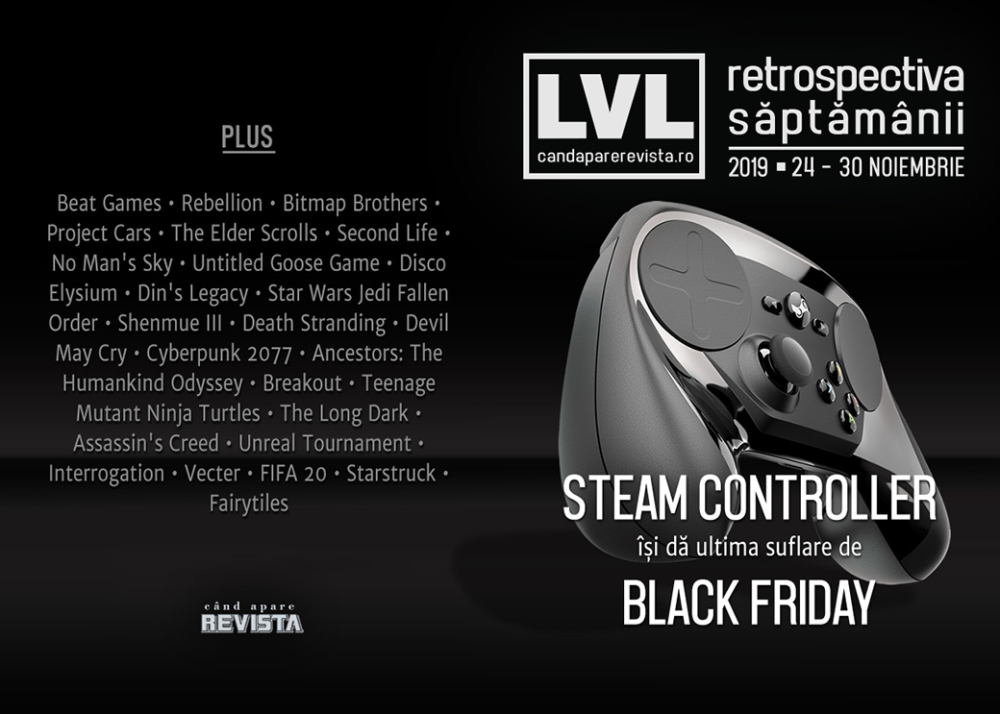

Săptămână lipsită de evenimente notabile, numai bine ca să ne concentrăm pe mulțimea de oferte de Black Friday prezente la mai toate prăvăliile de jocuri. Câteva anunțuri se remarcă, totuși: Valve renunță la Steam Controller și au fost anunțate două titluri interesante - un succesor spiritual pentru **C&C Renegade** și un joc nou în seria **To The Moon**.

Linkuri rapide:

* [Știri](#știri)
* [Articole (critică, dev, design)](#articole-critică-dev-design)
* [Made în România](#made-în-românia)
* [Anunţuri şi lansări de jocuri](#anunțuri-şi-lansări-de-jocuri)
* [Prăvălii de jocuri](#prăvălii-de-jocuri)

## Știri
* Valve oprește producția de Steam Controllers și lichidează stocurile oferind o reducere de 90% în cadrul Steam Autumn Sale. ([Eurogamer](https://www.eurogamer.net/articles/2019-11-27-valve-calls-time-on-its-divisive-steam-controller), [RPS](https://www.rockpapershotgun.com/2019/11/27/the-last-steam-controllers-ever-made-sold-out-this-week/))
* Rebellion cumpără compania Bitmap Brothers, al cărei portofoliu include, printre altele, seriile *Z* și **The Chaos Engine**. ([Destructoid](https://www.destructoid.com/rebellion-acquires-bitmap-brothers-portfolio-including-the-chaos-engine-and-speedball-573405.phtml), [Eurogamer](https://www.eurogamer.net/articles/2019-11-25-rebellion-acquires-the-bitmap-brothers-classic-games-portfolio), [PC Gamer](https://www.pcgamer.com/rebellion-acquires-speedball-developer-the-bitmap-brothers/), [VideoGamesChronicle](https://www.videogameschronicle.com/news/rebellion-acquires-the-bitmap-brothers/), [GamesIndustry.biz](https://www.gamesindustry.biz/articles/2019-11-25-rebellion-acquires-the-bitmap-brothers))
* Facebook cumpără Beat Games, studioul care a dezvoltat **Beat Saber**. ([Destructoid](https://www.destructoid.com/facebook-acquires-beat-saber-developer-for-future-oculus-vr-projects-573535.phtml), [Eurogamer](https://www.eurogamer.net/articles/2019-11-27-beat-saber-developer-acquired-by-facebook-now-part-of-oculus-studios), [Escapist](https://www.escapistmagazine.com/v2/facebook-purchases-beat-saber-developer-beat-games/), [GamesIndustry.biz](https://www.gamesindustry.biz/articles/2019-11-27-facebook-acquires-beat-games))
* Și încă o achiziție, Codemasters cumpără Slightly Mad Studios, studioul din spatele **Project Cars**. ([Eurogamer](https://www.eurogamer.net/articles/2019-11-28-codemasters-acquires-project-cars-dev-slightly-mad-studios), [PC Gamer](https://www.pcgamer.com/codemasters-acquires-project-cars-developer-slightly-mad-studios/), [VideoGamesChronicle](https://www.videogameschronicle.com/news/codemasters-acquires-project-cars-developer-slightly-mad/), [GamesIndustry.biz](https://www.gamesindustry.biz/articles/2019-11-28-codemasters-buys-slightly-mad-studios-for-usd30m))

## Articole (critică, dev, design)
* [Pro And Amateur FPS Players See Differently, According To Comparison](https://kotaku.com/how-pro-and-amateur-fps-players-see-differently-1840062976) (Kotaku)
* [The battle to control what's fact and fiction in The Elder Scrolls' lore](https://www.pcgamer.com/the-battle-to-control-whats-fact-and-fiction-in-the-elder-scrolls-lore/) (PC Gamer)
* [The Human Side of Those Who Cheat at and Hack Games](https://egmnow.com/the-human-side-of-those-who-cheat-at-and-hack-games/) (EGM)
* [The Second Life That Wasn&#039;t](https://egmnow.com/the-second-life-that-wasnt/) (EGM)
* [The Roguelike Debate -- Roguelikes vs Roguelites](https://www.gamasutra.com/blogs/JoshBycer/20191125/354673/The_Roguelike_Debate__Roguelikes_vs_Roguelites.php) (Gamasutra)
* [No Man&#039;s Sky Shows Video Games Can Radically Reinvent Themselves on Demand](https://www.escapistmagazine.com/v2/no-mans-sky-shows-video-games-can-radically-reinvent-themselves-on-demand/) (Escapist)

---

### Actualitate
* [The Steam Controller is dead, but its legacy lives on](https://venturebeat.com/2019/11/27/the-steam-controller-is-dead-but-its-legacy-lives-on/) (VentureBeat)

---

### _Not-a-review_
* [Experts Say Geese Aren&#x27;t Actually As Bad As Untitled Goose Game Suggests](https://kotaku.com/experts-say-geese-arent-actually-as-bad-as-untitled-goo-1840052479) (Kotaku)
* [Disco Elysium offers a dark mirror to my mid-life crisis](https://www.rockpapershotgun.com/2019/11/29/disco-elysium-offers-a-dark-mirror-to-my-mid-life-crisis/) (RPS)
* [Mutating for fun and profit in Din&#8217;s Legacy](https://www.rockpapershotgun.com/2019/11/26/mutating-for-fun-and-profit-in-dins-legacy/) (RPS)
* [Star Wars Jedi: Fallen Order&#039;s Cal Kestis Is a Failed Hero on Every Level](https://www.escapistmagazine.com/v2/star-wars-jedi-fallen-orders-cal-kestis-is-a-failed-hero-on-every-level/) (Escapist)
* [&#39;Jedi: Fallen Order&#39; Is an Exploration Game That Discourages Exploration](https://www.vice.com/en_us/article/xwebvz/jedi-fallen-order-is-an-exploration-game-that-discourages-exploration) (Vice)
* [Shenmue III Forgoes Modern Game Design and Is Better Because of It](https://www.escapistmagazine.com/v2/shenmue-iii-forgoes-modern-game-design-better/) (Escapist)
* [Off the Grid: DmC: Devil May Cry](http://www.haywiremag.com/columns/off-the-grid-dmc-devil-may-cry/) (Haywire Magazine)
* [Opened World: What Binds Us](http://www.haywiremag.com/columns/opened-world-what-binds-us/) (Haywire Magazine)
* (spoilers) [‘Death Stranding’ Is a Glimpse Into the Future of Video Games](https://www.theringer.com/2019/11/26/20982630/death-stranding-hideo-kojima-mads-mikkelsen) (The Ringer)

---

### Industrie
* [Mike Pondsmith: &quot;If you want to get somebody to see your point of view, don't preach&quot;](https://www.gamesindustry.biz/articles/2019-11-27-mike-pondsmith-on-reinventing-cyberpunk-and-the-power-of-fandom) (GamesIndustry.biz)
* [EA: &quot;Cloud gaming is going to bring in another billion players&quot;](https://www.gamesindustry.biz/articles/2019-11-25-ea-cloud-gaming-is-going-to-bring-in-another-billion-players) (GamesIndustry.biz)
* [Half-Life: Alyx changes the game for VR exclusives](https://www.gamesindustry.biz/articles/2019-11-29-half-life-alyx-changes-the-game-for-vr-exclusives-opinion) (GamesIndustry.biz)
* [Patrice Désilets: Ancestors fell foul of critics' expectations](https://www.gamesindustry.biz/articles/2019-11-29-patrice-d-silets-ancestors-fell-victim-to-critics-expectations) (GamesIndustry.biz)
* [Amanita Design Interview: 4 Games in the Works Including Disturbing “Not for Kids” Horror](https://wccftech.com/amanita-design-interview-jakub-dvorsky-creaks-horror/) (Wccf tech)
* [Sam Lake interview &#8212; How storytelling creates value in games](https://venturebeat.com/2019/11/27/sam-lake-interview-how-storytelling-can-create-so-much-value-in-games/) (VentureBeat)

---

### Istorie, retrospectivă
* [Looking Back On The Hypnotic Charm Of Breakout](https://kotaku.com/looking-back-on-the-hypnotic-charm-of-breakout-1840039640) (Kotaku)
* [Teenage Mutant Ninja Turtles Was Arcade Co-Op Action At Its Finest](https://kotaku.com/teenage-mutant-ninja-turtles-was-arcade-co-op-action-at-1840075515) (Kotaku)
* [All this week on Eurogamer, we're celebrating the Games of the Decade](https://www.eurogamer.net/articles/2019-11-25-all-this-week-on-eurogamer-were-celebrating-the-games-of-the-decade) (Eurogamer)
  * [Games of the Decade &bull; Archive](https://www.eurogamer.net/archive/games-of-the-decade)

---

### Dev, making of, mecanici
* [Inside The Long Dark](https://kotaku.com/inside-the-long-dark-1840052958) (Kotaku)
* [The making of Facing Worlds, Unreal Tournament&#8217;s most popular map](https://www.rockpapershotgun.com/2019/11/28/the-making-of-facing-worlds-unreal-tournaments-most-popular-map/) (RPS)
* [How Assassin&#039;s Creed Brings History to Life—and to the Classroom](https://egmnow.com/how-assassins-creed-brings-history-to-life-and-to-the-classroom/) (EGM)

## Made în România
* Articol publicat pe Gamasutra de creatorul jocului **Vecter**: [Community-driven development](https://www.gamasutra.com/blogs/JustinPopa/20191125/354671/Communitydriven_development.php) (Gamasutra)
* Articol publicat de Critique Gaming pe Gamasutra: [How we combined  film and comics to create the noir aesthetic of Interrogation](https://www.gamasutra.com/blogs/AndreiDanOlaru/20191125/354643/How_we_combined_film_and_comics_to_create_the_noir_aesthetic_of_Interrogation.php) (Gamasutra)
* Și tot Critique Gaming au câștigat premiul _Best Narrative Design_ pentru **Interrogation** la Montreal Independent Game Awards, premii decernate în cadrul festivalului Montreal Expo Gaming Arcade, desfășurat în perioada 16-17 noiembrie. ([Facebook Critique Gaming](https://www.facebook.com/critiquegaming/photos/a.636283926539361/1442133269287752))
* Câțiva jucători de FIFA 20 au protestat în fața sediului EA din București cu privire la șansele de reușită pentru cărți valoroase în pachetele de jucători de la Fifa Ultimate Team (FUT). ([USgamer](https://www.usgamer.net/articles/fifa-20-players-protest-outside-eas-bucharest-hq), [YouTube](https://www.youtube.com/watch?v=u2SHvjYy5AU))

## Anunțuri şi lansări de jocuri
### Anunţate
* **Impostor Factory**, al treilea joc din seria To The Moon ([PC Gamer](https://www.pcgamer.com/to-the-moon-sequel-impostor-factory-is-a-bonkers-murder-mystery-with-tentacles-and-a-cat/))
* **Earthbreakers**, succesor spiritual pentru Command & Conquer: Renegade dezvoltat de Petroglyph ([DSOGaming ](https://www.dsogaming.com/news/earthbreakers-is-a-spiritual-successor-to-command-conquer-renegade-targets-a-2020-release-on-pc/))
* **Life Beyond**, fostul Project C ([DSOGaming ](https://www.dsogaming.com/news/life-beyond-is-a-new-open-world-multiplayer-online-game-gets-debut-gameplay-trailer/))

### Acum cu dată de lansare
* **Euro Truck Simulator 2: Road to the Black Sea DLC**: 5 decembrie ([PC Gamer](https://www.pcgamer.com/euro-truck-simulator-2-dlc-trailer-is-a-hypnotic-ride-through-eastern-europe/))
* **Last Year: Chapter 1 - Afterdark** ajunge și pe Steam după un an de exclusivitate Discord: 10 decembrie ([PC Gamer](https://www.pcgamer.com/last-years-monsters-vs-teens-multiplayer-is-coming-to-steam-this-year/))

### Amânate
* **The Stanley Parable: Ultra Deluxe**: ... apare _mai târziu_ decât 2019 ([PC Gamer](https://www.pcgamer.com/the-stanley-parable-ultra-deluxe-delayed))

### Anulate
* **Battleborn** se închide din ianuarie 2021 ([Eurogamer](https://www.eurogamer.net/articles/2019-11-25-gearboxs-beleaguered-hero-shooter-battleborn-goes-offline-forever-in-january-2021))

### Lansate
* 26 noiembrie: **Generation Zero - Alpine Unrest** ([Steam](https://store.steampowered.com/app/1157550/Generation_Zero__Alpine_Unrest/))
* 26 noiembrie: **Beast Agenda 2030** ([Steam](https://store.steampowered.com/app/903780/Beast_Agenda_2030/))
* 29 noiembrie: **Dandy Dungeon - Legend of Brave Yamada** ([Steam](https://store.steampowered.com/app/1138970/Dandy_Dungeon__Legend_of_Brave_Yamada/))

## Prăvălii de jocuri
### Știri
* Valve șterge peste 1000 de jocuri de pe Steam, fără să dea prea multe detalii în afară de faptul că ar fi „abuzat de unele utilitare Steamworks”. ([Kotaku](https://kotaku.com/valve-removes-1-000-games-from-steam-as-punishment-for-1840054771), [PC Gamer](https://www.pcgamer.com/1000-games-were-just-removed-from-steam-and-we-dont-know-why/))

### Update catalog
* [Here Are The Free Games You&#039;ll Get In December With PlayStation Plus And Xbox Live Gold](https://www.gameinformer.com/2019/11/27/here-are-the-free-games-youll-get-in-december-with-playstation-plus-and-xbox-live-gold) (Games Informer)

### Jocuri gratis și free weekends
* [Rayman Legends is currently free on the Epic Store](https://www.eurogamer.net/articles/2019-11-29-rayman-legends-is-currently-free-on-the-epic-store) (Eurogamer)
* [Type your own story in clever free game Fairytiles](https://www.pcgamer.com/type-your-own-story-in-clever-free-game-fairytiles/) (PC Gamer)
* [Leap between planets in cosmic free puzzle game Starstruck](https://www.pcgamer.com/leap-between-planets-in-cosmic-free-puzzle-game-starstruck/) (PC Gamer)
* [Overwatch is free to play for a week in Blizzard's Black Friday Sale](https://www.pcgamer.com/overwatch-is-free-to-play-for-a-week-in-blizzards-black-friday-sale/) (PC Gamer)

### Reduceri și promoții
* [Weekend Console Download Deals: Black Friday 2019](https://www.shacknews.com/article/115221/weekend-console-download-deals-black-friday-2019) (Shacknews)
* [Weekend PC Download Deals: Black Friday 2019](https://www.shacknews.com/article/115220/weekend-pc-download-deals-black-friday-2019) (Shacknews)
* [The Humble Sonic Bundle begs the question 'How much Sonic is too much Sonic?'](https://www.destructoid.com/the-humble-sonic-bundle-begs-the-question-how-much-sonic-is-too-much-sonic--573497.phtml) (Destructoid)
* [Black Friday PC game deals cheaper than Steam: RDR2, Borderlands 3, Outer Worlds, and more](https://www.destructoid.com/black-friday-pc-game-deals-cheaper-than-steam-rdr2-borderlands-3-outer-worlds-and-more-573528.phtml) (Destructoid)
* [Black Friday - Digital Discounts and High Street Bargains](https://www.gamereactor.eu/black-friday-digital-discounts-and-high-street-bargains/) (Gamereactor)
* [GOG's Black Friday Sale starts off with flash sales on Kingdom Come: Deliverance, Pathologic 2, and more](https://www.pcgamer.com/gogs-black-friday-sale-starts-off-with-a-flash/) (PC Gamer)
* [Blizzard offering 50% off Diablo 3, Starcraft, WoW & more](https://www.gamespace.com/all-articles/news/blizzard-offering-50-off-diablo-3-starcraft-wow-more) (GameSpace)

---

{}
**Retrospectiva săptămânii** este rubrica duminicală în care trecem în revistă evenimentele săptămânii de pe frontul de gaming: știri şi articole (scrise de alții, bineînțeles, că e mai ușor aşa), industrie, lansări, oferte de jocuri, toate numai de savurat la cafeaua de duminică dimineața.

De asemenea, rubrica e deschisă oricui vrea și poate contribui. Dacă ai citit vreun articol sau vreo știre interesantă și crezi că merită incluse în retrospectiva săptămânii, te așteptăm pe forum pe unul dintre topicurile dedicate: [Știri](https://forum.candaparerevista.ro/viewtopic.php?f=4&t=46), [Articole](https://forum.candaparerevista.ro/viewtopic.php?f=4&t=206), [Gaming România](https://forum.candaparerevista.ro/viewtopic.php?f=4&t=1622)].
{}
