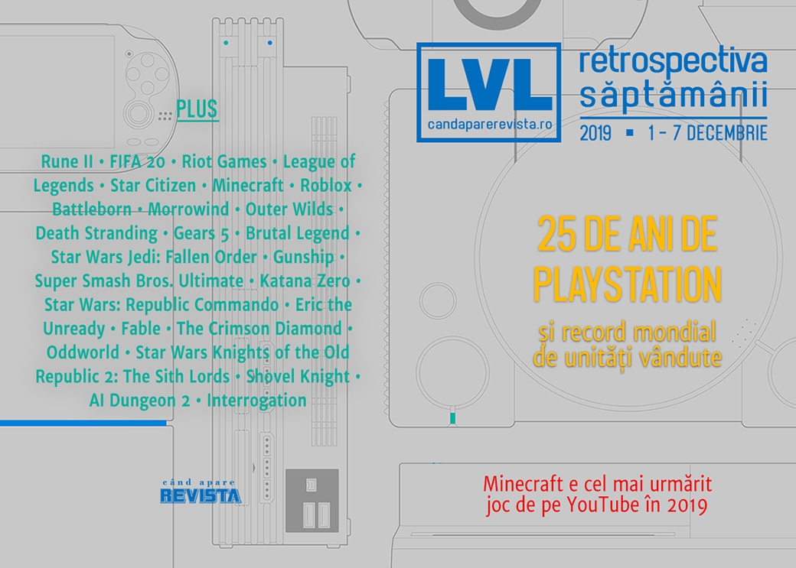

PlayStation aniversează 25 de ani de existență cu un record Guiness pentru cea mai bine vândută consolă, **Minecraft** are server la Vatican, iar **Star Citizen** continuă să strângă o mulțime de bani. Începem să facem și retrospectiva evenimentelor anului și să privim spre 2020, Humble Monthly se transformă în Humble Choice, iar românii de la Critique Gaming au lansat **Interrogation**.  

Linkuri rapide:

* [Știri](#știri)
* [Articole (critică, dev, design)](#articole-critică-dev-design)
* [Made în România](#made-în-românia)
* [Anunţuri şi lansări de jocuri](#anunțuri-şi-lansări-de-jocuri)
* [Prăvălii de jocuri](#prăvălii-de-jocuri)

## Știri
* Foștii dezvoltatori ai Rune II de la Human Head au fost dați în judecată de publisher-ul Ragnarok Game deoarece nu le-au pus la dispoziție codul final al jocului după închiderea surpriză a studioului. ([Eurogamer](https://www.eurogamer.net/articles/2019-12-04-rune-2-developer-human-head-being-sued-by-publisher-for-abandoning-game), [PC Gamer](https://www.pcgamer.com/rune-2-publisher-sues-human-head-studios-for-abandoning-the-game/), [VideoGamesChronicle](https://www.videogameschronicle.com/news/rune-ii-publisher-sues-human-head-studios-over-withheld-assets/), [GamesIndustry.biz](https://www.gamesindustry.biz/articles/2019-12-04-ex-human-head-devs-sued-by-rune-ii-publisher))
* EA elimină avatarurile lui Marco van Basten din **FIFA 20** după ce fostul jucător, acum comentator pentru televiziunea Fox din Olanda, a fost auzit în timpul unei transmisiuni live folosind sintagma nazistă _Sieg Heil_, chiar dacă jucătorul a clarificat ulterior că ar fi fost vorba de o glumă. El a fost și suspendat temporar și de la postul de televiziune. ([Eurogamer](https://www.eurogamer.net/articles/2019-12-04-ea-pulls-marco-van-basten-from-fifa-20-after-he-used-nazi-term-sieg-heil-live-on-air), [Kotaku](https://kotaku.com/nazi-joke-gets-legendary-player-removed-from-fifa-20-1840212755), [Polygon](https://www.polygon.com/2019/12/4/20995233/fifa-20-marco-van-basten-nazi-comment-tv-ban-suspension-ea-sports-fut-pc-ps4-xbox-one), [Vice](https://www.vice.com/en_us/article/ne8a8m/ea-suspends-marco-van-basten-from-fifa-20-after-saying-sieg-heil-on-live-tv), [Game Rant](https://gamerant.com/fifa-20-removes-legendary-player-after-controversial-comments/))
* Riot Games va plăti o sumă de 10 milioane de dolari pentru a stinge un litigiu privind discriminearea de gen la locul de muncă. Suma va fi împărțită tuturor femeilor care au lucrat la Riot începând cu anul 2014. ([Ars Technica](https://arstechnica.com/gaming/2019/12/riot-games-offers-female-employees-10-million-in-settlement/), [PC Gamer](https://www.pcgamer.com/riot-will-pay-dollar10m-to-settle-gender-discrimination-lawsuit/), [LA Times](https://www.latimes.com/business/technology/story/2019-12-02/riot-games-gender-discrimination-settlement), [Kotaku](https://kotaku.com/riot-settles-lawsuit-will-pay-every-female-employee-si-1840156366), [Eurogamer](https://www.eurogamer.net/articles/2019-12-03-riot-agrees-to-pay-every-female-employee-from-usd10m-fund-as-part-of-class-action-lawsuit-settlement), [VideoGamesChronicle](https://www.videogameschronicle.com/news/riot-games-to-pay-10-million-to-settle-gender-discrimination-lawsuit/), [Vice](https://www.vice.com/en_us/article/evjyqj/riot-games-to-pay-dollar10-million-in-gender-discrimination-settlement))
* Și tot Riot Games înființează o nouă companie de publishing care se va ocupa de viitoarele jocuri single-player în universul League of Legends. ([GameDaily.biz](https://gamedaily.biz/article/1448/riot-games-announces-new-publishing-group-riot-forge), [Polygon](https://www.polygon.com/2019/12/5/20997253/riot-games-forge-third-party-league-of-legends-games), [RPS](https://www.rockpapershotgun.com/2019/12/06/riot-games-have-pulled-in-other-studios-to-make-games-in-the-lol-iverse/))
* Star Citizen are motiv de sărbătoare: a depășit suma de 250 de milioane de dolari strânși prin crowdfunding, începând cu anul 2012. ([Eurogamer](https://www.eurogamer.net/articles/2019-12-02-star-citizen-has-now-raised-over-usd250m-in-crowdfunding), [DSOGaming](https://www.dsogaming.com/news/star-citizens-crowdfunding-campaign-has-raised-more-than-250-million/))
* Se închide site-ul GameRankings după 20 de ani. Compania care îl deținea mai are în portofoliu și site-ul Metacritic. ([Kotaku](https://kotaku.com/rip-gamerankings-com-1840250954), [GamesIndustry.biz](https://www.gamesindustry.biz/articles/2019-12-06-gamerankings-to-close-down-after-20-years), [PCGamesInsider.biz](https://www.pcgamesinsider.biz/news/70160/review-score-site-gamerankings-is-closing-down/))
* Agregatorul de review-uri Metacritic a publicat o listă cu cele mai bune jocuri (în ordinea notelor) ale deceniului. Primele locuri sunt ocupate de **Super Mario Galaxy 2**, **The Legend of Zelda: Breath of the Wild**, **Red Dead Redemption 2**, **Grand Theft Auto V** și **Super Mario Odyssey**, fiecare cu o medie a notelor de 97 de puncte. ([Metacritic](https://www.metacritic.com/feature/best-videogames-of-the-decade-2010s), [Destructoid](https://www.destructoid.com/these-are-the-highest-scoring-games-of-the-decade-574419.phtml), [VideoGamesChronicle](https://www.videogameschronicle.com/news/metacritic-reveals-the-best-50-games-of-the-decade-by-review-scores/))
* PlayStation intră în Cartea Recordurilor Guinness pentru performanța de a fi vândut peste 450 milioane de unități de-a lungul celor 4 generații ale consolei de până acum. ([EGM](https://egmnow.com/playstation-gets-guinness-world-record-for-being-best-selling-home-console-brand/), [GamesIndustry.biz](https://www.gamesindustry.biz/articles/2019-12-03-playstations-1-4-have-sold-more-than-450-million-systems))
* Un preot de la Vatican a deschis un server de Minecraft cu scopul de a crea un loc primitor și mai puțin „toxic”, care a devenit însă la scurt timp ținta unor atacuri DDoS. ([RPS](https://www.rockpapershotgun.com/2019/12/02/the-vaticans-new-minecraft-server-is-totally-on-brand-for-jesuits/), [PC Gamer](https://www.pcgamer.com/the-vatican-has-its-own-minecraft-server/))
* Minecraft este jocul cel mai urmărit pe YouTube în 2019. ([Eurogamer](https://www.eurogamer.net/articles/2019-12-06-minecraft-tops-youtube-list-of-most-watched-video-games-in-2019), [Shacknews](https://www.shacknews.com/article/115337/minecraft-pulled-over-100-billion-views-throughout-2019-on-youtube), [VideoGamesChronicle](https://www.videogameschronicle.com/news/minecraft-is-youtubes-top-game-of-2019-with-100-billion-views/), [The Verge](https://www.theverge.com/2019/12/5/20996849/minecraft-youtube-rewind-fortnite-grand-theft-auto-roblox-biggest-games-views), [Kotaku](https://kotaku.com/minecraft-is-the-top-youtube-game-of-2019-thanks-to-a-1840272877))
* Creatorul American McGee a primit o înștiințare de încălcare a copyright-ului în timp ce se juca live pe YouTube chiar jocul care îi poartă numele. ([PCGamesInsider.biz](https://www.pcgamesinsider.biz/news/70148/alice-maker-american-mcgee-hit-with-youtube-copyright-claim-for-playing-his-own-game/), [PCGamesN](https://www.pcgamesn.com/illustrated-sound-music-youtube))

## Articole (critică, dev, design)

* [Not Quite Human: Frostpunk, Papers, Please, and the Dehumanization of Totalitarianism](https://egmnow.com/not-quite-human-frostpunk-papers-please-and-the-dehumanization-of-totalitarianism/) (EGM)
* [Keeping History Alive](https://www.gameinformer.com/2019/12/05/video-game-history-foundation-keeping-history-alive) (Games Informer)
* [Riot’s new games are League of Legends’ best asset (and biggest threat)](https://www.polygon.com/features/2019/12/5/20992482/riot-games-announcement-lore-storytelling-legends-of-runeterra-league-of-legends) (Polygon)
* [What a YouTube Copyright Strike From 2015 Has to do With &#39;Mario Maker 2&#39; in 2019](https://www.vice.com/en_us/article/43kjk9/what-a-youtube-copyright-strike-from-2015-has-to-do-with-mario-maker-2-in-2019) (Vice)
* [Portraits of Roblox&#8217;s leading makers: the scale breakers](https://www.rockpapershotgun.com/2019/12/05/portraits-of-robloxs-leading-makers-the-scale-breakers/) (RPS)
* [Why Good Isn't Good Enough to Be Successful](https://www.gamasutra.com/blogs/JoshBycer/20191205/355154/Why_Good_Isnt_Good_Enough_to_Be_Successful.php) (Gamasutra)

---

### Actualitate
* [Battleborn Deserved Better Than It Got](https://www.escapistmagazine.com/v2/battleborn-deserved-better/) (Escapist)

---

### _Not-a-review_
* [The hidden secrets of The Elder Scrolls 3: Morrowind](https://www.eurogamer.net/articles/2019-12-03-the-hidden-secrets-of-the-elder-scrolls-morrowind) (Eurogamer)
* [Outer Wilds Has Made Exploration In Other Games Boring](https://kotaku.com/outer-wilds-has-made-exploration-in-other-games-boring-1840148560) (Kotaku)
* [Tough Love: On Dark Souls' Difficulty](https://www.eurogamer.net/articles/2019-12-07-tough-love-on-dark-souls-difficulty) (Eurogamer)
* [No Blood for Imulsion: Gears of War and the Military-Industrial Complex](https://egmnow.com/no-blood-for-imulsion-gears-of-war-and-the-military-industrial-complex/) (EGM)
* [The Mundane and the Sublime](https://unwinnable.com/2019/12/06/the-mundane-and-the-sublime/) (Unwinnable)
* [Death Stranding Solves a Problem Open-World Games Don&#039;t Admit They Have](https://www.escapistmagazine.com/v2/death-stranding-solves-a-problem-open-world-games-dont-admit-they-have/) (Escapist)
* [Star Wars Jedi: Fallen Order Proves The Soulsborne Genre Doesn’t Gel With An ‘Easy Mode’](http://fingerguns.net/features/2019/12/02/star-wars-jedi-fallen-order-proves-the-soulsborne-genre-doesnt-gel-with-an-easy-mode/) (Finger Guns)
* [Smash no Wabi-Sabi](https://www.slowrun.me/2019/12/smash-no-wabi-sabi.html) (SlowRun)
* [Character Select: Subverting Power - Eddie Riggs from Brütal Legend](https://techraptor.net/originals/character-select-brutal-legend-eddie-riggs) (TechRaptor)

---

### Industrie
* [IGDA: 'A rested mind has an easier time performing creative and mentally challenging work'](https://gamedaily.biz/article/1438/igda-a-rested-mind-has-an-easier-time-performing-creative-and-mentally-challenging-work) (GameDaily.biz)
* [Reggie Fils-Aime: From Taking Names to Making Names](https://gamedaily.biz/article/1433/exclusive-reggie-fils-aime-from-taking-names-to-making-names) (GameDaily.biz)

---

### Istorie, retrospectivă
* [Staying up all night and riding in a car trunk: The early days of Tekken](https://www.polygon.com/features/2019/12/2/20992483/staying-up-all-night-and-riding-in-a-car-trunk-the-early-days-of-tekken) (Polygon)
* [If you like Star Wars you should play the 22 year old Jedi Knight: Dark Forces 2](https://www.rockpapershotgun.com/2019/12/02/if-you-like-star-wars-you-should-play-the-22-year-old-jedi-knight-dark-forces-2/) (RPS)
* [Republic Commando Was a Genuine Star Wars War Story](https://www.escapistmagazine.com/v2/star-wars-republic-commando-war-story-unique) (Escapist)
* [The Lost Gunship Returns to Base](https://egmnow.com/the-lost-gunship-returns-to-base/) (EGM)
* [Did &quot;Fewer, Bigger, Better&quot; actually work?](https://www.gamesindustry.biz/articles/2019-12-01-did-fewer-bigger-better-actually-work) (GamesIndustry.biz)
* [Eric the Unready](https://www.filfre.net/2019/12/eric-the-unready/) (The Digital Antiquarian)
* [Leaving Albion - the epic making of Fable](https://wireframe.raspberrypi.org/articles/leaving-albion-the-epic-making-of-fable) (Wireframe magazine)

#### Retrospectiva 2019
* [The State Of PC Gaming In 2019](https://kotaku.com/the-state-of-pc-gaming-in-2019-1840241716) (Kotaku)
* [The State Of The PlayStation 4 In 2019](https://kotaku.com/the-state-of-the-playstation4-in-2019-1840210500) (Kotaku)
* [The State Of Xbox One In 2019](https://kotaku.com/the-state-of-xbox-one-in-2019-1840177777) (Kotaku)
* [The State Of The Nintendo Switch In 2019](https://kotaku.com/the-state-of-the-nintendo-switch-in-2019-1840148925) (Kotaku)

#### PlayStation 25 de ani
PlayStation aniversează 25 de ani de existență. ([VideoGamesChronicle](https://www.videogameschronicle.com/news/playstation-celebrates-25-years-of-play-in-anniversary-message/), [Game World Observer](https://gameworldobserver.com/2019/12/02/playstation-25/))

  * [Former staff tell war stories for PlayStation’s 25th anniversary](https://www.polygon.com/videos/2019/12/2/20992087/war-stories-playstation-25th-anniversary-tekken-final-fantasy-7) (Polygon)
  * [How PlayStation democratized 3D video games](https://www.polygon.com/features/2019/12/5/20997745/how-playstation-democratized-3d-video-games) (Polygon)
  * [The PlayStation 3 Was a Miracle Born from Misfortune](https://www.escapistmagazine.com/v2/the-playstation-3-was-a-miracle-born-from-misfortune/) (Escapist)
  * [The First 25 Years](https://www.gameinformer.com/feature/2019/12/03/the-first-25-years) (Games Informer)
  * [The 25 games that defined 25 years of PlayStation](https://www.vg247.com/2019/12/04/25-years-of-playstation-best-games/) (VG247)
  * [25 Years of PlayStation](https://www.gamereactor.eu/25-years-of-playstation/) (Gamereactor)
  * [PlayStation is 25: here are our favorite PlayStation memories](https://www.techradar.com/news/the-playstation-is-25-today-here-are-our-favorite-playstation-memories) (TechRadar)

Iar [The Verge](https://www.theverge.com/2019/12/3/20970458/playstation-anniversary-ps5-ps4-plus-games-ps3-ps2-25th-sony) publică o serie întreagă de articole dedicate aniversării PlayStation, printre care:

  * [The portable PlayStations were Sony at its most ambitious](https://www.theverge.com/2019/12/4/20991654/psp-vita-portable-playstation-console-sony-25-anniversary)
  * [The PlayStation 3 was Blu-ray’s ultimate Trojan horse](https://www.theverge.com/2019/12/4/20992215/playstation-3-ps3-blu-ray-disc-hd-dvd-sony-25th-anniversary)
  * [How Sony bought, and squandered, the future of gaming](https://www.theverge.com/2019/12/5/20993828/sony-playstation-now-cloud-gaming-gaikai-onlive-google-stadia-25th-anniversary)
  * [The PlayStation 4’s Share button changed the way we play together](https://www.theverge.com/2019/12/6/20998610/playstation-4-ps4-share-button-social-play-sony-25th-anniversary)
  * [How the PlayStation logo became a streetwear icon](https://www.theverge.com/2019/12/3/20976705/playstation-logo-fashion-streetwear-icon-sony-25th-anniversary)

#### Avanpremieră 2020
* [The new PC games of 2020](https://www.pcgamer.com/new-games-2020/) (PC Gamer)
* [2020 video game release dates calendar](https://www.shacknews.com/article/115060/2020-video-game-release-dates-calendar) (Shacknews)

---

### Dev, making of, mecanici
* [How Katana Zero brought action into cutscenes](https://www.rockpapershotgun.com/2019/12/04/how-katana-zero-brought-action-into-cutscenes/) (RPS)
* [How an Illustrator Made the Mystery Game The Crimson Diamond by Mistake](https://www.escapistmagazine.com/v2/how-an-illustrator-made-the-mystery-game-the-crimson-diamond-by-mistake/) (Escapist)
* [Video: How Oddworld solved its narrative problems with mind control](https://arstechnica.com/gaming/2019/12/video-how-oddworld-solved-its-narrative-problems-with-mind-control/) (Ars Technica)
* [The modders who spent 15 years fixing Knights of the Old Republic 2](https://arstechnica.com/gaming/2019/12/the-modders-that-spent-15-years-fixing-knights-of-the-old-republic-2/) (Ars Technica)
* [King Knight's Map: Building Secret Paths](https://www.gamasutra.com/blogs/DavidDAngelo/20191206/355238/King_Knights_Map_Building_Secret_Paths.php) (Gamasutra)
* [How Do Bullets Work in Video Games?](https://www.gamasutra.com/blogs/TristanJung/20191206/355250/How_Do_Bullets_Work_in_Video_Games.php) (Gamasutra)

---

### Design, world-building, artă
* [A Medievalist’s Guide to Decoding The Witcher&#x27;s Monsters](https://io9.gizmodo.com/a-medievalist-s-guide-to-decoding-the-witchers-monsters-1840050180) (Gizmodo)
* [Our Gardens](https://unwinnable.com/2019/12/04/our-gardens/) (Unwinnable)
* [The Art Of Obsidian&#x27;s The Outer Worlds](https://kotaku.com/the-art-of-obsidians-the-outer-worlds-1840087678) (Kotaku)
* [Game Box Art Critique December: Wattam, Dr Kawashima&rsquo;s Brain Training, Vampire: The Masquerade&mdash;Coteries of New York](https://www.videogamer.com/features/game-box-art-critique-december-wattam-dr-kawashimas-brain-training-vampire-the-masquerade-coteries-of-new-york) (VideoGamer)

## Made în România
* Critique Gaming au lansat **Interrogation** ([Romanian Game Developers](https://rogame.dev/2019/12/07/s-a-lansat-interrogation/)), iar primele impresii sunt pozitive. ([PC Invasion](https://www.pcinvasion.com/interrogation-you-will-be-deceived-review-question-everything/))
* Și încă un articol publicat de Critique Gaming pe Gamasutra despre Interrogation: [How we approached non-partisan politics in Interrogation](https://www.gamasutra.com/blogs/AndreiDanOlaru/20191202/354935/How_we_approached_nonpartisan_politics_in_Interrogation.php)  (Gamasutra)
* Iar AMC scriu pe Gamasutra despre experiența Dev.Play 2019. ([Gamasutra](https://www.gamasutra.com/blogs/GeorgianaToea/20191204/355092/Of_bread_and_video_games_AMC__DevPlay_2019.php))

## Anunțuri şi lansări de jocuri
* [Bayonetta and Vanquish 4K console remasters revealed via Microsoft Store](https://www.polygon.com/2019/12/5/20996957/bayonetta-vanquish-4k-remasters-xbox-one-ps4)(Polygon)
* [A Plague Tale 2 reportedly in development ](https://www.eurogamer.net/articles/2019-12-04-a-plague-tale-2-reportedly-in-development)(Eurogamer)

### Anunţate
* **The Outlast Trials** ([Eurogamer](https://www.eurogamer.net/articles/2019-12-04-the-next-outlast-game-is-co-op-survival))
* **Starship Troopers: Terran Command**, un RTS clasic în universul Starship Troopers ([Eurogamer](https://www.eurogamer.net/articles/2019-12-03-theres-a-starship-troopers-rts-in-the-works))
* **Castle in the Darkness 2** ([PC Gamer](https://www.pcgamer.com/one-of-the-most-underrated-metroidvanias-on-steam-is-getting-a-sequel/))
* **I Am Jesus Christ** (thx @Mahdi) ([PC Gamer](https://www.pcgamer.com/i-am-jesus-christ-is-a-realistic-sim-where-you-fight-satan/))
* **Pathfinder: Wrath Of The Righteous** ([RPS](https://www.rockpapershotgun.com/2019/12/06/pathfinder-kingmaker-is-getting-a-sequel/))

### Acum cu dată de lansare
* **GTFO**: 9 decembrie ([Eurogamer](https://www.eurogamer.net/articles/2019-12-04-former-payday-devs-co-op-alien-shooter-gtfo-enters-steam-early-access-next-week))
* **Temtem**: 21 ianuarie 2020 ([Destructoid](https://www.destructoid.com/temtem-an-online-monster-catching-rpg-releases-january-21-574318.phtml))
* **The Dark Crystal: Age of Resistance Tactics**: 4 februarie 2020 ([Destructoid](https://www.destructoid.com/that-new-dark-crystal-strategy-rpg-will-launch-in-february-well-after-the-netflix-show-s-debut-574182.phtml))

### Amânate
* **In the Valley of Gods** e oficial pus pe pauză, timp în care developerii vor lucra la alte jocuri Valve ([Polygon](https://www.polygon.com/2019/12/3/20994257/valve-in-the-valley-of-gods-campo-santo-half-life-alyx))
* **The Elder Scrolls: Legends** e ca și anulat ([Eurogamer](https://www.eurogamer.net/articles/2019-12-06-bethesda-puts-development-of-card-battler-the-elder-scrolls-legends-on-hold))
* **Beyond a Steel Sky** apare în 2020 în loc de 2019 ([PC Gamer](https://www.pcgamer.com/cyberpunk-adventure-beyond-a-steel-sky-is-being-released-in-2020/))

### Lansate
* 2 decembrie: **XO** (early access) ([Steam](https://store.steampowered.com/app/399720/XO/))
* 3 decembrie: **Halo: Reach** ([Steam](https://store.steampowered.com/app/1064220/Halo_Reach/))
* 3 decembrie: **Heroland** ([Steam](https://store.steampowered.com/app/1066030/Heroland/), [gog.com](https://www.gog.com/game/heroland))
* 3 decembrie: **Phoenix Point** ([Epic Store](https://www.epicgames.com/store/en-US/product/phoenix-point/))
* 3 decembrie: **Farming Simulator 20** ([Site oficial Farming Simulator](https://www.farming-simulator.com/about.php?lang=en&country=us&platform=pc))
* 4 decembrie: **Arise: A Simple Story** ([Epic Store](https://www.epicgames.com/store/en-US/product/arise-a-simple-story/))
* 4 decembrie: **Everreach: Project Eden** ([Steam](https://store.steampowered.com/app/915670/Everreach_Project_Eden/))
* 5 decembrie: **Paranoia: Happiness is Mandatory** ([Epic Store](https://www.epicgames.com/store/en-US/product/paranoia/))
* 5 decembrie: **Mosaic** ([Steam](https://store.steampowered.com/app/349270/Mosaic/), [gog.com](https://www.gog.com/game/mosaic))
* 5 decembrie: **Darksiders Genesis** ([Steam](https://store.steampowered.com/app/710920/Darksiders_Genesis/), [gog.com](https://www.gog.com/game/darksiders_genesis))
* 5 decembrie: **Euro Truck Simulator 2 - Road to the Black Sea** ([Steam](https://store.steampowered.com/app/1056760/Euro_Truck_Simulator_2__Road_to_the_Black_Sea/))
* 5 decembrie: **Interrogation: You will be deceived** ([Steam](https://store.steampowered.com/app/1016770/Interrogation_You_will_be_deceived/))
* 5 decembrie: **Ylands** ([Steam](https://store.steampowered.com/app/298610/Ylands/))
* 5 decembrie: **Strategic Command: World War I** ([Steam](https://store.steampowered.com/app/1096930/Strategic_Command_World_War_I/), [gog.com](https://www.gog.com/game/strategic_command_world_war_i))
* 5 decembrie: **Interrogation: You will be deceived** ([Steam](https://store.steampowered.com/app/1016770/Interrogation_You_will_be_deceived/), [gog.com](https://www.gog.com/game/interrogation_you_will_be_deceived))

## Prăvălii de jocuri
### Știri
* [Humble Choice goes live with Shadow of the Tomb Raider, Phantom Doctrine, and 8 more](https://www.pcgamer.com/humble-choice-goes-live-with-shadow-of-the-tomb-raider-phantom-doctrine-and-8-more/) (PC Gamer)
* [Epic Games Store implements in-game purchases for third-parties](https://www.gamesindustry.biz/articles/2019-12-06-epic-games-store-implements-in-game-purchases-for-third-parties) (GamesIndustry.biz)

### Update catalog
* [The Division, Overcooked 2, and more joining Xbox Game Pass for Console](https://egmnow.com/the-division-overcooked-2-and-more-joining-xbox-game-pass-for-console/) (EGM)
* [Age of Wonders: Planetfall, Metro: Last Light Redux, and more coming to Xbox Game Pass for PC](https://egmnow.com/age-of-wonders-planetfall-metro-last-light-redux-and-more-coming-to-xbox-game-pass-for-pc/) (EGM)
* [PUBG and Wolfenstein: The Old Blood join PlayStation Now](https://egmnow.com/pubg-and-wolfenstein-the-old-blood-join-playstation-now/) (EGM)

### Jocuri gratis și free weekends
* [The new Five Nights at Freddy's game is a sidescrolling shooter](https://www.pcgamer.com/the-new-five-nights-at-freddys-game-is-a-sidescrolling-shooter/) (PC Gamer)
* [Fallout 76 is getting a free weekend and a Halloween do-over in December](https://www.polygon.com/2019/12/5/20997614/fallout-76-free-weekend-update-16-halloween-christmas) (Polygon)
* [Jotun: Valhalla Edition is now free on PC](https://egmnow.com/jotun-valhalla-edition-is-now-free-on-pc/) (EGM)
* [In AI Dungeon 2, You Can Do Anything--Even Start A Rock Band Made Of Skeletons](https://kotaku.com/in-ai-dungeon-2-you-can-do-anything-even-start-a-rock-1840276553) (Kotaku)
* [Imperator: Rome is free to play until Sunday](https://www.pcgamer.com/imperator-rome-is-free-to-play-until-sunday/) (PC Gamer)
* [It's all downhill from here in free, turn-based skiing game Alpine Alpaca](https://www.pcgamer.com/its-all-downhill-from-here-in-free-turn-based-skiing-game-alpine-alpaca/) (PC Gamer)
* [The Crew 2 is free to play until December 8th - DSOGaming](https://www.dsogaming.com/news/the-crew-2-is-free-to-play-until-december-8th/) (DSOGaming)

### Reduceri și promoții
* [Weekend PC Download Deals for Dec. 6: Modern Warfare leads the way](https://www.shacknews.com/article/115346/weekend-pc-download-deals-for-dec-6-modern-warfare-leads-the-way) (Shacknews)
* [Weekend Console Download Deals for Dec. 6: Waiting for the Game Awards](https://www.shacknews.com/article/115342/weekend-console-download-deals-for-dec-6-waiting-for-the-game-awards) (Shacknews)
* [Jingle Jam Humble Bundle raises $1 million for charity in first 24 hours](https://www.videogameschronicle.com/news/jingle-jam-humble-bundle-raises-1-million-for-charity-in-first-24-hours/) (VideoGamesChronicle)
* [Close Out the Year with Big Savings at PS Store](https://blog.us.playstation.com/2019/12/02/close-out-the-year-with-big-savings-at-ps-store/) (Blog PlayStation)

---

{}
**Retrospectiva săptămânii** este rubrica duminicală în care trecem în revistă evenimentele săptămânii de pe frontul de gaming: știri şi articole (scrise de alții, bineînțeles, că e mai ușor aşa), industrie, lansări, oferte de jocuri, toate numai de savurat la cafeaua de duminică dimineața.

De asemenea, rubrica e deschisă oricui vrea și poate contribui. Dacă ai citit vreun articol sau vreo știre interesantă și crezi că merită incluse în retrospectiva săptămânii, te așteptăm pe forum pe unul dintre topicurile dedicate: [Știri](https://forum.candaparerevista.ro/viewtopic.php?f=4&t=46), [Articole](https://forum.candaparerevista.ro/viewtopic.php?f=4&t=206), [Gaming România](https://forum.candaparerevista.ro/viewtopic.php?f=4&t=1622)].
{}
