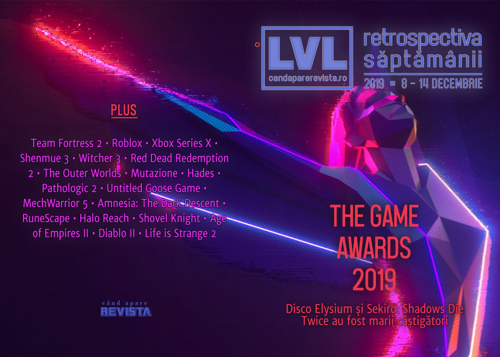

Principalul eveniment al săptămânii a fost The Game Awards, în cadrul căruia au fost anunțate mai mult jocuri noi, dar a fost prezentată și noua consolă Xbox. Dintre titlurile anunțate se remarcă o continuare pentru Hellblade, primul joc pentru PlayStation 5, un nou joc Dungeons & Dragons, iar **The Wolf Among Us 2** a fost reanimat și reanunțat.  

Linkuri rapide:

* [Știri](#știri)
* [Articole (critică, dev, design)](#articole-critică-dev-design)
* [Anunţuri şi lansări de jocuri](#anunțuri-şi-lansări-de-jocuri)
* [Prăvălii de jocuri](#prăvălii-de-jocuri)

## Știri

* Compania care publică cărțile „Choose Your Own Adventure” au trimis scrisori de încălcare a copyright-ului mai multor studiouri care au publicat jocuri pe Itch.io și au folosit sintagma "choose our own adventure" în numele sau descrierea jocurilor. ([The Verge](https://www.theverge.com/2019/12/9/21003455/chooseco-choose-your-own-adventure-itch-io-trademark-infringement-takedown-notices), [PC Gamer](https://www.pcgamer.com/indies-with-choose-your-own-adventure-descriptions-are-getting-trademark-infringement-notices/), [Kotaku](https://kotaku.com/choose-your-own-adventures-owners-are-going-after-indie-1840349153), [GamesIndustry.biz](https://www.gamesindustry.biz/articles/2019-12-10-choose-your-own-adventure-publisher-cracks-down-on-itch-io-devs))

* Nintendo a organizat o nouă prezentare Indie World. Sumarul evenimentului: [Kotaku](https://kotaku.com/all-the-big-announcements-from-nintendos-indie-world-1840343686), [The Verge](https://www.theverge.com/2019/12/10/21004743/nintendo-switch-indie-world-showcase-trailers-dauntless-sports-story), [Games Informer](https://www.gameinformer.com/nintendo-direct/2019/12/10/every-game-announced-during-nintendos-indie-world-showcase), [EGM](https://egmnow.com/nintendo-indie-world-showcase-roundup/).

* Sony a organizat o nouă prezentare State of Play. Sumarul evenimentului: [EGM](https://egmnow.com/everything-announced-in-todays-state-of-play/), [Destructoid](https://www.destructoid.com/here-s-everything-that-happened-at-sony-s-nemesis-tastic-state-of-play-574703.phtml), [Kotaku](https://kotaku.com/everything-sony-announced-at-todays-state-of-play-1840337086).

#### The Game Awards
A avut loc evenimentul sfârșitului de an, în care au fost anunțate mai multe jocuri și s-au decernat premii pentru jocurile apărute în acest an([PC Gamer](https://www.pcgamer.com/disco-elysium-leads-the-game-awards-with-four-wins/))

* Cel mai însemnat anunț a fost cel al viitoarei console Xbox, fostul Project Scarlett: Xbox Series X ([Ars Technica](https://arstechnica.com/gaming/2019/12/the-next-xbox-has-a-name-and-a-new-design-behold-2020s-xbox-series-x/), [PC Gamer](https://www.pcgamer.com/xbox-series-x-clearly-a-pc-tower-every-microsoft-studio-working-on-exclusives/), [Eurogamer](https://www.eurogamer.net/articles/2019-12-13-the-next-xbox-is-called-xbox-series-x), [Escapist](https://www.escapistmagazine.com/v2/microsoft-announces-xbox-series-x-the-next-generation-xbox/), [VideoGamesChronicle](https://www.videogameschronicle.com/news/microsoft-officially-unveils-xbox-series-x-as-its-next-gen-console/))

* Jocuri noi: au fost anunțate mai multe titluri, printre care: **Senua's Saga: Hellblade 2**, continuarea lui Hellblade: Senua’s Sacrifice, două jocuri singleplayer în universul League of Legends: Ruined King și CONV/RGENCE, **New World**, un MMO dezvoltat de Amazon, **The Wolf Among Us 2** este readus la viață și intră în producție, un joc **Fast & Furious**, **Weird West** primul joc al studioului WolfEye înființat de fostul fondator al Arkane Studios, **Dark Alliance**, un action RPG D&D ce se desfășoară în Icewind Dale, **Godfall**, un action RPG fantasy de la Gearbox și primul joc pentru PlayStation 5, și un joc nou de la PUBG Corporation cu numele **Prologue**

* Trailere noi: **Gears Tactics** ([PC Gamer](https://www.pcgamer.com/gears-tactics-arrives-in-april/)), **Final Fantasy 7 Remake** ([PC Gamer](https://www.pcgamer.com/a-new-final-fantasy-7-remake-trailer-appears-at-the-game-awards/)), **Maneater** ([PC Gamer](https://www.pcgamer.com/sharks-take-revenge-on-humans-in-a-new-maneater-trailer/)), **Ghost of Tsushima** ([Eurogamer](https://www.eurogamer.net/articles/2019-12-13-playstation-4-exclusive-ghost-of-tsushima-launches-next-summer)), **Humankind** ([Eurogamer](https://www.eurogamer.net/articles/2019-12-13-amplitude-studios-historical-4x-strategy-humankind-gets-its-first-gameplay-trailer)), **Ori and the Will of the Wisps** ([VideoGamesChronicle](https://www.videogameschronicle.com/news/ori-and-the-will-of-the-wisps-gets-short-delay-and-new-trailer/))

* Premii: **Sekiro: Shadows Die Twice** a fost desemnat Jocul Anului, iar **Disco Elysium** a câștigat 4 premii, printre care și cel pentru Cel Mai Bun RPG ([PC Gamer](https://www.pcgamer.com/disco-elysium-leads-the-game-awards-with-four-wins/), [Polygon](https://www.polygon.com/game-awards-tga/2019/12/13/21020351/game-awards-2019-winners-nominees-tga), [Kotaku](https://kotaku.com/sekiro-wins-game-of-the-year-at-the-2019-game-awards-1840403746))

* Sumarul evenimentului:
  * [Every trailer and announcement at The Game Awards 2019](https://www.pcgamer.com/every-trailer-and-announcement-at-the-game-awards-2019/) (PC Gamer)
  * [The Game Awards 2019: All the news, trailers, and world premieres](https://www.polygon.com/game-awards-tga/2019/12/12/21013156/the-game-awards-2019-news-trailers-world-premieres-list) (Polygon)
  * [The Game Awards 2019 winners, announcements, & trailers](https://www.shacknews.com/article/115419/the-game-awards-2019-winners-announcements-trailers) (Shacknews)
  * [All The Big Announcements At The 2019 Game Awards](https://kotaku.com/all-the-big-announcements-at-the-2019-game-awards-1840403731) (Kotaku)
  * [Game Awards 2019 Recap: The Night’s Big Trailers and Reveals](https://www.usgamer.net/articles/game-awards-2019-all-trailers-xbox-series-x-riot-forged-final-fantasy) (USgamer)

* Alte articole:
  * [Xbox Series X Specs: Twice As Powerful As Xbox One X](https://www.gamespot.com/articles/xbox-series-x-specs-twice-as-powerful-as-xbox-one-/1100-6472198/) (Gamespot)
  * [Microsoft has admitted defeat in the console wars and just built a PC](https://www.pcgamesn.com/microsoft-xbox-series-x-pc) (PCGamesN)
  * [Xbox Series X is Microsoft&#039;s best-looking and most striking console design yet](https://www.vg247.com/2019/12/14/xbox-series-x-microsofts-best-looking-striking-console-design-yet/) (VG247)
  * [The Wolf Among Us 2 Rebirth Makes the Best out of a Bad Situation](https://www.escapistmagazine.com/v2/the-wolf-among-us-2-telltale-games-lcg-entertainment/) (Escapist)

## Articole (critică, dev, design)

* [Meet the Player Protesting Call of Duty: Modern Warfare's Violence by Playing as a Pacifist](https://www.usgamer.net/articles/meet-the-player-whos-playing-through-call-of-duty-modern-warfare-as-a-pacifist) (USgamer)
* [The cult of Hideo Kojima](https://www.eurogamer.net/articles/2019-12-09-hideo-kojima-on-tour) (Eurogamer)
* [12 years later, players somehow keep Team Fortress 2 alive on the PS3](https://arstechnica.com/gaming/2019/12/the-fight-to-keep-team-fortress-2-community-alive-on-the-ps3/) (Ars Technica)
* [Portraits of Roblox&#8217;s leading makers: the roleplayers](https://www.rockpapershotgun.com/2019/12/12/portraits-of-robloxs-leading-makers-the-roleplayers/) (RPS)
* [Hypertext Transfer: How Wikipedia and its Forerunners Inspired a New Kind of Game](https://egmnow.com/hypertext-transfer-wikipedia-and-the-rise-of-the-database-game/) (EGM)
* [Mountains of Trash](http://www.firstpersonscholar.com/mountains-of-trash/) (First Person Scholar)
* [Due Diligence: The Loop is Dead, Long Live the Loop](http://www.haywiremag.com/columns/due-diligence-the-loop-is-dead-long-live-the-loop/) (Haywire Magazine)
* [The Golden Age of Video Games](https://gamasutra.com/blogs/ChrisSolarski/20191212/355325/The_Golden_Age_of_Video_Games.php) (Gamasutra)
* [Gravity in Computer Space](https://romchip.org/index.php/romchip-journal/article/view/91) (ROMchip)

---

### _Not-a-review_
* [Shenmue 3 shows what games have lost since 2001](https://www.videogameschronicle.com/features/shenmue-3-shows-what-games-have-lost-since-2001/) (VideoGamesChronicle)
* [Shenmue 3: the view from Guilin](https://www.eurogamer.net/articles/2019-12-12-shenmue-3-the-view-from-guilin) (Eurogamer)
* [My Favorite Witcher 3 Quest Has No Fighting, Just Drunken Shenanigans](https://kotaku.com/my-favorite-witcher-3-quest-has-no-fighting-just-drunk-1840032226) (Kotaku)
* [Red Dead Redemption 2’s biggest success is loneliness](https://www.polygon.com/2019/12/11/20995897/red-dead-redemption-2-pc-xbox-playstation-design-loneliness) (Polygon)
* [The Outer Worlds is a vicious parody of capitalism, with a very accurate twist](https://www.polygon.com/2019/12/11/20972345/outer-worlds-story-capitalism-hidden-theme) (Polygon)
* [Mutazione's gardening reminds me that when video games give me order, I want chaos](https://www.eurogamer.net/articles/2019-12-14-mutaziones-gardening-reminds-me-that-when-video-games-give-me-order-i-want-chaos) (Eurogamer)
* [Why Early Access is a particularly good time to play Hades](https://www.destructoid.com/why-early-access-is-a-particularly-good-time-to-play-hades-575128.phtml) (Destructoid)
* [Pathologic 2 and the Anatomy of a Metaphor](https://unwinnable.com/2019/12/12/pathologic-2-and-the-anatomy-of-a-metaphor/) (Unwinnable)
* [If We&#039;re Going to Talk About Untitled Goose Game Then By God Let&#039;s Talk About Untitled Goose Game](https://sidequest.zone/2019/12/09/if-were-going-to-talk-about-untitled-goose-game-then-by-god-lets-talk-about-untitled-goose-game/) (Sidequest)
* [Once the King of PC Gaming, MechWarrior is Now the Big Stompy Ghost of a Bygone Era](https://www.usgamer.net/articles/why-mechwarrior-5-matters) (USgamer)

---

### Industrie
* [Everybody&#039;s Gone: Dan Pinchbeck on Rebuilding The Chinese Room](https://egmnow.com/everybodys-gone-dan-pinchbeck-on-rebuilding-the-chinese-room/) (EGM)
* [Epic's exclusivity push leads to ugliness](https://www.gamesindustry.biz/articles/2019-12-12-epics-exclusivity-push-leads-to-ugliness) (GamesIndustry.biz)
* [Interpret: Games are strong entertainment brands, but their fan bases are fragmented](https://venturebeat.com/2019/12/12/interpret-games-are-strong-entertainment-brands-but-their-fan-bases-are-fragmented/) (VentureBeat)
* [In advertising, the &#8216;gamer&#8217; demographic is useless](https://venturebeat.com/2019/12/13/in-advertising-the-gamer-demographic-is-useless/) (VentureBeat)

---

### Istorie, retrospectivă
* [After RuneScape's controversial 2019, Jagex plots &quot;direct and deliberate&quot; changes for 2020](https://www.eurogamer.net/articles/2019-12-06-microtransactions-and-epic-quests-runescape-in-2019) (Eurogamer)
* [Goodnight, sweet Steam Controller](https://www.rockpapershotgun.com/2019/12/12/goodnight-sweet-steam-controller/) (RPS)
* [Nine years on, Amnesia: The Dark Descent is still scary as all hell](https://www.rockpapershotgun.com/2019/12/09/nine-years-on-amnesia-the-dark-descent-is-still-scary-as-all-hell/) (RPS)

#### Retrospectiva anului 2019
* [The 50 best games of 2019](https://www.polygon.com/best-games/2019/12/13/21002670/best-games-2019-ps4-pc-xbox-one-nintendo-switch-ios) (Polygon)
* [The year of PR disasters](https://www.gamesindustry.biz/articles/2019-12-09-the-year-of-pr-disasters) (GamesIndustry.biz)
* [Best of 2019 video games: How diverse storylines and streaming platforms shaped culture](https://www.latimes.com/entertainment-arts/story/2019-12-09/2019-year-in-review-video-games-shaped-pop-culture) (L.A. Times)

#### Retrospectiva deceniului
* [Turn-based tactics won the decade](https://www.pcgamer.com/turn-based-tactics-won-the-decade/) (PC Gamer)
* [How battle royale changed the last decade of games (and the next one)](https://www.pcgamer.com/how-battle-royale-changed-the-last-decade-of-games-and-the-next-one/) (PC Gamer)
* [The 69 biggest, weirdest moments of the decade in PC gaming](https://www.pcgamer.com/the-biggest-weirdest-moments-of-the-decade/) (PC Gamer)
* [What PC gaming was like in 2009](https://www.pcgamer.com/what-it-was-like-to-be-a-pc-gamer-in-2009/) (PC Gamer)
* [The Most Underrated Games Of The Decade](https://kotaku.com/the-most-underrated-games-of-the-decade-1840365171) (Kotaku)
* [The Decade In Five Games](https://kotaku.com/the-decade-in-five-games-1840394803) (Kotaku)
---

### Dev, making of, mecanici
* [Halo: Reach&#39;s Remastered Graphics Are Almost Too Perfect to Be Good](https://www.vice.com/en_us/article/ywaajb/halo-reachs-remastered-graphics-are-almost-too-perfect-to-be-good) (Vice)
* [The Seven-Year Saga Of Shovel Knight Is Finally Over](https://kotaku.com/the-seven-year-saga-of-shovel-knight-is-finally-over-1840419716) (Kotaku)
* [Watch the lead dev of  Age of Empires II: Definitive Edition  break down the game's rebirth](https://www.gamasutra.com/view/news/355696/Watch_the_lead_dev_of_Age_of_Empires_II_Definitive_Edition_break_down_the_games_rebirth.php) (Gamasutra)
* [How Audio Design Enhances Diablo 2](https://www.gamasutra.com/blogs/DavidCraddock/20191209/355328/How_Audio_Design_Enhances_Diablo_2.php) (Gamasutra)
* [The Life Is Strange 2 Postmortem: &quot;[W]e Knew That It Wouldn&#039;t Have the Same Huge Success Right From the Beginning&quot;](https://www.usgamer.net/articles/life-is-strange-2-dontnod-postmortem-interview-feature) (USgamer)
* USgamer publică o serie de articole _making-of_ despre **Shovel Knight: Specter of Torment** scrise chiar de către studioul Yacht Club Games: [Partea 1](https://www.usgamer.net/articles/the-making-of-specter-of-torment-part-1), [Partea 2](https://www.usgamer.net/articles/the-making-of-shovel-knight-specter-of-torment-part-2), [Partea 3](https://www.usgamer.net/articles/the-making-of-shovel-knight-specter-of-torment-part-3), [Partea 4](https://www.usgamer.net/articles/the-making-of-shovel-knight-specter-of-torment-part-4), [Partea 5](https://www.usgamer.net/articles/the-making-of-shovel-knight-specter-of-torment-part-5) (USgamer)

---

### Design, world-building, artă
* [Gotham&#039;s Multiple Masks](https://unwinnable.com/2019/12/09/gothams-multiple-masks/) (Unwinnable)
* [You Better Believe This Is Another Witcher 3 Art Post](https://kotaku.com/you-better-believe-this-is-another-witcher-3-art-post-1840255313) (Kotaku)
* [Game Art: ARCH8's Tetris](https://www.gamescenes.org/2019/12/game-art-arch8s-tetris.html) (GAMESCENES)

#### Anunturi
* [2K confirms a new BioShock game is in development](https://www.videogameschronicle.com/news/2k-confirms-a-new-bioshock-game-is-in-development/) (VideoGamesChronicle)
* [Kalypso Media is working on a next-gen Commandos game](https://www.dsogaming.com/news/kalypso-media-is-working-on-a-next-gen-commandos-game/) (DSOGaming)

## Anunțuri şi lansări de jocuri
### Anunţate
* **Resident Evil 3 Remake** ([EGM](https://egmnow.com/resident-evil-3-remake-officially-announced-with-debut-trailer), [Destructoid](https://www.destructoid.com/resident-evil-3-remake-coming-on-april-3-2020-574684.phtml))
* **Corepunk** ([DSOGaming](https://www.dsogaming.com/news/corepunk-is-a-new-diablo-meets-ultima-online-mmorpg-first-gameplay-trailer-released/), [PC Invasion](https://www.pcinvasion.com/corepunk-trailer-mmorpg/))
* **The Survivalists** ([PC Gamer](https://www.pcgamer.com/the-survivalists-is-a-survival-sandbox-follow-up-to-the-escapists/))
* **Receiver 2** ([PC Gamer](https://www.pcgamer.com/indie-fps-receiver-is-getting-a-sequel/))

#### Jocuri anunțate la The Game Awards
* **Senua's Saga: Hellblade 2** ([PC Gamer](https://www.pcgamer.com/senuas-saga-hellblade-2-is-the-first-xbox-series-x-game/), [Eurogamer](https://www.eurogamer.net/articles/2019-12-13-ninja-theory-unveils-follow-up-to-acclaimed-hellblade-senuas-sacrifice), [VideoGamesChronicle](https://www.videogameschronicle.com/news/hellblade-2-announced-for-xbox-series-x-with-in-engine-trailer/))
* **Ruined King** ([PC Gamer](https://www.pcgamer.com/ruined-king-is-the-first-single-player-league-of-legends-game/), [Shacknews](https://www.shacknews.com/article/115431/ruined-king-a-league-of-legends-story-revealed-at-the-game-awards-2019))
* **CONV/RGENCE** ([PC Gamer](https://www.pcgamer.com/convrgence-a-league-of-legends-story-is-a-singleplayer-platformer-starring-ekko/), [Shacknews](https://www.shacknews.com/article/115442/conv-rgence-is-the-newest-game-from-riot-forge))
* **The Wolf Among Us 2** ([PC Gamer](https://www.pcgamer.com/the-wolf-among-us-2-teaser/), [Eurogamer](https://www.eurogamer.net/articles/2019-12-13-telltales-the-wolf-among-us-2-just-got-re-announced))
* **Naraka: Bladepoint** ([PC Gamer](https://www.pcgamer.com/naraka-bladepoint-is-a-multiplayer-melee-combat-game-with-a-striking-visual-style/), [VideoGamesChronicle](https://www.videogameschronicle.com/news/china-inspired-melee-combat-game-naraka-premieres-at-game-awards/))
* **New World** ([PC Gamer](https://www.pcgamer.com/history-and-magic-collide-in-mmo-new-world-releasing-may-2020/), [RPS](https://www.rockpapershotgun.com/2019/12/13/new-world-the-sandbox-mmo-from-amazon-is-coming-in-may/))
* **Fast & Furious Crossroads** ([PC Gamer](https://www.pcgamer.com/fast-and-furious-crossroads-announced-coming-to-steam-next-year/))
* **Nine to Five** ([PC Gamer](https://www.pcgamer.com/team-based-shooter-nine-to-five-announced-at-the-game-awards/), [Escapist](https://www.escapistmagazine.com/v2/nine-to-five-new-tactical-first-person-shooter-announced-at-the-game-awards/))
* **Weird West** ([PC Gamer](https://www.pcgamer.com/former-arkane-bosses-reveal-their-new-game-an-action-rpg-called-weird-west/), [Escapist](https://www.escapistmagazine.com/v2/weird-west-announced-by-dishonored-and-prey-co-creators-at-their-new-studio), [Eurogamer](https://www.eurogamer.net/articles/2019-12-13-weird-west-is-a-gun-slinging-fantasy-action-rpg-from-former-dishonored-prey-devs))
* **Dark Alliance** ([PC Gamer](https://www.pcgamer.com/dark-alliance-the-dandd-action-rpg-is-heading-to-icewind-dale-in-2020/), [Eurogamer](https://www.eurogamer.net/articles/2019-12-09-dungeons-dragons-series-dark-alliance-new-game))
* **Godfall** ([VideoGamesChronicle](https://www.videogameschronicle.com/news/gearbox-unveils-the-first-ps5-game-godfall/), [PC Gamer](https://www.pcgamer.com/gearbox-reveals-godfall-a-fantasy-action-rpg-coming-next-year/), [Eurogamer](https://www.eurogamer.net/articles/2019-12-13-godfall-is-the-first-officially-announced-ps5-game))
* **Sons of the Forest** ([PC Gamer](https://www.pcgamer.com/sons-of-the-forest-is-a-demon-hunting-sequel-to-the-terrifying-survival-game-the-forest/), [Escapist](https://www.escapistmagazine.com/v2/sons-of-the-forest-follow-up-to-the-forest-announced-by-endnight-games))
* **Prologue** ([VideoGamesChronicle](https://www.videogameschronicle.com/news/pubg-creator-unveils-prologue-an-exploration-of-tech-and-gameplay/))

### Acum cu dată de lansare
* **The Suicide of Rachel Foster**: 19 aprilie 2020 ([DSOGaming](https://www.dsogaming.com/news/the-suicide-of-rachel-foster-is-coming-to-the-pc-in-february-2020/))
* **Predator: Hunting Grounds**: 24 aprilie 2020 ([EGM](https://egmnow.com/predator-hunting-grounds-trailer-reveals-release-date/))

### Amânate
* **Ori and the Will of Wisps**: 11 martie 2020 în loc de 11 februarie ([VentureBeat](https://venturebeat.com/2019/12/12/ori-and-the-will-of-wisps-delayed-to-march-11/))

### Anulate
* **PlanetSide Arena** se închide ([VG247](https://www.vg247.com/2019/12/14/planetside-arena-servers-will-be-taken-offline-on-january-10/))

### Lansate
* 9 decembrie: **Frog Detective 2: The Case of the Invisible Wizard** ([Steam](https://store.steampowered.com/app/1047220/Frog_Detective_2_The_Case_of_the_Invisible_Wizard/))
* 9 decembrie: **Ashen** (relansare după un an de exclusivitate Epic Store) ([Steam](https://store.steampowered.com/app/649950/Ashen/), [gog.com](https://www.gog.com/game/ashen))
* 9 decembrie: **SuperMash** ([Epic Store](https://www.epicgames.com/store/en-US/product/supermash/))
* 10 decembrie: **MechWarrior 5: Mercenaries** ([Epic Store](https://www.epicgames.com/store/en-US/product/mechwarrior-5/))
* 10 decembrie: **Dragon Quest Builders 2** ([Steam](https://store.steampowered.com/app/1072420/DRAGON_QUEST_BUILDERS_2/))
* 10 decembrie: **Last Year** ([Steam](https://store.steampowered.com/app/1195460/Last_Year/))
* 10 decembrie: **Hades** (relansare după un an de exclusivitate Epic Store) ([Steam](https://store.steampowered.com/app/1145360/Hades/))
* 10 decembrie: **Hello Neighbor: Hide and Seek** (relansare după un an de exclusivitate Epic Store) ([Steam](https://store.steampowered.com/app/960420/Hello_Neighbor_Hide_and_Seek/))
* 10 decembrie: **Shovel Knight: King of Cards** ([Steam](https://store.steampowered.com/app/1116780/Shovel_Knight_King_of_Cards/), [gog.com](https://www.gog.com/game/shovel_knight_king_of_cards))
* 10 decembrie: **Shovel Knight Showdown** ([Steam](https://store.steampowered.com/app/1116770/Shovel_Knight_Showdown), [gog.com](https://www.gog.com/game/shovel_knight_showdown))
* 11 decembrie: **Vampire: The Masquerade - Coteries of New York** ([Steam](https://store.steampowered.com/app/1096410/Vampire_The_Masquerade__Coteries_of_New_York/))
* 12 decembrie: **Jamestown+** ([Steam](https://store.steampowered.com/app/377950/Jamestown/))
* 12 decembrie: **Sayonara Wild Hearts** (lansare surpriză pe PC) ([Steam](https://store.steampowered.com/app/1122720/Sayonara_Wild_Hearts/))
* 12 decembrie: **Detroit: Become Human** ([Epic Store](https://www.epicgames.com/store/en-US/product/detroit-become-human/))
* 13 decembrie: **DEMON'S TILT** ([Steam](https://store.steampowered.com/app/422510/DEMONS_TILT/))

## Prăvălii de jocuri

### Știri
* [GOG Galaxy 2.0, the all-libraries-in-one launcher, is now in open beta](https://www.pcgamer.com/gog-galaxy-20-the-all-libraries-in-one-launcher-is-now-in-open-beta/) (PC Gamer)
* [Valve Removes Nazi Steam Profiles After German Complaints](https://kotaku.com/valve-removes-nazi-steam-profiles-after-german-complain-1840370971) (Kotaku)

### Jocuri gratis și free weekends
* [Insurgency: Sandstorm is free to play until Tuesday](https://www.pcgamer.com/insurgency-sandstorm-is-free-to-play-until-tuesday/) (PC Gamer)
* [Conan Exiles Is Free To Play This Weekend](https://www.gamespace.com/all-articles/news/conan-exiles-is-free-to-play-this-weekend/) (GameSpace)
* [Anno 1800 will be free to play from tomorrow and until December 18th](https://www.dsogaming.com/news/anno-1800-will-be-free-to-play-from-tomorrow-and-until-december-18th/) (DSOGaming)
* [The Wolf Among Us is free for a limited time on Epic Games Store](https://www.destructoid.com/the-wolf-among-us-is-free-for-a-limited-time-on-epic-games-store-575025.phtml) (Destructoid)

### Reduceri și promoții
* [The Humble Paradox Management Bundle is a cure for boredom](https://www.destructoid.com/the-humble-paradox-management-bundle-is-a-cure-for-boredom-574744.phtml) (Destructoid)
* [GOG Winter Sale 2019 is a go, Wasteland 2 Director&#039;s Cut available for free for the next 48 hours](https://www.dsogaming.com/news/gog-winter-sale-2019-is-a-go-wasteland-2-directors-cut-available-for-free-for-the-next-48-hours/) (DSOGaming)
* [The Nintendo Switch eShop has some crazy good games on sale](https://www.destructoid.com/the-nintendo-switch-eshop-has-some-crazy-good-games-on-sale-574918.phtml) (Destructoid)
* [Microsoft, Sony, and Nintendo holding The Game Awards Sales](https://egmnow.com/microsoft-sony-and-nintendo-holding-the-game-awards-sales/) (EGM)
* [Weekend PC Download Deals for Dec. 13: The Game Awards 2019](https://www.shacknews.com/article/115474/weekend-pc-download-deals-for-dec-13-the-game-awards-2019) (Shacknews)
* [Weekend Console Download Deals for Dec. 13: The Game Awards 2019](https://www.shacknews.com/article/115470/weekend-console-download-deals-for-dec-13-the-game-awards-2019) (Shacknews)
* [Best PC gaming deals of the week &#8211; 13th December 2019](https://www.rockpapershotgun.com/2019/12/13/best-pc-gaming-deals-of-the-week-13th-december-2019/) (RPS)

---

{}
**Retrospectiva săptămânii** este rubrica duminicală în care trecem în revistă evenimentele săptămânii de pe frontul de gaming: știri şi articole (scrise de alții, bineînțeles, că e mai ușor aşa), industrie, lansări, oferte de jocuri, toate numai de savurat la cafeaua de duminică dimineața.

De asemenea, rubrica e deschisă oricui vrea și poate contribui. Dacă ai citit vreun articol sau vreo știre interesantă și crezi că merită incluse în retrospectiva săptămânii, te așteptăm pe forum pe unul dintre topicurile dedicate: [Știri](https://forum.candaparerevista.ro/viewtopic.php?f=4&t=46), [Articole](https://forum.candaparerevista.ro/viewtopic.php?f=4&t=206), [Gaming România](https://forum.candaparerevista.ro/viewtopic.php?f=4&t=1622)].
{}
