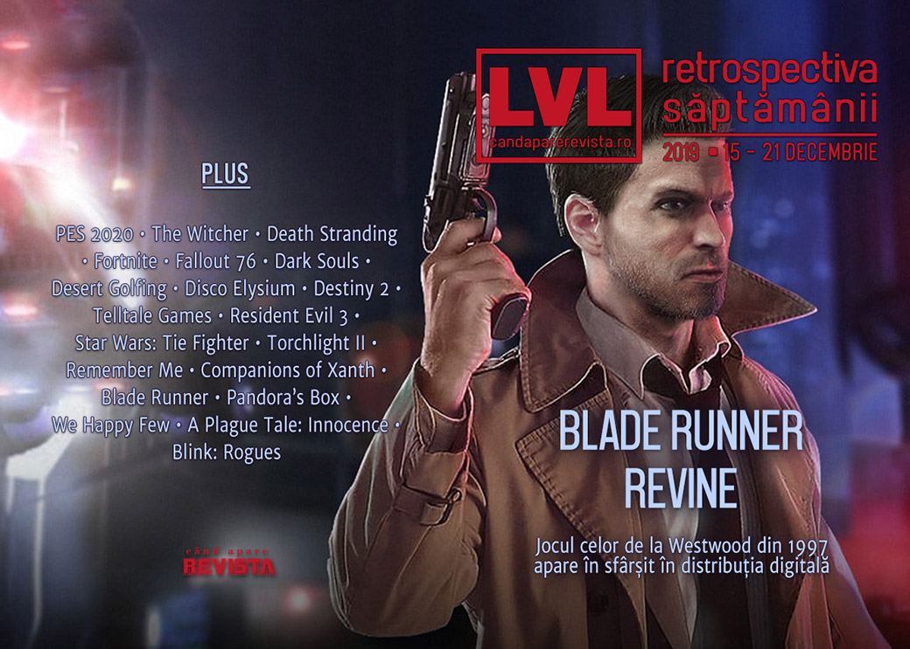

GOG readuce jocul Blade Runner după 22 de ani de rătăcire în neantul digital, serialul Witcher a fost lansat, un jucător de fotbal din Anglia dă de probleme în China din cauza postărilor pe rețelele sociale, facem tot felul de retrospective ale anului și deceniului, iar reducerile de iarnă sunt în plin avânt la toate magazinele de jocuri, ca să avem ce juca până încep lansările importante din Anul Jocului 2020.

Linkuri rapide:

* [Știri](#știri)
* [Articole (critică, dev, design)](#articole-critică-dev-design)
* [Made în România](#made-în-românia)
* [Anunţuri şi lansări de jocuri](#anunțuri-şi-lansări-de-jocuri)
* [Prăvălii de jocuri](#prăvălii-de-jocuri)

## Știri

* O companie de internet din Rusia, Rambler Group, cheamă în judecată Twitch pentru a-i cere daune de 2,9 miliarde de dolari din cauză că utilizatorii platformei de streaming ar fi transmis ilegal meciuri de fotbal din campionatul englezesc, meciuri pentru care Rambler deține drepturile exclusive în Rusia. ([VideoGamesChronicle](https://www.videogameschronicle.com/news/russian-lawsuit-calls-for-twitch-block/), [PC Gamer](https://www.pcgamer.com/russian-internet-company-sues-twitch-for-dollar3-billion-seeks-to-have-it-blocked/), [Polygon](https://www.polygon.com/2019/12/16/21025030/russian-lawsuit-twitch-english-premier-league-soccer-football-rambler-group), [GamesIndustry.biz](https://www.gamesindustry.biz/articles/2019-12-17-russias-rambler-group-suing-twitch-for-usd2-8-billion))
* Jucătorul de fotbal Mesut Özil a fost scos din jocul **PES 2020** în China după o serie de postări pe Instagram în care critică guvernul chinezesc pentru persecuția musulmanilor uiguri. ([PC Gamer](https://www.pcgamer.com/star-soccer-player-mesut-ozil-removed-from-pes-2020-in-china-over-tweets-criticizing-the-government/), [Polygon](https://www.polygon.com/2019/12/18/21028899/pes-mobile-china-mesut-ozil-banned-uighurs), [VideoGamesChronicle](https://www.videogameschronicle.com/news/mesut-ozil-deleted-from-pes-2020-in-china-following-uighur-muslims-criticism/), [GamesIndustry.biz](https://www.gamesindustry.biz/articles/2019-12-19-arsenals-mesut-zil-removed-from-pes-2020-after-criticising-chinas-treatment-of-muslims))
* CD Projekt au parafat [înțelegerea]() cu Andrzej Sapkowski privind drepturile asupra francizei Witcher, părând a pune bazele și unei colaborări viitoare. ([PC Gamer](https://www.pcgamer.com/cd-projekt-has-a-new-deal-with-the-witcher-creator-andrez-sapkowski/), [Polygon](https://www.polygon.com/2019/12/20/21032021/the-witcher-author-cd-projekt-legal-battle-royalties-new-contract), [Shacknews](https://www.shacknews.com/article/115585/cd-projekt-red-makes-peace-with-original-witcher-author), [Eurogamer](https://www.eurogamer.net/articles/2019-12-21-cd-projekt-and-the-witcher-author-andrzej-sapkowski-ink-new-ip-rights-deal))
* Între timp, Netflix a lansat și primul sezon din serialul The Witcher. ([RPS](https://www.rockpapershotgun.com/2019/12/20/the-witcher-guy-geralt-is-on-netflix-now/), [PCGamesN](https://www.pcgamesn.com/netflix-witcher-review-scores))
* Audiența The Game Awards a crescut cu 73% față de anul trecut, ajungând la peste 45 milioane de spectatori. ([Destructoid](https://www.destructoid.com/my-how-the-game-awards-has-grown-575532.phtml), [GameDaily.biz](https://gamedaily.biz/article/1473/the-game-awards-saw-viewership-grow-73-in-2019), [Variety](https://variety.com/2019/digital/news/the-game-awards-viewership-geoff-keighley-streaming-broadcast-1203446839/), [GamesIndustry.biz](https://www.gamesindustry.biz/articles/2019-12-18-the-game-awards-reached-7-5m-concurrent-viewers), [VentureBeat](https://venturebeat.com/2019/12/18/the-game-awards-audience-grows-73-to-45-2-million-livestreams/))

## Articole (critică, dev, design)

* [Goonieswave: The Rise of Kids-on-Bikes Games](https://egmnow.com/goonieswave-the-rise-of-kids-on-bikes-games/) (EGM)
* [A day in the life of the Death Stranding World Tour machine](https://www.polygon.com/features/2019/12/16/21019773/a-day-in-the-life-of-the-death-stranding-world-tour-machine-hideo-kojima) (Polygon)
* [Our attention spans are changing, and so must game design](https://www.polygon.com/2019/12/17/20928761/game-design-subscriptions-attention) (Polygon)
* [A Lawyer Explains the Very Messy Way YouTube Is Handling Videos for Kids](https://www.vice.com/en_us/article/5dmma3/a-lawyer-explains-the-very-messy-way-youtube-is-handling-videos-for-kids) (Vice)
* [One Man&#x27;s Quest To Collect Every Classic PC Game In Existence](https://kotaku.com/one-mans-quest-to-collect-every-classic-pc-game-in-exis-1839432488) (Kotaku)
* [Ethics in the Videogame Industry: A Mythbusting and Scientific Approach](https://www.gamasutra.com/blogs/CeliaHodent/20191220/356013/Ethics_in_the_Videogame_Industry_A_Mythbusting_and_Scientific_Approach.php) (Gamasutra)
* [Why Do People Collect Virtual Items?](www.psychologyofgames.com/2019/12/why-do-people-collect-virtual-items/) (The Psychology of Video Games)
* [How Video Game Cookbooks Are Helping Us Taste Digital Worlds](https://www.usgamer.net/articles/how-video-game-cookbooks-are-helping-us-taste-digital-worlds) (USgamer)
* [Where Are We? adds a modern UI to &#8217;90s RPGs like Might and Magic](https://www.pcgamesn.com/where-are-we) (PCGamesN)
* [The 15-year-old British gamer who won almost £1 million at the Fortnite World Cup](https://theface.com/life/jaden-ashman-fortnite-championship-winner-volume-4-issue-002) (The Face)

---

### _Not-a-review_
* [In the virtual world of Fallout 76, Gun Runners are making thousands in real-world cash](https://www.eurogamer.net/articles/2019-11-28-inside-the-world-of-fallout-76-virtual-gunrunning) (Eurogamer)
* [The Muddled, Flavorless Politics of Death Stranding](https://egmnow.com/the-muddled-flavorless-politics-of-death-stranding/) (EGM)
* [A Closer Look At Dark Souls&#x27; Most Difficult Player-Created Challenges](https://kotaku.com/a-closer-look-at-dark-souls-most-difficult-player-creat-1840512938) (Kotaku)
* [The Audaciously Simple &#39;Desert Golfing&#39; Taught Me to Cope With Grief](https://www.vice.com/en_us/article/n7jw3m/the-audaciously-simple-desert-golfing-taught-me-to-cope-with-grief) (Vice)
* [Dealing with my own grief in Disco Elysium](https://intothespine.com/2019/12/18/dealing-with-grief-disco-elysium/) (Into The Spine)

---

### Industrie
* [Game Awards: Ex-Nintendo of America Chief Reggie Fils-Aimé Weighs In on Future of Gaming](https://www.hollywoodreporter.com/heat-vision/nintendo-president-reggie-fils-aim-weighs-future-gaming-1262489) (The Hollywood Reporter)
* [Interview: Bungie on the continuing evolution of Destiny](https://www.videogameschronicle.com/features/interviews/destiny-2/) (VideoGamesChronicle)
* [Telltale 2.0: 'We cannot right the wrongs of the former company'](https://gamedaily.biz/article/1478/telltale-20-we-cannot-right-the-wrongs-of-the-former-company) (GameDaily.biz)
* [How ArenaNet is rewriting the narrative for its narrative writers](https://www.gamesindustry.biz/articles/2019-12-18-how-arenanet-is-re-writing-the-narrative-for-its-narrative-writers) (GamesIndustry.biz)
* [From Apex Legends to Star Wars: Respawn&rsquo;s redefining year in games](https://www.techradar.com/news/from-apex-legends-to-star-wars-respawns-redefining-year-in-games) (Tech Radar)

---

### Istorie, retrospectivă
* [Resident Evil 3 was a spin-off until Capcom changed its mind at the last minute](https://www.polygon.com/2019/12/18/21027264/resident-evil-3-was-a-spin-off-until-capcom-changed-its-mind-at-the-last-minute) (Polygon)
* [The making of TIE Fighter: How being the bad guys changed Star Wars forever](https://www.pcgamer.com/the-making-of-star-wars-tie-fighter/) (PC Gamer)
* [How sex in The Witcher evolved from 'gotta catch 'em all' pinups to meaningful relationships](https://www.pcgamer.com/how-sex-in-the-witcher-evolved-from-gotta-catch-em-all-pinups-to-meaningful-relationships/) (PC Gamer)
* [Has time finally caught up with Torchlight II?](https://www.rockpapershotgun.com/2019/12/16/has-time-finally-caught-up-with-torchlight-ii/) (RPS)
* [The heady, earnest Remember Me was action game storytelling at its best](https://www.theverge.com/2019/12/19/21028814/remember-me-dontnod-action-game-retrospective-cyberpunk-life-is-strange) (The Verge)
* [Companions of Xanth (Preceded by the Worrisome Case of Piers Anthony)](https://www.filfre.net/2019/12/companions-of-xanth-preceded-by-the-worrisome-case-of-piers-anthony/) (The Digital Antiquarian)
* [Pandora&#039;s Box](https://obscuritory.com/puzzle/pandoras-box/) (The Obscuritory)
* [How Westwood&#039;s Long-Lost Blade Runner Adventure Game Landed on GOG [Update]](https://www.usgamer.net/articles/how-westwoods-long-lost-blade-runner-adventure-game-landed-on-gog) (USgamer)
* [The resurrected Blade Runner game is a genuine classic](https://www.theverge.com/2019/12/18/21027749/blade-runner-game-classic-pc-re-release-gog) (The Verge)

---

### Retrospectiva anului
#### Jocuri
* [The Best Video Game Surprises Of 2019](https://kotaku.com/the-best-video-game-surprises-of-2019-1840533041) (Kotaku)
* [The best of Unknown Pleasures 2019](https://www.rockpapershotgun.com/2019/12/20/the-best-of-unknown-pleasures-2019/) (RPS)
* [The 10 best video games of 2019](https://www.theverge.com/2019/12/20/21009919/best-video-games-2019-zelda-control-untitled-goose-game) (The Verge)
* [A short list of the best short games of 2019](https://www.theverge.com/2019/12/18/21011442/best-video-games-2019-short-play-nintendo-switch-apple-arcade) (The Verge)
* [2019: The year of cosmic horror games](https://games.avclub.com/2019-the-year-of-cosmic-horror-games-1840400500) (A.V. Club)
* [Top 20 games of 2019](https://www.theguardian.com/games/2019/dec/17/top-20-games-of-2019) (The Guardian)
* [The Best Video Games of 2019](https://www.newyorker.com/culture/2019-in-review/the-best-video-games-of-2019) (New Yorker)
* [Best Indie Games of 2019 - Living the Independent Life](https://wccftech.com/best-indie-games-of-2019-living-the-independent-life/) (Wccf tech)
* [USG&#039;s Top 20 Games of 2019](https://www.usgamer.net/articles/usgamer-top-20-games-of-2019) (USgamer)
* [Topurile Mindcraft Stories pentru 2019 – Jocuri video](https://mindcraftstories.ro/index.php/2019/12/17/topurile-mindcraft-stories-pentru-2019-jocuri-video/) (Mindcraft Stories)

#### Focus
* [Why Hypnospace Outlaw is my game of the year](https://www.theverge.com/2019/12/17/20993857/hypnospace-outlaw-game-tendershoot-alternate-reality-internet-simulator-y2k-90s-game-of-the-year) (The Verge)
* [USG Game of The Year 2019: Disco Elysium Let Us Be Human, No Matter the Cost](https://www.usgamer.net/articles/usg-game-of-the-year-2019-disco-elysium-let-us-be-human-no-matter-the-cost) (USgamer)

#### Industrie
* [&quot;We Call Them Surprise Mechanics&quot;: 52 Quotes and Stats That Defined 2019 for Video Games](https://www.usgamer.net/articles/this-year-in-business-2019) (USgamer)
* [38 reasons why 2019 was not all bad](https://www.gamesindustry.biz/articles/2019-12-19-38-reasons-why-2019-was-not-all-bad) (GamesIndustry.biz)
* [4 events that shook up the game industry in 2019](https://www.gamasutra.com/view/news/355658/4_events_that_shook_up_the_game_industry_in_2019.php) (Gamasutra)
* [2019 Was the Year of Auto Chess Fever](https://www.usgamer.net/articles/2019-was-the-year-of-auto-chess-fever) (USgamer)
* [GamesIndustry.biz presents... The Year In Numbers 2019](https://www.gamesindustry.biz/articles/2019-12-17-gamesindustry-biz-presents-the-year-in-numbers-2019) (GamesIndustry.biz)

#### 2020
* [Console makers lay out their 2020 visions](https://www.gamesindustry.biz/articles/2019-12-20-console-makers-lay-out-their-2020-visions-opinion) (GamesIndustry.biz)
* [Release dates: every video game confirmed for 2020](https://www.vg247.com/2019/12/20/video-game-release-dates-2020/) (VG247)
* [Ten Games with Milestone Anniversaries in 2020](https://www.hardcoregamer.com/2019/12/17/ten-games-with-milestone-anniversaries-in-2020/363601/) (Hardcore Gamer)

---

### Retrospectiva deceniului
* [The 10 Best Gadgets of the 2010s](https://time.com/5745302/best-gadgets-of-the-2010s-decade/) (Time)
* [Gaming’s biggest trends of the past decade](https://www.polygon.com/features/2019/12/19/20997738/gaming-trends-2019-2010-decade) (Polygon)
* [The Decade Fandom Went Corporate](https://io9.gizmodo.com/the-decade-fandom-went-corporate-1840531064) (Gizmodo)
* PC Gamer publică [o serie de articole despre ultimul deceniu de gaming](https://www.pcgamer.com/the-2010s-all-our-stories-about-the-last-decade-in-pc-gaming/), printre care: (PC Gamer)
  * [Custom servers aren't dead, but this decade put them on life support](https://www.pcgamer.com/custom-servers-arent-dead-but-this-decade-put-them-on-life-support/)
  * [This was the decade that open worlds finally opened up](https://www.pcgamer.com/this-was-the-decade-that-open-worlds-finally-opened-up/)
  * [This was the decade that sex in games became personal](https://www.pcgamer.com/this-was-the-decade-that-sex-in-games-became-personal/)
  * [This is the decade where exploration did the talking](https://www.pcgamer.com/this-is-the-decade-where-exploration-did-the-talking/)
  * [Narrative choice is one of the most misunderstood promises of the decade](https://www.pcgamer.com/narrative-choice-is-one-of-the-most-misunderstood-promises-of-the-decade/)

---

### Dev, making of, mecanici
* [How The Witcher 3's best quest was made](https://www.pcgamer.com/how-the-witcher-3s-best-quest-was-made/) (PC Gamer)
* [How A Plague Tale: Innocence&#8217;s rat hordes were made](https://www.rockpapershotgun.com/2019/12/18/how-a-plague-tale-innocences-rat-hordes-were-made/) (RPS)
* [&quot;We Had to Make the Chicken and the Egg at the Same Time:&quot; A We Happy Few Postmortem](https://www.usgamer.net/articles/we-had-to-make-the-chicken-and-the-egg-at-the-same-time-a-we-happy-few-postmortem) (USgamer)
* [How do we improve resource harvesting in Real Time Strategy games?](https://www.gamasutra.com/blogs/BrandonCasteel/20191217/355793/How_do_we_improve_resource_harvesting_in_Real_Time_Strategy_games.php) (Gamasutra)

---

### Design, world-building, artă
* [Anthem Is Still Pretty](https://kotaku.com/anthems-seasonal-update-is-a-good-reminder-of-how-beaut-1840457111) (Kotaku)
* [Name&#x27;s Johnny, Johnny Silverhand](https://kotaku.com/names-johnny-johnny-silverhand-1840448092) (Kotaku)
* [Some Of The Best Video Game Screenshots Of 2019](https://kotaku.com/some-of-the-best-video-game-screenshots-of-2019-1840541235) (Kotaku)

## Made în România
* **Blink: Rogues** iese din early access. ([Romanian Game Developers](https://rogame.dev/2019/12/18/o-surpriza-placuta-blink-rogues/), [Steam](https://store.steampowered.com/app/739100/Blink_Rogues/))

## Anunțuri şi lansări de jocuri
### Anunţate
* **Surgeon Simulator 2** ([EGM](https://egmnow.com/surgeon-simulator-2-revealed/))
* **Gladiux** ([DSOGaming](https://www.dsogaming.com/news/gladiux-is-a-new-combat-action-game-coming-to-pc-in-2020-first-screenshots-teaser-trailer/))
* **Balsa Model Flight Sim**, un simulator de avioane-machetă ([PC Gamer](https://www.pcgamer.com/kerbal-space-program-creators-new-game-balsa-model-flight-sim-is-coming-next-year/))
* **Evolutis** ([Kotaku](https://kotaku.com/cyberpunk-adventure-evolutis-looks-like-playable-80s-a-1840529413))
* **F.I.S.T.** ([DSOGaming](https://www.dsogaming.com/news/f-i-s-t-is-a-new-unreal-engine-powered-metroidvania-style-game-that-will-support-ray-tracing/))

### Acum cu dată de lansare
* **Warcraft 3: Reforged**: 28 ianuarie 2020 ([VideoGamesChronicle](https://www.videogameschronicle.com/news/warcraft-iii-reforged-release-slips-to-january-2020/))
* **Conan Chop Chop**: 25 februarie 2020 ([Destructoid](https://www.destructoid.com/that-april-fools-turned-real-conan-game-is-out-in-february-575510.phtml))

### Lansate
* 17 decembrie: **Wattam** ([Epic Store](https://www.epicgames.com/store/en-US/product/wattam/))
* 17 decembrie: **Blade Runner** relansat în format digital după 22 de ani ([gog.com](https://www.gog.com/game/blade_runner))
* 17 decembrie: **Blink: Rogues** ([Steam](https://store.steampowered.com/app/739100/Blink_Rogues/))
* 18 decembrie: **Ironsight** ([Steam](https://store.steampowered.com/app/715220/Ironsight/))

## Prăvălii de jocuri

### Update catalog
* [The Witcher 3, Pillars of Eternity, and more coming to Xbox Game Pass this week](https://egmnow.com/the-witcher-3-pillars-of-eternity-and-more-coming-to-xbox-game-pass-this-week/) (EGM)
* [You can play Horizon Zero Dawn, one of the best PS4 exclusives, on PC soon via PS Now](https://www.pcgamer.com/you-can-play-horizon-zero-dawn-one-of-the-best-ps4-exclusives-on-pc-soon-via-ps-now/) (PC Gamer)

### Jocuri gratis și free weekends
* [Epic Games Store Holiday Sale will include 12 free games](https://egmnow.com/epic-games-store-holiday-sale-will-include-12-free-games/) (EGM)

### Reduceri și promoții
* [Nintendo has more than 700 Switch games on sale](https://www.destructoid.com/nintendo-has-more-than-700-switch-games-on-sale-575667.phtml) (Destructoid)
* [PlayStation Store closes out the year with a huge PS4 holiday sale](https://www.destructoid.com/playstation-store-closes-out-the-year-with-a-huge-ps4-holiday-sale-575784.phtml) (Destructoid)
* [The Epic Games Store Holiday Sale kicks off with $10 coupons and free games](https://www.pcgamer.com/the-epic-games-store-holiday-sale-kicks-off-with-dollar10-coupons-and-free-games/) (PC Gamer)
* [The Steam Winter Sale 2019 has begun](https://www.pcgamer.com/steam-winter-sale-2019/) (PC Gamer)
* [Save up to 50% on select PC games at the Microsoft Store](https://www.pcgamer.com/save-up-to-50-on-select-pc-games-at-the-microsoft-store/) (PC Gamer)
* [Origin's Holiday Sale is now live, with games up to 85% off](https://www.pcgamer.com/origins-holiday-sale-is-now-live-with-games-up-to-85-off/) (PC Gamer)
* [Dig through a pile of indie deals in the Itch.io Holiday Sale](https://www.pcgamer.com/dig-through-a-pile-of-indie-deals-in-the-itchio-holiday-sale/) (PC Gamer)
* [Weekend PC Download Deals for Dec. 20: Steam Winter Sale](https://www.shacknews.com/article/115576/weekend-pc-download-deals-for-dec-20-steam-winter-sale) (Shacknews)

---

{}
**Retrospectiva săptămânii** este rubrica duminicală în care trecem în revistă evenimentele săptămânii de pe frontul de gaming: știri şi articole (scrise de alții, bineînțeles, că e mai ușor aşa), industrie, lansări, oferte de jocuri, toate numai de savurat la cafeaua de duminică dimineața.

De asemenea, rubrica e deschisă oricui vrea și poate contribui. Dacă ai citit vreun articol sau vreo știre interesantă și crezi că merită incluse în retrospectiva săptămânii, te așteptăm pe forum pe unul dintre topicurile dedicate: [Știri](https://forum.candaparerevista.ro/viewtopic.php?f=4&t=46), [Articole](https://forum.candaparerevista.ro/viewtopic.php?f=4&t=206), [Gaming România](https://forum.candaparerevista.ro/viewtopic.php?f=4&t=1622)].
{}
