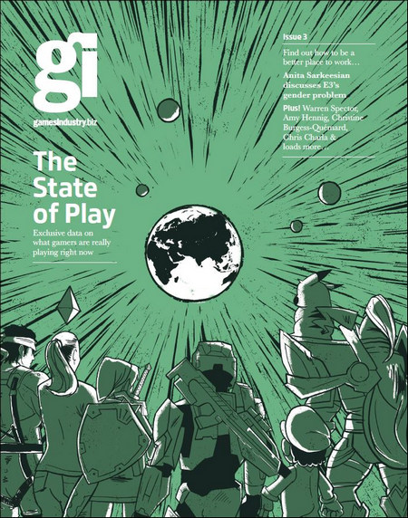

Linkuri rapide:

[LEVEL](#level-cehia-turcia) | [Game Informer](#game-informer-sua) | [PC Gamer](#pc-gamer-uk) | [EDGE](#edge-uk) | [RetroGamer](#retro-gamer-uk) | [PC Guru](#pc-guru-ungaria) | [The Games Machine](#the-games-machine-italia) | [Pelit](#pelit-finlanda) | [Pelaaja](#pelaaja-finlanda) | [Hobby Consolas](#hobby-consolas-spania) | [Power Unlimited](#power-unlimited-olanda) | [PC Games](#pc-games-germania)  | [PC Powerplay](#pc-powerplay-australia) | [Wireframe](#wireframe-marea-britanie) | [CanardPC](#canard-pc-franta) | [GamesIndustry.biz Magazine](#gamesindustry-biz-magazine-marea-britanie)

## LEVEL (Cehia & Turcia)

### [LEVEL (Cehia) (#295)](http://www.level.cz/starsi-cisla/level-295/) | [LEVEL (Turcia), iunie 2019 (#269)](https://www.level.com.tr/haber/genel/level-haziran-269-sayisi-bayilerde.html)



## Game Informer (SUA)

### [Iulie 2019](https://www.gameinformer.com/cover-reveal/2019/06/07/july-cover-revealed-star-wars-jedi-fallen-order)



## PC Gamer (UK)

### [Iulie 2019](https://www.pcgamer.com/pc-gamer-uk-july-issue-borderlands-3/) (#332)



## EDGE (UK)

### [Iulie 2019](https://www.myfavouritemagazines.co.uk/gaming/edge-magazine-back-issues/edge-july-2019-issue-333/) (#333)

Ediţia normală şi ediţia pentru abonaţi:


([Twitter EDGE](https://twitter.com/edgeonline/))

## Retro Gamer (UK)

### [#194](https://www.myfavouritemagazines.co.uk/retro-gamer-print-back-issues/retro-gamer-issue-194/)



([Site RetroGamer](https://www.retrogamer.net/))

## PC Guru (Ungaria)

### Iunie 2019



([Site PC Guru](https://www.pcguru.hu/magazin))

## The Games Machine (Italia)

### [Iunie 2019](https://www.thegamesmachine.it/edicola/133959/tgm-365-giugno-2019/) (#365)



## Pelit (Finlanda)

### Mai 2019



([Site Pelit](https://www.pelit.fi/))

## Pelaaja (Finlanda)

### [Iunie 2019](https://pelaaja.fi/lehdet/kesakuun-pelaaja-kaupoissa) (#201)



## Hobby Consolas (Spania)

### [#335](http://store.axelspringer.es/n-335-hobby-consolas.html)



([Site Hobby Consolas](https://www.hobbyconsolas.com/))

## Power Unlimited (Olanda)

### [Iunie 2019](https://www.pu.nl/magazine/edities/power-unlimited-2019-6)



## PC Games (Germania)

### [Iunie 2019](https://www.pcgames.de/PC-Games-Brands-19921/News/06-19-Borderlands3-1282731/) (#322)



## PC PowerPlay (Australia)

### [#276](https://www.zinio.com/au/pc-powerplay/console-5641-155262-i434975) & [#275](https://www.zinio.com/au/pc-powerplay/console-5641-155261-i434974)



## Wireframe (Marea Britanie)

### [#15](https://wireframe.raspberrypi.org/issues/15) | [#14](https://wireframe.raspberrypi.org/issues/14) | [#13](https://wireframe.raspberrypi.org/issues/13)





(Varianta digitală e gratuită, aveți link de download pe pagina fiecărei ediții)

## Canard PC (Franta)

### [Iunie 2019](https://www.canardpc.com/numero/395) (#395)



## GamesIndustry.biz Magazine (Marea Britanie)

### [#3](https://www.gamesindustry.biz/articles/2019-06-06-read-gamesindustry-biz-magazine-issue-3-right-now)

([Citește online](https://issuu.com/gamesindustry/docs/gi_19_mag_finalmag_digital))
