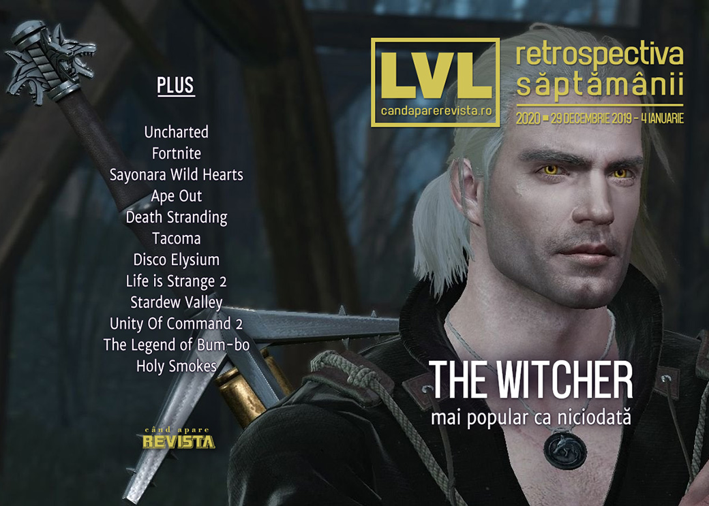

Început de an, Witcher e mai popular ca niciodată, Fortnite câștigă aproape toți banii, jocurile au bug-uri ca acum 20 de ani, filmul Uncharted pierde încă un regizor și ar trebui să terminăm și cu retrospectivele. Gata, a început Anul Jocului, țineți-vă pălăriile!

Linkuri rapide:

* [Știri](#știri)
* [Articole (critică, dev, design)](#articole-critică-dev-design)
* [Anunţuri şi lansări de jocuri](#anunțuri-şi-lansări-de-jocuri)
* [Made în România](#made-în-românia)
* [Prăvălii de jocuri](#prăvălii-de-jocuri)

## Știri

* Jocul Witcher 3 a atins la sfârșitul anului 2019, un record de popularitate, având mai mulți jucători simultani pe Steam decât a avut chiar și la lansare, motivul fiind, fără îndoială, succesul serialului proaspăt lansat de Netflix în decembrie. ([Destructoid](https://www.destructoid.com/toss-12-bucks-to-your-witcher-witcher-3-is-more-popular-on-steam-now-than-it-ever-has-been-576575.phtml), [Eurogamer](https://www.eurogamer.net/articles/2020-01-02-the-witcher-3-just-had-its-biggest-day-ever-on-steam-four-years-after-release), [PC Gamer](https://www.pcgamer.com/the-witcher-3-breaks-100000-concurrent-players-on-steam-for-the-first-time/))
* Filmul Uncharted pierde și al șaselea regizor, după ce Travis Knight a renunțat la proiect din cauza orarului. ([Polygon](https://www.polygon.com/2020/1/2/21046456/uncharted-movie-director-ps4-sony-pictures), [Destructoid](https://www.destructoid.com/uncharted-movie-loses-sixth-director-travis-knight-576881.phtml), [Escapist](https://www.escapistmagazine.com/v2/travis-knight-is-out-as-the-uncharted-movie-loses-its-sixth-director/), [VideoGamesChronicle](https://www.videogameschronicle.com/news/uncharted-movie-delayed-and-loses-another-director/), [GamesIndustry.biz](https://www.gamesindustry.biz/articles/2020-01-02-uncharted-movie-loses-sixth-director))
* Industria de jocuri a generat în 2019 venituri de 120 miliarde dolari... ([GamesIndustry.biz](https://www.gamesindustry.biz/articles/2020-01-02-record-usd120-1-billion-earned-by-games-and-interactive-media-in-2019), [VentureBeat](https://venturebeat.com/2020/01/02/superdata-games-hit-120-1-billion-in-2019-with-fortnite-topping-1-8-billion/))
* ... iar Fortnite a fost jocul cu cele mai mari încasări: 1,8 miliarde de dolari. ([VideoGamesChronicle](https://www.videogameschronicle.com/news/fortnite-led-digital-game-sales-in-2019/), [GameDaily.biz](https://gamedaily.biz/article/1484/report-fortnite-helps-push-digital-game-revenue-past-120-billion-in-2019-superdata), [Eurogamer](https://www.eurogamer.net/articles/2020-01-03-fortnite-was-2019s-top-grossing-game-despite-25-percent-revenue-dip), [The Verge](https://www.theverge.com/2020/1/2/21046920/fortnite-revenue-drop-superdata-nielsen-2019-earnings))
* Un bug ciudat, asemănător cu Y2K, a afectat jocul WWE 2K20: jucătorii nu au mai putut porni jocul imediat după Anul Nou, iar soluția temporară pe care au găsit-o a fost să schimbe data calculatorului sau consolei. ([Kotaku](https://kotaku.com/due-to-a-y2k-like-bug-wwe-2k20-is-almost-unplayable-in-1840760479), [Eurogamer](https://www.eurogamer.net/articles/2020-01-02-wwe-2k20-suffered-an-embarrassing-y2020k-bug-yesterday), [VideoGamesChronicle](https://www.videogameschronicle.com/news/wwe-2k20-crash-error-wont-run-in-2020/), [GamesIndustry.biz](https://www.gamesindustry.biz/articles/2020-01-02-2k-games-resolves-new-year-bug-in-wwe-2k20), [PC Invasion](https://www.pcinvasion.com/wwe-2k20-crashes-because-its-2020-and-no-thats-not-a-joke/))

## Articole (critică, dev, design)

* [Extra Ball: How Visual Pinball Wizards Bring Back the Classics](https://egmnow.com/extra-ball-how-visual-pinball-wizards-bring-back-the-classics/) (EGM)
* [Surviving GameStop: How Passion, Community, and Novelty Keep Indie Game Stores Alive](https://egmnow.com/surviving-gamestop-how-passion-community-and-novelty-keep-indie-game-stores-alive/) (EGM)
* [&#039;Limited Appeal&#039; or Lack of &#039;Polish&#039; Shouldn&#039;t Stop You from Playing Games](https://www.escapistmagazine.com/v2/good-games-are-more-than-aaa-game-polish-terminator-resistance/) (Escapist)
* [The indie side of cyberpunk](https://www.pcgamer.com/mag-337-cyberpunk-sup-indies/) (PC Gamer)
* [Games are Not Magic](https://videoda.me/games-are-not-magic-520ac407452b) (Medium)
* [The “Zorfon” Mystery: Answers from a Golden-Age Video Game Developer](https://medium.com/@atarispot/the-zorfon-mystery-6d1f58544254) (Medium)
* [In 2019, Games Explored the Meaning of Travel](https://www.fanbyte.com/features/games-travel/) (Fanbyte)
* [Filosofia Politică a Jocurilor - Cine o să construiască Drumurile?](https://mindcraftstories.ro/index.php/2019/12/30/filosofia-politica-a-jocurilor-cine-o-sa-construiasca-drumurile/) (Mindcraft Stories)

---

### Actualitate
* [The Witcher 3&#8217;s resurgence proves that games have changed](https://venturebeat.com/2019/12/30/the-witcher-3s-resurgence-proves-that-games-have-changed/) (VentureBeat)

---

### _Not-a-review_
* [&#39;Sayonara Wild Hearts&#39; and the Masks We Wear to Protect Ourselves](https://www.vice.com/en_us/article/dygzxy/sayonara-wild-hearts-and-the-masks-we-wear-to-protect-ourselves) (Vice)
* [Ape Out helped me survive the holidays](https://www.polygon.com/2020/1/1/21043478/ape-out-holiday-stress-reliever) (Polygon)
* [Disco Elysium Is a Kind of Self-Loathing I Can Understand](https://www.pastemagazine.com/articles/2019/12/disco-elysium-is-a-kind-of-self-loathing-i-can-und.html) (Paste)
* [Life is Strange 2: Validating the Pain of Being Human](http://uppercutcrit.com/life-is-strange-2-validating-the-pain-of-being-human/) (Uppercut)
* [Opened World: Who Watches the Workers?](http://www.haywiremag.com/columns/opened-world-who-watches-the-workers/) (Haywire Magazine)
* [Death Stranding: Why it&#039;s the most important video game of this generation](https://www.spieltimes.com/original/death-stranding-why-its-the-most-important-video-game-of-this-generation/) (Spiel Times)

---

### Industrie
* [Vince Zampella &amp; DICE Los Angeles Can Help EA&#039;s Disappointing Output](https://www.escapistmagazine.com/v2/vince-zampella-dice-los-angeles-can-help-eas-disappointing-output) (Escapist)
* [The Game Awards 2019 Weren&#039;t Great and That&#039;s Okay](https://www.spieltimes.com/original/the-game-awards-2019-werent-great-thats-okay/) (Spiel Times)

---

### Istorie, retrospectivă
* [The history of cyberpunk on PC](https://www.pcgamer.com/the-history-of-cyberpunk-on-pc/) (PC Gamer)
* [RollerCoaster Tycoon: the best-optimised game of all time?](https://www.pcgamesn.com/rollercoaster-tycoon/code-chris-sawyer) (PCGamesN)
* [Buzz Aldrin&#8217;s Race into Space (and Space-Program Games in General)](https://www.filfre.net/2020/01/buzz-aldrins-race-into-space-and-space-program-games-in-general/) (The Digital Antiquarian)
* ["Oh my god, what have I got myself into?" The inside story of the golden age of video game magazines](https://www.gamesradar.com/oh-my-god-what-have-i-got-myself-into-the-amazing-rollercoaster-story-of-the-golden-age-of-video-game-magazines/) (GamesRadar+)

---

### Retrospectiva anului
#### Jocuri
* [2019: The Year Familiarity and Originality Both Triumphed](https://www.hardcoregamer.com/2020/01/01/2019-the-year-familiarity-and-originality-both-triumphed/364507/) (Hardcore Gamer)
* [The Untitled 2019 Alternative PC Gamer Awards](https://www.pcgamer.com/the-untitled-2019-alternative-pc-gamer-awards/) (PC Gamer)
* [Polygon’s best stories and videos of 2019](https://www.polygon.com/2019/12/31/21031853/polygon-best-stories-videos-essays-interviews-2019) (Polygon)

#### Focus
* [Game of the Year 2019: Disco Elysium](https://www.pcgamer.com/game-of-the-year-2019-disco-elysium/) (PC Gamer)
* [The one video game my kids played all year long](https://arstechnica.com/gaming/2019/12/stardew-valley-my-familys-2019-game-of-the-year/) (Ars Technica)

#### Industrie
* [GamesBeat Rewind: 2019&#8217;s biggest PR disasters](https://venturebeat.com/2019/12/29/gamesbeat-rewind-2019s-biggest-pr-disasters/) (VentureBeat)

#### 2020
* [Our most anticipated PC games of 2020](https://www.pcgamer.com/most-anticipated-pc-games-2020/) (PC Gamer)
* [2020 Preview: This year’s biggest new game releases](https://www.videogameschronicle.com/features/2020-video-game-releases/) (VideoGamesChronicle)
* [USG&#039;s 20 Most Anticipated Games of 2020](https://www.usgamer.net/articles/usgs-20-most-anticipated-games-of-2020) (USgamer)
* [Vampires, gangsters and Keanu Reeves: our games picks for 2020](https://www.theguardian.com/games/2020/jan/02/games-most-anticipated-2020-preview) (The Guardian)

---

### Retrospectiva deceniului
* [Narrative Design Evolved Interactive Storytelling in the 2010s](https://www.escapistmagazine.com/v2/narrative-design-evolved-interactive-storytelling-in-the-2010s/) (Escapist)
* [The Greatest Game Trailers Of The Decade](https://kotaku.com/the-greatest-game-trailers-of-the-decade-1840731293) (Kotaku)
* [How indie devs saved couch multiplayer in the 2010s](https://www.pcgamer.com/how-indie-devs-saved-couch-multiplayer-in-the-2010s/) (PC Gamer)
* [From Minecraft to Auto Chess: The 29 games that define the 2010s](https://venturebeat.com/2019/12/30/gamesbeat-rewind-2019-the-games-that-tell-the-decades-story/) (VentureBeat)
* [The 100 Best Video Games of the 2010s](https://www.slantmagazine.com/features/the-100-best-video-games-of-the-2010s/) (Slant Magazine)
* [From ray tracing to AI: best gaming technology advances in the last decade](https://www.techradar.com/news/from-ray-tracing-to-ai-best-gaming-technology-advances-in-the-last-decade) (TechRadar)

---

### Dev, making of, mecanici
* [How Unity Of Command 2 balances game design with military history](https://www.rockpapershotgun.com/2020/01/01/how-unity-of-command-2-balances-game-design-with-military-history/) (RPS)
* [How the Photo Mode Became a Homogenized Feature of Commodified Games](https://www.vice.com/en_us/article/pkeyk9/how-the-photo-mode-became-a-homogenized-feature-of-commodified-games) (Vice)
* [Blending the rules of combat in  The Legend of Bum-bo](https://www.gamasutra.com/view/news/356026/Blending_the_rules_of_combat_in_The_Legend_of_Bumbo.php) (Gamasutra)
* [How much of a genius-level move was using binary space partitioning in Doom?](https://arstechnica.com/gaming/2019/12/how-much-of-a-genius-level-move-was-using-binary-space-partitioning-in-doom/) (Ars Technica)

---

### Design, world-building, artă
* [The real-world history that breathes life into The Witcher](https://www.polygon.com/2020/1/4/21043407/the-witcher-explained-history-poland-holocaust-soviet-comparisons) (Polygon)
* [Tracing the Interconnectedness of Art and Video Games](https://hyperallergic.com/530076/tracing-the-interconnectedness-of-art-and-video-games/) (Hyperallergic )
* [Syd Mead Has Died](https://kotaku.com/syd-mead-has-died-1840730705) (Kotaku)

## Made în România
* [Jocurile românești lansate în 2019](https://rogame.dev/jocuri/?fwp_game_launch=2019). (Romanian Game Developers)

## Anunțuri şi lansări de jocuri
### Anunţate
* **The House In The Hollow** ([DSOGaming](https://www.dsogaming.com/news/the-house-in-the-hollow-is-a-new-indie-first-person-exploration-game-coming-out-in-q4-2020/))
* **Aperture Camera**, un joc bazat pe o mecanică dezvoltată de Valve pentru prequelul anulat al lui Portal ([DSOGaming](https://www.dsogaming.com/videotrailer-news/lunchhouse-software-is-working-on-a-game-inspired-by-the-cancelled-portal-prequel-aperture-camera/))
* **Gray Zone**, un RTS de la vecinii slovaci ([PC Gamer](https://www.pcgamer.com/gray-zone-is-a-sci-fi-rts-releasing-in-early-access-next-year/))

### Acum cu dată de lansare
* **Wizardry: Labyrinth of Lost Souls**: 15 ianuarie ([PC Invasion](https://www.pcinvasion.com/wizardry-labyrinth-of-lost-souls-launches-on-pc-on-january-15/))
* **The Pedestrian**: 29 ianuarie ([PC Gamer](https://www.pcgamer.com/roadsign-side-scroller-the-pedestrian-is-out-later-this-month/))

### Lansate
* 1 ianuarie: **miniLAW: Ministry of Law**

## Prăvălii de jocuri
### Știri
* [Sekiro: Shadows Die Twice is Steam's Game of the Year 2019](https://www.pcgamer.com/sekiro-shadows-die-twice-is-steams-game-of-the-year-2019/) (PC Gamer)
* [Over 8,000 games were released on Steam in 2019, according to SteamSpy](https://www.pcgamesinsider.biz/news/70259/over-8000-games-were-released-on-steam-in-2019-according-to-steamspy/) (PCGamesInsider.biz)

### Update catalog
* [Grand Theft Auto V Is On Game Pass Now](https://kotaku.com/grand-theft-auto-v-is-on-game-pass-now-1840789040) (Kotaku)
* [Twitch Prime has five more free games for you](https://www.destructoid.com/twitch-prime-has-five-more-free-games-for-you-576935.phtml) (Destructoid)
* [Uncharted: The Nathan Drake Collection headlines January PlayStation Plus line-up](https://www.eurogamer.net/articles/2020-01-02-uncharted-the-nathan-drake-collection-headlines-january-playstation-plus-line-up) (Eurogamer)
* [Stadia Pro adds free Rise of the Tomb Raider and Thumper](https://www.videogameschronicle.com/news/stadia-pro-adds-rise-of-the-tomb-raider-and-thumper/) (VideoGamesChronicle)

### Jocuri gratis și free weekends
* [GRID 2019 is free to play this weekend on Steam](https://www.dsogaming.com/news/grid-2019-is-free-to-play-this-weekend-on-steam/) (DSOGaming)
* [Dig Dug meets Bomberman in free roguelike Holy Smokes](https://www.pcgamer.com/dig-dug-meets-bomberman-in-free-roguelike-holy-smokes/) (PC Gamer)
* [Darksiders games are now free on Epic Games Store](https://www.videogameschronicle.com/news/darksiders-games-are-now-free-on-epic-games-store/) (VideoGamesChronicle)

### Reduceri și promoții
* [January 2020&#039;s Humble Choice includes Shadow of War, Street Fighter V, and Bad North](https://www.pcinvasion.com/january-2020s-humble-choice-includes-shadow-of-war-street-fighter-v-and-bad-north/) (PC Invasion)

---

{}
**Retrospectiva săptămânii** este rubrica duminicală în care trecem în revistă evenimentele săptămânii de pe frontul de gaming: știri şi articole (scrise de alții, bineînțeles, că e mai ușor aşa), industrie, lansări, oferte de jocuri, toate numai de savurat la cafeaua de duminică dimineața.

De asemenea, rubrica e deschisă oricui vrea și poate contribui. Dacă ai citit vreun articol sau vreo știre interesantă și crezi că merită incluse în retrospectiva săptămânii, te așteptăm pe forum pe unul dintre topicurile dedicate: [Știri](https://forum.candaparerevista.ro/viewtopic.php?f=4&t=46), [Articole](https://forum.candaparerevista.ro/viewtopic.php?f=4&t=206), [Gaming România](https://forum.candaparerevista.ro/viewtopic.php?f=4&t=1622)].
{}
