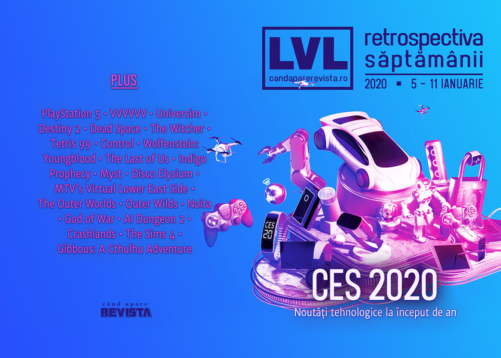

A avut loc CES 2020, poșta britanică lansează timbre cu jocuri clasice, oamenii din industrie participă la eforturile de combatere a incendiilor din Australia, avem multe materiale interesante de lecturat și, cel mai important, avem dată de lansare pentru ultimul episod din **Kentucky Route Zero**.

Linkuri rapide:

* [Știri](#știri)
* [Articole (critică, dev, design)](#articole-critică-dev-design)
* [Anunţuri şi lansări de jocuri](#anunțuri-şi-lansări-de-jocuri)
* [Made în România](#made-în-românia)
* [Prăvălii de jocuri](#prăvălii-de-jocuri)

## Știri
* Compania de poștă britanică (Royal Mail) lansează o emisiune de mărci poștale dedicate jocurilor video clasice britanice, precum Tomb Raider, Elite, Dizzy, Lemmings sau Populous. ([Kotaku](https://kotaku.com/video-game-stamps-pay-tribute-to-the-classics-in-case-1840838096), [Eurogamer](https://www.eurogamer.net/articles/2020-01-07-royal-mail-is-putting-dizzy-lemmings-and-elite-on-stamps), [PC Gamer](https://www.pcgamer.com/the-royal-mail-is-honouring-classic-british-games-via-the-medium-of-stamps/), [VideoGamesChronicle](https://www.videogameschronicle.com/news/new-royal-mail-stamps-celebrate-classic-uk-video-games/), [The Guardian](https://www.theguardian.com/games/2020/jan/07/worms-tomb-raider-classic-uk-video-games-stamps))
* Terry Cavanagh face public codul sursă al lui **VVVVVV** cu ocazia aniversării de 10 ani a lansării jocului. ([Shacknews](https://www.shacknews.com/article/115750/vvvvvv-creator-makes-the-game-open-source-on-its-10th-anniversary), [RPS](https://www.rockpapershotgun.com/2020/01/10/you-can-now-tinker-with-vvvvvvs-source-code-for-free/), [PC Gamer](https://www.pcgamer.com/vvvvvv-goes-open-source-for-its-10-year-anniversary/))
* Studioul Fantasy Flight Interactive, deschis în 2017 pentru adaptări digitale ale jocurilor tabletop Fantasy Flight, se închide. ([PC Gamer](https://www.pcgamer.com/digital-tabletop-game-studio-fantasy-flight-interactive-is-closing/), [Kotaku](https://kotaku.com/fantasy-flights-video-game-studio-is-closing-1840862123), [RPS](https://www.rockpapershotgun.com/2020/01/10/fantasy-flight-interactive-are-closing-their-doors-just-two-years-after-opening/), [GamesIndustry.biz](https://www.gamesindustry.biz/articles/2020-01-07-fantasy-flight-interactive-shutting-down))
* Au fost anunțate nominalizările pentru premiile ce vor fi acordate la GDC 2020 în luna martie:
  * Pentru premiile IGF (Independent Games Festival Awards) vor concura jocuri precum Untitled Goose Game, Slay the Spire, Mutazione sau A Short Hike. ([Site IGF](https://igf.com/article/here-are-your-finalists-2020-independent-games-festival-awards), [Shacknews](https://www.shacknews.com/article/115689/igf-2020-nominees-include-untitled-goose-game-slay-the-spire), [Destructoid](https://www.destructoid.com/stuck-in-a-gaming-rut-try-playing-some-of-the-igf-2020-finalists-577285.phtml), [RPS](https://www.rockpapershotgun.com/2020/01/08/igf-finalists-announced-confirm-rps-is-correct-about-everything/), [Gamasutra](https://www.gamasutra.com/view/news/356328/Here_are_your_finalists_for_the_2020_Independent_Games_Festival_Awards.php), [GamesIndustry.biz](https://www.gamesindustry.biz/articles/2020-01-07-mutazione-receives-four-nominations-for-igf-awards-2020-including-grand-prize))
  * Iar pentru premiile GDC (Game Developers Choice Awards) se vor lupta, printre altele, Control, Death Stranding și Outer Wilds. ([Gamasutra](http://www.gamasutra.com/view/news/356378/Death_Stranding_leads_the_pack_of_2020_Game_Developers_Choice_Awards_nominees.php), [PC Gamer](https://www.pcgamer.com/death-stranding-control-and-outer-wilds-lead-the-2020-game-developers-choice-award-nominations/), [GamesIndustry.biz](https://www.gamesindustry.biz/articles/2020-01-08-death-stranding-receives-seven-nominations-for-2020-gdc-awards-including-goty))
* Au fost anunțate și nominalizările pentru premiile Dice Awards, decernate în cadrul DICE Summit în luna februarie. ([Shacknews](https://www.shacknews.com/article/115752/the-dice-awards-2020-categories-nominees), [Gamasutra](https://www.gamasutra.com/view/news/356530/Control_and_Death_Stranding_lead_nominations_for_2020_DICE_Awards.php), [GamesIndustry.biz](https://www.gamesindustry.biz/articles/2020-01-10-control-death-stranding-each-receive-eight-dice-2020-nominations-including-game-of-the-year))
* O asociație comercială din American cu peste 700.000 de membri a lansat o campanie pentru a promova eforturile de sindicalizare în industria jocurilor. ([RPS](https://www.rockpapershotgun.com/2020/01/07/american-trade-union-launches-campaign-for-games-industry-unionisation/), [The Verge](https://www.theverge.com/2020/1/7/21055445/game-workers-union-cwa-union-partnership-tech-video-games-organizing), [Vice](https://www.vice.com/en_us/article/z3bvj9/one-of-americas-largest-unions-gets-serious-about-organizing-game-developers), [Polygon](https://www.polygon.com/2020/1/9/21058485/game-worker-unionization-cwa-code-emma-kinema))
* Oamenii din industria jocurilor donează timp și bani pentru a ajuta lupta împotriva incendiilor din Australia:
  * Crytivo, dezvoltatorul jocului **The Universim** donează profitul din vânzarea jocului pe următoarele două luni ([PC Gamer](https://www.pcgamer.com/the-universim-developer-crytivo-is-donating-its-profits-to-australian-wildfire-relief/), [RPS](https://www.rockpapershotgun.com/2020/01/09/the-universim-devs-are-donating-their-next-two-months-of-revenue-to-aid-australian-bushfire-relief/), [Polygon](https://www.polygon.com/2020/1/10/21059956/crytivo-australian-relief-efforts-donate-pc-windows-steam), [GamesIndustry.biz](https://www.gamesindustry.biz/articles/2020-01-08-the-universim-developer-crytivo-donating-two-months-revenues-to-australian-bushfire-relief))
  * Mai mulți streameri din Australia au organizat un eveniment caritabil pe Twitch și au strâns câteva sute de mii de dolari ([Kotaku](https://kotaku.com/twitch-streamers-raise-hundreds-of-thousands-of-dollars-1840877159))
  * Bungie vinde tricouri Destiny 2, urmând a dona profiturile ([Destructoid](https://www.destructoid.com/bungie-will-sell-destiny-2-shirts-to-help-fight-australia-s-fires-577552.phtml), [PC Gamer](https://www.pcgamer.com/bungie-is-raising-funds-for-australian-firefighters-with-a-limited-edition-destiny-2-t-shirt/), [Gamasutra](https://www.gamasutra.com/view/news/356541/Ubisoft_Bungie_join_ranks_of_devs_raising_funds_for_those_affected_by_Australian_fires.php))

### CES 2020
În perioada 7-10 ianuarie s-a desfășurat CES 2020:

* Dintre știrile mai importante:
  * Sony a prezentat logo-ul pentru PlayStation 5 ([The Verge](https://www.theverge.com/2020/1/6/21019829/sony-playstation-5-ps5-logo-reveal-ps4-users-numbers-ces-2020), [Shacknews](https://www.shacknews.com/article/115669/playstation-5-logo-revealed-at-sony-ces-2020-presentation), [VideoGamesChronicle](https://www.videogameschronicle.com/news/sony-reveals-the-ps5-logo/), [Kotaku](https://kotaku.com/the-playstation-5s-new-logo-sure-looks-familiar-1840841141), [Eurogamer](https://www.eurogamer.net/articles/2020-01-07-sony-has-revealed-the-playstation-5-logo))

  * AMD a anunțat un nou model de plăci video din seria 5xxx și Ryzen 4000, o linie de procesoare pentru dispozitive mobile. ([Eurogamer](https://www.eurogamer.net/articles/digitalfoundry-2020-amd-announces-rx-5600-xt-ryzen-4000-mobile), [DSOGaming](https://www.dsogaming.com/news/amd-officially-releases-its-3rd-generation-amd-ryzen-4000-series-cpus-for-laptops/))
  
  * Asus și Nvidia au prezentat un monitor cu refresh de 360Hz ([PC Gamer](https://www.pcgamer.com/asus-and-nvidia-announce-the-first-360hz-g-sync-monitor/), [Shacknews](https://www.shacknews.com/article/115651/nvidia-g-sync-360hz-esports-displays-announced-at-ces-2020), [GameSpace](https://www.gamespace.com/all-articles/news/rog-swift-360-monitor-displays-at-a-ridiculous-360hz))

  * Intel a prezentat un model de PC modular ([The Verge](https://www.theverge.com/2020/1/6/21051276/intel-ghost-canyon-nuc-9-extreme-confirmed-ces-2020-modular-gaming-desktop), [Eurogamer](https://www.eurogamer.net/articles/digitalfoundry-2020-evolution-of-the-pc-form-factor-nuc-element-intel-razer-cooler-master), [RPS](https://www.rockpapershotgun.com/2020/01/10/ces-2020-intel-xe-gpu-pictures/), [Shacknews](https://www.shacknews.com/article/115732/intel-teases-first-discrete-graphics-card-in-20-years-at-ces-2020), [Eurogamer](https://www.eurogamer.net/articles/digitalfoundry-2020-intel-reveals-their-first-discrete-graphics-card-dg1-en-route-to-developers)), care a fost și implementat de Razer într-un PC impresionant ([The Verge](https://www.theverge.com/2020/1/7/21054602/razer-tomahawk-desktop-gaming-pc-intel-nuc-element-design-specs-ces-2020), [PC Invasion](https://www.pcinvasion.com/razer-tomahawk-makes-pc-building-easy/))

* Sumarul evenimentului: [Eurogamer](https://www.eurogamer.net/articles/digitalfoundry-2020-01-06-ces-2020-pc-hardware-headlines-360hz-mini-led-nvidia-drivers), [Shacknews (1)](https://www.shacknews.com/article/115713/the-best-of-the-best-ces-2020-highlights), [Shacknews (2)](https://www.shacknews.com/article/115756/shacknews-best-of-ces-2020-products-and-innovation), [Wired](https://www.wired.com/story/best-of-ces-2020/)

* Alte articole:
  * [Inside Intel’s Ghost Canyon NUC, the incredibly small modular desktop PC](https://www.theverge.com/2020/1/7/21051879/intel-pc-nuc-9-extreme-ghost-canyon-element-hands-on-teardown-ces-2020) (The Verge)
  * [How gaming PCs are competing with the PS5 and Xbox Series X](https://www.theverge.com/2020/1/10/21060617/pc-gaming-ces-2020-sony-microsoft-alienware-razer-consoles) (The Verge)
  * [PS5 logo ‘breaks Instagram image likes record for games&#8217;](https://www.videogameschronicle.com/news/ps5-logo-breaks-instagram-image-likes-record/) (VideoGamesChronicle)

## Articole (critică, dev, design)
* [Forget Lord of the Rings—The Witcher III Should Be the New Standard for Fantasy](https://egmnow.com/forget-lord-of-the-rings-the-witcher-iii-should-be-the-new-standard-for-fantasy/) (EGM)
* [Hard Games Haven&#x27;t Gotten Easier, But They Did Get Nicer](https://kotaku.com/hard-games-havent-gotten-easier-but-they-did-get-nicer-1840877839) (Kotaku)
* [How one company orchestrated a talent war between Twitch, Mixer, and YouTube](https://www.theverge.com/creators/2020/1/6/21051500/loaded-streamer-talent-agency-twitch-mixer-youtube-ninja-shroud-courage) (The Verge)
* [Digital Demonology: The Historical Origins of Gaming’s Infernal Obsession](https://egmnow.com/digital-demonology-the-historical-origins-of-gamings-infernal-obsession/) (EGM)
* [Inside TASBot’s semi-secret, probably legal effort to control the Nintendo Switch](https://arstechnica.com/gaming/2020/01/inside-tasbots-semi-secret-probably-legal-effort-to-control-the-nintendo-switch/) (Ars Technica)
* [Like animals, video game AI is stupidly intelligent](https://www.eurogamer.net/articles/2020-01-09-like-animals-video-game-ai-is-stupidly-intelligent) (Eurogamer)
* [Putting controls on your kids' gaming is a key part of being a parent](https://www.theguardian.com/games/2020/jan/10/putting-controls-on-your-kids-gaming-is-a-key-part-of-being-a-parent) (The Guardian)
* [Tales from the New Small Screen: Inside the World of Mobile Game Writers](https://egmnow.com/tales-from-the-new-small-screen-inside-the-world-of-mobile-game-writers/) (EGM)
* [The Witcher’s Netflix success: How three timelines somehow became cohesive](https://arstechnica.com/gaming/2020/01/the-witchers-netflix-success-how-three-timelines-somehow-became-cohesive/) (Ars Technica)
* [Tetris 99&#039;s Biggest Fan Is The Father of Tetris Himself, Alexey Pajitnov](https://www.usgamer.net/articles/tetris-99s-biggest-fan-is-the-father-of-tetris-himself-alexey-pajitnov) (USgamer)
* [World of anti-Warcraft: the activists turning online video games into protest sites](https://theface.com/life/video-games-violence-grand-theft-auto-world-of-warcraft-americas-army-joseph-delappe) (The Face)

---

### Actualitate
* [Gallery: The amazing costumes, weird controllers, and gaming rarities of MAGFest 2020](https://arstechnica.com/gaming/2020/01/gallery-the-amazing-costumes-weird-controllers-and-gaming-rarities-of-magfest-2020/) (Ars Technica)

---

### Reportaj
* [How Game Companies Use Credits To Reward, Or Punish, Developers](https://kotaku.com/how-game-companies-use-credits-to-reward-or-punish-de-1840905129) (Kotaku)

---

### _Not-a-review_
* [The Sexiness Of Control](https://kotaku.com/the-sexiness-of-control-1840876335) (Kotaku)
* [Wolfenstein: Youngblood&#8217;s impossible 80s setting makes you want to save the world](https://www.rockpapershotgun.com/2020/01/08/wolfenstein-youngbloods-impossible-80s-setting-makes-you-want-to-save-the-world/) (RPS)

---

### Industrie
* [&#8220;All of our games&#8230; will play up and down that family of devices&#8221; – Xbox&#8217;s Matt Booty ends the next-gen exclusive as we know it](https://www.mcvuk.com/we-need-to-deliver-on-the-promises-that-we-make-xbox-game-studios-matt-booty-on-the-future-of-xbox/) (MCV/Develop) (TL;DR pe [Ars Technica](https://arstechnica.com/gaming/2020/01/xbox-series-x-wont-have-first-party-exclusives-for-a-while/))
* [The Last of Us director Bruce Straley on ludonarrative dissonance](https://www.gamesindustry.biz/articles/2020-01-07-the-last-of-us-director-bruce-straley-on-ludonarrative-dissonance) (GamesIndustry.biz)
* [Tim Willits: Recapturing the emotional core of Doom](https://www.gamesindustry.biz/articles/2020-01-09-tim-willits-recapturing-the-emotional-core-for-doom) (GamesIndustry.biz)
* [Pauline Jacquey’s World Tour: The Unlikely Journey of Ubisoft’s Punk Nomad Fixer](https://egmnow.com/pauline-jacqueys-world-tour-the-unlikely-journey-of-ubisofts-punk-nomad-fixer/) (EGM)

---

### Istorie, retrospectivă
* [Indigo Prophecy Has One Of The Best Opening Levels Ever Made](https://kotaku.com/indigo-prophecy-has-one-of-the-best-opening-levels-ever-1840796490) (Kotaku)
* [How Sony's PlayStation 2 took the world by storm](https://www.gamesindustry.biz/articles/2020-01-06-how-sonys-playstation-2-took-the-world-by-storm) (GamesIndustry.biz)
* [Rockstar Spouse and the slow change of culture](https://www.gamesindustry.biz/articles/2020-01-06-rockstar-spouse-and-the-slow-change-of-culture) (GamesIndustry.biz)
* [The Game Archaeologist: That time when MTV made a virtual world](https://massivelyop.com/2020/01/11/the-game-archaeologist-that-time-when-mtv-made-a-virtual-world/) (Massively OP)
* [The RetroBeat: Missing Myst](https://venturebeat.com/2020/01/10/the-retrobeat-missing-myst/) (VentureBeat)

---

### Retrospectiva anului
#### Jocuri
* [Best PC games of 2019](https://www.rockpapershotgun.com/2020/01/06/best-pc-games-of-2019/) (RPS)
* [40 of the best: RPS&#8217; finest reads from 2019](https://www.rockpapershotgun.com/2020/01/06/40-of-the-best-rps-finest-reads-from-2019/) (RPS)
* [How 2019’s Best Games Will Influence the Next Generation (and Beyond)](https://www.escapistmagazine.com/v2/2019-best-games-influence-next-generation/) (Escapist)

#### Industrie
* [3 Disruptive Game Design Trends to Look Forward to in 2020](https://gamasutra.com/blogs/PaulGadi/20200106/356291/3_Disruptive_Game_Design_Trends_to_Look_Forward_to_in_2020.php) (Gamasutra)

#### 2020
* [2020 in preview: Cyberpunk 2077 could bring a reemergence of the cyberpunk genre](https://www.eurogamer.net/articles/2020-01-09-2020-in-preview-cyberpunk-2077-could-bring-a-reemergence-of-the-cyberpunk-genre) (Eurogamer)
* [The 30 games we can’t wait to play in 2020](https://www.theverge.com/2020/1/10/21055313/game-preview-2020-xbox-ps4-ps5-switch-halo-half-life-cyberpunk) (The Verge)
* [20 weird and wonderful indie games for 2020](https://www.polygon.com/2020/1/9/21058745/2020-most-anticipated-indie-games-pc-ps4-xbox-switch) (Polygon)
* [The 2010s: Notable Video Game TV and Movie Adaptations](https://techraptor.net/gaming/features/2010s-notable-video-game-adaptations) (TechRaptor)

---

### Retrospectiva deceniului
* [The Legal Legacy of the 2010s in Entertainment and Pop Culture](https://www.escapistmagazine.com/v2/legal-legacy-2010s-entertainment-pop-culture/) (Escapist)
* [Episodic Games Were the Future, and the Future Was Dead on Arrival](https://www.vice.com/en_us/article/v74e44/why-did-episodic-gaming-die) (Vice)

---

### Dev, making of, mecanici
* [The making of Disco Elysium: How ZA/UM created one of the most original RPGs of the decade](https://www.gamesradar.com/the-making-of-disco-elysium-how-zaum-created-one-of-the-most-original-rpgs-of-the-decade/) (GamesRadar+)
* [Breaking linear character progression with Outer Worlds' flaw system](https://www.gamasutra.com/view/news/355487/Breaking_linear_character_progression_with_Outer_Worlds_flaw_system.php) (Gamasutra)
* [Video: Understanding the remarkable tech and design of Noita](https://www.gamasutra.com/view/news/356323/Video_Understanding_the_remarkable_tech_and_design_of_Noita.php) (Gamasutra)
* [A Condemnation of Time](https://gamasutra.com/blogs/NathanSavant/20200108/356331/A_Condemnation_of_Time.php) (Gamasutra)
* [Level Design Case Study - Recreating the First Level in God of War (2018)](https://www.gamasutra.com/blogs/SukhrajJohal/20200108/356416/Level_Design_Case_Study__Recreating_the_First_Level_in_God_of_War_2018.php) (Gamasutra)
* [Creating the ever-improvising text adventures of AI Dungeon 2](https://www.gamasutra.com/view/news/356305/Creating_the_everimprovising_text_adventures_of_AI_Dungeon_2.php) (Gamasutra)
* [Video: Understanding the bottom-up design philosophy behind Crashlands](https://www.gamasutra.com/view/news/356539/Video_Understanding_the_bottomup_design_philosophy_behind_Crashlands.php) (Gamasutra)
* [2020 Vision: The Witcher 2 was a stunning tech achievement that still looks great today](https://www.eurogamer.net/articles/digitalfoundry-2020-the-witcher-2-2020-vision-retrospective) (Eurogamer)

---

### Design, world-building, artă
* [Shadows of Chernobyl: tracing the inspiration of Escape from Tarkov](https://www.pcgamesn.com/escape-from-tarkov/stalker-zone-games) (PCGamesN)
* [The Invisible Art of Game Titles](https://egmnow.com/the-invisible-art-of-game-titles/) (EGM)
* [Forget Tiny Living, in The Sims 4 builders have achieved greatness with Grand Designs](https://www.rockpapershotgun.com/2020/01/09/forget-tiny-living-in-the-sims-4-builders-have-achieved-greatness-with-grand-designs/) (RPS)
* [The Origins Of Aloy](https://kotaku.com/the-origins-of-aloy-1840864604) (Kotaku)

## Made în România
* Liviu Boar vorbește într-un [articol pe PCGamesN](https://www.pcgamesn.com/game-localisation) despre problemele avute cu localizarea pentru **Gibbous: A Cthulhu Adventure**. (PCGamesN)

## Anunțuri şi lansări de jocuri
### Anunţate
* **ITTA** ([DSOGaming](https://www.dsogaming.com/news/itta-is-a-new-lovely-pixel-art-bullet-hell-game-coming-to-the-pc-in-2020/))
* **Embracelet** ([Escapist](https://www.escapistmagazine.com/v2/embracelet-takes-players-on-a-magical-adventure-in-norway/))

### Acum cu dată de lansare
* **Wizardry: Labyrinth of Lost Souls**: 15 ianuarie ([Destructoid](https://www.destructoid.com/wizardry-labyrinth-of-lost-souls-ventures-onto-pc-january-15-577168.phtml))
* Ultimul act din **Kentucky Route Zero**: 28 ianuarie ([PC Gamer](https://www.pcgamer.com/kentucky-route-zero-act-five-will-be-out-at-the-end-of-the-month/))
* **Days of War** iese din early access: 30 ianuarie ([PC Gamer](https://www.pcgamer.com/online-ww2-shooter-days-of-war-leaves-early-access-at-the-end-of-the-month/))

### Lansate
* 9 ianuarie: **Monster Hunter World: Iceborne** ([Steam](https://store.steampowered.com/app/1118010/Monster_Hunter_World_Iceborne/))
* 9 ianuarie: **Rusty Lake: The White Door** ([Steam](https://store.steampowered.com/app/1145960/The_White_Door/))
* 9 ianuarie: **AO Tennis 2** ([Steam](https://store.steampowered.com/app/1072500/AO_Tennis_2/))

## Prăvălii de jocuri
### Știri
* [Annual Steam Release Numbers Used To Climb Every Year, But In 2019, They Held Steady](https://kotaku.com/annual-steam-release-numbers-used-to-climb-every-year-1840878072) (Kotaku)
* [Steam makes it easier to buy and manage soundtracks](https://www.videogameschronicle.com/news/steam-makes-it-easier-to-buy-and-manage-soundtracks/) (VideoGamesChronicle)
* [Chinese is now Steam's most popular language, according to its hardware survey](https://www.pcgamer.com/chinese-is-now-steams-most-popular-language-according-to-its-hardware-survey/) (PC Gamer)
* [The 2020 Steam Lunar New Year Sale is coming soon](https://www.pcinvasion.com/the-2020-steam-lunar-new-year-sale-is-coming-soon/) (PC Invasion)
* [Grand Theft Auto IV Delisted on Steam](https://techraptor.net/gaming/news/grand-theft-auto-iv-delisted-on-steam) (TechRaptor)

### Articole
* [Analyzing the top Steam tags](https://www.gamasutra.com/blogs/SimonCarless/20200107/356376/Analyzing_the_top_Steam_tags.php) (Gamasutra)
* [Steam in Graphs](https://sgarces.com/?p=56) (Sergio Garces)

### Update catalog
* [Frostpunk and FTL: Faster Than Light joining Xbox Game Pass for PC](https://egmnow.com/frostpunk-and-ftl-faster-than-light-joining-xbox-game-pass-for-pc/) (EGM)

### Jocuri gratis și free weekends
* [Sundered: Eldritch Edition is the next free Epic Games Store title](https://www.videogameschronicle.com/news/sundered-eldritch-edition-is-the-next-free-epic-games-store-title/) (VideoGamesChronicle)

### Reduceri și promoții
* [Two Point Hospital, Shadow of War and Dirt Rally 2.0 all feature in the January Humble Choice bundle](https://www.eurogamer.net/articles/2020-01-08-two-point-hospital-shadow-of-war-and-dirt-rally-2-0-all-feature-in-the-january-humble-choice-bundle) (Eurogamer)
* [Humble Bundle Offers 50% Off On FFXIV Online Complete Edition for a Limited Time](https://www.gamespace.com/all-articles/news/humble-bundle-offers-50-off-on-ffxiv-online-complete-edition-for-a-limited-time/) (GameSpace)
* [Game studio makes supporting Australia as easy as buying a game](https://www.polygon.com/2020/1/10/21059956/crytivo-australian-relief-efforts-donate-pc-windows-steam) (Polygon)
* [GOG New Year's Resolutions Sale 2020 Has Darn Good DRM-Free Deals](https://techraptor.net/deals/gog-new-years-resolutions-sale-2020-has-darn-good-drm-free-deals) (TechRaptor)
* [Humble Winter Sale 2020 Starts the Year With Awesome Savings](https://techraptor.net/deals/humble-winter-sale-2020-starts-year-with-awesome-savings) (TechRaptor)

---

{}
**Retrospectiva săptămânii** este rubrica duminicală în care trecem în revistă evenimentele săptămânii de pe frontul de gaming: știri şi articole (scrise de alții, bineînțeles, că e mai ușor aşa), industrie, lansări, oferte de jocuri, toate numai de savurat la cafeaua de duminică dimineața.

De asemenea, rubrica e deschisă oricui vrea și poate contribui. Dacă ai citit vreun articol sau vreo știre interesantă și crezi că merită incluse în retrospectiva săptămânii, te așteptăm pe forum pe unul dintre topicurile dedicate: [Știri](https://forum.candaparerevista.ro/viewtopic.php?f=4&t=46), [Articole](https://forum.candaparerevista.ro/viewtopic.php?f=4&t=206), [Gaming România](https://forum.candaparerevista.ro/viewtopic.php?f=4&t=1622)].
{}
