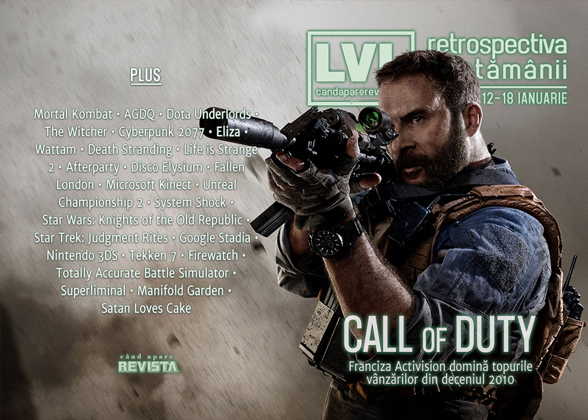

S-a încheiat AGDQ 2020, Call of Duty domină topul vânzărilor din ultimul deceniu, PlayStation sare din nou peste E3, Windows 7 a murit, vom avea un remaster al vechiului FPS **Kingpin**, **Horizon: Zero Dawn** pare că vine și pe PC, Epic Store a depășit 100 de milioane de clienți și avem niște amânări importante, dintre care se remarcă **Cyberpunk 2077**, care apare acum la toamnă.

Linkuri rapide:

* [Știri](#știri)
* [Articole (critică, dev, design)](#articole-critică-dev-design)
* [Anunţuri şi lansări de jocuri](#anunțuri-şi-lansări-de-jocuri)
* [Prăvălii de jocuri](#prăvălii-de-jocuri)

## Știri

* Un top al celor mai bine vândute jocuri din ultimul deceniu arată cât de mulți bani aduce Call of Duty - cu excepția primulului loc, pe care se plasează Grand Theft Auto 5, titlurile Activision ocupă 7 din primele 10 locuri și jumătate din top 20.   ([VideoGamesChronicle](https://www.videogameschronicle.com/news/half-of-the-past-decades-top-20-us-games-were-call-of-duty/), [PC Gamer](https://www.pcgamer.com/8-of-the-10-best-selling-games-of-the-decade-were-call-of-duty/), [Shacknews](https://www.shacknews.com/article/115860/call-of-duty-games-were-10-of-the-top-15-best-selling-titles-of-the-decade))
* PlayStation nu participă la E3 nici în 2020. ([VideoGamesChronicle](https://www.videogameschronicle.com/news/playstation-quits-e32020/), [Ars Technica](https://arstechnica.com/gaming/2020/01/on-eve-of-ps5-sony-confirms-it-will-skip-e3-for-second-year-in-a-row/), [Eurogamer](https://www.eurogamer.net/articles/2020-01-13-sony-to-skip-e3-for-second-year-running), [Shacknews](https://www.shacknews.com/article/115783/sony-and-playstation-will-skip-e3-for-the-second-straight-year), [PC Gamer](https://www.pcgamer.com/sony-is-skipping-e3-2020/)). În schimb Xbox confirmă nu va avea nicio problemă să primească toată atenția publicului la E3. ([VideoGamesChronicle](https://www.videogameschronicle.com/news/xbox-confirms-e3-plans-after-playstation-says-it-wont-attend/), [EGM](https://egmnow.com/phil-spencer-confirms-that-xbox-will-be-attending-e3-2020/))
* Un băiat din Anglia a fost salvat de la o criză de epilepsie după ce prietena din SUA cu care se juca online și-a dat seama ce se întâmplă și a sunat la poliția din orașul băiatului. ([Kotaku](https://kotaku.com/a-gamer-in-texas-helped-save-her-uk-teammate-after-hear-1840957347), [Eurogamer](https://www.eurogamer.net/articles/2020-01-13-uk-teen-having-seizure-helped-by-us-gaming-pal-across-atlantic), [PC Gamer](https://www.pcgamer.com/teen-playing-online-in-uk-saved-by-friend-in-texas/), [Polygon](https://www.polygon.com/pc/2020/1/12/21062897/uk-gamer-saved-by-friend-in-texas-online-gaming-pc))
* Vom avea un film animat Mortal Kombat în prima parte a anului, intitulat Mortal Kombat Legends: Scorpion’s Revenge. ([Escapist](https://www.escapistmagazine.com/v2/animated-film-mortal-kombat-legends-scorpions-revenge-first-half-2020/), [Eurogamer](https://www.eurogamer.net/articles/2020-01-17-theres-an-animated-mortal-kombat-movie-coming-in-the-first-half-of-this-year), [Polygon](https://www.polygon.com/2020/1/18/21071960/mortal-kombat-legends-scorpions-revenge-release-date-animated-movie-2020))
* Continuă eforturile oamenilor din industria jocurilor de a strânge bani pentru lupta împotriva incendiilor din Australia ([VideoGamesChronicle](https://www.videogameschronicle.com/news/major-video-games-companies-support-australian-wildfires-relief-effort/), [RPS (1)](https://www.rockpapershotgun.com/2020/01/13/game-developers-big-and-small-are-offering-donations-to-aid-australias-bushfire-crisis/), [RPS (2)](https://www.rockpapershotgun.com/2020/01/17/game-devs-and-players-continue-banding-together-to-help-the-australian-bushfire-crisis/)), inclusiv Activision care donează veniturile obținute din vânzarea unui DLC pentru Call of Duty Modern Warfare cu tematică australiană. ([Kotaku](https://kotaku.com/modern-warfares-australia-themed-dlc-will-now-benefit-b-1840981785), [Eurogamer](https://www.eurogamer.net/articles/2020-01-12-buy-modern-warfares-outback-pack-now-and-support-the-australian-bushfire-relief), [PC Gamer](https://www.pcgamer.com/call-of-duty-modern-warfares-outback-pack-profits-will-be-used-for-australian-wildfire-relief/))
* Suportul oficial pentru Windows 7 a încetat în această săptămână. ([PC Gamer](https://www.pcgamer.com/hundreds-of-millions-of-pcs-still-run-windows-7-as-support-comes-to-an-end/))
* În perioada 5 - 12 ianuarie s-a desfășurat AGDQ (Awesome Games Done Quick) ediția 2020, care a strâns o sumă record în scopuri caritabile: peste 3 milioane de dolari. ([Eurogamer](https://www.eurogamer.net/articles/2020-01-12-agdq-2020-finished-up-with-a-fundraising-total-of-gbp2-3-million), [RPS](https://www.rockpapershotgun.com/2020/01/13/awesome-games-done-quick-2020-raised-a-whopping-2-3-million-for-charity/), [PC Gamer](https://www.pcgamer.com/record-breaking-awesome-games-done-quick-raises-over-dollar3-million/), [EGM](https://egmnow.com/awesome-games-done-quick-raises-more-than-3-13-million-for-charity/))
  * Plus: [The best speedrun videos from Games Done Quick 2020](https://www.videogameschronicle.com/news/the-best-speedrun-videos-from-games-done-quick-2020/) (VideoGamesChronicle)

## Articole (critică, dev, design)

* [Why is it so hard to make a good comedy game?](https://games.avclub.com/why-is-it-so-hard-to-make-a-good-comedy-game-1841012687) (A.V. Club)
* [We Keep Having The Same Video Game Arguments And It&#x27;s Driving Me Bonkers](https://kotaku.com/we-keep-having-the-same-video-game-arguments-and-its-dr-1841027051) (Kotaku)
* [Full-motion video has found the perfect home: horror games](https://www.polygon.com/2020/1/16/21065593/full-motion-video-horror) (Polygon)
* [Can real-time strategy come back from the brink of death?](https://www.pcgamer.com/can-real-time-strategy-come-back-from-the-brink-of-death/) (PC Gamer)
* [Is the Mainstream Ready for Transmedia Storytelling?](https://www.escapistmagazine.com/v2/is-the-mainstream-ready-for-transmedia-storytelling/) (Escapist)
* [The Closing Walls Around China’s Independent Game Developers](https://egmnow.com/the-closing-walls-around-chinas-independent-game-development-scene/) (EGM)
* [What Does It Really Mean to Be an Indie Game?](https://www.vice.com/en_us/article/epgnjn/jesper-juul-handmade-pixels-review) (Vice)
* [Book Review: Video Games as Culture](http://www.firstpersonscholar.com/book-review-video-games-as-culture/) (First Person Scholar)
* [These Realities We’ve Constructed](https://noescapevg.com/these-realities-weve-constructed/) (No Escape)
* [The Witcher proves games should adapt books more often](https://www.videogamer.com/features/the-witcher-proves-games-should-adapt-books-more-often) (VideoGamer)

---

### Actualitate
* [Video Game Delays Cause More Crunch](https://kotaku.com/game-delays-cause-more-crunch-1841065204) (Kotaku)
* [Cyberpunk 2077 delay does little to alleviate worker crunch](https://gamedaily.biz/article/1514/cyberpunk-2077-delay-does-little-to-alleviate-worker-crunch) (GameDaily.biz)
* [Sony Skipping E3 Won&#039;t Hurt PlayStation, but It Shows E3&#039;s Irrelevance](https://www.escapistmagazine.com/v2/sony-playstation-5-skipping-e3-irrelevance/) (Escapist)

---

### _Not-a-review_
* [Visual novel Eliza explores the privacy risks of digital therapy](https://www.pcgamer.com/visual-novel-eliza-explores-the-privacy-risks-of-digital-therapy/) (PC Gamer)
* [Keita Takahashi and the Farce of Virtual Stuff](https://egmnow.com/keita-takahashi-and-the-farce-of-virtual-stuff/) (EGM)
* [After the Storm: How Life Is Strange 2 Overcame the Pressures of Popularity](https://egmnow.com/after-the-storm-how-life-is-strange-2-overcame-the-pressures-of-popularity/) (EGM)
* [How Life is Strange 2 challenged video game representations of homelessness](https://www.eurogamer.net/articles/2020-01-18-how-life-is-strange-2-challenged-video-game-representations-of-homelessness) (Eurogamer)
* [When in Hell, We Do Shots At the Bar](https://unwinnable.com/2020/01/14/when-in-hell-we-do-shots-at-the-bar/) (Unwinnable)

#### Disco Elysium
* [Dying Like An Idiot In Disco Elysium Just Makes Success More Satisfying](https://kotaku.com/dying-like-an-idiot-in-disco-elysium-just-makes-success-1841066416) (Kotaku)
* [Disco Elysium&#x27;s Dialogue Is Like A Good Tweet](https://kotaku.com/disco-elysiums-dialogue-system-is-as-addictive-as-any-s-1841046831) (Kotaku)
* [Disco Elysium&#039;s Brilliance Lies in Creating Chorus from Consciousness](https://www.escapistmagazine.com/v2/disco-elysium-brilliance-lies-in-creating-chorus-from-consciousness) (Escapist)

---

### Industrie
* [Subscriptions will &quot;unlock the market to weirder things,&quot; says Outer Wilds dev](https://www.gamesindustry.biz/articles/2020-01-13-subscriptions-will-unlock-the-market-to-weirder-things-says-outer-wilds-dev) (GamesIndustry.biz)
* [Introducing the GamesIndustry.biz Academy](https://www.gamesindustry.biz/articles/2020-01-16-introducing-the-gamesindustry-biz-academy) (GamesIndustry.biz)
* [Exclusive: Ubisoft revamps editorial team to make its games more unique](https://www.videogameschronicle.com/news/ubisoft-revamps-editorial-team/) (VideoGamesChronicle)
* [Failbetter on the unlikely success of Fallen London&#8217;s first ten years](https://www.rockpapershotgun.com/2020/01/14/failbetter-games-on-the-unlikely-success-and-10-year-anniversary-of-fallen-london/) (RPS)
* [Xbox Series X Not Having Early Exclusives Isn&#039;t a Bad Thing for Players](https://www.escapistmagazine.com/v2/xbox-series-x-no-exclusives-not-bad-thing-players/) (Escapist)
* [Microsoft goes all-in on the 'evergreen platform'](https://www.gamesindustry.biz/articles/2020-01-17-microsoft-goes-all-in-on-the-evergreen-platform) (GamesIndustry.biz)
* [Google Stadia is like the early days of Steam, says Tequila Works CEO](https://www.gamesindustry.biz/articles/2020-01-15-upcoming-stadia-features-will-blow-peoples-minds-says-tequila-works-ceo) (GamesIndustry.biz)

---

### Istorie, retrospectivă
* [All the money in the world couldn’t make Kinect happen](https://www.polygon.com/2020/1/14/21064608/microsoft-kinect-history-rise-and-fall) (Polygon)
* [How Unreal Championship 2 Solved the Single-Player Hero Shooter Problem](https://www.escapistmagazine.com/v2/how-unreal-championship-2-solved-the-single-player-hero-shooter-problem/) (Escapist)
* [Revisiting System Shock, and the birth of immersive sim design](https://www.pcgamer.com/revisiting-system-shock-and-the-birth-of-immersive-sim-design/) (PC Gamer)
* [Member Star Wars: Knights of the Old Republic?](https://www.hardcoregamer.com/2020/01/15/member-star-wars-knights-of-the-old-republic/365035/) (Hardcore Gamer)
* [Star Trek: Judgment Rites is a joyful anachronism from an impossible past](https://www.rockpapershotgun.com/2020/01/13/star-trek-judgment-rites-is-a-joyful-anachronism-from-an-impossible-past/) (RPS)
* [How the Nintendo 3DS Became a Defining Console of the 2010s](https://tedium.co/2020/01/16/nintendo-3ds-retrospective/) (Tedium)

---

### Dev, making of, mecanici
* [What is frame data in fighting games, and why are Tekken 7 players willing to pay for it?](https://www.polygon.com/2020/1/16/21065306/tekken-7-frame-data-dlc-pay-worth-it-explainer) (Polygon)
* [The creators of Sunless Skies are giving tips on writing weird horror in our new forums](https://www.pcgamer.com/the-creators-of-sunless-skies-are-giving-tips-on-writing-weird-horror-in-our-new-forums/) (PC Gamer)
* [Dialogue, Movement, and Innovation: For Better Stories, Games Need New Gameplay](https://www.escapistmagazine.com/v2/new-gameplay-actions-new-story-possibilities-storyplayer-chapters/) (Escapist)
* [The unknowable chaos of physics in Totally Accurate Battle Simulator](https://www.rockpapershotgun.com/2020/01/15/the-unknowable-chaos-of-physics-in-totally-accurate-battle-simulator/) (RPS)
* [How The Feature That Almost Sunk Disco Elysium Was Made](https://www.gamespot.com/articles/how-the-feature-that-almost-sunk-disco-elysium-was/1100-6472676/) (Gamespot)
* [Randomness In Video Games Is Not All The Same](https://kotaku.com/randomness-in-video-games-is-not-all-the-same-1841049263) (Kotaku)
* [Run, Jump and Climb: Designing Fun Movement in Games](https://remptongames.com/2020/01/18/run-jump-and-climb-designing-fun-movement-in-games-2/) (Rempton Games)
* [Designing  Manifold Garden's believably unbelievable world and puzzles](https://www.gamasutra.com/view/news/356304/Designing_Manifold_Gardens_believably_unbelievable_world_and_puzzles.php) (Gamasutra)
* [On Monster Design](https://www.gamasutra.com/blogs/EmilGlans/20200111/356548/On_Monster_Design.php) (Gamasutra)
* [Realism in Games: What Makes Firewatch Feel Personal](https://www.gamasutra.com/blogs/RandenBanuelos/20200114/356607/Realism_in_Games_What_Makes_Firewatch_Feel_Personal.php) (Gamasutra)
* [Designing the mind-bending perspective puzzles of  Superliminal](https://www.gamasutra.com/view/news/356609/Designing_the_mindbending_perspective_puzzles_of_Superliminal.php) (Gamasutra)
* [The Life Is Strange 2 Postmortem](https://www.usgamer.net/articles/life-is-strange-2-dontnod-postmortem-interview-feature) (USgamer)

---

### Design, world-building, artă
* [Videogame subtitles could learn a lot from comic book lettering](https://www.rockpapershotgun.com/2020/01/16/videogame-subtitles-could-learn-a-lot-from-comic-book-lettering/) (RPS)
* [Beyond Blueprints](https://unwinnable.com/2020/01/13/beyond-blueprints/) (Unwinnable)

## Anunțuri şi lansări de jocuri
* [Sources: Horizon: Zero Dawn Is Coming To PC](https://kotaku.com/sources-horizon-zero-dawn-is-coming-to-pc-1841043569) (Kotaku)

### Anunţate
* **Might & Magic: Chess Royale** ([Kotaku](https://kotaku.com/might-and-magics-100-player-auto-chess-spin-off-comes-o-1840993743), [PC Gamer](https://www.pcgamer.com/ubisoft-is-making-a-100-player-autobattler/))
* **Pathfinder: Wrath of the Righteous** ([PC Gamer](https://www.pcgamer.com/pathfinder-wrath-of-the-righteous-kickstarter-launches-early-february/))
* **Bonfire Peaks** ([PC Gamer](https://www.pcgamer.com/climb-ruins-and-burn-your-possessions-in-bonfire-peaks/))
* **Black Book** ([Destructoid](https://www.destructoid.com/black-book-is-an-adventure-rpg-about-witches-and-demons-578147.phtml))
* **Kingpin: Reloaded** ([PC Gamer](https://www.pcgamer.com/kingpin-reloaded-features-remastered-graphics-same-old-f-bombs/), [Eurogamer](https://www.eurogamer.net/articles/2020-01-17-3d-realms-revives-1999-pc-shooter-kingpin))

### Acum cu dată de lansare
* **Coffee Talk**: 30 ianuarie ([Shacknews](https://www.shacknews.com/article/115806/coffee-talk-is-brewing-for-an-end-of-january-release))
* **World of Horror**: 20 februarie ([PC Gamer](https://www.pcgamer.com/world-of-horror-a-creepy-1-bit-style-horror-rpg-will-release-next-month/))

### Amânate
* **Final Fantasy VII Remake**: 10 aprilie în loc de 3 martie ([VideoGamesChronicle](https://www.videogameschronicle.com/news/final-fantasy-vii-remake-delayed-to-april/))
* **Marvel’s Avengers**: 4 septembrie în loc de 15 mai ([VideoGamesChronicle](https://www.videogameschronicle.com/news/marvels-avengers-game-delayed-by-4-months-to-september/))
* **Cyberpunk 2077**: 17 septembrie în loc de luna aprilie ([Ars Technica](https://arstechnica.com/gaming/2020/01/cyberpunk-2077-release-pushed-back-to-september-17-2020/), [PC Gamer](https://www.pcgamer.com/cyberpunk-2077-is-delayed/))

### Lansate
* 14 ianuarie: **Orangeblood** ([Steam](https://store.steampowered.com/app/1042670/Orangeblood/))
* 14 ianuarie: **Darwin Project** ([Steam](https://store.steampowered.com/app/544920/Darwin_Project/))
* 15 ianuarie: **Wizardry: Labyrinth Of Lost Souls** ([Steam](https://store.steampowered.com/app/948640/Wizardry_Labyrinth_of_Lost_Souls/))
* 15 ianuarie: **Lightmatter** ([Steam](https://store.steampowered.com/app/994140/Lightmatter/))
* 16 ianuarie: **Total War: Three Kingdoms – Mandate of Heaven** ([Steam](https://store.steampowered.com/app/1154760/Total_War_THREE_KINGDOMS__Mandate_of_Heaven/))
* 16 ianuarie: **A Long Way Down** ([Steam](https://store.steampowered.com/app/856990/A_Long_Way_Down/))
* 16 ianuarie: **Super Crush KO** ([Steam](https://store.steampowered.com/app/907670/Super_Crush_KO/))
* 17 ianuarie: **Dragon Ball Z: Kakarot** ([Steam](https://store.steampowered.com/app/851850/DRAGON_BALL_Z_KAKAROT/))

## Prăvălii de jocuri
### Știri
* [Epic Games Store surpasses 100 million customers](https://www.shacknews.com/article/115800/epic-games-store-surpasses-100-million-customers) (Shacknews)
* [Epic Games Store avoids review bombing with OpenCritic integration](https://www.gamesindustry.biz/articles/2020-01-16-epic-games-stores-avoids-review-bombing-with-opencritic-integration) (GamesIndustry.biz)
* [Stadia is aiming to add more than 120 games in 2020, including ten exclusives](https://www.pcgamer.com/stadia-is-aiming-to-add-more-than-120-games-in-2020-including-ten-exclusives/) (PC Gamer)
* [Steam is coming to Google's Chrome OS](https://www.pcgamer.com/steam-is-coming-to-googles-chrome-os/) (PC Gamer)
* [GTA IV has disappeared from Steam because of Games for Windows Live](https://www.theverge.com/2020/1/13/21063810/gta4-steam-games-for-windows-live-pc-gaming-key-generation) (The Verge)

### Articole
* [The Epic Games Store is the best choice for buying games in the developing world](https://www.vg247.com/2020/01/17/the-epic-games-store-best-option-for-developing-countries/) (VG247)

### Update catalog
* [Xbox Game Pass PC adding Children of Morta, Gris and A Plague Tale: Innocence](https://www.videogameschronicle.com/news/xbox-game-pass-pc-to-add-children-of-morta-gris-and-a-plague-tale-innocence/) (VideoGamesChronicle)
* [Sea of Solitude, Worms WMD and more join the Origin Access library](https://www.pcgamer.com/sea-of-solitude-worms-wmd-and-more-join-the-origin-access-library/) (PC Gamer)
* [Sokpop just Sok-dropped their entire catalogue on Steam](https://www.rockpapershotgun.com/2020/01/18/sokpop-just-sok-dropped-their-entire-catalogue-on-steam/) (RPS)

### Jocuri gratis și free weekends
* [Horace is now free on the Epic Games Store, with The Bridge next](https://www.videogameschronicle.com/news/horace-is-now-free-on-the-epic-games-store-with-the-bridge-next/) (VideoGamesChronicle)
* [Explore a cake-filled underworld in free Metroidvania Satan Loves Cake](https://www.pcgamer.com/explore-a-cake-filled-underworld-in-free-metroidvania-satan-loves-cake/) (PC Gamer)

### Reduceri și promoții
* [Buy The New Humble Bundle, Help Australia](https://kotaku.com/buy-the-new-humble-bundle-help-australia-1841048567) (Kotaku)
* [Stardew Valley is cheap in the Humble Sweet Farm Bundle](https://www.pcgamer.com/stardew-valley-is-cheap-in-the-humble-sweet-farm-bundle/) (PC Gamer)
* [Best PC gaming deals of the week &#8211; 17th January 2020](https://www.rockpapershotgun.com/2020/01/17/best-pc-gaming-deals-of-the-week-17th-january-2020/) (RPS)

---

{}
**Retrospectiva săptămânii** este rubrica duminicală în care trecem în revistă evenimentele săptămânii de pe frontul de gaming: știri şi articole (scrise de alții, bineînțeles, că e mai ușor aşa), industrie, lansări, oferte de jocuri, toate numai de savurat la cafeaua de duminică dimineața.

De asemenea, rubrica e deschisă oricui vrea și poate contribui. Dacă ai citit vreun articol sau vreo știre interesantă și crezi că merită incluse în retrospectiva săptămânii, te așteptăm pe forum pe unul dintre topicurile dedicate: [Știri](https://forum.candaparerevista.ro/viewtopic.php?f=4&t=46), [Articole](https://forum.candaparerevista.ro/viewtopic.php?f=4&t=206), [Gaming România](https://forum.candaparerevista.ro/viewtopic.php?f=4&t=1622)].
{}
