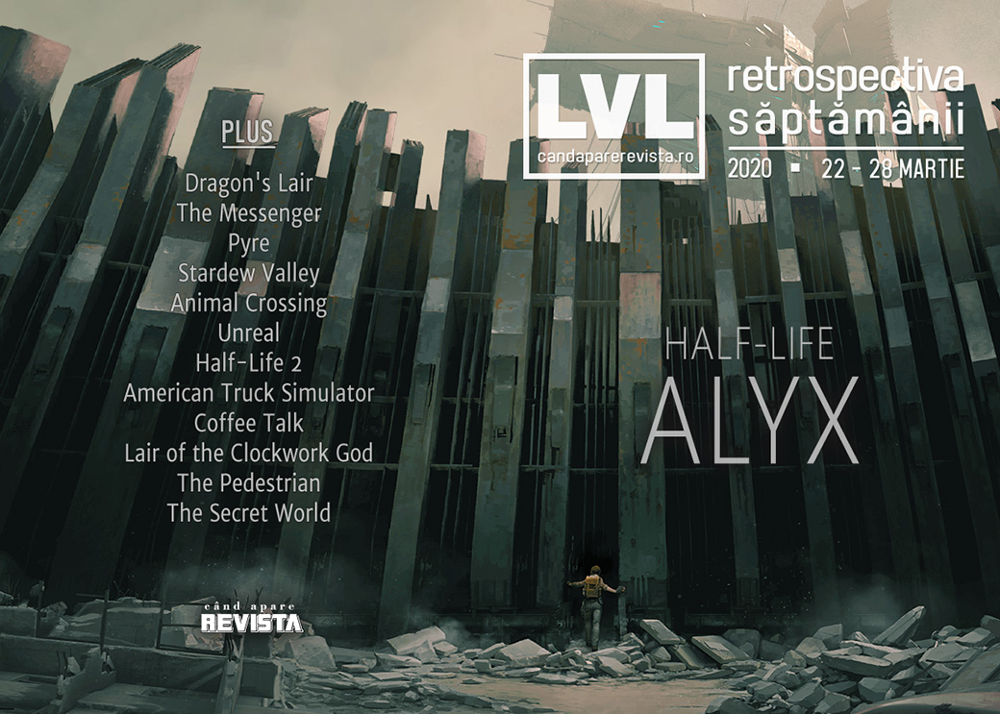

Puține știri în această săptămână, dintre care demnă de remarcat ar fi doar anunțul Epic Games că se va implica și pe partea de finanțare a dezvoltării jocurilor. În rest, primul joc **Half-Life** după 13 ani a dominat titlurile în presa digitală - chiar dacă poate fi jucat de numai o minoritate a jucătorilor - astfel că aveți destul material de citit. 

Linkuri rapide:

* [Știri](#știri)
* [Articole (critică, dev, design)](#articole-critică-dev-design)
* [Anunţuri şi lansări de jocuri](#anunțuri-şi-lansări-de-jocuri)
* [Prăvălii de jocuri](#prăvălii-de-jocuri)

## Știri
* Companiile din industria jocurilor donează bani pentru eforturile de combatere a coronavirusului ([GamesIndustry.biz](https://www.gamesindustry.biz/articles/2020-03-25-games-industry-rallies-in-fight-against-covid-19)), printre care Ndemic, creatorii jocului **Plague, Inc.** ([Site oficial Ndemic Creations](https://www.ndemiccreations.com/en/news/175-plague-inc-gives-a-quarter-of-a-million-dollars-to-fight-covid-19), [Gamasutra](http://www.gamasutra.com/view/news/360000/Plague_Inc_dev_Ndemic_donates_250000_to_COVID19_response_funds.php)), CD Projekt Red ([Game World Observer](https://gameworldobserver.com/2020/03/26/cd-projekt-red-donates-1-million-fight-covid-19/)) sau Riot Games.
* Netflix va realiza film live-action **Dragon's Lair** cu Ryan Reynolds în rolul principal. ([VideoGamesChronicle](https://www.videogameschronicle.com/news/ryan-reynolds-is-reportedly-in-talks-for-a-dragons-lair-movie/), [Shacknews](https://www.shacknews.com/article/117243/netflix-announces-live-action-dragons-lair-with-ryan-reynolds), [Eurogamer](https://www.eurogamer.net/articles/2020-03-28-netflix-is-making-a-dragons-lair-live-action-movie), [Destructoid](https://www.destructoid.com/dragon-s-lair-movie-in-the-works-at-netflix-ryan-reynolds-slated-to-star-585007.phtml))
* Epic Games devine acum și publisher, anunțând un program pentru finanțarea completă a dezvoltării de jocuri și apoi împărțirea profiturilor cu studiourile participante. Iar primele companii cu care a încheiat parteneriate sunt Remedy Entertainment (Control, Alan Wake), Playdead (Limbo, Inside) și Gen Design (The Last Guardian). ([The Verge](https://www.theverge.com/2020/3/26/21195152/epic-games-publishing-label-control-last-guardian-inside), [VideoGamesChronicle](https://www.videogameschronicle.com/news/epic-will-publish-games-from-remedy-playdead-and-gen-design/))
* Sony va reduce vitezele de download pentru jocurile din rețeaua sa pentru a contribui la prevenirea congestiei traficului de internet, atât în Europa ([Games Informer](https://www.gameinformer.com/2020/03/24/sony-slowing-playstation-game-download-speeds), [GamesIndustry.biz](https://www.gamesindustry.biz/articles/2020-03-24-sony-throttles-back-game-downloads-in-europe)), cât și în SUA. ([EGM](https://egmnow.com/sony-is-now-managing-playstation-download-traffic-in-the-u-s/), [The Verge](https://www.theverge.com/2020/3/27/21196835/sony-slow-playstation-downloads-us-internet-speed-isps-usage-coronavirus), [VideoGamesChronicle](https://www.videogameschronicle.com/news/playstation-confirms-its-now-slowed-download-speeds-in-the-us/), [Gamasutra](http://www.gamasutra.com/view/news/360259/Sony_will_begin_limiting_PSN_download_speeds_in_the_US_.php))

## Articole (critică, dev, design)
* [The Messenger and the Myth of Progress](https://egmnow.com/the-messenger-and-the-myth-of-progress/) (EGM)
* [Video Games Are More Important Now Than They’ve Ever Been](https://www.escapistmagazine.com/v2/video-games-are-more-important-now-than-theyve-ever-been/) (Escapist)
* [Bad netcode is killing many of your favorite fighting games](https://www.polygon.com/2020/3/25/21192522/netcode-samurai-showdown-fighting-games-rollback-delay) (Polygon)
* [Towards a Carrier Bag Theory of Videogames](https://unwinnable.com/2020/03/23/towards-a-carrier-bag-theory-of-videogames/) (Unwinnable)
* [Re-entangling Science and Technology](https://www.playthepast.org/?p=6771) (Play The Past)

---

### Actualitate
* [Nintendo Direct Mini March 2020 announcements and reveals](https://www.shacknews.com/article/117192/nintendo-direct-mini-march-2020-announcements-and-reveals) (Shacknews)
* [Is Epic's publishing deal good?](https://www.pcgamer.com/is-epics-publishing-deal-good/) (PC Gamer)

---

### _Not-a-review_
* [The joy of travelling together in Pyre](https://www.rockpapershotgun.com/2020/03/23/the-joy-of-travelling-together-in-pyre/) (RPS)
* [Playing Animal Crossing has helped me see what I love about Stardew Valley](https://www.pcgamer.com/playing-animal-crossing-has-helped-me-see-what-i-love-about-stardew-valley/) (PC Gamer)

---

### Industrie
* [Half-Life: Alyx and the Rebirth of Consumer VR](https://gamedaily.biz/article/1654/half-life-alyx-and-the-rebirth-of-consumer-vr) (GameDaily.biz)
* [Devolver on adapting to a world without events](https://www.gamesindustry.biz/articles/2020-03-23-devolver-on-adapting-to-a-world-without-events) (GamesIndustry.biz)

---

### Istorie, retrospectivă
* [Unreal (1998) is the FPS you have been missing](https://www.rockpapershotgun.com/2020/03/23/unreal-1998-is-the-fps-you-have-been-missing/) (RPS)
* [Half-Life 2 Teaches You Everything You Need to Know with 4 Iconic Words](https://www.escapistmagazine.com/v2/half-life-2-pick-up-the-can) (Escapist)
* [Kojima’s GBA experiment—and the sunny island childhood it changed forever](https://arstechnica.com/gaming/2020/03/kojimas-gba-experiment-and-the-sunny-island-childhood-it-changed-forever/) (Ars Technica)
* [How Games Marketing Invented Toxic Gamer Culture](https://www.vice.com/en_us/article/5dmayn/games-marketing-toxic-gamer-culture-online-xbox-live-dreamcast) (Vice) (TL;DR pe [The Verge](https://www.theverge.com/2020/3/25/21194232/toxic-marketing-sega-sony-microsoft-gamergate-vice))
* [The Protestant Reformation of the First-Person Shooter](https://www.fanbyte.com/features/the-protestant-reformation-of-the-first-person-shooter/) (Fanbyte)

---

### Dev, making of, mecanici
* [How American Truck Simulator recreates the grand American west](https://www.rockpapershotgun.com/2020/03/25/how-american-truck-simulator-recreates-the-grand-american-west/) (RPS)
* [Deep Dive: Making a cozy, therapeutic experience in  Coffee Talk](https://www.gamasutra.com/view/news/360109/Deep_Dive_Making_a_cozy_therapeutic_experience_in_Coffee_Talk.php) (Gamasutra)
* [How  Lair of the Clockwork God  blends the world of platformers and point-and-clicks](https://www.gamasutra.com/view/news/359617/How_Lair_of_the_Clockwork_God_blends_the_world_of_platformers_and_pointandclicks.php) (Gamasutra)
* [How Skookum Arts built  The Pedestrian  puzzles out of urban signage](https://www.gamasutra.com/view/news/359921/How_Skookum_Arts_built_The_Pedestrian_puzzles_out_of_urban_signage.php) (Gamasutra)

#### Half-Life: Alyx
* [We talk Half-Life: Alyx with Valve in &#8220;the meanest interview ever&#8221;](https://www.rockpapershotgun.com/2020/03/26/valve-half-life-alyx-interview/) (RPS)
* [Interview: Valve on Half-Life after Alyx](https://www.videogameschronicle.com/features/interview-valve-on-half-life-after-alyx/) (VideoGamesChronicle)
* [The big Half-Life interview](https://www.eurogamer.net/articles/2020-03-24-the-big-half-life-interview) (Eurogamer)
* [Valve Wants You to Enjoy Searching Every Corner of Half-Life: Alyx](https://www.escapistmagazine.com/v2/half-life-alyx-search-everything-valve-sean-vanaman/) (Escapist)
* [Half-Life: Alyx Behind the Scenes, Part 1: How Valve Found Its New Alyx](https://www.usgamer.net/articles/half-life-alyx-behind-the-scenes-part-1-how-valve-found-its-new-alyx) (USgamer)
* [Half-Life: Alyx Behind the Scenes, Part 2: &quot;We&#039;re About to Pitch You This Ending, and You&#039;re Gonna Hate it&quot;](https://www.usgamer.net/articles/half-life-alyx-behind-the-scenes-part-2-feature) (USgamer)

---

### Design, world-building, artă
* [Meet the GIF Makers Who Craft Art out of Pinpoint Gameplay](https://egmnow.com/meet-the-gif-makers-who-craft-living-art-out-of-pinpoint-gameplay/) (EGM)
* [Half-Life: Alyx takes City 17 to the next level](https://www.pcgamer.com/half-life-alyx-takes-city-17-to-the-next-level/) (PC Gamer)
* [Why Half-Life’s City 17 was pivotal to gaming’s post-Soviet obsession](https://www.theverge.com/2020/3/25/21190794/half-life-alyx-city-17-post-soviet-architecture-gaming) (The Verge)
* [Dying video games and the people who continue to play them](https://theface.com/life/the-secret-world-video-games-isolation-horror) (The Face)

## Anunțuri şi lansări de jocuri
### Anunţate
* **Beyond the Wire**, un FPS multiplayer plasat în Primul Război Mondial ([Kotaku](https://kotaku.com/another-ww1-fps-wants-to-get-into-the-trenches-1842496341))
* O versiune îmbunătățită de **NieR** pare să fie în lucru ([YouTube Square Enix](https://www.youtube.com/watch?v=_sdn1B0N4k0))

### Acum cu dată de lansare
* **Shantae and the Seven Sirens**: 28 mai ([Eurogamer](https://www.eurogamer.net/articles/2020-03-27-shantae-and-the-seven-sirens-is-coming-to-pc-consoles-in-may))
* **Outer Wilds** se lansează și pe Steam pe 18 iunie ([Eurogamer](https://www.eurogamer.net/articles/2020-03-24-acclaimed-time-loop-exploration-adventure-outer-wilds-is-heading-to-steam-in-june))

### Lansate
* 23 martie: **Half-Life: Alyx** ([Steam](https://store.steampowered.com/app/546560/HalfLife_Alyx/))
* 23 martie: **The Legend of Heroes: Trails of Cold Steel III** ([Steam](https://store.steampowered.com/app/991270/The_Legend_of_Heroes_Trails_of_Cold_Steel_III/))
* 24 martie: **Bleeding Edge** ([Steam](https://store.steampowered.com/app/1189800/Bleeding_Edge/))
* 25 martie: **Iron Danger** ([Steam](https://store.steampowered.com/app/899310/Iron_Danger/), [gog.com](https://www.gog.com/game/iron_danger))
* 25 martie: **Bright Memory** (iese din early access) ([Steam](https://store.steampowered.com/app/955050/Bright_Memory/))
* 26 martie: **Control: The Foundation** (DLC) ([Epic Store](https://www.epicgames.com/store/en-US/product/control/the-foundation))
* 26 martie: **Assemble with Care** ([Steam](https://store.steampowered.com/app/1202900/Assemble_with_Care/))
* 26 martie: **Borderlands 3: Guns, Love, and Tentacles** (DLC) ([Steam](https://store.steampowered.com/app/1232257/Borderlands_3_Guns_Love_and_Tentacles/), [Epic Store](https://www.epicgames.com/store/en-US/product/borderlands-3/guns-love-and-tentacles))
* 26 martie: **One Step From Eden** ([Steam](https://store.steampowered.com/app/960690/One_Step_From_Eden/))
* 27 martie: **Biped** ([Steam](https://store.steampowered.com/app/1071870/Biped/))
* 26 martie: **Last Oasis** (early access) ([Steam](https://store.steampowered.com/app/903950/Last_Oasis/))

## Prăvălii de jocuri

### Știri
* [Humble Brag recap: Humble Bundle announces five new game partnerships, including an old school FPS and a turn-based RPG](https://www.destructoid.com/humble-brag-recap-humble-bundle-announces-five-new-game-partnerships-including-an-old-school-fps-and-a-turn-based-rpg-584524.phtml) (Destructoid)

### Articole
* [Game Discoverability: The Steam & Epic Stores, Circa Early 2020](https://www.gamasutra.com/blogs/SimonCarless/20200323/359979/Game_Discoverability_The_Steam__Epic_Stores_Circa_Early_2020.php) (Gamasutra)

### Update catalog
* [Epic Games Store reveals another bunch of exclusives coming this year](https://www.pcgamer.com/epic-games-store-reveals-another-bunch-of-exclusives-coming-this-year/) (PC Gamer)
* [Nvidia adds Control to GeForce Now and promises new games every week](https://www.theverge.com/2020/3/27/21197361/nvidia-geforce-now-cloud-gaming-control-new-games-weekly) (The Verge)

### Jocuri gratis și free weekends
* [Try Predator: Hunting Grounds this weekend on PS4 and PC](https://www.shacknews.com/article/117157/try-predator-hunting-grounds-this-weekend-on-ps4-and-pc) (Shacknews)
* [Ghost Recon Breakpoint is free to play this weekend on PC and consoles](https://www.eurogamer.net/articles/2020-03-25-ghost-recon-breakpoint-is-free-to-play-this-weekend-on-pc-and-consoles) (Eurogamer)
* [World War Z is now free on the Epic Games Store](https://www.videogameschronicle.com/news/world-war-z-is-now-free-on-the-epic-games-store/) (VideoGamesChronicle)
* [The Council’s first episode is now free on PC and consoles](https://egmnow.com/the-councils-first-episode-is-now-free-on-pc-and-consoles/) (EGM)
* [Castle Crashers and BattleBlock Theater are free to play for a week on PC](https://www.destructoid.com/castle-crashers-and-battleblock-theater-are-free-to-play-for-a-week-on-pc-584686.phtml) (Destructoid)
* [Cities: Skylines is free to play this weekend on Steam, and you can download it right now](https://www.dsogaming.com/news/cities-skylines-is-free-to-play-this-weekend-on-steam-and-you-can-download-it-right-now/) (DSOGaming)
* [Insurgency: Sandstorm is free to play for a limited time](https://egmnow.com/insurgency-sandstorm-is-free-to-play-for-a-limited-time/) (EGM)
* [Fantasy 4X game Endless Legend is free to play on Steam for a week](https://www.pcgamer.com/fantasy-4x-game-endless-legend-is-free-to-play-on-steam-for-a-week/) (PC Gamer)
* [If you're in the mood for a mobile puzzle game, Monument Valley 2 is free](https://www.destructoid.com/if-you-re-in-the-mood-for-a-mobile-puzzle-game-monument-valley-2-is-free-584937.phtml) (Destructoid)

### Reduceri și promoții
* [Weekend PC Download Deals for Mar. 27: Multiple Steam free weekends](https://www.shacknews.com/article/117237/weekend-pc-download-deals-for-mar-27-multiple-steam-free-weekends) (Shacknews)
* [Weekend Console Download Deals for Mar. 27: Free Ghost Recon Breakpoint weekend](https://www.shacknews.com/article/117236/weekend-console-download-deals-for-mar-27-free-ghost-recon-breakpoint-weekend) (Shacknews)
* [Best PC gaming deals of the week &#8211; 27th March 2020](https://www.rockpapershotgun.com/2020/03/27/best-pc-gaming-deals-of-the-week-27th-march-2020/) (RPS)

---

{}
**Retrospectiva săptămânii** este rubrica duminicală în care trecem în revistă evenimentele săptămânii de pe frontul de gaming: știri şi articole (scrise de alții, bineînțeles, că e mai ușor aşa), industrie, lansări, oferte de jocuri, toate numai de savurat la cafeaua de duminică dimineața.

De asemenea, rubrica e deschisă oricui vrea și poate contribui. Dacă ai citit vreun articol sau vreo știre interesantă și crezi că merită incluse în retrospectiva săptămânii, te așteptăm pe forum pe unul dintre topicurile dedicate: [Știri](https://forum.candaparerevista.ro/viewtopic.php?f=4&t=46), [Articole](https://forum.candaparerevista.ro/viewtopic.php?f=4&t=206), [Gaming România](https://forum.candaparerevista.ro/viewtopic.php?f=4&t=1622)].
{}
