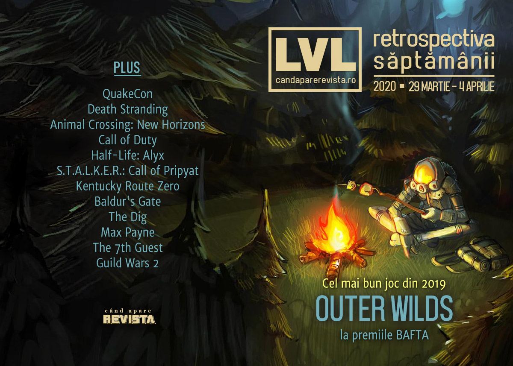

Au avut loc BAFTA Awards, unde Outer Wilds și Disco Elysium au fost marii câștigători, IGN anunță un nou eveniment digital la vară, a început lucrul la un nou Commandos, s-au lansat Mount & Blade 2 și Resident Evil 3, iar în tot acest răstimp pandemia aduce un nou val de amânări de jocuri și evenimente.

Linkuri rapide:

* [Știri](#știri)
* [Articole (critică, dev, design)](#articole-critică-dev-design)
* [Anunţuri şi lansări de jocuri](#anunțuri-şi-lansări-de-jocuri)
* [Prăvălii de jocuri](#prăvălii-de-jocuri)

## Știri

* **Outer Wilds** a câștigat trofeul pentru cel mai bun joc la premiile BAFTA. ([BAFTA.org](http://www.bafta.org/games/awards/bafta-games-awards-nominations-and-winners-2020), [VideoGamesChronicle](https://www.videogameschronicle.com/news/outer-wilds-and-disco-elysium-triumph-at-the-2020-bafta-game-awards/), [PC Gamer](https://www.pcgamer.com/outer-wilds-wins-best-game-at-the-2020-bafta-game-awards/), [Eurogamer](https://www.eurogamer.net/articles/2020-04-03-outer-wilds-scoops-baftas-best-game-award))
* IGN anunță evenimentul digital Summer of Gaming, ca să umple golul lăsat de anularea E3. ([IGN](https://www.ign.com/articles/ign-announces-summer-of-gaming-event-in-june))
* În ciuda volumului mare de vânzări, dezvoltatorii lui Borderlands 3 nu vor primi bonusurile râvnite.  ([Kotaku](https://kotaku.com/sources-despite-huge-sales-borderlands-3-developers-a-1842617645), [DSOGaming](https://www.dsogaming.com/news/gearboxs-employees-will-not-receive-any-royalty-bonuses-from-borderlands-3/), [PCGamesInsider.biz](https://www.pcgamesinsider.biz/news/70842/gearbox-staff-miss-out-on-borderlands-3-bonuses/))
* O instanță din SUA a decis că jocurile Call of Duty pot folosi în continuare humvee-uri, neavând loc nicio încălcare a drepturilor legate de marca înregistrată. ([PC Gamer](https://www.pcgamer.com/judge-rules-that-call-of-duty-can-have-humvees-in-it-because-games-are-art/), [Ars Technica](https://arstechnica.com/gaming/2020/04/us-judge-first-amendment-protects-call-of-dutys-use-of-humvees/), [Kotaku](https://kotaku.com/activision-wins-first-amendment-call-of-duty-lawsuit-1842625317))
* Se lucrează la un nou **Commandos**. Noul joc va fi produs de un studio de sub umbrela Kalypso Media, cei care ne-au adus și seria **Tropico**. [PC Gamer](https://www.pcgamer.com/a-brand-new-commandos-game-is-in-development/)
* Și câteva știri noi în legătură cu coronavirusul:
    * Studioul lui Kojima se închide temporar după ce un angajat a fost testat pozitiv cu COVID-19. ([Shacknews](https://www.shacknews.com/article/117292/kojima-productions-closes-offices-after-employee-tests-positive-for-covid-19), [GamesIndustry.biz](https://www.gamesindustry.biz/articles/2020-03-31-kojima-productions-staff-working-remotely-after-employee-diagnosed-with-covid-19), [Gamasutra](https://www.gamasutra.com/view/news/360350/Kojima_Productions_working_remotely_after_employee_diagnosed_with_COVID19.php))
    * S-a anulat și QuakeCon 2020 din cauza pandemiei. ([Shacknews](https://www.shacknews.com/article/117287/quakecon-2020-has-been-canceled-due-to-covid-19-concerns), [The Verge](https://www.theverge.com/2020/3/31/21201501/quakecon-quake-canceled-bethesda-id-software-25th-anniversary), [Eurogamer](https://www.eurogamer.net/articles/2020-03-31-this-years-25th-anniversary-quakecon-is-cancelled-due-to-the-coronavirus), [PC Gamer](https://www.pcgamer.com/quakecon-2020-is-cancelled/), [EGM](https://egmnow.com/quakecon-2020-has-been-canceled/))
    * Gamescom încă nu s-a anulat - organizatorii vor lua o decizie în luna mai - dar va avea parte de un show digital extins. ([Eurogamer](https://www.eurogamer.net/articles/2020-03-31-gamescom-to-significantly-expand-digital-elements))
* A mai trecut un apriluș și în lumea jocurilor. Pe [PC Gamer](https://www.pcgamer.com/april-fools-day-2020/) și [Destructoid](https://www.destructoid.com/here-s-a-big-gaming-april-fools-day-2020-recap-585518.phtml) găsiți retrospectiva păcălelilor de anul acesta.

## Articole (critică, dev, design)

* [Who gets to write video game history?](https://www.eurogamer.net/articles/2020-03-29-who-gets-to-write-video-game-history) (Eurogamer)
* [Unsafe Rooms](https://egmnow.com/unsafe-rooms/) (EGM)
* [Racing turns hard into esports while the real world is on hold](https://arstechnica.com/cars/2020/04/real-world-racing-is-on-pause-does-esports-fill-the-gap/) (Ars Technica)
* [The Joystick Is Mightier Than the Sword](https://egmnow.com/the-joystick-is-mightier-than-the-sword/) (EGM)
* [Animal Crossing, SimCity, and the Long History of City Planning in Games](https://egmnow.com/animal-crossing-simcity-and-the-long-history-of-city-planning-in-games/) (EGM)
* [Edge of Tomorrow Wasn&#039;t a Video Game, but It&#039;s the Best Video Game Movie](https://www.escapistmagazine.com/v2/edge-of-tomorrow-wasnt-a-video-game-but-its-the-best-video-game-movie/) (Escapist)
* [Why Games Have Always Obsessed Over Pandemic Authoritarianism](https://www.vice.com/en_us/article/g5x9dq/why-games-have-always-obsessed-over-pandemic-authoritarianism) (Vice)
* [I thought playing video games was unproductive – until coronavirus](https://qz.com/1828393/twitch-and-call-of-duty-warzone-are-helping-my-coronavirus-anxiety/) (Quartz)
* [A brief history of disease in video games - The Face](https://theface.com/life/disease-video-games-coronavirus-world-of-warcraft-far-cry-2) (The Face)
* [Why don’t we read video game scripts?](https://wireframe.raspberrypi.org/articles/why-dont-we-read-video-game-scripts) (Wireframe magazine)
* [Adventure Games are Dead, Long Live Adventure Games](https://www.fanbyte.com/features/adventure-games/) (Fanbyte)

---

### Actualitate

* [Bonuses: Gaming's second favorite surprise mechanic](https://www.gamesindustry.biz/articles/2020-04-03-bonuses-gamings-second-favorite-surprise-mechanic) (GamesIndustry.biz)

---

### _Not-a-review_
* [Half-Life: Alyx Is Fantastic, But It’s Probably Not the Future](https://egmnow.com/half-life-alyx-is-fantastic-but-its-probably-not-the-future/) (EGM)
* [Art Tickles: Seeking Comfort from the Apocalypse](https://haywiremag.com/columns/art-tickles-seeking-comfort-from-the-apocalypse/) (Haywire Magazine)
* [At Home with the Ghosts: Kentucky Route Zero’s Reworking of Capitalist Space](https://sidequest.zone/2020/03/30/at-home-with-the-ghosts-kentucky-route-zero-reworking-of-capitalist-space/) (Sidequest)
* [The comforting economic delusions of Animal Crossing, quarantine’s most popular game](https://www.newstatesman.com/culture/games/2020/04/comforting-economic-delusions-animal-crossing-quarantine-s-most-popular-game) (NewStatesman)

---

### Industrie
* [As Riot bids to take on Blizzard and Valve, the studio faces challenges of its own making](https://www.eurogamer.net/articles/2020-03-30-as-riot-bids-to-take-on-blizzard-and-valve-the-studio-faces-challenges-of-its-own-making) (Eurogamer)
* [The Xbox Series X master plan](https://www.polygon.com/2020/4/1/21197360/xbox-series-x-launch-microsoft-phil-spencer-analysis) (Polygon)
* [The Fellowship – Hideo Kojima](http://www.bafta.org/games/features/the-fellowship-hideo-kojima) (BAFTA.org)

---

### Istorie, retrospectivă
* [Back to Baldur's Gate: Revisiting BioWare's legendary RPG](https://www.pcgamer.com/back-to-baldurs-gate-revisiting-biowares-legendary-rpg/) (PC Gamer)
* [I still love The Dig despite just about everything](https://www.rockpapershotgun.com/2020/03/30/i-still-love-the-dig-despite-just-about-everything/) (RPS)
* [Max Payne is an action masterpiece](https://www.pcgamer.com/max-payne-is-an-action-masterpiece/) (PC Gamer)
* [The (7th) Guest&#8217;s New Clothes](https://www.filfre.net/2020/04/the-7th-guests-new-clothes/) (The Digital Antiquarian)
* [The Game Archaeologist: The history of Guild Wars 2’s Super Adventure Box](https://massivelyop.com/2020/04/04/the-game-archaeologist-the-history-of-guild-wars-2s-super-adventure-box/) (Massively OP)

---

### Dev, making of, mecanici
* [It's surprisingly easy to switch a gaming PC to Linux today](https://www.pcgamer.com/its-surprisingly-easy-to-switch-a-gaming-pc-to-linux-today/) (PC Gamer)
* [How SNES emulators got a few pixels from complete perfection](https://arstechnica.com/gaming/2020/04/how-snes-emulators-got-a-few-pixels-from-complete-perfection/) (Ars Technica)
* [Humor Me: How Games Leverage Other Media to Make You Laugh](https://egmnow.com/humor-me-how-games-leverage-other-media-to-make-you-laugh/) (EGM)
* [PlayStation 5 uncovered: the Mark Cerny tech deep dive](https://www.eurogamer.net/articles/digitalfoundry-2020-playstation-5-the-mark-cerny-tech-deep-dive) (Eurogamer)
* [Internal Documents Show How the US Army Makes a Video Game](https://www.vice.com/en_us/article/qjd58b/internal-documents-how-us-army-makes-video-game-operation-overmatch) (Vice)

## Anunțuri şi lansări de jocuri

### Anunţate
* **Call of Duty: Modern Warfare 2 Remastered** ([DSOGaming](https://www.dsogaming.com/news/call-of-duty-modern-warfare-2-remastered-is-officially-coming-to-pc-on-april-30th/))
* **Aeronautica Imperialis: Flight Command** ([VideoGamesChronicle](https://www.videogameschronicle.com/news/aeronautica-imperialis-flight-command-coming-to-pc-in-may/))
* **Going Under** ([Polygon](https://www.polygon.com/2020/4/2/21204448/going-under-ps4-pc-switch-xbox-one-trailer))
* **Pendragon**, un nou adventure de la Inkle ([RPS](https://www.rockpapershotgun.com/2020/04/02/pendragon-is-a-tactical-arthurian-tale-from-the-folks-behind-heavens-vault/))
* **Signalis** ([Destructoid](https://www.destructoid.com/signalis-is-a-sci-fi-survival-horror-game-worth-following-585700.phtml))
* **Windbound** ([Destructoid](https://www.destructoid.com/windbound-is-a-survival-adventure-game-about-building-boats-585688.phtml))
* **Mortal Shell** ([PC Gamer](https://www.pcgamer.com/mortal-shell-is-visually-stunning-soulslike-coming-out-later-this-year/))
* **Saints Row: The Third Remastered** ([VG247](https://www.vg247.com/2020/04/04/saints-row-the-third-remastered-esrb/))

### Acum cu dată de lansare
* **If Found**: 19 mai ([Eurogamer](https://www.eurogamer.net/articles/2020-04-02-annapurna-interactives-apocalyptic-coming-of-age-visual-novel-if-found-is-out-in-may))

### Amânate
* **Wasteland 3**: 28 august în loc de 19 mai ([PC Gamer](https://www.pcgamer.com/wasteland-3-is-delayed-into-august/))
* **The Last of Us Part II** amânat pe termen nedefinit ([GameSpace](https://www.gamespace.com/all-articles/news/the-last-of-us-part-ii-delayed-indefinitely/))

### Lansate
* 29 martie: **Lost Words: Beyond the Page**  (Stadia)
* 30 martie: **Mount & Blade 2: Bannerlord** ([Steam](https://store.steampowered.com/app/261550/Mount__Blade_II_Bannerlord/))
* 31 martie: **Good Company** (early access) ([Steam](https://store.steampowered.com/app/911430/Good_Company/))
* 31 martie: **Operencia: The Stolen Sun** ([Steam](https://store.steampowered.com/app/985950/Operencia_The_Stolen_Sun/), [gog.com](https://www.gog.com/game/operencia_the_stolen_sun))
* 31 martie: **Over the Alps** ([Steam](https://store.steampowered.com/app/1227400/Over_the_Alps/))
* 2 aprilie: **Endzone - A World Apart** (early access) ([Steam](https://store.steampowered.com/app/933820/Endzone__A_World_Apart/), [gog.com](https://www.gog.com/game/endzone_a_world_apart))
* 3 aprilie: **In Other Waters** ([Steam](https://store.steampowered.com/app/890720/In_Other_Waters/), [gog.com](https://www.gog.com/game/in_other_waters))
* 3 aprilie: **Resident Evil 3** ([Steam](https://store.steampowered.com/app/952060/RESIDENT_EVIL_3/))

## Prăvălii de jocuri

### Știri
* [Steam breaks yet another record of concurrent players, now has over 24 million players online](https://www.dsogaming.com/news/steam-breaks-yet-another-record-of-concurrent-players-now-has-over-24-million-players-online/) (DSOGaming)

### Jocuri gratis și free weekends
* [If you never got around to Rayman Legends, it's free on PC](https://www.destructoid.com/if-you-never-got-around-to-rayman-legends-it-s-free-on-pc-585389.phtml) (Destructoid)
* [Risk of Rain 2 is free to play on Steam this weekend to celebrate a year of early access](https://www.eurogamer.net/articles/2020-03-31-risk-of-rain-2-is-free-to-play-on-steam-this-weekend-to-celebrate-a-year-of-early-access) (Eurogamer)
* [Play The Elder Scrolls Online for free on PS4, Xbox One, and PC](https://egmnow.com/play-the-elder-scrolls-online-for-free-on-ps4-xbox-one-and-pc/) (EGM)
* [Uncharted 4 And Dirt Rally 2.0 Are April&#x27;s PlayStation Plus Games](https://kotaku.com/uncharted-4-and-dirt-rally-2-0-are-aprils-playstation-p-1842615126) (Kotaku)
* [A Soldat 2 demo and the original Soldat are free on Steam now](https://www.pcgamer.com/a-soldat-2-demo-and-the-original-soldat-are-free-on-steam-now/) (PC Gamer)
* [Symmetry, the spaceship crash survival sim, is free on GOG](https://www.pcgamer.com/symmetry-the-spaceship-crash-survival-sim-is-free-on-gog/) (PC Gamer)
* [Gone Home and Hob are free on the Epic Games Store](https://www.pcgamer.com/gone-home-and-hob-are-free-on-the-epic-games-store/) (PC Gamer)
* [tinyBuild&#039;s Totally Reliable Delivery Service is free to own on Epic Games Store](https://www.dsogaming.com/news/tinybuilds-totally-reliable-delivery-service-is-free-to-own-on-epic-games-store/) (DSOGaming)
* [Dwarf explorer RPG Regions of Ruin is free for a limited time](https://www.pcgamer.com/dwarf-explorer-rpg-regions-of-ruin-is-free-for-a-limited-time/) (PC Gamer)

### Reduceri și promoții
* [BAFTA Game Awards nominees all discounted in the latest Humble sale](https://www.eurogamer.net/articles/2020-03-31-bafta-game-awards-nominees-all-discounted-in-the-latest-humble-sale) (Eurogamer)
* [Humble Conquer COVID-19 Bundle includes Into the Breach, Hollow Knight, and more](https://www.shacknews.com/article/117296/humble-conquer-covid-19-bundle-includes-into-the-breach-hollow-knight-and-more) (Shacknews)
* [Game Bundle Helps Developers Recoup Losses From A GDC That Wasn&#x27;t](https://kotaku.com/game-bundle-helps-developers-recoup-losses-from-a-gdc-t-1842594334) (Kotaku)
* [Best PC gaming deals of the week &#8211; 3rd April 2020](https://www.rockpapershotgun.com/2020/04/03/best-pc-gaming-deals-of-the-week-3rd-april-2020/) (RPS)
* [Weekend PC Download Deals for Apr. 3: Xbox Studios Steam Sale](https://www.shacknews.com/article/117360/weekend-pc-download-deals-for-apr-3-xbox-studios-steam-sale) (Shacknews)
* [Weekend Console Download Deals for Apr. 3: Spring Sales galore](https://www.shacknews.com/article/117358/weekend-console-download-deals-for-apr-3-spring-sales-galore) (Shacknews)

---

{}
**Retrospectiva săptămânii** este rubrica duminicală în care trecem în revistă evenimentele săptămânii de pe frontul de gaming: știri şi articole (scrise de alții, bineînțeles, că e mai ușor aşa), industrie, lansări, oferte de jocuri, toate numai de savurat la cafeaua de duminică dimineața.

De asemenea, rubrica e deschisă oricui vrea și poate contribui. Dacă ai citit vreun articol sau vreo știre interesantă și crezi că merită incluse în retrospectiva săptămânii, te așteptăm pe forum pe unul dintre topicurile dedicate: [Știri](https://forum.candaparerevista.ro/viewtopic.php?f=4&t=46), [Articole](https://forum.candaparerevista.ro/viewtopic.php?f=4&t=206), [Gaming România](https://forum.candaparerevista.ro/viewtopic.php?f=4&t=1622)].
{}
