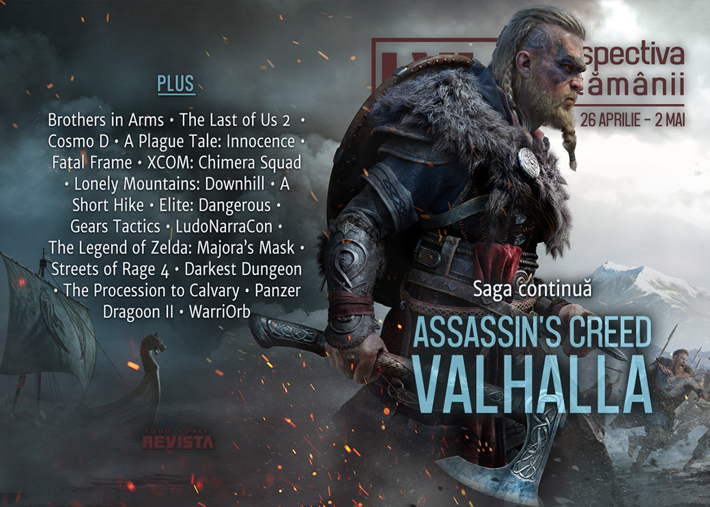

Ubisoft anunță un nou joc Assassin's Creed, de data aceasta cu vikingi, Intel anunță o nouă generație de procesoare pentru desktop, Geoff Keighley organizează un mega-festival digital de 4 luni care să înlocuiască E3-ul, povestea din **The Last of Us II** se varsă pe internet umplându-l de spoilere, s-a lansat mult-așteptatul **Gears Tactics** și continuăm istoria epocii „shareware”. Și avem și o lansare autohtonă, action-platformer-ul  **WarriOrb**.

Linkuri rapide:

* [Știri](#știri)
* [Articole (critică, dev, design)](#articole-critică-dev-design)
* [Made în România](#made-în-românia)
* [Anunţuri şi lansări de jocuri](#anunțuri-şi-lansări-de-jocuri)
* [Prăvălii de jocuri](#prăvălii-de-jocuri)

## Știri

* Gearbox anunță un serial bazat pe seria de jocuri **Brothers in Arms**. ([Polygon](https://www.polygon.com/tv/2020/4/27/21238636/gearbox-software-brothers-in-arms-tv-series), [Escapist](https://www.escapistmagazine.com/v2/brothers-in-arms-tv-show-in-the-works-randy-pitchford-producing/), [Eurogamer](https://www.eurogamer.net/articles/2020-04-27-gearboxs-ww2-fps-brothers-in-arms-is-getting-a-tv-adaptation), [GamesIndustry.biz](https://www.gamesindustry.biz/articles/2020-04-27-gearbox-is-working-on-a-brothers-in-arms-tv-series))
* Intel a prezentat seria Comet Lake, generația a 10-a de procesoare pentru desktop, bazate în continuare pe tehnologie 14nm. ([Eurogamer](https://www.eurogamer.net/articles/digitalfoundry-2020-04-30-intel-announces-full-line-up-of-10th-gen-desktop-cpus), [AnandTech](https://www.anandtech.com/show/15758/intels-10th-gen-comet-lake-desktop), [Ars Technica](https://arstechnica.com/gadgets/2020/05/intels-comet-lake-desktop-cpus-are-here/))

* Alte modificări în programul evenimentelor de gaming de anul acesta: după ce inițial fusese doar amânat, **EGX Rezzed** este acum anulat de tot ([RPS](https://www.rockpapershotgun.com/2020/04/30/egx-rezzed-2020-is-now-cancelled/), [GamesIndustry.biz](https://www.gamesindustry.biz/articles/2020-04-30-egx-rezzed-2020-cancelled)), la fel și **GDC Summer**, care anulează evenimentul fizic planificat pentru august, dar îl înlocuiește cu o versiune digitală ([Destructoid](https://www.destructoid.com/gdc-summer-is-going-all-digital-in-august-after-all-588744.phtml), [VideoGamesChronicle](https://www.videogameschronicle.com/news/gdc-summer-2/), [GamesIndustry.biz](https://www.gamesindustry.biz/articles/2020-04-30-gdc-summer-becomes-a-fully-digital-event)), iar Geoff Keighley organizează **Summer Game Fest**, un festival digital pe durata a 4 luni, începând din luna mai. ([VideoGamesChronicle](https://www.videogameschronicle.com/news/geoff-keighley-announces-4-month-summer-game-fest/), [Shacknews](https://www.shacknews.com/article/117846/geoff-keighleys-summer-game-fest-will-launch-a-season-of-game-events-reveals), [Polygon](https://www.polygon.com/2020/5/1/21244088/summer-game-fest-digital-event-geoff-keighley-e3-2020-gamescom), [Eurogamer](https://www.eurogamer.net/articles/2020-05-01-geoff-keighley-unveils-four-month-all-digital-summer-game-fest-starting-in-may))

* Industria jocurilor oferă în continuare suport luptei împotriva coronavirusului: Humble a strâns peste 6,5 milioane de dolari din vânzarea unui bundle special ([PCGamesInsider.biz](https://www.pcgamesinsider.biz/news/70989/humble-has-raised-more-than-65m-for-coronavirus-relief/), [Game World Observer](https://gameworldobserver.com/2020/04/27/humble-raises-6-5m-fight-covid-19/), [GameSpace](https://www.gamespace.com/all-articles/news/humble-has-raised-6-5m-for-covid-19-charities/)), iar Bethesda donează 1 milion de dolari. ([GamesIndustry.biz](https://www.gamesindustry.biz/articles/2020-04-27-bethesda-donates-usd1m-to-covid-19-relief-charities))

## Articole (critică, dev, design)

* [How Limited Run, Super Rare, and others are keeping physical games alive](https://www.destructoid.com/how-limited-run-super-rare-and-others-are-keeping-physical-games-alive-587862.phtml) (Destructoid)
* [Getting parents into games with Netflix-style lists](https://www.gamesindustry.biz/articles/2020-04-29-getting-parents-into-games-with-netflix-style-lists) (GamesIndustry.biz)
* [Cheating Lets You Experience the Best Parts of a Game More Often](https://www.escapistmagazine.com/v2/cheating-lets-you-experience-the-best-parts-of-a-game-more-often/) (Escapist)
* [Sign of the Beast &#8211; An Anthropomorphic Renaissance](http://fingerguns.net/features/2020/04/27/feature-sign-of-the-beast-an-anthropomorphic-renaissance/) (Finger Guns)
* [Thomas Malthus’s Video Game Industry Simulator 2020: Part 1](https://noescapevg.com/thomas-malthuss-video-game-industry-simulator-2020-part-1/) (No Escape)
* [The Strange, Essential Worlds of Cosmo D](https://www.kotaku.co.uk/2020/05/01/the-strange-essential-worlds-of-cosmo-d) (Kotaku)

---

### Actualitate
* [Geoff Keighley's Summer Game Fest is his latest push to rally the industry](https://www.gamesindustry.biz/articles/2020-05-01-geoff-keighleys-summer-game-fest-is-his-latest-push-to-rally-the-industry) (GamesIndustry.biz)
* [Geoff Keighley launches Summer Game Fest to capture gaming&#8217;s biggest unveils](https://venturebeat.com/2020/05/01/geoff-keighley-launches-summer-game-fest-to-capture-gamings-biggest-unveils/) (VentureBeat)

---

### _Not-a-review_
* [Plague Tale and the Pied Piper Myth Turned on Its Head](http://www.firstpersonscholar.com/plague-tale-and-the-pied-piper-myth-turned-on-its-head/) (First Person Scholar)
* [The Rejection of Utilitarian Sacrifice in Fatal Frame](https://www.escapistmagazine.com/v2/rejection-of-utilitarian-sacrifice-fatal-frame/) (Escapist)
* [XCOM&#x27;s Breaching Is A Door-Kicking Revelation](https://kotaku.com/xcoms-breaching-is-a-door-kicking-revelation-1843146237) (Kotaku)
* [Meet the Elite Dangerous players helping others beat the grind during lockdown](https://www.eurogamer.net/articles/2020-04-29-meet-the-elite-dangerous-players-helping-others-beat-the-grind-during-lockdown) (Eurogamer)
* [Up Close: Mountains, mindfulness, and metaphysics: the supreme realism of Lonely Mountains: Downhill and A Short Hike](https://www.eurogamer.net/articles/2020-05-02-up-close-mountains-mindfulness-and-metaphysics-the-supreme-realism-of-lonely-mountains-downhill-and-a-short-hike) (Eurogamer)

---

### Industrie
* [How Bohemia's &quot;almost accidental&quot; mod support became a staple of the studio](https://www.gamesindustry.biz/articles/2020-04-28-how-bohemias-almost-accidental-mod-support-became-a-staple-of-the-studio) (GamesIndustry.biz)
* [Expanding the Second LudoNarraCon: An Interview with Chris Wright](https://unwinnable.com/2020/04/30/expanding-the-second-ludonarracon-an-interview-with-chris-wright/) (Unwinnable)
* [How big is too big for a popular game?](https://www.gamesindustry.biz/articles/2020-05-01-how-big-is-too-big-for-a-popular-game-opinion) (GamesIndustry.biz)
* [GamesBeat Summit: Ex-Blizzard president Michael Morhaime talks about life outside the industry](https://gamedaily.biz/article/1722/gamesbeat-summit-ex-blizzard-president-michael-morhaime-talks-about-his-new-life-outside-the-industry) (GameDaily.biz) plus [Morhaime says WoW accessibility push hurt social experience](https://www.gamesindustry.biz/articles/2020-04-28-morhaime-says-wow-accessibility-push-hurt-social-experience) (GamesIndustry.biz)
* [Gears Tactics and Game Pass show Microsoft is serious about PC gaming](https://www.theverge.com/2020/4/29/21240409/microsoft-xbox-game-pass-pc-gears-tactics-interview) (The Verge) plus [Why Gears Tactics is an important release for modern Xbox](https://www.gamesindustry.biz/articles/2020-04-30-why-gears-tactics-is-an-important-release-for-modern-xbox) (GamesIndustry.biz)

---

### Istorie, retrospectivă
* [One of the best 3D shooting games available, presented for your pleasure](https://kimimithegameeatingshemonster.wordpress.com/2020/04/27/one-of-the-best-3d-shooting-games-available-presented-for-your-pleasure/) (Kimimi The Game-Eating She-Monster)
* [Classic Tools Retrospective: The birth, death, and re-birth of Gamebryo](https://www.gamasutra.com/blogs/DavidLightbown/20200501/357835/Classic_Tools_Retrospective_The_birth_death_and_rebirth_of_Gamebryo.php) (Gamasutra)
* [The Shareware Scene, Part 2: The Question of Games](https://www.filfre.net/2020/05/the-shareware-scene-part-2-the-question-of-games/) (The Digital Antiquarian)

#### The Legend of the Zelda: Majora’s Mask
* [20 Years Later, The Legend of Zelda: Majora’s Mask Proves That Games Should Get Weird](https://www.escapistmagazine.com/v2/20-years-later-the-legend-of-zelda-majoras-mask-proves-that-games-should-get-weird/) (Escapist)
* [The Legend of Zelda: Majora’s Mask was never supposed to exist](https://www.polygon.com/2020/4/30/21241902/the-legend-of-zelda-majoras-mask-was-never-supposed-to-exist) (Polygon)
* [Majora's Mask Still Hits Hard 20 Years Later](https://www.kotaku.co.uk/2020/04/28/majoras-mask-still-hits-hard-20-years-later) (Kotaku)

---

### Dev, making of, mecanici
* [Changing XCOM for Chimera Squad was hard, even the legendary Sid Meier had a go](https://www.polygon.com/2020/4/28/21238666/xcom-chimera-squad-sid-meier-prototype) (Polygon)
* [Q&A: Remixing Renaissance Art in  The Procession to Calvary](https://www.gamasutra.com/view/news/361619/Qamp_A_Remixing_Renaissance_Art_in_The_Procession_to_Calvary.php) (Gamasutra)
* [Streets of Rage 4: How a classic brawler was revitalised for modern hardware](https://www.eurogamer.net/articles/digitalfoundry-2020-streets-of-rage-4-tech-analysis) (Eurogamer)
* [The Escapist Presents: Darkest Dungeon Documentary](https://www.escapistmagazine.com/v2/the-escapist-presents-darkest-dungeon-documentary/) (Escapist)
* [Video: Go behind the unsettling rat sounds of  A Plague Tale: Innocence](https://www.gamasutra.com/view/news/362215/Video_Go_behind_the_unsettling_rat_sounds_of_A_Plague_Tale_Innocence.php) (Gamasutra)

---

### Design, world-building, artă
* [What&#x27;s In The Case, Agent 47?](https://kotaku.com/whats-in-the-case-agent-47-1843035946) (Kotaku)
* [Sea Of Thieves has a dedicated photography subreddit and it&#8217;s really lovely](https://www.rockpapershotgun.com/2020/05/01/sea-of-thieves-has-a-dedicated-photography-subreddit-and-its-really-lovely/) (RPS)

## Made în România
* Săptămâna aceasta am avut două lansări românești: [action-platformer-ul WarriOrb](https://store.steampowered.com/app/790360/WarriOrb/) și [demo pentru RPG-ul Zoria: Age of Shattering](https://store.steampowered.com/app/1216470/Zoria_Age_of_Shattering_Prologue/).
* Articol pe GamesIndustry.biz despre studioul Those Awesome Guys (**Move or Die**) și trecerea lor de la dezvoltare la publishing. [gamesindustry.biz](https://www.gamesindustry.biz/articles/2020-04-29-those-awesome-guys-company-wide-genre-shift) (GamesIndustry.biz)

## Anunţuri şi lansări de jocuri
* [Elite: Dangerous developer Frontier quietly announces Warhammer Age of Sigmar RTS](https://www.eurogamer.net/articles/2020-05-02-elite-dangerous-developer-frontier-quietly-announces-warhammer-age-of-sigmar-rts) (Eurogamer)

### Anunţate
* **Assassin’s Creed Valhalla** ([Escapist](https://www.escapistmagazine.com/v2/assassins-creed-valhalla-debuted-by-ubisoft-in-brutal-4-minute-trailer/), [Eurogamer](https://www.eurogamer.net/articles/2020-04-30-assassins-creed-valhalla-reshapes-the-series-rpg-storytelling-by-giving-you-a-viking-settlement), [Games Informer](https://www.gameinformer.com/2020/04/30/25-things-weve-learned-about-assassins-creed-valhalla))
* **Suzerain** ([GameSpace](https://www.gamespace.com/all-articles/news/suzerain-asks-how-you-will-lead-a-nation))
* **Gun Jam** ([Eurogamer](https://www.eurogamer.net/articles/2020-05-01-gun-jam-is-basically-a-crossover-between-doom-and-ddr), [Kotaku](https://kotaku.com/slay-to-the-beat-in-rhythm-action-shooter-bpm-bullets-1843196238))
* **Roots Of Pacha** ([RPS](https://www.rockpapershotgun.com/2020/04/29/stone-age-farmlife-sim-roots-of-pacha-announced-for-next-year/))

### Acum cu dată de lansare
* **Embr**: 21 mai ([GameSpace](https://www.gamespace.com/all-articles/news/embr-blazes-onto-pc-during-may/))
* **The Last of Us II**: 19 iunie ([Kotaku](https://kotaku.com/the-last-of-us-ii-will-come-out-in-june-ghost-of-tsush-1843108502)), Sony anunțând noua dată după ce porțiuni importante din povestea jocului au scăpat pe internet. ([VideoGamesChronicle](https://www.videogameschronicle.com/news/last-of-us-2-story-spoilers/), [Vice](https://www.vice.com/en_us/article/qjd7yb/the-last-of-us-part-ii-leaked-footage-reveals-major-story-spoilers), [Polygon](https://www.polygon.com/2020/4/27/21238104/the-last-of-us-part-2-leak-gameplay-spoilers-ellie-joel-naughty-dog-sony-ps4-story-ending), [Eurogamer](https://www.eurogamer.net/articles/2020-04-27-watch-out-the-last-of-us-2-story-spoilers-are-spreading-online))
* **Port Royale 4**: 25 septembrie ([GameSpace](https://www.gamespace.com/all-articles/news/port-royale-4-is-coming-in-september))

### Lansate
* 28 aprilie: **Gears Tactics** ([Steam](https://store.steampowered.com/app/1184050/Gears_Tactics/))
* 28 aprilie: **WarriOrb** ([Steam](https://store.steampowered.com/app/790360/WarriOrb/))
* 28 aprilie: **Moving Out** ([Steam](https://store.steampowered.com/app/996770/Moving_Out/))
* 29 aprilie: **The Wind and Wilting Blossom** ([Steam](https://store.steampowered.com/app/686770/The_Wind_and_Wilting_Blossom/))
* 30 aprilie: **Streets of Rage 4** ([Steam](https://store.steampowered.com/app/985890/Streets_of_Rage_4/), [gog.com](https://www.gog.com/game/streets_of_rage_4))
* 30 aprilie: **Dread Nautical** ([Epic Store](https://www.epicgames.com/store/en-US/product/dread-nautical/home))
* 30 aprilie: **Call Of Duty: Modern Warfare 2 Remastered** ([Battle.net Shop](https://eu.shop.battle.net/en-gb/product/call-of-duty-modern-warfare-2-campaign-remastered))

## Prăvălii de jocuri
### Știri
* [GOG Galaxy 2.0 now includes your gaming subscriptions](https://www.pcgamer.com/gog-galaxy-20-now-includes-your-gaming-subscriptions/) (PC Gamer)
* [Want free games on Epic Games Store? Now, that will require 2FA](https://arstechnica.com/gaming/2020/04/want-free-games-on-epic-games-store-now-thatll-require-2fa/) (Ars Technica)
* [Game Pass now has over 10 million subscribers.](https://kotaku.com/game-pass-now-has-over-10-million-subscribers-xbox-bos-1843179015) (Kotaku) și [Xbox Live nears 90 million users as Game Pass tops 10 million subscribers](https://www.videogameschronicle.com/news/xbox-live-nears-90-million-users-as-game-pass-tops-10-million-subscribers/) (VideoGamesChronicle)

### Update catalog
* [Deus Ex Mankind Divided is available on GOG, is DRM-free and does not feature Denuvo](https://www.dsogaming.com/news/deus-ex-mankind-divided-is-available-on-gog-is-drm-free-and-does-not-feature-denuvo/) (DSOGaming)
* [May’s PlayStation Plus games have been revealed](https://www.videogameschronicle.com/news/mays-playstation-plus-games-have-been-revealed/) (VideoGamesChronicle)

### Jocuri gratis și free weekends
* [Generation Zero is free to play on Steam until May 4th](https://www.dsogaming.com/news/generation-zero-is-free-to-play-on-steam-until-may-4th/) (DSOGaming)
* [Mafia 3 is free to play on Steam until May 7th](https://www.dsogaming.com/news/mafia-3-is-free-to-play-on-steam-until-may-7th/) (DSOGaming)
* [Ubisoft extends its free to keep offer for Assassin's Creed II, Child of Light, Rayman Legends](https://www.destructoid.com/ubisoft-extends-its-free-to-keep-offer-for-assassin-s-creed-ii-child-of-light-rayman-legends-588841.phtml) (Destructoid)
* [Amnesia: The Dark Descent and Crashlands are free on PC](https://egmnow.com/amnesia-the-dark-descent-and-crashlands-are-free-on-pc/) (EGM)

### Reduceri și promoții
* [Best PC gaming deals of the week &#8211; 1st May 2020](https://www.rockpapershotgun.com/2020/05/01/best-pc-gaming-deals-of-the-week-2020-may-1st/) (RPS)
* [Weekend PC Download Deals for May 1: Star Wars Day](https://www.shacknews.com/article/117855/weekend-pc-download-deals-for-may-1-star-wars-day) (Shacknews)
* [Weekend Console Download Deals for May 1: Splatoon 2, Golden Week, and Star Wars](https://www.shacknews.com/article/117854/weekend-console-download-deals-for-may-1-splatoon-2-golden-week-and-star-wars) (Shacknews)
* [Gibbous - A Cthulhu Adventure -30%](https://store.steampowered.com/app/914020/Gibbous___A_Cthulhu_Adventure/) (Steam)

---

{}
**Retrospectiva săptămânii** este rubrica duminicală în care trecem în revistă evenimentele săptămânii de pe frontul de gaming: știri şi articole (scrise de alții, bineînțeles, că e mai ușor aşa), industrie, lansări, oferte de jocuri, toate numai de savurat la cafeaua de duminică dimineața.

De asemenea, rubrica e deschisă oricui vrea și poate contribui. Dacă ai citit vreun articol sau vreo știre interesantă și crezi că merită incluse în retrospectiva săptămânii, te așteptăm pe forum pe unul dintre topicurile dedicate: [Știri](https://forum.candaparerevista.ro/viewtopic.php?f=4&t=46), [Articole](https://forum.candaparerevista.ro/viewtopic.php?f=4&t=206), [Gaming România](https://forum.candaparerevista.ro/viewtopic.php?f=4&t=1622)].
{}
