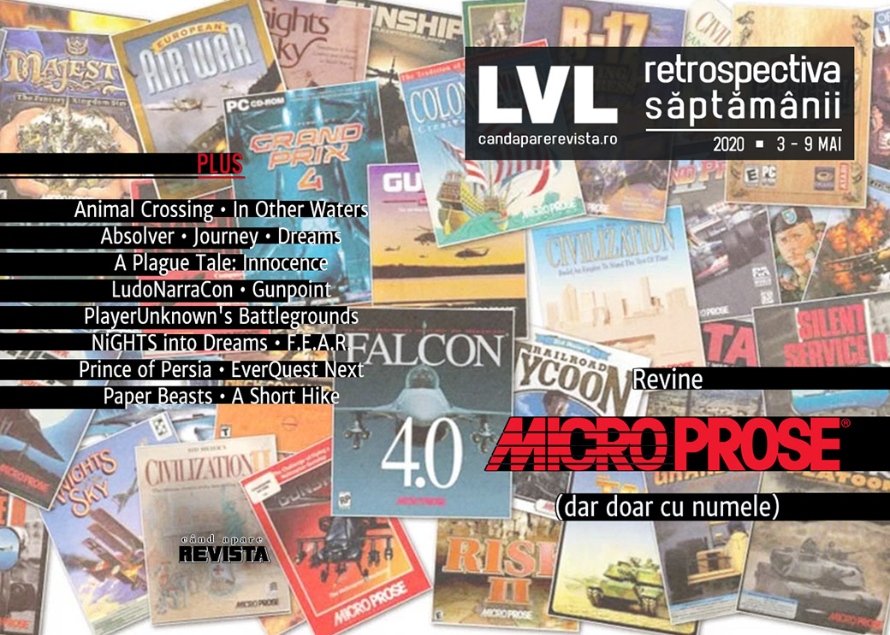

Compania MicroProse e adusă din nou în arena publicării de jocuri, Fortnite are toți jucătorii, evenimentele de jocuri se anulează în continuare din cauza coronavirusului, iar Microsoft a arătat primele jocuri pentru viitorul Xbox. În plus, aflăm ce înseamnă LudoNarraCon pentru creatorii de jocuri independente și ne aducem aminte de Prince of Persia împreună cu creatorul Jordan Mechner.

Linkuri rapide:

* [Știri](#știri)
* [Articole (critică, dev, design)](#articole-critică-dev-design)
* [Made în România](#made-în-românia)
* [Anunţuri şi lansări de jocuri](#anunțuri-şi-lansări-de-jocuri)
* [Prăvălii de jocuri](#prăvălii-de-jocuri)

## Știri

* Compania MicroProse revine și a anunțat primele trei titluri pe care le va publica. Venerabila companie mai e acum doar un catalog de titluri, fiind deținută de o altă companie, dar fostul fondator Bill Stealey face parte din consiliul de administrație. ([Kotaku](https://kotaku.com/after-nearly-two-decades-microprose-is-making-strategy-1843259471), [Shacknews](https://www.shacknews.com/article/117895/original-xcom-publisher-microprose-returns-from-the-dead-with-3-upcoming-games), [GamesIndustry.biz](https://www.gamesindustry.biz/articles/2020-05-05-microprose-returns-after-two-decade-absence), [Gamasutra](https://www.gamasutra.com/view/news/362350/MicroProse_brand_known_for_XCOM_and_Civilization_has_been_revived.php))
* Un contract mai puțin obișnuit: THQ Nordic face schimb de proprietăți intelectuale cu Koch Media și primește francize precum Rise, Sacred sau Singles, printre altele, renunțând în schimb la seriile Red Faction și Painkiller. ([GameSpace](https://www.gamespace.com/all-articles/news/thq-nordic-koch-media-trade-ips), [Destructoid](https://www.destructoid.com/thq-nordic-and-koch-just-traded-ips-like-sports-teams-590139.phtml), [VideoGamesChronicle](https://www.videogameschronicle.com/news/volition-reunited-with-red-faction-in-franchise-swap-deal/))

* Fortnite are acum 350 milioane de jucători. ([The Verge](https://www.theverge.com/2020/5/6/21249497/fortnite-350-million-registered-players-hours-played-april))

* Alte evenimente anulate din cauza coronavirusului: Tokyo Game Show ([VideoGamesChronicle](https://www.videogameschronicle.com/news/tokyo-game-show-2020-has-been-cancelled/), [EGM](https://egmnow.com/tokyo-game-show-2020s-physical-event-canceled-moved-online/), [Kotaku](https://kotaku.com/the-2020-tokyo-game-show-has-been-cancelled-1843329846)) și Paris Games Week. ([Polygon](https://www.polygon.com/2020/5/7/21250948/paris-games-week-2020-canceled-coronavirus), [PC Gamer](https://www.pcgamer.com/paris-games-week-has-been-cancelled-because-of-the-covid-19-pandemic/), [EGM](https://egmnow.com/paris-games-week-has-been-canceled/), [Eurogamer](https://www.eurogamer.net/articles/2020-05-07-paris-games-week-cancelled-due-to-coronavirus))

* Microsoft a organizat prima prezentare Inside Xbox dedicată jocurilor pentru viitoarea consolă Xbox Series X, în cadrul căreia au fost anunțate mai multe titluri noi (găsiți lista mai jos, în secțiunea de Anunțuri).  [VideoGamesChronicle](https://www.videogameschronicle.com/news/summary-the-13-new-games-announced-for-xbox-series-x/), [RPS](https://www.rockpapershotgun.com/2020/05/07/microsofts-xbox-series-x-showcase-rounded-up/), [EGM](https://egmnow.com/inside-xbox-revealed-a-ton-of-new-games-coming-to-series-x/), [Kotaku](https://kotaku.com/everything-microsoft-announced-during-todays-xbox-serie-1843316215)) 

## Articole (critică, dev, design)
* [From Lee Everett to Lucius Fox: The Black Actor Who Has Voiced Gaming’s Most Memorable Characters](https://www.theroot.com/from-lee-everett-to-lucius-fox-the-black-actor-who-has-1843242898) (The Root)
* [The video game apocalypses are already here - and they're all around us](https://www.eurogamer.net/articles/2020-05-06-the-video-game-apocalypses-are-already-here-and-its-all-around-us) (Eurogamer)
* [The lure of a good spaceport](https://www.eurogamer.net/articles/2020-05-05-the-lure-of-a-good-spaceport) (Eurogamer)
* [Indycar&#39;s Virtual Race Crashes Sparked Real-World Controversy Among Drivers](https://www.vice.com/en_us/article/5dzmgn/indycar-iracing-controversy-pagenaud-norris-incident) (Vice)
* [Games Criticism Is A Kindness](https://kotaku.com/games-criticism-is-a-kindness-1843320046) (Kotaku)
* [The world’s biggest PC games are fighting a new surge of cheaters and hackers](https://www.theverge.com/2020/5/6/21246229/pc-gaming-cheating-aimbots-wallhacks-hacking-tools-developer-response-problem) (The Verge)
* [How Animal Crossing’s fake industries let players afford real rent amid COVID-19](https://arstechnica.com/gaming/2020/05/how-animal-crossing-has-become-an-experimental-playground-for-irl-business/) (Ars Technica)
* [The Calming Effect of Low Stakes Games](https://www.gamasutra.com/blogs/JoshBycer/20200508/362604/The_Calming_Effect_of_Low_Stakes_Games.php) (Gamasutra)
* [Why 'dead game' needs to die](https://www.pcgamer.com/why-dead-game-needs-to-die/) (PC Gamer)

---

### Actualitate
* [The resurrection of MicroProse and return of &quot;Wild Bill&quot; Stealey](https://www.gamesindustry.biz/articles/2020-05-06-the-resurrection-of-microprose-and-return-of-wild-bill-stealey) (GamesIndustry.biz)
* [Gameplay Trailers Should Have Gameplay In Them](https://kotaku.com/gameplay-trailers-should-have-gameplay-in-them-1843322175) (Kotaku)
* [The RetroBeat: Next-gen console debuts aren&#8217;t what they used to be](https://venturebeat.com/2020/05/08/the-retrobeat-next-gen-console-debuts-arent-what-they-used-to-be/) (VentureBeat)
 
---

### _Not-a-review_
* [Resource Extraction](https://unwinnable.com/2020/05/04/resource-extraction/) (Unwinnable)
* [The neverending quest for Absolver's ultimate martial art](https://www.eurogamer.net/articles/2020-04-28-the-quest-for-the-ultimate-videogame-martial-art) (Eurogamer)
* [Playing Journey with a Stranger in 2020 Was the Gaming Experience I Needed](https://www.escapistmagazine.com/v2/playing-journey-with-a-stranger-in-2020-was-the-gaming-experience-i-needed/) (Escapist)
* [People Are Creating Some Unusual Video Games During Quarantine](https://hyperallergic.com/560399/dreams-playstation-4/) (Hyperallergic)
* [A Plague Tale: Innocence&#8217;s resonance into today&#8217;s plague-filled world](https://ineeddiversegames.org/2020/05/05/a-plague-tale-innocences-resonance-into-todays-plague-filled-world/) (I Need Diverse Games)
* [Pathologic and the Morality of Illness](https://www.fanbyte.com/features/pathologic-illness/) (Fanbyte)

---

### Industrie
* [The Creator of &#39;PUBG&#39; on Where Battle Royale Started and Where It&#39;s Going](https://www.vice.com/en_us/article/ep4gb7/the-creator-of-pubg-on-where-battle-royale-started-and-where-its-going) (Vice)
* [Somehow, the Sokpop Collective has released two games a month for two years](https://www.pcgamer.com/somehow-the-sokpop-collective-has-released-two-games-a-month-for-two-years/) (PC Gamer)
* [VR could seize its moment -- if the big players would cooperate](https://www.gamesindustry.biz/articles/2020-05-07-vr-could-seize-its-moment-if-the-big-players-would-cooperate-opinion) (GamesIndustry.biz)
* [LudoNarraCon: a data-filled followup Q&A](https://gamasutra.com/blogs/SimonCarless/20200507/362549/LudoNarraCon_a_datafilled_followup_QA.php) (Gamasutra)
* [Q&A: How Jackbox CEO Mike Bilder is grappling with quarantine-driven success](https://gamasutra.com/view/news/362385/QA_How_Jackbox_CEO_Mike_Bilder_is_grappling_with_quarantinedriven_success.php) (Gamasutra)
* [Beyond 'Animal Crossing:' What those making your favorite games are playing](https://www.latimes.com/entertainment-arts/story/2020-05-05/coronavirus-50-video-game-pro-picks-beyond-animal-crossing-from-cyberpunk-2077-halo-watch-dog-makers) (L.A. Times)

---

### Istorie, retrospectivă
* [The story of Your Sinclair](https://www.eurogamer.net/articles/2020-05-03-the-story-of-your-sinclair) (Eurogamer)
* [Gunpoint is perhaps the least judgmental game ever made](https://www.rockpapershotgun.com/2020/05/04/gunpoint-is-perhaps-the-least-judgmental-game-ever-made/) (RPS)
* [A dream paradox](https://kimimithegameeatingshemonster.wordpress.com/2020/05/05/a-dream-paradox/) (Kimimi The Game-Eating She-Monster)
* [Carnivores: Cityscape](https://obscuritory.com/shooter/carnivores-cityscape/) (The Obscuritory)
* [Turning back time - Jordan Mechner on Prince of Persia&#39;s legacy](https://wireframe.raspberrypi.org/articles/turning-back-time-jordan-mechner-on-prince-of-persias-legacy) (Wireframe magazine)
* [The Game Archaeologist: The rise and fall of Landmark and EverQuest Next](https://massivelyop.com/2020/05/09/the-game-archaeologist-the-rise-and-fall-of-landmark-and-everquest-next/) (Massively OP)

---

### Dev, making of, mecanici
* [Beyond emulation: The massive effort to reverse-engineer N64 source code](https://arstechnica.com/gaming/2020/05/beyond-emulation-the-massive-effort-to-reverse-engineer-n64-source-code/) (Ars Technica)
* [Video: Behind the beautiful audio of PSVR game  Paper Beast](https://www.gamasutra.com/view/news/362691/Video_Behind_the_beautiful_audio_of_PSVR_game_Paper_Beast.php) (Gamasutra)
* [Building the AI of F.E.A.R. with Goal Oriented Action Planning](https://www.gamasutra.com/blogs/TommyThompson/20200507/362417/Building_the_AI_of_FEAR_with_Goal_Oriented_Action_Planning.php) (Gamasutra)

---

### Design, world-building, artă
* [The hand-painted beauty of indie game Dordogne](https://www.theverge.com/2020/5/6/21249119/dordogne-indie-game-interview-steam-nintendo-switch) (The Verge)
* [Behind the LudoNarraCon 2020 Poster: An Interview with Leonie Yue](https://unwinnable.com/2020/05/06/behind-the-ludonarracon-2020-poster-an-interview-with-leonie-yue/) (Unwinnable)
* [A Short Hike’s Design Makes Perfect Serenity Out of a Treacherous Climb](https://www.escapistmagazine.com/v2/a-short-hikes-design-makes-perfect-serenity-out-of-a-treacherous-climb/) (Escapist)
* [Game Box Art Critique May: Star Wars Episode I: Racer, Maneater, John Wick Hex](https://www.videogamer.com/features/game-box-art-critique-may-star-wars-episode-i-racer-maneater-john-wick-hex) (VideoGamer)
* [Big Brain Detective](https://kotaku.com/big-brain-detective-1843253224) (Kotaku)

## Made în România

* [Update: Jam De Casă a generat 72 de jocuri](https://zonait.ro/jam-de-casa-a-generat-75-de-jocuri/) (Zona IT)

## Anunțuri şi lansări de jocuri
### Anunțate
* **Sea Power**, **Second Front**, **Task Force Admiral**, trei jocuri noi de la MicroProse ([Kotaku](https://kotaku.com/after-nearly-two-decades-microprose-is-making-strategy-1843259471))
* **What Happened** ([IGN](https://www.ign.com/articles/what-happened-announced))
* **Black Book** ([GameSpace](https://www.gamespace.com/all-articles/news/black-book-kickstarter-launches-with-first-chapter-free))
* **Moonray** ([PC Gamer](https://www.pcgamer.com/moonray-is-a-surreal-hack-and-slash-adventure-coming-to-early-access/))
* **Drox Operative 2** ([PC Gamer](https://www.pcgamer.com/spaceship-action-rpg-drox-operative-2-announced/))
* **Call of the Sea** ([PC Gamer](https://www.pcgamer.com/search-for-a-missing-expedition-on-a-mysterious-island-in-this-first-person-adventure/))
* **Mortal Kombat 11 Aftermath** ([VG247](https://www.vg247.com/2020/05/06/mortal-kombat-11-aftermath-expansion-robocop/))

#### Anunțuri Inside Xbox
* **Dirt 5** ([EGM](https://egmnow.com/dirt-5-announced-with-debut-trailer/), [VideoGamesChronicle](https://www.videogameschronicle.com/news/dirt-5-gets-xbox-series-x-reveal-trailer-and-2020-release/))
* **The Medium** ([EGM](https://egmnow.com/bloober-teams-next-game-is-the-medium/), [PC Gamer](https://www.pcgamer.com/layers-of-fear-studio-bloober-team-is-working-on-a-new-game-about-perspective/))
* **Second Extinction** ([EGM](https://egmnow.com/second-extinction-announced-for-xbox-series-x-xbox-one-and-pc/), [PC Gamer](https://www.pcgamer.com/second-extinction-is-a-co-op-fps-that-looks-like-turok-crossed-with-generation-zero/))
* **The Ascent** ([PC Gamer](https://www.pcgamer.com/the-ascent-announced-a-striking-cyberpunk-action-rpg/), [Games Informer](https://www.gameinformer.com/inside-xbox/2020/05/07/indie-studio-neon-giant-announces-cyberpunk-themed-co-op-shooter-the-ascent))
* **Dirt 5** ([PC Gamer](https://www.pcgamer.com/dirt-5-takes-you-on-muddy-races-around-the-world-this-october/))
* **Chorus: Rise as One** ([PC Gamer](https://www.pcgamer.com/chorus-rise-as-one-is-a-space-sim-that-will-go-beyond-the-boundaries-of-reality/))
* **Yakuza: Like a Dragon** ([EGM](https://egmnow.com/yakuza-like-a-dragon-is-coming-to-xbox-series-x-xbox-one-and-pc/))

### Acum cu dată de lansare
* **Halo 2: Anniversary**: 12 mai ([EGM](https://egmnow.com/halo-2-anniversary-arrives-on-pc-next-week/))
* **Cannibal Cuisine**: 20 mai ([PC Gamer](https://www.pcgamer.com/cannibal-cuisine-is-overcooked-with-human-flesh/))
* **Crucible**: 20 mai ([DSOGaming](https://www.dsogaming.com/news/amazons-free-to-play-pvp-shooter-crucible-releases-on-may-20th-official-pc-system-requirements/))
* **Disintegration**:  16 iunie ([VideoGamesChronicle](https://www.videogameschronicle.com/news/halo-co-creators-disintegration-reveals-release-date-and-story-trailer/))

### Lansate
* 5 mai: **Someday You’ll Return** ([Steam](https://store.steampowered.com/app/840370/Someday_Youll_Return/))
* 5 mai: **Wintermoor Tactics Club** ([Steam](https://store.steampowered.com/app/917840/Wintermoor_Tactics_Club/), [gog.com](https://www.gog.com/game/wintermoor_tactics_club))
* 5 mai: **Population Zero** (early access) ([Steam](https://store.steampowered.com/app/1239430/Population_Zero/))
* 7 mai: **Spirit of the North** ([Steam](https://store.steampowered.com/app/1213700/Spirit_of_the_North/))
* 8 mai: **Before We Leave** ([Epic Store](https://www.epicgames.com/store/en-US/product/before-we-leave/))
* 8 mai: **Hydroneer**  ([Steam](https://store.steampowered.com/app/1106840/Hydroneer/))
* 8 mai: **Dark Light** (early access) ([Steam](https://store.steampowered.com/app/1134520/Dark_Light/))
* 8 mai: **Fury Unleashed** (iese din early access) ([Steam](https://store.steampowered.com/app/465200/Fury_Unleashed/))
* 8 mai: **Tonight We Riot** ([Steam](https://store.steampowered.com/app/290690/Tonight_We_Riot/), [gog.com](https://www.gog.com/game/tonight_we_riot))

## Prăvălii de jocuri
### Update catalog
* [Halo 2: Anniversary, Final Fantasy IX, more joining Xbox Game Pass for PC](https://egmnow.com/halo-2-anniversary-final-fantasy-ix-more-joining-xbox-game-pass-for-pc/) (EGM)
* [Rainbow Six Siege and Evil Within 2 join PlayStation Now](https://www.videogameschronicle.com/news/rainbow-six-siege-and-evil-within-2-join-playstation-now/) (VideoGamesChronicle)

### Jocuri gratis și free weekends
* [Death Coming is now free on the Epic Games Store](https://www.videogameschronicle.com/news/death-coming-now-free-on-the-epic-games-store/) (VideoGamesChronicle)
* [Ashes of the Singularity: Escalation is free in the Humble Store Spring Sale](https://www.pcgamer.com/ashes-of-the-singularity-escalation-is-free-in-the-humble-store-spring-sale/) (PC Gamer)
* [Drive a train across the wasteland in this free indie game](https://www.pcgamer.com/drive-a-train-across-the-wasteland-in-this-free-indie-game/) (PC Gamer)
* [Loop-Loop DX Is a Slick, Colorful Arcade Shooter You Can Play for Free](https://www.escapistmagazine.com/v2/loop-loop-dx-alex-carpenter-free-shooter/) (Escapist)
* [Surreal, stylish Rusty Lake precursor Samsara Room gets free remake, is out now on Steam](https://www.eurogamer.net/articles/2020-05-04-surreal-stylish-rusty-lake-precursor-samsara-room-gets-free-remake-is-out-now-on-steam) (Eurogamer)

### Reduceri și promoții
* [Battlefront 2, The Sims 4 and Titanfall 2 are all 70% off in the Origin sale](https://www.pcgamer.com/battlefront-2-the-sims-4-and-titanfall-2-are-all-70-off-in-the-origin-sale/) (PC Gamer)
* [Get XCOM 2 and Jurassic World Evolution for just €12 in the latest Humble Choice bundle](https://www.eurogamer.net/articles/2020-05-07-get-xcom-2-and-jurassic-world-evolution-for-just-gbp12-in-the-latest-humble-choice-bundle) (Eurogamer)
* [This PlayStation sale is all about finding hidden gems](https://www.destructoid.com/this-playstation-sale-is-all-about-finding-hidden-gems-590124.phtml) (Destructoid)
* [Weekend PC Download Deals for May 8: First DOOM Eternal discounts](https://www.shacknews.com/article/117986/weekend-pc-download-deals-for-may-8-first-doom-eternal-discounts) (Shacknews)
* [Weekend Console Download Deals for May 8: Last call for free Pac-Man CE 2](https://www.shacknews.com/article/117980/weekend-console-download-deals-for-may-8-last-call-for-free-pac-man-ce-2) (Shacknews)
* [Best PC gaming deals of the week &#8211; 7th May 2020](https://www.rockpapershotgun.com/2020/05/07/best-pc-gaming-deals-of-the-week-7th-may-2020/) (RPS)

---

{}
**Retrospectiva săptămânii** este rubrica duminicală în care trecem în revistă evenimentele săptămânii de pe frontul de gaming: știri şi articole (scrise de alții, bineînțeles, că e mai ușor aşa), industrie, lansări, oferte de jocuri, toate numai de savurat la cafeaua de duminică dimineața.

De asemenea, rubrica e deschisă oricui vrea și poate contribui. Dacă ai citit vreun articol sau vreo știre interesantă și crezi că merită incluse în retrospectiva săptămânii, te așteptăm pe forum pe unul dintre topicurile dedicate: [Știri](https://forum.candaparerevista.ro/viewtopic.php?f=4&t=46), [Articole](https://forum.candaparerevista.ro/viewtopic.php?f=4&t=206), [Gaming România](https://forum.candaparerevista.ro/viewtopic.php?f=4&t=1622)].
{}
