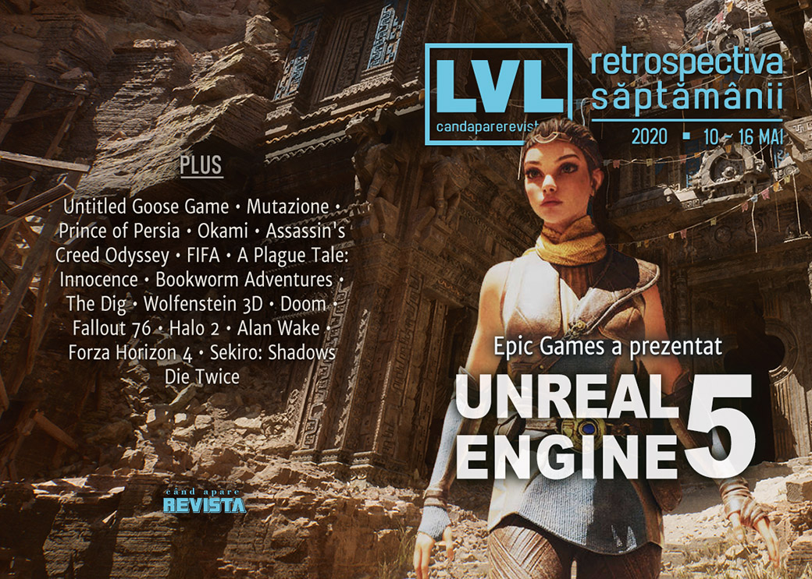

Săptămâna aceasta am aruncat o scurtă privire în viitorul industriei de gaming: Epic Games a făcut o impresionantă prezentare pentru viitorul Unreal Engine 5, iar Nvidia a prezentat Ampere, o nouă arhitectură pentru procesoare grafice. Pe lângă acestea, continuăm incursiunea în epoca „shareware” cu istoria id Software, Alan Wake aniversează 10 ani, și, surpriză, a fost anunțată o versiune remasterizată pentru seria Mafia.

Linkuri rapide:

* [Știri](#știri)
* [Articole (critică, dev, design)](#articole-critică-dev-design)
* [Made în România](#made-în-românia)
* [Anunțuri şi lansări de jocuri](#anunțuri-şi-lansări-de-jocuri)
* [Prăvălii de jocuri](#prăvălii-de-jocuri)

## Știri

* Epic Games a prezentat un demo pentru viitorul motor Unreal Engine 5 cu accentul pus pe noile tehnologii de iluminare dinamică și geometrie „micro-poligonală”. Demo-ul rula pe hardware PlayStation 5, iar engine-ul va fi lansat în prima parte a anului viitor. ([Kotaku](https://kotaku.com/epic-unveils-a-graphics-demo-running-on-ps5-1843439846), [VideoGamesChronicle](https://www.videogameschronicle.com/news/unreal-engine-5/), [EGM](https://egmnow.com/watch-the-unreal-engine-5-tech-demo-running-on-playstation-5/), [GamesIndustry.biz](https://www.gamesindustry.biz/articles/2020-05-13-epic-games-announces-unreal-engine-5-with-first-ps5-footage), [Shacknews](https://www.shacknews.com/article/118057/unreal-engine-5-unveiled-by-epic-games-lumen-nanite-tools-showcased), [Gamasutra](https://www.gamasutra.com/view/news/362861/Epic_reveals_nextgen_Unreal_Engine_5_tech_running_on_PlayStation_5___.php))
  * [How Epic got such amazing Unreal Engine 5 results on next-gen consoles](https://arstechnica.com/gaming/2020/05/behind-the-scenes-of-that-incredible-unreal-engine-5-tech-demo/) (Ars Technica)
  * [Unreal Engine 5 tech demo uses 'film-quality' assets, runs on today's hardware](https://www.pcgamer.com/unreal-engine-5-tech-demo/) (PC Gamer)
  * [The Unreal Engine 5 demo looks amazing, but shows nothing that will move games forward](https://www.pcgamer.com/the-unreal-engine-5-demo-looks-amazing-but-shows-nothing-that-will-move-games-forward/) (PC Gamer)
  * [Inside Unreal Engine 5: how Epic delivers its generational leap](https://www.eurogamer.net/articles/digitalfoundry-2020-unreal-engine-5-playstation-5-tech-demo-analysis) (Eurogamer)
* Iar în cadrul aceleiași prezentări, Epic a anunțat și alte schimbări care vin în sprijinul dezvoltatorilor ce folosesc Unreal Engine: taxele de licențiere pentru engine nu mai sunt aplicate până când jocurile nu încasează 1 milion de dolari ([PC Gamer](https://www.pcgamer.com/unreal-engine-games-no-longer-owe-royalties-on-their-first-dollar1m-in-revenue/)), iar framework-ul pentru multiplayer folosit și pentru Fortnite este acum disponibil gratuit. ([PC Gamer](https://www.pcgamer.com/epics-multiplayer-systems-are-now-available-for-other-devs-to-use-for-free/))

* Nvidia a prezentat Ampere, o nouă arhitectură de 7nm ce va sta la baza viitoarei generații de procesoare grafice. Deși primele produse cu noua tehnologie vor fi destinate centrelor de calcul și cercetare ([Eurogamer](https://www.eurogamer.net/articles/digitalfoundry-2020-05-14-nvidia-announces-ampere-architecture-next-gen-gpus-a100), [PC Gamer](https://www.pcgamer.com/nvidia-ampere-gtc-2020-keynote-watch-live/), [TechRadar ](https://www.techradar.com/news/nvidia-ampere)), aceasta va fi prezentă apoi și în următoarea serie de plăci grafice pentru consumatori. ([PC Gamer](https://www.pcgamer.com/nvidia-ampere-confirmed-gaming-graphics-card-architecture/), [DSOGaming](https://www.dsogaming.com/users-articles/nvidia-confirms-that-the-ampere-architecture-will-also-launch-for-the-geforce-gaming-series/))
  * [Nvidia Ampere release date, specs, performance, and pricing](https://www.pcgamer.com/nvidia-ampere-release-date-specs-performance/) (PC Gamer)
  * [Nvidia RTX 3080 and Ampere: Everything We Know](https://www.tomshardware.com/news/nvidia-rtx-3080-ampere-all-we-know) (Tom's Hardware)

* Humble Bundle a lansat Humble Games, o divizie separată ce se va ocupa doar de publicarea de jocuri indie. ([PC Invasion](https://www.pcinvasion.com/humble-bundle-publishing-arm-humble-games-charity-sale/), [PCGamesInsider.biz](https://www.pcgamesinsider.biz/news/71102/humble-bundle-launches-its-humble-games-publishing-label-for-indie-devs/), [Gamasutra](https://www.gamasutra.com/view/news/363013/Humbles_indie_game_publishing_biz_is_now_Humble_Games.php))

## Articole (critică, dev, design)

* [How public arts funding helps developers make unique, more diverse games](https://www.theverge.com/21256048/public-arts-funding-games-untitled-goose-game-mutazione) (The Verge)
* [Soundscapes As Stories: How Games Are Changing How We Experience Music](https://uppercutcrit.com/soundscapes-as-stories) (Uppercut)
* [Purple Haze - The Corruption Spreading Through Video Games Design](http://fingerguns.net/features/2020/05/15/purple-haze-the-corruption-spreading-through-video-games-design/) (Finger Guns)
* [Play Time](https://www.slowrun.me/2020/05/play-time.html) (SlowRun)
* [The Rise and Fall (and Rise) of the Female-Fronted First-Person Shooter](https://www.theringer.com/2020/5/12/21254593/first-person-shooter-perfect-dark-20th-anniversary-female-protagonists) (The Ringer)
* [The Nightmare of Having Too Many Videogames to Play](https://www.gamasutra.com/blogs/JoshBycer/20200514/362928/The_Nightmare_of_Having_Too_Many_Videogames_to_Play.php) (Gamasutra)
* [Jocurile online ca instrumente de socializare](https://mindcraftstories.ro/index.php/2020/05/14/jocurile-online-ca-instrumente-de-socializare/) (Mindcraft Stories)

---

### _Not-a-review_
* [Assassin's Creed Odyssey's magic is its sense of pure fun](https://www.eurogamer.net/articles/2020-05-10-freed-from-the-weight-of-itself-assassins-creed-odysseys-magic-is-its-sense-of-pure-fun) (Eurogamer)
* [FIFA esports at a crossroads as the global lockdown hits home](https://www.eurogamer.net/articles/2020-05-14-fifa-esports-at-a-crossroads-as-the-global-lockdown-hits-pros-hard) (Eurogamer)
* [Fortnite Party Royale is the most fun you can have in the metaverse](https://www.theguardian.com/games/2020/may/15/fortnite-party-royale) (The Guardian)
* [A Plague Tale: Innocence is the Best Horror Game Since Dead Space](https://www.usgamer.net/articles/a-plague-tale-innocence-backlog) (USgamer)

---

### Industrie
* [A game developer's guide to Steam wishlists](https://www.gamesindustry.biz/articles/2020-05-15-a-game-developer-guide-to-steam-wishlists) (GamesIndustry.biz)
* [Epic's next-gen bid to knock down the walled garden](https://www.gamesindustry.biz/articles/2020-05-13-epics-next-gen-bid-to-knock-down-the-walled-garden) (GamesIndustry.biz)
* [Epic Games: Unreal Engine 5 will bring a generational change to graphics](https://venturebeat.com/2020/05/13/how-epic-games-is-tailoring-unreal-engine-5-to-make-next-gen-graphics-shine/) (VentureBeat)
* [Epic Games shows off a stunning Unreal Engine 5 demo on PlayStation 5](https://venturebeat.com/2020/05/13/epic-games-shows-off-a-stunning-unreal-engine-5-demo-on-playstation-5/) (VentureBeat)

---

### Istorie, retrospectivă
* [Bookworm Adventures has been erased from the internet, and I want to know why](https://www.rockpapershotgun.com/2020/05/11/bookworm-adventures-has-been-erased-from-the-internet-and-i-want-to-know-why/) (RPS)
* [The Dig is a weird LucasArts adventure dreamed up by Steven Spielberg](https://www.pcgamer.com/reinstall-the-dig/) (PC Gamer)
* [The Shareware Scene, Part 3: The id Boys](https://www.filfre.net/2020/05/the-shareware-scene-part-3-the-id-boys/) (The Digital Antiquarian)

---

### Dev, making of, mecanici
* [The making of Fallout 76: Wastelanders](https://www.rockpapershotgun.com/2020/05/11/the-making-of-fallout-76-wastelanders/) (RPS)
* [What It Was Like To Launch Halo 2](https://www.gameinformer.com/interview/2020/05/13/what-it-was-like-to-launch-halo-2) (Games Informer)
* [An Interview With Sam Lake About Alan Wake&#039;s 10-Year Anniversary And What Comes Next For Control](https://www.gameinformer.com/2020/05/14/an-interview-with-sam-lake-about-alan-wakes-10-year-anniversary-and-what-comes-next-for) (Games Informer)
* [War Stories: Alan Wake’s transformation emerged from a two-month “sauna”](https://arstechnica.com/gaming/2020/05/war-stories-alan-wakes-transformation-emerged-from-a-two-month-sauna/) (Ars Technica)
* [Video: Balancing visuals and performance while art directing Forza](https://www.gamasutra.com/view/news/362783/Video_Balancing_visuals_and_performance_while_art_directing_Forza.php) (Gamasutra)

---

### Design, world-building, artă
* [Ten years on, Alan Wake's Bright Falls is still one of PC gaming's greatest settings](https://www.pcgamer.com/alan-wakes-bright-falls/) (PC Gamer)
* [Japan Style Architecture](https://unwinnable.com/2020/05/13/japan-style-architecture/) (Unwinnable)
* [Gaps and Pauses: The Role of Negative Space in Games](https://www.fanbyte.com/features/negative-space-games/) (Fanbyte)

## Anunțuri şi lansări de jocuri
* [A new Doctor Who game is in development for PC and consoles](https://egmnow.com/a-new-doctor-who-game-is-in-development-for-pc-and-consoles/) (EGM)

### Anunțate
* **Mechstermination Force** ([Destructoid](https://www.destructoid.com/contra-like-boss-battler-mechstermination-force-is-coming-to-pc-590697.phtml))
* **Cassette Beasts** ([Destructoid](https://www.destructoid.com/cassette-beasts-is-a-strange-but-exciting-take-on-pokemon-590639.phtml))
* **Tony Hawk’s Pro Skater 1 și 2** remastered ([EGM](https://egmnow.com/tony-hawks-pro-skater-1-and-2-getting-a-4k-remaster/))
* **Cygni: All Guns Blazing** ([Kotaku](https://kotaku.com/cygni-all-guns-blazing-is-an-upcoming-shmup-for-the-pc-1843402567))
* **Drox Operative 2** ([RPS](https://www.rockpapershotgun.com/2020/05/14/brilliant-action-rpg-sandbox-drox-operative-is-getting-a-sequel/))
* **Blightbound** ([PC Invasion](https://www.pcinvasion.com/co-op-dungeon-crawler-blightbound-is-heading-to-early-access/))
* **Skully** ([GameSpace](https://www.gamespace.com/all-articles/news/skully-announcement-trailer))
* **RIDE 4** ([DSOGaming](https://www.dsogaming.com/news/milestone-announces-ride-4-releases-on-october-8th/))
* **Mafia: Definitive Edition** - s-a anunțat că va fi anunțat, deci vom mai avea un anunț și săptămâna viitoare ([VideoGamesChronicle](https://www.videogameschronicle.com/news/2k-announces-mafia-trilogy-for-consoles-and-pc/), [PC Gamer](https://www.pcgamer.com/mafia-definitive-edition-is-coming-in-august-and-it-looks-gorgeous/))

### Acum cu dată de lansare
* **Tainted Grail**: 25 iunie ([PC Gamer](https://www.pcgamer.com/open-world-rpg-tainted-grail-is-heading-to-early-access-on-june-25/))
* **Crusader Kings 3**: 1 septembrie ([VideoGamesChronicle](https://www.videogameschronicle.com/news/crusader-kings-3-will-release-in-september/))

### Amânate
* **Rock of Ages 3: Make & Break**: 21 iulie în loc de începutul lunii iunie ([GameSpace](https://www.gamespace.com/all-articles/news/rock-of-ages-3-make-break-postponed-to-late-july))

### Lansate
* 11 mai: **ATOM RPG Trudograd** ([Steam](https://store.steampowered.com/app/1139940/ATOM_RPG_Trudograd/), [gog.com](https://www.gog.com/game/atom_rpg_trudograd))
* 12 mai: **VirtuaVerse** ([Steam](https://store.steampowered.com/app/1019310/VirtuaVerse/), [gog.com](https://www.gog.com/game/VirtuaVerse))
* 12 mai: **Huntdown** ([Epic Store](https://www.epicgames.com/store/en-US/product/huntdown/))
* 12 mai: **Jet Lancer** ([Steam](https://store.steampowered.com/app/913060/Jet_Lancer/), [gog.com](https://www.gog.com/game/jet_lancer))
* 13 mai: **Deep Rock Galactic** (iese din early access) ([Steam](https://store.steampowered.com/app/548430/Deep_Rock_Galactic/))
* 13 mai: **Halo 2: Anniversary** ([Steam](https://store.steampowered.com/app/1064270/Halo_2_Anniversary/))
* 14 mai: **Nimbatus - The Space Drone Constructor** ([Steam](https://store.steampowered.com/app/383840/Nimbatus__The_Space_Drone_Constructor/))
* 14 mai: **Signs of the Sojourner** ([Steam](https://store.steampowered.com/app/1058690/Signs_of_the_Sojourner/), [gog.com](https://www.gog.com/game/signs_of_the_sojourner))
* 15 mai: **Tales From Off-Peak City Vol. 1** ([Steam](https://store.steampowered.com/app/1129920/Tales_From_OffPeak_City_Vol_1/))

## Prăvălii de jocuri
### Știri
* [Steam now recommends which games you should play next](https://www.rockpapershotgun.com/2020/05/15/steam-now-recommends-which-games-you-should-play-next/) (RPS)
* [Digital Dragons Steam Indie Celebration features 25 demos including Ghostrunner & Roki](https://www.shacknews.com/article/118068/digital-dragons-steam-indie-celebration-features-25-demos-including-ghostrunner-roki) (Shacknews)
* [Steam's Play Next feature is ready to drop some recommendations](https://www.pcgamer.com/steams-play-next-feature-is-ready-to-drop-some-recommendations/) (PC Gamer)

### Update catalog
* [FIFA 20 now available through EA Access](https://www.videogameschronicle.com/news/fifa-20-now-available-through-ea-access/) (VideoGamesChronicle)
* [Remedy is celebrating Alan Wake&#8217;s 10th birthday by bringing it to Xbox Game Pass](https://www.videogameschronicle.com/news/remedy-is-celebrating-alan-wakes-10th-birthday-by-bringing-it-to-xbox-game-pass/) (VideoGamesChronicle)

### Jocuri gratis și free weekends
* [This free photography game lets you explore the beautiful wilderness of Iceland](https://www.pcgamer.com/this-free-photography-game-lets-you-explore-the-beautiful-wilderness-of-iceland/) (PC Gamer)
* [This free virtual pet lets you make a planet horny with cosmic rays](https://www.pcgamer.com/this-free-virtual-pet-lets-you-make-a-planet-horny-with-cosmic-rays/) (PC Gamer)
* [Stellaris Celebrates 4th Anniversary With A New Update, Free Weekend & More](https://www.gamespace.com/all-articles/news/stellaris-celebrates-4th-anniversary-with-a-new-update-free-weekend-more) (GameSpace)
* [Assassin's Creed's educational tours of Ancient Egypt and Greece are free on PC](https://www.eurogamer.net/articles/2020-05-15-assassins-creeds-educational-tours-of-ancient-egypt-and-greece-are-free-on-pc) (Eurogamer)
* [Fallout 76 is free to play on Xbox One, PS4, and PC for a limited time](https://egmnow.com/fallout-76-is-free-to-play-on-xbox-one-ps4-and-pc-for-a-limited-time/) (EGM)
* [Tower defense platformer Aegis Defenders is free on the Humble Store](https://www.pcgamer.com/tower-defense-platformer-aegis-defenders-is-free-on-the-humble-store/) (PC Gamer)
* [Lucid Dream Is Seriously Creepy Point-and-Click Horror You Can Play Free](https://www.escapistmagazine.com/v2/lucid-dream-sizrit-free-point-and-click-horror/) (Escapist)
* [Dance Dance Revolution just became a free browser game](https://www.rockpapershotgun.com/2020/05/14/dance-dance-revolution-just-became-a-free-browser-game/) (RPS)
* [Conan Exiles – Steam Free Weekend May 14 – May 18](https://www.gamespace.com/all-articles/news/conan-exiles-steam-free-weekend-may-14-may-18) (GameSpace)
* [Grab a copy of LEGO Ninjago for free](https://www.destructoid.com/grab-a-copy-of-lego-ninjago-for-free-591065.phtml) (Destructoid)

### Reduceri și promoții
* [Get Hypnospace Outlaw, Starbound, and some surprises in the new Humble Indie Bundle](https://www.pcgamer.com/get-hypnospace-outlaw-starbound-and-some-surprises-in-the-new-humble-indie-bundle/) (PC Gamer)
* [Epic Games’ biggest PC game sale yet is a coupon frenzy, lasts until June 11](https://arstechnica.com/gaming/2020/05/exploring-epic-games-stores-biggest-sale-yet-coupons-and-steam-comparisons/) (Ars Technica)
* [Humble Bundle are offering a sale to celebrate increased publishing plans](https://www.rockpapershotgun.com/2020/05/15/humble-bundle-are-offering-a-sale-to-celebrate-increased-publishing-plans/) (RPS)
* [Best PC gaming deals of the week &#8211; 15th May 2020](https://www.rockpapershotgun.com/2020/05/15/best-pc-gaming-deals-of-the-week-15th-may-2020/) (RPS)
* [Weekend PC Download Deals for May 15: Epic Mega Sale](https://www.shacknews.com/article/118119/weekend-pc-download-deals-for-may-15-epic-mega-sale) (Shacknews)
* [Weekend Console Download Deals for May 15: Free Fallout 76 weekend](https://www.shacknews.com/article/118118/weekend-console-download-deals-for-may-15-free-fallout-76-weekend) (Shacknews)

---

{}
**Retrospectiva săptămânii** este rubrica duminicală în care trecem în revistă evenimentele săptămânii de pe frontul de gaming: știri şi articole (scrise de alții, bineînțeles, că e mai ușor aşa), industrie, lansări, oferte de jocuri, toate numai de savurat la cafeaua de duminică dimineața.

De asemenea, rubrica e deschisă oricui vrea și poate contribui. Dacă ai citit vreun articol sau vreo știre interesantă și crezi că merită incluse în retrospectiva săptămânii, te așteptăm pe forum pe unul dintre topicurile dedicate: [Știri](https://forum.candaparerevista.ro/viewtopic.php?f=4&t=46), [Articole](https://forum.candaparerevista.ro/viewtopic.php?f=4&t=206), [Gaming România](https://forum.candaparerevista.ro/viewtopic.php?f=4&t=1622)].
{}
