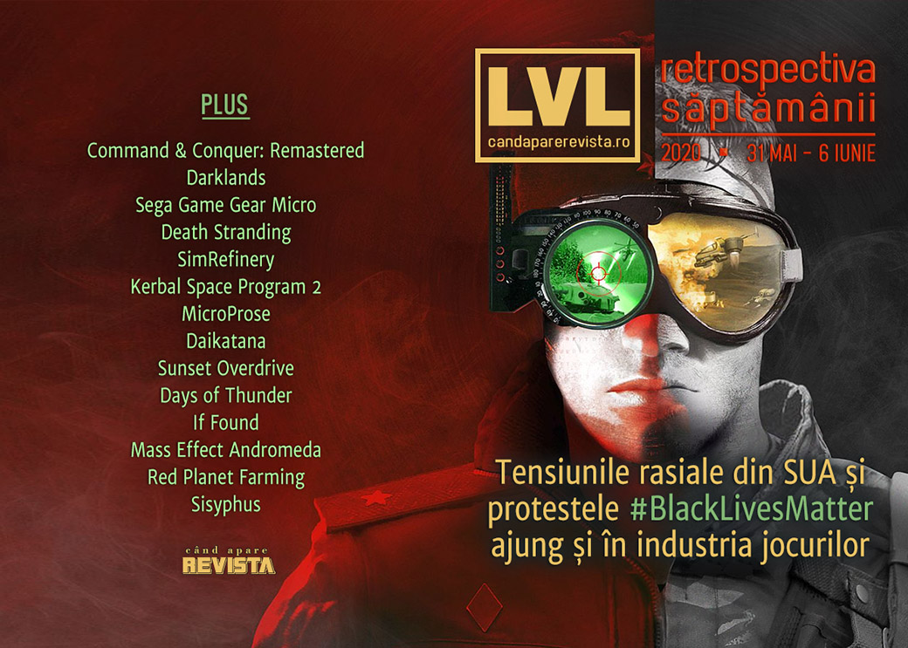

Protestele din SUA aprinse de moartea lui George Floyd au reacții și din industria de gaming, de la strângeri de fonduri, amânarea unor evenimente și alte inițiative de susținere. În alte știri, o retrospectivă despre Maxis a dus la descoperirea unui prototip al unui joc nepublicat, a murit creatorul RPG-ului Darklands și s-a lansat colecția remasterizată Command & Conquer.

Linkuri rapide:

* [Știri](#știri)
* [Articole (critică, dev, design)](#articole-critică-dev-design)
* [Made în România](#made-în-românia)
* [Anunțuri şi lansări de jocuri](#anunţuri-şi-lansări-de-jocuri)
* [Prăvălii de jocuri](#prăvălii-de-jocuri)

## Știri

Tensiunile rasiale și protestele „Black Lives Matter” din SUA reaprinse de uciderea lui George Floyd provoacă diverse reacții și în lumea jocurilor ([VideoGamesChronicle](https://www.videogameschronicle.com/news/digital-game-events-have-been-delayed-in-support-of-anti-racism-protests/), [EGM](https://egmnow.com/gaming-industry-responds-to-justice-for-george-floyd-protests/), [Ars Technica](https://arstechnica.com/gaming/2020/06/game-companies-delay-events-tweet-blacklivesmatter-amid-police-brutality-protests/), [Gamasutra](https://www.gamasutra.com/view/news/364020/Game_devs_show_up_to_support_Black_Lives_Matter_and_Black_game_devs.php)) ...

* ... începând cu comunicate de la redacții de presă ([Eurogamer](https://www.eurogamer.net/articles/2020-06-02-black-lives-matter), [Games Informer](https://www.gameinformer.com/letter-from-the-editor/2020/06/01/our-support-for-the-family-of-george-floyd-our-city-and-nation), [Games Informer](https://www.gameinformer.com/psa/2020/06/03/pressing-pause), [Kotaku](https://kotaku.com/black-lives-matter-1843834680)) sau companii precum Apple ([Shacknews](https://www.shacknews.com/article/118442/apple-ceo-tim-cook-publishes-open-letter-about-speaking-up-on-racism)) sau Nintendo America ([Shacknews](https://www.shacknews.com/article/118415/nintendo-of-america-speaks-out-against-racial-injustices))

* ... la strângeri de donații și înființarea unor fonduri pentru promovarea jocurilor de la dezvoltatori de culoare ([PC Gamer](https://www.pcgamer.com/humble-ubisoft-devolver-and-other-game-companies-make-donations-to-black-lives-matter-and-related-causes/)): Humble ([RPS](https://www.rockpapershotgun.com/2020/06/03/humble-launching-1-million-publishing-fund-for-black-developers/), [Shacknews](https://www.shacknews.com/article/118404/humble-bundle-announces-1-million-fund-dedicated-to-publishing-games-by-black-creators), [Gamasutra](https://www.gamasutra.com/view/news/364106/Humble_is_putting_1_million_toward_publishing_games_from_Black_game_devs.php)) și itch.io ([RPS](https://www.rockpapershotgun.com/2020/06/05/black-lives-matter-bundle-on-itch-has-raised-over-50000-and-counting/), [Eurogamer](https://www.eurogamer.net/articles/2020-06-05-black-lives-matter-indie-game-bundle-has-already-raised-over-gbp43-000-on-itch-io)), Nintendo ([VideoGamesChronicle](https://www.videogameschronicle.com/news/nintendo-is-reportedly-double-matching-employee-donations-to-anti-racism-causes/)), Sega ([Shacknews](https://www.shacknews.com/article/118443/sega-pledges-to-make-and-match-employee-donations-to-anti-racism-organizations)), Pokémon Go ([Eurogamer](https://www.eurogamer.net/articles/2020-06-04-pokemon-go-will-donate-usd5m-minimum-from-go-fest-2020-ticket-sales)), EA ([Shacknews](https://www.shacknews.com/article/118412/ea-announces-initiatives-to-combat-social-injustices)), Digital Extremes ([Shacknews](https://www.shacknews.com/article/118453/digital-extremes-donates-25000-to-black-lives-matter-to-combat-racism)), chiar și un eveniment organizat pe un subreddit dedicat Street Fighter ([Kotaku](https://kotaku.com/street-fighter-event-benefiting-black-lives-matter-demo-1843860542), [Destructoid](https://www.destructoid.com/street-fighter-subreddit-tournament-raises-17-500-for-black-lives-matter-charities-593167.phtml))

* ... la amânări ale unor evenimente: Cyberpunk 2077 Night City Wire ([Twitter](https://twitter.com/cyberpunkgame/status/1267883702241157127), [Escapist](https://www.escapistmagazine.com/v2/cd-projekt-red-reschedules-cyberpunk-2077-night-city-wire-event/), [Destructoid](https://www.destructoid.com/cyberpunk-2077-event-pushed-back-two-weeks-in-light-of-protests-592985.phtml)), IGN Summer of Gaming ([Twitter](https://twitter.com/IGN/status/1267863556109688834), [PC Gamer](https://www.pcgamer.com/igns-summer-of-gaming-event-has-been-delayed-to-june-8/)), PC Gaming Show ([PC Gamer](https://www.pcgamer.com/pc-gaming-show-postponed-to-june-13/), [Shacknews](https://www.shacknews.com/article/118440/pc-gaming-show-2020-delayed-by-a-week-amid-civil-unrest)), The Guerrilla Collective ([RPS](https://www.rockpapershotgun.com/2020/06/05/the-guerrilla-collective-indie-showcase-has-been-delayed-in-support-of-black-lives-matter/), [EGM](https://egmnow.com/guerrilla-collective-showcase-postponed/)), Steam Game Festival și EA Play Live ([PC Gamer](https://www.pcgamer.com/steam-game-festival-and-ea-play-live-have-been-postponed/)) sau Upload VR Showcase Summer Edition ([Shacknews](https://www.shacknews.com/article/118447/upload-vr-showcase-summer-edition-delayed-amid-civil-unrest)) și evenimentul de prezentare a consolei Playstation 5 ([VideoGamesChronicle](https://www.videogameschronicle.com/news/playstation-has-postponed-its-ps5-reveal-event-due-to-us-protests/), [Games Informer](https://www.gameinformer.com/2020/06/01/sony-postpones-playstation-5-presentation), [EGM](https://egmnow.com/playstation-5-showcase-stream-delayed/), [Kotaku](https://kotaku.com/sony-delays-playstation-5-showcase-1843829966))

* ... dar și alte inițiative:
  * Serverele GTA Online și Red Dead Online au fost oprite câteva ore în memoria lui George Floyd ([EGM](https://egmnow.com/gta-online-and-red-dead-online-temporarily-shut-down-to-honor-george-floyd/), [Kotaku](https://kotaku.com/rockstar-games-will-temporarily-shut-down-gta-online-an-1843905812), [PC Gamer](https://www.pcgamer.com/gta-online-and-red-dead-online-are-closing-this-afternoon-to-show-support-for-black-lives-matter/))
  * Jucătorii din NBA 2K20 au primit tricouri cu mesaje precum "I Can't Breathe" și "Black Lives Matter" ([Kotaku](https://kotaku.com/nba-2k20-is-giving-players-i-cant-breathe-and-black-1843914711))
  * Mesaje de susținere a protestelor Black Lives Matter și în Call of Duty: Modern Warfare și Warzone ([Eurogamer](https://www.eurogamer.net/articles/2020-06-05-call-of-duty-modern-warfare-and-warzone-now-stars-with-a-black-lives-matter-message), [The Verge](https://www.theverge.com/2020/6/5/21281327/call-of-duty-black-lives-matter-update-modern-warfare))

### Alte știri

* Un prototip al unui joc Maxis nepublicat, **SimRefinery**, a fost descoperit după publicarea unei [retrospective despre istoria Maxis](). ([Ars Technica](https://arstechnica.com/gaming/2020/06/a-lost-maxis-sim-game-has-been-discovered-by-an-ars-reader-uploaded-for-all/), [The Verge](https://www.theverge.com/2020/6/5/21281410/simrefinery-maxis-business-solutions-oil-refinery-simulator-discovered-internet-archive))
* O parte dintre acționarii Activision-Blizzard consideră că Bobby Kotick este mult prea bine plătit în raport cu performanțele sale ca CEO. ([GamesIndustry.biz](https://www.gamesindustry.biz/articles/2020-06-04-activision-blizzard-shareholders-upset-over-ceo-bobby-koticks-compensation), [Kotaku](https://kotaku.com/some-activision-shareholders-think-bobby-kotick-makes-t-1843910043), [Ars Technica](https://arstechnica.com/gaming/2020/06/shareholder-groups-say-activision-blizzard-ceo-bobby-kotick-is-overpaid/))
* A murit Arnold Hendrick creatorul jocului Darklands din perioada când a lucrat la MicroProse. ([PC Gamer](https://www.pcgamer.com/arnold-hendrick-creator-of-influential-90s-rpg-darklands-has-died/))
* SEGA anunță o reeditare în versiune micro a consolei portabile din anii 90, Game Gear, care a avut un succes modest. ([VideoGamesChronicle](https://www.videogameschronicle.com/news/sega-has-revealed-the-palm-sized-game-gear-micro/), [Eurogamer](https://www.eurogamer.net/articles/2020-06-03-sega-celebrates-its-60th-anniversary-with-a-game-gear-micro), [Hardcore Gamer](https://hardcoregamer.com/2020/06/03/sega-announces-very-tiny-game-gear-micro/379385/))

## Articole (critică, dev, design)

* [Spin-Off Games Should Become a Pillar of AAA Game Development](https://www.escapistmagazine.com/v2/spin-off-games-expansions-aaa-video-games/) (Escapist)
* [The inherent exclusivity of cloud gaming will kill it for PC gamers](https://www.pcgamer.com/cloud-pc-gaming-is-screwed/) (PC Gamer)
* [From Zelda to Civ to Frostpunk—can climate change be fun?](https://arstechnica.com/gaming/2020/06/from-zelda-to-civ-to-frostpunk-can-climate-change-be-fun/) (Ars Technica)

---

### Actualitate
* [Game Companies Say They’re Supporting Black Lives Matter, But Few Are Offering Specifics](https://kotaku.com/game-companies-say-they-re-supporting-black-lives-matte-1843882888) (Kotaku)

---

### _Not-a-review_
* [Death Stranding’s Use of Music Is Some of the Most Powerful in Gaming](https://www.escapistmagazine.com/v2/death-stranding-music-most-effective-low-roar-kojima/) (Escapist)

---

### Industrie
* [Game Publisher Cancels Contract With Developer, Then Tries to Poach Its Entire Team](https://www.bloomberg.com/news/articles/2020-06-03/kerbal-space-program-2-release-disrupted-by-corporate-strife) (Bloomberg)
* [How MicroProse returned to making military sim games](https://venturebeat.com/2020/06/06/how-microprose-returned-to-making-military-sim-games/) (VentureBeat)

---

### Istorie, retrospectivă
* [Indie history: How shareware helped build Epic Games](https://www.engadget.com/indie-video-games-publishing-epic-id-devolver-apogee-gathering-of-developers-150002664.html) (Engadget)
* [The Games Industry on the Biggest Changes in the Last Decade](https://www.ign.com/articles/the-games-industry-on-the-biggest-changes-in-the-last-decade) (IGN)
* [20 years after its release, it's time to play Daikatana](https://www.eurogamer.net/articles/2020-05-31-20-years-after-its-release-its-time-to-play-daikatana) (Eurogamer)
* [Sunset Overdrive Soars Where Spider-Man Gets a Little Sticky](https://www.escapistmagazine.com/v2/insomniac-games-sunset-overdrive-spider-man/) (Escapist)
* [How devs are still making big games during the pandemic](https://www.pcgamer.com/how-devs-are-still-making-big-games-amidst-an-ongoing-pandemic/) (PC Gamer)
* [Command &amp; Conquer Remastered Collection: Joe Kucan returns as Kane](https://venturebeat.com/2020/06/04/command-conquer-remastered-collection-joe-kucan-returns-as-kane/) (VentureBeat)
* [The Shareware Scene, Part 4: DOOM](https://www.filfre.net/2020/06/the-shareware-scene-part-4-doom/) (The Digital Antiquarian)
* [Like Phoenix from Ashes – The Story of MicroProse](https://www.gamepressure.com/editorials/like-phoenix-from-ashes-the-story-of-microprose/z42b0) (Gamepressure.com)
* [The Game Archaeologist: Were sequels ever a good idea for MMOs?](https://massivelyop.com/2020/06/06/the-game-archaeologist-were-sequels-ever-a-good-idea-for-mmos/) (Massively OP)
* [A close look at SimRefinery](https://obscuritory.com/sim/simrefinery-analysis/) (The Obscuritory)

---

### Dev, making of, mecanici
* [Reconstructing a lost NES game from 30-year-old source code disks &#8211; Video Game History Foundation](https://gamehistory.org/days-of-thunder-nes-unreleased/) (Game History) (TL;DR pe [Ars Technica](https://arstechnica.com/gaming/2020/06/30-years-later-a-lost-days-of-thunder-nes-game-recovered-from-21-floppy-disks/) sau [Destructoid](https://www.destructoid.com/unreleased-days-of-thunder-nes-game-recovered-after-30-years-593051.phtml))
* [Q&A: Storytelling through erasure in the astonishingly unique  If Found](https://www.gamasutra.com/view/news/363751/Qamp_A_Storytelling_through_erasure_in_the_astonishingly_unique_If_Found.php) (Gamasutra)

---

### Design, world-building, artă
* [Due Diligence: The Mass Effect Andromeda Trilogy, Part III: Lost in the Wilderness](https://haywiremag.com/columns/due-diligence-the-mass-effect-andromeda-trilogy-part-iii-lost-in-the-wilderness/) (Haywire Magazine)
* [20 Amazing In-Game Maps That Did More Than Show the Way Forward](https://www.usgamer.net/articles/the-20-best-in-game-maps) (USgamer)
* [Game Art: Carlos Martorell's Ecosystems (2020)](https://www.gamescenes.org/2020/06/game-art-carlos-martorells-ecosystems-2020.html) (GAMESCENES)

## Made în România
* Un interviu cu Mihai Sfrijan („Mitza” de la Level), directorul Amber Studios. ([Pocket Gamer](https://www.pocketgamer.biz/interview/73515/remote-working-amber-head-mihai-sfrijan/))

## Anunţuri şi lansări de jocuri
### Anunţate
* **Kingdoms of Amalur: Re-Reckoning** ([EGM](https://egmnow.com/kingdoms-of-amalur-reckoning-is-being-remastered/))
* **Project CARS 3** ([Eurogamer](https://www.eurogamer.net/articles/2020-06-04-project-cars-3-takes-the-series-on-a-new-direction))
* **Elite Dangerous: Odyssey** ([Eurogamer](https://www.eurogamer.net/articles/2020-06-03-elite-dangerous-getting-on-foot-traversal-and-atmospheric-landings-early-next-year))

### Lansate
* 3 iunie: **Sea of Thieves** (se lansează pe Steam) ([Steam](https://store.steampowered.com/app/1172620/Sea_of_Thieves/))
* 5 iunie: **Command & Conquer Remastered Collection** ([Steam](https://store.steampowered.com/app/1213210/Command__Conquer_Remastered_Collection/))

## Prăvălii de jocuri

### Știri
* [Epic Games Store&#039;s &quot;free&quot; games are selling better after the giveaways, similar to game pass, according to Tim Sweeney](https://www.dsogaming.com/news/epic-games-stores-free-games-are-selling-better-after-the-giveaways-similar-to-game-pass-according-to-tim-sweeney/) (DSOGaming)

### Update catalog
* [PlayStation Now adds Metro Exodus and Dishonored 2](https://www.videogameschronicle.com/news/playstation-now-adds-metro-exodus-and-dishonored-2/) (VideoGamesChronicle)
* [EA releases more games on Steam, EA Access ‘coming soon’](https://www.videogameschronicle.com/news/ea-releases-more-games-on-steam-ea-access-coming-soon/) (VideoGamesChronicle)

### Jocuri gratis și free weekends
* [Overcooked is free on PC](https://egmnow.com/overcooked-is-free-on-pc/) (EGM)
* [You can now download the source code of Command &amp; Conquer Remastered Collection](https://www.dsogaming.com/news/you-can-now-download-the-source-code-of-command-conquer-remastered-collection/) (DSOGaming)
* [If you need a break from Earth, here's a neat free game about farming on Mars](https://www.pcgamer.com/if-you-need-a-break-from-earth-heres-a-neat-free-game-about-farming-on-mars/) (PC Gamer)
* [Classic RTS Total Annihilation is free to keep on GOG this weekend](https://www.pcgamer.com/classic-rts-total-annihilation-is-free-on-gog-for-48-hours/) (PC Gamer)
* [Sisyphus is about guilt, anger, and pushing a giant head up an impossible hill](https://www.pcgamer.com/sisyphus-is-a-game-about-guilt-anger-and-pushing-a-giant-head-up-an-impossible-hill/) (PC Gamer)
* [PUBG is free to play on Steam this weekend with 50% off](https://ag.hyperxgaming.com/article/10273/pubg-is-free-to-play-on-steam-this-weekend-with-50-off) (AllGamers)

### Reduceri și promoții
* [The Black Lives Matter Support Bundle has raised $45,000 and is still going](https://www.pcgamer.com/the-black-lives-matter-support-bundle-has-raised-dollar43000-and-is-still-going/) (PC Gamer)
* [June's choice Humble Choice games include Hellblade and The Messenger](https://www.destructoid.com/june-s-choice-humble-choice-games-include-hellblade-and-the-messenger-593177.phtml) (Destructoid)
* [PlayStation's Days of Play 2020 deals are now live on the PSN Store](https://www.eurogamer.net/articles/2020-06-03-playstation-days-of-play-2020-deals) (Eurogamer)
* [Best PC gaming deals of the week &#8211; 5th June 2020](https://www.rockpapershotgun.com/2020/06/05/best-pc-gaming-deals-of-the-week-5th-june-2020/) (RPS)
* [Weekend PC Download Deals for June 5: GOG.com Summer Sale continues](https://www.shacknews.com/article/118470/weekend-pc-download-deals-for-june-5-gogcom-summer-sale-continues) (Shacknews)
* [Weekend Console Download Deals for June 5: Pre-E3 (?) Sales](https://www.shacknews.com/article/118468/weekend-console-download-deals-for-june-5-pre-e3-sales) (Shacknews)

---

{}
**Retrospectiva săptămânii** este rubrica duminicală în care trecem în revistă evenimentele săptămânii de pe frontul de gaming: știri şi articole (scrise de alții, bineînțeles, că e mai ușor aşa), industrie, lansări, oferte de jocuri, toate numai de savurat la cafeaua de duminică dimineața.

De asemenea, rubrica e deschisă oricui vrea și poate contribui. Dacă ai citit vreun articol sau vreo știre interesantă și crezi că merită incluse în retrospectiva săptămânii, te așteptăm pe forum pe unul dintre topicurile dedicate: [Știri](https://forum.candaparerevista.ro/viewtopic.php?f=4&t=46), [Articole](https://forum.candaparerevista.ro/viewtopic.php?f=4&t=206), [Gaming România](https://forum.candaparerevista.ro/viewtopic.php?f=4&t=1622)].
{}
