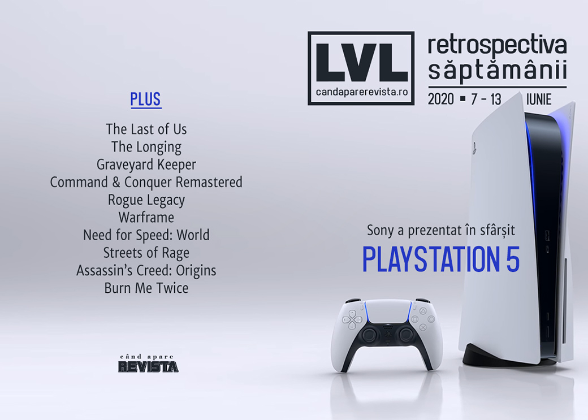

O săptămână doldora de prezentări de jocuri ce a culminat cu dezvăluirea viitoarei console PlayStation 5. Tensiunile rasiale din SUA încă reverberează și în industria jocurilor, un director de la Riot Games fiind nevoit să își dea demisia din cauza unei postări pe Facebook, iar bundle-ul caritabil vândut de itch.io a strâns peste 6 milioane de dolari.

Linkuri rapide:

* [Știri](#știri)
* [Articole (critică, dev, design)](#articole-critică-dev-design)
* [Anunțuri şi lansări de jocuri](#anunţuri-şi-lansări-de-jocuri)
* [Prăvălii de jocuri](#prăvălii-de-jocuri)

## Știri

* Săptămâna a plină de prezentări de jocuri, precum  IGN Expo, The Escapist Showcase, Guerrilla Collective, PC Gaming Show, Future Games Show, dar principalul punct de atracție a fost prezentarea organizată de Sony pentru a dezvălui viitoarea consolă PlayStation 5, precum și numeroase jocuri care vor fi disponibile pe consolă la lansare. Găsiți lista și sumarul prezentărilor în [articolul nostru]() dedicat evenimentelor din această vară.

  * prezentarea consolei PlayStation 5 ([AllGamers](https://ag.hyperxgaming.com/article/10324/sony-reveals-the-playstation-5-console), [VideoGamesChronicle](https://www.videogameschronicle.com/news/sony-unveils-the-ps5-design-and-confirms-second-digital-console/), [Polygon](https://www.polygon.com/21184250/ps5-design-reveal-details-launch-date-playstation-sony-event), [Destructoid](https://www.destructoid.com/stories/this-is-your-first-look-at-the-playstation-5-593960.phtml), [Escapist](https://www.escapistmagazine.com/v2/playstation-5-hardware-design-revealed-by-sony/))
  * sumarul jocurilor disponibile pe PlayStation 5 la lansare [Polygon](https://www.polygon.com/2020/6/11/21284460/ps5-top-news-announcements-game-trailers-reveals-sony-event-playstation), [Kotaku](https://kotaku.com/everything-sony-announced-in-todays-ps5-event-1844000486), [Destructoid](https://www.destructoid.com/stories/here-s-everything-that-happened-at-the-ps5-future-of-gaming-event-including-a-look-at-the-actual-ps5--593967.phtml)

* Episodul pilot al serialului The Last of Us va fi regizat de Johan Renck, regizorul mini-seriei Chernobyl. ([VideoGamesChronicle](https://www.videogameschronicle.com/news/chernobyl-director-will-helm-the-last-of-us-tv-series-pilot/), [Games Informer](https://www.gameinformer.com/2020/06/08/chernobyl-director-joins-the-last-of-us-hbo-roster), [AllGamers](https://ag.hyperxgaming.com/article/10280/the-last-of-us-tv-show-lands-a-director), [Escapist](https://www.escapistmagazine.com/v2/the-last-of-us-hbo-seriess-first-episode-to-be-helmed-by-chernobyl-director/))

* Pachetul itch.io ce cuprinde peste 1600 de jocuri și alte resurse, denumit „The Bundle for Racial Justice and Equality”, a depășit 6 milioane de dolari în vânzări, sumă ce va fi donată unor organizații non-guvernamentale. ([Polygon](https://www.polygon.com/2020/6/11/21287738/itchio-bundle-for-racial-justice-equality-black-lives-matter-charity), [Destructoid](https://www.destructoid.com/stories/itch-io-bundle-for-racial-justice-and-equality-passes-6-million-in-donations-594192.phtml), [RPS](https://www.rockpapershotgun.com/2020/06/12/itchs-bundle-for-racial-justice-and-equality-hit-5m-and-is-still-adding-games-like-pyre/), [The Verge](https://www.theverge.com/2020/6/11/21287909/itch-io-bundle-for-racial-justice-equality-five-million-dollar-goal-hit))

* Un director de la Riot Games și-a dat demisia în urma reacțiilor negative pe care le-a generat o postare de-a sa pe Facebook în care punea moartea lui George Floyd pe seama stilului său de viață. ([Vice](https://www.vice.com/en_us/article/7kp89e/riot-games-investigating-exec-who-blamed-george-floyds-murder-on-his-lifestyle), [Shacknews](https://www.shacknews.com/article/118614/exec-ron-johnson-no-longer-with-riot-games-following-comments-about-george-floyd), [PC Gamer](https://www.pcgamer.com/riot-games-executive-under-internal-investigation-for-george-floyd-comments/), [RPS](https://www.rockpapershotgun.com/2020/06/11/riot-games-suspended-an-executive-over-his-abhorrent-facebook-post-about-george-floyd/), [Kotaku](https://kotaku.com/riot-games-executive-says-george-floyd-was-murdered-by-1843987857), [Kotaku](https://kotaku.com/riot-games-executive-resigns-following-abhorrent-geor-1844007429))

## Articole (critică, dev, design)

* [Redefining the Race](https://unwinnable.com/2020/06/09/redefining-the-race/) (Unwinnable)
* [Legacy of Brutality](https://unwinnable.com/2020/06/12/legacy-of-brutality-2/) (Unwinnable)
* [The Art of the Blindfolded Speedrun](https://uppercutcrit.com/the-art-of-the-blindfolded-speedrun/) (Uppercut)
* [Are video games the future of live music?](https://www.gamesindustry.biz/articles/2020-06-10-are-video-games-the-future-of-live-music) (GamesIndustry.biz)

---

### Actualitate
* [2020’s best gaming deal outshines BLM efforts by bigger companies](https://www.polygon.com/2020/6/9/21285134/itchio-bundle-1000-games-5-dollars-best-gaming-deal-pc-black-lives-matter) (Polygon)

#### PlayStation 5
* [The PS5 reveal made the DualSense even more impressive](https://ag.hyperxgaming.com/article/10328/the-ps5-reveal-made-the-dualsense-even-more-impressive) (AllGamers)
* [PlayStation 5 has reclaimed Sony&#8217;s wonderful weirdness](https://www.videogameschronicle.com/features/playstation-5-has-reclaimed-sonys-wonderful-weirdness/) (VideoGamesChronicle)
* [PlayStation 5's reveal was all about continuity](https://www.gamesindustry.biz/articles/2020-06-12-playstation-5s-reveal-was-all-about-continuity-opinion) (GamesIndustry.biz)
* [New, Original Games Were the Real Stars of the PlayStation 5 Reveal](https://www.usgamer.net/articles/ps5-reveal-new-original-games-stray-returnal) (USgamer)

---

### _Not-a-review_
* [The real beauty of secrets in games like The Longing is to share them](https://www.rockpapershotgun.com/2020/06/10/the-real-beauty-of-secrets-in-games-like-the-longing-is-to-share-them/) (RPS)
* [Every remastered game should have an upgrade sequence like Command &#038; Conquer Remastered Collection](https://www.rockpapershotgun.com/2020/06/09/every-remastered-game-should-have-an-upgrade-sequence-like-command-conquer-remastered-collection/) (RPS)
* [Gerry from Graveyard Keeper](https://unwinnable.com/2020/06/08/gerry-from-graveyard-keeper/) (Unwinnable)

---

### Industrie
* [Timelie creator on making games in Thailand, sacrifices and victories, and things you can do with time](https://gameworldobserver.com/2020/06/08/timelie/) (Game World Observer)
* [How the pandemic has transformed work in the game industry](https://venturebeat.com/2020/06/12/how-the-pandemic-has-transformed-work-in-the-game-industry/) (VentureBeat)

---

### Istorie, retrospectivă
* [Road to PS5: The story of PS2, Sony&#8217;s crowning achievement](https://www.videogameschronicle.com/features/road-to-ps5-the-story-of-ps2-sonys-crowning-achievement/) (VideoGamesChronicle)
* [Rogue Legacy is still the most approachable roguelite of them all](https://www.rockpapershotgun.com/2020/06/08/rogue-legacy-is-still-the-most-approachable-roguelite-of-them-all/) (RPS)
* [Catan at 25: Checking in on a Once-Revolutionary Board Game](https://www.vice.com/en_us/article/7kp8ve/catan-25-anniversary) (Vice)

---

### Dev, making of, mecanici
* [What it's like running one of the world's biggest multiplayer games during quarantine](https://www.pcgamer.com/what-its-like-running-one-of-the-worlds-biggest-multiplayer-games-during-quarantine/) (PC Gamer)
* [How players resurrected the Need for Speed MMO you didn't even know existed](https://www.pcgamer.com/how-players-resurrected-the-need-for-speed-mmo-you-didnt-even-know-existed/) (PC Gamer)
* [The Tapestry of RTS Design: Upgrades and Research](https://waywardstrategy.com/2020/06/08/the-tapestry-of-rts-design-upgrades-and-research/) (Wayward Strategy)
* [What is Responsive Narrative?](https://www.gamasutra.com/blogs/SamLuckhardt/20200608/363442/What_is_Responsive_Narrative.php) (Gamasutra)

---

### Design, world-building, artă
* [How esports photographers are using in-game capture in place of live events](https://www.rockpapershotgun.com/2020/06/09/how-esports-photographers-are-using-in-game-capture-in-place-of-live-events/) (RPS)
* [The Enduring Musical Legacy of “Streets of Rage”](https://daily.bandcamp.com/features/streets-of-rage-soundtrack-interview) (Bandcamp Daily)
* [Architecture of the Pharaohs](https://unwinnable.com/2020/06/10/architecture-of-the-pharaohs/) (Unwinnable)

## Anunţuri şi lansări de jocuri
* [New Need for Speed game in development at Criterion Games](https://www.shacknews.com/article/118486/new-need-for-speed-game-in-development-at-criterion-games) (Shacknews)

### Anunţate
* **Alex Kidd in Miracle World DX** ([PC Gamer](https://www.pcgamer.com/80s-sega-platformer-alex-kidd-is-making-a-comeback-with-miracle-world-dx/))
* **Paper Beast VR** vine și pe PC ([RPS](https://www.rockpapershotgun.com/2020/06/08/vr-adventure-paper-beast-is-coming-to-pc-and-the-steam-game-festival/))
* **Re:Turn – One Way Trip** ([PC Gamer](https://www.pcgamer.com/return-one-way-trip-trailer-showcases-a-bizarre-2d-horror-adventure/))
* **Medic: Pacific Corpsman** ([PC Gamer](https://www.pcgamer.com/medic-pacific-corpsman-will-put-you-in-the-boots-of-a-world-war-2-medic/))
* **Voidtrain** ([PC Gamer](https://www.pcgamer.com/voidtrain-is-an-interdimensional-survival-game-thats-literally-on-rails/))
* **Foreclosed** ([PC Gamer](https://www.pcgamer.com/foreclosed-is-a-third-person-cyberpunk-shooter-with-a-graphic-novel-style/))
* **Lucifer Within Us** ([PC Gamer](https://www.pcgamer.com/solve-murders-as-a-supernatural-detective-in-lucifer-within-us/))
* **Nongunz: Doppleganger Edition** ([Hardcore Gamer](https://hardcoregamer.com/2020/06/09/nongunz-to-live-again-with-doppleganger-edition/379737/))
* **Metal: Hellsinger** ([AllGamers](https://ag.hyperxgaming.com/article/10308/metal-hellsinger-feels-like-doom-and-devil-may-crys-demonic-baby))
* **GONNER2** ([RPS](https://www.rockpapershotgun.com/2020/06/13/gonner2-announced/))
* **Cardaclysm** ([PC Gamer](https://www.pcgamer.com/cardaclysm-is-a-card-battler-set-in-a-pretty-3d-world/))
* **Almighty: Kill Your Gods** ([PC Gamer](https://www.pcgamer.com/almighty-kill-your-gods-is-a-game-about-punching-deities-in-the-face-with-magic-gloves/))
* **Dustborn** ([Escapist](https://www.escapistmagazine.com/v2/dustborn-is-a-post-american-road-trip-where-words-can-literally-hurt-you/))
* **Lake** ([PC Gamer](https://www.pcgamer.com/lake-is-a-chill-free-roaming-driving-sim-about-being-a-postal-worker-in-1980s-oregon/))
* **Space Crew** ([Eurogamer](https://www.eurogamer.net/articles/2020-06-13-bomber-crew-gets-sequel-space-crew-later-this-year))
* **Serial Cleaners** ([Escapist](https://www.escapistmagazine.com/v2/serial-cleaners-draw-distance/))
* **Gloomwood** ([Destructoid](https://www.destructoid.com/stories/gloomwood-s-stealth-n-slash-action-invokes-90s-classic-thief-594247.phtml))
* **No Place for Bravery** ([PC Gamer](https://www.pcgamer.com/no-place-for-bravery-is-a-grim-tale-of-an-old-warrior-questing-to-save-his-family/))
* **Just Die Already** ([PC Gamer](https://www.pcgamer.com/just-die-already-is-a-mayhem-stunt-sandbox-filled-with-fragile-old-people/))

#### Anunțate la prezentarea PlayStation 5
* **Spider-Man Miles Morales**([VideoGamesChronicle](https://www.videogameschronicle.com/news/insomniac-announces-spider-man-follow-up-for-ps5-launch-window/))
* **Gran Turismo 7** ([AllGamers](https://ag.hyperxgaming.com/article/10310/gran-turismo-7-has-been-officially-revealed-as-coming-to-playstation-5), [VideoGamesChronicle](https://www.videogameschronicle.com/news/polyphony-digital-has-announced-gran-turismo-7-for-ps5/))
* **Project Athia** ([AllGamers](https://ag.hyperxgaming.com/article/10311/project-athia-from-square-enix-is-a-ps5-exclusive-fantasy-rpg))
* **Sackboy: A Big Adventure** ([AllGamers](https://ag.hyperxgaming.com/article/10313/sackboy-a-big-adventure-brings-floppy-platforming-to-ps5))
* **Ratchet & Clank: Rift Apart** ([Shacknews](https://www.shacknews.com/article/118577/ratchet-clank-rift-apart-announced-for-ps5))
* **Returnal** ([AllGamers](https://ag.hyperxgaming.com/article/10314/returnal-is-a-freaky-new-sci-fi-action-horror-shooter))
* **Kena: Bridge of Spirits**([Destructoid](https://www.destructoid.com/stories/kena-bridge-of-spirits-is-a-gorgeous-ps5-action-adventure-game-593935.phtml))
* **Hitman 3** ([AllGamers](https://ag.hyperxgaming.com/article/10316/hitman-3-sneaking-onto-ps5-in-january-2021))
* **Demon's Souls Remake** ([VideoGamesChronicle](https://www.videogameschronicle.com/news/demons-souls-is-officially-being-remade-for-ps5/))
* **Resident Evil 8: Village** ([VideoGamesChronicle](https://www.videogameschronicle.com/news/capcom-has-officially-announced-resident-evil-8-village/))
* **Pragmata** ([VideoGamesChronicle](https://www.videogameschronicle.com/news/capcom-announces-pragmata-its-first-original-franchise-in-8-years/))
* **Jett: The Far Shore** ([Shacknews](https://www.shacknews.com/article/118589/jett-the-far-shore-unveiled-for-ps5-coming-holiday-2020))
* **Stray** ([PC Gamer](https://www.pcgamer.com/stray-is-a-stunning-game-about-a-cat-in-a-world-full-of-robots/))
* **Horizon: Forbidden West** ([Polygon](https://www.polygon.com/2020/6/11/21284436/horizon-forbidden-west-ps5-playstation-5-trailer))
* **Solar Ash** ([Destructoid](https://www.destructoid.com/stories/annapurna-s-solar-ash-looks-suitably-beautiful-and-eccentric-593941.phtml))
* **Astro's Playroom** ([Shacknews](https://www.shacknews.com/article/118596/astro-bot-spinoff-astros-playroom-confirmed-for-ps5))
* **Goodbye Volcano High** ([Shacknews](https://www.shacknews.com/article/118584/goodbye-volcano-high-revealed-for-ps5-releasing-in-2021))
* **Destruction AllStars** ([Shacknews](https://www.shacknews.com/article/118583/destruction-allstars-revealed-during-ps5-livestream))
* **Bugsnax** ([Destructoid](https://www.destructoid.com/stories/the-octodad-studio-s-googly-eyed-strawberry-game-possibly-won-the-ps5-stream-593947.phtml))
* **Little Devil Inside** ([Shacknews](https://www.shacknews.com/article/118592/little-devil-inside-revealed-for-ps5), [RPS](https://www.rockpapershotgun.com/2020/06/11/what-is-little-devil-inside-and-why-do-you-already-love-it/))
* **NBA 2K21** ([Shacknews](https://www.shacknews.com/article/118591/nba-2k21-picks-up-its-ball-on-ps5-coming-this-fall))

#### Anunțate la PC Gaming Show
* **Icarus** ([Shacknews](https://www.shacknews.com/article/118637/icarus-revealed-by-dayz-creator-at-pc-gaming-show))
* **Carto** ([Destructoid](https://www.destructoid.com/stories/carto-is-a-chill-ass-puzzle-exploration-game-that-will-flip-your-world-upside-down-594221.phtml))
* **Blankos Block Party** ([Destructoid](https://www.destructoid.com/stories/blankos-looks-like-a-better-roblox-594222.phtml))
* **Potionomics** ([Destructoid](https://www.destructoid.com/stories/in-potionomics-you-get-to-sell-potions-for-other-adventurers-to-use-on-their-quests-594228.phtml))
* **Cartel Tycoon** ([Destructoid](https://www.destructoid.com/stories/live-out-your-gus-fring-fantasies-of-transporting-drugs-in-a-chicken-truck-with-cartel-tycoon-593693.phtml))
* **In Sound Mind** ([Shacknews](https://www.shacknews.com/article/118636/first-person-horror-in-sound-mind-revealed-on-pc-gaming-show-2020))
* **Fae Tactics** vine și pe PC ([Shacknews](https://www.shacknews.com/article/118640/turn-based-strategy-fae-tactics-announced-for-pc-this-summer-2020))
* **Surgeon Simulator 2** ([Destructoid](https://www.destructoid.com/stories/malpractice-power-fantasy-surgeon-simulator-2-coming-this-august-to-epic-games-store-594242.phtml))

### Acum cu dată de lansare
* **West of Dead**: 18 iunie ([PC Gamer](https://www.pcgamer.com/west-of-dead-the-supernatural-wild-west-shooter-starring-ron-perlman-is-out-on-june-18/))
* **Neon Abyss**: 14 iulie ([GameSpace](https://www.gamespace.com/all-articles/news/team-17-announces-neon-abyss-release-date/))
* **Röki**: 23 iulie ([Eurogamer](https://www.eurogamer.net/articles/2020-06-13-beautiful-scandinavian-folklore-inspired-adventure-roki-gets-a-july-release-date))
* **XIII Remake**: 10 noiembrie ([PC Gamer](https://www.pcgamer.com/xiii-remakes-release-date-has-been-leaked-by-amazon/))
* **Cris Tales**: 17 noiembrie ([DSOGaming](https://www.dsogaming.com/news/time-altering-rpg-cris-tales-pc-november-17/))
* **Remothered: Broken Porcelain**: 25 august ([PC Gamer](https://www.pcgamer.com/horror-sequel-remothered-broken-porcelain-will-haunt-our-desktops-in-august/))

### Lansate
* 9 iunie: **1971 Project Helios** ([Steam](https://store.steampowered.com/app/1186630/1971_PROJECT_HELIOS/), [gog.com](https://www.gog.com/game/1971_project_helios))
* 11 iunie: **Journey** ajunge și pe Steam ([Steam](https://store.steampowered.com/app/638230/Journey/))
* 11 iunie: **Skyhill: Black Mist** ([Steam](https://store.steampowered.com/app/990360/SKYHILL_Black_Mist/))
* 11 iunie: **Main Assembly** (early access) ([Steam](https://store.steampowered.com/app/1078920/Main_Assembly/))
* 11 iunie: **Beyond Blue** ([Steam](https://store.steampowered.com/app/883360/Beyond_Blue/))
* 13 iunie: **Torchlight III** (early access)  ([Steam](https://store.steampowered.com/app/1030210/Torchlight_III/))
* 13 iunie: **Persona 4 Golden** ([Steam](https://store.steampowered.com/app/1113000/Persona_4_Golden/))
* 13 iunie: **Among Trees** ([Epic Store](https://www.epicgames.com/store/en-US/product/among-trees))

## Prăvălii de jocuri
### Update catalog
* [Battlefield 5, Star Wars Battlefront, and more are now on Steam, and on sale](https://www.pcgamer.com/battlefield-5-star-wars-battlefront-and-more-are-now-on-steam-and-on-sale/) (PC Gamer)
* [Battletech, Bard's Tale, Battlefleet and more come to Games Pass for PC this month](https://www.pcgamer.com/battletech-bards-tale-battlefleet-and-more-come-to-games-pass-for-pc-this-month/) (PC Gamer)

### Jocuri gratis și free weekends
* [Rainbow Six Siege free-to-play weekend now live](https://www.destructoid.com/stories/rainbow-six-siege-free-to-play-weekend-now-live-593856.phtml) (Destructoid)
* [Put off Snake Pass all these years? It's free on Humble right now](https://www.destructoid.com/stories/put-off-snake-pass-all-these-years-it-s-free-on-humble-right-now-593902.phtml) (Destructoid)
* [Ark: Survival Evolved and Samurai Shodown NeoGeo Collection are free on the Epic Games Store](https://www.videogameschronicle.com/news/ark-survival-evolved-and-samurai-shodown-neogeo-collection-are-free-on-the-epic-games-store/) (VideoGamesChronicle)
* [Kao the Kangaroo is bouncing back, baby](https://www.destructoid.com/stories/kao-the-kangaroo-is-bouncing-back-baby-593630.phtml) (Destructoid)
* [Burn Me Twice Is a (Free) Magical Murder Mystery](https://www.escapistmagazine.com/v2/burn-me-twice-is-a-free-magical-murder-mystery/) (Escapist)

### Reduceri și promoții
* [Weekend Console Download Deals for June 12: Nintendo eShop Summer Sale](https://www.shacknews.com/article/118623/weekend-console-download-deals-for-june-12-nintendo-eshop-summer-sale) (Shacknews)
* [Weekend PC Download Deals for June 12: Hitman Absolution is free on GOG.com](https://www.shacknews.com/article/118624/weekend-pc-download-deals-for-june-12-hitman-absolution-is-free-on-gogcom) (Shacknews)
* [Summer of Pride 2020 Steam Sale features big deals on queer-positive games](https://www.pcgamer.com/summer-of-pride-2020-steam-sale-features-big-deals-on-queer-positive-games/) (PC Gamer)
* [The new Humble Bundle features F1 2019, Dirt Rally 2.0, and an Operation Flashpoint game](https://www.pcgamer.com/the-new-humble-bundle-features-f1-2019-dirt-rally-20-and-an-operation-flashpoint-game/) (PC Gamer)
* [Best PC gaming deals of the week &#8211; 12th June 2020](https://www.rockpapershotgun.com/2020/06/12/best-pc-gaming-deals-of-the-week-12th-june-2020/) (RPS)

---

{}
**Retrospectiva săptămânii** este rubrica duminicală în care trecem în revistă evenimentele săptămânii de pe frontul de gaming: știri şi articole (scrise de alții, bineînțeles, că e mai ușor aşa), industrie, lansări, oferte de jocuri, toate numai de savurat la cafeaua de duminică dimineața.

De asemenea, rubrica e deschisă oricui vrea și poate contribui. Dacă ai citit vreun articol sau vreo știre interesantă și crezi că merită incluse în retrospectiva săptămânii, te așteptăm pe forum pe unul dintre topicurile dedicate: [Știri](https://forum.candaparerevista.ro/viewtopic.php?f=4&t=46), [Articole](https://forum.candaparerevista.ro/viewtopic.php?f=4&t=206), [Gaming România](https://forum.candaparerevista.ro/viewtopic.php?f=4&t=1622)].
{}
