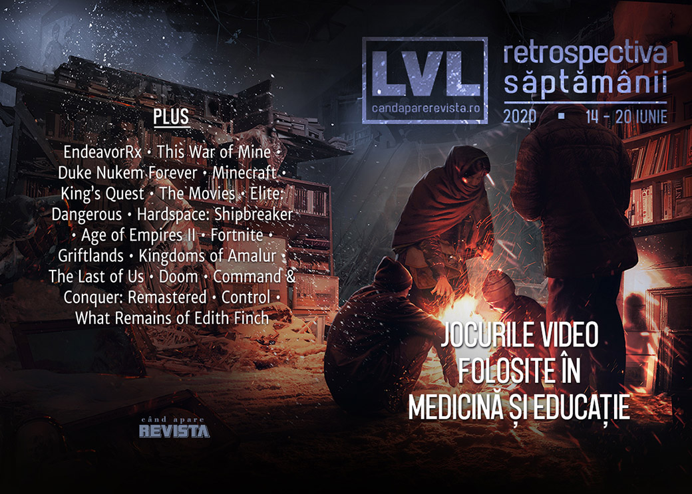

Încă o săptămână plină de prezentări de jocuri (din nou, găsiți lista și sumarul evenimentelor în [articolul nostru special](), dar avem și alte noutăți: un joc video folosit în scop terapeutic în SUA, alt joc video introdus în programa școlară pentru subiectul abordat, itch.io a strâns 8 milioane de dolari în scopuri caritabile, iar Epic Games valorează 17 miliarde de dolari. În plus, EA a anunțat un nou joc Star Wars axat pe luptele spațiale, mai multe jocuri ies din exclusivitate și ajung și pe Steam — **Outer Wilds**, ahem! — și s-a lansat în sfârșit **Desperados III**.

Linkuri rapide:

* [Știri](#știri)
* [Articole (critică, dev, design)](#articole-critică-dev-design)
* [Anunțuri şi lansări de jocuri](#anunţuri-şi-lansări-de-jocuri)
* [Prăvălii de jocuri](#prăvălii-de-jocuri)

## Știri

* În SUA, un joc video a fost autorizat pentru prima dată pentru uz medicinal. Este vorba de jocul **EndeavorRx** ce va fi folosit pentru tratarea copiilor cu ADHD. ([The Verge](https://www.theverge.com/2020/6/15/21292267/fda-adhd-video-game-prescription-endeavor-rx-akl-t01-project-evo), [GameSpace](https://www.gamespace.com/all-articles/news/endeavorrx-approved-as-a-medical-treatment-for-adhd), [Eurogamer](https://www.eurogamer.net/articles/2020-06-16-this-video-game-can-now-be-prescribed-as-medicine-in-the-us), [Kotaku](https://kotaku.com/new-game-for-treatment-of-adhd-requires-a-prescription-1844046557))
* Jocul **This War of Mine** a fost inclus în programa școlară a liceelor din Polonia ca „lectură” recomandată, dar numai pentru elevii cu vârstă de peste 18 ani din cauza ratingului 18+ al jocului.  ([GamesIndustry.biz](https://www.gamesindustry.biz/articles/2020-06-18-this-war-of-mine-will-be-added-to-polish-schools-reading-list), [Eurogamer](https://www.eurogamer.net/articles/2020-06-18-in-poland-this-war-of-mine-will-join-school-reading-lists), [Kotaku](https://kotaku.com/this-war-of-mine-added-to-polands-high-school-reading-l-1844086680), [PC Gamer](https://www.pcgamer.com/this-war-of-mine-will-be-added-to-polish-high-school-reading-lists/))
* Bundle-ul itch.io „The Bundle for Racial Justice and Equality” a strâns până la final suma de 8,1 milioane de dolari pentru scopuri caritabile. ([Eurogamer](https://www.eurogamer.net/articles/2020-06-16-itch-io-bundle-for-racial-justice-and-equality-ends-with-a-stunning-usd8-1m-raised), [AllGamers](https://ag.hyperxgaming.com/article/10344/itchio-bundle-for-racial-justice-and-equality-raises-over-8m), [Destructoid](https://www.destructoid.com/stories/itch-io-s-bundle-for-racial-justice-and-equality-raised-an-amazing-8-1-million-594455.phtml))
* Epic Games are o valoare de piață de 17 miliarde de dolari, conform unei evaluări făcute în cadrul ultimei runde de finanțare. ([Bloomberg](https://www.bloomberg.com/news/articles/2020-06-15/fortnite-maker-epic-is-said-to-near-funding-at-17-billion-value), [GamesIndustry.biz](https://www.gamesindustry.biz/articles/2020-06-16-epic-reportedly-worth-usd17-billion-in-new-funding-round))
* Gearbox dă în judecată din nou pe 3D Realms din cauza contractului pentru Duke Nukem Forever. ([Kotaku](https://kotaku.com/duke-nukem-isn-t-worth-fighting-yet-another-lawsuit-ove-1844043358), [Eurogamer](https://www.eurogamer.net/articles/2020-06-16-the-sorry-duke-nukem-saga-continues-as-gearbox-sues-3d-realms-again), [PC Gamer](https://www.pcgamer.com/gearbox-sues-3d-realms-over-duke-nukem-again/), [GamesIndustry.biz](https://www.gamesindustry.biz/articles/2020-06-15-gearbox-sues-apogee-software-for-breach-of-duke-nukem-acquisition-contract))
* Minecraft și King’s Quest au fost incluse în World Video Game Hall of Fame. ([PC Gamer](https://www.pcgamer.com/minecraft-inducted-into-the-world-video-game-hall-of-fame/), [VentureBeat](https://venturebeat.com/2020/06/18/video-game-hall-of-fame-inducts-bejeweled-centipede-kings-quest-and-minecraft/), [Gamasutra](https://www.gamasutra.com/view/news/365131/Minecraft_Kings_Quest_and_more_join_the_World_Video_Game_Hall_of_Fame.php))

## Articole (critică, dev, design)

* [How parents are helping gaming’s biggest stars navigate their careers](https://www.theverge.com/21293048/esports-parents-gaming-fortnite-league-of-legends-mrsavage-h1ghsky1-solo-tactical) (The Verge)
* [Abandonware: Preserving the Now for Tomorrow](https://uppercutcrit.com/abandonware-preserving-the-now-for-tomorrow/) (Uppercut)
* [Top composers used to head to Hollywood. Now they’re into games](https://www.wired.co.uk/article/video-game-composers) (Wired)

---

### Actualitate
* [The DeanBeat: Why can&#8217;t EA do more games with its big budget?](https://venturebeat.com/2020/06/19/the-deanbeat-why-cant-ea-do-more-with-its-big-budget/) (VentureBeat)

---

### _Not-a-review_
* [I'm really into probing planets in Elite Dangerous](https://www.pcgamer.com/im-really-into-probing-planets-in-elite-dangerous/) (PC Gamer)
* [Hardspace: Shipbreaker is relaxing until an explosion propels a hunk of nanocarbon into your face](https://www.pcgamer.com/hardspace-shipbreaker-is-relaxing-until-an-explosion-propels-a-hunk-of-nanocarbon-into-your-face/) (PC Gamer)
* [The Fans Who Kept Age of Empires 2 Alive](https://uppercutcrit.com/the-fans-who-kept-age-of-empires-2-alive) (Uppercut)
* [Fortnite is a masterclass in flexibility](https://www.gamesindustry.biz/articles/2020-06-19-fortnite-is-a-masterclass-in-flexibility-opinion) (GamesIndustry.biz)

---

### Industrie
* [Pac-Man&#039;s Creator On The Legacy, Pizza, And The Future](https://www.gameinformer.com/classic/2020/06/19/pac-mans-creator-on-the-legacy-pizza-and-the-future) (Games Informer)
* [Rest In Peace E3, Long Live “Not-E3”](http://fingerguns.net/features/2020/06/19/op-ed-rest-in-peace-e3-long-live-not-e3/) (Finger Guns)
* [Feat of Klei: How Griftlands Exemplifies a Nurturing Approach to Game Development](https://uppercutcrit.com/feat-of-klei-how-griftlands-exemplifies-a-nurturing-approach-to-game-development) (Uppercut)
* [How indie studio Double Stallion partnered with Riot to make a League of Legends game](https://venturebeat.com/2020/06/20/how-indie-studio-double-stallion-partnered-with-riot-to-make-league-of-legends-game/) (VentureBeat)
* [PlayStation 5 and the strange joy of hardware](https://www.videogamer.com/features/playstation-5-and-the-strange-joy-of-hardware) (VideoGamer)
* [Grand Theft Auto Online is a killer app for PlayStation 5](https://www.gamesindustry.biz/articles/2020-06-16-grand-theft-auto-online-is-a-killer-app-for-playstation-5-opinion) (GamesIndustry.biz)

---

### Istorie, retrospectivă
* [Kingdoms Of Amalur: Reckoning, the MMO for misanthropes, barely needs updating at all](https://www.rockpapershotgun.com/2020/06/15/kingdoms-of-amalur-reckoning-the-mmo-for-misanthropes-barely-needs-updating-at-all/) (RPS)
* [The very specific horror of old graphics card packaging art](https://www.pcgamer.com/the-very-specific-horror-of-old-graphics-card-packaging-art/) (PC Gamer)
* [How a videogame ad posing as a computer virus scarred me for life](https://www.pcgamer.com/how-a-videogame-ad-posing-as-a-computer-virus-scarred-me-for-life/) (PC Gamer)
* [Member The Last of Us?](https://hardcoregamer.com/2020/06/16/member-the-last-of-us/379598/) (Hardcore Gamer)
* [The Shareware Scene, Part 5: Narratives of DOOM](https://www.filfre.net/2020/06/the-shareware-scene-part-5-narratives-of-doom/) (The Digital Antiquarian)

---

### Dev, making of, mecanici
* [How EA remastered Command &amp; Conquer’s FMV cutscenes](https://www.polygon.com/interviews/2020/6/18/21294972/command-conquer-remastered-fmv-cutscenes) (Polygon)
* [Checking the Score: Command &amp; Conquer&#039;s Remastered OST Doesn&#039;t Compromise Identity](https://hardcoregamer.com/2020/06/19/checking-the-score-command-conquers-remastered-ost-doesnt-compromise-identity/381005/) (Hardcore Gamer)
* [Command &amp; Conquer Remastered Collection technical review -- Glittering tiberium](https://www.pcinvasion.com/command-conquer-remastered-collection-tech-review/) (PC Invasion)
* [The Last of Us Part 2 tech review: a Naughty Dog masterclass](https://www.eurogamer.net/articles/digitalfoundry-2020-the-last-of-us-part-2-tech-review) (Eurogamer)
* [The Last Days of Control](https://www.gamasutra.com/blogs/SebastianLong/20200618/363138/The_Last_Days_of_Control.php) (Gamasutra)

---

### Design, world-building, artă
* [Video: The distributed art direction of  What Remains of Edith Finch](https://www.gamasutra.com/view/news/364986/Video_The_distributed_art_direction_of_What_Remains_of_Edith_Finch.php) (Gamasutra)

## Anunţuri şi lansări de jocuri
### Anunţate
* **Operation: Harsh Doorstop** și **Warfare 1944**, două shootere publicate de MicroProse ([Eurogamer](https://www.eurogamer.net/articles/2020-06-16-microprose-is-back-and-its-publishing-first-person-shooters))
* **Rogue Lords** ([Eurogamer](https://www.eurogamer.net/articles/2020-06-15-rogue-lords-looks-like-slay-the-spire-meets-a-tim-burton-movie))
* **Morbid: The Seven Acolytes** ([Eurogamer](https://www.eurogamer.net/articles/2020-06-14-new-gothic-action-rpg-morbid-the-seven-acolytes-looks-bloody-brilliant))
* **Game of Thrones: The Board Game** ([Kotaku](https://kotaku.com/the-excellent-game-of-thrones-board-game-is-coming-to-p-1844073096))
* **Werewolf: The Apocalypse – Heart Of The Forest** ([RPS](https://www.rockpapershotgun.com/2020/06/14/ex-witcher-devs-announce-werewolf-the-apocalypse-heart-of-the-forest/))
* **Source Of Madness** ([RPS](https://www.rockpapershotgun.com/2020/06/14/source-of-madness-uses-machine-learning-to-generate-eldritch-horrors/))
* **Icarus** ([PC Gamer](https://www.pcgamer.com/icarus-is-a-sci-fi-co-op-survival-game-from-dayz-creator-dean-hall/))

#### Anunțate la EA Play
* **Star Wars: Squadrons** ([Kotaku](https://kotaku.com/eas-star-wars-squadrons-will-finally-give-us-a-new-star-1844037961))
* **FIFA 21** ([RPS](https://www.rockpapershotgun.com/2020/06/19/ea-announce-fifa-21-via-chilling-transhuman-hivemind/))
* **Lost In Random** ([VideoGamesChronicle](https://www.videogameschronicle.com/news/brothers-director-says-new-game-it-takes-two-will-blow-your-fing-mind/))
* **Skate** ([Kotaku](https://kotaku.com/ea-has-finally-announced-a-new-skate-game-1844087679))
* **It Takes Two** ([Escapist](https://www.escapistmagazine.com/v2/it-takes-two-is-a-co-op-platformer-from-the-studio-behind-a-way-out/))

### Acum cu dată de lansare
* **Crayta**: 1 iulie ([Eurogamer](https://www.eurogamer.net/articles/2020-06-19-google-stadia-timed-exclusive-crayta-out-in-july))
* **Liberated**: 8 iulie ([EGM](https://egmnow.com/liberated-coming-to-pc-next-month/))
* **Othercide**: 28 iulie ([Shacknews](https://www.shacknews.com/article/118708/othercide-will-take-xcom-tactical-strategy-in-a-horror-direction-in-july-2020))
* **Dirt 5**: 9 octombrie ([Eurogamer](https://www.eurogamer.net/articles/2020-06-18-dirt-5-current-gen-out-october-2020-next-gen-to-follow))
* **Cris Tales**: 17 noiembrie ([GameSpace](https://www.gamespace.com/all-articles/news/cris-tales-gets-release-date-new-demo-and-a-trailer))

### Amânate
* **Cyberpunk 2077**: 19 noiembrie în loc de 17 septembrie [Ars Technica](https://arstechnica.com/gaming/2020/06/cyberpunk-2077-release-pushed-back-to-september-17-2020/)

### Lansate
* 14 iunie: **Griftlands** (early access) ([Steam](https://store.steampowered.com/app/601840/Griftlands/))
* 16 iunie: **Desperados III** ([Steam](https://store.steampowered.com/app/610370/Desperados_III/), [gog.com](https://www.gog.com/game/desperados_iii))
* 16 iunie: **Hardspace: Shipbreaker** ([Steam](https://store.steampowered.com/app/1161580/Hardspace_Shipbreaker/))
* 16 iunie: **Colt Canyon** ([Steam](https://store.steampowered.com/app/940710/Colt_Canyon/), [gog.com](https://www.gog.com/game/colt_canyon))
* 16 iunie: **Disintegration** ([Steam](https://store.steampowered.com/app/536280/Disintegration/))
* 16 iunie: **Summer in Mara** ([gog.com](https://www.gog.com/game/summer_in_mara), [gog.com](https://www.gog.com/game/summer_in_mara))
* 17 iunie: **Curious Expedition 2** (early access) ([Steam](https://store.steampowered.com/app/1040230/Curious_Expedition_2/))
* 18 iunie: **West of Dead** ([Steam](https://store.steampowered.com/app/1016790/West_of_Dead/), [gog.com](https://www.gog.com/game/west_of_dead))
* 18 iunie: **Outer Wilds** (vine și pe Steam după exclusivitate Epic) ([Steam](https://store.steampowered.com/app/753640/Outer_Wilds/))
* 18 iunie: **P.A.M.E.L.A.** ([Steam](https://store.steampowered.com/app/427880/PAMELA/), [gog.com](https://www.gog.com/game/pamelar))
* 18 iunie: **Waking** ([Steam](https://store.steampowered.com/app/1068600/Waking/), [gog.com](https://www.gog.com/game/waking))
* 18 iunie: **Detroit: Become Human** (vine și pe Steam după exclusivitate Epic) ([Steam](https://store.steampowered.com/app/1222140/Detroit_Become_Human/))
* 18 iunie: **Heavy Rain** (vine și pe Steam după exclusivitate Epic) ([Steam](https://store.steampowered.com/app/960910/Heavy_Rain/))
* 18 iunie: **Beyond: Two Souls** (vine și pe Steam după exclusivitate Epic) ([Steam](https://store.steampowered.com/app/960990/Beyond_Two_Souls/))
* 19 iunie: **The Last of Us 2** ([PS store](https://www.playstation.com/en-us/games/the-last-of-us-part-ii-ps4/))

## Prăvălii de jocuri
### Știri
* [Steam Game Festival: Summer Edition has SO MANY demos](https://www.destructoid.com/stories/steam-game-festival-summer-edition-has-so-many-demos-594498.phtml) (Destructoid)
* [Humble's Fight for Racial Justice Bundle includes nearly 50 games, plus comics and books](https://www.pcgamer.com/humbles-fight-for-racial-justice-bundle-includes-nearly-50-games-plus-comics-and-books/) (PC Gamer)
* [Developers remove games from Steam over Valve's Black Lives Matter silence](https://www.gamesindustry.biz/articles/2020-06-16-developers-remove-games-from-steam-over-valves-black-lives-matter-silence) (GamesIndustry.biz)

### Articole
* [The Epic Games Store isn't clear enough about early access games](https://www.pcgamer.com/the-epic-games-store-isnt-clear-enough-about-early-access-games/) (PC Gamer)
* [Examining the indie ins and outs of today's game distribution platforms](https://www.gamasutra.com/view/news/363919/Examining_the_indie_ins_and_outs_of_todays_game_distribution_platforms.php) (Gamasutra)

### Update catalog
* [Square Enix games return to Nvidia's GeForce Now streaming service](http://www.pcgamer.com/square-enix-available-nvidia-geforce-now) (PC Gamer)
* [More EA titles including The Sims 4 and Titanfall 2 now available on Steam](https://www.eurogamer.net/articles/2020-06-18-more-ea-titles-including-the-sims-4-and-titanfall-2-now-available-on-steam) (Eurogamer)

### Jocuri gratis și free weekends
* [Assassin's Creed Origins is the free game featured on UPlay this weekend](https://www.shacknews.com/article/118735/assassins-creed-origins-is-the-free-game-featured-on-uplay-this-weekend) (Shacknews)
* [Pathway, The Escapists 2 free to own forever if you download this week from the Epic Games Store](https://www.eurogamer.net/articles/2020-06-18-pathway-the-escapists-2-free-to-own-forever-if-you-download-this-week-from-the-epic-games-store) (Eurogamer)
* [Rising SEA Woven Is a Free Collection of Mini-Games Celebrating Southeast Asian Culture](https://www.escapistmagazine.com/v2/rising-sea-woven-free-collection-southeast-asia-culture/) (Escapist)
* [The Witcher 3 is free with GOG Galaxy 2.0 if you own it on any other platform](https://www.pcgamer.com/the-witcher-3-is-free-with-gog-galaxy-20-if-you-own-it-on-any-other-platform/) (PC Gamer)
* [Eye of the Beholder 2, one of the best dungeon crawlers ever, is free on GOG](https://www.pcgamer.com/eye-of-the-beholder-2-one-of-the-best-dungeon-crawlers-ever-is-free-on-gog/) (PC Gamer)
* [Injustice: Gods Among Us Ultimate Edition is free on Steam](https://www.pcgamer.com/injustice-gods-among-us-ultimate-edition-is-free-on-steam/) (PC Gamer)
* [Kingdom Come: Deliverance is free for the weekend on Steam](https://www.pcgamer.com/kingdom-come-deliverance-is-free-for-the-weekend-on-steam/) (PC Gamer)

### Reduceri și promoții
* [Humble Fight for Racial Justice Bundle passes $100K hours after launch](https://www.shacknews.com/article/118692/humble-fight-for-racial-justice-bundle-passes-100k-hours-after-launch) (Shacknews)
* [Humble's Fight for Racial Justice Bundle includes nearly 50 games, plus comics and books](https://www.pcgamer.com/humbles-fight-for-racial-justice-bundle-includes-nearly-50-games-plus-comics-and-books/) (PC Gamer)
* [Baldur's Gate, Neverwinter Nights and more in big Dungeons and Dragons Steam and GOG sale](https://www.pcgamer.com/baldurs-gate-neverwinter-nights-and-more-in-big-dungeons-and-dragons-steam-and-gog-sale/) (PC Gamer)
* [Weekend PC Download Deals for June 19: Steam's EA catalog grows](https://www.shacknews.com/article/118777/weekend-pc-download-deals-for-june-19-steams-ea-catalog-grows) (Shacknews)
* [Weekend Console Download Deals for June 19: Post-summer sale blues](https://www.shacknews.com/article/118775/weekend-console-download-deals-for-june-19-post-summer-sale-blues) (Shacknews)

---

{}
**Retrospectiva săptămânii** este rubrica duminicală în care trecem în revistă evenimentele săptămânii de pe frontul de gaming: știri şi articole (scrise de alții, bineînțeles, că e mai ușor aşa), industrie, lansări, oferte de jocuri, toate numai de savurat la cafeaua de duminică dimineața.

De asemenea, rubrica e deschisă oricui vrea și poate contribui. Dacă ai citit vreun articol sau vreo știre interesantă și crezi că merită incluse în retrospectiva săptămânii, te așteptăm pe forum pe unul dintre topicurile dedicate: [Știri](https://forum.candaparerevista.ro/viewtopic.php?f=4&t=46), [Articole](https://forum.candaparerevista.ro/viewtopic.php?f=4&t=206), [Gaming România](https://forum.candaparerevista.ro/viewtopic.php?f=4&t=1622)].
{}
