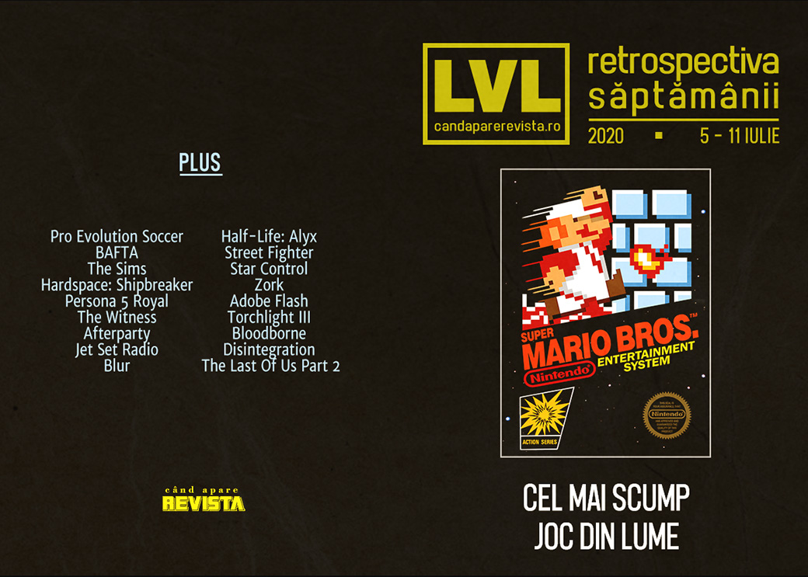

Sony investește în Epic Games, Super Mario Bros devine (din nou) cel mai scump joc, PES rămâne fără două cluburi importante din campionatul italian și apar noi rapoarte despre acuzațiile de hărțuire sexuală de la Ubisoft. Pe lângă acestea, a fost anunțat Shadow Warrior 3 și am avut o nouă prezentare Devolver Digital, despre care găsiți detalii în [articolul nostru]() dedicat evenimentelor de jocuri din această vară.

Linkuri rapide:

* [Știri](#știri)
* [Articole (critică, dev, design)](#articole-critică-dev-design)
* [Anunțuri şi lansări de jocuri](#anunţuri-şi-lansări-de-jocuri)
* [Prăvălii de jocuri](#prăvălii-de-jocuri)

## Știri

* Konami a pierdut drepturile de licențiere pentru cluburile AC Milan and Inter Milano, care nu se vor mai regăsi în edițiile viitoare ale seriei **PES**. ([Eurogamer](https://www.eurogamer.net/articles/2020-07-07-pes-loses-ac-milan-and-inter-milan-licence), [GamesIndustry.biz](https://www.gamesindustry.biz/articles/2020-07-08-pes-loses-licenses-for-ac-milan-and-inter-milan))
* Sony a devenit acționar minoritar la Epic Games după ce a cumpărat un pachet de acțiuni în valoare de 250 de milioane de dolari. ([Destructoid](https://www.destructoid.com/stories/sony-drops-a-cool-250-million-for-a-minority-stake-in-epic-596882.phtml), [Eurogamer](https://www.eurogamer.net/articles/2020-07-10-sony-invests-usd250m-in-fortnite-maker-epic), [Kotaku](https://kotaku.com/sony-invests-250m-in-epic-games-for-further-collabora-1844326581), [GamesIndustry.biz](https://www.gamesindustry.biz/articles/2020-07-09-sony-invests-USD250m-in-epic-games))
* Începând cu ediția 2021, criteriile de eligibilitate pentru premiile BAFTA vor include și respectarea unui standard de „diversitate și incluziune”. Aceleași standarde au fost introduse anul trecut și pentru premiile acordate filmelor. ([Gamasutra](https://www.gamasutra.com/view/news/366217/BAFTA_Games_Awards_applicants_will_be_challenged_over_diversity_and_inclusion_.php), [VideoGamesChronicle](https://www.videogameschronicle.com/news/bafta-game-awards-will-make-diversity-criteria-part-of-its-rules/), [GamesIndustry.biz](https://www.gamesindustry.biz/articles/2020-07-09-bafta-aims-to-make-bfi-diversity-standards-part-of-the-british-academy-games-awards))
* O copie sigilată a jocului **Super Mario Bros.** din 1985 s-a vândut la licitație pentru suma de 114.000 de dolari, stabilind un nou record pentru cel mai mare preț plătit pentru o singură copie a unui joc video (precedentul record fiind deținut de o altă copie a aceluiași joc). ([Eurogamer](https://www.eurogamer.net/articles/2020-07-11-sealed-copy-of-super-mario-bros-sells-for-usd114k-becomes-most-expensive-video-game-ever), [The Verge](https://www.theverge.com/2020/7/10/21320274/super-mario-bros-sealed-copy-auction-record-most-expensive-game-ever))
* O companie americană de televiziune a produs un reality show bazat pe jocul **The Sims**, în care concurenții se vor lupta pentru un premiu de 100.000 de dolari. ([RPS](https://www.rockpapershotgun.com/2020/07/08/the-sims-is-getting-a-reality-show/), [Kotaku](https://kotaku.com/the-sims-is-getting-a-reality-show-because-why-not-1844309056), [Eurogamer](https://www.eurogamer.net/articles/2020-07-09-the-sims-is-getting-a-reality-tv-show), [Vice](https://www.vice.com/en_us/article/dyzd9q/the-sims-is-getting-a-reality-tv-show), [GamesIndustry.biz](https://www.gamesindustry.biz/articles/2020-07-08-ea-partners-with-tbs-for-four-episode-the-sims-reality-show))
* O companie care reprezintă o parte dintre investitorii EA (aceeași care a solicitat [reducerea bonusurilor lui Bobby Kotick]() de la Activision-Blizzard) a cerut acționarilor să voteze reducerea compensațiilor „uriașe” acordate directorilor EA. ([Destructoid](https://www.destructoid.com/stories/investment-group-calls-out-ea-for-being-addicted-to-giving-its-executive-bonuses-596771.phtml), [PC Gamer](https://www.pcgamer.com/investment-group-that-complained-about-bobby-kotick-says-ea-execs-get-paid-too-much-too), [GamesIndustry.biz](https://www.gamesindustry.biz/articles/2020-07-09-electronic-arts-addicted-to-overpaying-executives-says-investment-group))

## Articole (critică, dev, design)
* [The Evil of Perfectionism](https://www.gamasutra.com/blogs/NicholasLives/20200708/366046/The_Evil_of_Perfectionism.php) (Gamasutra)

---

### Actualitate
*  [Why is this copy of Super Mario Bros. worth a record $114,000?](https://arstechnica.com/gaming/2020/07/why-is-this-copy-of-super-mario-bros-worth-a-record-114000/) (Ars Technica)

---

### Reportaj
* [Over 50 Sexual Misconduct Allegations Have The Super Smash Bros. Community In Turmoil](https://kotaku.com/over-50-sexual-misconduct-allegations-have-the-super-sm-1844328719) (Kotaku)
* [New report on Ubisoft reveals more shocking sexual harassment allegations](https://www.eurogamer.net/articles/2020-07-11-new-report-on-ubisoft-reveals-more-shocking-sexual-harassment-allegations) (Eurogamer)
* [Ubisoft Employees Have &#x27;Grave Concerns&#x27; Over Toronto Studio&#x27;s Misconduct Allegations](https://kotaku.com/ubisoft-employees-have-grave-concerns-over-toronto-stud-1844277486) (Kotaku)

---

### _Not-a-review_
* [The joy of stripping armour in Hardspace: Shipbreaker](https://www.rockpapershotgun.com/2020/07/07/the-joy-of-stripping-armour-in-hardspace-shipbreaker/) (RPS)
* [Mathematicians tried to prove how hard The Witness is - with surprising results](https://www.eurogamer.net/articles/2020-07-07-maths-experts-are-studying-the-witness-with-surprising-results) (Eurogamer)
* [The 120-Hour Goodbye](https://unwinnable.com/2020/07/07/the-120-hour-goodbye-persona-5-royal/) (Unwinnable)
* [Afterparty and the Tedium of Eternal Consumption](https://haywiremag.com/features/afterparty-and-the-tedium-of-eternal-consumption/) (Tedium)

---

### Industrie
* [Could Sony stumble on cross-generation games?](https://www.gamesindustry.biz/articles/2020-07-10-could-sony-stumble-on-cross-generation-games-opinion) (GamesIndustry.biz)
* [Why the discussion around difficulty is outdated and archaic](https://www.gamesindustry.biz/articles/2020-07-08-difficulty-in-video-games-talk) (GamesIndustry.biz)

#### Jocul de 70 de dolari
* [The return of the $70 video game has been a long time coming](https://arstechnica.com/gaming/2020/07/the-return-of-the-70-video-game-has-been-a-long-time-coming/) (Ars Technica)
* [Why a $70 NBA 2k21 is the Wrong Move for Next-Gen Sports Games](https://techraptor.net/gaming/opinions/70-nba-2k21-wrong-move-next-gen-sports-games) (TechRaptor)
* [The $70 video game is inevitable](https://www.polygon.com/2020/7/7/21314545/console-video-game-price-increase-70-video-game-ps5-xbox-series-x) (Polygon)
* [Video Games Were Due for a Price Increase, but Not Quite Like This](https://www.escapistmagazine.com/v2/video-games-were-due-for-a-price-increase-but-not-quite-like-this/) (Escapist)

#### Xbox
* [How Minecraft and Mojang taught Xbox how to buy studios](https://www.gamesindustry.biz/articles/2020-07-09-how-minecraft-and-mojang-taught-xbox-how-to-buy-studios) (GamesIndustry.biz)
* [Are Xbox Series X developers being held back by Xbox One?](https://www.gamesindustry.biz/articles/2020-07-10-are-xbox-series-x-developers-being-held-back-by-xbox-one) (GamesIndustry.biz)
* [Developing for Xbox Game Pass: &quot;I could never pitch these ideas to a publisher&quot;](https://www.gamesindustry.biz/articles/2020-07-09-developing-for-xbox-game-pass-i-could-never-pitch-these-ideas-to-a-publisher) (GamesIndustry.biz)

---

### Istorie, retrospectivă
* [20 years on, Jet Set Radio is still influencing developers](https://www.rockpapershotgun.com/2020/07/07/20-years-on-jet-set-radio-is-still-influencing-developers/) (RPS)
* [Graveyard: Blur](https://hardcoregamer.com/2020/07/06/graveyard-blur/382211/) (Hardcore Gamer)
* [From Bejeweled To Plants Vs Zombies: How PopCap Got Just About Everyone To Play Their Games](https://kotaku.com/from-bejeweled-to-plants-vs-zombies-how-popcap-got-jus-1844338169) (Kotaku)
* [The DeanBeat: The Final Hours of Half-Life: Alyx gives us a much-needed peek inside Valve](https://venturebeat.com/2020/07/10/the-deanbeat-the-final-hours-of-half-life-alyx-gives-us-a-much-needed-peek-inside-valve/) (VentureBeat)
* [Street Fighter 1: An oral history](https://www.polygon.com/2020/7/7/21270906/street-fighter-1-oral-history-takashi-nishiyama) (Polygon)
* [An extended interview with Star Control creators Fred Ford & Paul Reiche III](https://arstechnica.com/gaming/2020/07/an-extended-interview-with-star-control-creators-fred-ford-paul-reiche-iii/) (Ars Technica)
* [Zork [1980]](https://arcadeidea.wordpress.com/2020/07/06/zork-1980/) (Arcade Idea)
* [Strategic personalities](https://kimimithegameeatingshemonster.wordpress.com/2020/07/07/strategic-personalities/) (Kimimi The Game-Eating She-Monster)
* [The rise and fall of Adobe Flash](https://arstechnica.com/information-technology/2020/07/the-rise-and-fall-of-adobe-flash/) (Ars Technica)

---

### Dev, making of, mecanici
* [Torchlight 3 Early Access Launch Weekend Postmortem - &quot;We had to kill all of the zombies.&quot;](https://www.gamasutra.com/blogs/JillSullivan/20200706/365911/Torchlight_3_Early_Access_Launch_Weekend_Postmortem__quotWe_had_to_kill_all_of_the_zombiesquot.php) (Gamasutra)
* [Integrating 'the nobility of work' into  Hardspace: Shipbreaker](https://www.gamasutra.com/view/news/365777/Integrating_the_nobility_of_work_into_Hardspace_Shipbreaker.php) (Gamasutra)
* [How the Tomb Prospectors Mapped Bloodborne](https://uppercutcrit.com/how-the-tomb-prospectors-mapped-bloodborne) (Uppercut)
* [Anti-Snowball Design](https://waywardstrategy.com/2020/07/06/anti-snowball-design/) (Wayward Strategy)

---

### Design, world-building, artă
* [The Art Of Disintegration](https://kotaku.com/the-art-of-disintegration-1844317577) (Kotaku)
* [What One Artist&#x27;s Work On The Last Of Us Part 2 Looked Like](https://kotaku.com/what-one-artists-work-on-the-last-of-us-part-2-looked-l-1844274444) (Kotaku)
* [Game Art: Robert Robinson's Seattle (2020)](https://www.gamescenes.org/2020/07/game-art-robert-robinsons-seattle-2020.html) (GAMESCENES)

## Anunţuri şi lansări de jocuri
### Anunţate
* **Shadow Warrior 3** ([EGM](https://egmnow.com/shadow-warrior-3-announced-with-debut-trailer/))
* **Rogue Lords** ([RPS](https://www.rockpapershotgun.com/2020/07/07/cyanides-rogue-lords-is-a-gothic-fantasy-roguelike-where-you-play-as-the-devil))
* **Steelrising** ([PC Gamer](https://www.pcgamer.com/the-next-spiders-game-is-about-the-french-revolution-but-with-robots))
* **Test Drive Unlimited Solar Crown** ([EGM](https://egmnow.com/test-drive-unlimited-solar-crown-revealed/))
* **Manor Lords** ([Kotaku](https://kotaku.com/manor-lords-is-a-city-builder-with-medieval-battles-1844274001))
* **Superhot: Mind Control Delete** ([Shacknews](https://www.shacknews.com/article/119111/superhot-mind-control-delete-announced-free-for-owners-of-the-original-game))
* **Deathground** ([Eurogamer](https://www.eurogamer.net/articles/2020-07-11-deathground-is-alien-isolation-except-dinosaurs))
* **UFC 4** ([Destructoid](https://www.destructoid.com/stories/ea-drops-reveal-trailer-for-ufc-4-with-an-august-launch-date-597089.phtml))
* **Olija** ([Shacknews](https://www.shacknews.com/article/119150/olija-pulls-out-a-harpoon-on-pc-and-nintendo-switch))

### Acum cu dată de lansare
* **Halo 3**: 14 iulie ([Kotaku](https://kotaku.com/halo-3-comes-to-pc-july-14-1844291732))
* **Death Come True**: 17 iulie ([Destructoid](https://www.destructoid.com/stories/death-come-true-brings-murder-and-mayhem-to-pc-july-17-596520.phtml))
* **Carrion**: 23 iulie ([Shacknews](https://www.shacknews.com/article/119149/carrion-gets-bloody-new-trailer-releases-july-23))
* **Maid of Sker**: 28 iulie ([GameSpace](https://www.gamespace.com/all-articles/news/maid-of-sker-serves-up-horror-28-july/))
* **Blightbound** (early access): 29 iulie ([PC Gamer](https://www.pcgamer.com/co-op-dungeon-crawler-blightbound-is-heading-to-steam-early-access-on-july-29/))
* **Fall Guys: Ultimate Knockout**: 4 august ([Shacknews](https://www.shacknews.com/article/119148/fall-guys-ultimate-knockout-gets-august-4-release-date-on-playstation-4-steam))
* **Kingdoms of Amalur: Re-Reckoning**: 8 septembrie ([Shacknews](https://www.shacknews.com/article/119057/kingdoms-of-amalur-re-reckoning-gets-september-2020-release-date-2021-expansion))
* **WWE 2K Battlegrounds**: 18 septembrie ([Games Informer](https://www.gameinformer.com/2020/07/08/wwe-2k-battlegrounds-launches-this-september))
* **Werewolf: The Apocalypse - Earthblood**: 4 februarie 2021 ([RPS](https://www.rockpapershotgun.com/2020/07/07/werewolf-the-apocalypse-earthblood-is-coming-out-next-year/))

### Amânate
* **Mafia: Definitive Edition**: 25 septembrie în loc de august ([PC Gamer](https://www.pcgamer.com/mafia-definitive-edition-has-been-delayed))
* **New World**: amânat pentru primăvara anului viitor ([Escapist](https://www.escapistmagazine.com/v2/new-world-mmo-from-amazon-games-sees-delay-to-spring-2021/))

### Lansate
* 9 iulie: **F1 2020** ([Steam](https://store.steampowered.com/app/1080110/F1_2020/))
* 9 iulie: **Half-Life: Alyx - Final Hours** ([Steam](https://store.steampowered.com/app/1361700/HalfLife_Alyx__Final_Hours/))
* 9 iulie: **Soda Dungeon 2** ([Steam](https://store.steampowered.com/app/946050/Soda_Dungeon_2/))
* 10 iulie: **Deadly Premonition 2: A Blessing In Disguise** ([Nintendo Store](https://www.nintendo.com/games/detail/deadly-premonition-2-a-blessing-in-disguise-switch/))
* 10 iulie: **Bloodstained: Curse of the Moon 2** ([Steam](https://store.steampowered.com/app/1257360/Bloodstained_Curse_of_the_Moon_2/))

## Prăvălii de jocuri
### Știri
* [Steam's customizable News Hub gets a big update ahead of full launch](https://www.pcgamer.com/steams-customizable-news-hub-gets-a-big-update-ahead-of-full-launch/) (PC Gamer)

### Jocuri gratis și free weekends
* [Grab Watch Dogs 2 For Free On PC This Weekend](https://kotaku.com/grab-watch-dogs-2-for-free-on-pc-this-weekend-1844294622) (Kotaku)
* [You can now try Ubisoft's subscription service Uplay+ for free for a week](https://www.eurogamer.net/articles/2020-07-08-uplay-plus-free-trial) (Eurogamer)
* [A 12-month Humble Choice subscription is now 40% off](https://www.eurogamer.net/articles/2020-07-07-12-month-humble-choice-subscription-40-percent-off) (Eurogamer)
* [It's a three-free-game week on the Epic Games Store](https://www.destructoid.com/stories/it-s-a-three-free-game-week-on-the-epic-games-store-596867.phtml) (Destructoid)
* [Tropico 6 is free to try this weekend](https://www.pcgamer.com/tropico-6-is-free-to-try-this-weekend) (PC Gamer)

### Reduceri și promoții
* [Get Oxenfree, Heaven&#8217;s Vault and loads of Telltale games for $15 in Humble&#8217;s latest bundle](https://www.rockpapershotgun.com/2020/07/08/get-oxenfree-heavens-vault-and-loads-of-telltale-games-for-15-in-humbles-latest-bundle) (RPS)
* [Weekend PC Download Deals for July 10: One more shot at Half-Life: Alyx](https://www.shacknews.com/article/119140/weekend-pc-download-deals-for-july-10-one-more-shot-at-half-life-alyx) (Shacknews)
* [Weekend Console Download Deals for July 10: July Savings PlayStation sale](https://www.shacknews.com/article/119137/weekend-console-download-deals-for-july-10-july-savings-playstation-sale) (Shacknews)

---

{}
**Retrospectiva săptămânii** este rubrica duminicală în care trecem în revistă evenimentele săptămânii de pe frontul de gaming: știri şi articole (scrise de alții, bineînțeles, că e mai ușor aşa), industrie, lansări, oferte de jocuri, toate numai de savurat la cafeaua de duminică dimineața.

De asemenea, rubrica e deschisă oricui vrea și poate contribui. Dacă ai citit vreun articol sau vreo știre interesantă și crezi că merită incluse în retrospectiva săptămânii, te așteptăm pe forum pe unul dintre topicurile dedicate: [Știri](https://forum.candaparerevista.ro/viewtopic.php?f=4&t=46), [Articole](https://forum.candaparerevista.ro/viewtopic.php?f=4&t=206), [Gaming România](https://forum.candaparerevista.ro/viewtopic.php?f=4&t=1622)].
{}
