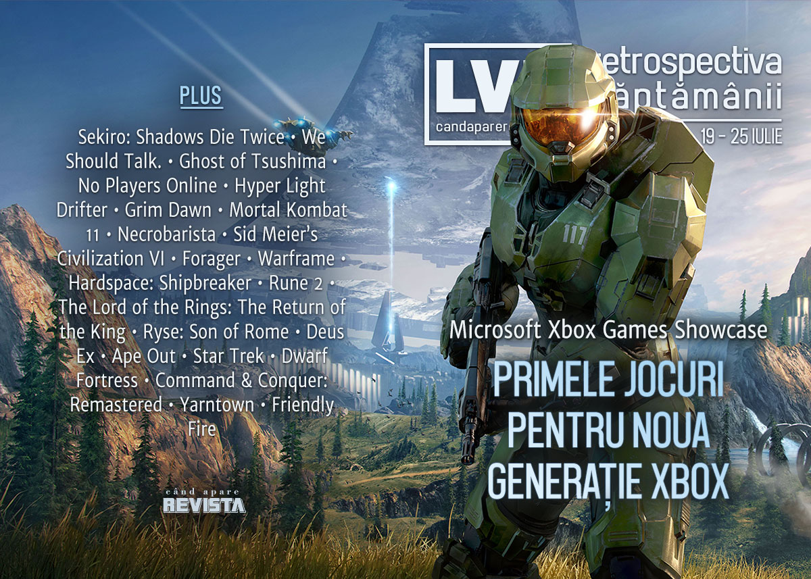

Microsoft a prezentat jocurile de lansare pentru Xbox Series X, scoțând la înaintare Halo Infinite, Forza Motorsport și Fable (sumarul e inclus în [articolul nostru]() dedicat evenimentelor din această vară), 
AMD anunță o nouă serie de procesoare desktop cu grafică integrată, aflăm că Gabe Newell locuiește în Noua Zeelandă de la declararea pandemiei, iar industria românească de jocuri și-a ales un reprezentant pentru concursul de jocuri Europlay de la Gamescom.

Linkuri rapide:

* [Știri](#știri)
* [Articole (critică, dev, design)](#articole-critică-dev-design)
* [Made în România](#made-în-românia)
* [Anunțuri şi lansări de jocuri](#anunţuri-şi-lansări-de-jocuri)
* [Prăvălii de jocuri](#prăvălii-de-jocuri)

## Știri

* AMD anunță seria 4000 de procesoare Ryzen pentru desktop. Acestea vor fi construite în continuare pe tehnologie de 7nm, dar vor beneficia de procesare grafică integrată. ([Ars Technica](https://arstechnica.com/gadgets/2020/07/amd-ryzen-4000-desktop-apus-will-be-here-in-q3-2020/), [Eurogamer](https://www.eurogamer.net/articles/digitalfoundry-2020-07-21-amd-announces-4000-series-cpus-with-integrated-graphics), [RPS](https://www.rockpapershotgun.com/2020/07/21/amd-ryzen-4000-g-series-specs/), [PC Gamer](https://www.pcgamer.com/amd-ryzen-4000-apus-are-oem-only-right-now-but-heres-why-thats-a-good-thing))
* Totodată, prețul acțiunilor AMD l-a depășit pe cel al Intel pentru prima dată. ([PC Gamer](https://www.pcgamer.com/amds-share-price-overtakes-intels-for-the-first-time-ever/), [TechSpot](https://www.techspot.com/news/86118-amd-share-price-jumps-above-intel-first-time.html))
* S-a închis definitiv platforma de streaming Mixer, re-lansată de Microsoft în 2017 după achiziția și rebrandingul vechiului serviciu Beam, lansat în 2016. ([RPS](https://www.rockpapershotgun.com/2020/07/22/microsofts-livestreaming-service-mixer-shuts-down-today), [PC Gamer](https://www.pcgamer.com/mixer-is-now-officially-gone))
* Se pare că Gabe Newell locuiește în Noua Zeelandă din luna martie, unde se afla când a fost declarată pandemia de Covid și țara urma să-și închidă granițele, astfel că a ales să rămână acolo în loc să se întoarcă în SUA. ([PC Gamer](https://www.pcgamer.com/gabe-newell-has-been-a-covid-refugee-in-new-zealand-since-march/), [VideoGamesChronicle](https://www.videogameschronicle.com/news/valves-gabe-newell-reveals-hes-spent-five-months-living-in-new-zealand/))
* O nouă scurgere de date de la Nintendo scoate la iveală, printre altele, o mulțime de prototipuri și cod sursă pentru jocuri vechi. ([VideoGamesChronicle](https://www.videogameschronicle.com/news/an-alleged-nintendo-leak-has-reportedly-unearthed-early-game-prototypes/), [Eurogamer](https://www.eurogamer.net/articles/2020-07-25-alleged-nintendo-gigaleak-reveals-eye-opening-prototypes-for-yoshis-island-super-mario-kart-star-fox-2-and-more), [TechRaptor](https://techraptor.net/gaming/news/nintendo-source-code-leak-releases-tons-of-behind-scenes-data), [Nintendo Everything](https://nintendoeverything.com/latest-nintendo-leak-involves-the-n64-including-luigi-in-mario-64-and-early-look-at-zelda-ocarina-of-time/))
* Programul Epic MegaGrants a finanțat până acum, de la lansarea în martie anul trecut, peste 600 de studiouri cu fonduri în valoare de 42 de milioane de dolari. ([Game World Observer](https://gameworldobserver.com/2020/07/24/600-studios-receive-42-million-part-epic-megagrants-program/), [VentureBeat](https://venturebeat.com/2020/07/24/epic-games-awards-more-than-42-million-in-grants-for-developers/))

## Articole (critică, dev, design)

* [How a spooky game about being alone on a server launched an accidental ARG](https://www.pcgamer.com/how-a-spooky-game-about-being-alone-on-a-server-launched-an-accidental-arg/) (PC Gamer)
* [How Fan Servers are Preserving Dead Multiplayer Games](https://uppercutcrit.com/how-fan-servers-are-preserving-dead-multiplayer-games) (Uppercut)
* [There Are Right and Wrong Ways to Subvert Expectations](https://www.escapistmagazine.com/v2/right-wrong-ways-to-subvert-expectations-false-marketing-deception-lies/) (Escapist)
* [Total Knightmare: the perils of adapting video games for TV](https://wireframe.raspberrypi.org/articles/total-knightmare-the-perils-of-adapting-video-games-for-tv) (Wireframe magazine)
* [One Collector’s Ridiculous Journey to Gather 380 Copies of Super Mario Bros](https://www.vice.com/en_us/article/bv8yxq/one-collectors-ridiculous-journey-to-gather-380-copies-of-super-mario-bros) (Vice)

---

### Actualitate
* [Microsoft&#8217;s Games Showcase was the strangest Xbox show yet](https://www.videogameschronicle.com/features/xboxs-games-showcase-was-its-strangest-show-yet/) (VideoGamesChronicle)

---

### Reportaj
* [Ubisoft Family Accused of Mishandling Sexual Misconduct Claims](https://www.bloomberg.com/news/articles/2020-07-21/ubisoft-sexual-misconduct-scandal-harassment-sexism-and-abuse) (Bloomberg) (TL;DR pe [Eurogamer](https://www.eurogamer.net/articles/2020-07-21-fresh-report-into-ubisoft-culture-highlights-reluctance-to-let-you-play-as-a-woman-in-assassins-creed))

---

### _Not-a-review_
* [Sekiro has ruined all other singleplayer games for me](https://www.pcgamer.com/sekiro-has-ruined-all-other-singleplayer-games-for-me/) (PC Gamer)
* [This indie game has a brilliant modular dialogue system](https://www.pcgamer.com/this-indie-game-has-a-brilliant-modular-dialogue-system/) (PC Gamer)
* [Ghost of Tsushima, Kurosawa, and the political myth of the samurai](https://www.polygon.com/2020/7/23/21333631/ghost-of-tsushima-kurosawa-films-samurai-japan-abe-politics) (Polygon)
* [The Loneliness of Heroism in Hyper Light Drifter](https://www.kritiqal.com/articles/the-loneliness-of-heroism-in-hyper-light-drifter) (KRITIQAL)
* [The Butcher](https://deep-hell.com/the-butcher/) (DEEP HELL)
* [A Villainous Aftermath](https://unwinnable.com/2020/07/24/a-villainous-aftermath/) (Unwinnable)
* [Necrobarista is Haunting, Innovative and Begging for Interpretation](https://unwinnable.com/2020/07/21/necrobarista-is-haunting-innovative-and-begging-for-interpretation/) (Unwinnable)
* [Empire and Quarantine: The Public/Private in Games](https://intothespine.com/2020/07/22/empire-and-quarantine-the-public-private-in-games/) (Into the Spine)
* [Oh No, I&#x27;m Hooked On Warframe Now](https://kotaku.com/oh-no-im-hooked-on-warframe-now-1844458537) (Kotaku)
* [Finding Meaning in Absurdity in Hardspace: Shipbreaker](https://www.fanbyte.com/features/finding-meaning-in-absurdity-in-hardspace-shipbreaker/) (Fanbyte)

---

### Industrie
* [Is the video games industry finally reckoning with sexism?](https://www.theguardian.com/games/2020/jul/22/is-the-video-games-industry-finally-reckoning-with-sexism) (The Guardian)
* ['We got stabbed in the back': How Rune 2 survived one of the worst game launches in years](https://www.pcgamer.com/we-got-stabbed-in-the-back-how-rune-2-survived-one-of-the-worst-game-launches-in-years/) (PC Gamer)
* [The end of 30%?](https://www.gamesindustry.biz/articles/2020-07-21-the-end-of-30-percent-opinion) (GamesIndustry.biz)
* [Meet CtW: The investors taking on Activision Blizzard and EA over exec pay](https://www.gamesindustry.biz/articles/2020-07-23-meet-ctw-the-investors-taking-on-activision-blizzard-and-ea-over-exec-pay) (GamesIndustry.biz)
* [The console war is over](https://www.gamesindustry.biz/articles/2020-07-23-the-console-war-is-over-opinion) (GamesIndustry.biz)

---

### Istorie, retrospectivă
* [Member The Lord of the Rings: The Return of the King](https://hardcoregamer.com/2020/07/21/member-the-lord-of-the-rings-the-return-of-the-king/383085/) (Hardcore Gamer)
* [Ryse: Son of Rome Is the Past and Future of Console Gaming](https://www.escapistmagazine.com/v2/ryse-son-of-rome-is-the-past-and-future-of-console-gaming/) (Escapist)
* [Warren Spector on Deus Ex, 20 years on](https://www.rockpapershotgun.com/2020/07/23/warren-spector-on-deus-ex-20-years-on/) (RPS)
* [BBS Graphics History: Pretty Awesome, Until the Web Showed Up](https://tedium.co/2020/07/21/bbs-graphics-history-ripscrip-naplps/) (Tedium)
* [Ape Out: Understandable in a split second | Why I Love](https://www.gamesindustry.biz/articles/2020-07-20-ape-out-why-i-love) (GamesIndustry.biz)
* [Flash Games Are Leaving Soon, but Their Memory Will Never Fade](https://www.fanbyte.com/features/flash-games-are-leaving-soon-but-their-memory-will-never-fade/) (Fanbyte)
* [Press A to Boldly Go: A History of Star Trek Video Games](https://www.fanbyte.com/features/press-a-to-boldly-go-a-history-of-star-trek-video-games/) (Fanbyte)

---

### Dev, making of, mecanici
* [It Was Inevitable: An Interview with Tarn Adams on Dwarf Fortress](https://sidequest.zone/2020/07/23/it-was-inevitable-tarn-adams-on-dwarf-fortress/) (Sidequest)
* [EA's strategy for remastering  Command & Conquer](https://www.gamasutra.com/view/news/366568/EAs_strategy_for_remastering_Command_amp__Conquer.php) (Gamasutra)

---

### Design, world-building, artă
* [Riding Out For A Couple Of Cold Ones With The Boys](https://kotaku.com/riding-out-for-a-couple-of-cold-ones-with-the-boys-1844476531) (Kotaku)

## Made în România

* Industria românească de jocuri a ales un joc care să reprezinte România la concursul Europlay ce se va desfășura pe 28 August în cadrul Gamescom. Alegerea a fost făcută de către [membrii grupului RGDA](https://www.facebook.com/groups/THERGDA/permalink/1850527088419158/) din 12 titluri participante aflate în dezvoltare. Deși încă nu a fost anunțat oficial câștigătorul până la acest moment, votarea s-a încheiat, iar pe primul loc în preferințele votanților se află **Door Kickers 2: Task Force North**. ([Romanian Game Developers Association](http://rgda.ro/europlay-video-games-competition/))

## Anunţuri şi lansări de jocuri

### Anunţate
* **Mundaun** ([Destructoid](https://www.destructoid.com/stories/mundaun-is-a-horror-adventure-across-the-sinister-alps-598078.phtml))
* **Shin Megami Tensei 3: Nocturne HD Remaster** ([Shacknews](https://www.shacknews.com/article/119318/shin-megami-tensei-3-nocturne-hd-remaster-revealed-coming-2021))
* **Hellish Quart** ([Polygon](https://www.polygon.com/2020/7/20/21331821/hellish-quart-bushido-blade-early-access-sword-fighting-duel-fighting-game-one-shot))
* **Overcooked! All You Can** ([Polygon](https://www.polygon.com/2020/7/20/21331231/overcooked-all-you-can-eat-xbox-series-x-ps5))
* **Alba: A Wildlife Adventure** ([VideoGamesChronicle](https://www.videogameschronicle.com/news/monument-valley-studio-reveals-new-game-alba-a-wildlife-adventure/))
* **Bomb Rush Cyberfunk** ([Shacknews](https://www.shacknews.com/article/119366/bomb-rush-cyberfunk-looks-like-the-jet-set-radio-spiritual-successor-we-wanted))
* **Griefhelm** ([PC Gamer](https://www.pcgamer.com/griefhelms-fast-paced-2d-swordfighting-launches-on-august-20/))
* **FIFA 21** ([Kotaku](https://kotaku.com/ea-reveals-fifa-21-sequel-to-fifa-20-1844487709))

#### Anunțate la Xbox Showcase

[Here’s everything that was announced during today’s Xbox Games Showcase](https://egmnow.com/heres-everything-that-was-announced-during-todays-xbox-games-showcase/) (EGM)

* **State of Decay 3** ([Polygon](https://www.polygon.com/2020/7/23/21334702/state-of-decay-3-xbox-series-x-trailer-release-date-undead-labs), [Destructoid](https://www.destructoid.com/stories/state-of-decay-3-is-heading-to-xbox-series-x-and-pc-598394.phtml))
* **Fable** ([EGM](https://egmnow.com/after-years-of-rumors-playground-games-fable-is-finally-officially-revealed), [VideoGamesChronicle](https://www.videogameschronicle.com/news/fable-is-officially-in-development-for-xbox-series-x/))
* **Forza Motorsport** ([VideoGamesChronicle](https://www.videogameschronicle.com/news/the-next-forza-will-be-a-reimagining-exclusive-to-xbox-series-x-and-pc/), [Shacknews](https://www.shacknews.com/article/119385/forza-motorsport-revealed-for-xbox-series-x-and-pc))
* **The Outer Worlds: Peril on Gorgon** ([Shacknews](https://www.shacknews.com/article/119361/the-outer-worlds-peril-on-gorgon-dlc-set-for-september-release), [Kotaku](https://kotaku.com/outer-worlds-expansion-coming-in-september-1844481735))
* **Avowed** ([Eurogamer](https://www.eurogamer.net/articles/2020-07-23-obsidian-reveals-avowed-a-first-person-rpg-set-in-the-pillars-of-eternity-world), [VideoGamesChronicle](https://www.videogameschronicle.com/news/obsidian-reveals-avowed-an-expansive-first-person-rpg-set-in-eora/))
* **As Dusk Falls** ([Destructoid](https://www.destructoid.com/stories/as-dusk-falls-is-an-interactive-drama-about-crime-family-and-the-american-southwest-598401.phtml), [PC Gamer](https://www.pcgamer.com/as-dusk-falls-is-a-new-game-from-the-designer-of-heavy-rain-and-beyond-two-souls))
* **Balan Wonderworld** ([VideoGamesChronicle](https://www.videogameschronicle.com/news/sonics-co-creators-are-re-teaming-for-3d-platformer-balan-wonderworld/), [Shacknews](https://www.shacknews.com/article/119382/balan-wonderworld-revealed-by-square-enix-former-sonic-team-lead-yuji-naka))
* **Warhammer 40,000: Darktide** ([PC Gamer](https://www.pcgamer.com/warhammer-40000-darktide-announced/), [Shacknews](https://www.shacknews.com/article/119392/warhammer-40000-dark-tide-revealed-by-fatshark-on-xbox-series-x-game-showcase))
* **Tetris Effect: Connected** ([Shacknews](https://www.shacknews.com/article/119390/tetris-effect-connected-revealed-for-xbox-series-x-xbox-one-and-pc), [PC Gamer](https://www.pcgamer.com/new-ultimate-incarnation-of-tetris-effect-adds-co-op-and-multiplayer-but-only-on-the-microsoft-store/))
* **The Gunk** ([Shacknews](https://www.shacknews.com/article/119397/the-gunk-will-take-players-on-a-journey-through-an-enormous-new-world), [Polygon](https://www.polygon.com/2020/7/23/21335679/steamworld-quest-the-gunk-image-and-form-xbox-series-x-showcase-microsoft))
* **New Genesis: Phantasy Star Online 2** ([Destructoid](https://www.destructoid.com/stories/phantasy-star-online-2-journeys-onto-xbox-series-x-with-new-genesis-598412.phtml))
* **Exomecha** ([Shacknews](https://www.shacknews.com/article/119379/exomecha-bringing-free-to-play-mech-battle-goodness-to-xbox-pc-beta-coming), [DSOGaming](https://www.dsogaming.com/news/exomecha-is-a-new-free-to-play-first-person-shooter-coming-to-pc-in-2021/))
* **Hello Neighbor 2** ([Shacknews](https://www.shacknews.com/article/119380/hello-neighbor-2-announced-alpha-available-now), [Destructoid](https://www.destructoid.com/stories/hello-neighbor-gets-an-inevitable-sequel-but-this-time-the-neighbor-is-a-beaked-birdfreak-598445.phtml))

### Acum cu dată de lansare
* **Risk Of Rain 2** 11 august ([RPS](https://www.rockpapershotgun.com/2020/07/21/risk-of-rain-2-lands-with-a-new-survivor-stage-and-price-tag-next-month))
* **Samurai Jack: Battle Through Time** 21 august ([Destructoid](https://www.destructoid.com/stories/samurai-jack-battle-through-time-relights-the-flames-of-love-and-anger-on-august-21-598238.phtml))
* **Tell Me Why** 27 august ([The Verge](https://www.theverge.com/2020/7/23/21335659/tell-me-why-xbox-one-pc-release-date-dontnod))

### Amânate
* **The Psychonauts 2** 2021 în loc de 2020
* **Sable** 2021 în loc de 2020

### Lansate
* 20 iulie: **Rogue Company** ([Epic Store](https://www.epicgames.com/store/en-US/product/rogue-company))
* 21 iulie: **Rock Of Ages 3: Make & Break** ([Steam](https://store.steampowered.com/app/1101360/Rock_of_Ages_3_Make__Break/))
* 21 iulie: **Panzer Paladin** ([Steam](https://store.steampowered.com/app/975510/Panzer_Paladin/))
* 21 iulie: **Star Wars: The Old Republic (s-a lansat și pe Steam)** ([Steam](https://store.steampowered.com/app/1286830/STAR_WARS_The_Old_Republic/))
* 22 iulie: **5D Chess With Multiverse Time Travel** ([Steam](https://store.steampowered.com/app/1349230/5D_Chess_With_Multiverse_Time_Travel/))
* 22 iulie: **Necrobarista** ([Steam](https://store.steampowered.com/app/725270/Necrobarista/), [gog.com](https://www.gog.com/game/necrobarista))
* 22 iulie: **Creaks** ([Steam](https://store.steampowered.com/app/956030/Creaks/), [gog.com](https://www.gog.com/game/creaks))
* 23 iulie: **Röki** ([Steam](https://store.steampowered.com/app/1067540/Rki/), [gog.com](https://www.gog.com/game/roki))
* 23 iulie: **Carrion** ([Steam](https://store.steampowered.com/app/953490/CARRION/), [gog.com](https://www.gog.com/game/carrion))
* 24 iulie: **Paper Beast** ([Steam](https://store.steampowered.com/app/1232570/Paper_Beast/))

## Prăvălii de jocuri

### Update catalog
* [Ziggurat Interactive launching Krush Kill 'N Destroy on Steam](https://www.shacknews.com/article/119362/ziggurat-interactive-launching-krush-kill-n-destroy-on-steam) (Shacknews)

### Jocuri gratis și free weekends
* [Xbox&#039;s Summer Game Fest Demo Event launches with demos of 60+ upcoming games](https://egmnow.com/xboxs-summer-game-fest-demo-event-launches-with-demos-of-60-upcoming-games) (EGM), [There are some great indies in the Xbox Summer Game Fest demos](https://www.destructoid.com/stories/there-are-some-great-indies-in-the-xbox-summer-game-fest-demos-598065.phtml) (Destructoid)
* [Bloodborne meets Zelda in Yarntown, a short playable top-down adventure](https://www.destructoid.com/stories/bloodborne-meets-zelda-in-yarntown-a-short-playable-top-down-adventure-598004.phtml) (Destructoid)
* [Strange Adventures in Infinite Space is back, free](https://www.pcgamer.com/strange-adventures-in-infinite-space-is-back-free/) (PC Gamer)
* [Next Up Hero and Tacoma are free on PC](https://egmnow.com/next-up-hero-and-tacoma-are-free-on-pc) (EGM)
* [Friendly Fire Is a Fetch Quest That Snowballs into a (Free) Adventure](https://www.escapistmagazine.com/v2/friendly-fire-the-cat-hive-developers-free-2d-platformer/) (Escapist)

### Reduceri și promoții
* [Get 11 Daedalic games including Pillars of the Earth in the new Humble Bundle](https://www.pcgamer.com/get-11-daedalic-games-including-pillars-of-the-earth-in-the-new-humble-bundle) (PC Gamer)
* [Score more cheap backlog fodder during Green Man Gaming's summer sale](https://www.pcgamer.com/score-more-cheap-backlog-fodder-during-green-man-gamings-summer-sale/) (PC Gamer)
* [Build your own Assassin&#8217;s Creed bundle at Fanatical](https://www.rockpapershotgun.com/2020/07/22/build-your-own-assassins-creed-bundle-at-fanatical) (RPS)
* [Hundreds of PS4 games are reduced in the PSN Summer Sale](https://www.eurogamer.net/articles/2020-07-22-psn-summer-sale) (Eurogamer)
* [Gamesplanet Summer Sale discounts over 2000 digital PC games](https://www.eurogamer.net/articles/2020-07-23-gamesplanet-summer-sale) (Eurogamer)
* [Dive into Epic&#8217;s Summer Sale today with savings of up to 75% off](https://www.rockpapershotgun.com/2020/07/23/dive-into-epics-summer-sale-today-with-savings-of-up-to-75-off/) (RPS)
* [Humble Bundle puts up a collection of Paradox's best strategy games](https://www.pcgamer.com/humble-bundle-puts-up-a-collection-of-paradoxs-best-strategy-games) (PC Gamer)
* [Weekend Console Download Deals for July 24: PlayStation Summer Sale](https://www.shacknews.com/article/119418/weekend-console-download-deals-for-july-24-playstation-summer-sale) (Shacknews)
* [Weekend PC Download Deals for July 24: Epic Summer Sale begins](https://www.shacknews.com/article/119419/weekend-pc-download-deals-for-july-24-epic-summer-sale-begins) (Shacknews)

---

{}
**Retrospectiva săptămânii** este rubrica duminicală în care trecem în revistă evenimentele săptămânii de pe frontul de gaming: știri şi articole (scrise de alții, bineînțeles, că e mai ușor aşa), industrie, lansări, oferte de jocuri, toate numai de savurat la cafeaua de duminică dimineața.

De asemenea, rubrica e deschisă oricui vrea și poate contribui. Dacă ai citit vreun articol sau vreo știre interesantă și crezi că merită incluse în retrospectiva săptămânii, te așteptăm pe forum pe unul dintre topicurile dedicate: [Știri](https://forum.candaparerevista.ro/viewtopic.php?f=4&t=46), [Articole](https://forum.candaparerevista.ro/viewtopic.php?f=4&t=206), [Gaming România](https://forum.candaparerevista.ro/viewtopic.php?f=4&t=1622)].
{}
