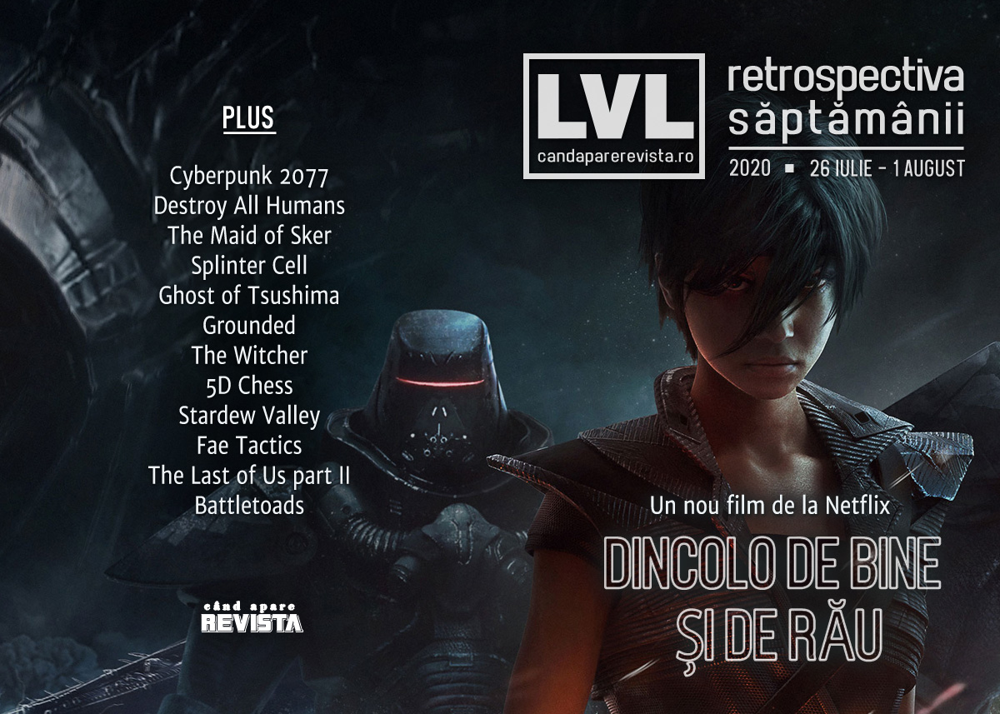

Secetă de știri - nu s-au anunțat prea multe în această săptămână, în afară de noi ecranizări după The Witcher, Splinter Cell și Beyond Good and Evil, extinderea Konami pe segmentul desktop PC, și lansarea lui Destroy All Humans, Grounded și a altor câteva jocuri indie.

Linkuri rapide:

* [Știri](#știri)
* [Articole (critică, dev, design)](#articole-critică-dev-design)
* [Anunțuri şi lansări de jocuri](#anunţuri-şi-lansări-de-jocuri)
* [Prăvălii de jocuri](#prăvălii-de-jocuri)

## Știri

* Continuă valul de ecranizări inspirate de jocuri (și de cărțile care au stat la baza lor):
  * Ubisoft a anunțat un film bazat pe **Beyond Good And Evil**, la cârma căruia va fi Rob Letterman, regizorul lui Detective Pikachu.  ([RPS](https://www.rockpapershotgun.com/2020/08/01/a-beyond-good-and-evil-movie-is-coming-to-netflix/), [Eurogamer](https://www.eurogamer.net/articles/2020-08-01-netflix-beyond-good-and-evil-film-announced), [Polygon](https://www.polygon.com/2020/7/31/21350181/beyond-good-evil-movie-netflix-director))
  * Încă n-a fost anunțat nimic oficial, dar umblă vorba în târg că Netflix pregătește un serial anime inspirat de **Splinter Cell**. ([RPS](https://www.rockpapershotgun.com/2020/07/30/splinter-cell-may-return-as-an-animated-netflix-series/), [PC Gamer](https://www.pcgamer.com/splinter-cell-is-reportedly-coming-backas-an-anime-series-on-netflix/), [Eurogamer](https://www.eurogamer.net/articles/2020-07-30-netflix-is-reportedly-working-on-an-animated-splinter-cell-series))
  * În paralel cu următorul sezon din The Witcher, ale cărui filmări vor reîncepe în august, Netflix va începe să lucreze și la o miniserie prequel, numită The Witcher: Blood Origins. ([RPS](https://www.rockpapershotgun.com/2020/07/27/netflixs-the-witcher-blood-origin-is-a-prequel-series-set-1200-years-before-geralt/), [Eurogamer](https://www.eurogamer.net/articles/2020-07-27-witcher-netflix-showrunner-announces-prequel-series-set-1200-years-before), [VideoGamesChronicle](https://www.videogameschronicle.com/news/netflix-has-announced-a-live-action-witcher-prequel-tv-series/))
* Konami intră pe piața desktop PC cu o linie de modele numită Arespear, într-o încercare de a profita de avântul e-sports în Japonia.   ([PC Gamer](https://www.pcgamer.com/konami-is-entering-the-desktop-pc-business/), [GamesIndustry.biz](https://www.gamesindustry.biz/articles/2020-07-29-konami-is-now-making-esports-pcs), [Kotaku](https://kotaku.com/konami-launches-a-line-of-gaming-pcs-1844541222))
* CD Projekt au avertizat că mail-urile care circulă de săptămâna trecută oferind acces la beta pentru **Cyberpunk 2077** nu sunt oficiale, ci o tentativă de phishing.  ([PCGamesInsider.biz](https://www.pcgamesinsider.biz/news/71417/cd-projekt-warns-of-cyberpunk-2077-beta-scam/), [Techradar](https://www.techradar.com/news/watch-out-for-this-cyberpunk-2077-beta-scam), [Eurogamer](https://www.eurogamer.net/articles/2020-07-30-cd-projekt-warns-players-away-from-cyberpunk-beta-phishing-scam))

## Articole (critică, dev, design)

* [Gabe Newell thinks the Xbox Series X is better than the PlayStation 5](https://www.pcgamer.com/gabe-newell-thinks-the-xbox-series-x-is-better-than-the-playstation-5/) (PC Gamer)
* [Pandemic has accelerated a number of long-term gaming trends](https://www.gamesindustry.biz/articles/2020-07-31-pandemic-has-accelerated-a-number-of-long-term-gaming-trends) (GamesIndustry.biz)
* [PS4 ‘could’ve been the end’ for PlayStation, says former exec](https://www.videogameschronicle.com/news/ps4-couldve-been-the-end-for-playstation-says-former-strategist/) (VideoGamesChronicle)

---

### _Not-a-review_
* [I am willing to die for the ants in Grounded](https://www.rockpapershotgun.com/2020/07/30/i-am-willing-to-die-for-the-ants-in-grounded/) (RPS)
* [Ghost of Tsushima&#x27;s Kurosawa Tribute Is More Than Skin Deep](https://kotaku.com/ghost-of-tsushimas-kurosawa-tribute-is-more-than-skin-d-1844555620) (Kotaku)
* [Actual 5D Chess proves that time travel should not be allowed](https://www.rockpapershotgun.com/2020/07/29/actual-5d-chess-proves-that-time-travel-should-not-be-allowed/) (RPS)
* [Games of the Generation: Stardew Valley is a welcome break from the chaos of the world](https://www.techradar.com/news/games-of-the-generation-stardew-valley-is-a-welcome-break-from-the-chaos-of-the-world) (Techradar)

---

### Industrie
* [Nvidia could be weeks away from buying its very own CPU business](https://www.pcgamer.com/nvidia-cpu-business/) (PC Gamer)
* [Xbox Game Pass isn't a 'big profit play' right now, says Microsoft](https://www.pcgamer.com/xbox-game-pass-isnt-a-big-profit-play-now-says-microsoft/) (PC Gamer)
* [Ex-Ubisoft creative boss canned Dragon Age dev's King Arthur game](https://www.eurogamer.net/articles/2020-07-28-ubisoft-ex-creative-head-canned-king-arthur-game-had-to-be-better-than-tolkien) (Eurogamer)
* [Steam launches, new releases, and The Sims propel EA's first quarter earnings](https://www.gamesindustry.biz/articles/2020-07-30-steam-launches-new-releases-and-the-sims-propel-eas-first-quarter-earnings) (GamesIndustry.biz)
* [SuperData: Big publisher showcases did not suffer from absence of E3](https://www.gamesindustry.biz/articles/2020-07-30-superdata-publisher-showcases-were-not-hurt-by-absence-of-e3) (GamesIndustry.biz)
* [Ferrari launching esports series this September](https://www.gamesindustry.biz/articles/2020-07-28-ferrari-launching-esports-series-this-september) (GamesIndustry.biz)
* [Loot boxes should be a consumer protection matter not a gambling one, says EU report](https://www.gamesindustry.biz/articles/2020-07-27-loot-boxes-should-be-a-consumer-protection-matter-not-gambling-says-eu-report) (GamesIndustry.biz)

---

### Istorie, retrospectivă
* [The sublime theatrics and pacing of Metal Gear Solid 4](https://www.gamesindustry.biz/articles/2020-07-28-the-sublime-theatrics-and-pacing-of-metal-gear-solid-4-why-i-love) (GamesIndustry.biz)
* [The RetroBeat: Disney&#8217;s Rescue Rangers gave the NES two fantastic sidescrollers](https://venturebeat.com/2020/07/31/the-retrobeat-disneys-rescue-rangers-gave-the-nes-two-fantastic-sidescrollers/) (VentureBeat)

---

### Dev, making of, mecanici
* [Making the tactics genre more accessible, less intimidating, in  Fae Tactics](https://gamasutra.com/view/news/338416/Making_the_tactics_genre_more_accessible_less_intimidating_in_Fae_Tactics.php) (Gamasutra)
* [Myths, Mavericks, And Music Of  Red Dead Redemption](https://www.gamasutra.com/view/news/127900/Myths_Mavericks_And_Music_Of_Red_Dead_Redemption.php) (Gamasutra)
* [The Last Of Us Part 2&#x27;s Stuntwoman Spent Several Days Pretending To Die](https://kotaku.com/the-last-of-us-part-2s-stuntwoman-spent-several-days-pr-1844543196) (Kotaku)
* [How Hardspace: Shipbreaker&#8217;s devs made spaceships you can cut anywhere](https://www.rockpapershotgun.com/2020/07/29/how-hardspace-shipbreakers-devs-made-spaceships-you-can-cut-anywere/) (RPS)

---

### Design, world-building, artă
* [What Lurks Beneath](https://kotaku.com/what-lurks-beneath-1844539015) (Kotaku)
* [A Skyrim fan is making lovely handmade illustrations of its alchemy ingredients](https://www.rockpapershotgun.com/2020/07/29/a-skyrim-fan-is-making-lovely-handmade-illustrations-of-its-alchemy-ingredients/) (RPS)
* [Noah Cyrus Made A New Video For ‘July’ In Dreams](https://kotaku.com/noah-cyrus-made-a-new-video-for-july-in-dreams-1844545496) (Kotaku)

## Anunţuri şi lansări de jocuri

### Anunţate
* **Frostpoint VR: Proving Grounds** ([RPS](https://www.rockpapershotgun.com/2020/07/29/inxile-announce-frostpoint-vr-proving-grounds-a-20-player-team-shooter/), [PC Gamer](https://www.pcgamer.com/wasteland-3-developer-inxile-is-making-a-team-based-vr-shooter/))

### Acum cu dată de lansare
* **Phantasy Star Online 2** (Steam): 5 august ([PC Gamer](https://www.pcgamer.com/phantasy-star-online-2-comes-to-steam-on-august-5/))
* **Hyperscape**: 11 august ([Eurogamer](https://www.eurogamer.net/articles/2020-07-30-ubisofts-sci-fi-battle-royale-game-hyper-scape-gets-august-launch-date))
* **Metamorphosis**: 12 august ([PC Gamer](https://www.pcgamer.com/metamorphosis-the-kafka-inspired-game-about-bugs-gets-a-very-weird-new-trailer/))
* **Parkasaurus**: 13 august ([Eurogamer](https://www.eurogamer.net/articles/2020-07-28-adorable-dinosaur-theme-park-sim-parkasaurus-leaves-early-access-next-month))
* **Battletoads**: 20 august ([RPS](https://www.rockpapershotgun.com/2020/07/31/battletoads-is-launching-at-last-on-august-20th/), [Eurogamer](https://www.eurogamer.net/articles/2020-07-31-battletoads-is-back-on-20th-august))
* **Peaky Blinders: Mastermind**: 20 august ([VideoGamesChronicle](https://www.videogameschronicle.com/news/peaky-blinders-mastermind-hits-consoles-and-pc-in-august/))

### Lansate
* 28 iulie: **The Maid of Sker** ([Steam](https://store.steampowered.com/app/826940/Maid_of_Sker/))
* 28 iulie: **Destroy All Humans** ([Steam](https://store.steampowered.com/app/803330/Destroy_All_Humans/), [gog.com](https://www.gog.com/game/destroy_all_humans))
* 28 iulie: **Othercide** ([Steam](https://store.steampowered.com/app/798490/Othercide/))
* 28 iulie: **Terrorarium** ([Steam](https://store.steampowered.com/app/1003450/Terrorarium/))
* 28 iulie: **Grounded** (early access) ([Steam](https://store.steampowered.com/app/962130/Grounded/))
* 28 iulie: **Traveller’s Rest** ([Steam](https://store.steampowered.com/app/1139980/Travellers_Rest/))
* 28 iulie: **Skater XL** ([Steam](https://store.steampowered.com/app/962730/Skater_XL__The_Ultimate_Skateboarding_Game/))
* 29 iulie: **Blightbound** (early access) ([Steam](https://store.steampowered.com/app/1263070/Blightbound/))
* 29 iulie: **Fight Crab** ([Steam](https://store.steampowered.com/app/1213750/Fight_Crab/))
* 30 iulie: **Hellpoint** ([Steam](https://store.steampowered.com/app/628670/Hellpoint/), [gog.com](https://www.gog.com/game/hellpoint))
* 30 iulie: **Liberated** ([Steam](https://store.steampowered.com/app/875310/Liberated/), [gog.com](https://www.gog.com/game/liberated))
* 30 iulie: **Fairy Tail** ([Steam](https://store.steampowered.com/app/1233260/FAIRY_TAIL/))
* 31 iulie: **Fae Tactics** ([Steam](https://store.steampowered.com/app/995980/Fae_Tactics/), [gog.com](https://www.gog.com/game/fae_tactics))

## Prăvălii de jocuri

### Știri
* [Epic Games Store testing out achievements, with mod support still brewing](https://www.rockpapershotgun.com/2020/07/30/epic-games-store-testing-out-achievements-with-mod-support-still-brewing/) (RPS)
* [Built-in beta tests coming to Steam](https://www.pcgamesinsider.biz/news/71405/built-in-beta-tests-coming-to-steam/) (PCGamesInsider.biz)
* [Steam has been making it tougher to use VPNs to get cheap games](https://www.pcgamer.com/steam-has-been-making-it-tougher-to-use-vpns-to-get-cheap-games/) (PC Gamer)

### Jocuri gratis și free weekends
* [20XX, Barony, and Sword &amp; Sworcery are free for the week on the Epic Games Store](https://www.pcgamer.com/20xx-barony-and-sword-and-sworcery-are-free-for-the-week-on-the-epic-game-store/) (PC Gamer)
* [Xbox Games With Gold for August Revealed](https://www.ign.com/articles/xbox-games-with-gold-for-august-revealed) (IGN)
* [Twitch Prime adds more SNK games including Metal Slug 2 and King of the Monsters](https://www.pcgamer.com/twitch-prime-adds-more-snk-games-including-metal-slug-2-and-king-of-the-monsters/) (PC Gamer)
* [PlayStation Plus: August 2020&#039;s PS Plus Free Games Include Fall Guys, Modern Warfare 2&#039;s Campaign](https://www.gamespot.com/articles/playstation-plus-august-2020s-ps-plus-free-games-i/1100-6480209/) (Gamespot)

### Reduceri și promoții
* [Double Fine&#8217;s 20th Anniversary Humble Bundle is a right steal](https://www.rockpapershotgun.com/2020/07/31/double-fines-20th-anniversary-humble-bundle-is-a-right-steal/) (RPS)
* [A new Humble Bundle features Night Call, Mosaic, Whispers of a Machine, and more](https://www.pcgamer.com/a-new-humble-bundle-features-night-call-mosaic-whispsers-of-a-machine-and-more/) (PC Gamer)

---

{}
**Retrospectiva săptămânii** este rubrica duminicală în care trecem în revistă evenimentele săptămânii de pe frontul de gaming: știri şi articole (scrise de alții, bineînțeles, că e mai ușor aşa), industrie, lansări, oferte de jocuri, toate numai de savurat la cafeaua de duminică dimineața.

De asemenea, rubrica e deschisă oricui vrea și poate contribui. Dacă ai citit vreun articol sau vreo știre interesantă și crezi că merită incluse în retrospectiva săptămânii, te așteptăm pe forum pe unul dintre topicurile dedicate: [Știri](https://forum.candaparerevista.ro/viewtopic.php?f=4&t=46), [Articole](https://forum.candaparerevista.ro/viewtopic.php?f=4&t=206), [Gaming România](https://forum.candaparerevista.ro/viewtopic.php?f=4&t=1622)].
{}
