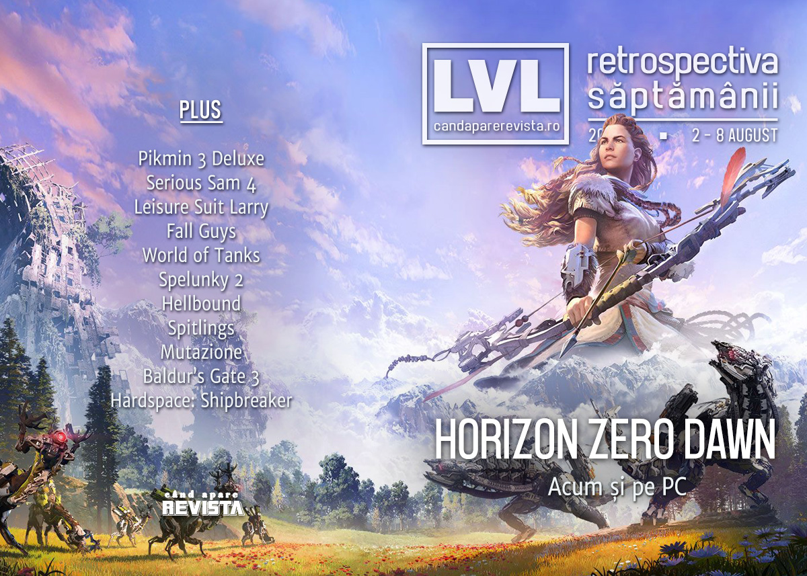

Încă un director pleacă de la Ubisoft în urma scandalurilor, Intel se confruntă cu o scurgere majoră de informații, Apple blochează accesul Xcloud și Google Stadia pe platforma lor, avem date de lansare pentru Spelunky 2, Mortal Shell, Serious Sam 4, și s-au lansat Fall Guys și Horizon Zero Dawn pe PC.

Linkuri rapide:

* [Știri](#știri)
* [Articole (critică, dev, design)](#articole-critică-dev-design)
* [Made în România](#made-în-românia)
* [Anunțuri şi lansări de jocuri](#anunţuri-şi-lansări-de-jocuri)
* [Prăvălii de jocuri](#prăvălii-de-jocuri)

## Știri

* Scandalul de la Ubisoft continuă să zdruncine managementul firmei: un alt director, Tommy François, a părăsit compania în această săptămână. ([GamesIndustry.biz](https://www.gamesindustry.biz/articles/2020-08-03-tommy-fran-ois-has-left-ubisoft), [Eurogamer](https://www.eurogamer.net/articles/2020-08-03-ubisoft-exec-tommy-francois-leaves-company), [PC Gamer](https://www.pcgamer.com/ubisoft-vp-tommy-francois-has-left-the-company-amid-abuse-allegations))
* Intel investighează o scurgere de informații interne - peste 20GB de date confidențiale au fost făcute publice de un hacker anonim. ([PC Gamer](https://www.pcgamer.com/intel-is-investigating-leak-of-more-than-20gb-of-internal-files/), [DSOGaming](https://www.dsogaming.com/news/20gb-of-intels-ip-confidential-data-has-been-breached-online-hacker-also-mentions-nackdoors/))
* Apple confirmă că nu vor permite accesul serviciilor de streaming precum Xcloud sau Google Stadia pe dispozitivele cu iOS. ([PC Gamer](https://www.pcgamer.com/apple-confirms-it-wont-allow-game-streaming-services-like-xcloud-and-google-stadia-on-ios-devices/))
* Săptămâna asta au avut loc și câteva reveniri ale unor nume mari pe scena de streaming:
  * Ninja face din nou streaming pe Twitch după închiderea platformei Mixer. ([GamesIndustry.biz](https://www.gamesindustry.biz/articles/2020-08-05-ninja-returns-to-twitch-following-mixer-shutdown), [The Verge](https://www.theverge.com/2020/8/5/21355404/ninja-twitch-stream-mixer-contract), [Kotaku](https://kotaku.com/ninjas-streaming-fortnite-on-twitch-right-now-1844617600))
  * DrDisrespect a revenit pe Youtube, susținând că nu a primit nicio explicație oficială pentru ban-ul de pe Twitch. ([Polygon](https://www.polygon.com/2020/8/6/21357534/drdisrespect-twitch-ban-youtube-stream-new-channel), [Forbes](https://www.forbes.com/sites/paultassi/2020/08/08/dr-disrespect-gives-statement-on-twitch-ban-during-his-youtube-return-stream/), [The Verge](https://www.theverge.com/2020/8/6/21357550/dr-disrespect-streaming-youtube-facebook-return))

## Articole (critică, dev, design)

* [De ce să înveți despre jocuri video la facultate](https://www.scena9.ro/article/studii-culturale-jocuri-video) (Scena 9)
* [The Game Changers: Decolonizing video games](https://www.playthepast.org/?p=6963) (Play the Past)
* [How a Vigilante Fights Cheating In The World’s Biggest Video Games](https://www.vice.com/en_us/article/qj4xn5/how-a-vigilante-fights-cheating-in-the-worlds-biggest-video-games) (Vice)
* [Open Worlds, Open Minds](https://unwinnable.com/2020/08/07/open-worlds-open-minds/) (Unwinnable)
* [Give Me Games With Pre-Apocalypse Utopias](http://fingerguns.net/games/2020/08/06/feature-give-me-games-with-pre-apocalypse-utopias/) (Finger Guns)
* [How well do you know the sexual side of Nintendo?](https://www.destructoid.com/stories/how-well-do-you-know-the-sexual-side-of-nintendo--598730.phtml) (Destructoid)

---

### Actualitate
* [China Just Held Its Biggest Gaming Expo In Person](https://kotaku.com/china-just-held-its-biggest-gaming-expo-in-person-1844590343) (Kotaku)

---

### Reportaj
* [After a thrilling trailer debut, indie developers reveal they quit over 'one year of psycho terror'](https://www.pcgamer.com/after-a-thrilling-trailer-debut-indie-developers-reveal-they-quit-over-one-year-of-psycho-terror/) (PC Gamer)
* [Focus Interactive responds to &quot;serious allegations&quot; of crunch, harassment, abuse at Aeon Must Die studio](https://www.eurogamer.net/articles/2020-08-07-focus-interactive-responds-to-serious-allegations-of-crunch-harassment-abuse-at-aeon-must-die-studio) (Eurogamer)
* [Angry Blizzard Entertainment Staffers Share Their Salaries to Protest Pay Inequities](https://variety.com/2020/digital/news/blizzard-employees-share-salaries-protest-pay-inequities-1234724917/) (Variety)

---

### _Not-a-review_
* [Everyone Is Friends In Fall Guys, Until You Want To Murder Each Other](https://kotaku.com/everyone-is-friends-in-fall-guys-until-you-want-to-mur-1844613470) (Kotaku)
* [Horizon Zero Dawn's Aloy is one of the best new protagonists in years](https://www.pcgamer.com/horizon-zero-dawns-aloy-is-one-of-the-best-new-protagonists-in-years/) (PC Gamer)
* [Fall Guys Brings New Life to Battle Royale](https://hardcoregamer.com/2020/08/06/fall-guys-brings-new-life-to-battle-royale/384517/) (Hardcore Gamer)
* [Horizon Zero Dawn is as fresh now as it ever wasn&rsquo;t](https://www.videogamer.com/features/horizon-zero-dawn-is-as-fresh-now-as-it-ever-wasnt) (VideoGamer)
* [A life after capitalism, after colonialism: Mutazione&#39;s small-town trajedies](https://www.kritiqal.com/articles/mutazione-review) (KRITIQAL)

---

### Industrie
* [World of Tanks 10-year anniversary interview: An opportunity to reflect on history](https://www.shacknews.com/article/119578/world-of-tanks-10-year-anniversary-interview-an-opportunity-to-reflect-on-history) (Shacknews)
* [A different kind of “gamer” hotline: Free, anonymous emotional support](https://arstechnica.com/gaming/2020/08/a-different-kind-of-gamer-hotline-free-anonymous-emotional-support/) (Ars Technica)
* [Xbox Game Pass could be a boon for indie developers](https://www.gamesindustry.biz/articles/2020-08-06-xbox-game-pass-could-be-a-boon-for-indie-developers) (GamesIndustry.biz)
* [What a good (and bad) indie game publishing deal looks like](https://www.pcgamer.com/what-a-good-and-bad-indie-game-publishing-deal-looks-like/) (PC Gamer)
* [The DeanBeat: What we&#8217;ve learned about pandemic gaming](https://venturebeat.com/2020/08/07/the-deanbeat-what-weve-learned-about-pandemic-gaming/) (VentureBeat)

---

### Istorie, retrospectivă
* [Let's revisit the greatest Star Trek game ever](https://www.pcgamer.com/lets-revisit-the-greatest-star-trek-game-ever/) (PC Gamer)
* [Shaq Fu and the Strange Afterlives of Bad Games](https://uppercutcrit.com/shaq-fu-and-the-strange-afterlives-of-bad-games/) (Uppercut)
* [Clone Wars Adventures, the Star Wars MMO everyone kinda forgot](https://massivelyop.com/2020/08/01/the-game-archaeologist-clone-wars-adventures-the-star-wars-mmo-everyone-kinda-forgot/) (Massively OP)
* [Qix (1981)](https://arcadeidea.wordpress.com/2020/08/03/qix-1981/) (Arcade Idea)
* [The RetroBeat: Why the heck didn&#8217;t the GameCube sell better?](https://venturebeat.com/2020/08/07/the-retrobeat-why-the-heck-didnt-the-gamecube-sell-better/) (VentureBeat)
* [1,100 words of praise for Thirty Flights of Loving](https://www.gamesindustry.biz/articles/2020-08-06-thirty-flights-of-loving-why-i-love) (GamesIndustry.biz)

---

### Dev, making of, mecanici
* [In Conversation With Charles Cecil (Beyond a Steel Sky, Revolution Software)](https://alternativemagazineonline.co.uk/2020/08/03/interview-in-conversation-with-charles-cecil-beyond-a-steel-sky-revolution-software/) (Alternative Magazine)
* [Unsolved Mysteries of the Mortal Kombat Universe](https://arstechnica.com/gaming/2020/08/screaming-trees-explained-going-deep-into-mortal-kombat-lore-with-netherrealm/) (Ars Technica)
* [The Value Trap of Free to Play Design](https://www.gamasutra.com/blogs/JoshBycer/20200806/367687/The_Value_Trap_of_Free_to_Play_Design.php) (Gamasutra)
* [Inside the twisting, turning development of  Hardspace: Shipbreaker](https://www.gamasutra.com/view/news/367775/Inside_the_twisting_turning_development_of_Hardspace_Shipbreaker.php) (Gamasutra)

---

### Design, world-building, artă
* [How Revolution built Union City](https://wireframe.raspberrypi.org/articles/how-revolution-built-union-city) (Wireframe magazine)
* [Game art: Eric Adams on Microsoft Flight Simulator](https://www.gamescenes.org/2020/08/game-art-eric-adams-on-microsoft-flight-simulator-2020.html) (GAMESCENES)
* [&#x27;Tis But A Flesh Wound](https://kotaku.com/tis-but-a-flesh-wound-1844590153) (Kotaku)

## Made în România

* [Galeria virtuală creată în România cu tehnici din producția jocurilor video](https://playtech.ro/2020/parteneriat-ubisoft-si-unarte-cum-este-sprijinita-educatia-tinerilor-artisti/) (PLAYTECH.ro)

## Anunţuri şi lansări de jocuri

* [Official: Rocksteady Is Making A Suicide Squad Game](https://kotaku.com/official-rocksteady-is-making-a-suicide-squad-game-1844645978) (Kotaku)

### Anunţate
* **Guilty Gear Strive** ([EGM](https://egmnow.com/guilty-gear-strive-announced-for-ps5-and-pc-new-characters-revealed))
* **Pikmin 3 Deluxe** ([The Verge](https://www.theverge.com/2020/8/5/21355506/pikmin-3-deluxe-nintendo-switch-release-date))
* **Tombstar** ([RPS](https://www.rockpapershotgun.com/2020/08/04/tombstar-is-a-rootin-tootin-roguelite-from-the-maker-of-crossy-road))
* **The Ancient Gods, Part One** primul expanion pentru Doom Eternal ([Eurogamer](https://www.eurogamer.net/articles/2020-08-08-doom-eternals-first-single-player-expansion-is-the-ancient-gods-part-one))
* **Impostor Factory** (sau To The Moon 3) ([Destructoid](https://www.destructoid.com/stories/the-stakes-couldn-t-be-higher-in-impostor-factory-599701.phtml))

#### Anunțate la Sony State of Play
* **Braid: Anniversary Edition** ([VideoGamesChronicle](https://www.videogameschronicle.com/news/a-braid-remaster-will-release-in-2021-with-new-visuals/))
* **Hood: Outlaws & Legends** ([VideoGamesChronicle](https://www.videogameschronicle.com/news/eve-valkyrie-dev-reveals-hood-outlaws-legends-for-ps5/))
* **Control: AWE Expansion**, ultimul expansion pentru CONTROL ([EGM](https://egmnow.com/controls-alan-wake-crossover-expansion-gets-trailer-release-date/?utm_source=feedly&utm_medium=rss&utm_campaign=controls-alan-wake-crossover-expansion-gets-trailer-release-date))
* **Aeon Must Die** ([DSOGaming](https://www.dsogaming.com/news/aeon-must-die-is-a-new-beat-em-up-coming-to-pc-in-2021/))

### Acum cu dată de lansare
* **Leisure Suit Larry: Wet Dreams Dry Twice**: 15 octombrie ([PC Gamer](https://www.pcgamer.com/leisure-suit-larry-is-coming-again-in-wet-dreams-dry-twice/))
* **Mortal Shell**: 18 august ([DSOGaming](https://www.dsogaming.com/news/dark-souls-inspired-action-rpg-mortal-shell-releases-on-august-18th/))
* **Spelunky 2**: 15 septembrie ([VideoGamesChronicle](https://www.videogameschronicle.com/news/spelunky-2-will-finally-release-next-month/))
* **PACER**: 17 septembrie ([DSOGaming](https://www.dsogaming.com/news/wipeout-inspired-anti-gravity-racer-pacer-releases-on-september-17th/))

### Amânate
* **Serious Sam 4**: 24 septembrie ([Eurogamer](https://www.eurogamer.net/articles/2020-08-06-serious-sam-4-gets-revised-september-release-date))
* **Baldur’s Gate 3**: versiunea early access nu va mai ieși în august, cum era estimat inițial ([PC Gamer](https://www.pcgamer.com/baldurs-gate-3-early-access-launch-wont-happen-in-august/))

### Lansate
* 2 august: **Frog Fractions: Game of the Decade Edition** ([Steam](https://store.steampowered.com/app/1194840/Frog_Fractions_Game_of_the_Decade_Edition/))
* 4 august: **Fall Guys: Ultimate Knockout** ([Steam](https://store.steampowered.com/app/1097150/Fall_Guys_Ultimate_Knockout/))
* 4 august: **Relicta** ([Steam](https://store.steampowered.com/app/941570/Relicta/))
* 4 august: **Skully** ([Steam](https://store.steampowered.com/app/1249110/Skully/))
* 4 august: **Hellbound** ([Steam](https://store.steampowered.com/app/753590/Hellbound/))
* 4 august: **The Battle of Polytopia** ([Steam](https://store.steampowered.com/app/874390/The_Battle_of_Polytopia/))
* 4 august: **Spitlings** ([Steam](https://store.steampowered.com/app/1002000/SPITLINGS/))
* 6 august: **Post Void** ([Steam](https://store.steampowered.com/app/1285670/Post_Void/))
* 7 august: **Horizon Zero Dawn: Complete Edition** ([Steam](https://store.steampowered.com/app/1151640/Horizon_Zero_Dawn_Complete_Edition/))

## Prăvălii de jocuri

### Știri
* [Microsoft says Game Pass isn’t dropping ‘Xbox’, despite logo change](https://www.videogameschronicle.com/news/microsoft-says-game-pass-isnt-dropping-xbox-despite-logo-change/) (VideoGamesChronicle)
* [Xbox Game Pass Ultimate Adds Cloud Gaming September 15](https://kotaku.com/xbox-game-pass-ultimate-adds-cloud-gaming-september-15-1844604053) (Kotaku)

### Articole
* [Getting a bunch of negative user reviews is not automatically a 'review bomb'](https://www.pcgamer.com/getting-a-bunch-of-negative-user-reviews-is-not-automatically-a-review-bomb/) (PC Gamer)

### Update catalog
* [PlayStation Now adds Hitman 2, Dead Cells and Greedfall](https://www.videogameschronicle.com/news/playstation-now-adds-hitman-2-dead-cells-and-greedfall/) (VideoGamesChronicle)
* [Final Fantasy VII, Darksiders Genesis, and more are coming to Xbox Game Pass](https://egmnow.com/final-fantasy-vii-darksiders-genesis-and-more-are-coming-to-xbox-game-pass) (EGM)
* [Xbox Game Pass for PC adds Trailmakers, Final Fantasy and more](https://www.pcgamer.com/xbox-game-pass-for-pc-adds-trailmakers-final-fantasy-and-more/) (PC Gamer)

### Jocuri gratis și free weekends
* [UnMetal is a top-down free parody game of Metal Gear Solid, demo available for download](https://www.dsogaming.com/pc-performance-analyses/unmetal-free-parody-game-metal-gear-solid-demo-download/) (DSOGaming)
* [Call of Duty: Modern Warfare is having a free access multiplayer weekend](https://egmnow.com/call-of-duty-modern-warfare-is-having-a-free-access-multiplayer-weekend) (EGM)
* [Quake free to download if you log in to the Bethesda launcher this weekend](https://www.eurogamer.net/articles/2020-08-08-quake-free-to-download-if-you-log-in-to-the-bethesda-launcher-this-weekend) (Eurogamer)
* [Kinoko Is a Free, Peaceful Stroll Through a Snowy Forest](https://www.escapistmagazine.com/v2/kinoko-is-a-free-peaceful-stroll-through-a-snowy-forest/) (Escapist)
* [Borderlands 3 is free to play this weekend](https://egmnow.com/borderlands-3-is-free-to-play-this-weekend) (EGM)
* [Family is a free detective game about a forgotten music scene](https://www.pcgamer.com/family-is-a-free-detective-game-about-a-forgotten-music-scene/) (PC Gamer)
* [Here's a great free strategy game about medieval water supplies](https://www.pcgamer.com/heres-a-great-free-strategy-game-about-medieval-water-supplies/) (PC Gamer)
* [F1 2018 is free to own on Humble Bundle for the next 3 days](https://www.dsogaming.com/news/f1-2018-is-free-to-own-on-humble-bundle-for-the-next-3-days/) (DSOGaming)
* [Arkane 20th Anniversary Bundle brings the studios' best games together on the cheap](https://www.shacknews.com/article/119677/arkane-20th-anniversary-bundle-brings-the-studios-best-games-together-on-the-cheap) (Shacknews)

### Reduceri și promoții
* [Bohemia Interactive's new Humble Bundle has a surprising number of non-Arma games](https://www.pcgamer.com/bohemia-interactives-new-humble-bundle-has-a-surprising-number-of-non-arma-games) (PC Gamer)
* [GOG and Green Man Gaming are having a huge Quakecon sale](https://www.rockpapershotgun.com/2020/08/04/gog-and-green-man-gaming-are-having-a-huge-quakecon-sale) (RPS)
* [It's all warm fuzzies and feel-good vibes in the DayZ and Arma Humble Bundle](https://www.destructoid.com/stories/it-s-all-warm-fuzzies-and-feel-good-vibes-in-the-dayz-and-arma-humble-bundle-599599.phtml) (Destructoid)

---

{}
**Retrospectiva săptămânii** este rubrica duminicală în care trecem în revistă evenimentele săptămânii de pe frontul de gaming: știri şi articole (scrise de alții, bineînțeles, că e mai ușor aşa), industrie, lansări, oferte de jocuri, toate numai de savurat la cafeaua de duminică dimineața.

De asemenea, rubrica e deschisă oricui vrea și poate contribui. Dacă ai citit vreun articol sau vreo știre interesantă și crezi că merită incluse în retrospectiva săptămânii, te așteptăm pe forum pe unul dintre topicurile dedicate: [Știri](https://forum.candaparerevista.ro/viewtopic.php?f=4&t=46), [Articole](https://forum.candaparerevista.ro/viewtopic.php?f=4&t=206), [Gaming România](https://forum.candaparerevista.ro/viewtopic.php?f=4&t=1622)].
{}
