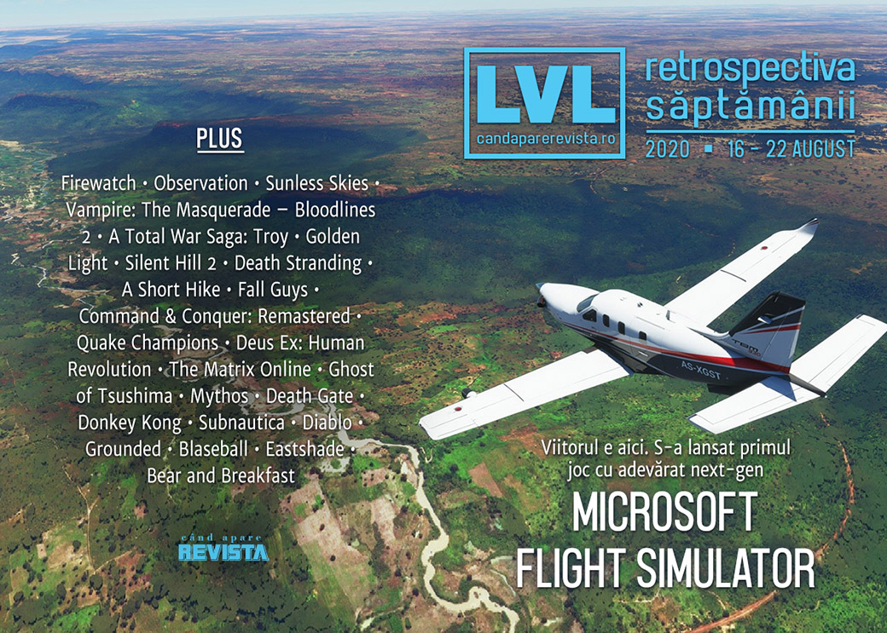

O săptămână plină de știri, în care conflictul dintre Epic și Apple se încinge, dispozitivile Oculus vor necesita un cont Facebook, iar Paradox renunță la doi oameni cheie din echipa **Vampire: The Masquerade – Bloodlines 2**. Pe lângă acestea, s-au lansat două jocuri îndelung așteptate, **Microsoft Flight Simulator** și **Battletoads**, au fost anunțate două noi jocuri ~~Batman~~ în „universul Arkham” plus un nou joc românesc: **Bear and Breakfast**.

Linkuri rapide:

* [Știri](#știri)
* [Articole (critică, dev, design)](#articole-critică-dev-design)
* [Made în România](#made-în-românia)
* [Anunțuri şi lansări de jocuri](#anunţuri-şi-lansări-de-jocuri)
* [Prăvălii de jocuri](#prăvălii-de-jocuri)

## Știri

* Disputa dintre Epic și Apple ia amploare:
  * Epic a deschis o nouă acțiune la tribunal și a depus noi documente, conform cărora Apple amenință să interzică uneltele de acces și dezvoltare ale Epic de pe platformele iOS și Mac, ceea ce ar afecta nu doar jocul Fortnite, dar și toate jocurile care folosesc Unreal Engine. ([Ars Technica](https://arstechnica.com/gaming/2020/08/impending-apple-ban-an-existential-threat-to-the-unreal-engine-epic-says/), [Shacknews](https://www.shacknews.com/article/119829/apple-to-terminate-all-epic-games-developer-accounts-and-cut-off-ios-and-mac-dev-tool-access), [VideoGamesChronicle](https://www.videogameschronicle.com/news/fortnite-legal-battle-escalates-as-apple-threatens-unreal-engine-support/), [Variety](https://variety.com/2020/digital/news/epic-games-apple-cut-off-developer-access-1234737772/), [Gamasutra](https://www.gamasutra.com/view/news/368364/Apple_to_revoke_Epics_dev_tools_including_those_used_for_Unreal_Engine.php)) Drept urmare, Epic solicită un ordin de restricție pentru a bloca o astfel de acțiune din partea Apple. ([Kotaku](https://kotaku.com/epic-asks-court-to-prevent-apple-from-blocking-fortnite-1844753107), [RPS](https://www.rockpapershotgun.com/2020/08/17/epic-are-asking-us-court-to-prevent-apple-from-removing-fortnite-and-unreal-engine-access), [Eurogamer](https://www.eurogamer.net/articles/2020-08-17-epic-injunction-says-itll-be-irreparably-harmed-by-apples-actions-following-fortnite-stunt), [Gamasutra](https://www.gamasutra.com/view/news/368367/Epic_asks_court_to_block_Apples_retaliation_as_Fortnite_Unreal_Engine_face_consequences.php), [PC Gamer](https://www.pcgamer.com/epic-seeks-restraining-order-against-apples-devastating-response-to-lawsuit/))
  * Drept răspuns, Apple dezvăluie că Epic a cerut tratament preferințial printr-o serie de emailuri înainte de a introduce metode plată alternative în Fortnite. ([The Verge](https://www.theverge.com/2020/8/21/21377660/apple-fortnite-epic-antitrust-lawsuit-in-app-purchases-special-deal), [Kotaku](https://kotaku.com/apple-court-filing-says-epic-asked-for-special-deal-bef-1844807731), [VideoGamesChronicle](https://www.videogameschronicle.com/news/apple-accuses-epic-of-making-a-deliberate-choice-to-cheat-us-in-pursuit-of-special-deal/))
  * Epic organizează un eveniment special în Fortnite având ca tematică disputa cu Fortnite. ([VideoGamesChronicle](https://www.videogameschronicle.com/news/epic-is-holding-a-fortnite-event-themed-around-its-apple-lawsuit/), [Shacknews](https://www.shacknews.com/article/119910/epic-cranks-the-cringe-in-its-apple-battle-with-the-freefortnite-cup-tart-tycoon-skin), [GamesIndustry.biz](https://www.gamesindustry.biz/articles/2020-08-21-epic-games-turns-apple-dispute-into-fortnite-event))

* Și tot săptămâna aceasta, Apple devine prima companie din SUA care depășește o valoare de piață de 2 trilioane (!) de dolari. ([GamesIndustry.biz](https://www.gamesindustry.biz/articles/2020-08-20-apple-market-value-tops-usd2tn), [Gamasutra](https://www.gamasutra.com/view/news/368575/Apple_reaches_2_trillion_market_valuation_as_legal_battle_with_Epic_rages_on.php), [Shacknews](https://www.shacknews.com/article/119871/apple-inc-aapl-tops-2-trillion-market-capitalization))

* Facebook anunță că toate dispozitivele VR Oculus noi vor necesita conturi de Facebook, iar utilizatorii existenți vor avea o perioadă de 2 ani să facă tranziția de la contul Oculus la unul Facebook. ([Shacknews](https://www.shacknews.com/article/119858/facebook-accounts-required-for-new-oculus-users-starting-in-october-existing-users-by-2023), [VideoGamesChronicle](https://www.videogameschronicle.com/news/all-future-oculus-devices-will-require-a-facebook-account/), [Eurogamer](https://www.eurogamer.net/articles/2020-08-18-oculus-making-facebook-accounts-mandatory-for-all-new-vr-headset-users-in-october), [Kotaku](https://kotaku.com/oculus-vr-devices-will-soon-require-facebook-accounts-1844766526))
* Un film Firewatch e în producție. ([Shacknews](https://www.shacknews.com/article/119833/firewatch-movie-in-development-from-blindspotting-producers), [Destructoid](https://www.destructoid.com/stories/indie-producer-fans-the-flames-of-firewatch-movie-600870.phtml), [Escapist](https://www.escapistmagazine.com/v2/firewatch-to-be-adapted-into-a-feature-film/))
* Numărul de „consumatori” de jocuri video la nivel global a depășit 3 miliarde, aproximativ 40% din populația planetei, jumătate din aceștia jucându-se exlusiv pe dispozitive mobile. ([DFC Intelligence](https://www.dfcint.com/dossier/global-video-game-consumer-population/))

* Paradox concediază doi oameni-cheie din echipa **Vampire: The Masquerade – Bloodlines 2**: Brian Mitsoda (_lead narrative designer_ și fost scenarist principal al primului joc) și pe Ka’ai Cluney (creative director), fără să ofere un motiv public. ([Escapist](https://www.escapistmagazine.com/v2/brian-mitsoda-kaai-cluney-have-been-removed-from-vampire-the-masquerade-bloodlines-2/), [Kotaku](https://kotaku.com/original-writer-on-vampire-the-masquerade-bloodlines-1844776074), [PC Gamer](https://www.pcgamer.com/vampire-the-masquerade-bloodlines-2-fires-lead-writer-brian-mitsoda-together-with-creative-director), [RPS](https://www.rockpapershotgun.com/2020/08/19/brian-mitsoda-has-been-fired-as-narrative-lead-on-bloodlines-2))

* Rocksteady se confruntă cu acuzații de sexism după publicarea de către The Guardian a unei scrisori interne din 2018 semnată de 10 angajate ale studioului care semnala diverse probleme la locul de muncă. ([Kotaku](https://kotaku.com/report-batman-developer-rocksteady-accused-of-failing-1844760814), [Shacknews](https://www.shacknews.com/article/119843/rocksteady-letter-alleges-years-of-inaction-over-studio-wide-sexual-harassment-toxicity), [RPS](https://www.rockpapershotgun.com/2020/08/19/batman-arkham-devs-rocksteady-accused-of-failing-to-address-sexual-harrassment/), [Gamasutra](https://www.gamasutra.com/view/news/368452/In_2018_women_came_forward_about_misconduct_at_Rocksteady__and_were_ignored.php)) Drept răspuns, studioul afirmă că între timp a rezolvat problemele ridicate și că scrisoarea publicată nu mai reflectă realitatea. ([Kotaku](https://kotaku.com/batman-arkham-developer-rocksteady-responds-to-harassme-1844807685), [GamesIndustry.biz](https://www.gamesindustry.biz/articles/2020-08-19-rocksteady-releases-employee-letter-defending-it-from-harassment-accusations), [Gamasutra](https://www.gamasutra.com/view/news/368697/Rocksteady8364_s_response_to_claims_of_inaction_outlines_past_and_future_antiharassment_plans.php), [GamesIndustry.biz](https://www.gamesindustry.biz/articles/2020-08-21-rocksteady-responds-to-sexism-accusations-again))

* Ubisoft nu va mai include discuri fizice în edițiile de colecție ale viitoarelor jocuri pentru Xbox, începând cu Far Cry 6, Watch Dogs: Legion și Assassin's Creed Valhalla. ([Escapist](https://www.escapistmagazine.com/v2/ubisoft-assassins-creed-valhalla-far-cry-6-watch-dogs-legion-xbox-collectors-editions-no-physical-disc/), [Polygon](https://www.polygon.com/2020/8/21/21396085/assassins-creed-valhalla-collectors-edition-far-cry-6-watch-dogs-legion-xbox-one-ps4-ps5-series-x), [Eurogamer](https://www.eurogamer.net/articles/2020-08-22-ubisoft-ditches-physical-game-discs-for-its-xbox-collectors-editions-in-the-uk))

## Articole (critică, dev, design)

* [Getting off the Road: the apocalypse games of Cormac McCarthy](https://www.eurogamer.net/articles/2020-08-03-the-apocalypse-games-of-cormac-mccarthy) (Eurogamer)
* [Floating Like a Butterfly](https://intothespine.com/2020/08/18/floating-like-a-butterfly/) (Into The Spine)
* [Opinion: Game criticism needs to do better](https://liftoffmag.com/opinion-game-criticism-needs-to-do-better/) (Liftoff!)

---

### Actualitate
* [Why the Facebookening of Oculus VR is bad for users, devs, competition](https://arstechnica.com/gaming/2020/08/why-the-facebookening-of-oculus-vr-is-bad-for-users-devs-competition/) (Ars Technica)

#### Epic vs. Apple/Google
* [Why Epic Games and Fortnite Will Make Apple Pay for Apple Pay](https://www.escapistmagazine.com/v2/why-epic-games-and-fortnite-will-make-apple-pay-for-apple-pay/) (Escapist)
* [With FreeFortnite Cup, Epic Continues Dragging Players Into Its Anti-Apple Crusade](https://kotaku.com/with-freefortnite-cup-epic-continues-dragging-players-1844805937) (Kotaku)

---

### _Not-a-review_
* [So Glad I Finally Discovered The Sci-Fi Puzzle Adventure Observation](https://kotaku.com/so-glad-i-finally-discovered-the-sci-fi-puzzle-adventur-1844767364) (Kotaku)
* [The New Total War Is Not A Complete Mess](https://kotaku.com/the-new-total-war-is-not-a-complete-mess-1844745994) (Kotaku)
* [Take it from me, Microsoft Flight Simulator captures the joy of real flying](https://www.theguardian.com/games/2020/aug/21/microsoft-flight-simulator-real-flying) (The Guardian)
* [The Horrifying Solace of Sunless Skies](https://intothespine.com/2020/08/19/sunless-skies-solace/) (Into The Spine)
* [I&#039;m Terrified of Understanding Golden Light](https://intothespine.com/2020/08/16/im-terrified-of-understanding-golden-light/) (Into The Spine)
* [Car. Obsessional Analysis of Silent Hill 2](https://videoda.me/car-62bd42773479) (Medium/Videodame)
* [In Death Stranding, Loneliness Is More Powerful Than Connection](https://www.escapistmagazine.com/v2/in-death-stranding-loneliness-is-more-powerful-than-connection/) (Escapist)
* [A Short Hike captures the phsyicality and social interactions of hiking we&#039;re missing](https://liftoffmag.com/a-short-hike-captures-the-phsyicality-and-social-interactions-of-hiking-were-missing/) (Liftoff!)
* [The silly, chaotic, random design behind Fall Guys’ success](https://www.polygon.com/2020/8/20/21375212/fall-guys-game-design-randomness-esports-success-sales) (Polygon)
* [Fall Guys Devs Never Thought of It as a Battle Royale - Until They Did](https://www.fanbyte.com/features/fall-guys-devs-never-thought-of-it-as-a-battle-royale-until-they-did/) (Fanbyte)
* [The Half-Real World of Ghost of Tsushima](https://foreignpolicy.com/2020/08/20/the-half-real-world-of-ghost-of-tsushima/) (Foreign Policy)

---

### Industrie
* [Command & Conquer Remastered Collection was a success - so what's next for the revived RTS franchise?](https://www.eurogamer.net/articles/2020-08-17-command-and-conquer-remastered-collection-was-a-success-so-whats-next-for-the-revived-rts) (Eurogamer)
* [Game refunds &amp; the hidden costs of &#x27;getting to net&#x27; on Steam](https://gamediscoverability.substack.com/p/game-refunds-and-the-hidden-costs) (Game Discoverability Now!)
* [The silver linings in the clouds of 2020](https://www.gamesindustry.biz/articles/2020-08-20-the-silver-linings-in-2020s-clouds-opinion) (GamesIndustry.biz)

---

### Istorie, retrospectivă
* [The Golden Age of computer user groups](https://arstechnica.com/information-technology/2020/08/the-golden-age-of-computer-user-groups/) (Ars Technica)
* [Quake Champions Is Too Good to Just Be Forgotten](https://www.escapistmagazine.com/v2/quake-champions-is-too-good-to-just-be-forgotten/) (Escapist)
* [Why Deus Ex: Human Revolution Is Being Forgotten](https://www.escapistmagazine.com/v2/why-deus-ex-human-revolution-is-being-forgotten/) (Escapist)
* [I’m Sorry To Say Laurence Fishburne Died In The 2005 Matrix MMORPG](https://kotaku.com/i-m-sorry-to-say-laurence-fishburne-died-in-the-2005-ma-1844803953) (Kotaku)
* [The Game Archaeologist: Flagship’s Mythos](https://massivelyop.com/2020/08/22/the-game-archaeologist-flagships-mythos/) (Massively OP)
* [Death Gate](https://www.filfre.net/2020/08/death-gate/) (The Digital Antiquarian)
* [Donkey Kong [1981]](https://arcadeidea.wordpress.com/2020/08/17/donkey-kong-1981/) (Arcade Idea)
* [Epic Games’ App Store Battle: Why its Past Defines its Present](https://tedium.co/2020/08/18/epic-games-history-app-store-battle/) (Tedium)

---

### Dev, making of, mecanici
* [Xbox Series X silicon: the Hot Chips 2020 breakdown](https://www.eurogamer.net/articles/digitalfoundry-2020-xbox-series-x-silicon-hot-chips-analysis) (Eurogamer)
* [Ray tracing has failed to deliver on its promise](https://www.pcgamer.com/ray-tracing-has-failed-to-deliver-on-its-promise/) și [Actually, ray tracing is just getting started](https://www.pcgamer.com/actually-ray-tracing-is-just-getting-started/) (PC Gamer)
* [How Microsoft Flight Simulator Makes The Ground Look So Good](https://kotaku.com/how-microsoft-flight-simulator-makes-the-ground-look-so-1844753260) (Kotaku)
* [Checking the Score: Tsushima&#039;s Japanese Folk-Fusion Score Mythologizes The Ghost](https://hardcoregamer.com/2020/08/17/checking-the-score-tsushimas-japanese-folk-fusion-score-mythologizes-the-ghost/385172/) (Hardcore Gamer)
* [An extended interview with Subnautica director Charlie Cleveland](https://arstechnica.com/gaming/2020/08/an-extended-interview-with-subnautica-director-charlie-cleveland/) (Ars Technica)
* [War Stories: Diablo’s loot lottery was almost a turn-based affair](https://arstechnica.com/gaming/2020/08/war-stories-how-diablo-was-almost-a-turn-based-strategy-game/) (Ars Technica)
* [Diablo 2: The human cost of making a classic](https://www.gamesindustry.biz/articles/2020-08-21-diablo-2-the-human-cost-of-making-a-classic) (GamesIndustry.biz)
* [A day in the life of Grounded&#8217;s ants: Obsidian talk eggs, pheromones and their incoming queen](https://www.rockpapershotgun.com/2020/08/21/a-day-in-the-life-of-groundeds-ants-obsidian-talk-eggs-pheromones-and-their-incoming-queen/) (RPS)
* [Making Blaseball, at our mercy](https://www.gamesindustry.biz/articles/2020-08-20-making-blaseball-at-our-mercy) (GamesIndustry.biz)
* [How  Fall Guys ' bouncing, bumbling beans gave the game its soul](https://www.gamasutra.com/view/news/368688/How_Fall_Guys_bouncing_bumbling_beans_gave_the_game_its_soul.php) (Gamasutra)
* [What Everyone Gets Wrong about Soulslike Design](https://www.gamasutra.com/blogs/JoshBycer/20200820/368541/What_Everyone_Gets_Wrong_about_Soulslike_Design.php) (Gamasutra)
* [Postmortem: Eastshade](https://gamasutra.com/blogs/DannyWeinbaum/20200817/368294/Postmortem_Eastshade.php) (Gamasutra)

---

### Design, world-building, artă
* [The Storm-Cloud of Death Stranding](https://uppercutcrit.com/the-storm-cloud-of-death-stranding) (Uppercut)
* [Game Box Art Critique August: Battletoads, EA Sports UFC 4, Samurai Jack: Battle Through Time](https://www.videogamer.com/features/game-box-art-critique-august-battletoads-ea-sports-ufc-4-samurai-jack-battle-through-time) (VideoGamer)
* [Game Art: Miriam Ross And Helen Perkins's Assassin's Creed Ulysses (2020)](https://www.gamescenes.org/2020/08/game-art-miriam-ross-and-helen-perkinss-ac-ulysses-2020.html) (GAMESCENES)

## Made în România

* Un interviu cu oamenii de la Tiny Trinket Games despre **Azuran Tales** și **Zoria: Age of Shattering**. ([Facebook Telekom Sport](https://www.facebook.com/groups/307481012723781?view=permalink&id=1882613438543856)
* Studioul Gummy Cat anunță un nou joc românesc, **Bear and Breakfast**, în cadrul Nintendo Indie World. ([Facebook RGDA](https://m.facebook.com/groups/307481012723781?view=permalink&id=1882613438543856))
* Kolibri Games, o subsidiară din Berlin a Ubisoft, care se ocupă de jocuri pentru dispozitive mobile, și-a deschis un studio în București. ([PocketGamer.biz](https://www.pocketgamer.biz/news/74244/kolibri-games-new-studio-romania/))

## Anunţuri şi lansări de jocuri

### Anunţate
* **Bear and Breakfast** ([Facebook RGDA](https://www.facebook.com/groups/THERGDA/permalink/1880338712104662/), [Shacknews](https://www.shacknews.com/article/119848/bear-and-breakfast-is-a-timed-console-exclusive-that-lets-you-transform-a-bb), [RPS](https://www.rockpapershotgun.com/2020/08/19/bear-and-breakfast-will-let-you-manage-an-adorable-forest-bb-next-year/))
* **Orwell’s Animal Farm** ([RPS](https://www.rockpapershotgun.com/2020/08/17/george-orwells-animal-farm-becoming-a-video-game-from-the-makers-of-reigns/))
* **Gotham Knights** ([PC Gamer](https://www.pcgamer.com/the-next-batman-game-is-gotham-knights-and-batmans-dead/))
* **Suicide Squad: Kill the Justice League** ([PC Gamer](https://www.pcgamer.com/warner-bros-reveals-suicide-squad-kill-the-justice-league/))

### Acum cu dată de lansare
* **Crysis Remastered**: 18 septembrie ([EGM](https://egmnow.com/crysis-remastered-gets-a-release-date-and-tech-preview-trailer))
* **Untitled Goose Game** ajunge pe Steam pe 23 septembrie, la pachet cu un mod de co-op ([Shacknews](https://www.shacknews.com/article/119857/untitled-goose-game-gets-steam-release-date-for-this-september))
* **Baldur’s Gate 3** intră în early access pe 30 septembrie ([VideoGamesChronicle](https://www.videogameschronicle.com/news/baldurs-gate-3s-early-access-has-slipped-to-september/))

### Amânate
* **Deathloop**: a doua parte a anului 2021 ([VideoGamesChronicle](https://www.videogameschronicle.com/news/arkane-delays-deathloop-to-the-second-quarter-of-2021/))
* **The Stanley Parable: Ultra Deluxe**: 2021 în loc de 2020 ([Destructoid](https://www.destructoid.com/stories/i-don-t-love-that-stanley-parable-ultra-deluxe-was-delayed-but-i-love-the-way-it-was-announced-600921.phtml))

### Lansate
* 18 august: **Microsoft Flight Simulator** ([Steam](https://store.steampowered.com/app/1250410/Microsoft_Flight_Simulator/), [Microsoft Store](https://www.microsoft.com/en-us/p/microsoft-flight-simulator-standard/9nxn8gf8n9ht))
* 18 august: **Mortal Shell** ([Epic Store](https://www.epicgames.com/store/en-US/product/mortal-shell/))
* 18 august: **Spiritfarer** ([Steam](https://store.steampowered.com/app/972660/Spiritfarer/), [gog.com](https://www.gog.com/game/spiritfarer))
* 18 august: **Bleach: Brave Souls** ([Steam](https://store.steampowered.com/app/1201240/BLEACH_Brave_Souls/))
* 18 august: **Rogue Legacy 2** (early access) ([Steam](https://store.steampowered.com/app/1253920/Rogue_Legacy_2/))
* 18 august: **Helheim Hassle** ([Steam](https://store.steampowered.com/app/1095120/Helheim_Hassle/))
* 20 august: **Peaky Blinders Mastermind** ([Steam](https://store.steampowered.com/app/1013310/Peaky_Blinders_Mastermind/))
* 20 august: **Battletoads** ([Steam](https://store.steampowered.com/app/1244950/Battletoads/), [Microsoft Store](https://www.microsoft.com/en-us/p/battletoads/9n7gcf5sgcxc))
* 20 august: **Roboquest** ([Steam](https://store.steampowered.com/app/692890/Roboquest/))
* 21 august: **Inmost** ([Steam](https://store.steampowered.com/app/938560/INMOST/), [gog.com](https://www.gog.com/game/inmost))
* 21 august: **New Super Lucky's Tale** ([Steam](https://store.steampowered.com/app/1038300/New_Super_Luckys_Tale/))
* 21 august: **Samurai Jack: Battle Through Time** ([Steam](https://store.steampowered.com/app/1150590/Samurai_Jack_Battle_Through_Time/))
* 21 august: **Bake 'n Switch** ([Steam](https://store.steampowered.com/app/1080410/Bake_n_Switch/))

## Prăvălii de jocuri

### Știri
* [Valve forbids developers to promote other platforms on Steam](https://www.gamesindustry.biz/articles/2020-08-18-valve-forbids-developers-to-promote-other-platforms-on-steam) (GamesIndustry.biz)

### Update catalog
* [Game Pass is adding Resident Evil 7, Crusader Kings 3 and more](https://www.videogameschronicle.com/news/game-pass-is-adding-resident-evil-7-crusader-kings-3-and-more/) (VideoGamesChronicle)
* [Red Dead Redemption 2 to leave Xbox Game Pass next month](https://egmnow.com/red-dead-redemption-2-to-leave-xbox-game-pass-next-month/) (EGM)

### Jocuri gratis și free weekends
* [Enter the Gungeon and God’s Trigger are now free on PC](https://egmnow.com/enter-the-gungeon-and-gods-trigger-are-now-free-on-pc/) (EGM)
* [Grid Rangers Is a Free, Frenetic Puzzler Where Every Move Counts](https://www.escapistmagazine.com/v2/grid-rangers-is-a-free-frenetic-puzzler-where-every-move-counts/) (Escapist)

### Reduceri și promoții
* [Weekend PC Download Deals for Aug. 21: DC Fandome](https://www.shacknews.com/article/119919/weekend-pc-download-deals-for-aug-21-dc-fandome) (Shacknews)
* [Weekend Console Download Deals for Aug. 21: Nintendo Share the Fun Sale](https://www.shacknews.com/article/119918/weekend-console-download-deals-for-aug-21-nintendo-share-the-fun-sale) (Shacknews)

---

{}
**Retrospectiva săptămânii** este rubrica duminicală în care trecem în revistă evenimentele săptămânii de pe frontul de gaming: știri şi articole (scrise de alții, bineînțeles, că e mai ușor aşa), industrie, lansări, oferte de jocuri, toate numai de savurat la cafeaua de duminică dimineața.

De asemenea, rubrica e deschisă oricui vrea și poate contribui. Dacă ai citit vreun articol sau vreo știre interesantă și crezi că merită incluse în retrospectiva săptămânii, te așteptăm pe forum pe unul dintre topicurile dedicate: [Știri](https://forum.candaparerevista.ro/viewtopic.php?f=4&t=46), [Articole](https://forum.candaparerevista.ro/viewtopic.php?f=4&t=206), [Gaming România](https://forum.candaparerevista.ro/viewtopic.php?f=4&t=1622)].
{}
