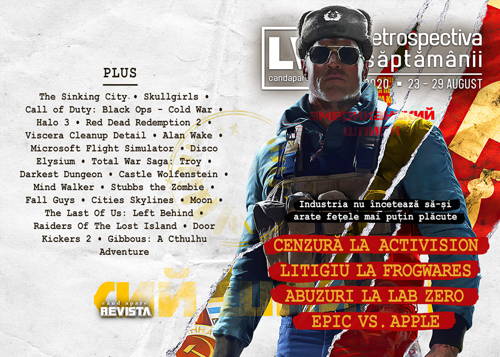

Noi scandaluri și controverse se ițesc în industrie, adăugându-se celor deja existente, piața jocurilor din Europa produce o mulțime de bani, a început ultimul mare eveniment de gaming al verii, Gamescom (găsiți rezumatul în [articolul nostru despre Vara Jocurilor]()) și care a venit cu o mulțime de anunțuri noi (precum un nou joc **Sam & Max** și un remake **Pharaoh**), s-a lansat **Wasteland 3**, iar **Gibbous: A Cthulhu Adventure** va primi o continuare.

Linkuri rapide:

* [Știri](#știri)
* [Articole (critică, dev, design)](#articole-critică-dev-design)
* [Made în România](#made-în-românia)
* [Anunțuri şi lansări de jocuri](#anunţuri-şi-lansări-de-jocuri)
* [Prăvălii de jocuri](#prăvălii-de-jocuri)

## Știri

Continuă știrile în disputa dintre Epic și Apple:
 
* Microsoft intervine în sprijinul Epic Games în disputa cu Apple, depunând o declarație la tribunal cu privire la blocarea suportului pentru jocurile bazate pe Unreal Engine. ([Ars Technica](https://arstechnica.com/gaming/2020/08/microsoft-backs-epic-against-apple-in-legal-fight-over-unreal-engine-on-ios/), [GamesIndustry.biz](https://www.gamesindustry.biz/articles/2020-08-24-microsoft-files-statement-supporting-epic-games-against-apple), [VideoGamesChronicle](https://www.videogameschronicle.com/news/xbox-comes-out-in-support-of-epics-apple-restraining-order/), [The Guardian](https://www.theguardian.com/technology/2020/aug/24/microsoft-joins-court-battle-between-apple-and-fortnite-maker-epic))
* Iar o primă decizie a judecătorului la cererea Epic Games interzice ca Apple să poată bloca accesul la Unreal Engine.  ([GamesIndustry.biz](https://www.gamesindustry.biz/articles/2020-08-25-epic-wins-restraining-order-against-apple-but-fortnite-remains-blocked), [Ars Technica](https://arstechnica.com/gaming/2020/08/judge-issues-restraining-order-protecting-unreal-engine-development-on-ios/), [VideoGamesChronicle](https://www.videogameschronicle.com/news/judge-rules-that-epic-apple-battle-should-not-create-havoc-to-games-industry-bystanders/), [Shacknews](https://www.shacknews.com/article/119956/judge-rejects-restoring-fortnite-on-app-store-temporarily-limits-apple-block-on-unreal-engine))
* Apple închide contul de App Store al Epic pentru Fortnite, respectând însă decizia judecătorului și lăsând activ contul de dezvoltator pentru Unreal Engine.  ([Reuters](https://www.reuters.com/article/us-apple-epic-games/apple-terminates-epic-games-account-on-app-store-idUSKBN25O2YM), [Bloomberg](https://www.bloomberg.com/news/articles/2020-08-28/apple-terminates-epic-s-developer-account-in-midst-of-lawsuit), [Ars Technica](https://arstechnica.com/gaming/2020/08/apple-terminates-epics-app-store-access-following-fortnite-dispute/), [Variety](https://variety.com/2020/digital/news/apple-terminates-fortnite-app-store-epic-games-developer-1234752913/))
* Iar cu ultimul update pentru versiunea de iOS chiar înainte ca Apple să blocheze complet accesul, Epic introduce un costum nou în Fortnite, respectiv personajul cu cap de măr putred folosit în parodia la reclama „1984”. ([VideoGamesChronicle](https://www.videogameschronicle.com/news/epics-final-fortnite-ios-update-adds-a-lawsuit-parody-character/))

### Alte știri
* Jocul **The Sinking City** a fost retras de dezvoltatorul său, Frogwares (care deține și IP-ul) din majoritatea magazinelor digitale în urma unei dispute cu publisher-ul Nacon. ([GamesIndustry.biz](https://www.gamesindustry.biz/articles/2020-08-25-the-sinking-city-pulled-from-stores-amid-legal-dispute-between-frogwares-and-naco), [Gamasutra](https://www.gamasutra.com/view/news/368812/The_Sinking_City_yanked_from_stores_in_dispute_over_publishing_rights.php)). Totodată, Frogwares detaliază într-o scrisoare deschisă motivele pentru care s-a ajuns la litigiu ([VideoGamesChronicle](https://www.videogameschronicle.com/news/the-sinking-citys-developer-exposes-huge-publisher-row-leading-to-store-removal/), [PC Gamer](https://www.pcgamer.com/the-sinking-city-disappeared-from-steam-earlier-this-year-due-to-a-messy-legal-dispute/), [Kotaku](https://kotaku.com/sinking-city-developer-says-game-was-pulled-from-stores-1844840996)), motive pe care publisherul Nacon le respinge. ([Game World Observer](https://gameworldobserver.com/2020/08/27/nacon-emphatically-rejects-frogwares-claims/))

* Scandal și la studioul Lab Zero Games, creatorul jocurilor Skullgirls și Indivisible, unde mai mulți angajați au părăsit studioul acuzând un comportament inadecvant și abuzuri din partea fondatorului studioului, Mike Zaimont.  ([Gamasutra](https://www.gamasutra.com/view/news/368771/Devs_exiting_Lab_Zero_Games_blame_owners_persistent_pattern_of_misconduct.php), [PC Gamer](https://www.pcgamer.com/multiple-employees-resign-over-skullgirls-studio-heads-behavior/), [RPS](https://www.rockpapershotgun.com/2020/08/25/several-people-leave-skullgirls-devs-lab-zero-accusing-owner-of-inappropriate-behaviour/), [Kotaku](https://kotaku.com/workers-leave-skullgirls-developer-over-studio-head-s-b-1844830307), [GamesIndustry.biz](https://www.gamesindustry.biz/articles/2020-08-25-developers-cut-ties-with-lab-zero-accuse-lead-designer-of-abuse)). Iar compania care deține licența Skullgirls se solidarizează cu angajații. ([Destructoid](https://www.destructoid.com/stories/skullgirls-ip-holder-distances-itself-from-lab-zero-games-following-staff-accusations-of-toxic-behavior-601586.phtml))

* Activision cenzurează un trailer pentru proaspăt anunțatul **Call of Duty: Black Ops - Cold War** după critici venite din partea Chinei și elimină mai multe secvențe, inclusiv una ce înfățișa protestele din Piața Tiananmen din 1989. ([Shacknews](https://www.shacknews.com/article/119965/call-of-duty-black-ops-cold-war-trailer-censored-worldwide-removing-tiananmen-square-footage), [PC Gamer](https://www.pcgamer.com/activision-removes-tiananmen-square-video-from-call-of-duty-black-ops-cold-war-trailer/), [Eurogamer](https://www.eurogamer.net/articles/2020-08-25-activision-removes-tiananmen-square-footage-in-call-of-duty-black-ops-cold-war-trailer-after-china-ban))
* Sony deschide precomenzile pentru PlayStation 5, deși consola nu are încă preț sau dată de lansare. ([GamesIndustry.biz](https://www.gamesindustry.biz/articles/2020-08-27-sony-begins-invite-only-one-per-customer-ps5-pre-orders), [Destructoid](https://www.destructoid.com/stories/playstation-now-has-a-ps5-pre-order-registration-site-601736.phtml), [Eurogamer](https://www.eurogamer.net/articles/2020-08-27-you-can-now-sign-up-for-a-playstation-5-pre-order-without-knowing-the-price), [Kotaku](https://kotaku.com/sony-is-offering-ps5-preorders-only-you-dont-know-how-1844861283))
* Unity lansează o platformă de distribuție pentru aplicații mobile de Android destinate altor magazine digitale decât Google Play. ([GamesIndustry.biz](https://www.gamesindustry.biz/articles/2020-08-28-unity-launches-android-distribution-platform-globally), [Gamasutra](https://www.gamasutra.com/view/news/369143/Unity_debuts_new_tool_to_help_devs_submit_games_to_multiple_Android_storefronts.php))
* Conform unui raport al organizației ISFE ce reprezintă industria jocurilor video din Europa, piața europeană de jocuri a generat venituri de aproape 22 miliarde de euro în 2019, din care 16% din zona PC, iar 43% de la console.
* Iar un alt raport arată cum industria poloneză de jocuri a generat venituri de aproape 500 de milioane de euro anul trecut, din care un sfert numai de la CD Projekt. ([GamesIndustry.biz](https://www.gamesindustry.biz/articles/2020-08-26-polish-games-industry-is-worth-nearly-500-million), [Game World Observer](https://gameworldobserver.com/2020/08/26/poland/), [PCGamesInsider.biz](https://www.pcgamesinsider.biz/news/71472/polish-games-generated-over-470m-in-2019/))

## Articole (critică, dev, design)

* [Train sims have come a long way since I got cautioned for tooting in public](https://www.eurogamer.net/articles/2020-08-26-train-sims-have-come-a-long-way-since-i-got-cautioned-for-tooting-in-public) (Eurogamer)
* [The Gamification of Games](https://reallifemag.com/the-gamification-of-games/) (Real Life Magazine)
* [How an Alleged Dick in a &#x27;Halo 3&#x27; Trailer Started an Emergency at Bungie](https://www.vice.com/en_us/article/7kpqy9/how-an-alleged-dick-in-a-halo-3-trailer-started-an-emergency-at-bungie) (Vice)
* [The Path to Destroying Capitalism Might Go Through a Software License](https://www.vice.com/en_us/article/5dzam3/the-path-to-destroying-capitalism-might-go-through-a-software-license) (Vice)
* [Not all games need open worlds - here&#39;s why](https://wireframe.raspberrypi.org/articles/why-not-all-games-need-open-worlds) (Wireframe magazine)

---

### Actualitate
* [Apple Has Finally Gotten Too Big for Its Britches](https://gizmodo.com/apple-has-finally-gotten-too-big-for-its-britches-1844825460) (Gizmodo)

---

### _Not-a-review_
* [Idle Animations: Denying the Reaper in Red Dead Redemption 2](https://sidequest.zone/2020/08/27/idle-animations-denying-the-reaper-in-red-dead-redemption-2/) (Sidequest)
* [From Office Cubicle to the Janitorial Service](https://videoda.me/from-office-cubicle-to-the-janitorial-service-14778d671ef2) (Medium)
* [Microsoft Flight Simulator players are flying into Hurricane Laura](https://www.theverge.com/2020/8/27/21403769/hurricane-laura-microsoft-flight-simulator) (The Verge)
* [Why &#x27;Total War Saga: Troy&#x27; Is About the Wrong War](https://www.vice.com/en_us/article/akzq55/why-total-war-saga-troy-is-about-the-wrong-war) (Vice)
* [The Many Layers of Alan Wake](https://www.pastemagazine.com/games/alan-wake/the-many-layers-of-alan-wake/) (Paste)
* [Darkest Dungeon is a Landlord Simulator](https://www.fanbyte.com/features/darkest-dungeon-is-a-landlord-simulator/) (Fanbyte)

---

### Industrie
* [Craft, art, and science: Three ways of teaching game design](https://www.gamesindustry.biz/articles/2020-08-27-craft-art-and-science-three-ways-of-teaching-game-design) (GamesIndustry.biz)
* [Gaming the Kickstarter campaign machine](https://wireframe.raspberrypi.org/articles/gaming-the-kickstarter-campaign-machine) (Wireframe magazine)

---

### Istorie, retrospectivă
* [Castle Wolfenstein [1981]](https://arcadeidea.wordpress.com/2020/08/24/castle-wolfenstein-1981/) (Arcade Idea)
* [Mind Walker](https://obscuritory.com/action/mind-walker/) (The Obscuritory)
* [An Impassioned Defense of Stubbs the Zombie](https://www.usgamer.net/articles/stubbs-the-zombie-rebel-without-a-pulse-retrospective) (USgamer)

---

### Dev, making of, mecanici
* [Disco Elysium: How a Few Friends from Estonia Created 2019’s Most Original Game](https://www.fandom.com/articles/disco-elysium-interview) (Arcade Idea)
* [How did Fall Guys get it so right?](https://www.gamasutra.com/blogs/SimonCarless/20200824/368763/How_did_Fall_Guys_get_it_so_right.php) (Gamasutra)
* [What&#8217;s Wrong With Quidditch? &#8211; (Fantasy Game Design Studies)](https://remptongames.com/2020/08/24/whats-wrong-with-quidditch-fantasy-game-design-studies/) (Rempton Games)
* [How Traffic Works in Cities: Skylines](https://www.gamasutra.com/blogs/TommyThompson/20200827/368667/How_Traffic_Works_in_Cities_Skylines.php) (Gamasutra)
* [The Story of Moon, the &quot;Anti-RPG&quot; That Inspired Undertale](https://www.usgamer.net/articles/the-story-of-moon-the-anti-rpg-that-inspired-undertale) (USgamer)
* [Intensity and pacing in The Last Of Us: Left Behind](https://wireframe.raspberrypi.org/articles/intensity-and-pacing-in-the-last-of-us-left-behind) (Wireframe magazine)

---

### Design, world-building, artă
* [Road Trip](https://kotaku.com/road-trip-1844823097) (Kotaku)
* [Just Stalkin&#x27; Around](https://kotaku.com/just-stalkin-around-1844874346) (Kotaku)

## Made în România

* **Raiders Of The Lost Island** iese din early access pe 2 septembrie. ([Steam](https://store.steampowered.com/newshub/app/867980/view/2870436681449877644), [Steam Community](https://www.facebook.com/events/316152129595140/))
* S-a încheiat concursul EuroPlay 2020, la care România a fost reprezentată de **Door Kickers 2: Task Force North**. ([Ukie](https://ukie.org.uk/EUROPLAYROUNDUP))
* **Gibbous: A Cthulhu Adventure** va avea o continuare. Noul jocul e la început și nu a fost încă anunțat oficial. ([left click Ghinea](https://leftclickghinea.ro/fastbits-2/))
* [Cum se vede România din noul Microsoft Flight Simulator](https://mindcraftstories.ro/tehnologie/cum-se-vede-romania-din-noul-microsoft-flight-simulator/) (Mindcraft Stories)
* [1994, ultimul an fără internet pentru români, devine joc video](https://mindcraftstories.ro/cultura/1994-ultimul-an-fara-internet-pentru-romani-devine-joc-video/) (Mindcraft Stories)

## Anunţuri şi lansări de jocuri
### Anunţate
* **The Witcher: Monster Slayer**, un joc mobil pentru AR ([Shacknews](https://www.shacknews.com/article/119980/the-witcher-monster-slayer-augmented-reality-game-announced))
* **Puyo Puyo Tetris 2** ([Shacknews](https://www.shacknews.com/article/119981/puyo-puyo-tetris-2-revealed-during-nintendo-direct-mini-partner-showcase-presentation))
* **Wonder Boy: Asha in Monster World** ([Eurogamer](https://www.eurogamer.net/articles/2020-08-24-original-wonder-boy-director-returning-for-new-series-entry-asha-in-monster-world))
* **Call of Duty: Black Ops Cold War** ([The Escapist](https://www.escapistmagazine.com/v2/call-of-duty-black-ops-cold-war-trailer-next-gen-pricing-officially-revealed/))
* **Aragami 2** ([Shacknews](https://www.shacknews.com/article/120055/aragami-2-reveal-trailer-teases-co-op-stealth-action-coming-in-2021))

#### Anunțate la Gamescom
* **Unknown 9: Awakening** ([Destructoid](https://www.destructoid.com/stories/unknown-9-awakening-announced-for-pc-and-next-gen-consoles-601811.phtml))
* **Sam & Max: This Time It's Virtual!** ([Eurogamer](https://www.eurogamer.net/articles/2020-08-27-sam-and-max-are-returning-in-new-vr-game-this-time-its-virtual))
* **Bridge Constructor: The Walking Dead** ([PC Gamer](https://www.pcgamer.com/bridge-constructor-the-walking-dead-is-the-years-weirdest-crossover))
* **Warhammer Age of Sigmar: Storm Ground** ([Destructoid](https://www.destructoid.com/stories/stormground-is-a-new-warhammer-game-and-it-s-coming-to-switch-601820.phtml))
* **Override 2: Super Mech League** ([Destructoid](https://www.destructoid.com/stories/override-2-super-mech-league-dukes-it-out-on-ps5-and-xbox-series-x-later-this-year-601828.phtml))
* **Lemnis Gate** ([Eurogamer](https://www.eurogamer.net/articles/2020-08-27-lemnis-gate-is-a-tactical-multiplayer-fps-about-manipulating-25-second-time-loops))
* **Medal of Honor: Above and Beyond** ([Destructoid](https://www.destructoid.com/stories/respawn-s-medal-of-honor-vr-game-actually-looks-pretty-damn-cool-601833.phtml))
* **Turrican Anthology** ([Eurogamer](https://www.eurogamer.net/articles/2020-08-28-turrican-returns-with-a-set-of-pricey-30th-anniversary-anthologies))
* **Pharaoh: A New Era** ([PC Gamer](https://www.pcgamer.com/pharoah-a-new-era-is-a-remake-of-the-1999-historical-city-builder/))
* **Sacred Fire** ([PC Gamer](https://www.pcgamer.com/sacred-fire-is-a-psychological-rpg-where-manipulation-and-emotions-are-key/))
* **War Mongrels** ([Wccf tech](https://wccftech.com/war-mongrels-is-a-new-wwii-real-time-tactics-game-from-destructive-creations/))

### Acum cu dată de lansare
* **Raiders Of The Lost Island** (iese din early access): 2 septembrie ([Steam](https://store.steampowered.com/newshub/app/867980/view/2870436681449877644))
* **Paradise Killer**: 4 septembrie ([Destructoid](https://www.destructoid.com/stories/paradise-killer-bringing-murder-mystery-and-sexy-skeletons-september-4-601674.phtml))
* **Hotshot Racing**: 10 septembrie ([Eurogamer](https://www.eurogamer.net/articles/2020-08-27-hotshot-racing-gets-a-release-date))
* **Age of Empires III: Definitive Edition**: 15 octombrie ([Destructoid](https://www.destructoid.com/stories/age-of-empires-iii-definitive-edition-is-out-in-october-601830.phtml))
* **Love**: 21 octombrie ([Eurogamer](https://www.eurogamer.net/articles/2020-08-28-rotating-apartment-puzzler-love-comes-to-steam-this-october))
* **Carto**: 27 octombrie ([Destructoid](https://www.destructoid.com/stories/carto-is-the-cool-puzzle-exploration-game-your-switch-deserves-601834.phtml))
* **Hitman 3**: 20 ianuarie ([Destructoid](https://www.destructoid.com/stories/hitman-3-launches-january-20-free-next-gen-upgrade-confirmed-601798.phtml))
* **Little Nightmares 2**: 11 februarie 2021 ([PC Gamer](https://www.pcgamer.com/i-want-to-protect-the-boy-with-the-paper-bag-head-in-little-nightmares-2-at-all-costs/))

### Amânate
* **Evil Genius 2** prima jumătate a lui 2021 în loc de 2020 ([Eurogamer](https://www.eurogamer.net/articles/2020-08-28-evil-genius-2-delayed-into-the-first-half-of-2021))
* **Chivalry 2**: 2021 în loc de 2020 ([DSOGaming](https://www.dsogaming.com/news/chivalry-2-has-been-delayed-until-2021/))
* **King’s Bounty 2**: 2021 în loc de 2020 ([GameSpace](https://www.gamespace.com/all-articles/news/kings-bounty-2-is-postponed-to-march-2021/))

### Lansate
* 25 august: **No Straight Roads** ([Epic Store](https://www.epicgames.com/store/en-US/product/no-straight-roads))
* 25 august: **Street Power Football** ([Steam](https://store.steampowered.com/app/1275760/Street_Power_Football/))
* 26 august: **Sheepo** ([Steam](https://store.steampowered.com/app/1281790/SHEEPO/))
* 27 august: **The Last Campfire** ([Epic Store](https://www.epicgames.com/store/en-US/product/the-last-campfire))
* 27 august: **Ancestors: The Humankind Odyssey** ([Steam](https://store.steampowered.com/app/536270/Ancestors_The_Humankind_Odyssey/))
* 27 august: **Control: AWE** (DLC) ([Epic Store](https://www.epicgames.com/store/en-US/product/control/awe))
* 27 august: **Control Ultimate Edition** ([Steam](https://store.steampowered.com/app/870780/Control_Ultimate_Edition/), [gog.com](https://www.gog.com/game/control_ultimate_edition))
* 27 august: **Tell Me Why: Chapter 1** ([Steam](https://store.steampowered.com/app/1180660/Tell_Me_Why/))
* 27 august: **Struggling** ([Steam](https://store.steampowered.com/app/1035560/Struggling/))
* 27 august: **Surgeon Simulator 2** ([Epic Store](https://www.epicgames.com/store/en-US/product/surgeon-simulator-2/home))
* 28 august: **Madden NFL 21** ([Steam](https://store.steampowered.com/app/1239520/Madden_NFL_21/))
* 28 august: **Wasteland 3** ([Steam](https://store.steampowered.com/app/719040/Wasteland_3/), [gog.com](https://www.gog.com/game/wasteland_3))
* 28 august: **Project Cars 3** ([Steam](https://store.steampowered.com/app/958400/Project_CARS_3/))
* 28 august: **Windbound** ([Steam](https://store.steampowered.com/app/1162130/Windbound/), [gog.com](https://www.gog.com/game/windbound))
* 28 august: **Captain Tsubasa: Rise of New Champions** ([Steam](https://store.steampowered.com/app/1163550/Captain_Tsubasa_Rise_of_New_Champions/))

## Prăvălii de jocuri
### Știri
* [Fall Guys Is The Most Downloaded PlayStation Plus Game Ever](https://kotaku.com/fall-guys-is-the-most-downloaded-playstation-plus-game-1844852428) (Kotaku)
* [Steam gets a platform-wide chat filter in new Steam Labs experiment](https://www.gamesindustry.biz/articles/2020-08-27-steam-gets-a-platform-wide-chat-filter-in-new-steam-labs-experiment) (GamesIndustry.biz)

### Articole
* [Steam chat tool removes slurs, but it should remove the slur users](https://venturebeat.com/2020/08/27/steam-chat-tool-removes-slurs-but-it-should-remove-the-slur-users/) (VentureBeat)

### Update catalog
* [Guild Wars 2 is coming to Steam in November](https://www.shacknews.com/article/119952/guild-wars-2-is-coming-to-steam-in-november) (Shacknews)

### Jocuri gratis și free weekends
* [Here are all the free games you can grab right now](https://www.pcgamer.com/here-are-all-the-free-games-you-can-grab-right-now/) (PC Gamer)
* [Get Hitman and Shadowrun Collection for free on the Epic Games Store](https://www.pcgamer.com/get-hitman-and-shadowrun-collection-for-free-on-the-epic-games-store) (PC Gamer)
* [Two Point Hospital celebrates its second anniversary with a free weekend](https://egmnow.com/two-point-hospital-celebrates-its-second-anniversary-with-a-free-weekend) (EGM)
* [Kungfu Cowboy Is a Challenging Co-Op Platformer You Can Play for Free](https://www.escapistmagazine.com/v2/kungfu-cowboy-soy-boy-games-free-co-op-platformer/) (Escapist)

### Reduceri și promoții
* [Here are some of the best offers in the Humble End of Summer Sale](https://www.eurogamer.net/articles/2020-08-28-humble-end-of-summer-sale) (Eurogamer)
* [Microsoft is hosting a big Xbox Gamescom sale](https://www.eurogamer.net/articles/2020-08-27-xbox-gamescom-sale) (Eurogamer)
* [Weekend PC Download Deals for Aug. 28: Control comes to Steam](https://www.shacknews.com/article/120065/weekend-pc-download-deals-for-aug-28-control-comes-to-steam) (Shacknews)
* [Weekend Console Download Deals for Aug. 28: PlayStation Hidden Gems](https://www.shacknews.com/article/120062/weekend-console-download-deals-for-aug-28-playstation-hidden-gems) (Shacknews)

---

{}
**Retrospectiva săptămânii** este rubrica duminicală în care trecem în revistă evenimentele săptămânii de pe frontul de gaming: știri şi articole (scrise de alții, bineînțeles, că e mai ușor aşa), industrie, lansări, oferte de jocuri, toate numai de savurat la cafeaua de duminică dimineața.

De asemenea, rubrica e deschisă oricui vrea și poate contribui. Dacă ai citit vreun articol sau vreo știre interesantă și crezi că merită incluse în retrospectiva săptămânii, te așteptăm pe forum pe unul dintre topicurile dedicate: [Știri](https://forum.candaparerevista.ro/viewtopic.php?f=4&t=46), [Articole](https://forum.candaparerevista.ro/viewtopic.php?f=4&t=206), [Gaming România](https://forum.candaparerevista.ro/viewtopic.php?f=4&t=1622)].
{}
