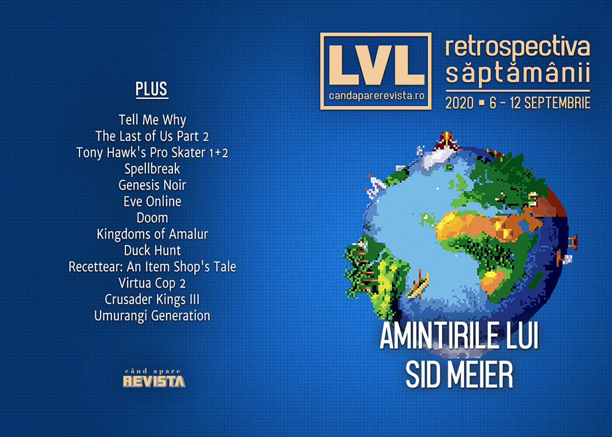

Microsoft ne dă prețul și un model mai accesibil pentru următoarea generație Xbox, Ubisoft a ținut o conferință digitală în care CEO-ul a prezentat scuze victimelor abuzurilor din companie, a fost anunțat un remake pentru **Prince of Persia: The Sands of Time**, Game Pass for PC își dublează prețul, iar Sid Meier și-a publicat memoriile.

Linkuri rapide:

* [Știri](#știri)
* [Articole (critică, dev, design)](#articole-critică-dev-design)
* [Anunțuri şi lansări de jocuri](#anunţuri-şi-lansări-de-jocuri)
* [Prăvălii de jocuri](#prăvălii-de-jocuri)

## Știri

* Microsoft a dezvăluit prețul și data de lansare pentru Xbox Series X: consola va apărea pe piață pe 10 noiembrie la un preț de 499 de dolari... ([Ars Technica](https://arstechnica.com/gaming/2020/09/microsoft-confirms-499-xbox-series-x-for-nov-10/), [Escapist](https://www.escapistmagazine.com/v2/xbox-series-x-launches-nov-10-at-499-preorders-go-live-later-this-month/), [Kotaku](https://kotaku.com/xbox-series-x-will-cost-499-out-november-10-1844996362), [PC Gamer](https://www.pcgamer.com/xbox-series-x-is-arriving-on-november-10-for-dollar499), [VideoGamesChronicle](https://www.videogameschronicle.com/news/xbox-series-x-price/), [GamesIndustry.biz](https://www.gamesindustry.biz/articles/2020-09-09-xbox-series-x-will-sell-for-usd499))
* ... și a dezvăluit totodată și un model mai accesibil al consolei, Xbox Series S, fără unitate de disc și cu GPU mai slab, dar la un preț de doar 299 de dolari.([Ars Technica](https://arstechnica.com/gaming/2020/09/xbox-series-s-design-appears-to-have-leaked-alongside-next-gen-xbox-prices/), [EGM](https://egmnow.com/xbox-series-s-officially-revealed-price-confirmed), [Kotaku](https://kotaku.com/microsofts-next-gen-xbox-one-series-s-is-only-299-1844979695), [Eurogamer](https://www.eurogamer.net/articles/2020-09-08-xbox-series-s-finally-revealed-priced-usd299), [VideoGamesChronicle](https://www.videogameschronicle.com/news/xbox-series-s-specs/), [GamesIndustry.biz](https://www.gamesindustry.biz/articles/2020-09-08-xbox-series-s-finally-announced-reportedly-usd299))
  * [How Xbox Series S Compares To Series X](https://kotaku.com/how-xbox-series-s-compares-to-series-x-1845001250) (Kotaku)

* A avut loc conferința digitală Ubisoft Forward Showcase, care a debutat cu o declarație video din partea președintelui Yves Guillemot, prin care care își cere scuze pentru numeroasele scandaluri care s-au iscat recent în jurul companiei. ([Destructoid](https://www.destructoid.com/stories/ubisoft-ceo-releases-video-statement-addressing-toxic-company-culture-and-offensive-elite-squad-content-603167.phtml), [Kotaku](https://kotaku.com/ubisoft-ceo-apologizes-to-everyone-who-was-hurt-by-mi-1845013250), [Polygon](https://www.polygon.com/2020/9/10/21430881/assassins-creed-director-fired-ubisoft-tom-clancys-elite-squad-blm-logo-controversy-yves-guillemot), [GamesIndustry.biz](https://www.gamesindustry.biz/articles/2020-09-10-ubisoft-ceo-addresses-abuse-scandal-elite-squad-controversy))
* Versiunea UK a site-ului Kotaku s-a închis, după ce editura Future, care licențiase brandul Kotaku, a decis să nu mai prelungească licența după șase ani. ([Game World Observer](https://gameworldobserver.com/2020/09/07/kotaku-uk-shuts-six-years/), [GamesIndustry.biz](https://www.gamesindustry.biz/articles/2020-09-07-kotaku-uk-shutting-down))
* Piața de jocuri din China numără 720 de milioane de gameri. ([VentureBeat](https://venturebeat.com/2020/09/10/niko-partners-75-of-chinas-720-million-gamers-live-outside-the-biggest-cities/))
* A apărut biografia lui Sid Meier, intitulată, cum altfel, **Sid Meier’s Memoir!** ([leftclickghinea.ro](https://leftclickghinea.ro/sid-meier-isi-publica-memoriile/), [Game World Observer](https://gameworldobserver.com/2020/09/08/sid-meiers-memoir/))

#### Epic vs. Apple/Google
* Epic a depus o nouă cerere la tribunal solicitând reactivarea Fornite în App Store-ul Apple. ([Ars Technica](https://arstechnica.com/gaming/2020/09/epic-asks-court-to-force-fortnite-back-onto-the-ios-app-store/), [Game World Observer](https://gameworldobserver.com/2020/09/07/latest-act-fortnite-drama-epic-asks-court-reinstate-fortnite-ios/), [GamesIndustry.biz](https://www.gamesindustry.biz/articles/2020-09-07-epic-games-wants-court-order-to-reinstate-fortnite-on-ios), [Gamasutra](https://www.gamasutra.com/view/news/369638/Epic_is_attempting_to_have_Fortnite_reinstated_on_the_App_Store_.php))
* De partea cealaltă, Apple deschide propriul proces împotriva Epic Games pentru încălcarea contractului. ([Gizmodo](https://gizmodo.com/apple-says-epic-s-conduct-threatens-the-very-existence-1844988608), [PC Gamer](https://www.pcgamer.com/apple-fires-back-at-epic-with-countersuit-demanding-punitive-damages/), [Eurogamer](https://www.eurogamer.net/articles/2020-09-09-now-apple-is-suing-epic-games-for-breach-of-contract), [The Verge](https://www.theverge.com/2020/9/8/21427779/apple-epic-games-breach-of-contract-lawsuit-fortnite-app-store), [Gamasutra](https://www.gamasutra.com/view/news/369759/Apple_is_now_seeking_damages_from_Epic_Games_over_breach_of_contract.php))
* Iar Google depune o cerere solicitând disjungerea (separarea) cauzei sale de procesul cu Apple. ([GamesIndustry.biz](https://www.gamesindustry.biz/articles/2020-09-07-google-requests-court-not-connect-it-to-apple-vs-epic), [Gamasutra](https://www.gamasutra.com/view/news/369647/Google_distances_itself_from_Epic_versus_Apple_legal_dispute.php))

## Articole (critică, dev, design)

* [Chasing the Anti-Colonial Video Game](https://uppercutcrit.com/chasing-the-anti-colonial-video-game/) (Uppercut)
* [How Does Knowing History Impact How We Consume Historical Games](https://uppercutcrit.com/how-does-knowing-history-impact-how-we-consume-historical-games/) (Uppercut)
* [E-sports pros have “dream” jobs—but game publishers have all the power](https://arstechnica.com/gaming/2020/09/e-sports-pros-have-dream-jobs-but-game-publishers-have-all-the-power/) (Ars Technica)
* [Nintendo&#x27;s Secrets Are Continuing to Leak, Revealing Its Unknown History](https://www.vice.com/en_us/article/7kp3b9/nintendos-secrets-are-continuing-to-leak-revealing-its-unknown-history) (Vice)
* [How a Flurry of Flash Games on Newgrounds Captured the Grief and Anger of 9 / 11](https://www.vice.com/en_us/article/4aymnq/how-a-flurry-of-flash-games-on-newgrounds-captured-the-grief-and-anger-of-911) (Vice)

---

### Reportaj
* [Paradox Interactive&#8217;s QA staff allege poor treatment, low pay, and mismanaged layoffs](https://www.rockpapershotgun.com/2020/09/08/paradox-interactives-qa-staff-allege-poor-treatment-low-pay-and-mismanaged-layoffs/) (RPS)

---

### _Not-a-review_
* [Tell Me Why Challenges Us to Confront the Post-Truth Age](https://www.escapistmagazine.com/v2/tell-me-why-challenges-us-to-confront-the-post-truth-age/) (Escapist)
* [We're not kidding: Tony Hawk's Pro Skater 1+2 is one of the best games of the generation](https://www.eurogamer.net/articles/digitalfoundry-2020-tony-hawks-pro-skater-1-2-activisions-game-of-the-generation) (Eurogamer)
* [Spellbreak Is Avatar: The Last Airbender: The Battle Royale, And It Owns](https://kotaku.com/spellbreak-is-avatar-the-last-airbender-the-battle-ro-1844999545) (Kotaku)
* [Genesis Noir and the hidden magic of games that feel like toys](https://www.eurogamer.net/articles/2020-09-11-genesis-noir-and-the-hidden-magic-of-games-that-feel-like-toys) (Eurogamer)
* [EVE Online and the first graveyard in gaming](https://theface.com/life/eve-online-video-games-sci-fi-virtual-reality-funeral-memorial) (The Face)

---

### Industrie
* [Sid Meier: ‘I’m not sure I’d play Civilisation if it was released today’](https://www.independent.co.uk/arts-entertainment/games/sid-meier-interview-civilisation-memoir-autobiography-b404968.html) (The Independent)
* [The unsung star of The Last of Us Part II had to pretend to be a baby](https://www.theverge.com/2020/9/8/21405994/the-last-of-us-part-2-mocap-amy-johnston-baby) (The Verge)
* [How the Polish Indie Scene Exploded in the Wake of the Witcher](https://uppercutcrit.com/how-the-polish-indie-scene-exploded-in-the-wake-of-the-witcher/) (Uppercut)
* [The DeanBeat: Apple v. Epic &#8212; a briefing on the antitrust arguments and interesting facts](https://venturebeat.com/2020/09/11/the-deanbeat-apple-v-epic-a-briefing-on-the-antitrust-arguments-and-interesting-facts/) (VentureBeat)

---

### Istorie, retrospectivă
* [From Pong to Civilization: How I made “one more turn” work on consoles](https://arstechnica.com/gaming/2020/09/from-pong-to-civilization-how-i-made-one-more-turn-work-on-consoles/) (Ars Technica)
* [The story of Doom and how it changed everything—as told by co-creator John Romero](https://www.pcgamer.com/the-story-of-doom-and-how-it-changed-everythingas-told-by-co-creator-john-romero/) (PC Gamer)
* [Revisiting &#x27;Kingdoms of Amalur&#x27; Makes Gaming&#x27;s MMO Fate Seem Inevitable](https://www.vice.com/en_us/article/n7wyd7/revisiting-kingdoms-of-amalur-makes-gamings-mmo-fate-seem-inevitable) (Vice)
* [How Mario Became Video Game’s Most Malleable Mascot](https://www.theringer.com/2020/9/9/21428984/mario-spinoffs-franchises-kart-tennis-dr) (The Ringer)
* [But Seriously, Fuck the ‘Duck Hunt’ Dog](https://www.theringer.com/2020/9/9/21428232/duck-hunt-dog-mario) (The Ringer)
* [10 years on, Recettear: An Item Shop's Tale is still the best fantasy shopkeeper tycoon game](https://www.pcgamer.com/10-years-on-recettear-an-item-shops-tale-is-still-the-best-fantasy-shopkeeper-tycoon-game/) (PC Gamer)
* [Non-stop 3DCG gun shooting!](https://kimimithegameeatingshemonster.wordpress.com/2020/09/10/non-stop-3dcg-gun-shooting/) (Kimimi The Game-Eating She-Monster)

---

### Dev, making of, mecanici
* [PC game load times are about to get a whole lot faster thanks to Microsoft&#8217;s DirectStorage tech](https://www.rockpapershotgun.com/2020/09/08/pc-game-load-times-are-about-to-get-a-whole-lot-faster-thanks-to-microsofts-directstorage-tech/) (RPS)
* [Death and chaos with Edith Finch and The Unfinished Swan](https://www.eurogamer.net/articles/2020-09-12-death-and-chaos-with-edith-finch-and-the-unfinished-swan) (Eurogamer)

---

### Design, world-building, artă
* [Crusader Kings III&#x27;s Loading Screens Are Masterpieces](https://kotaku.com/crusader-kings-iiis-loading-screens-are-masterpieces-1844973040) (Kotaku)
* [56: Umurangi Generation](https://intothespine.com/2020/09/08/56-umurangi-generation/) (Into The Spine)
* [Game Box Art Critique September: Mafia: Definitive Edition, Tony Hawk&rsquo;s Pro Skater 1 + 2, Marvel&rsquo;s Avengers](https://www.videogamer.com/features/game-box-art-critique-september-mafia-definitive-edition-tony-hawks-pro-skater-1--2-marvels-avengers) (VideoGamer)

## Anunţuri şi lansări de jocuri
### Anunţate
* **RollerCoaster Tycoon 3: Complete Edition** ([EGM](https://egmnow.com/rollercoaster-tycoon-3-complete-edition-announced-for-switch-and-pc/))
* **Fallen Aces** ([PC Gamer](https://www.pcgamer.com/crime-noir-shooter-fallen-aces-looks-like-a-combination-of-condemned-criminal-origins-and-dick-tracy-comics/))
* **Amid Evil: The Black Labyrinth** ([PC Gamer](https://www.pcgamer.com/amid-evil-is-getting-a-full-prequel-expansion-called-the-black-labyrinth/))
* **Rise of the Triad Remastered** ([PC Gamer](https://www.pcgamer.com/classic-90s-fps-rise-of-the-triad-is-getting-a-remaster-next-year/))
* **Black Legend** ([Shacknews](https://www.shacknews.com/article/120234/black-legend-is-a-turn-based-strategy-game-based-on-european-folklore-coming-in-2021))
* **Commander 85** ([PC Gamer](https://www.pcgamer.com/commander-85-is-a-weird-retro-adventure-that-looks-like-wargames-meets-stranger-things/))
* **Panzer Dragoon: Remake** ([PC Gamer](https://www.pcgamer.com/panzer-dragoon-remake-is-coming-to-pc-soon/))
* **Chronos: Before the Ashes** ([DSOGaming](https://www.dsogaming.com/news/thq-nordic-announces-chronos-before-the-ashes-coming-to-pc-on-december-1st-first-screenshots/))
* **4 Minutes to the Apocalypse** ([DSOGaming](https://www.dsogaming.com/news/4-minutes-to-the-apocalypse-is-a-new-first-person-action-adventure-rpg-first-screenshots/))

#### Anunțate la Ubisoft Forward
* [Everything Ubisoft Showed During Today&#x27;s Forward Showcase](https://kotaku.com/everything-ubisoft-showed-during-todays-forward-showcas-1845016697) (Kotaku)
* [Here's a recap of everything that happened during September's Ubisoft Forward stream](https://www.destructoid.com/stories/here-s-a-recap-of-everything-that-happened-during-september-s-ubisoft-forward-stream-603192.phtml) (Destructoid)

* **Prince of Persia: The Sands of Time Remake** ([Destructoid](https://www.destructoid.com/stories/prince-of-persia-the-sands-of-time-remake-is-out-in-january-603182.phtml))
* **Riders Republic** ([DSOGaming](https://www.dsogaming.com/news/ubisoft-announces-a-new-multiplayer-extreme-sports-ip-riders-republic/))
* **Scott Pilgrim vs. the World** va fi re-lansat ([Kotaku](https://kotaku.com/after-some-confusion-scott-pilgrim-vs-the-world-the-1845016428))
* **Immortals: Fenyx Rising**, fostul **Gods and Monsters** ([Escapist](https://www.escapistmagazine.com/v2/immortals-fenyx-rising-brings-open-world-mythological-adventure-in-december/))
* **A Game of Space** ([Polygon](https://www.polygon.com/2020/9/10/21431093/a-game-of-space-agos-ubisoft-forward-virtual-reality-vr-announcement-release-date-price))

### Acum cu dată de lansare
* **Atomicrops**: 17 septembrie (iese din early access și exclusivitatea Epic Store) ([PC Gamer](https://www.pcgamer.com/farmlife-roguelike-atomicrops-epic-exclusivity-is-ending-and-its-adding-new-stuff/))
* **DwarfHeim**: 23 octombrie (early access) ([RPS](https://www.rockpapershotgun.com/2020/09/12/co-op-rts-dwarfheim-will-launch-in-early-access-in-october-and-gets-a-new-demo-today))
* **The Falconeer**: 10 noiembrie ([PC Gamer](https://www.pcgamer.com/big-bird-combat-simulator-the-falconeer-is-coming-on-november-10/))

### Amânate
* **DiRT 5**: 6 noiembrie în loc de 16 octombrie ([EGM](https://egmnow.com/dirt-5-has-been-delayed-again))
* **Assassin's Creed Valhalla**: 10 noiembrie în loc de 17 noiembrie ([Eurogamer](https://www.eurogamer.net/articles/2020-09-09-assassins-creed-valhalla-release-date-brought-forward))
* **Spacebase Startopia**: 2021 în loc de 23 octombrie ([PC Gamer](https://www.pcgamer.com/spacebase-startopia-has-been-delayed-until-2021/))
* **Kena: Bridge Of Spirits**: 2021 în loc de iarna acestui an ([RPS](https://www.rockpapershotgun.com/2020/09/12/kena-bridge-of-spirits-delays-its-release-into-early-2021/))

### Lansate
* 8 septembrie: **Kingdoms of Amalur: Re-Reckoning** ([Steam](https://store.steampowered.com/app/1041720/Kingdoms_of_Amalur_ReReckoning/), [Epic Store](https://www.epicgames.com/store/en-US/product/kingdoms-of-amalur-re-reckoning/), [gog.com](https://www.gog.com/game/kingdoms_of_amalur_rereckoning_fate_edition))
* 8 septembrie: **Star Renegades** ([Steam](https://store.steampowered.com/app/651670/Star_Renegades/), [gog.com](https://www.gog.com/game/star_renegades))
* 8 septembrie: **Necromunda: Underhive Wars** ([Steam](https://store.steampowered.com/app/566440/Necromunda_Underhive_Wars/))
* 10 septembrie: **Hotshot Racing** ([Steam](https://store.steampowered.com/app/609920/Hotshot_Racing/))
* 10 septembrie: **The Unfinished Swan** ([Steam](https://store.steampowered.com/app/1206430/The_Unfinished_Swan/), [Epic Store](https://www.epicgames.com/store/en-US/product/the-unfinished-swan/))
* 10 septembrie: **As Far As The Eye** ([Steam](https://store.steampowered.com/app/1119700/As_Far_As_The_Eye/), [Epic Store](https://www.epicgames.com/store/en-US/product/as-far-as-the-eye/), [gog.com](https://www.gog.com/game/as_far_as_the_eye))
* 10 septembrie: **A Monster's Expedition** ([Steam](https://store.steampowered.com/app/1052990/A_Monsters_Expedition/))
* 10 septembrie: **Disgaea 4 Complete+** ([Steam](https://store.steampowered.com/app/1233880/Disgaea_4_Complete/))
* 10 septembrie: **Ostranauts** ([Steam](https://store.steampowered.com/app/1022980/Ostranauts/))
* 11 septembrie: **Inertial Drift** ([Steam](https://store.steampowered.com/app/1184480/Inertial_Drift/))

## Prăvălii de jocuri

### Știri
* [Xbox Game Pass for PC exits beta next week, and the price is going up](https://www.pcgamer.com/xbox-game-pass-for-pc-exits-beta-next-week-and-the-price-is-going-up/) (PC Gamer)
* [Apple allows streaming games on iOS, but there’s a catch [Updated]](https://arstechnica.com/gaming/2020/09/apple-allows-streaming-games-on-ios-but-theres-a-catch/) (Ars Technica)

### Update catalog
* [EA Play Coming To Xbox Game Pass At No Extra Cost](https://kotaku.com/ea-play-coming-to-xbox-game-pass-at-no-extra-cost-1844997536) (Kotaku)

### Jocuri gratis și free weekends
* [Star Citizen is free to fly for the next two weeks](https://www.pcgamer.com/star-citizen-is-free-to-fly-for-the-next-two-weeks/) (PC Gamer)
* [Where the Water Tastes Like Wine is an Epic Games Store freebie you need to pick up](https://www.destructoid.com/stories/where-the-water-tastes-like-wine-is-an-epic-games-store-freebie-you-need-to-pick-up-603198.phtml) (Destructoid)

### Reduceri și promoții
* [Here's almost every Tropico game for less than £10](https://www.eurogamer.net/articles/2020-09-10-heres-almost-every-tropico-game-for-under-gbp10) (Eurogamer)
* [Weekend Console Download Deals for Sept. 11: PSVR sale](https://www.shacknews.com/article/120301/weekend-console-download-deals-for-sept-11-psvr-sale) (Shacknews)
* [Weekend PC Download Deals for Sept. 11: Madden NFL 21 free weekend](https://www.shacknews.com/article/120305/weekend-pc-download-deals-for-sept-11-madden-nfl-21-free-weekend) (Shacknews)

---

{}
**Retrospectiva săptămânii** este rubrica duminicală în care trecem în revistă evenimentele săptămânii de pe frontul de gaming: știri şi articole (scrise de alții, bineînțeles, că e mai ușor aşa), industrie, lansări, oferte de jocuri, toate numai de savurat la cafeaua de duminică dimineața.

De asemenea, rubrica e deschisă oricui vrea și poate contribui. Dacă ai citit vreun articol sau vreo știre interesantă și crezi că merită incluse în retrospectiva săptămânii, te așteptăm pe forum pe unul dintre topicurile dedicate: [Știri](https://forum.candaparerevista.ro/viewtopic.php?f=4&t=46), [Articole](https://forum.candaparerevista.ro/viewtopic.php?f=4&t=206), [Gaming România](https://forum.candaparerevista.ro/viewtopic.php?f=4&t=1622)].
{}
