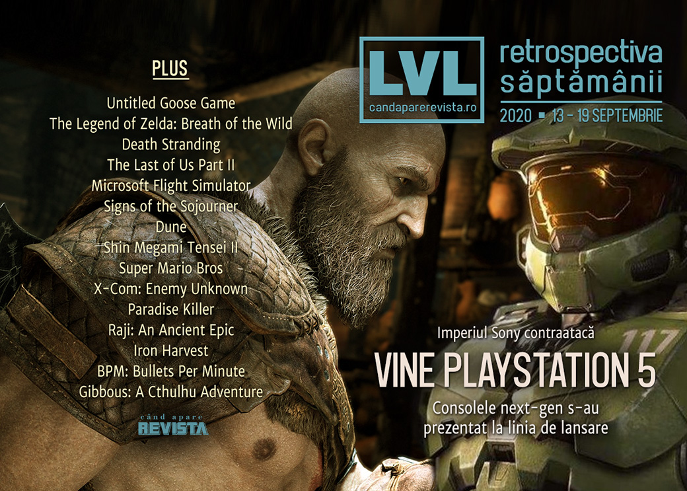

Evenimente importante în această săptămână: Sony a prețul și data de lansare pentru PlayStation 5, ce are același preț cu nou Xbox, Facebook a prezentat un nou dispozitiv VR Oculus ce le înlocuiește pe toate celelalte, Nvidia lansează plăcile 3080, care se epuizează imediat, Unity se listează la bursă, iar EA schimbă numele clientului Origin în EA Access. În plus, conferințele au adus și anunțuri de jocuri noi: titluri noi VR pentru Assassin's Creed, Splinter Cell și Myst, precum și un nou joc God of War pentru PlayStation.

Linkuri rapide:

* [Știri](#știri)
* [Articole (critică, dev, design)](#articole-critică-dev-design)
* [Made în România](#made-în-românia)
* [Anunțuri şi lansări de jocuri](#anunţuri-şi-lansări-de-jocuri)
* [Prăvălii de jocuri](#prăvălii-de-jocuri)

## Știri

* Sony a dezvăluit, în cadrul unei conferințe online, prețul și data de lansare pentru PlayStation 5: 499 de dolari (respectiv 399 pentru varianta fără unitate de disc) și apare pe 12 noiembrie. ([Ars Technica](https://arstechnica.com/gaming/2020/09/playstation-5-event-499-with-a-disc-drive-399-without-on-nov-12/), [Destructoid](https://www.destructoid.com/stories/ps5-launches-in-november-priced-at-499-603797.phtml), [Kotaku](https://kotaku.com/ps5-out-in-u-s-on-nov-12-costs-500-for-main-model-1845081999), [Shacknews](https://www.shacknews.com/article/120413/playstation-5-release-date-and-price-announced-at-ps5-showcase))
  * Noua consolă păstrează combatibilitatea cu modelul PS4, dar nu și cu cele anterioare. ([Ars Technica](https://arstechnica.com/gaming/2020/09/sony-makes-it-official-playstation-5-wont-natively-support-ps1-ps2-ps3/), [Polygon](https://www.polygon.com/2020/9/18/21445615/ps5-backward-compatible-ps4-games-jim-ryan), [EGM](https://egmnow.com/playstation-boss-confirms-no-backward-compatibility-beyond-ps4-on-ps5/))
  * În plus, prețul unor jocuri din noua generație va crește la 70 de dolari, respectiv 80 de euro (da, 80, nu e o greșeală). ([Polygon](https://www.polygon.com/2020/9/16/21440546/ps5-launch-games-pricing-playstation-5), [Kotaku](https://kotaku.com/some-ps5-games-will-be-70-1845084603))
  * Și, profitând de un management defectuos al precomenzilor care s-au epuizat rapid, speculatorii oferă la revânzare consola PS5 la prețuri exorbitante. ([Eurogamer](https://www.eurogamer.net/articles/2020-09-19-amid-ps5-pre-orders-chaos-scalpers-are-selling-consoles-with-huge-markups))

* Și Facebook a organizat o conferință dedicată produselor Oculus, în care a prezentat viitorul headset Oculus Quest 2, ce va înlocui atât modelul anterior Quest, cât și pe Rift S, devenind astfel singurul dispozitiv VR Oculus ce va mai fi disponibil pe piață. ([Ars Technica](https://arstechnica.com/gaming/2020/09/facebook-leak-reveals-oculus-quest-2-as-a-4k-standalone-vr-headset/), [GamesIndustry.biz](https://www.gamesindustry.biz/articles/2020-09-16-facebook-discontinues-rift-headset-announces-oculus-quest-2), [Variety](https://variety.com/2020/digital/news/oculus-quest-2-vr-headset-launch-1234772027/), [Shacknews](https://www.shacknews.com/article/120391/oculus-quest-2-revealed-at-facebook-connect-pre-orders-open-now))
* Nvidia cumpără compania de procesoare ARM pentru într-o tranzacție cu valoarea de 40 de miliarde de dolari. ([PC Gamer](https://www.pcgamer.com/nvidia-confirms-dollar40-billion-arm-acquisition/), [Shacknews](https://www.shacknews.com/article/120317/nvidia-to-acquire-arm-from-softbank-for-40-billion), [VideoGamesChronicle](https://www.videogameschronicle.com/news/nvidia-agrees-40bn-deal-for-arm-the-chip-maker-behind-switch-and-iphone/), [Eurogamer](https://www.eurogamer.net/articles/2020-09-14-nvidia-pays-usd40bn-for-uk-chip-designer-arm), [GamesIndustry.biz](https://www.gamesindustry.biz/articles/2020-09-14-nvidia-acquires-arm-for-usd40-billion))
* Michel Ancel, creatorul seriilor Rayman și Beyond Good & Evil, își dă demisia de la Ubisoft și părăsește industria jocurilor pentru a se dedica protejării animalelor sălbatice. ([Polygon](https://www.polygon.com/2020/9/18/21445224/rayman-ubisoft-michel-ancel-retires-beyond-good-evil-2-wild), [RPS](https://www.rockpapershotgun.com/2020/09/18/rayman-co-creator-michel-ancel-says-hes-leaving-video-games/), [Shacknews](https://www.shacknews.com/article/120450/beyond-good-evil-2-director-michel-ancel-leaves-ubisoft-bge2-development-to-continue), [Kotaku](https://kotaku.com/beyond-good-evils-creator-leaves-ubisoft-but-the-seq-1845104124), [PC Gamer](https://www.pcgamer.com/beyond-good-and-evil-creator-michel-ancel-quits-videogames-to-work-in-an-animal-sanctuary))
* E posibil ca schimbarea numelui jocului **Gods and Monsters** în **Immortals: Fenyx Rising** de către Ubisoft să se fi produs în urma unei cereri de încălcare a trademarkului depusă la tribunal de compania de băuturi Monster Energy. ([TechRaptor](https://techraptor.net/gaming/news/gods-and-monsters-started-monster-trademark-fight-with-monster-energy), [Shacknews](https://www.shacknews.com/article/120386/gods-and-monsters-was-renamed-to-immortals-fenyx-rising-over-issues-with-monster-energy), [RPS](https://www.rockpapershotgun.com/2020/09/15/ubisofts-gods-monsters-was-renamed-after-trademark-troubles-with-monster-energy/), [PC Gamer](https://www.pcgamer.com/gods-and-monsters-name-was-changed-due-to-a-trademark-challenge-by-monster-energy/))
* Compania Unity s-a listat la bursă, reușind să strângă, prin valoarea acțiunilor sale, fonduri de 13,6 miliarde de dolari. ([VentureBeat](https://venturebeat.com/2020/09/18/unity-technologies-raises-more-than-1-1-billion-in-ipo-at-12-1-billion-valuation/), [GamesIndustry.biz](https://www.gamesindustry.biz/articles/2020-09-18-unity-valued-at-usd13-7bn-after-successful-ipo), [Gamasutra](https://www.gamasutra.com/view/news/370487/Unity_valued_at_137_billion_following_13_billion_IPO.php))
* Aflăm primele detalii despre viitorul model de plăci video de la AMD, bazate pe arhitectura Big Navi, printr-un eveniment promoțional în jocul Fortnite. ([RPS](https://www.rockpapershotgun.com/2020/09/15/this-is-what-amds-first-big-navi-graphics-card-looks-like), [PC Gamer](https://www.pcgamer.com/amd-radeon-rx-6000-series-fortnite-pictured/))
* Nvidia a lansat plăcile video din seria 3080, care însă s-au epuizat imediat din cauza speculatorilor. ([Vice](https://www.vice.com/en_us/article/xg8jyq/nvidias-3080-video-cards-ps5-sold-out))

#### Rezumat evenimente
Mai multe evenimente digitale avut loc în această săptămână:

* Apple Event:
  * [All reveals & announcements from Apple Event September 2020](https://www.shacknews.com/article/120367/all-reveals-announcements-from-apple-event-september-2020) (Shacknews)

* Facebook Connect
  * [Facebook Connect 7: the 5 biggest announcements](https://www.theverge.com/2020/9/16/21440086/facebook-oculus-connect-recap-biggest-announcements-quest-rift-games) (The Verge)

* Nintendo Direct Mini
  * [A recap of everything announced at the Nintendo Direct Mini](https://www.destructoid.com/stories/a-recap-of-everything-announced-at-the-nintendo-direct-mini-603919.phtml) (Destructoid)
  * [Everything shown in today's Nintendo Direct mini](https://www.eurogamer.net/articles/2020-09-17-everything-shown-in-todays-nintendo-direct-mini) (Eurogamer)

* Sony PlayStation 5 Showcase
  * [Here's everything Sony announced during tonight's PlayStation 5 showcase](https://www.eurogamer.net/articles/2020-09-16-heres-everything-sony-announced-during-tonights-playstation-5-showcase) (Eurogamer)
  * [Everything Sony Announced In Today&#x27;s PS5 Event](https://kotaku.com/everything-sony-announced-in-todays-ps5-event-1845082097) (Kotaku)
  * [All reveals, announcements, and trailers from the September PlayStation 5 Showcase](https://www.shacknews.com/article/120416/all-reveals-announcements-and-trailers-from-the-september-playstation-5-showcase) (Shacknews)
  * [Here's a recap of everything that happened during Sony's September PS5 event](https://www.destructoid.com/stories/here-s-a-recap-of-everything-that-happened-during-sony-s-september-ps5-event-603805.phtml) (Destructoid)

## Articole (critică, dev, design)
* [How to train an esports team: private chefs, psychologists, and $452,000 worth of PC hardware](https://www.pcgamer.com/team-liquids-alienware-training-facility-utrecht/) (PC Gamer)
* [AI ruined chess. Now it’s making the game beautiful again](https://arstechnica.com/gaming/2020/09/ai-ruined-chess-now-its-making-the-game-beautiful-again) (Ars Technica)
* [Tabula Rasa: In defence of the amnesiac video game protagonist](https://www.thumbsticks.com/tabula-rasa-in-defence-of-amnesiac-video-game-protagonist/) (Thumbsticks)

---

### Actualitate
* [Just admit that your console exclusives are coming to PC already](https://www.pcgamer.com/just-admit-that-your-console-exclusives-are-coming-to-pc-already/) (PC Gamer)
* [Sony's PlayStation 5 Event Makes Me Wonder What The Hell Happened](https://techraptor.net/gaming/opinions/sonys-playstation-5-event-makes-me-wonder-what-hell-happened) (TechRaptor)
* [What Nvidia buying Arm means for PC gaming](https://www.pcgamer.com/nvidia-arm-acquisition-explained-pc-gaming/) (PC Gamer)

---

### _Not-a-review_
* [Geese are Scarier than Monsters](https://unwinnable.com/2020/09/15/geese-are-scarier-than-monsters/) (Unwinnable)
* [Breath of the Wild](https://www.critical-distance.com/2020/09/16/breath-of-the-wild/) (Critical Distance)
* [The Essential Workers of Death Stranding](https://intothespine.com/2020/09/14/death-stranding-essential-workers/) (Into The Spine)
* [Opened World: Let’s Go Home, Abby](https://haywiremag.com/columns/opened-world-lets-go-home-abby/) (Haywire Magazine)
* [Microsoft Flight Simulator has let me go on vacation again](https://www.pcinvasion.com/microsoft-flight-simulator-vacation/) (PC Invasion)
* [What Signs of the Sojourner’s cards can teach us about conversation](https://liftoffmag.com/what-signs-of-the-sojourners-cards-can-teach-us-about-conversation/) (Liftoff!)

---

### Industrie
* [The console wars as we've known them are over](https://www.shacknews.com/article/120424/the-console-wars-as-weve-known-them-are-over) (Shacknews)
* [PlayStation and Xbox have both failed to sell next-gen](https://www.gamesindustry.biz/articles/2020-09-17-playstation-and-xbox-have-both-failed-to-sell-next-gen-opinion) (GamesIndustry.biz)
* [Twitch Streamers Are Furious About New Mid-Stream Ads They Can’t Control](https://kotaku.com/twitch-streamers-are-furious-about-new-mid-stream-ads-t-1845064792) (Kotaku)
* [Microsoft threw a datacenter into the ocean and it worked out splendidly](https://www.pcgamer.com/microsoft-threw-a-datacenter-into-the-ocean-and-it-worked-out-splendidly/) (PC Gamer)
* [Mediatonic made around 130 games before it struck gold with Fall Guys](https://www.pcgamer.com/mediatonic-made-around-130-games-before-it-struck-gold-with-fall-guys/) (PC Gamer)
* [EA furthers its strategy for &quot;frictionless,&quot; &quot;democratized&quot; gaming](https://www.gamesindustry.biz/articles/2020-09-14-ea-furthers-its-strategy-for-frictionless-democratized-gaming) (GamesIndustry.biz)

---

### Istorie, retrospectivă
* [PS5 can&#8217;t recreate the buzz of the original PlayStation revolution](https://www.videogameschronicle.com/features/ps5-cant-recreate-the-buzz-of-the-original-playstation-revolution/) (VideoGamesChronicle)
* [The PlayStation 4 found success in simplicity](https://www.polygon.com/2020/9/18/21445404/playstation-4-ps4-review-2020) (Polygon)
* [How the '90s family computer shaped a generation's exposure to PC gaming](https://www.pcgamer.com/how-the-90s-family-computer-shaped-a-generations-exposure-to-pc-gaming/) (PC Gamer)
* [The top 10 games of the generation](https://www.eurogamer.net/articles/2020-09-18-the-top-10-games-of-the-generation) (Eurogamer)
* [The Spice Must Flow: The Rise and Fall of Dune Games](https://www.escapistmagazine.com/v2/the-spice-must-flow-the-rise-and-fall-of-dune-games/) (Escapist)
* [Divinity, demons, and decay](https://kimimithegameeatingshemonster.wordpress.com/2020/09/17/divinity-demons-and-decay/) (Kimimi The Game-Eating She-Monster)
* [The REAL history of Super Mario games](https://tiredoldhack.com/2020/09/13/the-real-history-of-super-mario-games/) (Tired Old Hack)
* [A fond farewell to the weird and wonderful Nintendo DS](https://arstechnica.com/gaming/2020/09/a-fond-farewell-to-the-weird-and-wonderful-nintendo-ds/) (Ars Technica)
* [Holograms, tanks, psychics… Atari’s unexplored creative paths](https://wireframe.raspberrypi.org/articles/holograms-tanks-psychics-ataris-unexplored-creative-paths) (Wireframe magazine)
* [X-COM](https://www.filfre.net/2020/09/x-com/) (The Digital Antiquarian)

---

### Dev, making of, mecanici
* [How a new indie studio created one of the best detective games ever](https://www.pcgamer.com/how-a-new-indie-studio-created-one-of-the-best-detective-games-ever/) (PC Gamer)
* [&#x27;Raji&#x27; Had a Rocky Road, From Kickstarter Failure to Switch Exclusive](https://www.vice.com/en_us/article/dyzqyj/raji-had-a-rocky-road-from-kickstarter-failure-to-switch-exclusive) (Vice)
* [1920s Mech Battles for the Modern Gamer: An Iron Harvest Overview](https://waywardstrategy.com/2020/09/14/heavy-metal-an-iron-harvest-overview/) (Wayward Strategy)
* [Building AI to Fight on the Beat of BPM: Bullets Per Minute](https://gamasutra.com/blogs/TommyThompson/20200911/369979/Building_AI_to_Fight_on_the_Beat_of_BPM_Bullets_Per_Minute.php) (Gamasutra)

---

### Design, world-building, artă
* [Check out this never-before-seen StarCraft 2 concept art](https://www.pcgamer.com/check-out-this-never-before-seen-starcraft-2-concept-art/) (PC Gamer)
* [How In-Game Photography Revitalizes and Enhances Gameplay](https://www.escapistmagazine.com/v2/how-in-game-photography-revitalizes-and-enhances-gameplay-photo-mode/) (Escapist)
* [Nothing Lasts Forever](https://unwinnable.com/2020/09/14/nothing-lasts-forever/) (Unwinnable)
* [Game Art: Jordy Veenstra's Pixelation (2020)](https://www.gamescenes.org/2020/09/game-art-jordy-veenstras-pixelation-2020.html) (GAMESCENES)

## Made în România
* Interviu luat de Josh Bycer de la canalul Game Wisdom lui Liviu Boar despre **Gibbous**. ([YouTube Game Wisdom](https://www.youtube.com/watch?v=sA_nQVPLo4M&feature=youtu.be))

## Anunţuri şi lansări de jocuri
### Anunţate
* **The Invincible** ([DSOGaming](https://www.dsogaming.com/news/the-invincible-is-a-first-person-sci-fi-thriller-from-former-the-witcher-3-cyberpunk-2077-developers/))
* **Crystal Caves HD** ([PC Gamer](https://www.pcgamer.com/crystal-caves-hd-is-a-light-remake-of-the-1993-shareware-classic/))
* **Paper Beast: Folded Edition**, versiunea non-VR a lui Paper Beast ([RPS](https://www.rockpapershotgun.com/2020/09/15/paper-beast-is-getting-a-non-vr-version-next-month))

#### Anunțate la Facebook Connect
* **Splinter Cell VR** și **Assassin’s Creed VR** ([DSOGaming](https://www.dsogaming.com/news/ubisoft-officially-announces-splinter-cell-vr-and-assassins-creed-vr-for-oculus-devices/), [GamesIndustry.biz](https://www.gamesindustry.biz/articles/2020-09-16-ubisoft-is-making-assassins-creed-splinter-cell-titles-for-oculus))
* **Myst Remake** ([DSOGaming](https://www.dsogaming.com/news/cyan-officially-announces-myst-remake-releases-first-screenshots/))
* **Battle Sister** ([Eurogamer](https://www.eurogamer.net/articles/2020-09-18-battle-sister-is-the-first-warhammer-40-000-vr-game))

#### Anunțate la Sony PlayStation Showcase
* **Final Fantasy XVI** ([RPS](https://www.rockpapershotgun.com/2020/09/16/final-fantasy-xvi-announced-and-it-looks-grim-as-heck))
* **Hogwarts Legacy** ([EGM](https://egmnow.com/hogwarts-legacy-unveiled-for-consoles-and-pc/))
* **Devil May Cry 5: Special Edition** ([Shacknews](https://www.shacknews.com/article/120408/devil-may-cry-5-special-edition-revealed-at-september-ps5-showcase))
* **Five Nights at Freddy’s: Security Breach** ([EGM](https://egmnow.com/five-nights-at-freddys-security-breach-announced-for-ps4-ps5-pc/))
* **God of War Ragnarök** ([VideoGamesChronicle](https://www.videogameschronicle.com/news/god-of-war-ragnarok-coming-to-ps5-in-2021-sony-confirms/))
* **The Climb 2** ([Eurogamer](https://www.eurogamer.net/articles/2020-09-16-crytek-is-delivering-more-vertigo-inducing-vr-thrills-in-the-climb-2))

### Acum cu dată de lansare
* **Halo 3: ODST**: 22 septembrie ([DSOGaming](https://www.dsogaming.com/news/halo-3-odst-is-coming-to-the-pc-on-september-22nd/))
* **Panzer Dragoon: Remake**: 25 septembrie ([Destructoid](https://www.destructoid.com/stories/panzer-dragoon-remake-takes-flight-on-pc-september-25-603691.phtml))
* **Second Extinction**: 13 octombrie ([DSOGaming](https://www.dsogaming.com/news/second-extinction-is-coming-to-steam-early-access-on-october-13th/))
* **Raji: an Ancient Epic**: 15 octombrie ([Eurogamer](https://www.eurogamer.net/articles/2020-09-17-acclaimed-adventure-raji-an-ancient-epic-comes-to-pc-xbox-one-and-ps4-in-october))
* **Amnesia Rebirth**: 20 octombrie ([DSOGaming](https://www.dsogaming.com/news/amnesia-rebirth-releases-on-october-20th/))
* **Ghostrunner**: 27 octombrie ([DSOGaming](https://www.dsogaming.com/news/ghostrunner-releases-on-october-27th/))
* **Godfall**: 12 noiembrie ([Destructoid](https://www.destructoid.com/stories/godfall-will-arrive-on-launch-day-for-ps5-november-12-on-pc-603894.phtml))
* **Empire Of Sin**: 1 decembrie ([PC Gamer](https://www.pcgamer.com/empire-of-sin-gets-release-date-and-pre-order-trailer/))
* **Twin Mirror**: 1 decembrie ([DSOGaming](https://www.dsogaming.com/news/twin-mirror-is-coming-to-epic-games-store-on-december-1st/))
* **Hellish Quart**: 3 decembrie (early access) ([RPS](https://www.rockpapershotgun.com/2020/09/17/historical-sword-dueler-hellish-quart-comes-out-in-early-access-this-december))

### Amânate
* **Jett: The Far Shore**: 2021 în loc de 2020 ([Polygon](https://www.polygon.com/2020/9/18/21445183/jett-the-far-shore-delayed-until-2021-playstation-5-next-gen))

### Lansate
* 15 septembrie: **BPM: Bullets Per Minute** ([Steam](https://store.steampowered.com/app/1286350/BPM_BULLETS_PER_MINUTE/), [gog.com](https://www.gog.com/game/bpm_bullets_per_minute))
* 15 septembrie: **eFootball PES 2021** ([Steam](https://store.steampowered.com/app/1259970/eFootball_PES_2021/))
* 16 septembrie: **Ragnorium** (early access) ([Steam](https://store.steampowered.com/app/474020/Ragnorium/))
* 17 septembrie: **Welcome To Elk** ([Steam](https://store.steampowered.com/app/1015940/Welcome_to_Elk/))
* 17 septembrie: **Wingspan** ([Steam](https://store.steampowered.com/app/1054490/Wingspan/))
* 17 septembrie: **Hades** (iese din early access) ([Steam](https://store.steampowered.com/app/1145360/Hades/), [Epic Store](https://www.epicgames.com/store/en-US/product/hades/))
* 18 septembrie: **Crysis Remastered** ([Epic Store](https://www.epicgames.com/store/en-US/product/crysis-remastered/))
* 18 septembrie: **Phasmophobia** ([Steam](https://store.steampowered.com/app/739630/Phasmophobia/))

## Prăvălii de jocuri
### Știri
* [EA eliminating Origin brand with new EA Desktop app](https://www.polygon.com/2020/9/14/21437031/ea-play-electronic-arts-origin-access-desktop-app-subscription-pc) (Polygon)
* [Cloud streaming support is being added to over 150 Xbox Game Pass Ultimate titles](https://www.gamasutra.com/view/news/370108/Cloud_streaming_support_is_being_added_to_over_150_Xbox_Game_Pass_Ultimate_titles.php) (Gamasutra)

### Update catalog
* [Rocket League going free to play next week, will be delisted from Steam](https://www.destructoid.com/stories/rocket-league-going-free-to-play-next-week-will-be-delisted-from-steam-603590.phtml) (Destructoid)
* [Xbox Game Pass is getting five more solid games](https://www.destructoid.com/stories/xbox-game-pass-is-getting-five-more-solid-games-603499.phtml) (Destructoid)

### Jocuri gratis și free weekends
* [Life Is Strange 2&#8217;s first episode is now free, forever](https://www.rockpapershotgun.com/2020/09/17/life-is-strange-2s-first-episode-is-now-free-forever) (RPS)
* [The free demo for Unpacking is good enough to make you enjoy moving house](https://www.rockpapershotgun.com/2020/09/14/the-free-demo-for-unpacking-is-good-enough-to-make-you-enjoy-moving-house) (RPS)
* [The original Death Rally is now free on Steam, forever](https://www.pcgamer.com/the-original-death-rally-is-now-free-on-steam-forever) (PC Gamer)
* [It's a 'three free game' kinda week on the Epic Games Store](https://www.destructoid.com/stories/it-s-a-three-free-game-kinda-week-on-the-epic-games-store-603973.phtml) (Destructoid)
* [Browser game City Guesser is like GeoGuessr, but with video (and free)](https://www.pcgamer.com/city-guesser-is-like-geoguessr-but-with-video-and-free/) (PC Gamer)

### Reduceri și promoții
* [Set tails a waggin&#8217; with Humble&#8217;s You Can Pet The Dog bundle](https://www.rockpapershotgun.com/2020/09/18/set-tails-a-waggin-with-humbles-you-can-pet-the-dog-bundle) (RPS)
* [Weekend Console Download Deals for Sept. 18: Hades comes to Switch](https://www.shacknews.com/article/120459/weekend-console-download-deals-for-sept-18-hades-comes-to-switch) (Shacknews)
* [Weekend PC Download Deals for Sept. 18: Steam Pirate Sale](https://www.shacknews.com/article/120463/weekend-pc-download-deals-for-sept-18-steam-pirate-sale) (Shacknews)

---

{}
**Retrospectiva săptămânii** este rubrica duminicală în care trecem în revistă evenimentele săptămânii de pe frontul de gaming: știri şi articole (scrise de alții, bineînțeles, că e mai ușor aşa), industrie, lansări, oferte de jocuri, toate numai de savurat la cafeaua de duminică dimineața.

De asemenea, rubrica e deschisă oricui vrea și poate contribui. Dacă ai citit vreun articol sau vreo știre interesantă și crezi că merită incluse în retrospectiva săptămânii, te așteptăm pe forum pe unul dintre topicurile dedicate: [Știri](https://forum.candaparerevista.ro/viewtopic.php?f=4&t=46), [Articole](https://forum.candaparerevista.ro/viewtopic.php?f=4&t=206), [Gaming România](https://forum.candaparerevista.ro/viewtopic.php?f=4&t=1622)].
{}
