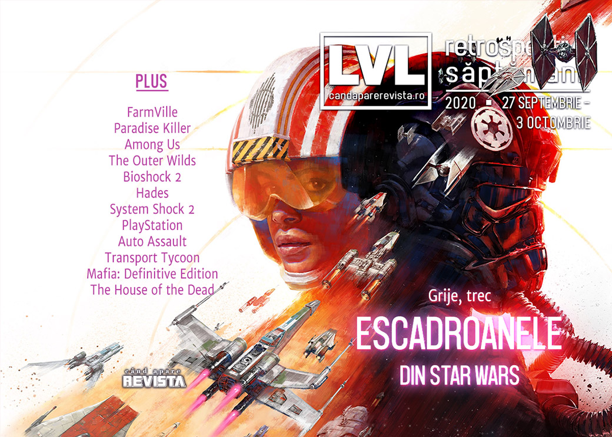

O săptămână mai liniștită, fără prea mari evenimente. Jocul **FarmVille** ajunge la capăt de drum, Ubisoft prezintă rezultatul unui studiu intern, aflăm că procesul Apple vs. Epic va fi de lungă durată, s-a lansat **Star Wars: Squadrons** și... toată lumea vorbește despre Hades.

Linkuri rapide:

* [Știri](#știri)
* [Articole (critică, dev, design)](#articole-critică-dev-design)
* [Made în România](#made-în-românia)
* [Anunțuri şi lansări de jocuri](#anunţuri-şi-lansări-de-jocuri)
* [Prăvălii de jocuri](#prăvălii-de-jocuri)

## Știri

* (In)Faimosul joc FarmVille a ajuns la sfârșitul vieții, compania Zynga anunțând că oprește serverele la sfârșitul anului, odată cu încetarea suportului oficial pentru Adobe Flash Player, tehnologia pe care e bazat jocul. ([Ars Technica](https://arstechnica.com/gaming/2020/09/zynga-is-finally-axing-the-original-farmville-after-11-years/), [Kotaku](https://kotaku.com/as-2020-ends-so-does-farmville-1845201618), [PC Gamer](https://www.pcgamer.com/end-of-an-era-farmville-is-finally-being-put-out-to-pasture/), [Destructoid](https://www.destructoid.com/stories/zynga-s-legendary-farmville-to-close-after-a-decade-of-success-605140.phtml), [Eurogamer](https://www.eurogamer.net/articles/2020-09-28-farmville-will-shut-down-on-december-31st-2020))

* EA e criticată după ce au apărut reclame pentru microtranzacțiile din FIFA într-o revistă pentru copii din Marea Britanie ([Eurogamer](https://www.eurogamer.net/articles/2020-09-27-fans-hit-out-at-ea-for-promoting-fifa-microtransactions-in-magazines-for-children), [VideoGamesChronicle](https://www.videogameschronicle.com/news/ea-criticised-for-promoting-fifa-microtransactions-in-uk-toy-shops/), [GamesIndustry.biz](https://www.gamesindustry.biz/articles/2020-09-28-ea-under-fire-for-promoting-fifa-loot-boxes-in-toy-catalogue)), compania retrăgând ulterior reclama motivând o greșeală. ([VideoGamesChronicle](https://www.videogameschronicle.com/news/ea-pulls-toy-shop-ad-for-fifa-points-and-committs-to-an-immediate-review/))

* O scrisoare trimisă de CEO-ul Ubisoft angajaților companiei, în care prezintă rezultatele unui audit extern și al unui chestionar intern, arată cum aproape un sfert din totalul angajaților „fost supuși sau au asistat” la cel puțin o formă de abuz sau comportament neprofesional. ([GamesIndustry.biz](https://www.gamesindustry.biz/articles/2020-10-02-25-percent-of-ubisoft-employees-witnessed-workplace-misconduct-in-past-two-years), [PC Gamer](https://www.pcgamer.com/25-percent-of-ubisoft-employees-have-experienced-or-witnessed-workplace-misconduct/), [Kotaku](https://kotaku.com/one-in-four-ubisoft-employees-witnessed-or-experienced-1845256218), [Shacknews](https://www.shacknews.com/article/120707/ubisoft-ceo-reveals-roughly-25-of-employees-witnessed-or-experienced-misconduct))

* În cadrul unei noi runde de audieri în litigiul dintre Epic Games și Apple, judecătoarea a avertizat că procesul propriu-zis nu va începe mai devreme de luna iulie a anului viitor. ([Ars Technica](https://arstechnica.com/gaming/2020/09/apple-vs-epic-hearing-previews-a-long-hard-fought-trial-to-come/), [PC Gamer](https://www.pcgamer.com/judge-says-epic-was-not-honest-when-it-bypassed-apples-payment-system-in-fortnite/), [Shacknews](https://www.shacknews.com/article/120647/epic-games-slammed-as-not-honest-by-judge-in-court-hearing-versus-apple), [GamesIndustry.biz](https://www.gamesindustry.biz/articles/2020-09-29-epic-vs-apple-judge-calls-for-trial-by-jury))

## Articole (critică, dev, design)

* [Microsoft își creează, treptat, adevăratul Netflix al jocurilor video](https://mindcraftstories.ro/tehnologie/microsoft-isi-creeaza-treptat-adevaratul-netflix-al-jocurilor-video/) (Mindcraft Stories)
* [We Need to Think More About the Media We Consume](https://www.escapistmagazine.com/v2/we-need-to-think-more-about-the-media-we-consume/) (Escapist)
* [The Wiki Generation and The Fear of Missing Out](https://thelifeofgame.wordpress.com/2020/10/02/the-wiki-generation-and-the-fear-of-missing-out/) (Jeremy Signor's Games Initiative)

---

### _Not-a-review_
* [You have to play the most confident game of 2020](https://www.polygon.com/2020/9/28/21473620/paradise-killer-detective-mystery-nintendo-switch-steam-kaizen-game-works) (Polygon)
* [Among Us is the ultimate party game of the Covid era](https://www.theguardian.com/games/2020/sep/29/among-us-the-ultimate-party-game-of-the-covid-era) (The Guardian)
* [Outer Wilds' existential loneliness is engaging, entertaining  | Why I Love](https://www.gamesindustry.biz/articles/2020-09-29-outer-wilds-why-i-love) (GamesIndustry.biz)
* [A Man Chooses: On Subject Delta, the Avatar Character, and Player Embodiment](https://uppercutcrit.com/a-man-chooses-on-subject-delta-the-avatar-character-and-player-embodiment/) (Uppercut)

#### Hades
* [I Was Ready for &#x27;Spelunky 2,&#x27; And Then &#x27;Hades&#x27; Showed Up](https://www.vice.com/en/article/7kpnyb/i-was-ready-for-spelunky-2-and-then-hades-showed-up) (Vice)
* [Hades Is an Incredible Roguelike Where Dying Is the Best Part](https://www.escapistmagazine.com/v2/hades-is-an-incredible-roguelike-where-dying-is-the-best-part/) (Escapist)
* [How Hades and Going Under soothe the sting of failure](https://www.pcgamer.com/how-hades-and-going-under-soothe-the-sting-of-failure/) (PC Gamer)

---

### Industrie
* [We need to talk about the cost of next-gen video games](https://www.eurogamer.net/articles/2020-10-01-we-need-to-talk-about-the-cost-of-next-gen-video-games) (Eurogamer)
* [Hardware launches and pre-orders desperately need a shake-up](https://www.gamesindustry.biz/articles/2020-10-02-hardware-launches-and-pre-orders-desperately-need-a-shake-up-opinion) (GamesIndustry.biz)
* [Antstream can stream over 1,200 retro games for $10 a month](https://venturebeat.com/2020/10/02/antstream-can-stream-over-1200-retro-games-for-10-a-month/) (VentureBeat)

---

### Istorie, retrospectivă
* [System Shock 2: How an underfunded and inexperienced team birthed a PC classic](https://www.pcgamer.com/system-shock-2-how-an-underfunded-and-inexperienced-team-birthed-a-pc-classic/) (PC Gamer)
* [PlayStation at 25: it put video games at the centre of life](https://www.theguardian.com/games/2020/sep/29/uk-playstation-at-25-put-video-games-centre-of-life) (The Guardian)
* [The Game Archaeologist: The short ride of Auto Assault](https://massivelyop.com/2020/09/26/the-game-archaeologist-the-short-ride-of-auto-assault/) (Massively OP)
* [BioShock 2: Minerva&#039;s Den Is What Future BioShocks Should Aspire To](https://www.escapistmagazine.com/v2/bioshock-2-minervas-den-is-what-future-bioshocks-should-aspire-to/) (Escapist)
* [A residence of evil](https://kimimithegameeatingshemonster.wordpress.com/2020/10/02/a-residence-of-evil/) (Kimimi The Game-Eating She-Monster)
* [The thing about trolls is they regenerate | 10 Years Ago This Month](https://www.gamesindustry.biz/articles/2020-09-30-the-thing-about-trolls-is-they-regenerate-10-years-ago-this-month) (GamesIndustry.biz)
* [Transport Tycoon](https://www.filfre.net/2020/10/transport-tycoon/) (The Digital Antiquarian)

---

### Dev, making of, mecanici
* [Mafia: Definitive Edition - impressive tech that sets the stage for next-gen](https://www.eurogamer.net/articles/digitalfoundry-2020-mafia-definitive-edition-tech-review) (Eurogamer)
* [Hades&#x27; Level Design Is Less Random Than It Seems](https://kotaku.com/hades-level-design-is-less-random-than-it-seems-1845254545) (Kotaku)
* [The strange flexibility of boundaries: population and other limits in strategy games](https://waywardstrategy.com/2020/10/02/the-strange-flexibility-of-boundaries-population-and-other-limits-in-strategy-games/) (Wayward Strategy)

---

### Design, world-building, artă
* [Finally, a (digital) art gallery for gamers](https://www.rockpapershotgun.com/2020/10/03/finally-a-digital-art-gallery-for-gamers) (RPS)
* [Flick Solitaire showcases indie artists and movements that matter](https://www.eurogamer.net/articles/2020-10-02-flick-solitaire-showcases-indie-artists-and-movements-that-matter) (Eurogamer)
* [Why Everyone&#x27;s Horny For Hades](https://kotaku.com/why-everyones-horny-for-hades-1845245468) (Kotaku)
* [We All Took The Banner Saga&#x27;s Art For Granted](https://kotaku.com/we-all-took-the-banner-sagas-art-for-granted-1845235004) (Kotaku)

## Made în România
* EvilStar Studios anunță data de lansare pentru **The Equinox Hunt**: 22 octombrie. ([Facebook The Equinox Hunt](https://www.facebook.com/TheEquinoxHunt/posts/683024939001790))

## Anunţuri şi lansări de jocuri
### Anunţate
* **Teslagrad 2** ([PC Gamer](https://www.pcgamer.com/teslagrad-2-promises-more-magnets-and-electricity-platforming-in-brand-new-realm/))
* **Mind Scanners** ([Destructoid](https://www.destructoid.com/stories/mind-scanners-is-an-unnerving-retro-futuristic-job-simulator-605209.phtml))
* **Dynasty Warriors 9 Empires** ([Destructoid](https://www.destructoid.com/stories/dynasty-warriors-9-empires-announced-for-pc-and-current-next-gen-consoles-604955.phtml))

### Acum cu dată de lansare
* **Torchlight III** (iese din early access): 13 octombrie ([Kotaku](https://kotaku.com/torchlight-iii-goes-live-october-13-with-exclusive-fair-1845213157))
* **The Equinox Hunt**: 22 octombrie ([YouTube EvilStar Studios](https://www.youtube.com/watch?v=Mu5i2jdI0lg))
* **Transformers: Battlegrounds**: 23 octombrie ([Destructoid](https://www.destructoid.com/stories/transformers-meets-xcom-in-less-than-a-month-605304.phtml))
* **Transformers: Battlegrounds**: 23 octombrie ([Eurogamer](https://www.eurogamer.net/articles/2020-09-28-transformers-battlegrounds-is-xcom-in-disguise))

### Lansate
* 28 septembrie: **Genshin Impact** ([Site Oficial](https://genshin.mihoyo.com/en))
* 29 septembrie: **Spelunky 2** ([Steam](https://store.steampowered.com/app/418530/Spelunky_2/))
* 30 septembrie: **Spaceflux** (early access) ([Steam](https://store.steampowered.com/app/1344440/Spaceflux/))
* 1 octombrie: **TraptionBakery** ([Steam](https://store.steampowered.com/app/1292100/TraptionBakery/))
* 1 octombrie: **Train Station Renovation** ([Steam](https://store.steampowered.com/app/914010/Train_Station_Renovation/))
* 1 octombrie: **Drake Hollow** ([Steam](https://store.steampowered.com/app/739650/Drake_Hollow/))
* 2 octombrie: **Star Wars: Squadrons** ([Steam](https://store.steampowered.com/app/1222730/STAR_WARS_Squadrons/), [Epic Store](https://www.epicgames.com/store/en-US/product/star-wars-squadrons))

## Prăvălii de jocuri
### Știri
* [Steam will host a festival for digital tabletop games in October](https://www.rockpapershotgun.com/2020/09/30/steam-will-host-a-festival-for-digital-tabletop-games-in-october) (RPS)
* [GOG aims to become a universal storefront, has partnered with Epic Games Store](https://www.dsogaming.com/news/gog-aims-to-become-a-universal-storefront-has-partnered-with-epic-games-store/) (DSOGaming)

### Update catalog
* [Brutal Legend, Forza Motorsport 7, and more joining Xbox Game Pass soon](https://egmnow.com/brutal-legend-forza-motorsport-7-and-more-joining-xbox-game-pass-soon) (EGM)

### Jocuri gratis și free weekends
* [Pikuniku is free right now on Epic Games Store](https://www.destructoid.com/stories/pikuniku-is-free-right-now-on-epic-games-store-605428.phtml) (Destructoid)

### Reduceri și promoții
* [Weekend PC Download Deals for Oct. 2: Monster Hunter Steam Sale](https://www.shacknews.com/article/120711/weekend-pc-download-deals-for-oct-2-monster-hunter-steam-sale) (Shacknews)
* [Weekend Console Download Deals for Oct. 2: PlayStation Games of a Generation](https://www.shacknews.com/article/120708/weekend-console-download-deals-for-oct-2-playstation-games-of-a-generation) (Shacknews)

---

{}
**Retrospectiva săptămânii** este rubrica duminicală în care trecem în revistă evenimentele săptămânii de pe frontul de gaming: știri şi articole (scrise de alții, bineînțeles, că e mai ușor aşa), industrie, lansări, oferte de jocuri, toate numai de savurat la cafeaua de duminică dimineața.

De asemenea, rubrica e deschisă oricui vrea și poate contribui. Dacă ai citit vreun articol sau vreo știre interesantă și crezi că merită incluse în retrospectiva săptămânii, te așteptăm pe forum pe unul dintre topicurile dedicate: [Știri](https://forum.candaparerevista.ro/viewtopic.php?f=4&t=46), [Articole](https://forum.candaparerevista.ro/viewtopic.php?f=4&t=206), [Gaming România](https://forum.candaparerevista.ro/viewtopic.php?f=4&t=1622)].
{}
