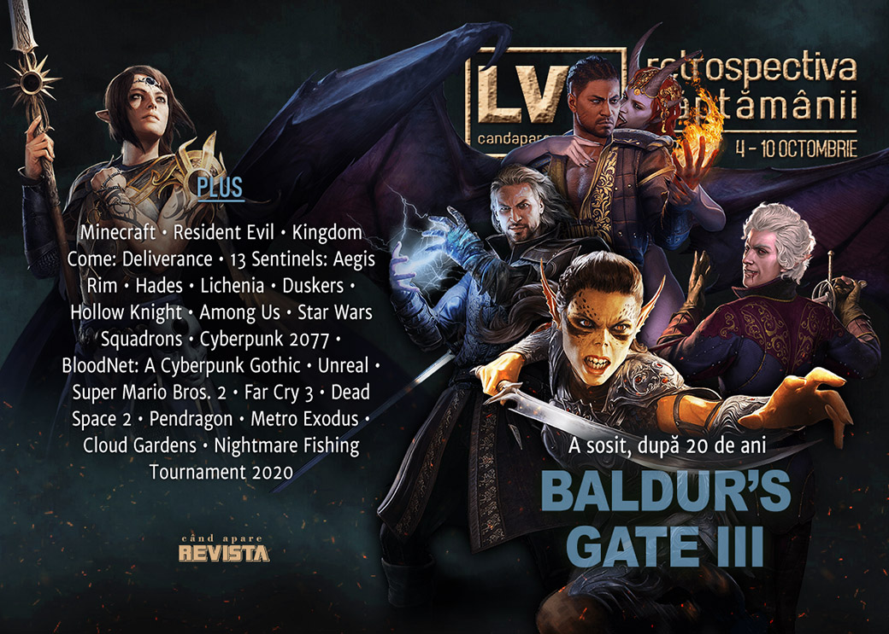

AMD prezintă noile procesoare Zen 3, marile companii tech sunt în vizorul Congresului SUA pentru practici monopoliste, filmele Resident Evil o iau de la capăt și a venit rândul Twitch să se afle în mijlocul unui scandal despre abuzuri sexuale și rasiale. Vom aveam și nou (de fapt vechi) joc **Need for Speed**, iar **Baldur's Gate III** poate fi jucat în sfârșit, deocamdată doar în _early access_.

Linkuri rapide:

* [Știri](#știri)
* [Articole (critică, dev, design)](#articole-critică-dev-design)
* [Anunțuri şi lansări de jocuri](#anunţuri-şi-lansări-de-jocuri)
* [Prăvălii de jocuri](#prăvălii-de-jocuri)

## Știri

* AMD anunță noua serie de procesoare Ryzen 5000 pentru desktop, construite pe arhitectură Zen 3, care vor cuprinde inițial patru modele: Ryzen 5 5600X, Ryzen 7 5800X, Ryzen 9 5900X și 5950X, cu 6, 8, 12 respectiv 16 nuclee. ([PC Gamer](https://www.pcgamer.com/amd-announces-ryzen-5000-cpus-available-november-5/), [DSOGaming](https://www.dsogaming.com/news/amd-officially-announces-its-ryzen-5000-cpus-releasing-on-november-5th/), [Eurogamer](https://www.eurogamer.net/articles/digitalfoundry-2020-10-08-amd-announces-ryzen-5000-desktop-cpus-to-challenge-intels-gaming-dominance), [Shacknews](https://www.shacknews.com/article/120809/amd-reveals-zen-3-cpu-microarchitecture), [VentureBeat](https://venturebeat.com/2020/10/08/amd-reveals-ryzen-5000-series-chips-with-towering-gaming-performance/))
  * [AMD Ryzen 5000: everything you need to know from AMD&#8217;s Zen 3 event](https://www.rockpapershotgun.com/2020/10/08/amd-ryzen-5000-everything-you-need-to-know-from-amds-zen-3-event) (RPS)
* Lansarea filmului Minecraft, programată inițial pentru martie 2022, a fost amânată până la o dată nespecificată. ([Destructoid](https://www.destructoid.com/stories/minecraft-movie-pushed-beyond-its-2022-release-date-606172.phtml), [Eurogamer](https://www.eurogamer.net/articles/2020-10-07-the-minecraft-film-loses-its-release-date-of-2022))
* Vom avea o adaptare live-action și pentru jocul **Kingdom Come: Deliverance**. ([Variety](https://variety.com/2020/film/global/kingdom-come-deliverance-erik-barmack-warhorse-studios-1234797631/), [Escapist](https://www.escapistmagazine.com/v2/kingdom-come-deliverance-live-action-adaptation-warhorse-studios-erik-barmack/))
* Iar seria de filme Resident Evil o ia de la început cu un reboot ce vrea să fie cât mai fidel primelor două jocuri din franciză. ([DSOGaming](https://www.dsogaming.com/news/the-resident-evil-movie-universe-is-being-rebooted/), [VideoGamesChronicle](https://www.videogameschronicle.com/news/resident-evil-movie-franchise-reboot-will-tell-an-origin-story-with-close-ties-to-the-first-two-games/), [Eurogamer](https://www.eurogamer.net/articles/2020-10-06-new-resident-evil-movie-reboot-heading-back-to-a-fateful-night-in-raccoon-city-in-1998))

* Un raport al unei comisii anti-trust din Camera Reprezentanților a Congresului SUA, redactat în urma unei investigații de peste un an ce a vizat marile companii Amazon, Google, Apple și Facebook, a concluzionat că acestea s-au angajat în practici neconcurențiale, făcând abuz de poziția lor pe piață. ([Eurogamer](https://www.eurogamer.net/articles/2020-10-07-us-government-report-takes-aim-at-big-tech-including-apples-30-percent-app-store-cut), [Game World Observer](https://gameworldobserver.com/2020/10/07/us-house-committee-calls-amazon-google-apple-facebook-gatekeepers-monopolistic-practices/), [GamesIndustry.biz](https://www.gamesindustry.biz/articles/2020-10-06-us-house-committee-says-amazon-google-apple-facebook-engaged-in-monopolistic-behavior))
* Activision-Blizzard își închid birourile din Franța. ([Bloomberg](https://www.bloomberg.com/news/articles/2020-10-06/video-game-publisher-activision-blizzard-to-close-france-office), [GamesIndustry.biz](https://www.gamesindustry.biz/articles/2020-10-06-activision-blizzard-closing-france-office), [VideoGamesChronicle](https://www.videogameschronicle.com/news/activision-blizzard-is-reportedly-shutting-its-france-office/), [Kotaku](https://kotaku.com/report-activision-blizzard-closing-french-office-1845289119))

## Articole (critică, dev, design)

* ['Video game planes emit real carbon': why gaming is not merely guilt-free escapism](https://www.theguardian.com/culture/2020/oct/05/video-game-planes-emit-real-carbon-why-gaming-is-not-merely-guilt-free-escapism) (The Guardian)
* [The reason video games keep infiltrating TikTok](https://www.polygon.com/2020/10/5/21356316/tiktok-video-game-sound-track-earthbound-super-mario-animal-crossing-meme) (Polygon)

---

### Actualitate
* [Ryzen 5000 pricing shows that AMD isn't the cheap alternative anymore](https://www.pcgamer.com/amd-ryzen-5000-price-increase/) (PC Gamer)

---

### Reportaj
* [Twitch staff call the company out on sexual assault, racism, more](https://www.gamesindustry.biz/articles/2020-10-08-twitch-staff-call-the-company-out-on-sexual-assault-racism-more) (GamesIndustry.biz) (TL;DR pe [Shacknews](https://www.shacknews.com/article/120831/twitch-employees-come-forward-with-stories-of-sexual-assault-abuse-and-racism), [Kotaku](https://kotaku.com/report-employees-accuse-twitch-of-indifference-to-sexu-1845316196) sau [PC Gamer](https://www.pcgamer.com/twitch-employees-allege-a-long-history-of-sexism-and-racism-at-the-company/))

---

### _Not-a-review_
* [13 Sentinels: Aegis Rim Is 2020’s Most Ambitious Video Game Story](https://www.escapistmagazine.com/v2/13-sentinels-aegis-rim-is-2020s-most-ambitious-video-game-story/) (Escapist)
* [Star Wars: Squadrons Is Exactly What I Needed](https://kotaku.com/star-wars-squadrons-is-exactly-what-i-needed-1845296664) (Kotaku)
* [Patterns in the Ivy](https://unwinnable.com/2020/10/09/patterns-in-the-ivy/) (Unwinnable)
* [Alone in Duskers](https://unwinnable.com/2020/10/08/alone-in-duskers/) (Unwinnable)
* [Tragedy Erased](https://unwinnable.com/2020/10/05/tragedy-erased/) (Unwinnable)
* [Among Us Is the Emotional Tether of 2020](https://www.escapistmagazine.com/v2/among-us-is-the-emotional-tether-of-2020/) (Escapist)

#### Hades
* [The genius of Hades’ God Mode](https://www.polygon.com/2020/10/6/21504219/hades-god-mode-difficulty) (Polygon)
* [Hades’ greatest achievement is its brilliantly designed endgame](https://www.theverge.com/2020/10/9/21507969/hades-supergiant-endgame-storytelling-narrative-rewards) (The Verge)
* [Hades makes endless struggle entertaining | Why I Love](https://www.gamesindustry.biz/articles/2020-10-06-hades-why-i-love) (GamesIndustry.biz)

---

### Industrie
* [The Cyberpunk 2077 crunch backlash](https://www.polygon.com/2020/10/7/21505804/cyberpunk-2077-cd-projekt-red-crunch-youtube-jason-schreier-labor-the-witcher-3) (Polygon)
* [Opinion: rethinking PC pricing in 2020](https://www.pcgamesinsider.biz/interviews-and-opinion/71579/opinion-rethinking-pc-pricing-in-2020/) (PCGamesInsider.biz)
* [The Video Game Market Will Change - And it Already Started](https://www.gamasutra.com/blogs/MichaelHoss/20201007/371458/The_Video_Game_Market_Will_Change__And_it_Already_Started.php) (Gamasutra)
* [Do or do not, there is no try – Electronic Arts and Star Wars](https://www.pcinvasion.com/do-or-do-not-there-is-no-try-electronic-arts-and-star-wars/) (PC Invasion)

---

### Istorie, retrospectivă
* [The story of Virtual Springfield, the Simpsons walking simulator that spawned a tourist attraction](https://www.pcgamer.com/the-story-of-virtual-springfield-the-simpsons-walking-simulator-that-spawned-a-tourist-attraction/) (PC Gamer)
* [A cyberpunk gothic](https://kimimithegameeatingshemonster.wordpress.com/2020/10/04/a-cyberpunk-gothic/) (Kimimi The Game-Eating She-Monster)
* [Unreal](https://obscuritory.com/action/unreal/) (The Obscuritory)
* [America Got The Better Super Mario Bros. 2](https://kotaku.com/america-got-the-better-super-mario-bros-2-1845330030) (Kotaku)
* [Everything is made of stardust](https://www.gamesindustry.biz/articles/2020-10-07-david-polfeldt-the-dream-architects) (GamesIndustry.biz)
* [From Game Boy to 3DS: The legacy of Nintendo's handhelds](https://www.gamesindustry.biz/articles/2020-10-08-from-game-boy-to-3ds-the-legacy-of-nintendos-handhelds) (GamesIndustry.biz)
* [Halo 3, BioShock, and Lost Odyssey: A Look Back at the Last Golden Age of Game Commercials](https://www.usgamer.net/articles/halo-3-bioshock-and-lost-odyssey-a-look-back-at-the-last-golden-age-of-game-commercials) (USgamer)

---

### Dev, making of, mecanici
* [A journey through Early Access helped make Hades a masterpiece](https://www.pcgamer.com/a-journey-through-early-access-helped-make-hades-a-masterpiece/) (PC Gamer)
* [How &#x27;Hades&#x27; Made a Genre Known For Being Impossibly Hard Accessible](https://www.vice.com/en/article/889zqa/how-hades-made-a-genre-known-for-being-impossibly-hard-accessible) (Vice)
* [Dead Space 2 director on designing the eye-poke scene: ‘I could barely watch it’](https://www.polygon.com/interviews/2020/10/4/21498961/dead-space-2-director-eye-poke-needle-scene-horror-wright-bagwell-interview) (Polygon)
* [Josh Bycer: How to design effective difficulty in video games](https://gameworldobserver.com/2020/10/06/design-effective-difficulty-video-games/) (Game World Observer)
* [How Arthurian tragedy drives the design of Pendragon](https://www.gamasutra.com/view/news/371236/How_Arthurian_tragedy_drives_the_design_of_Pendragon.php) (Gamasutra)

---

### Design, world-building, artă
* [Architectural Improvisation](https://unwinnable.com/2020/10/07/architectural-improvisation/) (Unwinnable)
* [Rewilding the Edgelands with &#039;Cloud Gardens&#039;](https://www.fanbyte.com/features/rewilding-the-edgelands-with-cloud-gardens/) (Fanbyte)
* [Why Superhero Video Games Need to Ditch &quot;Realism&quot;](https://www.fanbyte.com/features/why-superhero-video-games-need-to-ditch-realism/) (Fanbyte)
* [Lowlands Away](https://kotaku.com/lowlands-away-1845319471) (Kotaku)

## Anunţuri şi lansări de jocuri
### Anunţate
* **Need for Speed: Hot Pursuit Remastered** ([Destructoid](https://www.destructoid.com/stories/need-for-speed-hot-pursuit-remastered-coming-to-pc-and-consoles-next-month-605825.phtml))

### Acum cu dată de lansare
* **Disc Room**: 22 octombrie ([Destructoid](https://www.destructoid.com/stories/disc-room-isn-t-just-about-staying-alive-inside-arcade-deathtraps-605845.phtml))
* **Ziggurat 2**: 23 octombrie ([PC Gamer](https://www.pcgamer.com/ziggurat-2-brings-more-first-person-roguelike-dungeon-crawling-to-steam-this-month/))
* **Pumpkin Jack**: 24 octombrie ([Escapist](https://www.escapistmagazine.com/v2/pumpkin-jack-will-bring-ghoulish-platforming-just-in-time-for-halloween/))
* **The Medium**: 10 decembrie ([VideoGamesChronicle](https://www.videogameschronicle.com/news/the-medium-release-date-trailer-showcases-the-xbox-series-x-s-and-pc-games-dual-reality-world/))

### Anulate
* **Crucible** ([VideoGamesChronicle](https://www.videogameschronicle.com/news/amazon-confirms-it-will-shut-down-its-flagship-shooter-crucible-months-after-release/))

### Lansate
* 6 octombrie: **Baldur’s Gate 3** (early access) ([Steam](https://store.steampowered.com/app/1086940/Baldurs_Gate_3/), [gog.com](https://www.gog.com/game/baldurs_gate_iii))
* 6 octombrie: **Hadr** ([Steam](https://store.steampowered.com/app/1359760/Hadr/))
* 6 octombrie: **Primordials** ([Epic Store](https://www.epicgames.com/store/en-US/product/primordials-of-amyrion/))
* 6 octombrie: **Overcrowd: A Commute 'Em Up** (iese din early access) ([Steam](https://store.steampowered.com/app/726110/Overcrowd_A_Commute_Em_Up/))
* 6 octombrie: **A Game of Thrones: The Board Game - Digital Edition** ([Steam](https://store.steampowered.com/app/1075190/A_Game_of_Thrones_The_Board_Game__Digital_Edition/))
* 6 octombrie: **The Solitaire Conspiracy** ([Steam](https://store.steampowered.com/app/1424980/The_Solitaire_Conspiracy/), [Epic Store](https://www.epicgames.com/store/en-US/product/the-solitaire-conspiracy))
* 6 octombrie: **Democracy 4** (early access) ([Steam](https://store.steampowered.com/app/1410710/Democracy_4/), [gog.com](https://www.gog.com/game/democracy_4))
* 8 octombrie: **Neighbours back From Hell** ([Epic Store](https://www.epicgames.com/store/en-US/product/neighbours-back-from-hell/))
* 8 octombrie: **Falcon Age** ([Steam](https://store.steampowered.com/app/1075080/Falcon_Age/))
* 8 octombrie: **RIDE 4** ([Steam](https://store.steampowered.com/app/1259980/RIDE_4/))
* 8 octombrie: **I Am Dead** ([Steam](https://store.steampowered.com/app/951750/I_Am_Dead/), [Epic Store](https://www.epicgames.com/store/en-US/product/i-am-dead))
* 8 octombrie: **Ikenfell** ([Steam](https://store.steampowered.com/app/854940/Ikenfell/), [gog.com](https://www.gog.com/game/ikenfell))
* 8 octombrie: **The Uncertain: Light At The End** ([Steam](https://store.steampowered.com/app/925570/The_Uncertain_Light_At_The_End/), [gog.com](https://www.gog.com/game/uncertain_light_at_the_end))
* 9 octombrie: **FIFA 21** ([Steam](https://store.steampowered.com/app/1313860/EA_SPORTS_FIFA_21/), [EA Store](https://www.origin.com/gbr/en-us/store/fifa/fifa-21))
* 9 octombrie: **The Survivalists** (iese din early access) ([Steam](https://store.steampowered.com/app/897450/The_Survivalists/))

## Prăvălii de jocuri

### Știri
* [Steam Game Festival: Autumn Edition features hundreds of demos and developer streams](https://www.pcgamer.com/steam-game-festival-autumn-edition-features-hundreds-of-demos-and-developer-streams/) (PC Gamer)
* [Valve adds chat filter after successful Steam Labs test](https://www.gamesindustry.biz/articles/2020-10-07-valve-adds-chat-filter-after-successful-steam-labs-test) (GamesIndustry.biz)

### Update catalog
* [PC gamers can now play Days Gone and MediEvil Remake via Playstation Now](https://www.dsogaming.com/news/pc-gamers-can-now-play-days-gone-and-medievil-remake-via-playstation-now/) (DSOGaming)
* [The original roguelike, Rogue, is releasing on Steam](https://www.rockpapershotgun.com/2020/10/09/the-original-roguelike-rogue-is-releasing-on-steam) (RPS)

### Jocuri gratis și free weekends
* [To celebrate 5 years (and 9 million prisons built) Prison Architect is free to play until October 11](https://www.pcgamer.com/to-celebrate-5-years-and-9-million-prisons-built-prison-architect-is-free-to-play-until-october-11) (PC Gamer)
* [Rising Storm 2: Vietnam and Abzû are free for the week on the Epic Store](https://www.pcgamer.com/rising-storm-2-vietnam-and-abzu-are-free-for-the-week-on-the-epic-store) (PC Gamer)
* [Everything Is Garbage, so why not turn trash into cows?](https://www.rockpapershotgun.com/2020/10/06/everything-is-garbage-so-why-not-turn-trash-into-cows) (RPS)
* [Sonic The Hedgehog 2 is free to own on Steam until October 19th](https://www.dsogaming.com/news/sonic-the-hedgehog-2-is-free-to-own-on-steam-until-october-19th/) (DSOGaming)
* [Nightmare Fishing Tournament 2020 Is a Hilariously Horrific Free Fishing Simulation](https://www.escapistmagazine.com/v2/nightmare-fishing-tournament-2020-is-a-hilariously-horrific-free-fishing-simulation/) (Escapist)

### Reduceri și promoții
* [Weekend Console Download Deals for Oct. 9: PS Games of a Generation second chance](https://www.shacknews.com/article/120833/weekend-console-download-deals-for-oct-9-ps-games-of-a-generation-second-chance) (Shacknews)
* [Weekend PC Download Deals for Oct. 9: Free Sonic 2 on Steam](https://www.shacknews.com/article/120837/weekend-pc-download-deals-for-oct-9-free-sonic-2-on-steam) (Shacknews)

---

{}
**Retrospectiva săptămânii** este rubrica duminicală în care trecem în revistă evenimentele săptămânii de pe frontul de gaming: știri şi articole (scrise de alții, bineînțeles, că e mai ușor aşa), industrie, lansări, oferte de jocuri, toate numai de savurat la cafeaua de duminică dimineața.

De asemenea, rubrica e deschisă oricui vrea și poate contribui. Dacă ai citit vreun articol sau vreo știre interesantă și crezi că merită incluse în retrospectiva săptămânii, te așteptăm pe forum pe unul dintre topicurile dedicate: [Știri](https://forum.candaparerevista.ro/viewtopic.php?f=4&t=46), [Articole](https://forum.candaparerevista.ro/viewtopic.php?f=4&t=206), [Gaming România](https://forum.candaparerevista.ro/viewtopic.php?f=4&t=1622)].
{}
