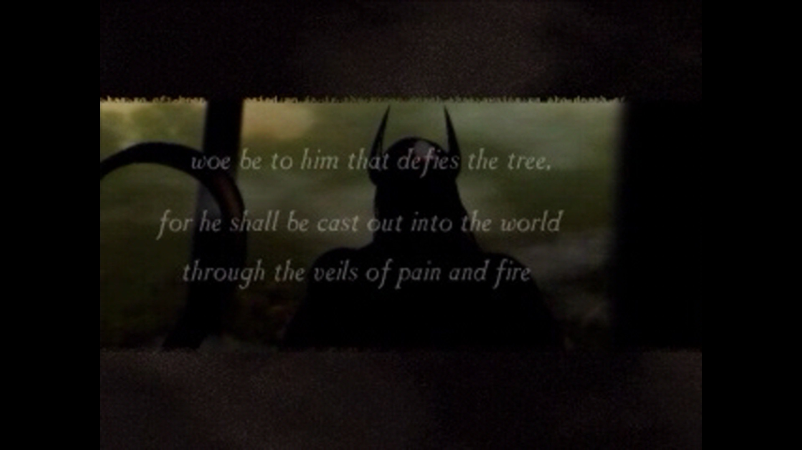
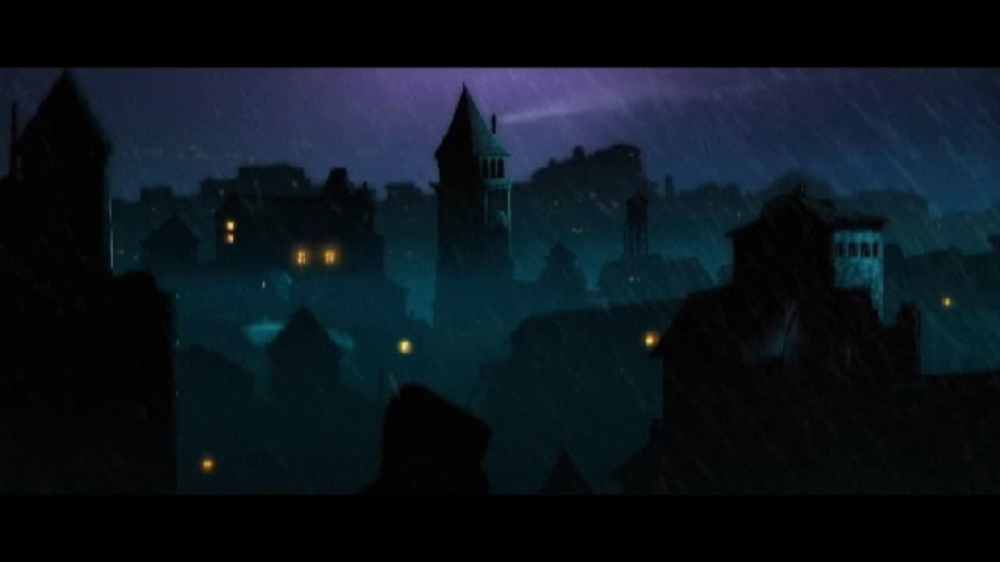
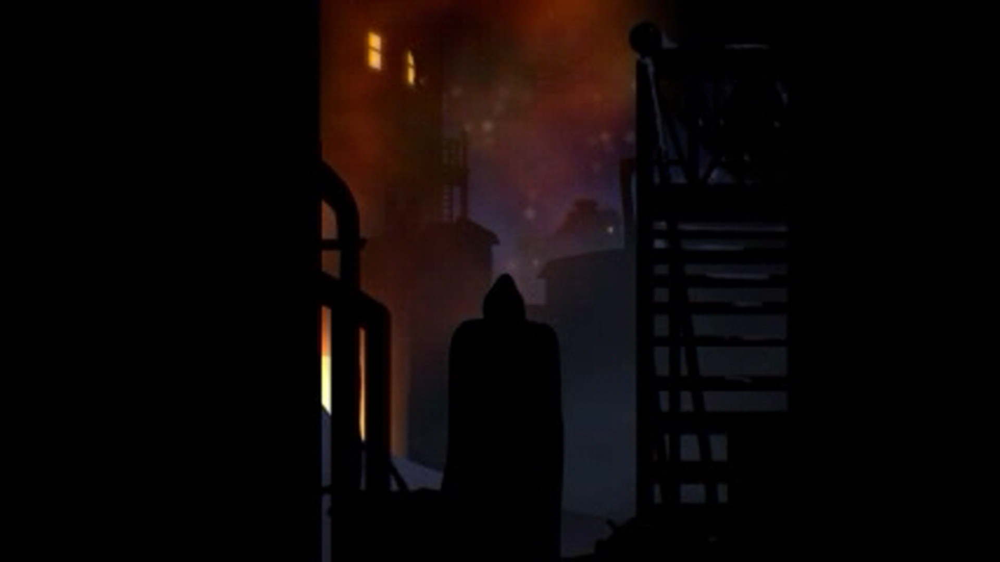
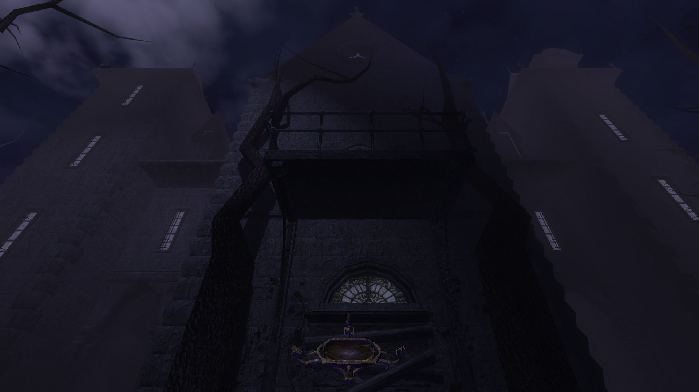
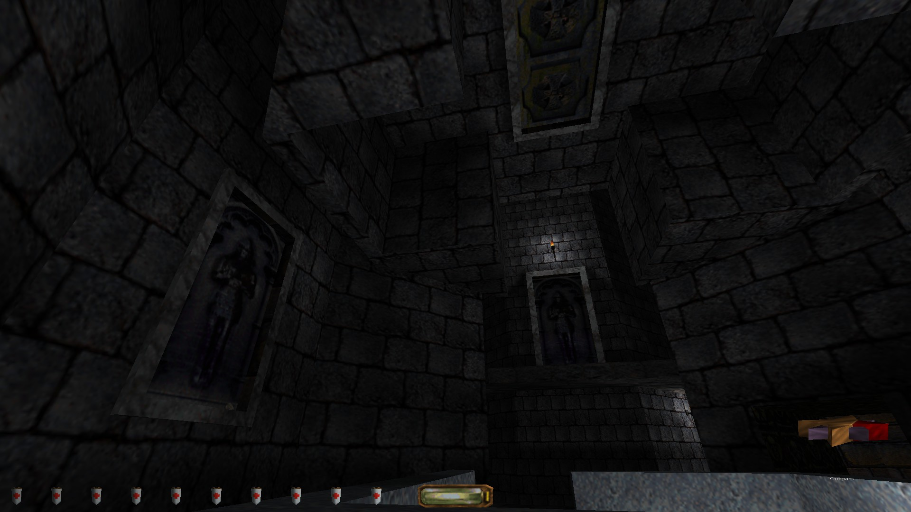
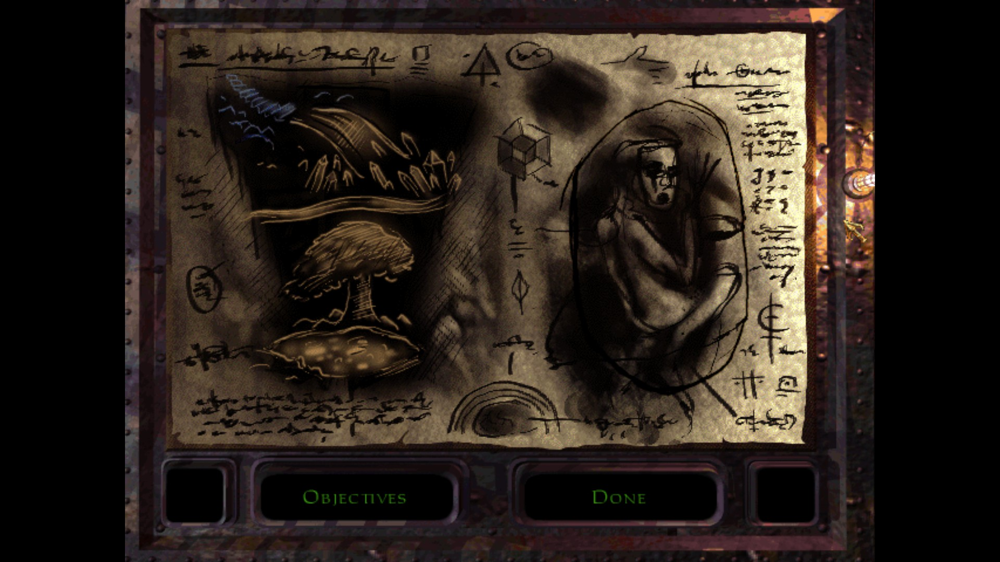
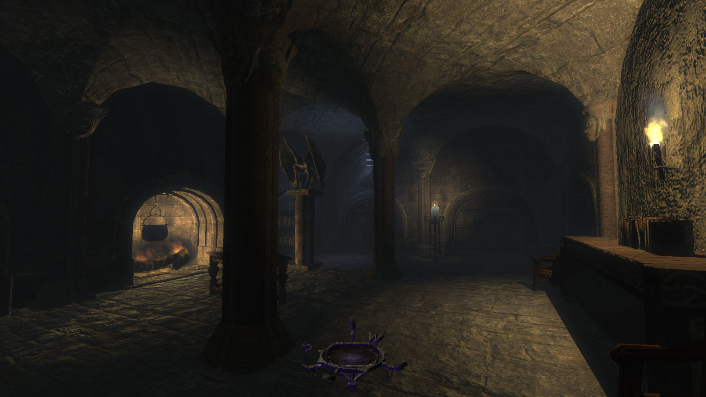

*Taffer: bastardizare a lui „Trickster”, utilizată în mod expletiv cu o versatilitate întâlnită în engleza modernă numai în cazul cuvântului care începe cu litera „f”.*

Exemple:

*"Get back out here, you taffer!"  
"Hey! Someone's been taffing through here!"  
"What the bloody taff!?"*

Jocurile seriei THIEF (*Thief: The Dark Project* [TDP – 1998], lansat într-o ediţie revizuită ca *Thief Gold* [TG], *Thief II: The Metal Age* [TMA – 2000], şi *Thief: Deadly Shadows* [TDS – 2004], create de defunctele Looking Glass Studios şi Ion Storm, distribuite de Eidos Interactive) sunt străvechi. Posibilitatea de a le rula pe calculatoare moderne se datorează în cea mai mare parte comunităţii de fani. Versiunile care fac subiectul acestei retrospective sunt peticite cu un suport tehnic neoficial şi au o serie de buguri reparate. Dincolo de aceste aspecte, discuţia priveşte conţinutul original al trilogiei.

Oricât de bine ar fi alese, cuvintele ţin de acea parte a realităţii lăsată în suspensie în urma încărcării acestor jocuri. Deşi potrivite în descrierea tehnologiei care le modelează sau a surselor de inspiraţie care le animă universul, ele devin complet inadecvate pentru evocarea trăirilor stârnite de experienţa virtuală. Utile aici sunt sunete mult mai simple, sunetele paşilor: paşi pe lespezi străbune, în catacombe prin care răsună chemarea unui corn de vânătoare bătut cu nestemate, paşi pe iarbă, într-o pădure fermecată ale cărei rădăcini străpung scoarţa lumii până la un tărâm al haosului primordial, paşi pe cenuşa depusă după ce focul a dezgolit o întruchipare a răului. La suprafaţă există un contrast între titluri, provocat în bună măsură de schimbări tehnologice şi tematice. Ideile propuse duc de fiecare dată spre alte zări ale imaginarului: un basm cu ecouri ale mitologiilor europene, o distopie cibernetică şi un horror gotic. Cu toate acestea, seria păstrează un caracter unitar. Mai întâi, acesta este menţinut de elemente de continuitate. De la mici detalii, precum utilizarea consistentă a unor caracteristici lingvistice, a unor elemente ale mitologiei şi asocierea lor în mod biunivoc cu anumite fragmente sonore, prin vocile aceloraşi actori ce dau glas personajelor recurente şi până la evocări de o atenţie impresionantă. De exemplu, o parte importantă din TDS se petrece în primele camere pe care le întâlneşti în tutorialul din TG, unde nu au alt rost decât să te facă să caşti gura înmărmurit la o boltă înstelată; este o prevestire magistrală a irealului prin care te va purta trilogia. Dincolo de asta, unitatea experienţei este asigurată şi de natura trăirilor jucătorului. Deşi cameleonic în prezentare, THIEF este mereu despre paşi atenţi sub umbra supranaturalului, în murmurul nopţii. În cele ce urmează, voi încerca, atât cât îmi permit cuvintele, să explic fascinaţia personală pentru aceste jocuri copleşitoare.

### *Hey, The City almost looks bearable from up here!*

Prozaic doar în nume, Oraşul este o himeră arhitectonică. Cetăţi de inspiraţie normandă se ridică alături de edificii în stil victorian, iar străduţe înghesuite, de cătun medieval, conduc la porţi încadrate de colonade clasice. Peste toate se strecoară flacăra încă mocnită a unei revoluţii industriale; radianţa mistică a lampioanelor se împleteşte cu suflul maşinilor cu aburi şi zumzetul generatoarelor electrice. Nu e însă suficient pentru a înlătura senzaţia rece, de sfârşit de toamnă, purtată de vânt peste cerul de noapte. De aceea, interioarele sunt mereu îmbietoare, fie prin larma unor petrecăreţi, prin culorile aprinse de pe o emblemă (stelele şi luna pentru laboratorul alchimistului, săbiile încrucişate pentru fierărie) sau întrezărite printr-o fereastră deschisă. Oraşul nu e numai confluenţa unor epoci, ci şi a dimensiunilor. Aceleaşi străzi care duc la conace fastuoase arată calea spre ruine subterane, spre turnurile magilor sau complexe mortuare ale căror rezidenţi nu şi-au găsit liniştea.

Periplul tematic este vizibil şi în înfăţişarea locuitorilor săi. Vestimentaţia porneşte de la armurile din zale ale gărzilor şi merge până la garderoba elisabetană a înaltei societăţi. Limba este un amalgam ce conţine engleza modernă, o formă arhaică a acesteia şi un dialect primitiv, plin de cuvinte compuse ce suplinesc limitele vocabularului. Viaţa spirituală este la rândul ei o vâltoare a ideilor. Dominantă este o religie ce aminteşte, atât în spirit cât şi în prezentare prin fragmente de scriptură, de creştinismul Vechiului Testament. La centrul ei se află un zeu făurar, considerat ca fiind cel care a scos omenirea din noapte şi care, prin intermediul uneltelor şi meşteşugurilor, a pus-o la cârma naturii şi a propriului său destin. Printre alte prezenţe mult mai discrete se află un ordin druidic ce venerează o entitate antropomorfă. Un zeu ce sintetizează trăsături ale lui Cernunnos, Dionis şi Loki, el este stăpânul misterelor, sălbăticiei şi al omului în epocile premergătoare venirii Făurarului.

În aparență, Oraşul este condus de un Baron enigmatic. Realitatea străzii este însă aceea că cetatea este păpuşată de un număr restrâns de familii nobile cu care te intersectezi fie numai prin vorbe aduse de vânt, fie în timpul escapadelor nocturne. Separaţia între talpa oprimată şi elită nu este însă deloc prezentată bombastic, lucru ce inevitabil ar aluneca în ridicol, ci ca o parodie care împunge ocazional cu un umor ascuţit. Pisanţii îşi mormăie în barbă amărăciunile şi dorinţele de mărire, iar nobilii se feresc de ei ca de cel cornut, să nu cumva să prindă vreo boală. Interesant este că imediat sub luciu şi opulenţă toate casele înstărite ascund multă mizerie. De la jocurile murdare ale unor "făcuţi" cu tuşe caricaturale de parvenitism şi incultură şi până la secrete morbide, devine remarcabil cât de intim poţi ajunge cu un om pe care nu l-ai cunoscut niciodată în persoană, dar pe care l-ai jefuit până n-a mai rămas decât cu amărăciunea lacrimilor.

Pentru TG şi TMA, Oraşul este de multe ori o întrezărire de contururi şi lumini aflate dincolo de limitele unor niveluri care sunt, simplu spus, imense. Există şi contraexemple emblematice, cum este cazul misiunii "The Life of the Party" din TMA: o aventură peste acoperişurile dintr-un cartier bogat (*they don't call it the Thieves' Highway for nothing...*), cu opriri în apartamente, castele şi turle vrăjitoreşti, iar cu destinaţia finală într-un turn unde, în spatele unui banchet trântit pentru crema societăţii, se coace un plan sinistru. Lucrurile stau altfel în TDS, unde Oraşul poate să fie călcat piatră cu piatră între misiuni. Din păcate, pasul spre conceptul de lume deschisă este unul poticnit din cauza limitărilor tehnologiei vremii, TDS fiind singurul joc din serie dezvoltat în paralel pentru PC şi console. În primul rând, această realizare a Oraşului este extrem de mică în comparaţie cu predecesorii, cam cât un cartier mai prăpădit din TG. În al doilea rând, deşi atmosfera mai este salvată de sunete, de contrastul dintre culorile nopţii şi căldura interioarelor, reprezentarea rămâne destul de fadă. Acest Oraş pare mai degrabă un burg rustic cu ornamente generice, şi nu creuzetul cultural aflat în clocotul vremurilor şi în volbura magiei. Nici locuitorii iteraţi procedural nu par mai convingători, ba din contră, sunt mult mai artificiali decât poligoanele zgribulite care se plângeau că iar au prins tura de noapte. Faptul că este înţesat cu ecrane de încărcare a următoarei zone şi că jocul te obligă prin construcţie să-l baţi înainte-înapoi pentru a valorifica prada sau pentru a te reechipa, iar nu ajută prea mult. Sunt acţiuni de rutină care nu reuşesc decât să alunge momentan fantasma şi să-ţi aducă aminte că nu cutreieri străzile prin umbre, mai tăcut ca sfârâitul torţelor, ci că te afli pe un scaun, în faţa unui biet joc video.

Un fapt interesant, valabil pentru întreaga serie, este că nu există casă ce merită să fie prăduită în Oraş care să nu fie şi bântuită. Poate să fie o simplă adiere prin încăperi, atunci când sunt pustii şi lumina este stinsă, sau o manifestare persistentă a unei tragedii apuse, aflată la graniţa tangibilului. Fenomenul rămâne mereu dincolo de limita percepţiei imediate, astfel că toţi, de la stăpâni până la servitori şi paznici, rămân ignoranţi faţă de prezenţa sa. Un exemplu strălucit în acest sens este misiunea "Casing the Joint" din TMA. Într-un conac aproape pustiu, în care vântul de noapte adie printre umbre ca o răsuflare stinsă, numai jucătorul este conştient că la fiecare pas se strecoară între două lumi cu frontiere cât se poate de permeabile. Şi asta pentru că în THIEF nu te afli sub gluga unui coţcar oarecare, ci a unui antierou de legendă.

### *"I am a collector, Mister Garrett. But there are some items that are not available for purchase. They must be acquired using other means. In this case the item in question would be best acquired by thieving. Not simple thieving, no. I need an artist... like yourself."*

Garrett era un copil al străzii ce reuşea să câştige suficient din furtişaguri şi plimbat mesaje cât să nu-şi lase coastele să-i cunoască şira spinării. Într-o noapte, a remarcat un dubios pe care restul trecătorilor nu păreau să-l observe. A încercat să-l buzunărească şi a fost prins, dar în loc să fie dat pe mâna adepţilor Făurarului (pentru care singurele căi de a îndrepta un hoţ constau în diverse grade de molestare a mâinilor, de la opărire şi până la tăiere), s-a trezit lăudat de străinul misterios şi invitat să-şi perfecţioneze abilităţile. Astfel i-a cunoscut pe Tăinuitori, membri ai unei societăţi secrete preocupată cu menţinerea echilibrului între multitudinea de facţiuni şi forţe oculte prezente în Oraş. Deşi antrenat pentru a intra în rândurile lor, după ani de pregătiri Garrett îi părăseşte, hotărât să-şi pună talentul în slujba propriilor buzunare. Astfel, începutul fiecărui joc găseşte protagonistul în aceeaşi postură: chiriaşul unui apartament modest de mahala, amuzat de pretenţiile înaltei societăţi şi în pregătire cu o nouă spargere care să îi asigure banii de întreţinere. Vocea hoţului îi aparţine lui Stephen Russell. Ca o notă de apreciere a contribuţiei sale la întreaga serie, nu o să spun decât că prestaţia lui face o mare cinste tenebrelor care înveşmântează aceste jocuri.

Abilităţile native ale hoţului ţin întru totul de îndemânarea jucătorului. Elementul principal al repertoriului este un giuvaier a cărui brilianţă dă măsura vizibilităţii sale. În funcţie de luminozitatea ambientală, de poziţia asumată (drept sau ghemuit) viteza de deplasare (furişat, mers normal sau fugă) şi eventualul echipament pregătit, giuvaierul indică nuanţe între invizibilitatea totală, o percepţie asupra hoţului ca o vedenie ce nu tulbură veghea unui paznic mai mult de o clipă şi o imagine clară ce îi deconspiră prezenţa. La fel de multă atenţie trebuie abătută şi asupra zgomotului făcut de trecerea sa. Iarba atenuează atât de mult sunetul încât permite mişcări cât se poate de agresive, pe când metalul sau marmura vor ridica tot nivelul în stare de alertă dacă te năpusteşti pe ele ca un ageamiu. Dată fiind natura meseriei sale, Garrett este un tip extrem de agil şi are la dispoziţie o serie întreagă de cascadorii: e capabil să escaladeze ziduri (inclusiv să se agaţe de acoperişuri sau metereze aflate la limita unei sărituri deja riscante), poate amortiza şocul şi sunetul unei căzături de înălţime apreciabilă, cu condiţia să fie ghemuit la începutul execuţiei şi se poate contorsiona în moduri, de ce să nu spunem, bizare anatomiei umane, dar foarte utile pentru când jucătorul doreşte să observe ce se întâmplă după un colţ sau să interacţioneze cu un obiect aflat puţin prea departe.

Lucrurile se schimbă destul de semnificativ în TDS, datorită introducerii unui model fizic tridimensional pentru Garrett, prezent chiar şi când jocul este abordat dintr-o perspectivă first person. O adiţie excelentă este o mişcare ce îi permite hoţului să se preseze cu spatele de pereţi. Manevra e utilă nu numai pentru exploatarea umbrelor din colţuri sau alcovuri, dar şi pentru strecurarea prin spaţii înguste, chiar sub nasul gărzilor. Sunetul făcut de hoţ e puţin regândit, în sensul că materialele "sigure" din primele jocuri sunt ceva mai zgomotoase, dar în acelaşi timp şi suprafeţele periculoase sunt temperate. Numai podelele metalice îţi pun toată lumea în cap, dar nu prin sunete care sugerează că Garrett ar fi ieşit la prăduit pe tocuri, cum e cazul în primele jocuri, ci mai degrabă datorită unor îmbinări sau lagăre şubrede, ce sunt puse în mişcare sub greutatea sa. Şi cascadoriile sunt în mare parte absente. Deşi Garrett se pricepe în continuare la căţărat peste garduri şi sărit balustrade, sunt foarte puţine locuri în joc în care acest lucru este cu adevărat necesar. Zgomotul produs de o cădere depinde acum numai de înălţime şi de suprafaţa de contact, iar contorsionările sunt reduse la priviri după colţuri ce respectă posibilităţile de mişcare ale corpului uman.

Cu răbdare, urechi ciulite şi ochi atenţi, toată seria poate fi terminată pe dificultatea maximă utilizând numai abilităţile native hoţului, mai ales că după o anumită experienţă de joc începi să simţi destul de bine cât de mult poţi forţa nota fără să fii observat. Nu înseamnă că este uşor, iar uneori sunt necesare artificii aflate pe o muchie destul de ascuţită între un element de gameplay şi exploatarea motorului jocului. Din fericire, Garrett are o trusă de unelte capabilă să acopere un spectru larg de nevoi potlogăreşti. Cea mai bizară sculă din arsenal este un săbioi prezent în TG şi TMA. De ce ar pleca cineva chitit pe şuteala epocii cu aşa ceva brâu, ăsta rămâne unul din marile mistere ale Oraşului. E de o utilitate discutabilă pentru un jucător obişnuit (dar nu vă temeţi, lumea e mare şi-s destui duelişti hardcore printre noi) şi îngreunează considerabil mişcările când este scoasă din teacă. Comportamentul ei în timpul unei lupte este modelat de parcă ar fi o armă boantă (poate dărâma şi uşi pentru cine nu reuşeşte să găsească cheia potrivită sau îi e lene să spargă încuietoarea), dar coliziunea dintre săbii este modelată foarte satisfăcător, cu multă greutate şi un scăpărat metalic dat de întâlnirea lamelor. În TDS este înlocuită cu un pumnal care şade mai frumos la cingătoarea hoţului. Deşi la fel de inutil în joc, Garrett ştie nişte scheme cu el care l-ar face spaima oricărui ghetou.

Un ajutor mult mai de nădejde vine din partea unei bâte care poate lăsa majoritatea oponenţilor inconştienţi cu o lovitură bine plasată. În TG şi TMA, utilizarea ei ţine mai mult de elementul surpriză şi nu neapărat de poziţionare. Chiar dacă ai dat nas în nas cu un paznic, atâta vreme cât acesta nu e deja suspicios, îţi rămâne o fereastră de aproximativ o secundă în care o lovitură în plin îl poate lăsa blană. TDS reuşeşte să strice mult din farmecul utilizării bâtei, restricţionând-o la contextul în care eşti aliniat perfect cu spatele adversarului. De menţionat aici că un trup inconştient trebuie luat în spate şi ascuns, pentru ca găsirea lui să nu-i pună pe ceilalţi inamici în gardă. Ce-i ciudat în TDS e că arma unui oponent neutralizat rămâne în locul în care acesta a fost doborât. Aproape nimănui din Oraş nu i se pare bizar când un paznic dispare, dar la postul lui se află o armă căzută aiurea.

Cea mai versatilă unealtă din arsenal este un arc dotat cu o sumedenie de tipuri de săgeţi. Există săgeţi folosite pentru a ucide, săgeţi care produc un zogomot puternic în zbor, pentru a provoca diversiuni şi săgeţi cu câte un sortiment de cristal pentru fiecare dintre cele patru elemente clasice ale alchimiei, fiecare dintre acestea având mai multe scopuri utilitare. De exemplu, săgeţile cu apă sunt folosite în principal pentru a stinge torţe, creând astfel mai mult întuneric pentru tupilare. Dacă sunt binecuvântate de Făurar în TG, pot fi folosite pentru a răpune anumite creaturi supranaturale, iar în TDS pot fi folosite pentru a spăla urme de sânge sau pentru a mări suprafeţe vegetale, pe care paşii sunt extrem de tăcuţi. Ca un detaliu drăguţ din TDS, cristalele de la vârful acestor săgeţi sunt mereu înconjurate de un clipocit mistic. E un strop binevenit de magie într-un decor care adeseori e destul de şters, mai ales pe străzile Orașului. Piesa de rezistenţă din primele jocuri este dată de săgeţile cu funie, care pot fi ancorate de orice suprafeţe de lemn (iar în TMA există un tip de funie care se poate fixa şi de grilaje metalice). Asta deschide o grămadă de posibilităţi pentru un hoţ atent şi creativ, utilizarea lor inteligentă schimbând radical posibilităţile de abordare pentru un nivel. Din păcate, ele sunt absente din TDS, fiind înlocuite cu nişte mănuşi care permit căţărarea pe pereţi de piatră sau cărămidă. Din cauza acestei schimbări, nu numai că dispar acrobaţiile electrizante ce erau posibile cu ajutorul funiilor, dar jocul nu reuşeşte să ofere aproape niciodată un motiv interesant care să impună folosirea mănuşilor.

Mai departe, Garrett are la dispoziţie o suită impresionantă de jucării electromecanice, poţiuni şi obiecte mistice, de la grenade care produc un bliţ orbitor, prin licori care-l fac temporar invizibil sau îi măresc viteza de alergare, şi până la posibilitatea de invoca broscuţe kamikaze. Numărul acestor accesorii este mult redus în TDS, ca şi necesitatea lor. Teoretic, poţi să arunci o sticlă cu ulei pe jos pentru a face gărzile care te urmăresc să alunece. Poţi să şi dai foc respectivei bălţi cu o săgeată aprinsă, pentru a bloca un pasaj. Practic însă, jocul nu-ţi prea-ţi oferă un temei real ca să faci asta. Singurul context în care am apelat la ulei în flăcări a fost cel în care doream să reaprind nişte lumânări, ca să iasă mai frumos o poză pentru review. Nu am putut să folosesc direct o săgeată aprinsă, deoarece aceasta explodează la impact, iar unda de şoc aruncă lumânările în toate colţurile camerei. Astfel, a trebuit să las flacăra să se propage de-a lungul unei dâre de ulei. Bine, sticlele cu ulei mai au o utilitate absolut ilară şi care aruncă o umbră tragicomică asupra întregului joc, dar e bine să încercaţi să o descoperiţi singuri.

Dincolo de abilităţi şi unelte, talentul antologic al lui Garrett rămâne cel de a fura trezorerii întregi fără ca pasul să i se poticneasă vreodată, indiferent de câte tablouri în ramă, bulgări preţioşi sau kilograme de bijuterii duce în spinare, şi fără ca buzunarele să-i zornăie sub greutatea banilor. Una dintre admiratoarele lui din TDS se şi întreabă, pe bună dreptate, cam cât de lucrat trebuie să fie hoţul nostru, de cară noapte de noapte atâta pradă fără să asude.

### *"Oh, I've got the heebie-jeebies something awful! I feel like there's someone watching me, even now...."*

Fiecare misiune din TG şi TMA este deschisă de câteva citate criptice care în general au o perspectivă mai largă asupra poveştii. Urmează un monolog al lui Garrett (cu rare dialoguri în câteva momente cheie), rostit peste o succesiune de ilustraţii ce prezintă scene relevante pentru respectiva aventură. Prezentarea este împodobită cu un fundal sonor care, urmând scenele vizuale, potriveşte perfect tonul capitolului. Îmi e imposibil să găsesc în colecţia mea de jocuri un exemplu mai reuşit de briefing. La fel se pune problema şi în cazul selectării dificultăţii: seria THIEF este una dintre una dintre puţinele cunoscute de mine în care dificultatea ridicată nu se reduce la o simplă rescalare a numerelor din culise în defavoarea jucătorului, ci îi cere acestuia mai multă măiestrie asupra meşteşugului său, în cazul de faţă o mai elegantă demonstraţie a artei hoţiei. Diferenţa majoră dintre "normal" şi "expert" nu se referă atât la numărul de inamici sau la nivelul lor de atenţie, cât la faptul că Garrett trebuie să îndeplinească mai multe obiective (mereu personalizate pe specificul misiunii) şi să fie mai discret în acţiunile sale. Merită spus că lucrurile nu sunt mereu bătute în cuie, iar în unele misiuni lista de obiective se schimbă, uneori chiar ca o consecinţă a acţiunilor jucătorului.

TDS reprezintă din nou un pas înapoi, înlocuind ilustraţiile şi ambientul personalizat din briefing cu un monolog scurt al lui Garrett peste un fundal purpuriu şi cu tonul dat de muzica meniului principal (plină cu trimiteri la tainele din TG, dar totuşi). Obiectivele unice din misiuni sunt acum înlocuite cu nişte indicatori generici ataşaţi scopului principal, care e mai mereu unul static. Creşterea dificultăţii face referire la procentul din pradă care trebuie furat şi la un număr de aşa numite "special loot items" ce trebuie obţinute. Păi în TG, când te pogori în catacombe pe "expert", nu e niciun special loot. Ai de furat nişte giuvaiere cu nume şi prenume, cu o poveste întreagă în spatele lor, spusă chiar de nivelul care îţi stă în cale, de eşecul altor jefuitori de morminte, de capcanele şi umbrele pe care trebuie să le înfrunţi. În TDS găseşti o sticlă de vin sub un birou, iar ridicarea ei este semnalizată de zdrăngănitul (pe cât de plăcut, pe atât de standard) prăzii și de textul "special loot found". Fantastic, ce să zic. Tresalt sub imperiul euforiei.

Ceea ce TDS reușește să facă într-o anumită măsură mai bine ține de comportamentul paznicilor. Lăsând la o parte bizarerii precum fenomenul armelor căzute la datorie, paznicii în general intră mult mai ușor la bănuieli dacă îţi prind umbra cu coada ochiului, dacă îți aud pașii sau observă ceva suspect (uși lăsate deschise, torțe stinse, obiecte prețioase lipsă), iar alerta se propagă dinamic între ei. Mai mult, au un câmp de vedere modelat ceva mai realist, astfel că poţi profita de o întoarcere a privirii pentru a scăpa nedetectat. Chestia e că TDS o ține brazdă de-a lungul întregii aventuri cu acest comportament, pe când lucrurile sunt mai nuanțate în jocurile vechi. Paznicii unui șefuleț mai pricăjit pot fi prinși băuți la post; sunt suficient de prost plătiți cât să-i doară mai tare că-i trage curentul pe coridoare și nu că acesta stinge torțele. Pe de altă parte, gărzile unui mare bostan sar imediat la bătaie dacă laşi o uşă întredeschisă, iar unii inamici care sunt numai marginal umani te pot simţi la cel mai mic foşnet. Cu excepția unor situaţii programate special, până la TDS oponenţii nu prea intră niciodată în alertă când dispar bunurile. E totuşi greu de spus unde e mai bine să tragi linia de compromis între realism și mecanică de joc. Adevărul e că-i destul de bizar să tot jefuiești o locație, ei să tot observe că marfa dispare, dar până la finalul misiunii clădirea să nu fie înconjurată și scotocită prin toate cotloanele.

Cu toate astea, în opinia mea păcatul suprem al lui TDS este acela că nu impune pe "expert" cruţarea gardienilor. Jocurile anterioare susţin clar ideea că Garrett este un hoţ şi nu un ucigaş, iar TG în special prezintă un atlas întreg de monstruleţi (unii deloc drăgălaşi) pentru cei care vor neapărat să-şi pună armele letale la bătaie. Chiar dacă lucrează în slujba unor indivizi opaci, gardienii umani nu sunt niciodată răufăcători, ci simpli cetăţeni care duc mâncarea acasă prin muncă cinstită. Iar comentariile lor când se lungeşte tura şi noaptea-i plicticoasă sunt de multe ori de ruina minţii. Ciuliţi urechile în mod deosebit după doi eroi anonimi, unul de tipul dulăului stingher, iar camaradul său un grob cu inima de aur şi vocea de zgură (culmea, tot în interpretarea lui Stephen Russell). Producătorii au avut inspiraţia să le intersecteze calea cu drumul lui Garrett de-a lungul întregii serii.

### *"Tombs with piped-in music! How classy!"*

Modelarea excepţională a propagării sunetului în THIEF se datorează programatorilor care au construit motorul original. Mulţumită lor, urechile te ajută chiar mai mult ca ochii în localizarea şi stabilirea numărului gărzilor, şi uneori chiar în orientare, dacă se întâmplă să ai la dispoziţie ecoul unui obiectiv îndepărtat. Dincolo de acest aspect de utilitate practică, aş zice că sufletul seriei se află în ideea că sunetul trebuie să fie un mediu complementar percepţiei vizuale pentru prezentarea poveştii.

Geniul din spatele reuşitei acestei abordări este un muzician pe nume Eric Brosius. Marele lui succes constă în diluarea frontierelor dintre sunetele ambientale și coloana sonoră propriu-zisă. Ceea ce rezultă este o vibrație mereu discretă, uneori alcătuită dintr-o buclă de numai câteva secunde, dar al cărei efect este întru totul hipnotic și principalul responsabil pentru capacitatea experienței virtuale de a imersa jucătorul. Această (impropriu spus) muzică, mereu croită pe măsura nivelului care ţi se deschide în faţa ochilor, este atât de bine aleasă încât reușește să-ți sporească atenția la ceea ce se petrece în jur, iar de multe ori este folosită pentru a transmite sau a sublinia într-un mod subtil informaţii pe care urmează să le primeşti şi vizual. În subterane auzi clipocitul apei şi tânguiri prelungi, grele ca întunericul, ce se sting în note firave precum licăritul bijuteriilor după care scotocești. Templul Făurarului vuieşte cu percuţii ritualice şi cântece sacre. Clinchetul clopoţeilor de vânt persistă în urma trecerii unui rege cu o coroană de frunze, iar toate aceste convenţii sonore, ce devin o parte integrată a lumii, sunt respectate pe întreg parcursul trilogiei. Calea buclelor sonore legate de specificul unei porţiuni de nivel este urmată în TG și TMA în mare parte din limitările tehnice ale momentului la care au fost realizate. În cel de-al treilea titlu, cu siguranţă este aleasă pentru a păstra viu spiritul seriei, chiar dacă în acest caz există momente de tranziție spre o coloană sonoră distinctă, orchestrată de instrumente clasice. Este poate singurul capitol la care TDS este întru totul la înălţimea predecesorilor săi, iar uneori chiar o idee peste.

Greu de depăşit şi cu totul întru înfiorarea oaselor sunt sunetele (ne)fiinţelor care populează tărâmurile jocurilor. Fiecare titlu are cel puţin un inamic a cărui manifestare acustică te face să te îndeşi ca un şoarece speriat în cel mai întunecat ungher, de unde priveşti temător, fără să mai îndrăzneşti să faci vreo mişcare. Dacă pui la socoteală şi faptul că în general nu ai absolut nicio şansă într-o luptă cinstită cu un oponent inuman, ajungi la un nivel de tensiune pe care eu l-am mai întâlnit numai în seria Amnesia. Cine caută nadirul viselor rele, îl poate găsi în TDS. Revizitez un nivel anume o dată la cîţiva ani şi mereu mă termină din primele secunde, numai din buhăielile celor mai ticăloşi huhurezi redaţi în istoria plăcilor audio. Ştiu oameni care au ajuns să cunoască fiecare palmă din respectiva misiune şi care totuşi nu reuşesc să parcurgă anumite secţiuni ale ei altfel decât în patru labe, cu inima cât un purice şi răsuflarea tăiată. Sunt doborâţi mereu de bruiajul ce ascunde sub cadenţa domoală, specifică seriei, un nihilism visceral. Ţi se strecoară tiptil pe sub piele şi abia când ajungi în cea mai odioasă beznă, de unde nu mai poţi face cale întoarsă, abia atunci înfloreşte într-un concert al mizeriei sufleteşti.

Ar fi însă păcat să menţionez numai amintirile apăsătoare. Iniţial concepută astfel din considerente de marketing, uvertura lui TG este o infuzie de testosteron pompat de o chitară distorsionată. Culmea e abordarea s-a dovedit atât de potrivită cu personalitatea lui Garrett şi natura aventurilor sale, că a ajuns să-i încadreze toate peripeţiile. Chiar dacă ambientul sonor este ca o mare a straniului şi supranaturalului, există pe întinderea sa creste deloc firave de suspans, mai ales deasupra străzilor Oraşului, sau de mister şi anticipare când începi să desfăşori secretele unui edificiu unde eşti singur-singurel. E chiar şi un strop de neuitat de romantism, ca ramă de portret pentru o anume domniţă. Până şi medalionul acustic purtat de îndeplinerea unui obiectiv se transformă repede într-un sinonim al satisfacţiei. O imagine sugestivă pentru bogăţia spectrului de culori a designului sonor dintr-un titlu anume al seriei poate fi găsită mereu chiar pe ilustraţia de pe cutia sa. În THIEF, o abordare de genul *what you see is what you get* e lipsită de temei. Mai degrabă, *what you see is always only the surface part of what you hear*.

***"Comes a man, less one eye, to carry me again. 
Can you hear me from up there, little man? I have a secret to tell. 
Come down here, where I can get a better look at you."***

Dincolo de calitatea vizionară a gameplayului, apreciez TG în primul rând ca un basm desăvârşit, atât în execuţie cât şi în conţinut. Am citit la un moment dat că s-ar sesiza printre nuanţe inclusiv o variantă inversată a legendei arturiene, dar dacă lucrurile stau într-adevăr aşa, ele sunt spuse într-un mod mult prea subtil pentru mine. Este totodată cel mai variat joc din serie, purtându-te mult deasupra, dar mai ales dedesuptul, Oraşului. Nivelurile mele preferate sunt tocmai cele care au mai puţin de-a face cu normele acceptate ale potlogăriei şi mai mult cu mirarea ochilor în faţa unor minuni inexplicabile, din al căror farmec furi şi tu puţin, cu un talent pe măsura faptei.

TMA este mult mai direct în expunere şi renunţă la nuanţele poveştii în favoarea unei mai mari agresivităţi senzoriale, inspirată de curente artistice moderniste. Este conceput mai întâi pentru a satisface dorinţa fanilor pentru mai multă infiltrare şi şuteală. Acest lucru se observă în nivelurile uriaşe, gândite analitic pentru a fi abordabile în fel şi chip, şi uşor diferite la fiecare generare, fie că-i vorba de un set schimbat de patrule, de câţiva paznici noi sau de o altă amplasare a unor dispozitive de securitate. Uneori aproape că te transformă într-un hacker pe care l-ai regăsi mai uşor în System Shock sau Deus Ex. La un moment dat chiar a fost nevoie să-mi fac o schemă de lucru inginerească, iar dacă producătorii mai insistau puţin, probabil că ajungeam să caut indicaţii prin tratatele de electromagnetism ale secolului XIX.

TDS ar fi putut fi o revenire la magia eluzivă a primului joc, dar potenţialul conţinutului este irosit de o execuţie pe alocuri inexplicabil de generică (asta ca să nu-i spun plină de şuncă). E aproape ca şi cum producătorii ar fi căutat să se adreseze neuronului stingher, punând mult prea multă lumină pe lucruri care ar fi trebuit să rămână întunecate. Deşi cu niveluri care fluctuează destul de timid în jurul tiparelor obişnuite, mici şi construite după tehnica de tirbuşon necesară din cauza resurselor limitate ale consolelor vremii, TDS reuşeşte să rămână un joc excepţional de frumos. Motorul grafic nu i-a îmbătrânit cu o zi, în mare parte mulţumită sistemului de iluminare dinamică. Intenţiile necurate ale oricărui hoţ sunt curmate vreme de măcar câteva clipe în favoarea zgâirii la razele lunii filtrate prin sticlă pictată.

Din punct de vedere narativ, trilogia închide un cerc perfect. Chestia frumoasă este că în ciuda poticnirilor care apar pe parcurs, fiecare joc te ia pe sus spre final, aruncându-te în vârtejul unor evenimente mult prea mari pentru un biet hoţ. Provocarea pare insurmontabilă, iar dacă rămân neconvins de trimiterile arturiene, aş zice totuşi că de sub gluga lui Garrett mai că se mijesc mustăţile vulpoiului Renart. Astfel, atât Oraşul, cât mai ales buzunarele, sunt până la urmă puse în siguranţă. Şi un eretic neclintit trebuie să se întrebe dacă la mijloc n-o fi totuşi voia Făurarului. Până la urmă, căile Sale rămân nebănuite chiar şi pentru cei mai fervenţi adepţi. ■