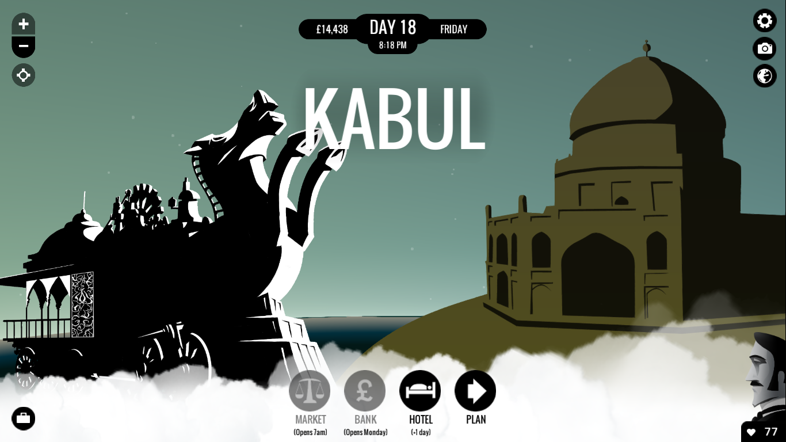

**Profesorul**: No! la gheografie acuma... Mă! tu ghe colo... Spune-ne tu doară toake ștakele Imperiului Brikanic.  
**Elevul**: India, dom’le.  
**Profesorul**: Inghia, bine!  
**Elevul**: Nigeria, dom’le.  
**Profesorul**: Iaște!  
**Elevul**: Jamaica, dom’le.  
**Profesorul**: Jamaișa.  
**Elevul** (se pornește repede. - Profesorul dă din cap afirmativ la fiece nume de stat cu satisfacție și cu mândrie): Africa de Sud, Israel, Hong Kong, Kenya, Rhodesia, Singapore, Burma, Bahamas, Cipru, Gibraltar, Egipt și Malaezia... dom’le!  
**Profesorul** (încruntându-se): Și apoi mai care, mă?  
**Elevul**: Atâtea, dom’le!  
**Profesorul** (începând să scrâșnească): Dar Auștralia, mă?  
**Elevul** (intimidat): Și... Australia, dom’le!  
**Profesorul** (mai aspru): Dar Auștralia, unghe-i Auștralia?  
**Elevul**: ...?!  
**Profesorul** (magistral): Auștralia-i lângă Noua Zeghelandă, mă boule, și vițăversa!  
**Elevul** (aiurit): Și... Australia și Noua Zeelandă, dom’le!  
**Profesorul** (din ce în ce mai sus): Și mai care?  
**Elevul** (pierdut): Virțăvercea, dom’le!  
**Profesorul** (indignat): Nu Vițăvercea, mă! Cagnada, mă! Cania, mă! (Șoptind amenințător printre dinți:) Cania tătână-tău! (Energic:) Merji la loc, boule!

## _Prefață_   _The Victorian Frame of Mind_

Unii dintre voi au recunoscut, poate, opera lui Caragiale, care scria Un pedagog de școală nouă cam în aceeași perioadă în care Jules Verne publica Ocolul Pământului în 80 de zile. Am parafrazat fragmentul din schița lui nenea Iancu nu atât pentru efectul umoristic, cât pentru a scoate în evidență dimensiunile uriașe ale Imperiului Britanic la sfârșitul secolului 19. În textul original **Elevul** enumeră statele europene, dar mai mari bătăi de cap ar fi avut enumerând statele care se închinau Reginei Victoria. Britanici se lăudau, pe bună dreptate, cu un imperiu unde Soarele nu apune niciodată, fiecare continent având partea sa de posesiuni britanice. În acest context, e lesne de înțeles de ce călătorul nostru în jurul lumii e originar din Regatul Unit. Neobișnuit e faptul că autorul cărții vine din imperiul care era principalul concurent al Britaniei, atât la nivel ideatic (vezi Revoluția Franceză), dar și politic, la nivel colonial. E drept, lăsând elementul de aventură la o parte, substratul cărții lui Verne e o critică la adresa tipului rigid și elitist al gentleman-ului englez, opus bonomiei și curajului francez.

Mentalitatea colonială și situația socială și culturală din colonii se răsfrâng inevitabil asupra cărții, și astfel asupra jocului despre care voi vorbi în continuare. Epoca victoriană a fost dominată de idei imperialiste bazate pe darwinismul social, ce se pot rezuma în ”povara omului alb” a lui Rudyard Kipling, care predică datoria omului alb, superior, de a coloniza și apoi educa popoarelor barbare. Populațiile native nu au fost însă tot timpul de acord și e suficient să spun că dragoste cu forța nu se poate.

Concepțiile megalomane din partea poporului britanic nu sunt deloc întâmplătoare. Purtate încă de valul revoluției industriale, corăbiile britanice nu aveau rival. Epoca victoriană a fost o perioadă de rapid avans științific și tehnologic. Motorul cu aburi, trenurile, telegraful, canalul Suez - toate lucrau în același scop: micșorarea lumii. Acesta era un climat proprice pentru apariția oamenilor extraordinari, a eroilor călători: exploratori precum David Livingstone sau Richard Burton, or personaje fictive ca Phileas Fogg.

## _Capitolul I_   În care facem cunoștință cu Passepartout, valet virtuel extraordinaire

Premisa de la care pleacă povestea jocului și a cărții din care a fost inspirat e probabil larg cunoscută. Pe scurt, un excentric gentleman englez, pariază suma de 20.000 de lire (echivalentul a câtorva milioane de azi) pe faptul că va reuși să circumnavigheze Pământul în cel mult 80 de zile. Însoțit de valetul său, Passerpartout, Phileas Fogg pleacă fără să stea pe gânduri spre prima escală a călătoriei, Paris.

Din capitala franceză jucătorii, intrați în pielea valetului, pot merge în orice direcție. E drept, drumul parcurs e îngrădit de anumiți factori, fondurile disponibile fiind doar cel mai important dintre ele. Dacă în povestea originală Fogg pleacă la drum cu câteva zeci de mii de lire, aici creditul inițial e de doar 4.000. De aici își face apariția una dintre mecanicile secundare ale jocului, comerțul. În fiecare oraș poți vizita piața și cumpăra o serie de obiecte ce pot fi apoi vândute pentru profituri spectaculoase în anumite locații specifice. Cu toate că pare o diversiune nevinovată, elementul de comerț are ca scop îngrădirea libertății jucătorului. Nu intru în detalii pentru că voi discuta mai târziu mecanicile ascunse ale jocului.

Din postura de valet, jucătorul are o miriadă de responsabilități, mai mici sau mai mari. Aici jocul aruncă subtil săgeți către societatea victoriană, vizând inegalitatea socială. De-a lungul călătoriei Passerpartout e un adevărat cal de povară. Toate oalele se sparg în capul lui, el organizează călătoriile și cumpără cele necesare și tot el trebuie să se îngrijească de starea stăpânului său. De cealaltă parte, contribuția lui Fogg este aproape strict financiară. Ca să dau Cezarului ce-i al Cezarului, această critică își are originea la Verne, jocul accentuând aspecte prezente deja în carte.

Dacă tot am adus vorba de Passerpartout, e interesant de văzut originea numelui său. Tradus mot à mot, ar însemna mai mult sau mai puțin ”o cheie care deschide totul.” Passe-partout pe de altă parte e denumirea cartonului din spatele unui tablou. Bănuiesc că semnificația raportată la poveste e ușor de ghicit. Analizat astfel, trecutul de circar al francezului capătă de asemenea subînțeles - ca valet jonglează responsabilități.

Mergând în direcții diferite față de carte, 80 Days îți dă șansa să construiești propriul Passerpartout. Alegerile făcute în timpul dialogurilor sunt inventariate pe parcursul jocului și modifică discret relația pe care o ai cu Fogg, dar și personalitatea valetului. Sistemul e unul foarte ingenios, după cum e descris de producători, dar are o singură hibă: e inutil. Având în vedere că interacționezi puțin spre deloc cu Fogg, nu contează ce părere are stăpânul despre tine. Același sistem e aplicat și personalității lui Passerpartout, cu rezultate mai concrete. În funcție de felul în care parcurgi dialogurile vei primi un calificativ, care la rândul său modifică cele două caracteristici ale valetului, abilitate și stil. Pe baza lor jocul închide sau deschide anumite opțiuni de a avansa. Toate aceste lucruri se petrec ”în culise” și ceea ce pentru mine e un plus binevenit de imprevizibil, pentru unii ar putea fi derutant. În general jocul mizează pe neprevăzut, alegerile din timpul dialogurilor fiind voit vagi, ceea ce duce la apariția unei tensiuni inerentă întreprinderii de a călătorii în jurul lumii.

{}
### Tot felul de călătorii

Am avut cartea, avem jocul, și, deloc surprinzător, avem și filmul. Nu știu dacă e nostalgie la mijloc sau pur și simplu filmul e excelent, însă dintre cele trei titluri amintite, filmul mi se pare cel mai bun. Chiar mai bun decât Verne. There, I said it! Jucând 80 Days nu am avut vreo îndoială în ce privește personalitatea lui Passerpartout: el era Eric Idle din Monthy Python, iar Monsieur Fogg, Pierce Brosnan.

Pe calea asta recomand adaptarea cinematografică din 1989, cu cei doi actori amintiți în rolurile principale, Peter Ustinov în rolul detectivului Fix și o prințesă Auda demnă de poezia pe care i-o citește Fogg (cunoscătorii știu despre ce vorbesc). Foarte interesant, în același an, un alt membru al Monthy Python, Michael Palin, realiza un documentar pentru BBC tot cu scopul de a reitera călătoria din cartea lui Verne.

Și pisicile sunt mișto!
{}

## _Capitolul II_   În care culoarea locală capătă pronunțate nuanțe steampunk

Am vorbit la începutul articolului despre cadrul istoric în care are loc acțiunea jocului, însă am menționat doar aspecte care se regăsesc și în carte. Și asta pentru că jocul are un strat substanțial de istorie alternativă în dulcele stil steampunk. Cu toate că pe alocuri am avut senzația că imaginația a zburat cam mult pe cerurile fanteziei, în general piesele noi introduse se îmbină în mod natural cu puzzle-ul deja existent. În ce mă privește, epoca victoriană e una dintre perioadele cele mai interesante ale istoriei universale, însă presupun că adâncirea atmosferei nu a fost principalul motiv din spatele deciziei de a adăuga noi ingrediente unei rețete deja consacrate. Mai degrabă e vorba de logistică. Sunt mai bine de 150 de orașe ce pot fi vizitate, din toate colțurile lumii. Iar pentru a realiza o călătorie în jurul lumii în 80 de zile alegând rute mai exotice, cum ar fi Africa sau Australia, e nevoie de ceva mai mult decât tehnologia existentă în acel moment.

Compromisul e acceptabil, însă amestecul final e pe alocuri eterogen. Unul dintre punctele forte ale cărții lui Verne este realismul și atenția la detalii. Scriitorul își imaginează o călătorie spectaculoasă, însă perfect realizabilă. Știința din sintagma ”științifico-fantastic” e lăsată la o parte în 80 Days, rezultatul fiind cai mecanici, androizi, trenuri submarine și rachete. Majoritatea jucătorilor vor trece cu vederea aceste născociri, însă, ca fan al lui Jules Verne, mi-au lăsat un gust amărui.

Trecând peste elementele fictive, 80 Days reușește să capteze foarte viu culoarea locală a orașelor vizitate. Am fost plăcut surprins, ajungând în București, să fiu întrebat de o vânzătoare ”Cu ce vă pot ajuta?” (pe românește adică). Apoi, s-a înfiripat o discuție privitoare la influența otomană din regiune, punctată de opinii antisemite. Așadar, calitatea documentării e foarte bună, însă cantitatea e cea care impresionează. După cum spuneam, sunt peste 150 de orașe ce pot fi vizitate, iar pentru a surprinde esența fiecărei culturi în câteva fraze e nevoie de o foarte fină cunoaștere a fundalului istoric și social. După cum vom vedea mai departe, cea mai mare parte din munca de cercetare a fost făcută de o singură persoană. Jos pălăria!

Tot astfel și fundalul istoric e surprins în mod realist. Revenind la discuția introductivă, secolul 19 a fost o perioadă de tensiuni sociale și politice cauzate în principal de agenda imperialistă a marilor puteri europene, în frunte cu Regatul Unit. Aceste încordări se reflectă în joc mult mai accentuat decât în cartea lui Verne. E drept, la acea vreme critica la adresa colonialismului putea părea nefondată, date fiind argumentele de ordin moral și umanitar invocate. Pentru cei interesați de concepțiile coloniale ale vremii, recomand eseul lui John Stuart Mill, A Few Words on Non-Intervention. 80 Days își permite însă să facă unele comentarii prin intermediul situațiilor și personajelor prezentate. Populația nativă asuprită primește o voce proprie prin care demască ipocrizia și standardele duble ale popoarelor albe europene.

## _Capitolul III_   Unde avem atât de multe alegeri de făcut și atât de puțin timp

Așa cum Pământul se învârte în jurul propriei axe, așa și 80 Days se învârte în jurul unui ciclu cât se poate de simplu: oraș, piață/bancă/hotel, călătorie, oraș etc. Primul pas înseamnă explorarea locațiilor în care ai ajuns, de dragul de a te plimba sau pentru a descoperii noi rute. Pasul doi privește partea financiară și revin la ce spuneam mai devreme despre mecanicile ascunse. Obiectele pe care le poți cumpăra sunt puține, 4-5 în cel mai bun caz, iar pentru a le vinde trebuie să mergi într-un anumit oraș. Pentru a împrumuta bani de la bancă trebuie să aștepți câteva zile și asta te împinge spre o altă rută. De fiecare dată când alegi să faci ceva trebuie să ai aspectul financiar în minte. Un plus fără doar și poate la partea de gameplay, dar în același timp jocul creează iluzia libertății de alegere și apoi impune limite. Un truc ieftin, dar într-o lume de joc vastă, un truc eficient.

O foarte mare bilă albă e faptul că nu există noțiunea de game over. Jocul îți permite și chiar te împinge să dai greși. În prima mea călătorie, am epuizat cele 80 de zile înainte de a ajunge în Statele Unite. Era deja o călătorie groaznică: cerșisem timp de o săptămână în India, aproape că murisem îngropat de viu în Marea Chinei de Sud și eram nevoit să fac un ocol de sute de kilometrii până în Honolulu. Totuși, dezamăgirea de a fi pierdut pariul s-a integrat foarte neted cu povestea, iar bucata de drum rămasă a avut la rândul său momente atractive. Un exemplu și mai concludent e o poveste pe care am găsit-o pe forumurile Steam, unde cineva ignorase complet pariul și vizitase peste 100 de orașe în mai bine de 250 de zile. Totuși, la sfârșitul acelei odisee, profitul final era de 55.000 de lire, iar nemulțumirea vădită a lui Mr. Fogg de a fi pierdut pariul s-a transformat în aprobare tacită. Choose your own adventure în adevăratul sens al expresiei.

Se disting totuși două stiluri distincte de joc: unul calm, calculat, specific lui Mr. Fogg, și unul pasional, impulsiv, specific lui Passerpartout. Urmând primul model ajungi în Londra cu multe zile înainte de termenul limită, după o călătorie searbădă și plictisitoare, fără evenimente majore. Pe cealaltă cale, sunt toate șansele să pierzi pariul încă din Asia. Lăsându-te pradă curiozității native a lui Passerpartout ești tot timpul la un pas de a intra în bucluc. Uneori rezultatele sunt favorabile, alteori doar întârzieri nedorite, însă mai tot timpul memorabile. Drumul ideal e undeva la mijloc.

În ce privește partea vizuală, nu sunt prea multe de spus. Jocul arată bine, cu un UI curat, de inspirație Art Deco. Chiar dacă aspectul grafic nu e cel mai important, am totuși câteva observații de făcut. Ecranul principal, constituit dintr-o reprezentare a globului pământesc, e golaș. În afară de locații și de rutele posibile de parcurs, harta e pustie. Îmi amintesc orele de geografie din gimnaziu, când stăteam pierdut în fața atlasului, visând la țări îndepărtate, munți înzăpeziți și mări însorite. În dreapta-sus a paginii am pus o hartă, poate un pic cam aglomerată, însă mult mai interesantă decât un glob cu câteva linii și puncte. Îmi amintesc că la un moment dat am trecut în India prin apropierea munților Himalaya. Sau nu am trecut? Habar nu am, pentru că terenul perfect plat din joc nu spune absolut nimic.

{}
### Ocolul Pământului în 72 de zile

În căsuța anterioară am menționat călătoria lui Michael Palin, însă ideea de a pune în scenă povestea lui Verne a apărut aproape imediat după publicarea cărții. În 1888, Nellie Bly, reporter al New York World, a mers pe urma lui Fogg și a realizat o călătorie în timpul record de 72 de zile. Pe lângă faptul că era o femeie într-o societate puternic patriarhală, călătoria lui Bly e excepțională și prin faptul că a fost pusă în practică având la dispoziție fonduri infinit mai mici decât gentleman-ul englez. Între timp recordul a fost bătut, iar călătorii entuziaști continuă să meargă pe poteca bătătorită de Fogg. One for the bucket list!
{}

## _Capitolul IV_   În care aflăm cine sunt Inkle Studios și Meg Jayanth

În continuare o să fac un mic ocol pentru a analiza mica echipă din spatele jocului. Cei doar doi oameni care au construit scheletul 80 Days au adoptat și perfecționat un sistem cunoscut în presa de specialitate drept ”modular storytelling.” În mare, asta înseamnă o povestire pe episoade, acolo unde fiecare episod e de sine stătător și nu are legătură cu firul narativ central. Acest model nu numai că se pliază foarte bine pe structura poveștii din 80 Days, e practic necesar, având în vedere că tot timpul sari de la un oraș la altul, de la o călătorie la alta.

Celălalt membru cu drepturi depline al echipei este Meg Jayanth, care s-a ocupat de ce era mai important, și anume scrisul - și implicit documentarea. O scurtă paranteză aici, pentru a vorbi un pic despre interactive fiction. Înainte de a colabora cu băieții de la Inkle, domnișoara Jayanth a scris un joc numit Samsara, publicat pe StoryNexus. Aceasta din urmă este o platformă de publicare, și o unealtă de creare de interactive fiction realizată de Failbetter Games - echipa din spatele Fallen London și mai recentului Sunless Sea. Interactive fiction este o ramură a jocurilor video care a existat sub diferite forme de la începuturile industriei. Un exemplu faimos e seria Zork, iar astăzi relativ populare sunt așa-numitele virtual novels. Jocuri precum Fallen London sau 80 Days merg însă în direcții laterale, în ideea că păstrează componenta textuală în centrul atenției, însă plusează cu elemente grafice și de gameplay (mai) complexe. Mă rog, pe lângă titlurile menționate mai sus sunt alte zeci care se pot încadra aici. O căutare pe Steam va rezulta în titluri precum aventurile Telltale, Gone Home sau Kentucky Route Zero, însă cred că aici vorbim de ouă pentru alt coș, aspectul vizual primând, și nu textul. Ca să concluzionez paranteza ce deja se lungește, interactive fiction e un gen din ce în ce mai popular și care implică în principal cititul.

Înainte de 80 Days, Inkle Studios au mai lucrat la o serie de proiecte construite pe același schelet - dintre acestea merită văzută în principal seria Sorcery!. Dincolo de componenta narativă predominantă, jocurilor lor au în comun faptul că au fost construite în special pentru dispozitive mobile, iOS și Android. Titlurile bazate pe text se pliază perfect pe limitările tehnice și practice (dimensiunea ecranelor) ale platformelor și se poate vorbi chiar de o specie de nișă. Asta nu înseamnă și lipsă de complexitate, word count-ul pentru 80 Days fiind de peste 500.000. Jayanth pune numărul în perspectivă: mai mult decât trilogia Stăpânul inelelor, dar mai puțin decât seria Cântec de gheață și foc. Pentru că spațiul redacțional autoimpus mă limitează, trag linie aici, dar vă îndrept atenția spre două prezentări din cadrul GDC 2015 realizate de Jayanth și de colegul ei Jon Ingold. Google them.

## _Epilog_   _Don’t Take It Personally, Babe, It Just Ain’t Your Story_

Pe parcursul călătoriilor din 80 Days întâlnești tot felul de oameni interesanți, cu care însă interacționezi foarte puțin. Fie că ești într-un vagon al Transsiberianului, pe puntea vaporului Mongolia sau într-un bar din San Francisco, tot timpul sunt șanse să dai peste un personaj inedit cu care să schimbi câteva vorbe. Partea interesantă e felul în care aceste personaje interacționeză sau nu cu tine. În prezentarea pe care am menționat-o anterior, Meg Jayanth vorbește despre felul în care a construit lumea jocului și personajele care o populează. În general, jocurile video pleacă cumva de la premisa că avatarul jucătorului trebuie să fie în prim-plan; tu ești eroul care trebuie să salveze ziua, iar NPC-urile sunt acolo doar pentru momentele în care tu le abordezi. Dincolo de situațiile în care te afli în preajma lor, sunt practic moarte.

80 Days strălucește prin faptul că îți permite să te bucuri de o lume vibrantă, locuită de personaje care au o agendă proprie (ceea ce Jayanth numește ”agency”), ce nu depinde de acțiunile jucătorilor. Lumea prin care treci se mișcă, trăiește, evoluează, iar poveștile pe care le întâlnești fac parte dintr-un tablou mai mare. E un caz asemănător cu cel din ”nuvela vizuală” menționată în intertitlu. Ești parte din poveste, dar nu protagonistul. Aici intervine și elementul de pseudo-multiplayer. Harta e tot timpul populată de alți jucători și poți în orice moment să vezi rutele alese de ei. Datorită factorului competitiv, atmosfera e astfel animată - nu mai e doar o cursă contra cronometru.

În ideea de a păstra ce e mai bun pentru la sfârșit, vreau să spun câteva cuvinte (doar câteva, să nu stric surpriza) despre momentele speciale care sunt principalul punct forte al jocului. Ele apar de regulă în timpul călătoriilor mai lungi, traversare Siberiei or a Oceanelor. Am lăudat-o deja pe Meg Jayanth, dar munca ei iese în evidență atunci când are spațiul să construiască o poveste mai cărnoasă; atunci când alegerile tale se îmbină către un scop mai mare, nu doar aflarea următoarei curse spre încă un oraș. Tematica e la fel de importantă, pentru că jocul abordează probleme importante și delicate, de la homosexualitate și schimbare de sex, până la sclavie și rasism.

Concluziile cu privire la calitatea jocului au fost deja trase de nume importante înaintea mea (Time Magazine Game of the Year 2014). 80 Days a fost intens lăudat prin toate colțurile internetului, dar am unele rețineri în a face același lucru. Momentele în care povestea e cu adevărat remarcabilă sunt destul de puține, poate 3 sau 4 pe parcursul unui voiaj. Chiar dacă în restul timpului citești despre întâmplări interesante și vizitezi locații exotice, e prea puțin pentru a face călătoriile memorabile. Jocul e solid și e greu să-i reproșezi ceva fără a cădea în nitpicking, dar la final parcă e lipsit de... zvâc. Nu am cum să nu îl recomand pentru că e în orice caz o experiență originală., un pas lateral cât se poate de binevenit. Ca să mai fac o trimitere la o scriitură românească, 80 Days e ca mâncarea fetei împăratului înainte de a pune sare în ea - rețeta e bună, dar lipsește ingredientul secret. ■
