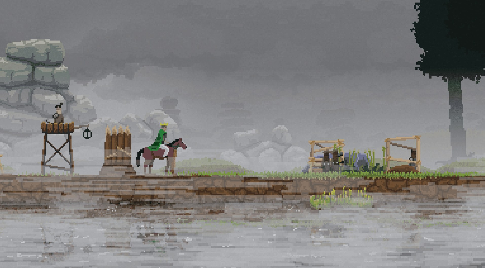
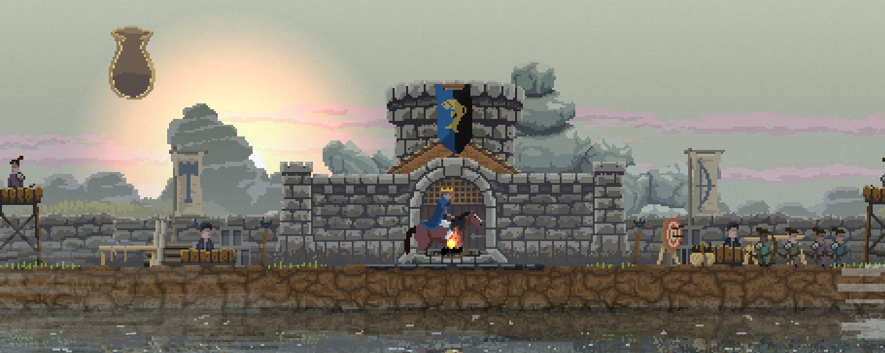
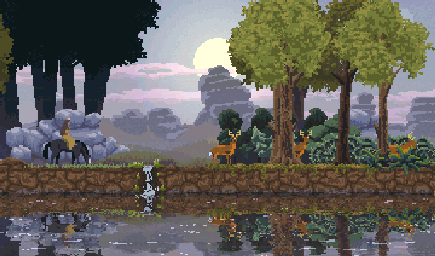

Au trecut aproape două luni de la furia celor 12 ore de Kingdom. Încă mi se pare că aud tonurile vag isterice ale ultimului Blood Moon și modul absolut stupid în care era cât pe ce să-mi pierd coroana. Ar trebui să menționez din start că nu mai sunt un gamer, nu cum eram acum aproape 10 ani, așa că 12 ore petrecute într-un joc complementare a două zile de lucru mi se pare enorm. 

Kingdom, în termeni tehnici, ar putea fi un tower defense cu perspectiva unui side scroller, dar câteva diferențe mărunte îl elevează într-un fel către altceva. Preiei controlul unui rege (sau al unei regine) generat aleator împreună cu coloritul veșmintelor, al banner-ului și al hărții, singurele constante al jocului fiind coroana de pe cap, torța din mână și capacitatea infinită a murgului de a te duce în spinare, iar scopul este de a-ți menține legitimitatea dreptului de a conduce prin păstrarea coroanei. Începi într-un crâng întunecat cu posibilitatea de a merge la dreapta sau la stânga. De altfel cele două taste direcționale constituie deja două treimi din controlul efectiv pe care-l ai asupra jocului. 

Indiferent de alegerea făcută, plimbarea prin pădure îți va aduce câțiva galbeni în pungă, iar într-un final invitabil vei ajunge la un rug stins în preajma căruia doi amărâți se plimbă fără vreun scop, pierduți fără mâna ta de fier care să-i conducă. Ca Prometeu le oferi darul focului, dar nu primești în schimb obediența lor eternă. O dată ce ai aruncat un galben pentru aprinderea focului și câte unul pentru recrutarea țăranilor poți spune că pământul pe care stai este al tău. Cheltuirea galbenului la bonfire aduce doi negustori care-ți vor permite să-ți specializezi țăranii într-o direcție sau alta. La început ei vor putea fi doar arcași sau dulgheri/zidari și vor începe prima societate secretă care va plănui să conducă lumea din întuneric. Dar până atunci te vor sluji deplin și aleator după cum le dictează A.I.-ul. 

Un control asupra lor nu ai, ei alegând să meargă la stânga sau la dreapta după cum îi taie capul și o dată ce s-au decis acolo vor rămâne. O formă ușoară de control o ai asupra constructorilor, ei venind întotdeauna în direcția în care ai decis să-ți ridici următoarea clădire. 

În peisajul decrepit și sterp în care ai ajuns, simțindu-te ca și Carol o dată ce a ajuns în noroaiele Bucureștilor, nu-ți rămâne altceva de făcut decât să începi să recrutezi forța de muncă necesară pentru civilizarea sălbăticiei, lucru realizabil cu ajutorul găsit în taberele desculților de la marginea pădurii. 

La început singura formă de venit va veni din partea arcașilor, adevărați alchimiști transformând orice formă de vânat în aur. Dar nopțile sunt nesigure, elilii pândesc în umbră și vor să-ți fure aurul, uneltele, controlul țăranilor și în cele din urmă coroana, așa că trebuie să-ți pui constructorii la treabă să te binecuvânteze cu ziduri puternice și turnuri de veghe. 

Pentru primele câteva zile vei fi “peau de la bite”, așteptând tăcut în întuneric, ascuns după maldăre de pământ și rugându-te la tot ce-i mai sfânt ca lucrurile să meargă cum trebuie. Turnurile de veghe îți conferă protecție, dar te lipsesc de venitul de care ai nevoie să te poți dezvolta armonios, deoarece fiecare turn de veghe va avea cel puțin un arcaș. 

Pe măsură ce timpul trece și realizezi că atacurile nocturne nu sunt chiar cel mai oribil lucru din lume, îți investești monetarul în dezvoltarea urbei, aducând în joc noi construcții și inerent noi specializări pentru țărani. 

După un anumit nivel o să devină disponibile ferme și coase, așa că agricultura va deveni principală sursă de venit, înlocuind vânatul. Bineînțeles arcașii nu vor înceta niciodată să vâneze atâta timp cât iepurii vor avea bârloguri pe pământurile tale sau în imediata lor vecinătate. 

La fiecare cinci zile, însă, o dată ce te-ai acomodat și-ți spui că meriți să porți coroana pe cap, are loc un “Blood Moon”, un eveniment special în care numărul și diversitatea carcalacilor care-ți vor averile crește vertiginos comparativ cu zilele anterioare, un fel de cârjă pentru echilibrarea jocului, trăgând jucătorul încet dar sigur înapoi, lipsindu-l de resursa cea mai importantă: forța de muncă. Deși majoritatea unităților se retrage în spatele zidurilor de protecție pe parcursul nopții, marksmanship-ul arcașilor e una din cele mai nesigure chestii din joc, așa că n-o să ai niciodată garanția că aflându-se în spatele zidurilor, arcașii vor face treabă bună descotorosindu-te de vrăjmași înainte ca aceștia să prăvale zidul peste ei, să le fure arcurile și banii și să-i întoarcă la statutul de câini fără stăpân. 

Continuarea jocului, va fi în linii mari aceeași: colectezi banii, investești în forță de muncă, dezvoltare și reparații, aștepți trecerea nopții și repeți până când simți că ai ajuns la un nivel de dezvoltare suficient de mare care să-ți permită explorarea și vei descoperi ascunse adânc în pădure patru portaluri ce spawnează inamicii. 

Scopul jocului se schimbă de la a-ți păstra coroana de la o zi la alta la a ți-o păstra definitiv prin distrugerea celor patru portaluri. Mai departe va ține de fiecare jucător în parte cum va avea noroc și cum va acționa. În adâncurile pădurii există trei altare care vor da extra damage arcașilor, vor întări clădirileși-ți vor permite upgrade-ul clădirilor de la lemn la piatră, evident toate acestea contra cost. De altfel singurul mod în care portalurile pot fi distruse cu succes va fi doar după acest upgrade al clădirilor, de vreme ce doar atunci țăranii pot să fie specializați în cavaleri. Ei vor acționa ca ziduri mobile pentru arcași încasând un număr impresionant de lovituri înainte să cadă, dar va fi o limită de doar patru cavaleri, câte doi pentru fiecare parte.

Nu voi vorbi de grafică, care ține mai mult de gusturile fiecăruia. Voi menționa un detaliu care mi-a plăcut enorm: regatul se află pe marginea unei ape în care se oglindesc toate viețuitoarele, iar în timpul ploilor stropii creează mici ripples în apă , distorsionând mai mult imaginea. 

Per total e un joc destul de reușit, care totuși e tras un pic înapoi de cârja de care vorbeam mai sus. O dată ce ai avansat suficient de mult calendaristic și ai distrus majoritatea portalurilor, ultimul portal va genera aproape întotdeauna ceva apropiat de “Blood Moon” ceea ce duce aproape inevitabil la pierderea lentă a coroanei sau poate și mai rău de atât: la o remiză insuportabilă la capătul a câtorva ore de joc. ■