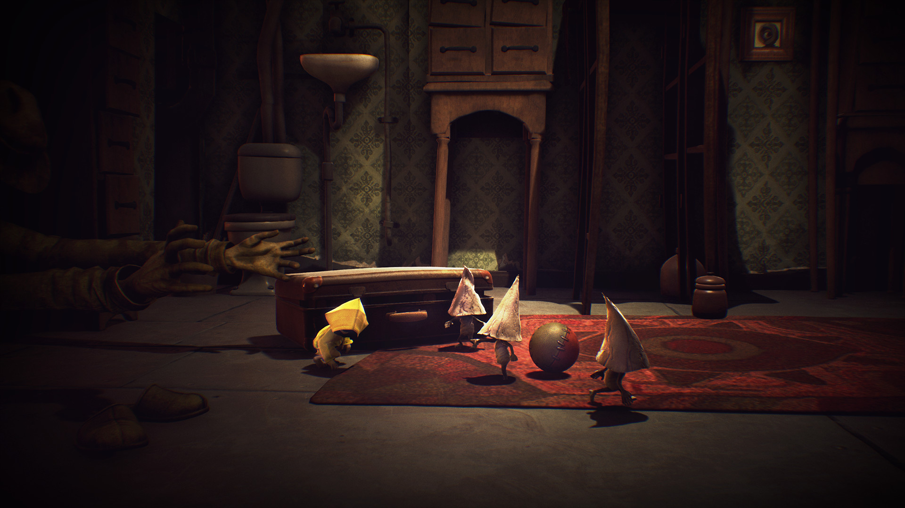

Încă de la Geneză, omului i s-a dat renumele de cea mai complexă şi capabilă specie existentă. Ca orice alt animal, fiinţa în cauză are datoria de a se autoîngriji prin mâncare, somn şi apă, iar lipsa acestor elemente esenţiale poate declanşa revolta propriului organism, precum şi încetarea funcţionării lui. Orice nevoie care rămâne nesatisfăcută duce, cel mai adesea, la incapacitate de mişcare şi, într-un final, la moarte.

Pe lângă creaturile vii, cea mai puternică forţă care domneşte neîncetat asupra tuturor este timpul. Datorită apariţiei acestui colos, toate vieţuitoarele şi-au împărţit existenţa în trei mari capitole: Copilărie, Adolescenţă şi Maturitate.

Prima și cea care are rolul de a ne dezvolta ca personalități este copilăria. Pentru mulți dintre noi, este și perioada cea mai fericită din viață datorită simplului fapt că nu știm suficiente lucruri. Chiar din această necunoaștere, ajungem să ne fie teamă de multe anomalii sau oameni pe care îi etichetăm drept „groteşti”.

Tot această etapă reprezintă și momentul de desfășurare a tinerei Six, personajul principal din Little Nightmares. Fără nici un detaliu despre viața ei, începem prin a ne trezi dintr-un coșmar cu o doamnă gheișă, într-o servietă de care sunt agățate două poze neclare. De înălțime foarte mică comparativ cu obiectele din jur, Six se poate cățăra pe dulapuri, sertare, farfurii, măsuțe sau alte tipuri de mobilier pentru a ajunge la obiectele necesare supraviețuirii și avansării prin încăperi.

Există și numeroase corpuri utile, fiecare cu greutatea și mărimea lor, pe care Six le poate ridica, respectiv trage sau împinge, pentru a escalada un zid sau a apăsa pe un buton. Mai mult de atât, toate sunt făcute din materiale diferite iar, cele care pot fi luate în mână, ajută la distragerea antagoniştilor prin zgomotul produs. De exemplu, o maimuță de jucărie cu chimvale e potrivită pentru atragerea unui inamic cu auz sensibil.

Cu ajutorul obiectelor, poți rezolva și diferite puzzle-uri. Uneori trebuie să găsești și folosești o cheie, piesa dorită fiind plasată într-un anumit colț al camerei, alteori să folosești niște mașinării, și tot așa. Din fericire, jocul îți oferă destul de multe astfel de acțiuni, deci nu te vei plictisi. Partea mai puțin bună e că se repetă destul de mult ideea puzzle-urilor și nici nu sunt așa antrenante. Le-am rezolvat pe toate relativ repede şi fără să-mi bat așa mult capul.

La începutul jocului trecuse o idee pe lângă mine. Mă întrebam: „Oare nu sunt lucruri colectabile aici?”. Și erau, dar răspunsul mi-a venit destul de târziu, la sfârșitul jocului când am descoperit că dacă strângi tot dintr-o anumită porțiune de nivel, primești o imagine concepută înainte și în timpul creării jocului. Tot ce trebuie să faci e să iei în brațe toți nomii, să aprinzi toate lămpile și să spargi toate statuetele cu Doamna Gheișă. Simplu, nu? Măcar de îmi dădeam seama din prima...

Ca structură, Little Nightmares e format din cinci capitole: Închisoarea, Adăpostul, Bucătăria, Aria Oaspeților și Districtul Doamnei. Fiecare dintre acestea are locații diferite și, de asemenea, oponenți diferiți. Conform locului cutreierat, chiar și muzica de pe fundal se schimbă, devenind mai sumbră și mai joasă. Coloana sonoră compusă de Tobias Lilja se integrează perfect cu povestea interpretată vizual și reușește să transmită un aer copilăresc, dar straniu, datorită combinațiilor acustice construite pe mai multe planuri.

Pe plan grafic, estetica culorilor se împarte în două zone. În părțile întunecoase, domină albastrul închis în contact cu negrul iar, în cele luminoase, culorile se învârt în jurul unui galben pal aflat în combinație cu o multitudine de alte nuanțe. Cromatica se schimbă, de-a lungul jocului, îndreptându-se spre maro închis și deschis.

Datorită schimbărilor continue și jonglerii impecabile dintre vizual și sonor, cele două elemente eliberează stări de curiozitate și mister iar, în absența dialogurilor, acest lucru devine vital pentru buna curgere a firului narativ.

Unul dintre aspectele cele mai îndrăgite de mine au fost chiar antagoniştii. Încă de la primul capitol, ești întâmpinat de două tipuri de „creaturi”, și anume Lipitorile, respectiv Ochii Păzitori. În timp ce Larvele au drept caracteristică faptul că se deplasează încet, lumina produsă de Ochi te poate face scrum și te încetinește pentru a-ți micșora șansele de a scăpa.

La trecerea în următorul capitol, îl întâlnești pe Îngrijitor (The Janitor). Înzestrat cu un auz limpede, picioare scurte și mâini lungi, absența ochilor nu îl împiedică să te găsească. Zgomotul pașilor tăi pe suprafețe tari e suficient pentru a-ți afla locația, iar singurele metode de salvare sunt distragerea lui cu ceva mai strident sau deplasarea pe covoare și pături. Printre pasiunile lui se numără, de asemenea, strângerea creaturilor mici (nomilor) și înfășarea acestora într-un material alb, sub forma unui cocon.

Nici Bucătăria nu e mai sigură, fiind permanent păzită de Șefii Gemeni (The Twin Chefs). Spre deosebire de Îngrijitor, acești inamici au mâini și picioare scurte, corpuri dolofane și o vedere nu prea dezvoltată; din momentul în care te-au văzut, au nevoie de trei secunde să-și dea seama că ești tu și să te fugărească. Din fericire, îi poți evită destul de ușor, ascunzându-te pe sub mobilă. Treaba lor e să gătească pentru Oaspeți, cărora le e așa foame încât ar mânca-o și pe Six... la propriu.

După cum îi spune numele, Aria Oaspeților adăpostește Musafirii (The Guests/Oaspeții). Cred că am auzit cu toții, măcar o dată, vorba: „Mănânc ca să trăiesc”; ei bine, aici s-ar potrivi mai bine: „Trăiesc ca să mănânc”. Ceea ce îi caracterizează cel mai bine pe acești „oameni” e dorința de a mânca într-una și aproape orice. De altfel, acesta e principalul lucru care îi face periculoși și, pentru că sunt obezi și au mâini scurte, nu se pot apropia de tine decât dacă ajungi prea aproape de capul lor. De picioare nu mai zic nimic, pentru că oricum se târăsc ca să te prindă din urmă.

Gheișa (The Lady) e cel mai misterios personaj din tot jocul, mereu stând și veghindu-i pe ceilalți de la balconul ei. Locuiește în District și are toate oglinzile sparte pentru a nu-și vedea reflexia (acestea fiind și principalele arme de folosit împotriva ei). Există o singură scenă în care îți dă bătăi de cap iar aceea e în confrunarea finală, ea fiind ultimul obstacol de depășit. Unii jucători consideră că e mama lui Six, dar asta e incert.

La Gamescom (2016), în incinta tarabei celor de la Little Nightmares și-a făcut apariția un alt personaj, pe care nu îl întâlnim în jocul actual. E îmbrăcat în roșu și are o pălărie turcească de aceeași culoare. Printre teorii, se numără și una legată de acest caracter care susține că el ar fi bărbatul spânzurat de la început iar îmbrăcămintea și fața lui constituie doar un costum. Pe lângă asta, de-a lungul jocului putem găsi și o incăpere de unde se poate privi prin toți ochii din vas (ochii fiind un fel de camere de supraveghere), iar în alt moment, pe partea cealaltă a unei oglinzi dintr-o baie, se află un scaun. Din aceste două locuri putem bănui faptul că personajul în roșu e un fel de „spion” care, și el, urmărește activitatea tuturor.

Un alt element inedit al jocului este reprezentat de momentele în care lui Six i se face foame. Manifestarea acestei dorințe e arătată de zgomotele (normale oamenilor) produse de stomac, încetinirea semnificativă a vitezei de mișcare și stingerea, respectiv reaprinderea, continuă a luminilor până când Six reușește să își potolească pofta, într-un fel sau altul. Un alt lucru interesant e și faptul că, în timpul acestui proces, în peisaj apare încă un personaj. Acesta se presupune că e partea întunecară a lui Six și eu cred că ar avea o influență malefică asupra ei (?). Poate vom afla mai multe într-un viitor DLC.

Cei de la studioul Tarsier au reușit să creeze un joc frumos, cu personaje bine construite și o poveste interesantă care te lasă să te gândești mult și bine la ce s-a întâmplat de fapt. Little Nightmares exprimă exact ce trebuie și îți transmite un horror grotesc, subtil și gata să te surprindă când te aștepți mai puțin. Din fericire, în zilele noastre, din ce în ce mai mulți producători ies din zona de confort și reușesc să scoată la iveală jocuri cu idei inovative. Sperăm la cât mai multe! ■
