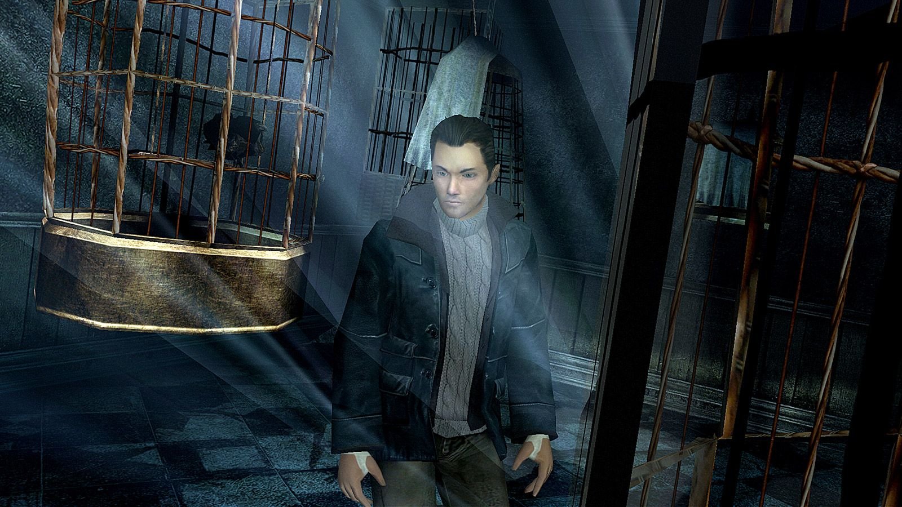
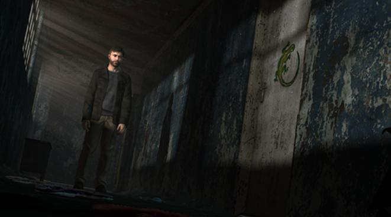
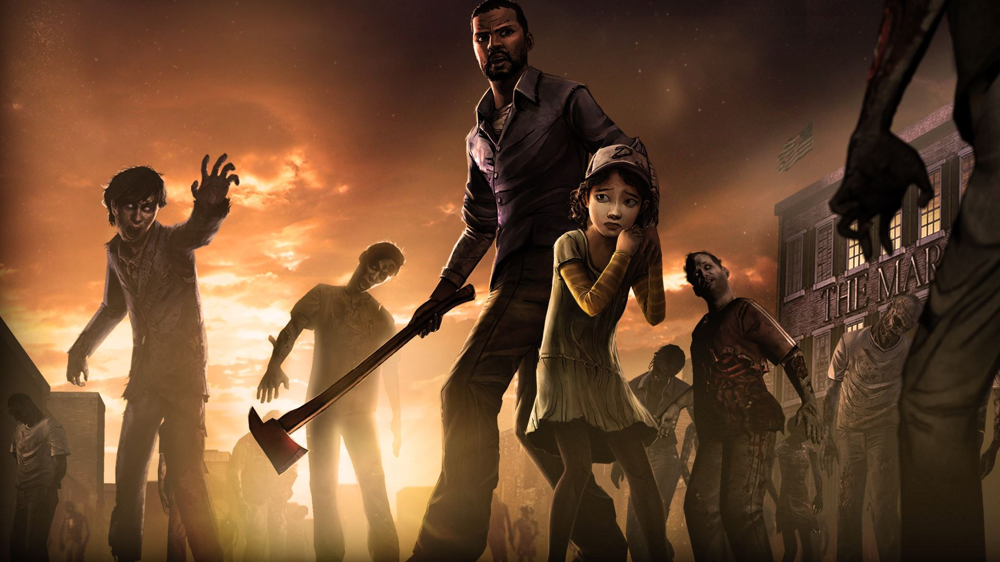
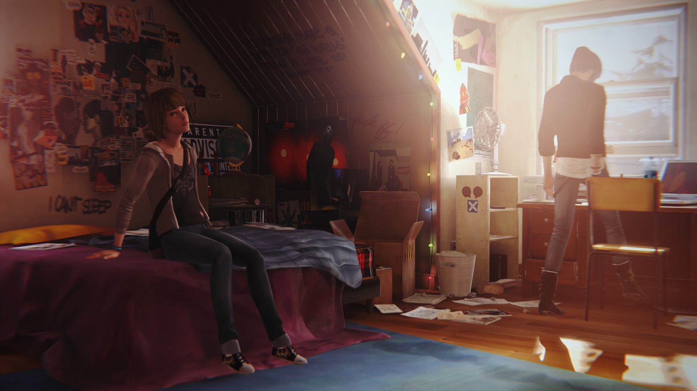
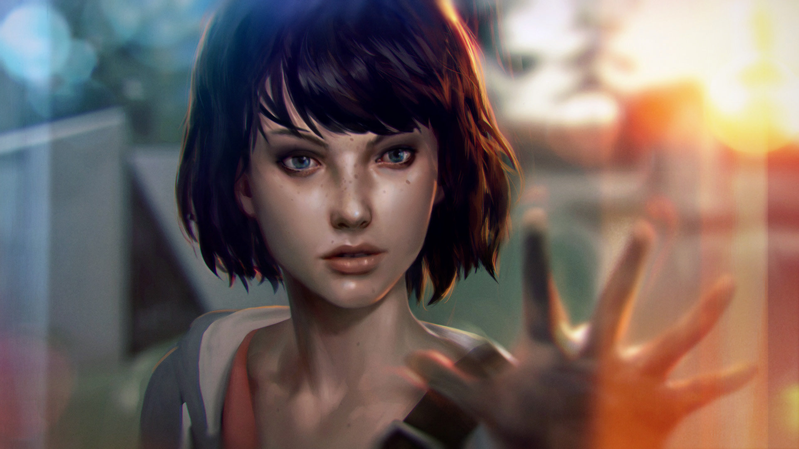

Încă de mic copil mi-au plăcut poveștile. În contrast mare cu această stare a existenței mele este faptul că nu am fost niciodată vreun vierme de bibliotecă, întrucât am preferat mereu calitatea în detrimentul cantității. Acest lucru s-a reflectat în egală măsură și asupra jocurilor ce mi-au trecut prin mână în decursul anilor, actualmente ajungând în acel punct în care am renunțat (aproape) complet la a da atenție vreunui titlu ce nu are drept coloană vertebrală o poveste consistentă. Dacă mai punem la socoteală și timpul liber dedicat gamingului ce este și el în continuă scădere, oferta de pe piață se restrânge și ea foarte mult.

În oarecare contrast cu acest lucru vine și faptul că pe lângă reprezentarea cu accent pe scenariu din titlurile pe care le joc, în egală masură îmi place și ca producătorul să încerce un concept grafic în acord cu timpurile. Să ne înțelegem, nu am pretenția de fotorealism, dar nici nu mă atrag producțiile cu tentă retro și/sau minimalistice în numărul de pixeli afișați pe ecran, fie că sunt jocuri indie și au ajuns așa ca rezultat al unei constrângeri de buget, fie că asta a fost dorința expres a vreunui producer.

Acum, jocuri cu o scriitură de calitate sunt destule, nu are rost să intru în detaliu și să inventariez titluri aiurea, ci vreau să aduc în lumina reflectoarelor un stil apărut după anii 2000 și care și-a propus, odată ce tehnologia a devenit mai avansată iar motoarele jocurilor mai capabile, să arunce jucătorul într-o cu totul altă aventură senzorială, bazată pe incertitudine și încercarea de a se apropia cât mai mult de dorința unei experiențe reale, daca putem să-i zicem așa. Și nu, nu mă refer aici la tehnologia VR, ci la un alt concept ce pare să fie adoptat în ultima vreme de cât mai multe case de producție, indie sau altcumva. Mă refer îndeosebi la trendul ascendent (ca număr de titluri prezente pe piață) de a încorpora într-un joc mecanica popular cunoscută sub titulatura de ”Construiește-ți singur povestea”.

### _The bird is such a unique animal. It can spend its entire life locked up in a cage and yet, still keep on singing away._

Enter Fahrenheit. În opinia mea și poate și a altora, unul dintre pionierii acestui stil de gameplay, titlu care la vremea lansării (2005) și-a primit o porție suficientă de laude precum și de critici din simplul fapt că încerca ceva altfel. Deși nu a fost niciodată vândut sub blazonul expresiei ”Construiește-ți singur povestea”, undeva acolo în studio, un producer/game designer a aruncat la fileu o idee ce a ajuns, zece ani mai târziu, să ducă pe umerii săi un trend întreg.

Fahrenheit a fost caracterizat de cei de la Quantic Dream ca fiind un film interactiv, făcând uz intens de quick time events pentru a progresa povestea, precum și introducând șicanele gameplay-ului multi-perspectivă în care ești forțat tu, ca jucător, să preiei frâiele mai multor personaje si să încerci a aduce o rezolvare a conflictului cu multe fațete prezentat. Cu o introducere făcută ca la carte, un set de protagoniști definiți elegant și o mecanică a jocului sensibilă la timp și acțiunile jucătorului, Fahrenheit reușeste prin QTE-urile sale și dialogurile de tip ‘răspunde ce crezi tu că e bine, dar hei, vezi că ai doar câteva secunde la dispoziție pentru asta’ să îi atragă pe cei îl experimentează în ițele sale scriitoricești.

Care ițe se dovedesc a fi până la urmă și marele minus jocului, scenariul de tip X-Files evoluând în actul final în ceva peste puterile noastre de înțelegere, noi fiind evident muritorii de rând și nu cei care au scris liniile de dialog în original. Din pură curiozitate am terminat până la urmă jocul, nu puține fiind momentele în care am preferat totuși să-mi dau ochii peste cap și să aleg mecanic o opțiune din cele disponibile pe ecran, doar pentru a avansa în poveste. În final i-am iertat totuși toate păcatele și mi-a rămas în memorie ca o experiență inedită, ce nu poate fi cuantificată subiectiv, dar imperios necesară pentru evoluția genului.

### _When the parents came home from church, all their children were gone. They searched and called for them, they cried and begged, but it was to no avail. The children were never seen again._

Mai trec cinci ani și, deloc surprinzător, aceiași Quantic Dream sunt cei care se întorc pe piață cu încă un titlu bazat pe mecanica de tip încercare și eroare, de data asta exclusiv pe PS3, numit Heavy Rain. Nu prea ai cum să nu fi auzit de el, apare și pe IMDB, a luat ceva premii BAFTA (orice ar însemna asta, dar nu cred că e de la românescul baftă) și a fost primit în general cu recenzii favorabile. Nici în acest caz nu ne este băgată pe gât într-un mod expres ideea de a ne construi singuri drumul prin făgașul scriitoricesc, ci pur și simplu mecanicile de joc prezente în Fahrenheit sunt aduse la zi, șlefuite puțin în principal sub forma simplificării schemei de control (sau cel puțin asta a fost ideea generală a publicului, pentru mine, care puneam prima oară mâna pe un controller de consolă, nu a fost deloc ușor) și apoi împachetate într-un scenariu nou, tot de tip thriller interactiv.

Ți se dă iarăși controlul asupra mai multor personaje în decursul unei parcurgeri a jocului și ești aruncat într-un univers în care tot ce e rău te urmărește pe tine și familia ta și ești nevoit să faci corp comun cu butoanele de la controller pentru a progresa în joc. Ca o părere personală, cu excepția unor mici jonglerii care aduc la posibilitatea vizionării a mai multor finaluri, Heavy Rain a reușit să-mi lase un gust la fel de amar ca și Fahrenheit la vremea lui, numai că în acest caz din cu totul alte motive, cu diferența că de data asta nu mai aveam de ce să iert jocul în vreun fel.

E drept, grafica a fost adusă la zi, atmosfera și design-ul de nivel au fost la înălțime, dar nu am putut trece peste antipatia pe care mi-a infuzat-o protagonistul Ethan Mars încă de la începutul aventurii. Nu știu, mi s-a părut un personaj forțat, clișeic și tâmp, iar cum nici actorul ce i-a dat vocea nu prea pot spune că a făcut vreo treabă excepțională, jocul pentru mine a generat doar o stare generală de ‘Meh’ parcurgându-l. Mai mult decât atât, pentru un așa zis thriller cu criminali în serie, universul imaginat în care se petrece acțiunea este atât de mic în materie de personaje încât, atunci când ți se dezvăluie antagonistul, chiar de nu ți-ai dat seama dinainte cine era, nu prea ai cum să fii surprins de rezultat.

Așadar, cu ce am rămas dupa experiența Heavy Rain? Păi, cu multă ploaie, ce-i drept, că doar titlul nu e pus degeaba (chiar mă așteptam la un moment dat la vreo replică de gen ‘Vai, ce udă e apa!’ de la Ethan, dar am fost scutit măcar de atâta lucru) și cu un gol în stomac după ce am concluzionat că mai bine se concentrau pe a scrie un scenariu solid în loc să insiste în încercarea de a adauga tot felul de poteci care să te abată de la cărarea principală, toate în speranța obținerii vreunui final apoteotic ce nu vine de fapt niciodată.

More of the same, cum ar spune un clasic nemuritor.

### - Do you know how to pick a lock?   - No, why?   - Because you're... urban?   - Oh you did NOT just say what I tought you did!   - Sorry man. I'm from Florida, weird shit comes out of my mouth._

Între timp se face anul 2012 iar băieții și fetele de la Telltale Games, după ce au luat probabil aminte la isprăvile celor de la Quantic Dreams, se agață de licența binecunoscutei francize The Walking Dead pentru a livra primul joc aferent universului respectiv. Deși personajele sunt de concepție proprie, Telltale păstrează tematica universului intactă, construind o în schimb o poveste cu totul nouă, cu accentul pus pe ambientul de gore&dread, că altfel nu știu cum să îi spun, emanat de comic-uri și serial.

Numai că, spre deosebire de alte titluri, Telltale mizează masiv pe apropierea emoțională a jucătorului față de personajele principale și, parcă știind că scriitura va fi primită bine, duc totul un pas mai departe prin agresivitatea stilului cu care își promovează jocul. ”Construiește-ți singur povestea” se transformă, dintr-un simplu slogan apărut în viziunea neconcretizată până acum de produceri, într-un instrument ce îl invadează pe jucător din toate direcțiile. Această alegere oportunistică (vedeți ce am făcut aici?) îmi pare însă un pic exagerată, întrucât în loc să fie păstrată o anume distanță în relația producător-jucător, acesta din urmă ajunge să fie tot timpul crispat și de ce nu, frustrat în urma accentului masiv pus pe așa zisele decizii ce trebuie să le ia în timpul jocului.

Să vă spun drept, aproape că am abandonat parcurgerea primului sezon undeva înainte de episodul patru pentru că simțeam că oricât de multe dileme îmi apăreau pe ecran și oricât de mult aș fi încercat să țin cont de răspunsurile și acțiunile personajului controlat de mine, în sinea mea nu aveam o justificare exactă pentru situațiile în care eram pus. Pe scurt, eram acolo doar ca să fiu acolo, să avansez povestea, și încă nu simțeam că sunt unul din oamenii care participă activ la aventura ce se derula pe monitorul din fața mea. Conceptul ”Construiește-ți singur povestea” părea să fie cusut cu ață albă și tot așteptam, în zadar, o revelație. Care nu a venit, evident.

În schimb, TWD face câteva lucruri bine și spre surprinderea mea (sau dezamăgirea, nici nu știu exact unde să încadrez acel sentiment), mie, ca jucător, am ajuns să-mi pese cu adevărat de personajele ale căror destine mi-au fost date în administrare. Acest detaliu, laolaltă cu o genială coloană sonoră (în special melodiile din genericul de final al fiecărui episod – iar pentru asta puteți fi recunoscători în mare parte trupei Anadel), aceste două particularități sunt adezivul ce ține totul la un loc și pentru care direcția artistică a jocului a prins la foartă multă lume. În termeni de scenariu în schimb, lucrurile s-au mișcat într-un ritm decent, dar în nici un caz extraordinar.

Revenind la un paragraf de mai sus, am spus că revelația ce ar fi trebuit să survină în urma deciziilor mele ca jucător s-a lăsat așteptată până la final și tot nu și-a făcut apariția. Dacă e să dau vreun credit celor de la Telltale, acesta ar fi cu siguranță mențiunea că au reușit, prin sezonul întâi al producției The Walking Dead, să livreze iluzia perfectă. După toate încercările și dilemele prin care este pus să navigheze jucătorul ajungem să aflăm că există un singur final. Personal, sunt sigur că această decizie a fost luată din simplul fapt că au existat, poate încă dinainte de a începe munca la primul sezon, planuri pentru un al doilea, iar având o singură concluzie simplifică maxim opțiunile punctelor de pornire viitoare.

Ceea ce s-a și întâmplat de altfel. Sezonul al doilea a urmat cât de curând, iar direcția artistică a fost de data aceasta îmbunătățită. Am fost plăcut surprins de schimbările subtile în mecanica din spatele alegerilor făcute de jucător, primele trei episoade din sezonul doi dându-mi impresia inițială că de data asta am în față experiența cinematică perfectă (pentru că partea de gameplay a fost șuntată și mai mult, iar episoadele au devenit și mai scurte). Din păcate nu a fost să fie așa. Spre ghinionul meu se pare că, acum că totul funcționa cum trebuie, opțiunile de dialog din primele trei episoade cumva m-au făcut să-mi conturez personajul (i.e. Clementine) pe o direcție ce la un moment dat a fost abandonată de scenariști.

Efectiv am ajuns la începutul episodului patru și dintr-o dată nu se mai potrivea nici o opțiune de dialog cu ce vroiam eu să fac, forțându-mi mâna să aleg răspunsuri total aiurea și să ghidez personajele din inerție spre final. Care final, Sfinte Zeule al Decision Making, de data asta nu mai era singular! Așadar vă puteți imagina dezamăgirea mea la completarea jocului, atât de mult încât mi-a tăiat tot cheful de sezonul trei ce urmează să apară anul acesta. Cu siguranță mi-am construit singur o ditamai povestea, dar una ce nu are vreo legătura directă cu jocurile TWD.

Telltale, în schimb, nu se dezminte și continuă să mulgă proverbialul uger prin munca în paralel la alte trei producții pe lângă The Walking Dead. Poate le știți, poate nu, în orice caz Google este prietenul vostru în caz de doriți mai multe informații. Între timp, eu voi muta analiza către un alt IP ce a pornit la drum cu scopul clar de a ”revoluționa jocurile cu mecanică de tip alegere/consecință”, conform descrierii de pe Steam. Cine poate fi oare, stimați concetățeni?

### _To all of you American girls in the movies   No one can tell where your heart is..._

Ultimul titlu pe care vreau să-l prind în această analiză este "Life Is Strange", a doua producție a destul de tânărului studio Dontnod Entertainment. Ca un făcut, și acești distinși domni sunt tot din Franța, tărâmul pe care sălășluiesc cei de la Quantic Dream. O fi microbul mai mare acolo pesemne, de toți se înghesuie la rând pentru a crea produse video din această nișă. În orice caz, de Life Is Strange (hai să-i zicem LIS de aici încolo) nu am dat pentru că am căutat alte jocuri din acest stil, ci doar intrasem pe pagina studioului pentru a vedea ce le mai coace mintea dupa debutul pe piață ce a fost ‘Remember Me’ (un beat-em up futuristic ce a pierdut mult din simplul fapt că au ales să nu exploateze la potențial maxim universul creat).

Revenind la LIS, abordarea celor de la Dontnod pare a fi oleacă mai pacifistă decât ce v-am prezentat până acum. Planul de acțiune în care ne sunt prezentate personajele este unul modern, adolescentin, protagonista fiind Maxine, o simplă studentă în cadrul unei universități dintr-un mic și fictiv orășel american. Pe un fundal de muzică indie și folosindu-se de unul din cele mai lejere și bine compuse introduceri la un titlu de acest gen, LIS adună tot ce era mai bun din producțiile Quantic Dream și Telltale și, ca un făcut, mai introduce și o mecanică nouă de joc: eroina noastră descoperă, devreme în poveste, că poate manipula timpul după bunul plac. Deși am crâcnit puțin atunci cînd mi s-a dezvăluit puterea secretă a domnișoarei, modul de implementare al acestei deprinderi este din cele mai fericite. Perioada asupra căreia putem influența acțiunea este oarecum limitată (Max se poate intoarce în timp doar câteva minute) și inițial am crezut că acesta este singurul gimmick al jocului până când a fost dezvăluită și mecanica de tip "Construiește-ți singur povestea", că altfel nu aș fi inclus jocul în acest articol.

Parcurgând titlul am observat că cele două cadre ce construiesc scheletul acestuia se întrepătrund într-un mod cât se poate de natural și de logic, fără ca vreodată să simt că ceva este prea mult. La acest capitol, jos pălăria game designerilor de la Dontnod, au reușit ceva extraordinar ținând cont că este prima lor încercare la un titlu de acest gen. Mai mult decât atat, LIS plusează foarte mult și la impresie artistică, cinematografia fiind un punct forte aici (este genul de joc în care mai mult de 75% dintre cadre ar putea servi drept fundaluri de desktop), iar corectitudinea și inocența cu care este afișată relația dintre Maxine și prietena ei cea mai bună Chloe reușește să ridice acest titlu peste media producțiilor de gen.

Din păcate nici în LIS lucrurile nu-s chiar roz bonbon până la capăt, ultima treime a jocului șchiopătând puțin în termeni de scenariu iar finalurile (da, sunt mai multe) nu sunt nici ele din cele mai satisfăcătoare. Aș fi vrut totuși ca Dontnod să se concentreze mai mult pe încheierea aventurii (măcar să fi avut jumătate din inspirația introducerii) și LIS ar fi putut deveni o capodoperă. Oricum, ținând cont că jocul nu a insistat extraordinar pe modificările poveștii date de alegerile jucătorului, per total am fost și sunt în continuare înclinat să-l consider alegerea mea preferată din toate aceste titluri pe care le-am prezentat.

Adică nu-i perfect, dar se apropie destul de mult de ce ar fi în viziunea mea un titlu cu o astfel de abordare.

### _They say that every story has a beginning and an end, but sometimes the two are one and the same._

Aș vrea să fac o paranteză și să abordez puțin problema spinoasă a lansărilor episodice. Ceea ce a început ca o unealtă utilă pentru producător de a-și drămui munca și de a integra sugestii de îmbunătățire din partea comunității în episoadele nelansate s-a transformat, în unele cazuri, în pură frustrare pentru unii jucători (și mă includ aici pe listă).

Dar vai, tu Zulu, om în toată firea, cum nu poți tu accepta un compromis ce îți va garanta un titlu finisat mai bine? veți zice. Păi să vă spun, dragi concetățeni, cum stă treaba aici, ca nu-i de colea problema și îi groasă treaba!

Așadar, primul titlu episodic pe care l-am gustat a fost chiar sezonul întâi din The Walking Dead, dar am avut norocul ca acolo să încep a-l juca după ce toate bucățile au fost lansate. A urmat sezonul doi la care nu am mai putut rezista hype-ului (poftim marketing făcut cum trebuie) și am tărăgănat rezoluția acelei povești până la punctul în care, dacă jocul nu ar fi prezentat secvențe de ”Previously during…” nu aș mai fi știut nici ce decizii am luat anterior. Același lucru și la The Wolf Among Us, Tales From The Borderlands și mai nou lansatul Game of Thrones, toate din ograda Telltale.

Când am ajuns la Life is Strange și am observat că tot episodic e și acesta, am reușit să aștept, dar nu în totalitate. Am jucat primele trei ofrande către comunitate cu sufletul la gură, unul după celălalt, apoi am stat. Și am stat. Și am stat. Și am stat…până la episodul patru când uitasem deja cum merge exact mecanica de călătorie în timp așa că am reușit sa fușeresc binișor începutul acelei porțiuni.

Dar premiul de perioadă maximă între episoade trebuie că îl ia, Sfinte Mileu Comunist, chiar ‘Dreamfall Chapters’, urmașul spiritual al celor două epopee clasice The Longest Journey! Măcar aici am avut inspirația - grație nu știu cărui har divin pogorât asupra mea - să nu încep să-l joc încă, primul așa zis capitol fiind trimis la apă în Octombrie 2014, iar ultimul nefiind încă lansat.

Da, ați citit bine, Octombrie 2014! Nu știu ce credeți voi, dar ceva e putred rău de tot în Siberia!

### _Our merciful father alone will be my judge. It is my duty to inform you that one of your flock is still unaccounted for. I leave this terrible secret in your hands to do with what you will._

Înainte să încep această lungă pledoarie pe care sper să o citiți până la capăt, îmi propusesem să fac o analiză ceva mai atentă care să implice și ceva referințe, legături, eventual chiar paralele cu alte titluri ce nu se încadrează în această categorie stilistică restrânsă. O categorie ce pare, de la un an la altul, să urmeze o direcție dictată de o vicisitudine autoimpusă a studiourilor de creație, ce în goana de a realiza improbabilul (adică o poveste cu adevărate ramificații ale scenariului) ajung să facă poate mai multe compromisuri decât e necesar.

Înclin să cred că este nevoie de un reset, de o regândire a acestei strategii, iar până când se va putea realiza cu adevărat un proiect la o scară realistă, aș prefera să văd în continuare o concentrație mai mare de titluri cu o scriitură clasică, dar bine închegată, în detrimentul unor experimente (semi)eșuate. Iar atunci când se va putea integra o modalitate coerentă de a lăsa povestea să fie ghidată de acțiunile jucătorului, aș prefera ca această integrare să fie făcută subtil, fără tratamente preferențiale și fără un hype exagerat. Un joc de acest fel ar trebui să progreseze natural astfel încât tu, cel care butonezi de zor la tastatură sau controller, nici să nu-ți dai seama de asta, ci eventual să afli diferențele discutând cu amicii la un pahar de suc/bere, unde să vă povestiți aventurile și să descoperiți entuziasmați ceva ce nu credeați că jocul vă permite a face.

Sigur, asta sună a utopie, dar nu mă oprește nimeni să sper, pentru că aș vrea să vină și acel joc ce nu are o poveste fixă și care să mă poată inspira să-mi imaginez un spin-off chiar și la ani de zile după parcurgerea inițială. Pentru că da, nici unul din titlurile pe care le-am experimentat și care aderă la această sintagmă de "Construiește-ți singur povestea" nu a reușit încă să mă facă să compun un fragment ca cel de mai jos, fragment inspirat dintr-un clasic cu un scenariu fix, dar făcut cum trebuie. Să vedem dacă recunoașteți sursa, întrucât nu vreau să lungesc artificial acest articol ce și așa s-a cam dus pe căi nebănuite (poate e rost de vreo parte a doua cândva în viitor, de s-or alinia planetele favorabil).

Pace vouă, și Valar Morghulis tuturor! ■

{}

_Am învățat că o poveste poate exista și fără personaje sau, după caz, fără vreun fir narativ propriu-zis. Am învățat că protagonistul poate fi un om, un animal, uneori chiar și un obiect inanimat. Am trăit eu însumi zicala 'Călătoria este câteodată mai importantă decât destinația'. Acestea sunt concluziile mele după o viață întreagă de preumblat prin lume, iar dacă bunul Dumnezeu mă va întreba înainte să ajung în Rai care este țara ce mi-a plăcut cel mai mult, aș alege fără regrete Rusia. În mare parte rece și pustiită, în mică parte primitoare și binevoitoare - la fel ca inima mea - dar în totalitate o adevărată 'Mamă', Mama Rusia, cum este alintată ea încă de la începuturile vremii. Deși nu aici mi-a fost sortit să mă nasc, cu siguranță acesta este locul unde voi muri și voi fi îngropat._

Jurnalul nu era semnat. Era un carnețel micuț de vreo cincizezi de pagini, ordonat, având acel scris ce se aseamănă literelor de tipar. Îl cumpărasem dintr-un anticariat înainte să mă sui în tren din simplul motiv că era singurul lucru pe care l-am găsit ce nu era scris în limba rusă.
Deși era abia prima pagină, l-am închis și l-am pus înapoi în servietă. Mă simțeam prea obosit pentru a continua să citesc, iar căldura din vagon mă făcea să ațipesc foarte ușor. Rămăsesem singur în compartiment așa că am tras zăvorul la ușă, m-am schimbat în niște haine ceva mai comfortabile și am profitat de confortul vagonului-cușetă pentru a mă întinde să mă odihnesc. Următoarea stație era la doisprezece ore distanță, așadar timp aveam destul.

-

În difuzoarele din colțul compartimentului s-a auzit vocea răgușită a conductorului anunțând intrarea în stație:

'Komkolzgrad, populație 3500. Timp de staționare: o oră.'

M-am ridicat să mă dezmorțesc. Aveam nevoie de ceva de mâncare. Și de o cafea. Mai ales de o cafea.

'Orașul', așa cum era el denumit, era de fapt un complex industrial. Imediat în dreapta șinelor se ridica o clădire înaltă de vreo cinci etaje, aparent în ruine, iar 'gara' era reprezentată printr-un ghișeu ce dădea impresia că nu mai fusese deschis de foarte mulți ani. Nici un magazin nu se vedea prin împrejurimi, iar mai târziu urma să aflu că începând cu această stație trenul obișnuia să nu mai primească alți călători.

Dezamăgit, am urcat înapoi în tren și m-am îndreptat către vagonul restaurant. Oricât de mult nu aș fi vrut să fac asta, eram obligat, căci era evident că altă sursă de mâncare nu voi găsi prea curând. Problema cu vagonul restaurant nu avea legătură cu calitatea mâncărurilor, ci cu diversitatea lor. Mai exact, cu lipsa acesteia. Călătoream deja de două săptămâni iar singurele sortimente disponibile erau supă de legume pentru felul întâi, escalop de porc cu ciuperci pentru felul doi și eclere cu ciocolată ca desert. Ca băuturi, doar apă și câteva sortimente de ceai verde. Dintr-o dată foamea mi-a pierit, așa că am decis să iau doar un ecler. Am scos din buzunar cartela de masă și am introdus-o în aparatul ce prelua comenzile (un 'ceva' asemănător cu automatele de cafea), apoi am introdus numărul corespunzător pentru desert. Aparatul a bâzâit preț de câteva secunde și a deschis o fantă în care a apărut o farfurie ce conținea prăjitura, o furculiță alături, iar cartela de masă a fost și ea trimisă înapoi.

M-am întors în compartimentul meu și în timp ce mâncam am deschis din nou jurnalul, la o pagină aleatoare:

_Helena nu mi-a spus că s-ar fi oprit vreodată aici dar, în sinea mea, știam acest lucru. Și de l-aș fi știut mai devreme poate aș fi convins-o să nu facă această oprire. S-ar fi evitat, poate, multe situații neplăcute. Dar acum nu mai contează. Căldura ei nu mai există de mult, iar odată cu ea a murit până și căldura din sufletul meu._

_Oscar știa mai bine. Știa că prietenia adevărată valorează mult mai mult decât o iubire închipuită. Știa, de asemenea, că eu nu am fost capabil niciodată nici să iubesc, fie închipuit sau real, nici să fiu prietenul cuiva. Știa toate astea, dar fără ca eu să-i fi dezvăluit ceva. Cumva, creierul lui trecuse într-un nou stadiu de conștientizare, stadiu pe care nu l-am prevăzut atunci când l-am proiectat. Ca urmare, devenise capabil să citească trăirile cuiva și să le interpreteze._

_Tata nu m-ar fi crezut niciodată. Ar fi acceptat ideea că am reușit să creez un automaton funcțional, dar nu ar fi crezut că acesta ar fi capabil să-și depășească – și nu cu puțin – condiția primordială, și anume aceea de a servi._

Pasajul mi-a stârnit interesul mai mult decât aș fi vrut. Un automaton? Ce poate fi acest lucru, această ființă de care se vorbește în text? Am deschis jurnalul de la început, căutând atent prima referință către numele Oscar. Am găsit-o undeva în primele pagini – un fel de 'Capitolul I' ce urma introducerii un pic prea extinse și cu o vagă tentă lacrimogenă:

_Astăzi am realizat primul model de hartă neuronală. Conexiunea cu procesorul pare a fi mai complicată decât anticipasem, numărul de algoritmi și funcții binare estimat nu pare a fi suficient pentru fuziunea celor două. Sper din tot sufletul ca vârsta biologică a subiectului de la care s-a preluat informația pentru hartă să nu fie factorul problemă, ci mai degrabă incompatibilitatea de ordin tehnic._

Automaton? Hartă neuronală? Cineva avea o imaginație foarte bogată. Am mai răsfoit câteva pagini și abia atunci mi-am dat seama că cerneala avea aceeași culoare de la început până la sfârșitul jurnalului. Cu alte cuvinte nu prea era jurnal, ci doar o scriere ce păstra structura unuia. Totuși, acest lucru era mai puțin important. Textul mă acaparase așa că am citit mai departe.

_După câteva zile de teste și încercări am determinat că la folosirea uneia dintre combinațiile de algoritmi de lucru temperatura procesorului creștea cu aproximativ 20 °C, așa că am izolat pachetul respectiv și am decis încărcarea succesivă a acestuia. În mod normal, luând în calcul viteza de lucru a procesorului, informațiile ar fi fost absorbite și analizate în totalitate în maxim 48 de ore. Ceea ce s-a și întâmplat de altfel. După o zi și jumătate conexiunea cu harta neuronală fusese realizată așa că am continuat cu încărcarea algoritmului de vocabular, iar apoi cu Prima Întrebare, cum obișnuia sa îi spună tatăl meu contactului de ordin audio-cognitiv realizat prima oară cu aparatul. Și, precum el, am folosit aceeași interacțiune, o propoziție simplă rostită în microfon, menită să pornească efectiv programul: 'Cine ești tu?' Iar răspunsul nu a ezitat să vină, sub forma unei voci metalice ce a răzbătut din difuzoarele conectate la linia directă audio a aparatului:_

_'Numele meu este Oscar. Încântat de cunoștință.'_
{}
