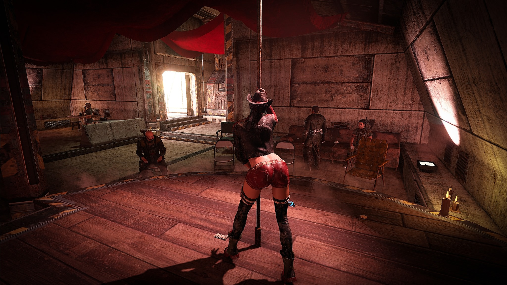

De-a lungul existenței mele pe internet am mai scris introducerea asta de câteva ori. E răsuflarea nostalgică binecunoscută în rândurile jucătorilor, când îți amintești cu plăcere momente din jocurile tale preferate.

Întotdeauna e acel joc anume, care - fie că îl consideri cel mai bun sau doar s-a nimerit să fie acolo pentru tine în momente definitorii - îți stârnește amintiri dintr-o vreme mai bună. Lucrurile erau mai simple, responsabilitățile lipseau, puteai să joci Gothic de peste zece ori până știai fiecare locușor, fiecare zonă în care apar creaturi când progresezi în poveste, până și poziția plantelor. Și bașca nu plantele rare ce îți ofereau creșteri la punctele de abilitate, nu, alea inutile pe care nici nu le foloseai vreodată.

Am consumat într-un ritm exagerat jocul ăsta, pe parcursul a câtorva săptămâni l-am terminat și re-terminat, la un moment dat jucam până la primul bug întâlnit, de obicei vreo misiune care nu se marca corespunzător ca și încheiată cu succes, apoi consideram asta ca un motiv întemeiat să îl reiau de la început. Pot și acum, la peste 10 ani de atunci, să reproduc în cap secțiuni întregi, easter eggs, dialoguri sau șmecherii care te ajută să ajungi puternic cât mai devreme. Altfel spus: traseul optim de parcurgere. Aș putea să zic că e greu de descris ce anume face jocurile Piranha Bytes (PB)să alimenteze un grup de fani ai cărui fanatism întrece poate și pe Blizzerieni, dar cred că am deslușit de mult misterul. E vorba despre construcția lumii, “world building-ul”. Jocurile lor nu au excelat din punct de vedere tehnic, dialogurile sunt deseori anoste sau ”cringy” și se axează mai mult pe umor ironic, iar povestea e doar o scuză, te propulsează practic să explorezi. Ori aici… aici nu a existat vreodată alt producător de jocuri care să capteze același sentiment. E unic în acest mediu, o combinație de plasament manual al confruntărilor, obiectelor și elementelor de mediu înconjurător, cu un nivel de iscusință prezent doar în manualul unui ”con artist”. E o escrocherie… dar ce escrocherie!

Cei familiarizați cu acești producători cunosc probabil povestea lor, după Gothic a urmat continuarea (Gothic 2), care cu toate că a alterat puțin atmosfera primului, e indubitabil apogeul acestui studio și deopotrivă un punct de referință în istoria RPG-urilor 3D. Calmul de dinainte furtunii, pentru că povestea lor avea să ia o întorsătură nefericită de situație. Gothic 3 a fost copilul unei mame dependente de droguri și al unui tată abuziv, **PB** au făcut exces de ambiție și chiar atunci JoWood (distribuitorul lor din acea perioadă), a decis că ar fi momentul oportun să împingă de la spate, iar în loc să fie amânat, jocul a ajuns pe piață în ce era fără îndoială un stadiu beta. Vreo patru patch-uri oficiale mai târziu și alte șapte neoficiale l-au transformat într-un diamant neșlefuit și au scos la iveală intențiile bune ale producătorilor. Dar era prea târziu, JoWood au dat faliment, **PB** s-au reprofilat și în urma noii colaborări dintre ei și Deep Silver noi am primit Risen.

Risen pleca de la ideea din Night of the Raven, expansiunea de care a beneficiat Gothic 2, ce avea ca temă principală pirații. Dar nu orice fel de pirați, ci exemplare carismatice marca **PB**, rupți dintr-o combinație de Pirates of the Caribbean și Monkey Island, zona în care îi găseai era practic alt joc. Atmosfera asta a prins bine la fani, iar **PB** au încercat să profite de ocazie. Nu cu destul curaj însă, Risen sfârșind ca un rezumat al Gothic și Gothic 2, aceleași tipuri de personaje, misiuni, locuri, totul era deja cunoscut de către fanii seriei. Fără îndoială un joc bun, dar lipsit de vreun zvâc aparte și cu un ultim sfert dezamăgitor de plictisitor. Din păcate nici experimentarea nu i-a favorizat, Risen 2 și mai ales 3 sfârșind ca jocuri în care încă se mai putea găsi farmecul lor, dar mediocre după standardele la care au ales ei însăși să le raporteze. Mă refer aici la încadrarea în tiparul jocurilor AAA uzuale (marca EA sau Ubisoft), cu filmulețe lungi și scenarii de la Hollywood. Acest declin de formă s-a observat și prin vânzările din ce în ce mai mici, motiv pentru care eu nu mă așteptam neapărat la un succes când a fost anunțat ELEX.

Nu voi spune de la ce vin inițialele pentru că e stupid, ce e important de remarcat este că pentru prima dată au ales să recreeze în jocurile lor un alt tip de univers. O combinație de fantasy și SF. Pare greu de crezut că dacă arunci Gothic și Mass Effect într-un blender o să iasă ceva comestibil, însă se pare că au fost loviți de inspirație, pentru că a ieșit surprinzător de bine amestecul. Sigur, îi iert inerent puțin, nu e un studio foarte mare, nu beneficiază de persoane cu experiență bogată în construirea unui univers de acest gen, lore-ul nu se ridică la nivelul titlurilor de anvergură, care au mici armate ce se ocupă de asta. Nici Risen nu dădea pe spate, doar că se mula cumva pe ce ar fi putut fi după Gothic 3. De fapt, asta a și făcut fanii să emită tot felul de teorii în această privință, iar realitatea e că cel mai probabil **PB** s-au inspirat din ce aveau deja pe hârtie și asta a contribuit la sentimentul de familiaritate emanat de lumea aceea.

Însă ELEX? Nu se aseamănă cu nimic din trecut, similar lui Gothic 3, e un risc nebunesc, și tot similar lui Gothic 3, propune o lume de dimensiune bizar de mare. Plasamentul manual al obiectelor și atenția la detaliu nu se împacă bine cu lumi enorme. Jocurile din seria TES stau undeva într-un colț și se uită supărate la mine acum, dar exemple sunt destule și fără să le includ pe acestea. Sigur, efortul titanic depus de CD Projekt a făcut din The Witcher 3 etalonul RPG-urilor open world, dar și acolo dimensiunea lumii e cel mai mare defect al jocului. Pentru că e la modă să faci jocuri mari, nu știu cine a avut primul ideea că ăsta ar fi un lucru bun dar ar fi trebuit degrabă șters din istorie.

În bunul stil tradițional **PB**, ELEX începe cu un filmuleț neconvingător (cu texturi din anul 2002) în care se explică, pe scurt, că o cometă a lovit planeta Magalan și a adus cu sine un nou tip de material: _ELEX_. Acest material a dus la mutații în rândul tuturor vietăților. Animalele s-au transformat în bestii specifice RPG-urilor, dar creativ gândite să îți provoace silă. Plantele au început să strălucească și să ofere bonusuri la dexteritate, iar oamenii au făcut ce fac oamenii mai bine, l-au transformat în drog și monedă de schimb. L-au dat pe gât mai ceva ca pe capsulele de detergent și cei care au supraviețuit s-au transformat în witcheri. Uh… stai, am greșit universul. Dar cam așa e. Supra-oameni inteligenți, lipsiți de emoție și cu pielea de culoare albă (efect secundar al consumului). Singura diferență notabilă dintre albi și witcheri e dat de numărul de femei cu care se culcă.

Albii s-au unit și organizat în propria lor facțiune axată pe această filosofie: consum de _ELEX_ până crapă sau dau de următorul pas din evoluție. Evident că asta nu a mulțumit pe toată lumea, iar celelalte facțiuni au opus rezistență. Clericii fiind cei mai de seamă, deoarece din această facțiune s-au desprins albii inițial, nemulțumiți fiind de natura religioasă a vieții de cleric. Atât albii, cât și clericii duc stiluri de viață axate aproape exclusiv pe tehnologie, dar ultimii se închină la Calaan, un zeu cam aleatoriu ales de ei despre care puteți afla mai multe explorând în amănunt lumea de joc.

De partea cealaltă avem berserkerii, au renunțat la orice fel de tehnologie și au găsit un alt mod de procesare pentru _ELEX_, ce îl transformă în mana, combustibil pentru vrăjile de care sunt capabili. Aceștia reprezintă facțiunea tradițională, au magi și luptători înarmați cu săbii, topoare, scuturi și alte rămășițe ale evului mediu. Ultimii și cei din urmă sunt outlaws, care reprezintă practic o adunătură de târâturi ce nu s-au putut încadra în vreuna dintre societățile deja existente. S-au dus în deșert, au făcut tabără și s-au organizat pe principiul legii junglei. Conform modului lor de viață, outlaws folosesc tot felul de manevre în timpul luptei, droguri, arme foarte mari care cauzează explozii, ocazionalul cuțit în spate, v-ați prins.

Din nou, aș remarca că **PB** vin cu un plus de originalitate față de jocurile precedente, facțiunile din ELEX nu mai copiază Gothic, deși apar asemănări (cultul religios, mercenarii și tipii aparent buni), fiecare vine cu elemente scrântite. Clericii și albii au ditamai roboții de luptă, berserkerii pot folosi armele în moduri spectaculoase (săgeți multiple, topoare augmentate de vrăji), iar outlaws… nimic nu e clasic la ei. Drogurile pe care le pot folosi pentru a lupta mai bine vin inițial cu penalități la experiență. Dar în același timp, folosite corect pot fi extrem de puternice. Poate că ce zic eu aici sună bine individual, dar reușita lui ELEX e cum îmbină toate aceste elemente. Poți fi un cleric cu ciocan de luptă, lansator de grenade, arc medieval și jetpack!

Jetpack! Am ajuns și aici, o găselniță mică ce nu pare foarte relevantă din exterior dar care crește exponențial nivelul de distracție al jocului. Pentru că exploatează însăși calitatea de bază a producătorilor: construcția lumii. Fanii vechi ai seriei Gothic cunosc codul “MARVIN”, care printre altele te lăsa să zbori prin joc, privind de sus lumea, rutele de patrulare, animalele sălbatice și modul în care totul se desfășura fără tine. De această dată nu mai e nevoie de coduri, jetpack-ul e parte integrală din joc. Îl capeți chiar la început, nu poți scăpa de el, nu îl poți pierde niciodată și are combustibil infinit, atât doar că funcționează pe bază de regenerare. Îl poți ține aprins câteva secunde, apoi e nevoie să îl lași să își revină. Nu e greu de imaginat cât de mare e impactul jetpack-ului în joc, deodată poți explora vertical, poți sări de la orice înălțime și evident că e implementat și în lupte. Nu e foarte ușor să scapi de inamici așa însă, majoritatea sunt capabili de atacuri la distanță și dacă te-au prins te-au nenorocit. Dar, obținând abilitățile corespunzătoare, jetpack-ul îți poate oferi un atac mai puternic care îi amețește pentru câteva secunde, e extrem de folositor când tragi cu arcul sau armele de sus. Și e al naibii de distractiv de folosit.

La fel ca introducerea mea din această recenzie, începutul de joc din ELEX e un adevărat test al răbdării, nu mulți ajung mai departe. Jucat pe ultimul nivel de dificultate, e fără îndoială cel mai dificil joc **PB**, nu mai dispune de lungi zone introductive precum Risen și nici de un număr foarte mare de inamici mai slabi, ca în Gothic. Practic, in afară de versiunile intenționat handicapate de bestii, menite să te ajute puțin cu deprinderea schemei de control, până și cel mai slab inamic te va întinde pe jos dintr-o singură lovitură. Nici ca progresie nu ți se oferă prea mult ajutor, nu îți zice nimeni încotro să mergi, habar nu ai cum ar fi bine să investești punctele primite odată cu creșterea în nivel și pe lângă asta, protagonistul e amnezic.

ELEX te pune în pielea lui Jax, un Geralt mai puțin educat, chinuit de viziuni și emoții, efecte secundare ale abstinenței de la consumul de _ELEX_, ce se trezește înjunghiat pe le spate și aruncat în mijlocul facțiunilor ce se opun albilor. De fapt, se trezește taman la berskeri la poartă, cum nu se putea mai rău. Norocul său e că dă de Duras, un berseker relativ prietenos care, în loc să îi taie beregata, îl conduce către tabăra sa și îi poveste despre regulile ce trebuie respectate aici. Da, la fel ca Diego, numele său începe cu D și e format din cinci litere, dar cam atât au cei doi în comun, deci nu vă speriați, **PB** nu copiază prea tare începutul lui Gothic. În schimb, posibilii însoțitori, printre care și Duras evident, se dovedesc ar fi personalități mai complexe decât cei patru prieteni ai eroului fără nume din Gothic. Acestea fiind spuse, personal i-am ignorat, excepție făcând misiunile unde erau necesari; încă nu înțeleg încăpățânarea producătorilor când vine vorba de acest aspect al jocurilor. Însoțitorii erau degeaba în Risen și Gothic și (nu tocmai) umila mea părere e că pentru un maxim de imersiune și atmosferă nu ar trebui folosiți. De altfel, cu excepția RPG-urilor party based sunt un inamic declarat al NPC-urilor ce se țin după mine ca o școlăriță îndrăgostită.

Ca să scap de asta rapid: nu, nu ai acces la inventarul lor, abilitățile nu le pot fi personalizate, așadar la fel ca în jocurile anterioare însoțitorii au mai mult menirea de a ușura jocul în faza de început sau de a da pe spate jucătorii care nu au auzit de Baldur’s Gate sau Planescape Torment. A, și poți să faci sex cu ei, cu femeile cel puțin pentru că **PB** nu au ajuns încă la nivelul Bioware când vine vorba de bisexuali pe metru pătrat. Dacă în mod normal dialogurile pot fi destul de stânjenitoare, nu cred că mai e nevoie să zic că discuțiile romantice din ELEX îți cresc nevoia de a te băga sub birou rușinat. Există o tâmpenie debordantă în tot ce înseamnă relații interpersonale în jocul acesta, chiar mai mult decât cu Patty în Risen 2.

Ce face totuși bine începutul de joc? Păi hai să o luam așa: dacă te plimbi noaptea prin tabăra bersekerilor, plantele cultivate de aceștia strălucesc și întreaga zonă capătă un aspect aparte. Pentru că într-o lume a benzinăriilor abandonate și a armelor laser, există bucata asta de pământ verde, cu un aspect ușor straniu după lăsarea nopții și o atmosferă ce ar fi fost aproape magică dacă nu se trezea câte un dobitoc să-ți atragă atenția că nu e voie cu tehnologie aici, deși tot ce făceai era să îți verifici nenorocitul ăla de inventar. Veți petrece mult timp pe aici, cunoscând personalitățile locale. Fără a acumula suficientă experiență din misiuni făcute în siguranța zidurilor și a paznicilor, aventura în necunoscut poate fi mortală. Nu-i de glumă, pe ultimul nivel de dificultate, în primele zece ore jocul e practic de tip survival, trebuie să te zbați încercând să-ți găsești calea. Personal mi-a plăcut foarte mult pentru că mi-a adus aminte de sentimentul din Gothic: fiecare item găsit, furat sau câștigat contează. Apoi mai e întotdeauna tipul care stă de gardă și se ia de tine, te bate și te lasă fără bani. Dar știi tu în sinea ta ce urmează, ai să te întorci aici și vei decora locul cu măruntaiele lui.

Ar fi prea mult să vă povestesc despre partea asta introductivă, aici petreci practic cel mai mult timp, chiar și după ce îți găsești o direcție de progresie mulțumitoare, primul sfert de joc tot te pune în perspectiva unui underdog. Sunt multe variante în gameplay prin care să ieși din sfera asta însă, balansarea nu caracterizează ELEX, fie că folosești poțiuni care oferă puncte de abilitate, arme foarte puternice prea devreme sau substanțele de la Outlaws, jocul îți oferă destule posibilități de succes, printre care și câteva cu avantaje nu neapărat corecte. Cei mai câștigați vor fi cei care apreciază explorarea și experimentarea. E extrem de satisfăcător momentul când simți că în sfârșit ai pus ceva pe tine și te poți lua la trântă cu bestiile. Înarmat fiind cu o săbiuță și un scut, m-am simțit ca un adevărat cuceritor. Mai ales că scutul e foarte folositor în partea de început, îți salvează viața blocând atacurile inamicilor mult mai puternici decât tine.

Odată cu această trecere la prima ligă, devine mult mai ușoară și avansarea prin misiunile ce țin de povestea principală, care cumva a ajuns să mă acapareze. E ca un film SF de acțiune din anii ’80, tâmpițel dar cu farmec. De lăudat că acum **PB** nu au mai insistat pe partea asta ca în ultimele două jocuri Risen. Da, sunt câteva filmulețe și jocul împrumută destul elemente nefericite de la RPG-urile Bioware. Dar nu îți mai sunt băgate pe gât cu forța, acesta fiind probabil și meritul unei lumi accesibile direct, fără împărțeala pe zone mai mici. Firul narativ are menirea de a te plimba prin toate zonele importante, pe la toate facțiunile. Iar la început asta chiar contează, pentru că din motive necunoscute pe hartă nu e trecut nici un oraș, nici măcar cele importante. Ele apar, dar nu există denumiri. Doar unul din lungul șir de elemente implauzibile care strică imersiunea. Având în vedere că Jax e un general Alb, trimis în misiune, te-ai gândi că tehnologia avansată pe care o are la dispoziție îi afișează și blestematele alea de nume pentru orașe.

Și e tehnologie avansată nu glumă, dacă primești o misiune să găsești un arc pierdut de un NPC prin naiba știe unde, dispozitivul pe care ai harta îți arată instant și la fix unde e. Dar orașe, drumuri, orientare de bază? La nivelul hărții medievale din Gothic. Așa ajungem la cea mai mare problemă a mea cu jocul: indicatoarele pentru misiuni. ELEX e o corcitură din punctul acesta de vedere, vine cu o lume care se cere explorată dar în același timp prea mare ca să faci asta. Poate dacă stai câteva sute de ore la el reușești, dar o să ajungi să-ți blestemi existența înainte să termini jocul. Deci nu poți fizic să explorezi tot, descoperind tu cum să rezolvi și misiunile la care nu primești deloc indicații. Mergea asta în Gothic, cu ceva dedicare mergea și în Gothic 2, dar ELEX are mai multe în comun cu frățiorul lor cel mai mic. Chestia e că producătorii puteau combate problema asta prin misiuni inteligent gândite și NPC-uri care să te îndrume către diferite zone din lume. În schimb, ce au făcut? Primești mai multe indicații de orientare de la personajele din Gothic, un joc de peste 10 ori mai mic, decât aici. Dacă asta nu era de ajuns, descrierile misiunilor nu îți transmit nimic. Te trezești că trebuie să găsești 5 NPC-uri, misiune foarte importantă pentru că reprezintă ancheta unei crime. Bun, unde sunt? ÎN PĂDURE. Asta e marea indicație pe care o primești de la cel care te trimite în misiune.

Acesta e doar un exemplu memorabil pentru mine, problema se repetă de nenumărate ori pe parcursul jocului și îl face imposibil de parcurs fără indicatoare. Iar asta vine de la un dușman declarat al săgetuțelor, bastonașelor și a tuturor mizeriilor de genul acesta, urăsc și faptul că dezvoltatorul vrea să pună hărți în Underrail. E paradoxal că pot trece printr-un RPG izometric de dimensiuni foarte mari ca Underrail, fără ca măcar să am nevoie de hartă, dar design-ul misiunilor dintr-un joc 3D e atât de cretin încât nu mă pot orienta. Nu doar atât, dar NPC-urile, prin lipsa asta de interacțiune, par complet desprinse de lumea în care există.

Desigur, există și misiuni bine puse la punct, cu exact gradul de mister și explorare necesare pentru a te ține în priză, construirea lumii înconjurătoare punctând și mai bine atmosfera apăsătoare. Poate locul meu preferat din joc e Valley of the Damned, un omagiu adus coloniei de prizonieri din Gothic. Aici sunt trimiși de către berserkeri cei care încalcă regulile lor stricte, mulți dintre ei ajungând să moară imediat sau să trăiască auster, apoi să moară. Eventual câțiva norocoși evadează și mor un pic mai încolo. **PB** și-au arătat clasa și au demonstrat că pot să se auto-depășească. Elevația terenului, cromatica pădurilor și zgomotele făcute de faună sau mutanți dau zonei un aspect bizar și simți acel sentiment de frică specific lumilor lor. Ca atunci când explorai o peșteră în Gothic și abia așteptai să vezi ieșirea. Dar poate și mai remarcabil, explorarea convertoarelor, construcții gigante ale albilor menite să extragă _ELEX_ din pământ, combină sentimentul de frică mai sus menționat cu curiozitatea aparte specifică SF-ului. Personal am găsit răcoritoare această abordare. Poate că e stângace, dar aventura PB în tărâmurile știintifico-fantastice mi se pare o decizie fericită, pentru că nu multe RPG-uri de acest gen reușesc să stimuleze așa cum ar trebui imaginația. Dar poate că asta e doar dezamăgirea mea personală legată de ce a ajuns Mass Effect.

Din fericire, fragmentarea imersiunii nu se regăsește și în sistemul de luptă. Am avut ocazia să experimentez și cu lupta de aproape, dar și cu puterile psihice ale clericilor. Ba chiar mulțumită unui item am putut să văd cum e să te distrezi ca Robin Hood cu abilitățile de tras cu arcul specifice berserkerilor. Toate mi s-au părut distractiv de folosit, dar pentru mine cea mai atmosferică formulă de luptă a fost clasica sabie, în compania unui scut solid. Îmi aduce aminte de singura parte bună a luptelor din Skyrim, te trezești prins într-o văgăuna de o dihanie mult peste capacitățile tale și singurul mod de supraviețuire e să nu o lași să te atingă. Varietatea abilităților e foarte mare și nu mă pot pronunța asupra tuturor, pare că și să joci cu o armă masivă, ținută cu două mâini, ar putea fi la fel e satisfăcător, pentru că e mai ușor să blochezi atacurile. Ah, apropo de atacuri, e păcat că de această dată înveți abilitățile noi într-un mod cam sec. Tot ai nevoie de tutori, dar în conversație te trezești cu un meniu realizat parcă pentru console, de unde alegi ce vrei. Era mai frumos când treceai natural din conversație la abilitățile care te interesează, dar probabil că nu toată lumea avea răbdare să facă asta.

De asemenea, dacă ar fi să mai critic ceva, aș zice că jocul e mult mai puțin atmosferic jucat cu arme de foc, decât în orice altă variantă. Chit că puterile psi sunt devastatoare, le primești la sfârșit. În schimb, dacă te pune dracu’ să pleci la drum cu un lansator de flăcări ai rezolvat jocul din prima. Însă aici e posibil să se mai fi schimbat lucrurile în patch-urile ce au apărut după ce am trecut eu prin joc. În mod similar cu Risen 2, aș zice, armele de foc sunt de folosit doar de cei care nu fac față provocării sau vor să treacă repede prin confruntări. Au muniția limitată și nu vă gândiți că e chiar floare la ureche să ajungi în postura asta, dar este oricum mult mai ușor decât să te iei la păruit cu fiecare inamic pe rând, în lupta de aproape.

Nu am prea adus în discuție partea tehnică decât la început, dar mai menționez încă o dată că ELEX e poate cel mai bine pus la punct joc **PB**. Nu există bug-uri majore, grafic e impecabil, poate că nu se ia la trântă cu The Witcher 3 dar mi-e greu să reproșez ceva dincolo de filmulețele sărace în poligoane. Nici nu pot să zic că aveam mari pretenții pe partea asta, însă e bine că producătorii nu au făcut greșelile obișnuite. Coloana sonoră mi s-a părut discretă, nu m-a deranjat dar nici nu pot spune că mai țin minte ceva. E compusă de Bjorn Pankratz, care e și lead designer-ul jocului, și care s-a achitat de datorie, dar se simte lipsa unui Kai Rosenkranz sau altcineva de nivelul său.

ELEX e cel mai bun joc **PB** de la Gothic 3 încoace, în principal pentru că deși si-au asumat niște riscuri destul de mari, au reușit să balanseze defectele jocului plusând pe partea de explorare, libertate de experimentare și atmosferă. Chiar punctele lor forte. Sunt multe lucruri ce puteau fi îmbunătățite dar părerea mea e că a ieșit nesperat de bine. ELEX 2 e deja confirmat, iar finalul jocului lasă loc unei continuări extrem de interesante. Mai ales dacă vor păstra direcția curajoasă și vor îndrăzni să modifice lumea de joc și mai mult. Un succes venit la fix, cred că și fanii lor mai dedicați s-ar fi supărat dacă ne-am fi trezit cu un nou Risen. Așa că avem la ce spera în continuare. ■
