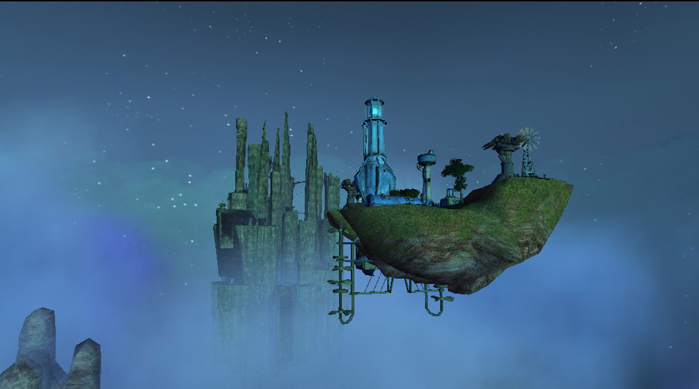
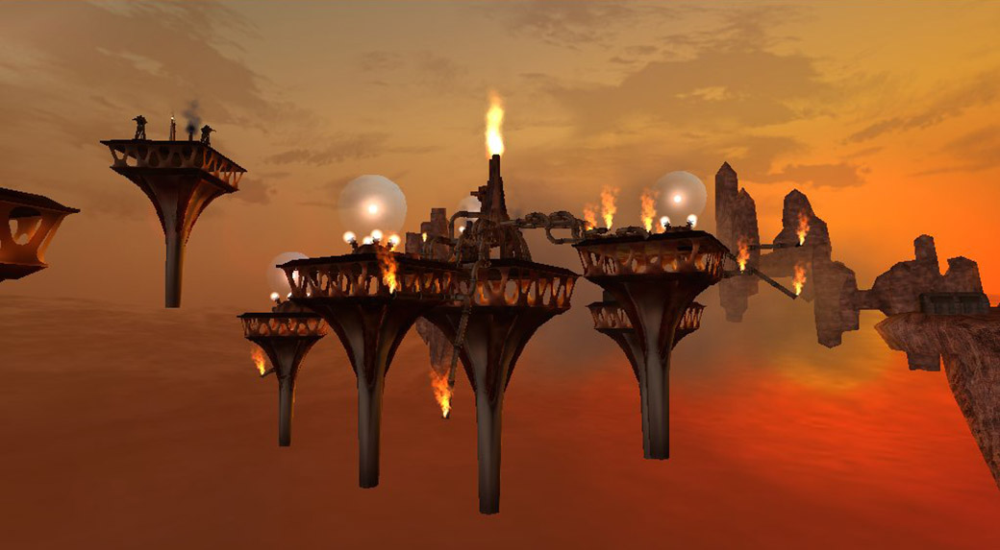
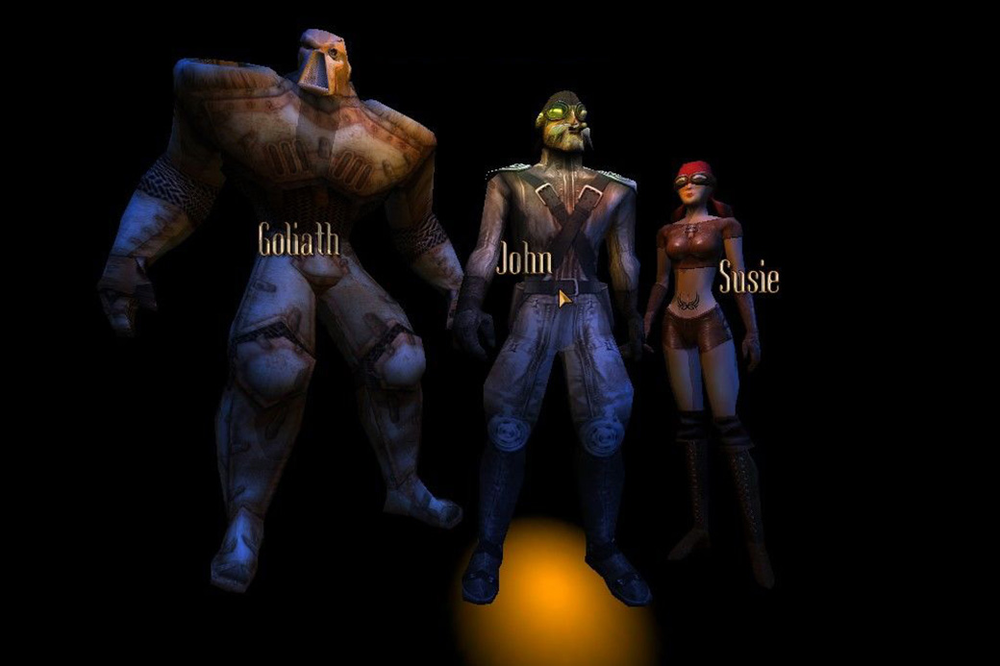
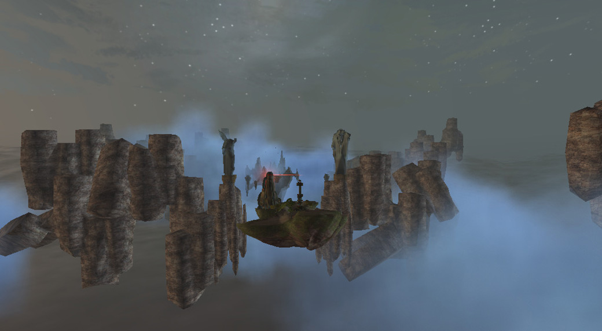
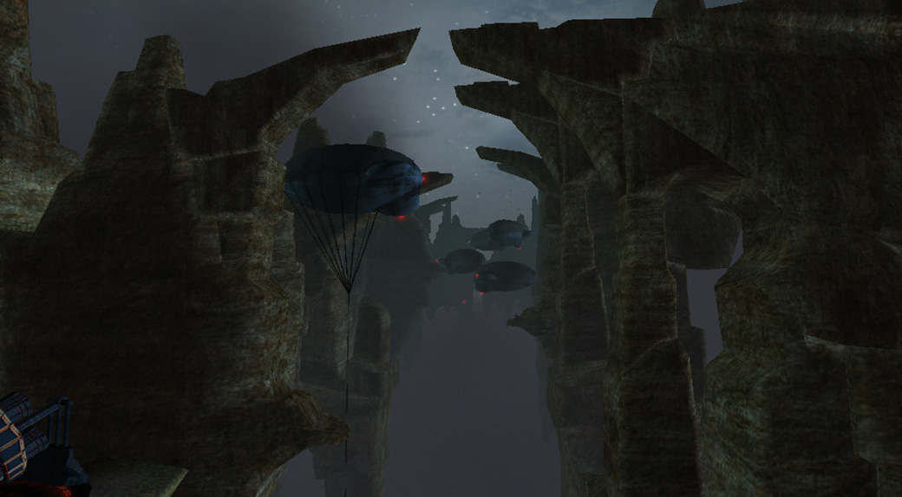

Îmbinând un noian de genuri, cu o amplasare spațială străină și mici impresii venite de la tovarășul care apucase să-l butonaze, având curiozitatea zgândărită și nevoia de-a-nțelege ce se petrece în spatele cuvintelor entuziaste ale lui, a trebuit să văd exact despre ce e vorba, iar după unsprezece ani de când am pus prima dată mâna pe Nomads și trei încercări nereușite am reușit să-l duc la final în bunul an 2016.

Jocul debutează cu o secvență narativă în care ți se spune că ești pe planeta Aeres, demult răvășită de conflictele vechilor Master Builderi, în urma cărora bucăți din scoarța planetei se desprinseseră și începuseră să zboare. Tu, nomad, împreună cu doi prieteni, dornici de aventură și atrași de poveștile negustorului Trevayne despre comorile din teritoriul Santinelelor, vă luați literalmente zborul în căutarea bogățiilor. Surprinși de avioanele santinelelor, prietenii tăi sunt doborâți și luați prizonieri în timp ce tu ești presupus mort și lăsat așa pe-o insulă zburătoare. Acesta este momentul în care începi să-ți controlezi personajul, ales la începutul jocului, dintr-o perspectivă 3rd person. Pe mica insulă îl găsești pe Basaltface, un Master Builder, confuz, ca trezit din somn, care după ce se plânge că a fost ținut prizonier de Santinele secole la rând, creeză un far într-o parte a insulei, îți oferă câteva artefacte și îți spune ce trebuie să faci, ca parte a tutorialului de început. Farul de care vorbeam va reprezenta integritatea structurală a insulei, iar o dată distrus insula se va destrăma și va pica în hăul vechii planete.

Primești câteva bile de energie și un turn de veghe pe care trebuie să-l înalți pe insulă, puțin în stânga farului. De altfel turnul de veghe și farul sunt singurele clădiri cărora nu le poți schimba locația pe insulă. Restul clădirilor pe care le primești pe parcurs pot fi construite în oricare altă locație disponibilă pentru un total de 9 clădiri cu tot cu cele două hangare.

Măsura de strategie va veni exact de aici, de la distribuirea corectă a clădirilor pe insulă. Fiind un spațiu limitat și având în vedere specializarea fiecărei clădiri vor trebui luate în calcul mai multe aspecte cum ar fi: dacă să sacrifici o turelă de apărare pentru ridicarea unui Silo care crește spațiului de stocare a energiei, energie care contează enorm în economia jocului folosită atât la reparații cât și la refacerea clădirilor distruse, dacă să foloști turele autonome în detrimentul unui tun mult mai puternic dar care necesită operare manuală, pentru situațiile în care ești atacat din toate direcțiile iar clădirile au nevoie disperată de reparații, dacă să folosești un tandem de Power Plant+Colector pentru creșterea ratei de refacere a energiei.

După misiunea introductivă navighezi cu insula înapoi la Trevayne în Grey Market, descrisă ca o reprezentare palidă a ceea ce a fost o dată. Aici vei găsi mai multe artefacte ce pot fi construite pe insulă(un Power Plant, un Silo, o turelă de apărare) precum și două artefacte native Grey Market-ului: un seif pentru stocarea artefactelor folosit doar ca decor și o presă de artefacte, dar care vor deveni disponibile și jucătorului pentru a fi construite pe propria insulă ceva mai târziu. Majoritatea artefactelor construibile în pozițiile variabile de pe insulă vor veni în două culori: albastre și roșii, diferența între ele fiind aceea că cele roșii, în cazul în care sunt distruse se pierd pentru totdeauna, pe când cele albastre pot fi distruse și reconstruite ad infinitum cu condiția să dispui de energia necesară pentru a le putea plasa. Importanța presei de artefacte este aceea că îți permite să combini două artefacte de același fel pentru a crea unul nou dar cu diverse îmbunătățiri:damage și HP sporite, autonomie pentu turele, capacitate mai mare de stocare pentru Silo, etc. Combinarea artefactelor de același tip, dar culori diferite este posibilă și va crea întotdeauna artefacte roșii, ceea ce nu e neapărat un lucru rău atâta timp cât vor fi folosite cu un minim de înțelepciune și precauție.



Mai departe vei urma instrucțiunile lui Basaltface în drumul lui spre răzbunare împotriva Santinelelor pentru timpul cât a fost ținut prizonier cu pretextul că te va ajuta în același timp să-ți salvezi prietenii și să eliberezi lumea de dominația Santinelelor. Misiunile sunt în mare cam aceleași de prin alte jocuri: escortează „x”, mergi la destinația „y”, distruge obiectivul „z”, rezistă la „n” valuri de inamici.

Câteva misiuni te vor obliga să-ți părăsești insula să te lupți cu gândaci uriași a căror abilitate e să se apropie de tine, să se detoneze și să împrăștie un nor toxic . Ca apărare împotriva lor te vei folosi de un Battlespell care nu e nimic altceva decât un fireball de lvl 1 și o bombă cu efect întârziat. În altele, vei fi despărțit de insulă și va trebui să pilotezi un avion pentru a îndeplini diferite obiective(zbor în formație, recuperarea unor artefacte).

De altfel, desfășurarea jocului decurge într-un mod cât se poate de banal, uneori un pic repetitiv, iar misiunile în care ești despărțit de insulă sunt doar o mică variație la o experiență care poate deveni ușor plictisitoare. Storyline-ul fiind foarte scriptat duce la o liniaritate nesuferită și doar în vreo două excepții ai posibilitatea de a alege următoare destinație între mai multe puncte de nagivație.

Nici story-ul nu rupe gura târgului, în câteva cazuri fiind de-a dreptul prostuț și poate fi considerat doar un pretext, un schelet pe care se atârnă misiunile. La început când nomazii zboară prin teritoriile bine păzite ale Santinelelor nu aveau cum să nu fie întâmpinați decât cu ostilitate. Setea de răzbunare a lui Basaltface, sprâncenele lui unite și vocea gâjâită, cu mici accese de furie, ar fi trebuit să fie un semnal de alarmă pentru oricine, iar răsturnarea de situație de la jumătatea jocului n-ar putea surprinde pe nimeni. Antagonistul principal, după înfrângerea definitivă a Santinelelor, devine Basaltface în fruntea unei armate de Skrits (gândacii de care ziceam mai sus) și ai, pentru un moment, senzația că împărți același univers cu umanitatea din “Starship Troopers”. Într-una din misiunile în care trebuie să faci față hoardelor de Skrits zburători, ca ultimă redută împotriva gândacilor, Trevayne spune că e o misiune sinucigașă și apoi cu seninătate se întoarce spre Nomad și-i spune că e o misiune pentru el. Petreci două misiuni să găsești și să fii escortă pentru una din navele vechii lumi pentru un asalt asupra Orașului Mașinilor ca apoi să apară pentru două minute și să dispară în neant fără nici o avertizare și fără să fi contribuit în vreun fel la terminarea misiunii.

De departe cea mai nostimă chestie legată de firul narativ a fost când, pentru a putea avansa la următorul nivel (misiune) trebuia atașat insulei un modul numit “level drive”, un sistem de elice care-ți permit navigarea între niveluri.

Sunt și câteva bug-uri, dar nimic care să compromită experiența jocului definitiv. Ca de exemplu sunt câteva instanțe când Nomadul îți rămâne pur și simplu blocat în decor, sau nu poate trece peste un fir de iarbă mai încăpățânat. Fiind pe o insulă zburătoare, există întotdeauna șansa, minusculă, ca atunci când te grăbești să ajungi dintr-o parte în alta a insulei să te folosești de un jump boost și să cazi peste margine, sau fiind o diferență de nivel între insulă și docul la care ai oprit, saltul să fie mai lung decât ai plănuit și să te trezești picând în gol. Personal mi s-a întâmplat asta la finalul unei misiuni.

Și totuși, în ciuda atâtor neajunsuri, Project Nomads poate fi o experiență ca nici care alta. Întregul concept cu insulele zburătoare, deși nu original, fiind întâlnit și în câteva opere literare, cum ar fi Călătoriile lui Gulliver, e aproape unic într-un joc. Având posibilitatea să interacționezi cu toate clădirile de pe insulă, iar la câteva să și preiei controlul aduce cu originalul “Guns of Icarus” înainte să intre în conștiința publică pentru fratele lui Online și oferă posibilitatea personalizării insulei în fel și chip, cu atât mai mult că numărul artefactelor va depăși cu mult spațiul construibil de pe insulă. Nu că toate combinațiile ar fi chiar viabile sau indicate, dar posibilitatea de a-ți schimba configurația navei de luptă din zbor e un lucru îmbucurător pentru a rezolva orice situație neplăcută. De asemenea, deși nivelurile sunt liniare, modul în care sunt abordate ține mai mult de player. E adevărat că pentru a termina o anumită misiune e imperativ ca punctele de navigare să fie străbătute, dar nu ești forțat să le străbați dacă vrei să avansezi fără riscuri. Poți, de exemplu, să lași insula într-o poziție staționară, să mergi în recunoaștere cu avionul și să distrugi inamicii folosindu-te de armele prezente pe avion sau chiar atacuri sinucigașe. De multe ori, pentru a evita agresiunile venite de la bombardierele inamice care au prostul obicei de a rade mai mult de jumătate din clădirile de pe insulă la o singură trecere, e preferabil să-ți folosești avionul în mod sinucigaș. Turelele sunt ineficiente în a distruge un bombardier, iar tunul manevrabil doar de player tot are nevoie de câteva lovituri pentru a-l doborî și nu e chiar cea mai precisă dintre armele disponibile, având pe lângă asta și o întârziere între focuri succesive. Mult mai târziu, va deveni disponibil și pentru player un hangar pentru bombardiere, foarte folositor dacă vrei să-ți rezolvi problemele de la distanță, dar cu marele inconvenient că are un HP foarte mic și poate fi destul de ușor doborât. Pe lângă asta durează foarte mult timp să se respawneze dacă a fost distrus.



Controlul asupra avionului de vânătoare sau a bombardierului e la un click distanță, iar avionul de vânătoare are propria autonomie, asemenea turelelor de level 2 și 3, ceea ce e îl face foarte folositor pentru situațiile defensive și, dacă ești suficient de aproape cu insula de zonele ostile, nu se va da în lături de la distrugerea avioanele și turelele inamice.

Dacă unul din avioanele personale este distrus în luptă, preluarea controlului celuilalt avion se va face automat, nefiind nevoie ca player-ul să parcurgă distanța dintre hangare.

Turelele autonome ușurează întrucâtva corvoada multitasking-ului. Te poți concentra liniștit asupra controlului unei singure arme de apărare și a eventualelor reparații, acuratețea lor fiind mult îmbunătățită, chiar preferabilă, iar un plus enorm este că ele pot deveni disponibile imediat după vizita la Grey Market de la începutul jocului, totul depinzând de management-ul artefactelor din momentul respectiv. Bineînțeles sunt câteva mici limitări: deși zburătoarele inamice și turelele sunt luate la țintă, celelalte clădiri, cum ar fi hangarele nu sunt considerate primejdioase așa că pot să spawneze avioane încontinuu. Ar mai fi și faptul că totuși raza lor de acțiune e sensibil mai mică față de atunci când sunt controlate de player. Pe partea cealaltă, și inamicii au tendința de a prioritiza întâi turelele și turnul de veghe(în cazul în care ești în mișcare, pentru că o țintă staționară e mult mai ușor de distrus de bombardiere), așa că nu există diferențe între AI-ul inamic și cel al uneltelor player-ului.

Având în vedere că există opțiunea de a alege între trei Nomazi (Susie, Goliath și John), experiența de joc e un pic diferită cu oricare dintre ei, chiar dacă toți trei urmează același fir narativ. Diferențele dintre ei nu sunt doar pur estetice, cum nici diferențele dintre clădirile lor nu sunt doar cosmetice. Ca de exemplu, Susie se mișcă cel mai repede dintre cei trei, asta ajutând-o enorm dacă mai multe clădiri necesită reparații într-un timp foarte scurt. Goliath e bazat mai mult pe STR, nu numai statura lui impunătoare sugerează asta, dar și armele sale sunt mult mai puternice decât a celorlați doi. John e cam middle ground între cele două extreme, îmbinând armele slabe ale lui Susie cu încetineala lui Goliath.

Un lucru interesant de remarcat, jucând cu Goliath care are arme mult mai puternice, inclusiv un avion de vântătoare cu putere de foc sporită, avioanele inamice au tendința de a intra sinucigaș în avionul player-ului. Ca o comparație, avionul lui John trecea nestingherit printre avioanele inamice și avea nevoie de câteva treceri în jurul unui obiectiv până să-l distrugă, pe când cel al lui Goliath ar fi putut să facă asta la prima trecere și să mai și tragă câțiva agresori după el.

Setting-ul în sine, cu toate rămășițele planetei zburând prin „marea nesfârșită de nori” are ceva fascinant. Uneori este vizibil chiar și unul din sateliții naturali ai planetei, dar într-o poziție foarte ciudată, atârnând undeva jos, un adevărat anacronism pentru noi, obișnuiți să privim în sus după aștri. Cum Grey Market-ul e vizitat de mai multe ori pe parcursul campaniei, uneori pentru ridicarea unor artefacte, alteori doar pentru a primi următoarea misiune, e fain că nu e vizitată în același moment al zilei. De altfel, nici misiunile nu se desfășoară în același moment al zilei: jocul începe cândva la apus, una din primele misiuni se desfășoară pe întuneric, o vizită la Grey Market e cândva după răsărit, culorile fiind mult mai vii și mai vibrante decât la apusul de început în care totul e de un protocaliu bolnăvicios.

Mai mult, avansul și vizibilitatea pot să-ți fie încetinite din cauza norilor de ceață sau praf care se ridică uneori. Sunt momente scriptate, ce-i drept, dar totuși aduc un plus de savoare și naturalețe lumii din Nomads.

În legătură cu gradul de uzură și violență la care ți-au fost supuse clădirile, modul în care-ți dai seama este după fumul și flăcările care ies din acestea. Dacă au susținut prejudicii minore se va ridica din ele un fir subțire de fum. În schimb, dacă au fost abrutizate până la epuizare, flăcările ies violent, într-un final mistuind clădirile dacă au fost lăsate fără reparații (mi s-a întâmplat în cel puțin o instanță ca o clădire să fie distrusă de flăcări pentru că n-am reparat-o la timp). Acest lucru e valabil chiar și la far, iar în plus pentru acesta, apropierea de distrugere e însoțită nu numai de flăcări ci și de un „cue” auditiv, o sirenă de avertizare că te afli la un pas de anihilare.

Din punct de vedere auditiv, jocul e acceptabil, sunetele grave de tobe sunt cele mai prevalente, insuflând o senzație de străin, de ceva din afară. Voice acting-ul, însă, cam lasă de dorit. În afară de Basaltface și vocea lui supărătoare, celelalte NPC-uri fac o treabă ceva mai bună. E păcat că liderul Santinelelor, Master Mold Seraphim, cu acvariul lui pe cap și costumul de cosmonaut dispare după înfrângerea Santinelelor fiind un „villain” mult mai interesant decât Basaltface. Byldan în schimb mi s-a părut excelent comparat cu celelalte NPC-uri.

Project Nomads ar fi putut fi îmbunătățit într-o mulțime de feluri. Neajunsul story-ului putea probabil să fie rezolvat prin punerea în discuție a moralității tale de Nomad. Nu e neapărată nevoie ca player-ul să fie din oficiu „the good guy”, mai ales că e pus în pielea unui aventurier interesat de povești cu comori, în fond o victimă materialistă.

S-ar putea argumenta că totuși e un joc apărut în 2002, pe vremea când „good guy” era cam setarea default pentru majoritatea covârșitoare a jocurilor și nu chiar toate ar fi meritat un efort al poveștii pentru realizarea mai multor nuanțe de gri.

Se puteau explora mai mult intențiile Santinelelor, chiar dacă pot să speculez că motivația lor era să elimine pe oricine ar fi încercat să-l elibereze pe Basaltface, fanatismul și delăsarea lor, precum și lipsa de comunicare între diferitele entități și facțiuni ale planetei sunt cele care aduc înapoi urgia lui Basaltface înapoi pe Aeres.

Alegerea câtorva actori profeșioniști vorbitori nativi de limba engleză ar fi putut ajuta povestea. Pe partea cealaltă accentele ajută un pic în stabilirea locației ca o planetă extraterestră, lăsându-mă oarecum în impas. Poate doar schimbarea vocii lui Basaltface și lucrat mai îndelung la personalitatea lui. Ar fi fost apreciată o tranziție, o schimbare a personalității ca a lui The King of Midland din Berserk. Regândirea completă a nivelului cu „Sea of Flames”: nu are absolut nici un sens existența unui culoar de vulcani zburători.

Am petrecut aproximativ două ore până am terminat ultima misiune deoarece se baza pe un gimmick și eu nu beneficiez de puterile de preștiință ale unui Navigator al Ghildei Spațiale, dar știind ceea ce știam la final, misiunea ar fi putut fi terminată în maxim 10 minute (am reluat misiunea înainte să mă arunc în supoziții temporale) doar pentru că se baza pe o abordare diferită și ar fi fost grozav dacă măcar vreo câteva misiuni să se bazeze tot pe ceva asemănător: să funcționeze atât o abordare directă, cât și una ocultă.

În ciuda a o grămadă de neajunsuri, a problemelor de ordin narativ, a micilor glitch-uri și bug-uri sper ca Project Nomads să nu pice într-o uitare definitivă în mentalul colectiv al celor ce îndrăgesc jocurile, cu atât mai mult cu cât nu e disponibil pe cele mai populare platforme de vânzare de jocuri. Aș fi încântat dacă și alții l-ar juca doar pentru conceptul insulelor zburătoare privindu-l ca un demo pentru un joc mai bun care n-a apucat să fie făcut niciodată. ■