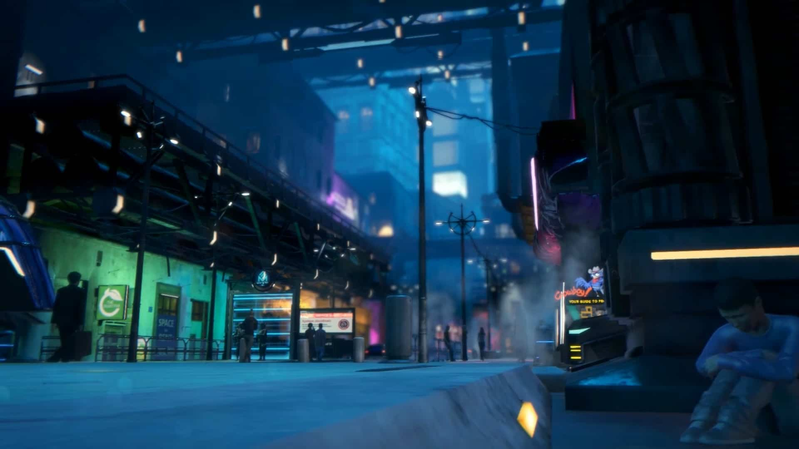
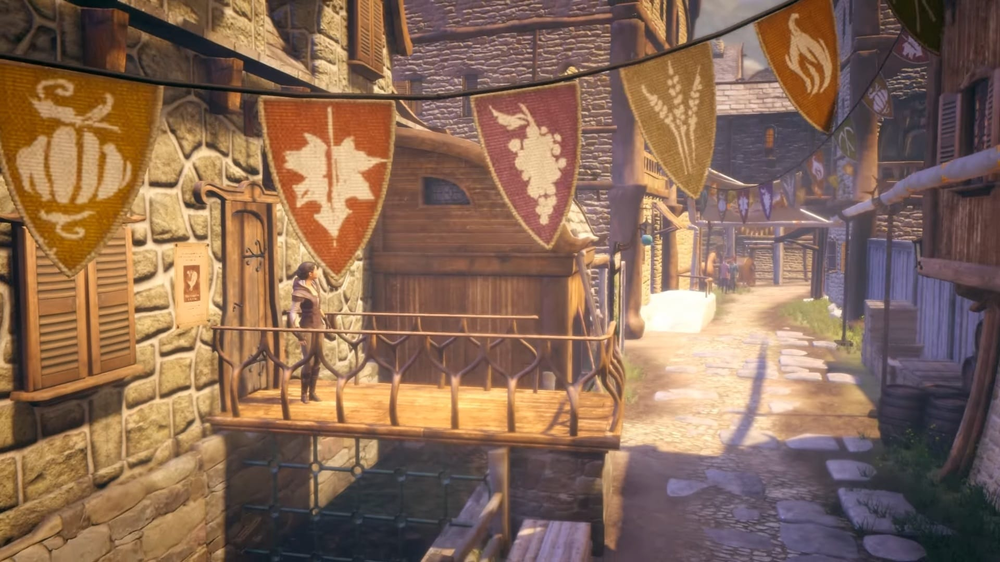
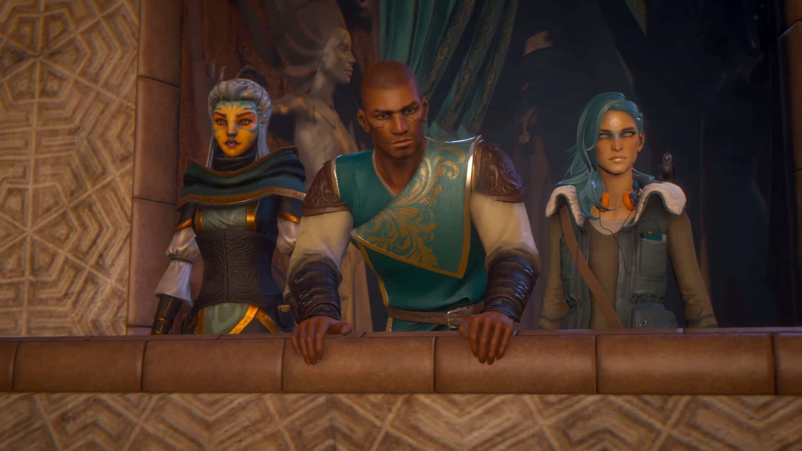
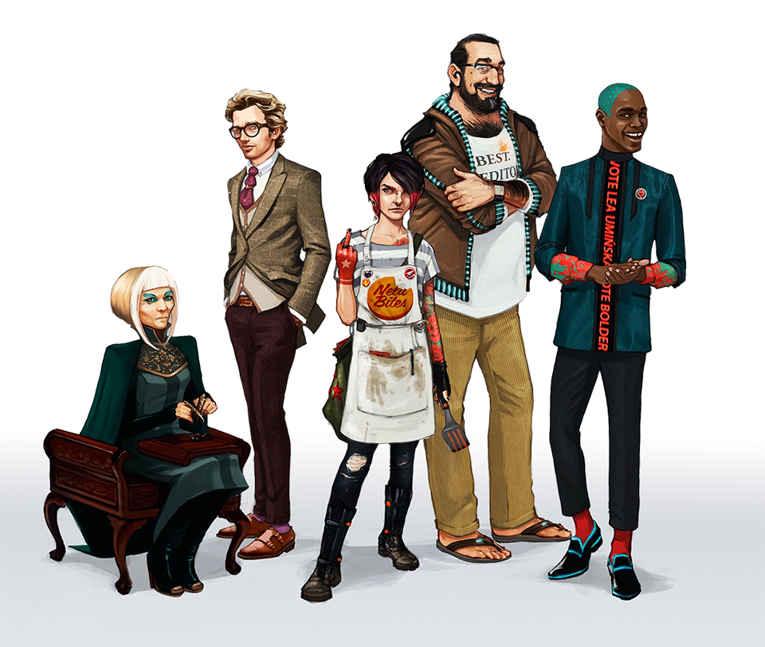

Aș fi vrut să scriu mai repede despre acest titlu dar adevărul este că mi-a luat vreo şase luni să îl termin. Cât privește timpul de joc efectiv, am petrecut vreo 23 de ore la cârma celor doi protagoniști, Zoe și Kian. La fel ca și cu precedentul, am rămas cu un gust la fel de amar și cu sentimente contradictorii.

Dar să revenim puțin la precedentul, Dreamfall: The Longest Journey. Pe acela l-am început de două ori, dar nu l-am terminat nici o dată. Mi-a scos peri albi. Surogatul de combat, grafica strict funcțională (nu ne referim la direcția artistică) precum și scriitura de tip M. Night Shyamalan cca 2006-2010 ar fi făcut din partea a doua a acestei serii un candidat serios pentru Hate Draft-ul de pe forum, dacă m-aș fi înscris să particip.

Din necesitate pentru această a treia parte, am urmărit un playthrough pe YouTube și m-am pregătit spiritual să revin în universul Stark/Arcadia, după ce jocul a primit și lansarea ultimului capitol din cele cinci programate, totodată fără să știu nimic despre el în prealabil.

Cinci, că de aia îi zice **Chapters**, realizate prin procesul de crowdfunding și lansate pe modelul Telltale, un model de afacere ce îmi displace profund.

Așadar, ce aduce nou **Chapters** pentru publicul (sper eu) matur, pasionat de genul adventure? Pe scurt, răspunsul este nimic. Pare a fi un joc făcut doar din dorința de a mai pune un număr în capătul seriei și nu se vrea a fi cu nimic mai presus decat antecedentul său. Să luăm lucrurile punctual.

S-a renunțat complet la combat, și aici bine au făcut. Ca să compenseze cumva, s-a introdus un du-te-vino nebunesc între tine, protagonist/ă și NPC-uri, preponderent în primele capitole, cu schimburi de replici uneori de o exasperantă platitudine. Locațiile sunt reduse la minim ca suprafață, majoritatea puzzle-urilor nici măcar nu mai sunt puzzle-uri, ci doar interacții cu diverse obiecte în urma cărora avansezi la următorul punct de dialog cu aceleași NPC-uri fade. Nu ajută nici faptul că aproape toate personajele au un obicei din a vorbi rar, apăsat și grav, transformând dialogurile în monumente de plictiseală cinematică.

Grafica este din nou funcțională și cam atât. Cred că trei sferturi din cadre sunt bune de wallpaper, dar când se pune totul în mișcare parcă ne întoarcem înapoi cu vreo cinșpe ani. Animații, gesturi, buguri grafice imense, totul pare la un nivel de bază de development, totul pare a fi făcut de începători în domeniu. Ca să fie complet, este unul din acele jocuri în care poziționarea și mișcarea perspectivei camerei devine și ea un mare deserviciu adus jucătorului. Personal, eu am servit versiunea pentru PC luată de pe Steam, și nu de puține ori mi s-a întâmplat să mă blochez în vreun loc și să nu pot avansa din simplul fapt că trebuia să fac highlight pe vreun obiect amplasat dubios, iar camera refuza cu orice preț sa ajungă pe mormanul ăla de pixeli dorit.

Dar astea sunt tehnicalități. Să zicem că trecem peste ele și că ne concentrăm pe personaje, poveste, atmosferă. Din primă fază vă pot spune că nu am fost niciodată fan al lui Zoe (si prea puțin al lui Kian, un caracter slab conturat încă de dinainte). Aici, în **Chapters**, post coma Zoe nu are vreo trăsătură definitorie în afara faptului că pare a fi tot timpul nemulțumită de relația cu prietenul său. Se dorește de la noi, ca jucători, să empatizăm cu ei, în condițiile în care personalitatea lui Reza (concubinul lui Zoe) nu ne este niciodată prezentată mai consistent decît „Eu sunt partenerul de viață al unui Dreamer/Shifter și, apropos, cred că sunt vegan”. Cu prima ocazie pe care am avut-o in game, am încercat să-i servesc omului niște caltaboș ca la mama acasă, poate poate se lecuiește de boală. Nu a mers. „The Balance has shifted”, mi-a zis jocul. Adică alegerea mea a contat și o să-mi afecteze relația cu băiatul.

Pentru că, surpriză, pe langă faptul că a fost lansat pe episoade, **Chapters** se dedică și el cauzei pierdute întru a încerca să forțeze gravitate prin introducerea unor acțiuni sau opțiuni de dialog ce vor avea repercusiuni în gameplay și poveste. Vă spun sincer că este un sistem introdus degeaba, schimbările generate de aceste alegeri ale jucătorului fiind pur cosmetice, deși jocul continuă să-ți bată apa în piuă cu fiecare ocazie cum că alegerile tale for avea cine știe ce importanță. Personal nu am simțit nici o diferență, totul a decurs pe un făgaș normal, șchiopătând spre un final prelungit artificial ca să poată justifica lungimea ultimului capitol.

Pauză.

Simt deja prea mult rant. A se observa că încă nu am evidențiat nici un plus al jocului, tot mergând pe ce nu mi-a plăcut. Există, totuși, și cateva puncte realizate decent. Primul ar fi dialogurile cu/replicile lui Crow. Experiența mea a devenit un pic mai puțin nefericită atunci cand Zoe a nimerit înapoi în Marcuria și a dat iar de prietenul nostru înaripat. „Banter-ul” pe care îl generează acest personaj este poate unul din punctele forte ale lui **Chapters**, acesta precum și ocazionalele fundaluri muzicale cu un intens impact emoțional, cel puțin până le auzi de vreo două-trei ori și ajungi la saturație.

Și atunci ce mi-a plăcut la acest joc? De ce am insistat să îl duc până la sfârșit dacă nu mi-a făcut cu ochiul aproape nimic la el, în afara de dorința obsesivă de a-l vedea dus la capăt? „Povestea, Zulu, cum e povestea?” veți întreba.

Păi, este aceeași abrambureală ca și în titlul precursor, cu un grad de ambiguitate la nivelul „Indigo Prophecy”. Spicuiesc pe alocuri „Undreaming”, „răscoala de la ’48 cu lupte între 5 NPC-uri”, ceva Azadi și distrugerea personajelor magice, primul PC din Arcadia, fanatici religioși care din cinci cuvinte scoase pe gură, trei se dovedesc a fi „light”, „goddess” sau „save”, femei care se aruncă în brațele lui Kian și alegi să le săruți că deh, așa-i frumos, să nu lași o domnișoară așteptând, apoi ele se răzgândesc pe motiv că nu-i momentul acum că e război, urmând chiar Kian să își aducă aminte și să declare în gura mare că e gay, în caz că nu știa nimeni până în acel punct.

Iar dacă nu ați înțeles nimic din fraza de mai sus, fiți fără grijă, nici eu nu am înțeles nimic din ce vrea jocul de la viața mea până târziu când mi s-a solicitat, din nou, că e nevoie mare de mine (noi, protagoniștii) ca să mai salvăm încă o dată universul. Cine mai exact declanșează această calamitate a rămas oarecum neclar, narațiunea debordând într-o multitudine de mașinațiuni de tip Game of Thrones care ți se prezintă toate în a doua parte a aventurii. Cert e că se presupune că tu ești printre cei buni, iar toți restul sunt din ăia răi.

Și închei aici, pentru că nu vreau să desființez jocul complet. Recunosc că singura secvență abordată cu tact a fost (nota bene) fix epilogul, adică vreo cinci minute de gameplay/cinematic făcut cu cap, cinci minute pierdute într-un ocean de mediocritate. Într-un univers în care ai exemplu de „less is more” și prezentare artistică de excepție prin multe alte părți (exemplu aleator - The Last of Us), existența lui **Chapters** nu mi-o pot justifica deloc, decât poate dintr-un orgoliu de a duce la capăt o scriitură care a început șchiopătând încă de pe vremea Dreamfall: The Longest Journey.

Cu tot respectul pentru originalul TLJ, din punctul meu de vedere clasat printre cele mai bune queste făcute vreodată, succesorii săi nu ar fi trebuit să existe niciodată în lipsa unei viziuni închegate de design.

Cum de altfel mi se pare ca este o situație identică și la cazul Broken Sword o dată cu trecerea la 3D. Unele lucruri pur și simplu nu ai cum să le îmbunătățești. ■

