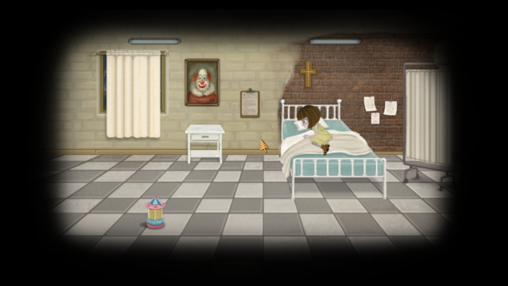
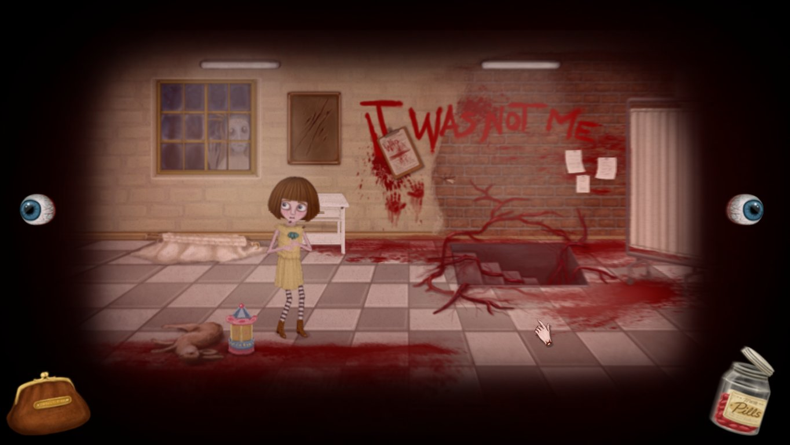
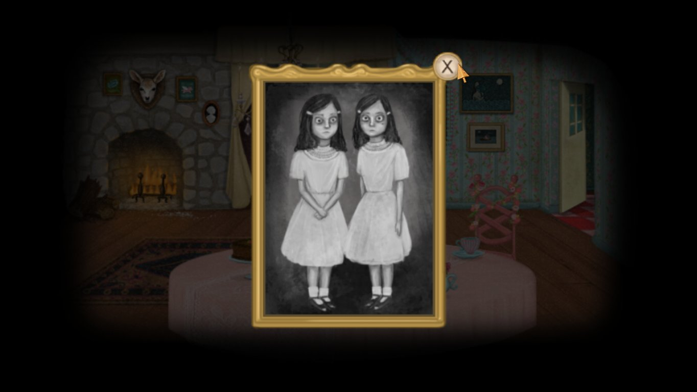
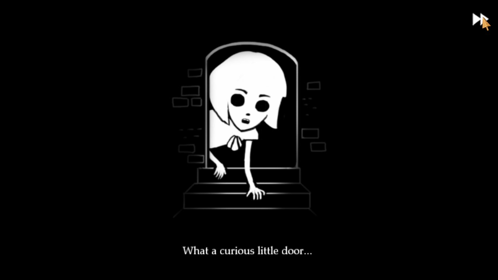

Trebuie să mărturisesc că nu sunt un mare fan la genului adventure. Cele câteva jocuri adventure ce le-am jucat ar putea fi numărate pe degetele de la o mână (Syberia, Broken Sword: Shadow of the Templars, Scratches și Beneath a Steel Sky), cu mențiunea că pe nici unul nu l-am terminat fără ajutorul unui walkthrough, fie din cauza imposibilității de a mai avansa datorită unui puzzle mai complex sau a nerăbdării personale de a vedea deznodământul. Cu toate astea am dus la capăt Fran Bow fără nici un ajutor exterior.

Fran Bow este un point’n’click adventure în cel mai adevărat sens al cuvântului preferând să urmeze școala Daedalic cu grafica smooth și cadre bine conturate în detrimentul majorității adventure-urilor indie care evocă prin grafica pixelată din clasicele genului apărute acum două decenii.

Fran începe să povestească întâmplările din noaptea fatidică în care părinții îi sunt omorâți cu brutalitate și modul mai mult întâmplător în care este găsită în pădurea din apropierea ospiciului fără prietenul ei drag, Mr. Midnight. Prezentarea este una simplă, câteva linii de dialog aruncate peste un fundal negru, contururile personajelor ca de cretă putând fi desenate chiar de Fran.

Imediat, fundalul se schimbă, Fran este întinsă pe un chaise longue în cabinetul doctorului Deern, repetând tot ce-i spusese și în celelalte sesiuni. Conversațiile între Fran și celelalte personaje vor avea întotdeauna două opțiuni. Opțiunile conversaționale din stânga vor aduce întotdeauna o contribuţie mai mare poveștii, aflând tot soiul de detalii despre o mulțime de lucruri. Opțiunile din dreapta vor scurta conversația la un nivel minim și evident prin asta pierderea unor detalii care uneori pot ajuta la rezolvarea unor puzzle-uri.

În urma unei scurte tatonări cu doctorul Deern asupra felului în care abordează problemele ei, este forțată de una din surorile medicale la îndemnul doctorului să ia niște medicamente. Imaginea se schimbă brusc, cabinetul se transformă într-un coșmar, iar Fran se trezește în rezerva ei hotărâtă să părăsească ospiciul să-și găsească pisica și să se întoarcă înapoi acasă la mătușa Grace.

La scurt timp după aceea, folosindu-și apriga curiozitate și intuiția reușește să pună mâna pe medicamentele din sertarzl sorei medicale încredințată că imaginile de coșmar ce le văzuse anterior o vor ajuta în a-și duce planul la bun sfârșit.

O dată ingerate, pilulele preschimbă realitatea lui Fran într-un adevărat coșmar, oferind pe lângă ușoarele indicii scrise în sânge pe pereții ospiciului, imagini grotești cu animale masacrate, schelete umane, orori trupești și uneori cu alterări arhitectonice. Asta este de fapt și una din mecanicile principale ale jocului. Player-ul va trebui să jongleze între cele două realități pentru a putea avansa.

Frapantă e totuși reacția lui Fran la aceste cadre, temându-se mai degrabă de modul în care ar reacționa sora dacă ar afla că atinsese cerbul decât de faptul că acestuia i-a picat capul.

O paralelă se poate face între Fran Bow și American McGee’s Alice. În respectivul joc player-ul intrat în pielea lui Alice se întoarce în Wonderland după ce părinții ei mor într-un incendiu, doar că Wonderland-ul în care se întoarce este o versiune deformată a ceea ce cunoscuse o dată din cauza noii suverane.

În manualul cu care venea însoțit jocul, doctorul ce o îngrijea pe Alice își nota progresul acesteia în realitate urmând îndeaproape firul narativ creat de mintea lui Alice și pe care-l urma player-ul. Fran Bow trunchiază și combină un pic jocul și manualul, preferând ca realitatea și coșmarul să se desfășoare în același univers.

Pe lângă asta mai există și alte similitudini. Ca exemplu, companionul lui Fran este pisica ei, Mr. Midnight petrecând marea parte a aventurii împreună, asemenea lui Alice și a lui Cheshire Cat, iar pentru o bună bucată de vreme Fran va duce în inventar un cuțit însângerat, cam la fel ca Vorpal Blade-ul lui Alice.

De-a lungul celor cinci capitole ale jocului, Fran va trece printr-o mulțime de locuri, de la ospiciul auster încărcat de lamentările îndreptățite ale micilor pacienți și cruzimea unor îngrijitori, la fantasmele nopții și insectele supradimensionate din pădure, la ținutul de basm Ithersta cu dragonul pufos Palontras și regele lor rădăcinos.



De altfel este o contradicție majoră între celelalte patru capitole și cel petrecut în Ithersta. E cam aceeași contradicție pe care am simțit-o în Undying, o dată ce am terminat cu Oneirosul în care domnea Keisinger și am trecut în Eternal Autumn a lui Bethany. Amenințările încă planau asupra mea, dar eram deja departe de hăurile Oneirosului.

Exact înainte de a intra în Ithersta, primești jurnalul lui Leon, într-un fel predecesor a lui Fran în care sunt detaliate și explicate toate creaturile și multitudinea realităților, suprapuse una peste cealaltă și existând în același moment de timp. Inițial am avut speranța că jocul voia să urmeze calea din Cosmosul lui Gombrowicz, fiind doar scrierile unui om ce încerca să-și raționeze propria schizofrenie, dând formă și ordine haosului din capul său, explicații ce puteau fi ușor acceptate de un copil. Îndoiala persistă însă până la final, neștiind în totalitate dacă tot ce s-a întâmplat a fost aievea. Cred că rămâne la latitudinea fiecăruia jucător să hotărască ce s-a întâmplat.

În Ithersta apare încă o schimbare a mecanicilor de joc, pilulele fiind înlocuite cu un ceas ce-ți permite să navighezi prin anotimpuri și e motivul pentru care am petrecut peste două ore încercând să rezolv problema unei lămâi și a unui chibrit.

Cred că a fost și singura dată când am rămas blocat pentru o perioadă atât de lungă încercând să dau de indicii care să mă ducă mai departe și ar putea fi și zona cu cele câteva probleme din tot jocul. Câteva din soluțiile propuse de mine au funcționat dar doar după ce am ajuns la momentul potrivit dictat de joc.

În rest majoritatea covârșitoare a puzzle-urilor sunt logice, puține iteme fiind transferate de la un capitol la altul, cu excepția pozei de familie, a jurnalului,a creionului colorat și a cuțitului care sunt aproape de la începutul jocului și până la final în inventar, așadar player-ul nu este determinat să încerce combinații din ce în ce mai puțin plauzibile. În afară de puzzle-ul de care ziceam mai sus, n-am avut nici un fel de probleme și cred că a fost singura instanță în care mă apucasem de pixel hunting, deși am făcut asta degeaba.

Un mic moment de panică am avut în ultimul capitol când mi-am umplut inventarul și am crezut că nu mă voi putea debarasa de iteme într-un mod folositor, dar asta a fost din cauză că nu fusesem atent la notițele lui Palontras.

În primele două capitole jocul excelează ca horror, cadrele macabre dau o senzație de ușoară greață și nesiguranță, se crează tensiunea și suspansul necesare acestui gen. Problema e că o dată ce realizezi că indiferent cum abordează problemele, viața lui Fran nu e amenințată în mod direct, tensiunea scade, iar trecerea din visul Itherstei înapoi în pădure nu mai au același efect ca la început. Poate și din cauză că o dată ce intriga se complică și sunt primite explicațiile necesare și curiozitatea e strunită.

Între capitole există și posibilitatea de a juca câteva minijocuri, care exemplifică drumul pe care l-a parcurs Fran de la o zonă la alta. Acestora li se poate da skip fără a impacta în vreun fel povestea.

Ca o mică paranteză, făcând tranziția din casa gemenelor în fântână și văzând copii plutind morți în apă mi-am amintit de Year Walk și faptul că atunci a trebuit să caut spiritele copiilor să le dau la Brook Horse pentru liniștirea lor.



Sunetul și imaginile se complementează excelent, contribuind imens la atmosfera generală a jocului, deși muzica se păstrează undeva departe în fundal și doar în vreo câteva instanțe întărind mai mult imaginile de pe ecran. Trecerea prin vălurile realității către acea parte macabră a ei e însoțită și de șoapte continue care nu știi dacă încearcă să comunice cu Fran sau sunt doar aduse de vânt. Nesiguranța și neîncrederea asupra a ceea ce vezi pe ecran apar și din cauza faptului că doar Fran e capabilă să vadă cealaltă dimensiune, deși aflată dincolo ea poate să treacă nestingherită pe lângă personajele care s-ar afla în mod normal în acea încăpere.

Opțiunile de conversație ale lui Fran sunt însoțite și de reacțiile fizice ale acesteia, un detaliu mărunt, dar care o umanizează într-o oarecare măsură dacă grotescul imaginilor nu reușesc s-o pună pe un făgaș al reacțiilor normale. Doar la începutul tranziției în cealaltă dimensiune, Fran se încovoaie și teama i se poate vedea pe chip. Pe partea cealaltă faptul că asistase la dezmembrarea părinților săi puteau să o desensibilizeze într-o asemenea măsură încât să nu se mai defazeze la fiecare cadru cu sânge.

Mi s-a părut totuși că povestea se complică în mod inutil spre final, unele elemente fiind forțate, cum ar fi apariția încă unui personaj în punctul culminant al poveștii care avea propriile interese cu privire la Fran. În schimb o parte din acțiunile lui Fran de pe parcursul jocului se răsfrâng la final de joc: în capitolul doi o putem vedea că este capabilă și de acte de violență deși mai mult împotriva voinței ei, la fel ca la începutul capitolului cinci când trebuie să elibereze o cheie pentru a afla adevărul.

Inconsistențele narative sunt de-a dreptul insignifiante și pot fi lesne trecute cu vederea întrucât e vorba de efortul unui studio format din doi oameni.

Probleme de ordin tehnic n-am întâlnit cu excepția faptului că în dimensiunea tangentă jocul încetinește foarte mult. Nu știu dacă asta a fost implementată în mod voit sau dacă e chiar o problemă ori un issue care m-a afectat doar pe mine. Nu e deranjantă decât dacă trebuie să petreci perioade foarte lungi în acea dimensiune, dar motive pentru a face asta nu există mai ales că trecerea dintr-o dimensiune în alta se face cu un simplu click.

Capitolele pot fi revizitate oricând o dată ce au fost deblocate, doar că jocul are obiceiul să facă o salvare automată așadar dacă nu vrei să străbați de la început capitolul curent ar fi preferabil să se evite o asemenea vizită până la finalizarea jocului.

În încheiere Fran Bow este un adventure excelent cu puzzle-uri logice, cu o poveste interesantă și un final enigmatic care ar merita să fie jucat de aproape oricine. Poate nu e chiar recomandabil pentru cine nu gustă macabrul, dar la fel ca Fran, ajungi să te obișnuiești cu el și după o vreme imaginile însângerate vor deveni normalitate. ■

> Notă: am preferat să păstrez imagini doar din primele trei capitole pentru a evita spoilerele de orice fel. Tot din același motiv nu mi-am expus nici toate problemele ce le-am avut cu finalul jocului, pe lângă cea pe care am expus-o în recenzie, și deși e un pic de spoiler pe acolo, oricine a trecut prin Alice ar putea să speculeze cam ce s-a întâmplat și în Fran Bow.