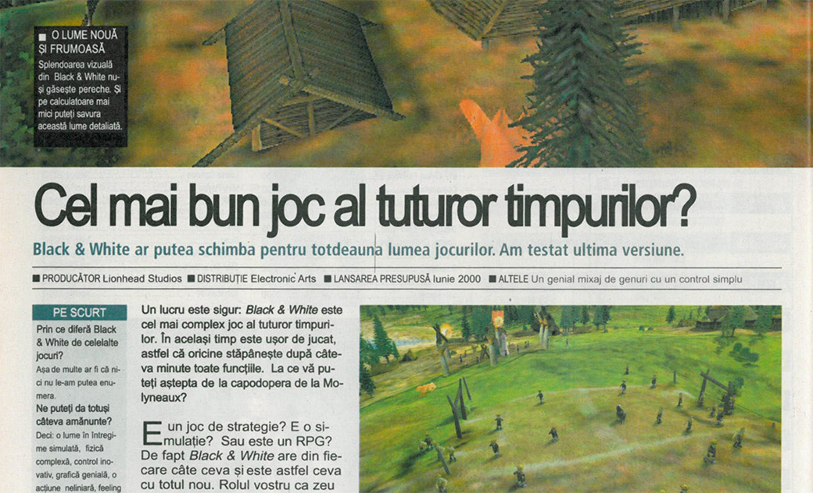

**Black & White** reprezintă suprema păcăleală a hype-ului, pompare de resurse financiare și PR-istice în promovarea unui produs care ajunge probabil să întreacă timpul și energia petrecute în construirea și rafinarea produsului ca atare. Sau cel puțin asta este impresia care lovește consumatorul, ceea ce este la fel de (dacă nu mai) rău.

Povestea B&W a început pentru mine odată cu prima coperta a PC Games (v-o amintiți, desigur), care aducea un suflu proaspăt în relativul prăfuit cotlon al peisajului autohton. Marea majoritate a articolelor erau traduse din sora mai mare nemțească și nu erau neapărat nici superb scrise, nici fericit transpuse în română, dar ceea ce mă făcea să palpit la noua revista era cantitatea nesimțită de informații despre jocurile în curs de apariție. Într-o vreme în care conexiunea la Internet se scurgea strop-cu-strop pe linia telefonică (dacă aveai acces și la aia), iar celelalte reviste româneșți aveau o politică de preview-uri relativ parcimonioasa, dacă nu de-a dreptul dubioasă, PC Games era mană căzută din cer pentru gamerul ahtiat după informație de ultim moment. De acolo am aflat prima oară de Commandos 2, Broken Sword 3 etc.

B&W era vârful de lance al secțiunii de avanpremiere din PC Games, în sensul în care revista se angajase efectiv într-un recital de acoperire a procesului de producție al jocului. Fiecare număr presupunea tone de detalii despre gameplay, exemple de quest-uri și misiuni, poze dintre cele mai edificatoare despre diverse feature-uri, toate stropite cu un strat gros de entuziasm (relativ artificial, aveam să observ mai târziu). Aveam chiar și un dev-diary ținut de unul dintre tipii de baza de la Lionhead. Ei bine, fastul orchestrat de Molyneaux și echipa, ranforsat voit au ba de redactorii germani, a fost preluat și convertit de cititorul-liceean destul de credul și exaltat care eram pe atunci într-un amalgam inform de așteptări, generic intitulat "Cel mai Cel joc al Istoriei."

Într-adevăr, B&W era vehiculul unor expectanțe difuze de fapt, însă toate superlative. Nimeni nu mai văzuse ce avea să ne ofere în curând Lionhead. B&W urmă să fie nu un god-like oarecare, abătând încolo și încoace niște amarate populații, ci adevăratul moment de Zeificare, un cadru digital în care puteai chipurile să faci ce îți trăznește prin minte, ajutat de Elemente și ghidat de propria-ți conștiință, un turnesol al moralității personale, un loc de joacă al puberului divin din tine, o simulare abrahamică, un Tamagochi/Sims de complexitatea unui Railroad Tycoon și cu farmecul de Worms.

Jocul în sine nu avea să împlinească niciuna dintre aceste promisiuni. Zeificarea avea să fie numai a marketingului, iar deșertăciunea numai a noastră, jucătorilor. Îmi amintesc că mi-l cumpărasem în preajma Paștelui. Între o salată boeuf și câte-un ciocnit de ouă, mă strecuram la calculatorul unde mă aștepta un tigru debil și urât, imaginea sufletului meu de Zeu. Încercam febril să identific elementele capodoperei, să deslușesc resorturile complexe de gameplay, să găsesc măcar lumea jocului vag plăcută cumva, estetic, grafic, oricum! Interfața era simpluță și cu toate astea enervant de folosit, misiunile crunt de banale și, pe deasupra, le cunoșteam din conştiincioasele rapoarte din revistă, progresul se poticnea în foarte evidente borne artificiale și era complet neinteresant. Luptele cu ceilalți zei erau o nebuloasă de care nu te atingeai mai degrabă din lehamite, iar lumea de joc părea sărăcăcioasă și fără sens. Jocul nu avea scop, trena, era banal și mediocru până la os.

Iar peste toate, plana ireversibil aerul înecăcios al deja-vu-ului. Da, sârguința cu care producătorul împărtășise dinainte detaliile cele mai intime ale procesului de producție nu făcuseră decât să devoaleze până și bruma de interesant pe care ar fi putut-o jocul oferi unui neofit. Mi s-a întâmplat același lucru, deși într-o măsură mai mică, în cazul Max Payne, dar asta este altă poveste. Practic, devorând fiecare articol și articolaş despre B&W jucasem jocul în mod virtual în capul meu, experimentasem la mâna a doua cam toate senzațiile (limitate) pe care le-ar fi putut induce, fusesem familiarizat cu conținutul misiunilor, îmi pusesem deja întrebările de bun/rău și asistasem în gând (ajutat de vorbele, pozele și filmulețele producătorului) la desfășurarea consecințelor în urma răspunsului meu. B&W în varianta în sfârșit materializată pe hardul meu era o copie palidă a tot ceea ce mi se povestise și arătase deja. Noul era consumat, surpriza anulată, inovația absentă, iar vârtejul hype-ului de-abia își formase primele rotocoale. ■