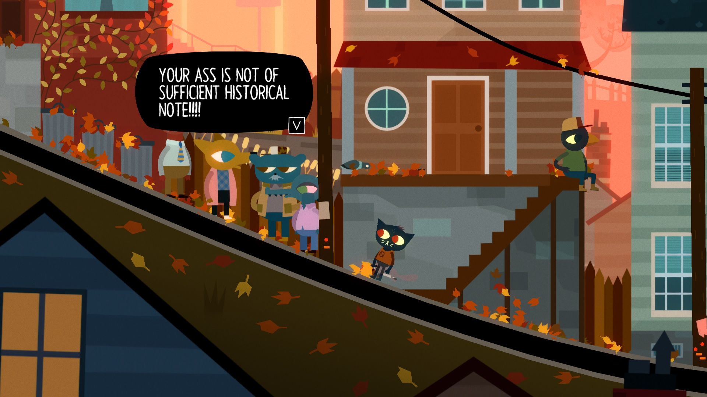
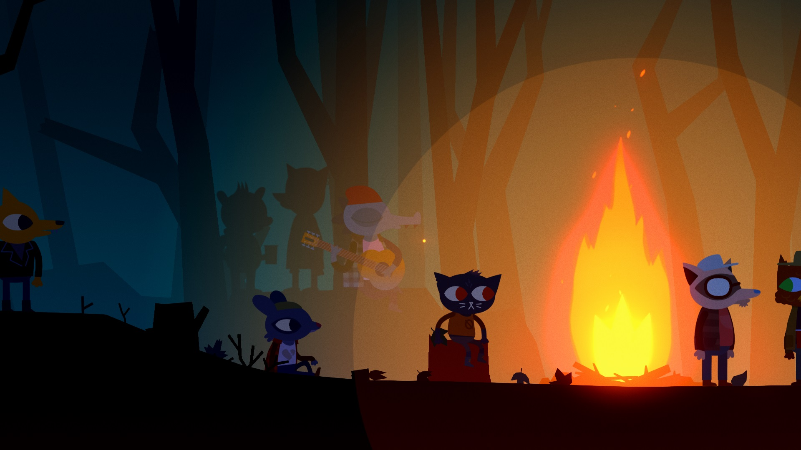
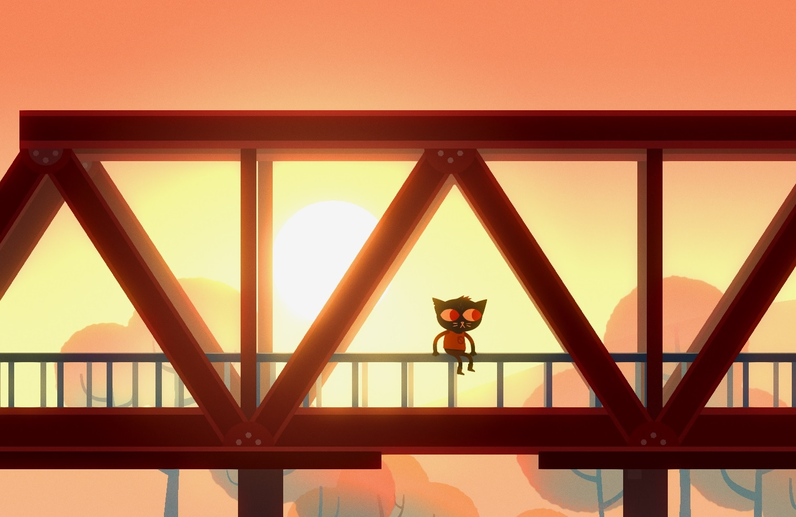

Să spui că scena indie aduce titluri bune în fiecare an e un lucru ce n-o să surprindă vreun butonator de tastaturi și/sau gamepad-uri ce-a descoperit internetul. O sumedenie de titluri grozave au ieșit din căpșoarele unor indivizi ce nu aveau în spate milioane de dolari. Menționez aici încă neterminatul Kentucky Route Zero și To The Moon, atât datorită apropierii față de jocul pe care-o să-l discut în rândurile ce urmează, cât și faptului că au un loc numai al lor în sufletul meu negru și mic. Night In The Woods, dezvoltat de studioul Infinite Fall, se prezintă ca un side-scrolling adventure 2D ce pune accentul pe atmosferă și pe latura narativă.

Pe parcursul jocului, controlezi și intri in pielea protagonsitei Mae Borowski, o pisică antropomorfizată, de douăzeci de ani, proaspăt reîntoarsă în orașul ei natal după ce ia decizia de a renunța la facultate. Urmează apoi o (re)familiarizare cu locul în care a crescut. Pe măsură ce Mae explorează și discută cu locuitorii lui, jucătorul descoperă din ce în ce mai multe detalii, încât, încet-încet, Possum Springs, orășelul ce găzduiește acțiunea, primește un portret cu foarte multe nuanțe. Aici, mă refer atât vizual, stilul grafic și uzul culorilor fiind excepțional, cât și la nivel de condiții de viață. Vieți simple, împinse alene de timp, ajung să releve puțină liniște, o împăcare cu monotonia vieții de individ apartenent clasei muncitoare dar și o serie de nemulțumiri de diferite facturi. Spre exemplu, înspre final, tatăl protagonistei aproape explodează într-o tiradă despre cum cândva, un loc de muncă acoperea toate cheltuielile necesare și permitea și accesul către puțină „viață” în afară, unde în prezentul acțiunii din joc, acesta abia reușește să mențină plătite asigurarea de sănătate și impozitul pe casă.

Temele sociale abordate sunt destule, pornind de la alienare, la statulul muncitorului, precum și percepția unui tânăr angajat asupra job-ului său. Prietenii protagonistei, un grup format dintr-o reptilă apatică la suprafață, o vulpe anarhistă și un urs radical ateu, își au propria abordare asupra lucrurilor. Unde Gregg, vulpea menționată mai sus, reușește să rămână în mare parte la fel cum era înainte ca Mae să plece la facultate, Beatrice, reptila, duce o existență mult mai îngreunată. Acest lucru este cauzat atât de factori ce țin de interior cât și de exterior. Per total, putem vedea în cele două personaje extremele axei pe care Mae se găsește, odată întoarsă acasă, la un capăt având responsabilitățile asociate vieții de adult, pe când la celălalt rămâne lipsa de griji și jovialitatea asociată copilăriei. Jocul permite jucătorului să facă alegeri în anumite momente ale poveștii, aceste alegeri implicând, uneori, actul de a petrece o noapte în compania unuia dintre cele trei personaje din gașcă, lucru ce oferă o doză de rejucabilitate.

Pe langă cei patru amici din grup, Mae poate discuta și cu alte persoane din oraș. Este interesant cum, pe măsură ce intri în discuție cu toate aceste personaje, Possum Springs prinde viață. Desigur, e o viață foarte docilă, însă, sub vălul de rutină, ceva pulsează, în mod clar. Scriitura reușește să mențină un nivel calitativ constant. Pe lângă asta, avem de-a face cu schimbări de ton, treceri de la dramatism la un ton umoristic și o doză sănătoasă de sarcasm. Acest element, cuplat cu uzul inspirat al culorilor pentru a amplifica anumite stări, sau a sugera drumuri și pericole, reușește să ofere imersiune completă pe parcursul celor 10-12 ore de gameplay.

Vorbind de gameplay, Night In The Woods are, în mod cert, o abordare mai light. În cea mai mare porțiune a timpului, jocul este un platformer destul de simplist. Ca să ajungi în locuri înalte, locuri ce pot găzdui personaje, obiecte sau alte lucruri ce o vor face pe Mae să spună câte ceva despre împrejurimi, trebuie să navighezi cabluri de înaltă tensiune, acoperișuri ale clădirilor și multe alte obiecte prezente în mediul înconjurător. Același principiu este folosit și în timpul secvențelor ce au loc în visele protagonistei, vise cu o tentă suprarealistă.

Când nu e platformer, Night In The Woods are bucăți ce includ puzzle-uri, repetiții cu trupa ce se desfășoară ca niște mini-game-uri scoase direct din Guitar Hero și, poate preferatul meu, un mini-game ce apare când încerci să furi câte ceva (un covrig, poate, cu care să hrănești niște pui de șobolani uitați într-o cameră dintr-un apartament abandonat), mini-game ce implică să stai nemișcat până când vânzătorul își ia ochii de pe tine. Când merge la culcare sau se trezește, Mae poate folosi laptop-ul propriu, ce-i oferă acces la conversații prin intermediul unei aplicații messenger si la un joculeț, Demontower. Demontower e un joc în joc, ce beneficiază de aceeași atenție la detaliu și calitate ca jocul din care face parte, fiind un dungeon crawler inspirat din era demult apusă și mai recent reînviată a pixel art-ului. Avem, astfel, de-a face cu un melanj de idei de gameplay luate din locuri variate ce reușește, alături de celelalte elemente, să mențină imersiunea jucătorului în lumea jocului. Chiar dacă, în esență, o jumătate de joc e petrecută plimbându-te prin aceleași locații, rutina aceasta rămâne doar în interiorul lumii jocului, nefăcându-se simțită în afara acesteia.

Pe lângă calitatea vizuală, dată de folosirea dibace a culorilor și de stilul grafic foarte curat, dar și cea auditivă, dată de o coloană sonoră originală ce i se potrivește jocului precum o mănușă, Night In The Woods reușește să pună în discuție niște probleme cât se poate de reale și care nu sunt rezervate doar unei potențiale părți ale Americii, ce probabil servește ca sursă de inspirație pentru micul orășel în care se petrece acțiunea. De nenumărate ori, m-am găsit identificându-mă cu personajele de pe ecran, resimțind senzațiile prin care trec acestea. Temele discutate ies din sfera socialului, înspre final, ajungând înspre religios și chiar cosmic, inclus fiind și-un mic tribut adus tătucii Lovecraft.

Night In The Woods m-a surprins într-un mod neașteptat de plăcut. Titlul reprezintă încă o dovadă că jocurile video pot fi o platformă legitimă pentru a prezenta și discuta situații și teme cât se poate de serioase. La fel ca To The Moon și Kentucky Route Zero, jocul se oprește asupra vieții duse de oameni simpli, nesfiindu-se de la a pătrunde în porțiuni mai puțin fericite ale acesteia. Cu o prezentare șlefuită și o lume foarte greu de ignorat, odata ce pătrunzi in ea, Night In The Woods e unul dintre cele mai emoționante și bine construite jocuri indie pe care am avut ocazia să le încerc. ■