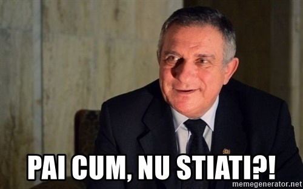

Da, motto-ul ăla este cel cu care vine jocul și este incredibil de precis. Rar atâta sinceritate de la un developer care ne-a mai oferit capodopere precum [History Channel: Civil War - A Nation Divided](https://www.youtube.com/watch?v=xWYdJQGiDFQ) sau întreaga serie de „simulatoare” de vânătoare sub numele Cabela something something Hunts 20XX. A, sunt și autorii minunatului [Soldier of Fortune: Payback](https://www.youtube.com/watch?v=JJ5hDW6RsPc) care zău că și-ar merita locul în vreo listă dacă nu ar fi un _low hanging fruit_ atât de evident.

Chaser este un joc... exasperant, dacă e sa fiu diplomat. Ironia face că în timp ce redactam asta am aruncat un ochi pe link-ul cu SoF: Payback și multe din ce spune australianul ăla despre joc se poate spune și despre Chaser. Diferența e că în Chaser lucrurile sunt mult mai grave, o doamne cum de am avut răbdarea să-l parcurg de la un cap la altul de cel puțin 3 ori? Triste vremurile fără conexiune la internet!

Să trec un pic în revistă partea cea mai răsărită din joc și anume povestea. Chaser a fost unul dintre puținele FPS-uri care a încercat să aiba o poveste mai acătării față de genericul "you guy with gun, door is there, kill bad guys" care împânzea genul în perioada aceea. Aici tu ești un individ cu amnezie vânat de toata lumea, lovit de flashback-uri bizare și pus pe descoperit propria-și identitate. Dacă mai adaug faptul că setting-ul e SF și multe din evenimentele importante au loc pe Marte devine foarte clar că aici avem de-a face cu o copie de Total Recall. Din păcate vorbim de o copie foarte palidă, jucată atroce de către niște actori de mana a 15-a. Sunt puţin tentat să fac mișto de animațiile personajelor din cutscene-uri, dar, ca să fiu sincer, cam toate jocurile din perioada aia ar stârni hohote de râs in prezent la acest capitol. Să nu uităm că abia după mai bine de un an Half-Life 2 şi FEAR revoluționau acest domeniu, iar aceste două jocuri au fost realizate de către niște developeri serioși, nu JoWood.

Așa că ajungem la miezul problemei mele cu jocul ăsta și anume level design-ul. În general când se spune că un joc e un "corridor shooter" termenul e folosit în mod peiorativ și în nici un caz în sens propriu, dar Chaser reușește performanța să bifeze la ambele categorii cu vârf și îndesat! Chiar dacă setting-ul se schimbă pe alocuri (ajungem și acolo, stați liniștiți!), structura fiecărui nivel este absolut identică în principiu. Coridoare nesfârșite te așteaptă fără excepție. Și nu orice fel de coridoare, ci d-alea împânzite cu uși care segmenteaza într-un mod de-a dreptul frustrant nivelurile. Acele uși sunt de două feluri, d-alea cu clanță sau d-alea cu un buton/keypad lângă ele. De ambele trebuie să te apropii la o distanță extrem de intimă pentru a putea să le activezi, iar de îndată ce le deschizi ele se închid automat in câteva secunde. Iar dacă apeși frenetic tasta de Use în timp ce se închid ușile, ţeapă!, trebuie să aștepți până ce animația lor de închidere se termină pentru a putea s-o redeschizi!

Vă trec transpirațiile citind paragraful anterior? Ok, vă propun un scenariu și mai frumos. Imaginați-vă că ușile pe care le poți deschide nu sunt exclusiv cele care te duc mai aproape de sfârșitul nivelului, ci mai sunt unele de care te apropii la fel de intim, apeși tasta Use la fel de suav, aștepți frumos să se deschidă precum toate cele 345231 care i-au precedat, intri într-un nou culoar, mergi ce mergi, te lipești de următoarea ușă, apeși Use și... nimic?!

Ah da, am uitat să vă spun că la fiecare ușă activabilă mai sunt alte 30 care arată absolut identic și sunt încuiate! Singura ta speranță pentru a evita să ajungi la balamuc e să fii într-un nivel cu uși cu keypads, că alea au un bec verde/roșu care-ți arată dacă-s accesibile sau nu. Nu de alta, dar ușile cu clanță nu au nici un indicator ca sunt descuiate sau nu. Sper să aveți memorie fantastică, pentru că jocul vă va pune să verificați toate ușile posibile, iar când veți face inevitabilul backtracking veți fi nevoiți să țineți minte fiecare ușă pentru a nu le lua la rând pe toate de mai multe ori. Apropo, mai știți ușile salvatoare cu keypads pe care le-am menționat mai sus? Ei bine, unele sunt inițial încuiate, dar le poți descuia apăsând un buton într-o altă parte a nivelului, iar jocul îți oferă extrem de rar indicii legat de care ușă e acum accesibilă. Nasol scenariul propus de mine, nu-i așa? Ei bine, așa-i jocul de la un cap la altul!

Level design-ul este cea mai masochistă forma de labirint - majoritatea culoarelor arată suficient de similar între ele încât să zici că-s identice, iar jucătorul parcurge nivelurile apăsând ca disperatul butonul de Use în speranța că nu ajunge într-o fundătură pentru a minimiza backtracking-ul. O ușă dintr-un nivel de pe la jumătatea jocului este efectiv o glumă sinistră. Când ajungi prima dată la acea ușă și o activezi face precum orice altă ușă încuiată, dându-ţi de înţeles că nu acolo trebuie sa fii. Dar ce nu știi de fapt e că pe partea cealaltă a ușii este o scândură de lemn care o ține blocată [!!!] și singura metodă de a o da la o parte este să ocolești tot nivelul pentru a ajunge într-o încăpere care-ți dă o fereastră de acces pentru a o împușca. Cât de prost să fii să nu te aștepți la o scândură într-un nivel în care nu vezi nici măcar o așchie de lemn, ha?!?!?! Prima oară când am avut de-a face cu nivelul ăsta am irosit ore întregi alergând ca bezmeticul prin nivel apăsând ca un disperat toate ușile în speranța că oi fi uitat eu să verific cum trebuie toate cotloanele. Ăsta este literalmente singurul moment din joc în care trebuie să distrugi un obiect pentru a putea deschide o ușă, așa că scândura-minune este una din cele mai sadice _curve balls_ în materie de game design pe care le-am văzut.

De asemenea, nivelurile sunt excesiv de lungi. N-o spun în sensul în care doresc să termin o campanie în 3 ore, dar în Chaser timpul îți este luat în bătaie de joc. Mergi pe culoare care nu se mai termină, apeși de nebun toate ușile si butoanele să vezi care-ți sunt accesibile, aștepți o sută de mii de ani să ți se deschidă leeeent de tot ușile, faci backtracking într-o veselie (și inamicii se respawnează, deci să nu vă așteptați la promenade prin nişte culoare golite pe deplin!) și tot așa. Pe la finalul jocului irosirea timpului tău a devenit un punct important de bifat pentru devi, pentru că acolo mergi înceeeet de tot cu un tren care meeeerge și meeeerge până când ajungi la o platformă, omori 2-3 inamici, mergi prin nişte culoare, apeși un buton, te întorci la tren și meeergi și meeergi... Și toate aceste lucruri cu una din cele mai râcâitoare pe creier muzici pe care mi-a fost dat să le ascult. Acum nu știu dacă muzica în sine e de vină sau asocierea psihologică e cea care-mi ridică tensiunea la auzul ei, dar să asculți aceeași melodie de 20 de ori în timp ce te chinui să termini fiecare nivel în mod cert nu e o experiență prea sănătoasă. Am băgat un search scurt la muzica din main menu și pană și aia mi-a dat flashack-uri din cauza a cât de enervantă poate să fie.

Setting-ul ar putea să fie interesant, până la urmă vorbim de un SF aflat într-un viitor nu foarte îndepărtat. Avem o navă spaţială, avem niște ghetouri, avem şi clasicele canale, avem un hotel japonez, avem o călătorie într-un port, prin Siberia și în final pe Marte, sigur nu poate să dea greș o asemenea selecție, nu-i așa? GREȘIT! Voi ați uitat de epoca în care singurele culori cunoscute de developeri erau negru și maro? Ei bine, nu căutați prea mult în memoria voastră pentru că Chaser are foarte mult negru și.... maro. Sunt o droaie de instanțe în care tot universul observabil jucătorului e compus din aceste doua culori până la nivelul la care inamicii sunt camuflați în fundal, pentru că și ei sunt compuși din negru și... maro.

Ce e amuzant la setting e cât de mult o dă jocul în bară în folosirea sa. Începi jocul pe o nava spatială, așa că tu, ca un gamer care traiește în Anno Domini MMIII, te aștepți la lasere, rocket launchers şi alte nebunii SF. Ei bine, nu, jocul îți dă frumusețea asta de armă:



Îi dau Cezarului ce-i al Cezarului, Chaser are multe arme care sunt bine modelate după cele reale. Din păcate aici se încheie lauda, pentru ca armele se comportă similar în prostia lor. G11 de exemplu are un recul perfect vertical care e aproape imposibil de controlat din cauza violenței cu care-ți sare crosshair-ul in sus. A, am zis crosshair? Neah, Chaser e prea șmecher pentru un concept atât de banal! De ce nu ai folosi mai bine un pătrat? Sau un T inversat? Auzi la el, crosshair, ahahahaa! Restul armelor au același comportament generic, sunet de rahat și zero satisfacție în folosirea lor. A, și dacă tot făcuse Max Payne senzație în perioada aia, slovacii noștri au decis să bage "adrenaline mode", care face același lucru ca "bullet time" doar că mult mai _lame_, nu tu gloanțe care zboară prin aer sau mișcări șmechere cu care să-ți execuți inamicii mai cu stil. Dacă sperai sa obții mai multă satisfacție împușcând în acest mod, ia-ți gândul.

Dar măcar inamicii sunt satisfăcători, nu-i așa? Nu? Ei bine, nici aici nu găsim vreo mină de aur. În fiecare nivel împuști aceiași inamici, singurul lucru care-i diferențiază e că de la nivel la nivel au alte skin-uri. De inteligență nici nu putem vorbi; atunci când nu se blochează prin niveluri (lucru extrem de probabil, apropo, grație unui pathfinding atroce), ei știu să facă doua chestii mari și late: să te împuște alergând înspre tine, sau să te împuște alergând în direcția opusă. Din când în când se ascund după un colț, sau și mai amuzant, după un stâlp gros cât o palmă. Pe lângă ăștia, AI-ul din Doom este de geniu, iar ăla a fost lansat cu mai bine de 10 ani înaintea lui Chaser. Jocul îți oferă şi nişte bătălii cu „boși”. Nu vă așteptați la Mecha-Hitler, vorbim aici doar de niște indivizi cu un skin diferit, dar care înghit de 'jde ori mai mult damage decât inamicii obișnuiți până crapă. Dacă ceilalți inamici sunt _bullet sponges_, boşii sunt _bullet sponges_ la puterea a 4-a.

JoWood ne-a obișnuit să ne servească castroane, iar Chaser nu e foarte departe de acest nivel. Poate că sunt eu excesiv de rău cu el având în vedere perioada în care a apărut, dar adevărul e că problema de level design este de-a dreptul elementară, până și Wolfenstein e mai bine gândit, iar ăla chiar a intenționat să fie labirint! Jesus Christ, câte amintiri reprimate mi-a trezit rantul asta. Fuck JoWood și fuck Cauldron pentru ca mi-au oferit această experienţă la ora 2 noaptea! ■