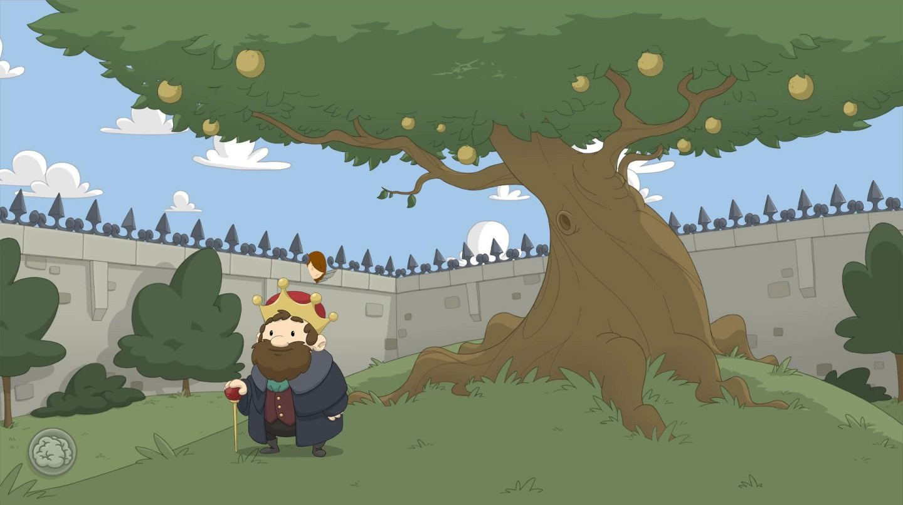
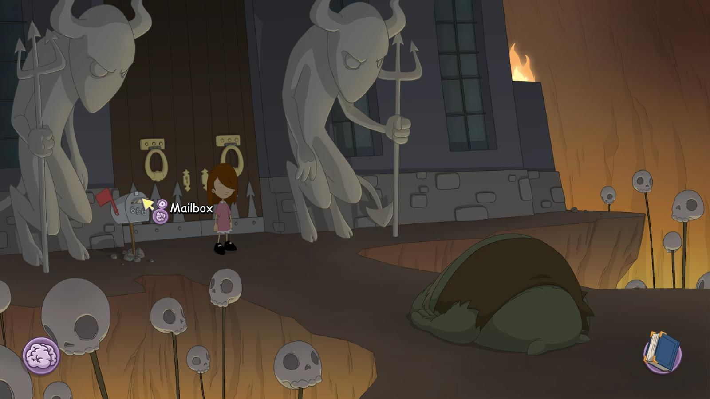
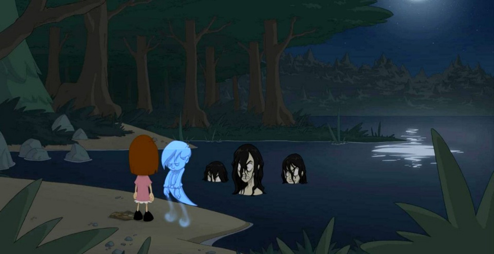

Experiența mea cu jocurile Daedalic este una dulce-amară. Multe dintre jocurile lor mi-au stârnit curiozitatea și m-au adus până în punctul de a le considera clasice doar ca să fiu, într-un final, dezamăgit. După finalul brusc și enervant al lui Chains of Satinav și unele decizii din al treilea Deponia, așteptările mele de la un alt joc Daedalic erau destul de mici. Astfel, am intrat în Anna’s Quest fără prea mari speranțe, pregătindu-mă pentru o inevitabilă dezamăgire. Mă bucur să spun că m-am înșelat.

Jocul te pune în pielea Annei, o fată de doar câțiva ani, nevoită să abandoneze siguranța căminului pentru a pleca în căutarea unui leac necesar bunicului ei. Acesta suferă de o boală gravă cauzată de blestemul vrăjitoarei malefice Winfriede. Scopul maledicției este de a o determina pe Anna să iasă din casă în căutarea unui leac și să cadă astfel în ghearele vrăjitoarei. Conflictul dintre cele două este elementul central al poveștii. Winfriede încearcă, în repetate rânduri, să o captureze pe Anna. La început o prinde pentru a se folosi de puterile ei latente de telekinezie, dar Anna va reuși să scape. Mai târziu, Winfriede încearcă doar să o elimine, abilitățile descătușate ale Annei fiind un pericol pentru planurile ei de stăpânire a regatului.

Istorisirea începe cu o carte de povești și vocea unei naratoare, peste filele goale ale cărții așternându-se desene din care ia naștere lumea jocului. Acțiunea se petrece într-un regat de basm unde creaturile fantastice și magia sunt la ordinea zilei. Imaginarul ținutului este subliniat și de felul în care arhitectura medievală se îmbină cu unele elemente de tehnică modernă, cum ar fi, de exemplu, orașul Wunderhorn, în care antenele-satelit se îmbină natural cu construcțiile în stil gotic. Alt exemplu ar fi închisoarea cenușie din infern, aceasta fiind deosebită prin aspectul de fortăreață, în care sobrietatea dată de statuile închinate diavolului este contra-balansată de umorul subtil al birocrației ridicole moderne.

În această lume putem întâlni dragoni, goblini sau fantome, fiecare cu nevoile lor și puterile lor, care vor ajuta povestea să progreseze. Locațiile, deși viu colorate, respiră un aer de melancolie, ce răzbate din țelurile neîmplinite ale personajelor sau traumele pe care le-au suferit în trecut. O fantomă își poate regreta iubirea pierdută, un goblin temnicer nu este mulțumit de postul său în ierharhia închisorii, iar exemplele pot continua. Dintre aceștia, fantomele mi s-au părut cele mai interesante. Sunt entități care nu-și pot găsi pacea, apărute în urma suferinței și a crimelor cauzate de Winfriede, iar împăcarea lor cade pe umerii Annei. De exemplu, la începutul jocului, Anna trebuie să reunească doi iubiți deveniți fantome pentru a le reda liniștea. Odată regăsiți, aceștia o vor ajuta pe Anna să evadeze din casa lui Winfriede în care fusese închisă în prolog.

Anna este o fată dornică să ofere ajutor celor care au nevoie, inclusiv unor personaje care se vor dovedi malefice. Nevoită să treacă peste provocări diverse, de la evadarea din închisoare la salvarea reginei regatului, Anna își păstreză mereu bunătatea și încrederea în oameni. Pe parcusul aventurii ea va întâlni diverși tovarăși de drum. Aceștia acționează după mecanica clasică a jocurilor adventure în care trebuie sa îi ajuți ca să poți avansa, dar personalitățile lor sunt bine conturate și devin personaje adevărate, nu doar simpli pixeli care să te dirijeze în joc. De exemplu, alături de tine vor fi ursul Ben, un ursuleț de pluș înăuntrul căruia se află sufletul unui băiețel, închis acolo de Winfriede, precum și vulpea șireată Reynard. Doar că ei se poartă oarecum diferit față de cum ne-am aștepta. În ciuda înfățișării de urs a lui Ben, acestuia îi lipsește curajul, iar Reynard se folosește de viclenie pentru a o ajuta pe Anna, fiind un prieten loial, deși vulpile sunt considerate în poveștile clasice că își urmăresc propriile interese.

Nici Winfriede nu este un _villain_ unidimensional, ci ascunde o poveste tragică pe care o vei afla pe măsură ce avansezi în poveste. Vei realiza astfel că istoria ei este conturată de o permanentă luptă împotriva sorții inevitabile, precum și de suferință și decădere.

Grafica din Anna’s Quest este una minimalistă, spre deosebire de celalte jocuri Daedalic, încărcate de detalii. Stilul evocă naivitatea și inocența tipice copilăriei, aducându-mi aminte de Over the Garden Wall*, un frumos serial animat despre maturizare.

Jocul reimaginează basme germanice și nordice peste care aruncă culori moderne, jucătorul întâlnind astfel referințe la povestea Cenușăresei sau la mitul germanic al „Doamnelor Albe”, Weiße Frauen. Acestea din urmă sunt spirite protectoare ale unor comori și pot să apară în feluri diferite. În Anna’s Quest sunt femei înecate în lacul Wunderhorn care păzesc un obiect necesar pentru leacul bunicului. Doar sunetul de vioară le poate calma, ceea ce adaugă poezie jocului și duce la puzzle-ul meu preferat din joc. Cum Anna nu știe să cânte la vioară, ea trebuie să „împrumute” una fermecată dintr-un anticariat. Pentru a rezolva acest puzzle va trebui să găsești o modalitate de a lua acea vioară fără ca anticarul să-și dea seama, intrând astfel într-un șir de puzzle-uri pe care vă las să le descoperiți singuri.

Din punct de vedere al mecanicilor de joc, puzzle-urile sunt mai ușoare față de alte jocuri Daedalic, iar sistemul de telekinezie se integrează natural în gameplay. Există diferite momente în care Anna trebuie să schimbe forma unui obiect sau să rupă o încuietoare, iar telekinezia vine în ajutor. Totul este foarte bine șlefuit, de la interfață la animațiile personajelor. Trecerea în inventar se face foarte fin, dintr-un simplu click sau scroll de mouse, existând și opțiunea de a afișa lucrurile de interes prin simpla apăsare a tastei space.

Jocul strălucește și pe partea sonoră, nu doar grafică, atât voice acting-ul cât și muzica reușesc să atragă jucătorul într-un univers magic, chiar dacă calitatea mai variază. De exemplu, dialogurile vorbite devin uneori puțin cam sâcâitoare din cauza unor replici forțat juvenile, însă, pe de altă parte, am petrecut mult timp ascultând melodia îndurerată, dar plină de speranță, din casa bunicului.

Astfel, pe parcursul jocului, se derulează o poveste tragică despre mândrie și pierdere, în cazul vrăjitoarei, și bunătate necondiționată în cazul fetiței. Anna’s Quest a devenit jocul meu preferat de la Daedalic prin personajele superb scrise, inovația de gameplay adusă de telekinezie și scriitura captivantă. Îl recomand nu doar împătimiților genului adventure, ci și oricărui pasionat de jocuri care vrea o poveste umană, emoționantă. ■