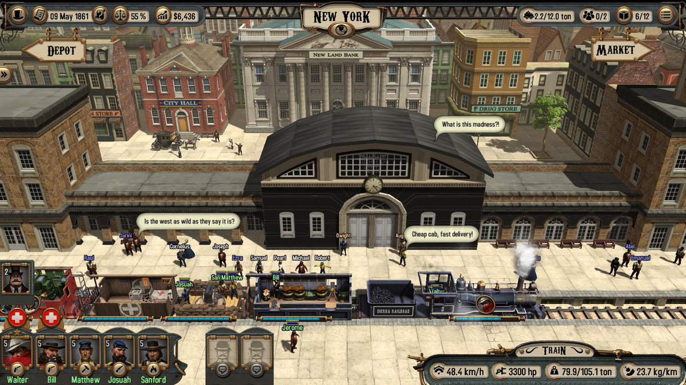
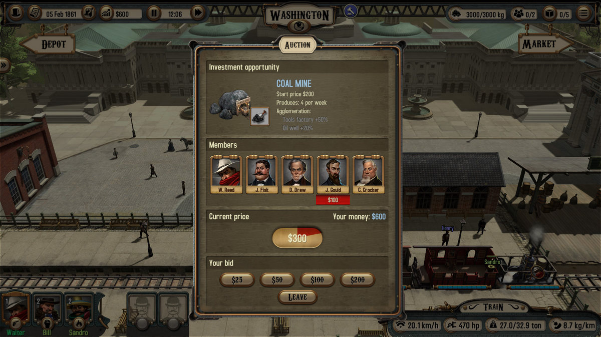
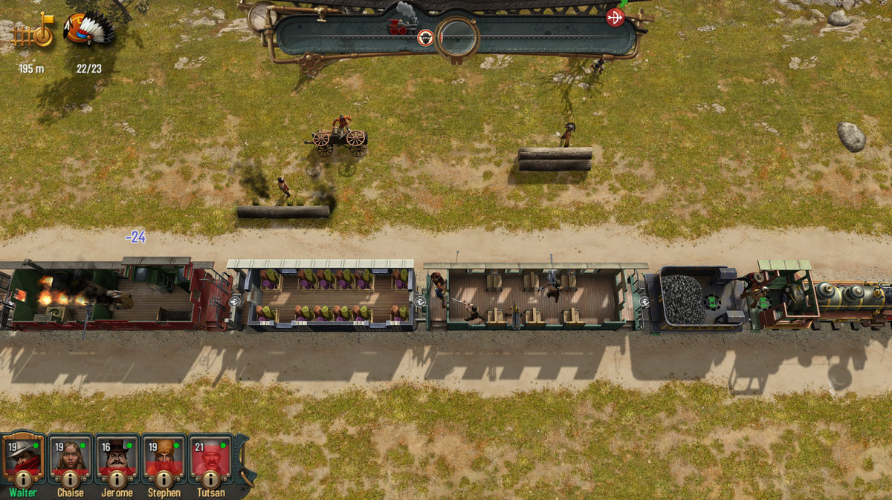

Am o prietenă care îmi tot zice că sunt hater, că nimic nu-mi place. Eu îi răspund că nu-s, doar am standarde înalte.

În cazul de față, aceste standarde înalte se traduc prin faptul că dacă nu vorbeam cu Cristan că o să scriu despre joc, nu aș fi dus niciodată Bounty Train până la capăt, darămite să mă mai chinui și cu un DLC. Nu mă înțelegeți greșit, jocul nu e rău. Acum vreo 10 ani ar fi fost considerat probabil chiar bun. Însă pentru un titlu lansat în 2017, ce a primit conținut suplimentar acum vreo 2 luni, oferta e parcă prea săracă. Nici măcar raportul cantitate/preț nu e bun la cei 25 de euro (+5 pe DLC) ceruți.



Dar să încetinesc puțin, căci se pare că am sărit la concluzii din primul paragraf, fără să povestesc vreun pic despre jocul în sine. Povestea te aruncă în bocancii unui oarecare Walter Reed, fiu risipitor, întors în America pentru a scoate un ban de pe urma morții lu' ăl bătrân. Vedeți voi, taica Reed era un partener important într-o mare firmă de transport feroviar, aflată în fruntea valului de antreprenori ce dezvoltau rețeaua de trenuri de pe continent. Walter al nostru nu prea se încurcă cu așa ceva, vrea doar să vândă ce i-a lăsat taică-său și să-și vadă de treburile lui.

Iată însă că un vechi prieten și partener al lui Reed Sr. îl convinge să plece în misiunea contra-cronometru de a strânge 51% din acțiunile firmei în cauză, pentru a-l împiedica pe archnemesis-ul lui taică-său să facă mânării cu construcția spre vest a căilor ferate.

Asta e premisa poveștii. Nu e strălucită, fără să fie de lepădat. Faptul că ești practic într-o cursă în doi pentru a deveni acționar majoritar adaugă un element bine-venit de „vivacitate”. Ești tot timpul în mișcare, fugind de la un oraș la următorul, încercând să convingi pe unul sau pe altul să îți vândă ție acțiunile și nu oponentului. În plus, Bounty Train îți oferă și posibilitatea unui joc liber, în care nu ești constrâns de quest-ul principal. Rejucabilitate++.

Mă rog, nu chiar. Mi-a luat aproximativ 27 de ore să-l termin – cu tot cu DLC-ul **New West**– și cam pe la a 12-a, 13-a oră deja descoperisem cam tot ce se putea și mi s-a tăiat cheful. Asta cred că e marea problemă a jocului. Începe promițător și dă senzația că are o profunzime ce urmează a fi descoperită treptat. Din păcate nu e așa. Te prinzi rapid de activitățile pe care le poți întreprinde, iar apoi le repeți tot restul jocului, fără vreo mare diversificare.

Pff, cred că într-adevăr sunt hater, căci nu reușesc să zic nimic de bine de jocul ăsta, chit că sunt câteva aspecte pozitive. În primul rând, prezentarea – pe jumate. Bounty Train nu e cel mai arătos joc, dar are un aer vintage, cerut și de poveste, care îl face cumva plăcut ochiului. Meniurile și personajele sunt frumos desenate, există o oarecare atenție la detalii, aparentă mai ales la trenuri și la orașe, și, mai ales, nu e nimic care să te zgârie pe retină. Iar asta e o reușită, având în vedere că texturile sunt șterse și că lumea jocului e mai mult pătrățoasă. Jumătatea cealaltă a prezentării e partea sonoră, cu o muzică fadă și repetitivă, plus ceva zgomote ambientale aruncate pe acolo.

Realizez acum, ajuns la jumătatea recenziei, că nu am menționat adevăratul selling point al jocului: Bounty Train nu e un train simulator după cum s-ar putea crede. Trenurile sunt un mijloc de transport și punctul central al poveștii, dar avem de fapt de-a face cu un trading simulator cu elemente de RPG și real-time tactics. Mi-a adus pe undeva aminte de Expeditions: Conquistador, mai ales că poți să omori la fel de mulți indieni hue hue.

Combatul e foarte asemănător cu Desperados, dar mai slab prin faptul că se desfășoară tot timpul în combinația tren vs. inamici staționari sau călare. Ai puști și pistoale, arcuri și grenade, iar în fazele mai avansate și gatling guns și un fel de tun. Mai adaugi câteva skill-uri și pseudo-clase (healer, tank, sharpshooter, engineer) și parcă începe să sune bine. Aruncă unul cu o grenadă în tren și îți ia marfa foc, sau ești urmărit de indieni și îi dai... abur să scapi, thrilling stuff, western în toată regula. Dar din nou, de la un punct încolo devine repetitiv.

Ai un party format din personajul principal (Walter Reed) și diferiți indivizi pe care îi aduni de prin gări, contra unei sume de bani (rar și gratis). Poți să ai maxim 5 (tu și alți 4) în tren în același timp. Treaba cu trenul e că în timpul bătăliilor nu poți să cobori din el, ceea ce limitează serios posibilitățile tactice. În plus, clasele și skill-urile au relevanță doar aici. Cred că doar skill-ul de trading e folosit pentru prețuri mai bune la piață.

Odată angajați, companionii rămân alături de tine pentru tot restul jocului, dar nu interacționează în vreun fel cu povestea sau cu alte personaje. Doar apără vagoanele și în funcție de anumite skill-uri conduc trenul mai bine în timpul bătăliilor ce au loc din mers (unele sunt statice, când trenul e blocat pe șină de un obstacol, iar în altele ai opțiunea să încerci să fugi, caz în care trebuie să conduci trenul și ești urmărit de inamici călare), pot să îl repare sau stingă focul, or să vindece ceilalți membrii ai party-ului (majoritatea celorlalte skill-uri au legătură cu combat-ul).

Partea de questing stă ceva mai bine, poate punctul tare al jocului. Quest-urile sunt în mare de 3 feluri: main story (aka adunat de acțiuni de la diverși), misiuni secundare și trading quests. Aici parcă e diversitate, mai ales că harta e populată de 4 facțiuni opuse între care trebuie să jonglezi și care îți oferă diverse bonusuri dacă le ești prieten.

Apropo de facțiuni, două dintre ele sunt Nordul și Sudul american (celelalte două fiind bandiții și indienii), pentru că acțiunea jocului are loc în perioada Războiului Civil. Astfel, primești tot timpul update-uri despre diverse evenimente istorice ce au loc și ce afectează subțire acțiunea jocului, în ideea în care prețurile scad sau cresc pentru un anumit produs, există o cerere mai mare sau unele dintre ele sunt considerate contrabandă. Altfel însă nu ești afectat cu nimic de ceea ce se întâmplă în jurul tău. Mare păcat, având în vedere că nu prea găsești jocuri care să se petreacă în timpul unui război și care să NU te pună în pielea unui soldat/comandant militar.

Mai notez o ultimă critică negativă, după care promit că termin pe o notă pozitivă. Acum ceva vreme când am început noi să scriem articulușe ale comunității, ziceam de Expeditions: Conquistador^[A ieșit Expeditions: Viking între timp și se aude că ar fi mai bun decât primul. Stay tuned vreo 2 luni și o să scriu și despre el:)] că sunt foarte dezamăgit de partea de dialog și interacțiune cu membrii echipei și personajele din universul jocului în general. Ei bine, Bounty Train face un pas în plus în direcția greșită în ideea în care nu îți permite să comunici în vreun fel cu membrii echipei, iar dialogurile se limitează la a selecta singura opțiune de răspuns disponibilă. Cred că ar fi fost unul dintre jocurile mele preferate dacă pe partea asta ar fi fost bine construit, pentru că exista potențial cu căruța (vagonul?). Nu înțeleg jocurile astea care aruncă acolo o fărâmă de RPG, parcă să dea bine la CV. La Bounty Train scuza ar fi fost că primează partea de trading, combat-ul or trenurile în sine, dar și acolo e prea puțin.

P.S. înainte de concluzii: nu știu dacă asta spune mai multe despre mine sau despre joc, însă partea pe care urmează să o scriu despre trenurile din joc e adăugată după ce am scris restul recenziei. Am uitat complet de ele! Din păcate nu sunt prea multe și nici prea diverse ca utilitate. Sunt vreo 8-9 locomotive, câte 3 variante din vagoanele de călători, marfă și cele ale echipajului, plus câteva suplimentare, gen vagon medical și unul ce cară un tun. Poți să le faci câteva upgrade-uri pur tehnice, ce nu le schimbă înfățișarea, și în timp se strică și devin din ce în ce mai uzate până când ești nevoit să le vinzi după ce le-ai rulat câteva zeci de mii de kilometrii. Iarăși prea puțin, mai ales în condițiile în care prima parte a jocului mi-am petrecut-o așteptând cu nerăbdare să văd ce alte tipuri de vagoane pot să adaug colecției.

Of, am promis că termin pozitiv. Fie! Pentru un gamer casual (mamă, zici că eu sunt marele gamer – vedeți ce zice mai jos în descrierea mea) Bounty Train e o alegere bună. Gameplay-ul, dacă nu e foarte profund, e solid – atât cât îți oferă. Nu sunt bug-uri, learning curve-ul e foarte lin și e cu trenuri ffs. Ce să vrei mai mult de atât? Sunt sigur că a fost și o să mai fie prin bundles, iar dacă îl prindeți acolo și vă plac trenurile și western-urile, puteți să pierdeți câteva ore bune într-un mod relaxant și deloc complicat. ■
