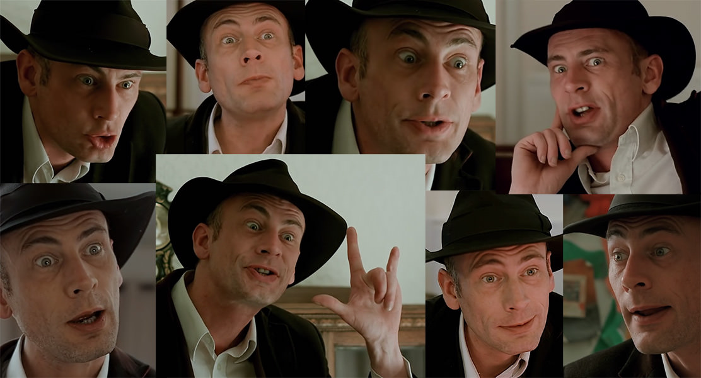

Văzându-l pe Northernlion luându-l la puricat recent, am decis să încerc şi eu Contradiction: Spot The Liar!, iar dacă tot l-am terminat m-am gândit că nu i-ar strica un mic review aici. Jocul lansat de Baggy Cat în 2015 este un FMV detective adventure game finanțat parțial de o campanie pe Kickstarter de dimensiuni nu foarte impresionante, numai 4500 de euro. Căutând mai multe detalii despre companie nu am găsit mare lucru, Contradiction fiind singura lor producție notabilă.

„Detective adventure” este un gen cu care eu personal nu am avut foarte mare contact în trecut, dar după cum bine se știe niciodată nu-i prea târziu să încerci lucruri noi. Așa că sunt sigur că voi pierde din vedere destule lucruri pe care veteranii acestui gen le vor cunoaște, însă în același timp perspectiva mea când am pornit jocul a fost una destul de _raw_, neinfluențată de realizările competitorilor săi. Așadar, haideți să vedem de ce e în stare Contradiction. Spoiler-free, apropo.

<iframe src="https://player.vimeo.com/video/132201028" width="640" height="360" frameborder="0" webkitallowfullscreen mozallowfullscreen allowfullscreen></iframe>

Jocul te pune în ghetele inspectorului Frederick Jenks, care este trimis într-un mic sătuc englez pentru a investiga aparenta sinucidere a unei tinere care a avut loc recent. Desigur nimic nu este ceea ce pare și, pe parcursul investigațiilor tale, vei descoperi că ceva este putred în Albion. Dacă această premisă vă sună a Midsomer Murders, ei bine nu doar că aveți părinți sau bunici lipiți de televizoare, dar veți avea și perfectă dreptate făcând această prezumpție. Întru îndeplinirea misiunii ți se pun la dispoziție un carnețel, un inventar ocupat inițial doar de fotografia femeii și permisul ei de conducere și niște pantofi numai buni de luat la pas acest decor rustic pentru a căuta răspunsuri. Având în vedere ca este FMV (Full Motion Video), Contradiction este integral filmat cu actori reali, toate conversațiile și acțiunile personajelor fiind interpretate de către aceștia, iar peisajele sunt filmate și nu desenate. Singurele efecte adaugate sunt un filtru albastru pentru simularea „nopții”, care arată destul de urât, și cel care simulează luminile aprinse după apusul soarelui, ambele cauzate de faptul că totul a fost filmat pe timp de zi.

Pentru parcurgerea satului, jocul oferă un set de locații prin care ajungi apăsând tastele direcționale, oarecum similar cu vechiul Myst. Suprafața pe care o parcurgi nu e foarte mare, dar de-a lungul periplului tău vei fi nevoit să faci mult du-te-vino. Din fericire, producătorii au avut înțelepciunea să-ți pună la dispoziție o hartă cu care să faci fast travel pe străzi (deci tot manual trebuie să intri în clădiri). Înainte să sară puriștii călătoriilor pe rute scenice, vă anunț că nu e nimic de pierdut aici. Oricum vei culege toate dovezile de care ai nevoie la prima parcurgere manuală a întregului sat printr-un mecanism foarte complex constând în apăsarea unui buton și privirea unui mic cutscene cu Jenks furând orice îi iese în cale (serios, omul n-are nicio jenă; și mai bizar e că posesorii acelor obiecte n-au nicio intenție să și le ceară înapoi atunci cand i le prezinți într-un interogatoriu). Și, pe deasupra, daca e să ai de-a face cu un eveniment scriptat (de exemplu, îl întâlnești pe unul pe o pajiște și obții de la el un obiect important) într-o secțiune care-ți era prin drumul la care făceai fast travel ești dus acolo. Un moment amuzant a fost însă când mergi la cotrobăit prin sera unei mici ferme numai ca să ți se spună apoi că mai e o a doua seră care ți-era inaccesibilă până la această conversație... deși era la doi metri de cealaltă seră! Din fericire momentul ăsta a fost singular, așa că sistemul merge așa cum trebuie în principiu.



Dar, și un mare DAR, jocul are o problemă extrem de enervantă. Absolut fiecare cutscene din joc nu poate fi sărit cu excepția revederii unor dialoguri anterioare. Nu vă temeți, nu sunt genul de om care sare peste tot dialogul și trece la gameplay pentru că în contextul ăsta nu e vorba de așa ceva. Nu dragilor, ai parte de un cutscene la fiecare mișcare pe care o faci pe străzi, sau la intrările în clădiri, bătut la uși și porți pentru a iniția conversații! Și, deși după prima întâlnire cutscene-ul este scurtat, tot este excesiv de lung. O clădire importantă pe care trebuie să o tot vizitezi are 4 încăperi pe care trebuie să le parcurgi până la inițierea dialogului, fiecare cu animația sa pe care n-o poți scurta și fără posibilitatea de a te duce direct la omul cu care tot ai treabă pe acolo. Inițial este o experiență simpatică să te pui în pielea personajului principal pășind pe străzi și străduțe, dar având în vedere cât de des trebuie să te fâțâi de colo-colo, treaba devine repetitivă extrem de repede.

Principalul mecanism este abilitatea de a interoga oamenii cu privire la obiectele pe care le găsești sau la temele mai importante de discuție care-ți devin disponibile pe măsură ce descoși ițele. Deși există un mecanism de folosire a obiectelor dintr-un inventar care devine relativ voluminos pe parcursul aventurii, nu există prea multe momente în care chiar te folosești de el pentru a interacționa cu lumea din jurul tău. Însă cea mai importantă unealtă pusă la dispoziție este cea care dă titlul jocului, contradicțiile. Pe parcursul anchetei tale vei strânge un număr consistent de declarații de tot soiul, dar singura metodă de a-i prinde pe oameni in offside este să le atragi atenția că nu tot ce ți-au spus se potrivește cu restul. Pentru a face acest lucru tot ce trebuie să faci este să selectezi cele două declarații contradictorii în fereastra de interogare și lucrurile evoluează de acolo.

Acest sistem este unul teribil de interesant, dar are și limitele sale. De exemplu, nu poți combina contradicțiile făcute de două persoane diferite pentru că temele de discuție sunt separate pentru fiecare persoană în parte. Așa că dacă personajul X spune ceva când întrebi despre un geam spart de la pub, nu vei putea să folosești informațiile date de el atunci când îl întrebi pe Y despre același lucru. Dar dacă Z spune că s-a auzit o ceartă imediat înainte să se spargă acel geam, abia apoi ai acces la noi linii de anchetă (mă rog celui de sus să nu fi comis un „furculisionism”) prin intermediul subiectului „cearta”, prin care poți confrunta informațiile contradictorii. Acest lucru duce la anumite momente confuze când știi clar ce este în neregulă, dar jocul te obligă să folosești o metodă separată, mai puțin intuitivă. În mod similar sunt destule situații când selectezi două declarații evident contradictorii, dar jocul le ignoră complet, ducând la câteva (dar nu foarte dese) momente de stupefacție din partea ta.



Un alt factor care limitează impactul acestui mecanism este prestația actorilor, care este în mare parte jenantă și, în același timp, de-a dreptul comică (să fiu sincer, nu sunt sigur cât e intenție și cât nu). Nu este mare mirare, la urma urmei jocul a avut un buget absolut minuscul. Dar modul în care afectează abilitatea ta de a te imersa în lumea oferită este destul de mare, pentru că nici dracu' nu știe dacă oamenii spun sau nu adevărul. De ce spun asta? Pentru că atunci când îi asculți și îi vezi ai senzația că absolut orice spun este o minciună din cauza variației enorme cu care actorii interpretează anumite gesturi sau reacții. Principala critică în L.A. Noire era că aveai actori buni care în mod intenționat jucau exagerat și teatral ca să fie ușor de interpretat. În schimb, în Contradiction ai parte de actori slabi care transformă într-o loterie orice încercare din partea jucătorului de a le interpeta intențiile. Și decât să joci această loterie o să preferi în unele momente să te refugiezi în liniile de text care îți sunt puse la îndemână în interogatorii, ceea ce e foarte _gamey_ și dăunează experienței în opinia mea. Dar trebuie să recunosc că actorul principal face o treabă de minune să fie mereu simpatic.

Dificultatea jocului nu mi s-a părut foarte mare, ceea ce înseamnă că pentru oamenii mai familiarizați cu genul jocul ar trebui să aibă mai mult fluența unui film grație lipsei timpilor morți petrecuți căutând soluții. În ciuda criticii mele de mai sus, mare parte dintre contradicții sunt relativ ușor de prins. Dar trebuie să recunosc că am fost destul de frustrat când am constatat că două probe găsite la începutul jocului au reprezentat cheia finală a investigației, deși modul în care au fost prezentate inițial m-au dus imediat cu gândul să le pun cap la cap. Și nu, nu mă refer la faptul că știam cine, ce și cum, ci la faptul că două obiecte erau în mod clar legate și jocul nu te lasă să spui nici pâs despre ele până la final.

Jocul mai pune la dispoziție și un sistem de _tips_ pentru cei care se împotmolesc, dar și de _„cheats”_ pentru cei rămași fără speranță. Cel din urmă e destul de clar, îți dă mură-n gură, dar _tips_ oferă indicii mai vagi, gen că mai ai întrebări de pus sau că ai o contradicție de rezolvat. Sugestia care creează confuzie este însă cea de a-l suna pe șeful tău din poliție, de la singurul telefon public al satului, pentru a obține noi recomandări de piste de urmat. Cu alte cuvinte, nu ai doar butonul de _tips_ din meniu, ci și o interacțiune _in-game_ care face fix același lucru. Pe lângă redundanța oferită, jocul ține evidența numărului de apeluri pe care le-ai făcut, dar nu are nimic similar pentru butonul de tips, ceea ce pare menit doar să ridice și mai multe semne de întrebare. De ce ai două mecanisme care fac același lucru dar pe care le tratezi diferit? Nu e o chestie majoră, doar ciudată pe care am observat-o.

Și apropo de final, el este un mare si frumos stereotip pe care nu-l menționez de dragul spoilerelor. Am fost relativ dezamăgit de acest lucru, mai ales că fix atunci lucrurile deveneau tot mai incitante în ce privește firul secundar al poveștii. Care fir este folosit pe post de coadă de pește pentru un sequel... care mă îndoiesc că o să vină, dat fiind bugetul infim și obscuritatea genului. Parcursul jocului este liniar cap-coadă, singura flexibilitate pe care o ai fiind cea din interiorul capitolelor (care desemnează câte o oră din cele 7 pe care le petreci în căutarea adevărului) în ceea ce privește ordinea cu care strângi si folosești unele indicii. În rest, nu ai parte de alegeri, nu ai finaluri multiple sau vreo formă de libertate în materie de metode de a obține unele declarații sau dezvăluiri.

Una peste alta, mă pot declara mulțumit de experiența avută în compania lui Contradiction - Spot the Liar! Jocul este unul foarte relaxant și, ca să fiu sincer, are potențial să fie un joc bun de parcurs cot la cot cu prieteni și cunoștințe grație faptului că seamănă foarte tare cu un episod dintr-un serial poliţist. Eu l-am parcurs singur, dar tot l-aș recomanda celor cu o mâncărime pe nervul pofticios de investigații și detectiveli. ■