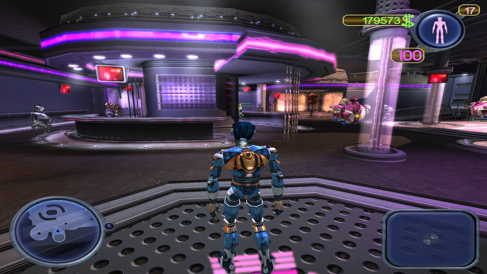
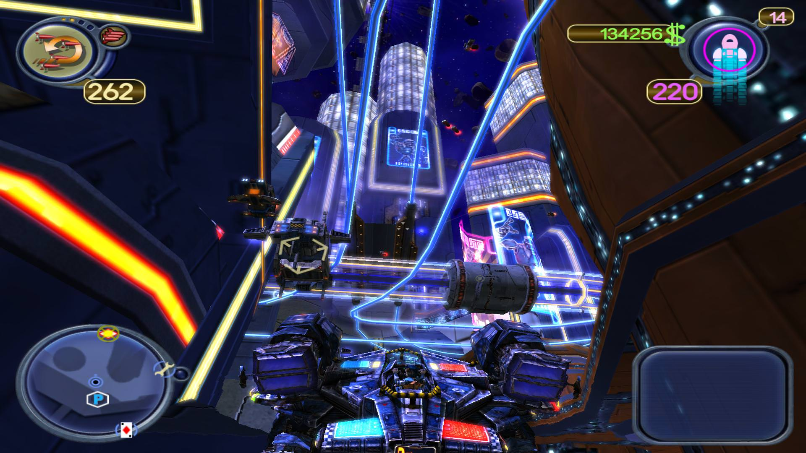
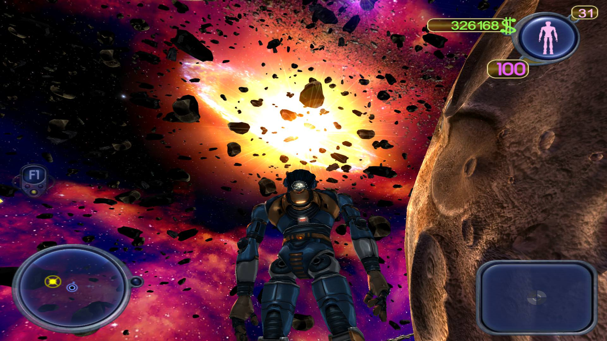

La capătul a douăzeci de ore mă găsii pe platforma spațioportului luându-mi la revedere de la noii prieteni, pretextându-le că am nevoie de o schimbare de peisaj. Chimera nu mai prezenta o curiozitate pentru mine, iar cele câteva challenge-uri secundare nu-mi dădură imboldul necesar să le duc la capăt având în vedere că deja știam ce recompensă mă aștepta la finalul lor.

Scrapland poate fi cel mai lesne descris ca un GTA3 cu roboți, așa cum le-am spus tuturor celor care au reacționat cu un „Huh?” când am menționat titlul jocului. Descrierea mea, așa laconică, am aflat ulterior, era folosită și de autorul unei recenzii de pe Gamespot. Comunitatea noastră ar putea fi mai bine informată, Level dând Scrapland ca joc full prin 2005-2006 și dacă nu mă trădează memorie, numărul respectiv avea X3 pe copertă. La vremea respectivă a fost unul din jocurile mele preferate din cele oferite de revistă, în ciuda faptului că n-am putut să-l duc la final de unul singur, având nevoie de salvările unui prieten care trecuse de ceea ce devenise pentru mine o sursă nesecată de frustrare, acea cursă infamă, contra cronometru, prin traficul centrului. Am îndurat ridicolul situației cu o fărâmă de stoicism și-n ciuda laudelor ostentative ale puștiului care reușise să treacă fără prea mare bătaie de cap de ceva care pentru mine era imposibil, n-am schițat un gest apologetic pentru propria neputință lăsându-l să-și facă numărul până s-a plictisit.

Această ultimă încercare și până la urmă doar în parte reușită a fost un fel de spălare a rușinii de atunci. Am dus la capăt Scrapland, dar n-am avut mulțumirea de sine ce o resimt de fiecare dată când termin vreun joc. Și asta cel mai probabil din cauza unui motiv pe care-l voi discuta ulterior.

Scrapland te pune în învelișul metalic al lui D-Tritus, un robot autoconstruit, care navigând fără vreo țintă anume prin vasta goliciune a cosmosului ajunge în spațioportul Chimerei, o rocă dezolantă înconjurată de un brâu de asteroizi. După scanarea inițială pentru urme de țesuturi de origini organice și o prezentare generică a planetei pe care ai ajuns ți se impune să ai un scop să-i poți răspunde lui Vinnie Jones când te întreabă “what’s your function in life?” și ți oferă o slujbă de jurnalist, singura disponibilă de altfel. Posturile cu adevărat cool, ca Nuclear Waste Disposer erau deja ocupate, după cum se lamentează funcționarul care trebuia să-ți găsească de lucru și tu, naiv și neștiutor, nu poți face altceva decât să-l crezi.

La scurt timp după aceea ești dat în grija lui Berto, o lămâie de robot cu urme de probleme hepatice, care te plimbă dintr-un loc în altul ca parte a tutorialului, îți prezintă personajele notabile, funcțiile fiecăruia și modul în care D-Tritus se poate folosi de ajutorul lor. Primul task oficial în noua slujbă de reporter este să-i ia un interviu Arhiepiscopului din Scrapland, lucru greu de realizat de un reporter novice când ordinele sunt clare „Arhiepiscopul nu trebuie deranjat”. Norocul face că Sebastian, o cameră decrepită, îți oferă uneltele necesare: suprascrierea și copierea oricărui robot din Scrapland a căror matrice e disponibilă în Marea Bază de Date. Micul subterfugiu cu care ajungi la popă se dovedește a fi doar un pas bătut pe loc, Arhiepiscopul refuzând să se lase înduplecat la cererile tale. În mod total coincidental, în seara respectivă, liderul religios e omorât, lucru care în mod normal n-ar trebui să ajungă subiect de știri. Moartea e o simplă trivialitate în Scrapland, condiționată de două lucruri: banii și existența matricii în Great Data Base. Așadar, moartea nu e decât un mic inconvenient, rematerializarea făcându-se indiferent de poziția pe scara socială, fie în zona în care ți-ai pierdut o viață fie în închisoarea datornicilor dacă nu ți-ai achizitionat vieți adiționale de la episcopi. Permanența morții în cazul episcopului survine din dispariția matricii sale din baza de date a planetei.



După crimă, firul narativ devine un murder mistery, D-Tritus luând asupra-i sarcina găsirii făptașului și deslușirea motivației sale, ajutat cu sfaturi și indicații de un robot misterios al cărui nume a fost pe veci stricat de pornoșaguri.

Deplasarea prin Scrapland se face în două moduri, zonele deschise ale orașului se parcurg doar la bordul unui Gunship, evocând într-o oarecare măsură prin gameplay Freelancer sau un 3rd Person Aquanox cu diferența că muniția și armura calei pot fi suplinite de pick-up-uri răspândite în respectiva zonă și evident, per pedes în interiorul clădirilor principale. În ajutorul player-ului vine radarul, care practic îți oferă toare reperele importante dintr-o zonă, dar și destinația exactă pentru a avansa firul narativ. Întradevăr primind mură-n gură “do this at the blinking yellow thingy” taie perspectiva explorării unei zone, dar având în vedere că am petrecut un pic peste douăzeci de ore în joc, a fost probabil un lucru infinit mai benefic decât să orbecăi aiurea căutând.

Pe lângă firul principal, există și o serie de challenge-uri, numite “Crazy Bets”, recompensa îndeplinirii a trei astfel de provocări este de a te face eligibil pentru participarea într-un “Super Crazy Bet” în urma căruia ești cadorisit cu upgrade-uri pentru armele de pe gunship. Sunt doisprezece potențiale “Super Crazy Bets” a căror dificultate crește destul de liniar până la un punct, precedate de trei ori pe atâtea challenge-uri.

În mod total surprinzător pentru o societate populată în exclusivitate cu roboți, această emulează foarte mult societatea umană, economia existând și pe Scrapland și e condusă tot de schimburile bani-servicii sau bunuri. Modurile în care se poate face rost de Scraps e destul de variat, de la distrugerea altor roboți și nave până la provocarea oricui la curse sau lupte cu gunship-ul, speculă cu nave deturnate sau chiar furt îngăduit de lege prin transfigurarea în bancher. Personal am reușit să agonisesc o avere considerabilă într-un timp foarte scurt, temându-mă la un moment dat că belșugul strâns ar putea duce la colaps financiar și inflație fără măsură datorită activității acaparatoare de capital. Temerile mi-au fost deșarte, averea mea n-a avut nici un impact negativ asupra jocului.

Unele activități nu sunt tocmai legale, suprascrierea unui robot sau distrugerea navelor din traficul urban aduc cu sine iureșul agresiv al poliției metropolitane de care poți scăpa doar dacă te menții departe de radarul lor o anumită vreme. Echipajele urmăritoare devin din ce în ce mai greu de eliminat o dată cu avansul poveștii și e destul de lesne să ți-i pui în cap chiar și fără voie în timpul unor misiuni exterioare. Un moment de neatenție, un click aiurea și Swarm-ul se duce într-o navă total aleatoare din trafic.

Scrapland ar fi fost un joc excelent dacă nu ar fi avut câteva probleme, iar problema cea mai mare a lui este nivelul de dificultate foarte aleator ce se plimbă pe o curbă logaritmică cu creșteri și descreșteri la fel de bruște. Știu că pare o exagerare, o scuză cauzată de neputință dar, jucând pe hard pentru o bucată considerabilă din joc, am făcut față cu succes la toate provocările impuse de poveste și de quest-urile secundare până când, la fel ca Marsyas, mândru de abilitățile mele, m-am trezit cu pielea pe bâtă. Totul a început cu identificarea pilotului unui gunship mercenar față de care trebuia să mă țin la o distanță minimă pentru 8 de secunde. Dar modul în care pilota respectivul bot era incredibil, aproape dumnezeiesc. Mi-aș fi dorit să pot zbura și eu ca el. Cu chiu cu vai, după aproape o oră, am reușit să-l identific, dar următorul task a fost chiar mai draconic decât precedentul, protejarea unui episcop de urgia mercenarului. Problemele s-au înmulțit, amândoi piloții porneau cu același număr de vieți, doar că, până ajungeai să-i acorzi suport preasfântului era deja un handicap între ei. Nava popii avea din start un dezavantaj în privința armelor și a armurii calei și era încăpățânat ca un catâr stând față-n față cu mercenarul care pilota oricum de parcă venise din alt joc.

Ăsta a fost momentul în care am fost nevoit să reduc nivelul de dificultate. Era imposibil să-l poți ajuta pe episcop când acesta primea în freză Swarm Missile după Swarm Missile și nici măcar nu crâcnea vreo mișcare evazivă.



După acest episod, am zis un „bogdaproste” din suflet pentru că aveam posibilitatea să schimb nivelul de dificultatea fără a trebui să reîncep jocul. Mi-am zis că a fost o scăpare din partea-mi, am trecut jocul iarăși pe Hard și am continuat așa până a trebuit să identific un episcop trădător dintre cei opt ce păzeau Marea Bază de Date și să-l elimin. Aparent episcopii primiseră lecții de zbor de la mercenar așa că am zis că o să le stric ziua cu o salvă de Devastator făcând grava greșeală de a presupune. Ce anume? Că opt nave cu o cală mai subțire ca o foia de hârtie ar putea să facă vreodată față navei mele de haegemon pus pe harță. Chiar dacă m-am descotorosit de toți opt după o jumătatea de oră de tatonări repetate încercând să-i țin la distanță de pick-up-uri, făcând rost și de câteva vieți extra ca o consecință a eliminării apărătorilor bazei de date, următorul val de opt cucernici spawn-at instant nu m-a lăsat cu nici un chip să-mi îndeplinesc restul misiunii trândindu-mă de pământ atât de tare și de apăsat că am început să simt mirosul de țărână prin monitor. Am dat reload și am redus nivel de dificultate.

Am dus jocul la capăt doar schimbând nivelul de dificultate de fiecare dată când ajungeam într-un astfel de impas, lucru de care mi-e rușine și motivul principal pentru care n-am fost mulțumit de reușita de a-l termina simțind că am trișat cumva, chiar dacă m-am păstrat în limitele impuse de joc.

Alte probleme, mai mici în amplitudine ce-i drept, au de-a face cu repetitivitatea anumitor misiuni cu impresia la un moment dat că nu avansez în nici o direcție. Voi rămâne veșnic curios ce i-a determinat pe producători să forțeze din punct de vedere narativ player-ul să facă exact același task de două ori consecutiv în vreo câteva instanțe, în afara, probabil, prelungirii artificială a playtime-ului. Mai sunt câteva discrepanțe de ton ale poveștii, care deși păstrează un umor jovial pe întreg parcursul face notă discordantă cu neiertătorul AI din ultimul sfert. O altă problemă pe care o văd e că majoritatea covârșitoare a task-urilor sunt lipsite de consecințe la nivelul poveștii. O fi un tertip ce se leagă de mecanica de achiziționare și acaparare a vieților pe Scrapland dar, n-aș putea spune exact. Nu cred că e posibil să ajungi înapoi la ecranul de load chiar dacă inamicii-ți trimit escorta într-un mormânt prematur, un exemplu mai drastic în care succesul misiunii nu depinde doar de măiestria player-ului. De altfel cel mai rău lucru care ți se poate întâmpla în Scrapland e să rămâi sărac lipit-pământul, lucru la care poți ajunge lesne având în vedere modul în care evoluează prestația AI-ul.



Spuneam undeva mai la început de anumite challenge-uri, că există posibilitatea provocării oricui la combat sau curse. Am evitat cursele pe cât posibil pentru că aveam deja experiența primului playthrough, mai ales după cursa de calificare prin aglomerația centrului. Lucru cel mai curios la întreaga tărășenie cu provăcările este că ai posibilitatea să-ți complici existența pariind pe sume cât mai mari de bani, inițial luptele în sine fiind destul de lejere. În schimb provocând același personaj de câteva ori la același tip de challenge, mai devreme sau mai târziu va reduce suma maximă ce poate fi pariata și va ridica și mai sus dificultatea, nu de puține ori întâmplându-mi-se să mă trezesc cu avertismente acustice de distrugere iminentă, inamicii organizându-se mult mai bine și preluând de la unii la alții daunele în timp ce mă țineau la distanță cu focuri de acoperire.

Am menționat deja de vreo două ori cursa din centru și aș vrea să spun ceva și despre ea. Când l-am jucat prima dată s-a transformat ușor în enervare perpetuă și motivul pentru care aproape abandonasem jocul. A doua oară lucrurile au decurs altfel, m-am încărcat cu răbdare și am repetat cursa până ce am învătat traseul pe de rost și deși într-una din încercările eșuate am clacat înainte de penultima „baliză” trebuind să reiau totul de la început n-a fost nevoie să-mi cumpăr un mouse nou.

N-am fost pregătit pentru ce a urmat însă - o altă cursă de calificare de data asta împotriva adversarilor metalici, nu împotriva cronometrului, iar câteva din șmecheriile de care i-am văzut capabili m-ar fi lăsat de-a dreptul impresionat dacă scopul nu era să termin pe primul loc. Să iau un exemplu, unul din checkpoint-urile de pe traseu era la o distanță foarte mare față de celelalte și necesita un ocol considerabil. Boții aveau obiceiul să lase doar unul sau doi piloți să ridice respectivul buoy, restul așteptând în apropierea traseului normal pentru materializarea următorului checkpoint. Spre deosebire de cursa precedentă de data asta traseul nu era unul static, neputându-l repeta la nesfârșit până ce-nvățam fiecare curbă, urcare sau coborâre. A mers totuși mai bine decât prima cursă, la ultima încercare am ratat exact ultimul buoy dar, având un avans considerabil, ca un centaur vanitos ce mi-s l-am ridicat mergând în marșarier.

Multe lucruri nu mai sunt de spus. Din punct de vedere audio-vizual jocul se prezintă bine chiar și în 2018, urmele de riduri și vocea hârâită fiind ascunse de direcția artistică, paleta de culori vii, amplasarea și de câțiva actori care nu fac exces de zel. Gunship-urile sunt într-un număr suficient de mare, la fel ca diferențele între ele; că mai pot fi ticluite, putând să pui orice motor pe orice șasiu și ridicând armura calei în funcție de necesitate, sau adăugând și renuntând la arme în funcție de specializarea navei aduc în sine un mare plus jocului, iar mai apoi că jucătorul poate deține până la nouă nave în același timp interschimbabile în orice parcare cu ajutorul lui Spud-Nik iarăși ajută din plin gameplay-ul.

Scrapland e un joc de care te poți îndrăgosti ușor, din care am rămas cu câteva amintiri plăcute și reușite la care mă mai gândesc din când în când cu mândrie, dar care pe parcurs a devenit un exercițiu în răbdare ținut în viață de firul narativ al cărui deznodământ începusem să-l aștept cu o nerăbdare crescândă. Deși American McGee s-a dezis de el, motivând doar o mișcare de marketing în spate, Scrapland rămâne un joc decent, cu mult mai bun decât cele ulterioare pe care și-a pus numele. ■