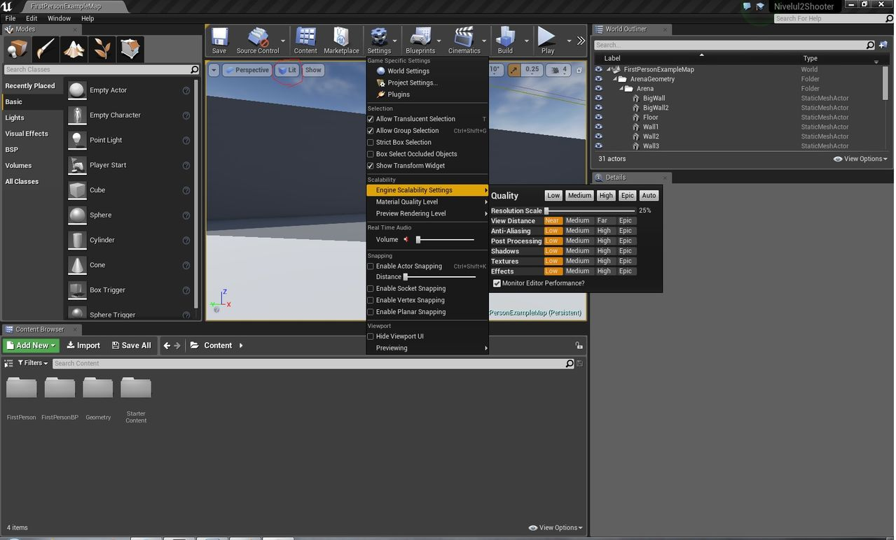

>Acest articol e primul dintr-o serie de 5 articole. Găsiți aici celelalte părți:

>[Partea II: Introducere în Blueprints - nivelul de joc](/posts/2018/11/atelier-introducere-unreal-engine-ii-mahri726)

>[Partea III: Introducere în Blueprints - personajele](/posts/2018/11/atelier-introducere-unreal-engine-iii-mahri726)

>[Partea IV: Grafică și Audio](/posts/2018/11/atelier-introducere-unreal-engine-iv-mahri726)

>[Partea V: Împachetarea finală și resurse suplimentare](/posts/2018/11/atelier-introducere-unreal-engine-v-mahri726)

 

Acum ceva timp, în revista Level, Laura și Sebastian porneau o serie de articole pe tema dezvoltării de jocuri video. Desigur, la acea vreme, uneltele pentru dezvoltare nu erau la îndemâna oricui, iar pe lângă faptul că erau foarte scumpe, necesitau și multă experiență pentru a ajunge la un rezultat cât de cât acceptabil. Astfel, menirea articolelor era mai mult de a oferi o perspectivă generală asupra industriei AAA de la acea vreme, decât să îți explice efectiv cum să faci un joc. Cred că fiecare gamer și-a dorit la un moment dat să facă un joc, drept urmare, am început o nouă serie de articole introductive pentru Unreal Engine 4. Poate, cumva, va stârni interesul cititorilor, iar scena indie românească va fi mai bogată.

Mai întâi, un scurt istoric. Unreal Engine a apărut pe piață odată cu lansarea jocului Unreal de către Epic Games. La vremea respectivă, licențele se obțineau foarte greu. La un moment dat, s-a lansat UDK, editorul pentru Unreal Engine 3, ce putea fi descărcat gratuit. Totuşi, UDK avea anumite limitări. Singurul limbaj de programare era UnrealScript, un limbaj foarte greoi, chiar şi pentru experții în programare. Pentru a putea programa un joc în C++, trebuia să ai acces la codul sursă. Va dați seama că marii publisheri plăteau sume foarte mari pentru acesta, sume pe care majoritatea dezvoltatorilor indie nu şi le puteau permite. Astfel, din ce în ce mai mulți dintre ei s-au îndreptat spre Unity, engine-ul competitiv, în care programarea era mult mai uşoară, deşi grafica nu atingea nivelul motorului Unreal.

Când au văzut succesul de care se bucură Unity, cei de la Epic Games le-au urmat exemplul, şi au lansat Unreal Engine 4 cu o licență mult mai convenabilă pentru dezvoltatorii indie decât cea pentru UDK. Plăteai 20 de dolari, şi aveai access şi la engine, şi la codul sursă. Când lansai jocul, dacă ai fi câştigat într-un trimestru 3.100 de dolari, plăteai 5% din cei 100 care depăşeau. Anul tecut, au renunțat la suma inițială de 20 de dolari, motorul grafic devenind gratuit.

În acest atelier, vom face un joc FPS cu ajutorul Unreal Engine 4. La sfârşitul ultimei părți a atelierului, se va afla un link de unde veți putea descarcă jocul finalizat. Deoarece motorul grafic are un sistem de scripting vizual extrem de capabil, Blueprints, nu va trebui să scriem nici măcar o linie de cod. Toată programarea jocului se realizează cu ajutorul nodurilor de Blueprints. Există jocuri comerciale pe Steam, cum ar fi Alice in Tokio Wonderland, care utilizează doar Blueprints. Dacă faceți un prototip de joc cât mai original, este posibil ca cei de la Epic Games să vă plătească chiar cu mii de dolari fără să vă ceară nimic în schimb, prin programul Unreal Dev Grants.

## Epic Games Launcher

Acestea fiind zise, să începem.

În primul rând, verificați dacă sistemul vă permite să rulați editorul. Potrivit Epic Games:

>“For developing with UE4, we recommend a desktop PC with Windows 7 64-bit or a Mac with Mac OS X 10.9.2 or later, 8 GB RAM and a quad-core Intel or AMD processor, and a DX11 compatible video card. UE4 will run on desktops and laptops below these recommendations, but performance may be limited.”

Eu, ca sistem, am o placă grafică Nvidia GeForce 8600 GT (compatibilă DX10), procesor Dual Core şi 6 GB RAM. Deşi performanța are de suferit, jocurile pot fi dezvoltate. Dacă aveți un sistem mai slab, asemănător cu al meu, am câteva sfaturi pentru a o îmbunătăți. Voi reveni asupra lor imediat.

În al doilea rând, va trebui să descărcați Epic Games Launcher, cu care puteți descărca motorul grafic. Accesați [această pagină](https://www.unrealengine.com/what-is-unreal-engine-4), şi dați click pe Get Started Now. Veți fi redirecționați la o pagină unde vă puteți face contul, apoi urmați restul instrucțiunilor. Ar trebui să ajungeți la pagina Dashboard, unde scrie, sub tab-ul Download, Get Unreal Engine.

După ce ați instalat launcherul şi vă logați, apăsați butonul `Library`, apoi `Add Versions`. Atelierul acesta a fost realizat cu varianta 4.11, în cele viitoare este posibil ca anumite lucruri să fie mai diferite.

Începeți instalarea motorului grafic. În secțiunea *Learn*, puteți descărca resurse gratuite pentru proiectele voastre. Puteți găsi resurse gratuite şi în secțiunea *Marketplace*, de exemplu asset-urile Infinity Blade.

După ce instalarea s-a finalizat şi ați pornit editorul, selectați `File > New Project`. Vom începe dezvoltarea jocului de la un şablon, pe care îl vom extinde cu diverse fuctionalități. În noua fereastră, selectați tab-ul `New Project`, sub-tabul `Blueprints`, apoi apăsați pe icon-ul `First Person`. Aveți grijă ca să fie selectată opțiunea `With Starter Content`, deoarece vom folosi modelele 3D incluse în editor. Apăsați butonul `Create Project`.

Acum câteva sfaturi pentru cei cu PC-urile mai slabe. Ca să îmbunătățiți performanța, apăsați `Settings > Engine Scalability Settings > Low` . De asemenea, puteți face fereastra în care vedeți scena cât mai mică, trăgând de despărțitorul superior, inferior şi cele laterale (imaginea de mai jos). În scenele mai complexe, puteți apăsa butonul lit (încercuit cu roşu), şi să selectați unlit, pentru un plus de performanță în defavoarea luminilor şi umbrelor.

Ca interfață, fereastra principala a editorului are mai multe elemente, numite panel-uri:

### Viewport
Viewport-ul este elementul central, „fereastra” voastră către nivelul pe care îl creați. Vă permite să interacționați cu aceasta în mod direct.

### Menu
De aici vă puteți salva nivelul sau proiectul. De asemenea, puteți accesa `Project Settings` – setări specifice pentru proiectul vostru, sau `Editor Preferences`, setări generale pentru editor.

### Modes
De aici puteți adăuga în scenă diferite obiecte, cum ar fi lumini, camere, forme geometrice, etc. De asemenea, puteți să generați un teren, să-l sculptați sau să adăugați vegetație. Ca şi Unreal Engine 3, Unreal Engine 4 are un sistem de „schițat” niveluri, numit BSP. Voi reveni asupra lui în articolele viitoare.

### Content Browser
Aici găsiți toate fişierele existente în proiect, de la modele 3D, la texturi, sunete, animații. Puteți importa un fişier extern apăsând butonul import, sau trăgându-l de pe desktop sau din Windows Explorer (drag and drop).

### World Outliner
Aici aveți acces la toate modelele plasate în scenă/nivelul la care lucrați. Le puteți selecta, le puteți face invizibile, sau le puteți şterge. Pentru a face camera să se centreze pe un anumit element din nivel, dați două click-uri pe el în World Outliner.

### Toolbar
Aici aveți acces la mai multe funcții. De exemplu, dacă apăsați `Play`, puteți să testați jocul. Dacă apăsați `F8` în timp ce jocul rulează, deposedați personajul, drept urmare, nu îl mai puteți controla. Însă, ținând apăsat click dreapta, prin apăsarea tastelor `W`,`A`,`S`,`D`,`Q`,`E`, puteți mişca camera în orice direcție, astfel încât să vedeți acțiunea din toate unghiurile. Dacă apăsați din nou `F8`, „spiritul” îi intră înapoi în corp, reposedându-l. Un alt buton important este `Build`. Când îl apăsați, motorul grafic trimite informații legate de iluminarea scenei şi texturile obiectelor la o altă aplicație, Swarm Agent, care porneşte automat.

Swarm Agent face nişte calcule bazate pe proiecția razelor de lumina pe suprafețe, apoi trimite înapoi la motorul grafic informațiile obținute, împreună cu texturile „iluminate”. Interfața Swarm Agent o puteți deschide din taskbar-ul Windows-ului, are un icon specific. Astfel, puteți vedea progresul mai în amănunt. Motorul de iluminare folosit de Swarm Agent se mai numeşte şi Lightmass.

### Details
Aici puteți schimba mai multe setări specifice pentru obiectul selectat, cum ar fi locația sau materialul alocat acestuia.

Pentru a mişca camera, se pot folosi mai multe metode de control:

1. `Click dreapta` + `W`,`A`,`S`,`D` pentru deplasare pe planul orizontal, sau `click dreapta` + `Q`, `E` pe cel vertical. Pentru a modifica viteza cu care camera se deplasează, puteți folosi rotița de scroll.
2. Modul de control specific pentru programul de modelare şi animație Maya:

  * `Alt` + `Click stânga` – rotație
  * `Alt` + `Click mijloc` – translație
  * `Alt` + `Click dreapta` – dolly sau zoom

Unreal Engine 4 are un sistem de tutoriale inclus. Pentru a-l accesa, apăsați butonul care clipeşte cu unde verzi, din colțul drept al ferestrei.

Acum vom începe să construim jocul. Apăsați `File > New Level` şi selectați `Default`. Puteți să salvați nivelul curent, dacă vreți.

Selectați podeaua/Floor, iar în `Details panel`, setați X la valoarea 10, Y la 10, ca să avem mai mult spațiu să ne construim nivelul. În `Content Browser`, navigați în folderul `Starter Content` > `Shapes`.

Locul în care jocul începe este marcat cu un gamepad şi un steag. Navigați în apropierea acestuia, şi trageți `Shape_Cube` lângă el. În fereastra pentru viewport, aveți trei butoane: `translate` (move), `rotate` şi `scale`. Apăsați pe `scale`, şi trageți de mânerul albastru în sus, astfel încât cutia să ajungă la o înălțime convenabilă.

**(1)**: Trageți de mânerul roşu, astfel încât lungimea zidului să crească. Selectați `move`, apoi, cu tasta `Alt` apăsată, trageți zidul spre dreapta. Veți observa că nu mutați zidul în sine, ci o copie a acestuia. Acum avem un coridor.

**(2)**: Selectați ambele ziduri, ținând apăsată tasta `Shift`. Țineți apăsat `Alt`, şi trageți de săgeata roşie, astfel încât să dublăm lungimea coridorului. Selectați bucățile de zid din dreapta, apoi le copiați spre dreapta tot cu `Alt`.

**(3)**: Mutați o bucată din zidul de mijloc mai în spate şi spre stânga.

**(4)(7)**: Selectați tot zidul din dreapta, apoi apăsați butonul `rotate`. Ținând apăsat `Alt`, îl rotiți spre dreapta cu 90 de grade.

**(5)**: Îl plasați în față, apoi îl copiați mai în spate, astfel încât să obținem un spațiu închis.

**(6)**: Selectați `Light Source`, ori din scenă, ori din World Outliner, şi îi reduceți intensitatea la 0.5 în panel-ul `Details`.

În următoarele părți vom lucra cu **Blueprints**, sistemul de scripting vizual. De asemenea, vom crea inamici, elemente de interfață precum bara de viață şi alte lucruri care s-ar putea găsi într-un shooter. ■