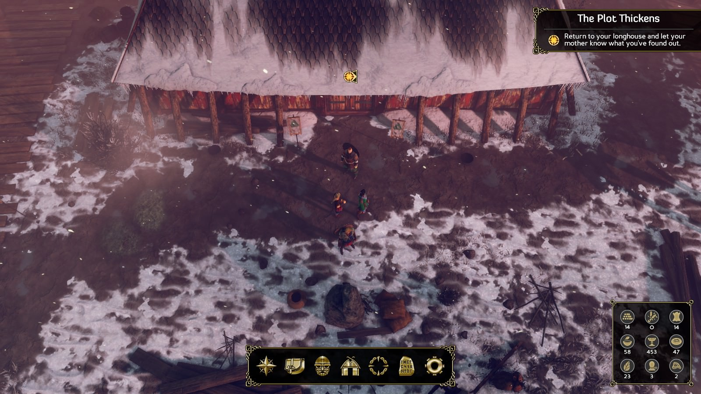
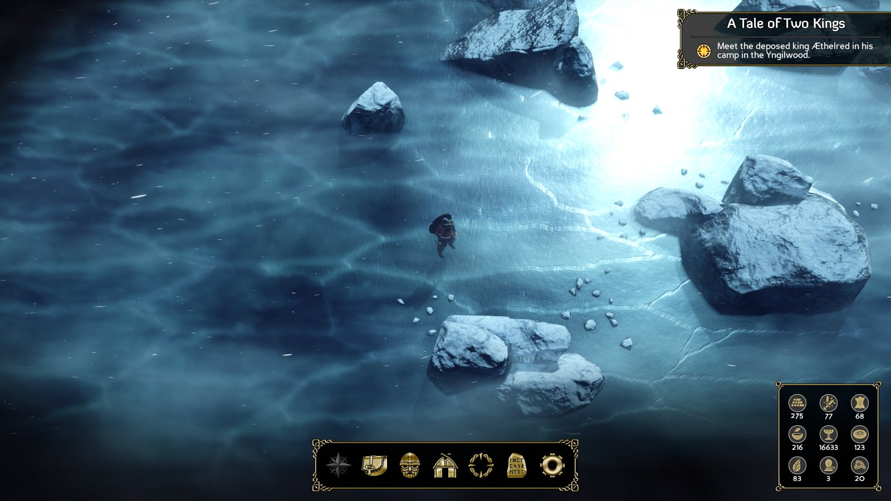
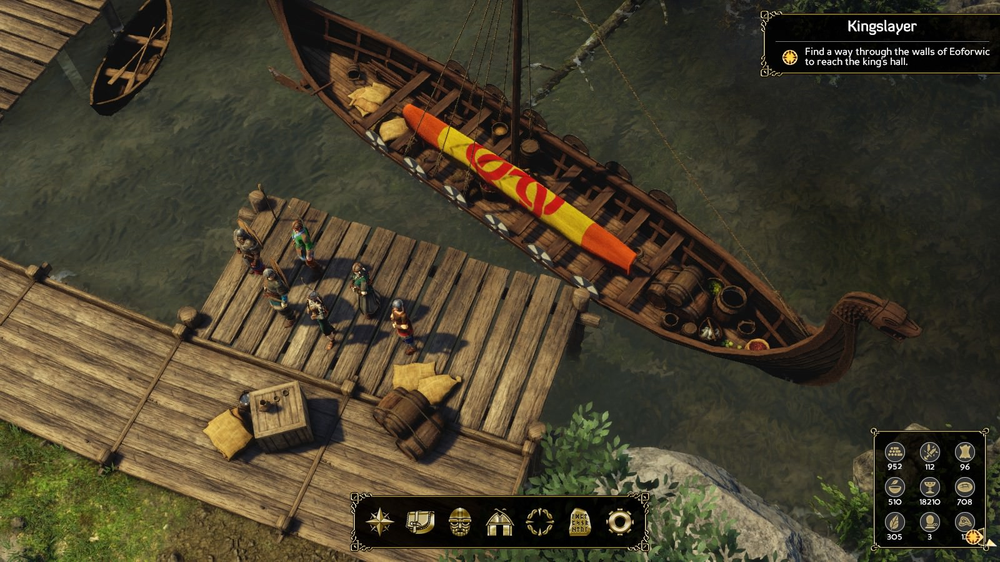
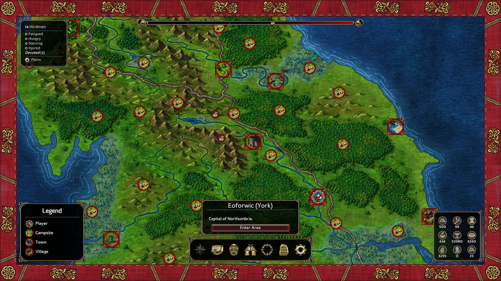
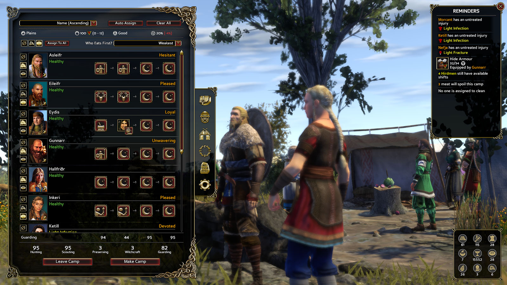

În 2013 Logic Artists, un studio format din aproximativ 10 angajați, lansa Expeditions: Conquistador, un hibrid TBS–RPG care te punea în pielea liderului unei expediții către America de Sud, în foarte colorata perioadă a marilor descoperiri. Pe lângă abordarea unei perioade istorice destul de puțin folosită în jocuri, Logic Artists au impresionat și prin faptul că au dus proiectul la bun sfârșit cu resurse minime. Doar 77 de mii de dolari s-au strâns pe Kickstarter, la care s-au adăugat și fondurile lor proprii. Un indie veritabil așadar, în care nu s-a irosit nimic și genul de joc care în jumătate din cazuri probabil că nu ajunge să iasă pe piață într-un stadiu jucabil.

Dar iată că băieții s-au descurcat și Conquistador a impresionat, atât printr-un gameplay bine pus la punct, cât și prin frumos redatele peisaje din timpul dialogurilor, dar mai ales prin calitatea scriiturii. Un joc ce a ținut clișeele la minim în timp ce te insera cu surprinzătoare dibăcie într-o perioadă extrem de brutală a istoriei. Îmi amintesc cum, după ce l-am terminat, mi-am spus că abia aștept să văd următorul lor joc și am anticipat o evoluție semnificativă a producătorilor. Pentru că am întotdeauna dreptate, ei nu m-au contrazis… prea tare. 



Similar cu Conquistador, Viking începe cu un filmuleț introductiv neconvingător, de această dată nu mai ești trimis de regele Spaniei după comoară, sclavi și genocid. Dar e în regulă, ești fiul unui conductor viking de clan, care a plecat într-o expediție riscantă și s-a lovit de un ecran permanent de „game over”, acum tu îi moștenești atât poziția cât și problemele. Aparent tatăl tău a fost un bun luptător, dar nu cel mai bun lider, iar după moartea lui clanul se cam dă peste cap. Și pentru că nu puteau fi vikingi fără dueluri, pentru a-ți convinge supușii că îți meriți poziția treci prin câteva lupte de început, provocate de pretendenții la „tron”. Totul bine și frumos până când deloc pașnica ta casă e amenințată și din exterior, de alți vikingi veniți, se pare, după comori și faimă, puțin cam prost informați având în vedere starea deplorabilă în care se află sătucul tău. S-au și găsit de la cine să fure…

Cam așa ia sfârșit tutorialul, invazia inamică e respinsă și trebuie să treci marea, la fel ca tatăl tău, pentru a aduna bogății, aliați sau supuși, în funcție de cum alegi să joci. Dar înainte de asta, vei mai poposi puțin în Danemarca, pentru că nu poți să treci marea înotând, iar bărcile sunt scumpe. Inițial ai alături de tine câțiva membrii mai apropiați ai clanului. Plus vreo doi sau trei prieteni noi, dacă prin deciziile tale alegi să îi recrutezi, pentru că poți și să îi trimiți la o plimbare sau chiar la plimbarea mai definitivă, fără puls. O să vă rog să mă scuzați dar personajele din jocul acesta au nume ori foarte amuzante, ori imposibil de scris, așa că vă las pe voi să le descoperiți. 

Interesant la zona asta introductivă este că jocul îți prezintă și cum va progresa povestea de acum înainte, în Viking primești „game over” doar dacă nu reușești să îndeplinești obiectivele misiunii, de murit nu prea mori, doar că trebuie să suporți consecințele luptei pierdute. De obicei sunt minore dar te pot pune și în dezavantaj sau chiar să ducă la un final prematur al jocului. Și știm cu toții că finalurile premature nu sunt cele mai spectaculoase sau de dorit. În teorie o idee foarte bună, în practică… eu cel puțin nu am reușit să pierd vreo luptă în jocul acesta, nu știu exact ce trebuie să faci și cât de prost să pricepi mecanicile jocului ca să ajungi în postura asta. Vedeți voi, Viking își propune să pluseze pe partea de RPG, jocul fiind mult mai axat pe explorarea clasică de RPG, misiuni și dialoguri, decât pe partea strategică, unde trebuie să-ți organizezi membrii expediției când te deplasezi pe hartă.

Și o reușește într-un mod foarte carismatic: explorezi hărți de dimensiuni rezonabile, lipsite de misiuni puse acolo doar pentru a adăuga la timpul de joc, iar când se declanșează o luptă, locul în care a pornit devine apoi grila hexagonală de luptă și se intră în sistemul pe ture. Am descris eu cam sec ce se întâmplă însă în joc curge foarte frumos, mult mai închegat decât în Conquistador – mă rog, mai puțin partea în care e plin de butoiașe cu loot peste tot. Deci pe partea asta de combinare a genurilor, numai de bine. Unde sunt eu de părere că jocul o dă în bară e la capitolul… numere. Damage, armură, abilități speciale, toate par făcute în așa fel încât eroii tăi nenorocesc efectiv inamicii. E de bun simț când te lupți cu niște englezi sfrijiți, doar că producătorii nu prea au adaptat corespunzător diferitele tipuri de inamici. Așadar, jocul nu devine nici măcar tangențial dificil decât într-un singur tip de confruntare: lupii. Lupii sunt moartea pe pământ dacă nu ai un party special conceput contra lor. 

Dificultatea scăzută în sine nu ar dăuna prea tare, dar se leagă organic cu ideea producătorilor de a nu pierde lupte și afectează negativ imersiunea. Nu e vorba că lipsește echilibrul, pentru că nu m-ar deranja asta, doar că întotdeauna e dezechilibrat în favoarea ta. Și e amuzant să vii cu grupul de vikingi forțe speciale, să treci printr-un număr dublu de adversari, apoi când sar patru lupi pe tine e apocalipsa. Ce mama naibii?!

Vă spuneam despre explorarea hărților. Viking are un iz de RPG clasic, în care fiecare zonă e o hartă pătratică pe care o iei la puricat, apoi poți accesa harta mai mare, să zicem „strategică”, unde te deplasezi pe uscat sau apă către alte zone. Explorarea în sine nu îți oferă multe recompense ascunse, pentru că e un joc comasat, lipsit de umpluturi. Aproape fiecare colțișor al unei hărți ajunge să fie vizitat natural, dacă alegi să faci misiunile secundare pe care nu prea ai cum să le ratezi. Tocmai de asta e puțin lipsită de naturalețe popularea hărților cu butoiașe, sticluțe și tot felul de containere care conțin nimicuri. Nimicurile acestea pot fi folosite pentru crafting, dar aici atât am de zis: SĂ. NU. FACEȚI. ASTA. Jocul e deja mult prea ușor, crafting-ul e de asemenea ilar de accesibil și îți oferă instant echipament mai bun decât inamicii, abia spre final dacă dai de adversari care să aibă și ei săbiuțe și nu scobitori. Practic veți juca cu cheat-uri.

Revenind puțin la jocul precedent din serie, acolo componenta strategică, explorarea efectivă pe hartă, hrănirea membrilor expediției, bolile și toate obstacolele de la care te-ai aștepta într-o expediție te loveau între ochi constant. Dacă nu erai atent un moment, pierdeai membrii și ajungeai în dezavantaj. Evident, după un punct ajungeai să te organizezi eficient și nu mai aveai problema asta, dar tot exista constant tensiunea supraviețuirii pe un teren necunoscut. Aici dispare complet acest lucru: tot trebuie să ai grijă de toată lumea, dar e trivial. Și nu pot da vina pe simplificare, doar pe numere. Lucrurile nasoale pur și simplu nu se întâmplă destul de des. Sistemul ascuns de procente din jocul acesta e prea domol chiar și pe nivele ridicate de dificultate, parcă le-a fost teamă să nu supere jucătorii. Păcat.

Există o droaie de specializări și abilități menite să facă un personaj mai bun la partea de organizare a taberei. Dar când pleci din Danemarca jocul te pune să îți creezi manual companioni, trebuie să ai măcar zece cu tine pentru că e o călătorie anevoioasă. Oricine are un mic simț al jocurilor în sânge va remarca imediat posibilitatea de a folosi surplusul de însoțitori dezvoltându-i exclusiv pe partea asta, iar ei se vor ocupa de tabără, în timp ce alții vor fi folosiți pentru lupte. Asta reduce orice penalizare a combatanților, în timp ce tabăra e organizată întotdeauna cu un maxim de eficiență. Totul fără pic de efort, stres sau realism.

Cu toate că îl penalizez pentru ce am scris mai sus, Viking e mai mult decât suma părților sale, trecând peste lupte și formule matematice, Logic Artists reușesc și de această dată să surprindă prin calitatea dialogurilor. Se depărtează puțin de seriozitatea de dinainte, dar cel mai des sunt fermecător scrise și exact în proporția necesară. Transmit tot ce au de zis fără să pară că se grăbesc sau te obligă la sesiuni lungi de citit doar ca să înțelegi de ce omori lumea. Nu pot să spun că sunt pline de substrat, sunt mai unidimensionale decât în Conquistador și ceva mai cheesy cele romantice, dar pe mine nu m-a deranjat prea tare. Iar ca bonus, asemenea serialului bine cunoscut, povestea e condimentată de elemente suprarealiste pe care e greu să știi dacă să le interpretezi ca ceva concret sau simple momente de delir. În rest nu dă pe afară cu întorsături surprinzătoare de situație, însă compensează prin dinamism. Viking se schimbă foarte mult în funcție de alegerile tale. Poți fi un viking cât de cât pașnic, care adună aliați, semnează contracte de negoț și construiește un imperiu axat pe relații politice, caz în care misiunile și modul în care reacționează NPC-urile chiar te fac să simți alegerea asta. Dar dacă schimbi macazul și intri peste englezi păstrând acuratețea istorică, lumea din jurul tău reacționează și experiența este cu totul alta. Acum să nu înțelegeți greșit, nu e Fallout aici, indiferent cât de pașnic joci, tot va trebui să-ți înfigi cuțitul în cineva până la urmă.

Sunt permise și combinații între cele două abordări, din păcate perspectiva producătorilor a fost cam limitată aici. Pentru că au introdus două meta-curențe în joc: putere și prosperitate. Dacă înclini spre militarism, crește puterea, în timp ce comerțul îți aduce puncte la prosperitate. Frumos, nu? Nu prea, nu sunt un fan al indicatoarelor explicite, dar ar fi putut să o scoată la capăt. Problema e că finalul plănuit de joc depinde nu de proporția putere-prosperitate, ci de valoarea maximă din una sau alta. Altfel spus, ori o ai pe una la nivel destul de mare ca jocul să intre pe făgașul corespunzător, ori le ai pe ambele prea jos caz în care clanul tău s-a cam dus pe apa sâmbetei. Cam ciudată alegere de design.

Un aspect mai inspirat e posibilitatea de a termina jocul cu mult înainte de finalul plănuit. Teoretic poți aduna rapid aliații de care ai nevoie și gata, nu ești obligat să ai un drum liniar, prestabilit. Au fost foarte multe idei bune aici, unele implementate bine, altele mai puțin. Ce iese bine este imprevizibilitatea jocului, mai ales la prima parcurgere. Nu cunoști multe detalii și mai mult ca sigur vei fi surprins de ceva: surprinde foarte bine sentimentele de aventură și explorare.

De fapt, la partea de sentimente aș spune că Viking impresionează cel mai mult. Poate că prima locație nu arată nimic semnificativ, dar e mai mult cu rol introductiv. Când în sfârșit treci peste ape și ajungi în Anglia, mediul se schimbă radical, simți că întri pe un tărâm necunoscut. Iar alegerea muzicală pentru acest moment e de-a dreptul genială. De nedescris cum pare verdele și vegetația abundentă, după albul predominat din Danemarca. Categoric printre cele mai atmosferice jocuri prin care am trecut, ajutat din plin de coloana sonoră șocant de bine realizată având în vedere resursele limitate. Nu știu cum au făcut dar au reușit să îl aducă pe compozitorul Knut Avenstroup Haugen, recunoscut printre altele pentru Age of Conan și Lords of the Fallen. Nici grafica nu se lasă mai prejos să știți. Cred că e cel mai bine pus la punct joc dintre cele dezvoltate pe Unity. Tot sugrumă performanța și bagă PC-urile în hiperventilație dar și arată pe măsură. Fie că e vorba de peisaje verzi sau înzăpezite, Viking pare să fie cea mai faină transpunere în 3D a unui RPG 2D.

Ca RPG pur, așa cum spuneam, nu e tocmai Fallout, dar trebuie să recunosc că m-a gâdilat unde trebuie. Luptele pe ture nu mai dau impresia unui TBS, ci a unui sistem de luptă construit pentru un RPG, cel puțin până la problemele cu dificultatea. Misiunile sunt în general interesante, cu ramuri diverse ce nu se pot explora în totalitate decât dacă reluați jocul. Sunt și câteva misiuni de „fetch”, dar nu deranjante, mai mult oferă un bine meritat moment de relaxare de la îndeletnicirile serioase, intriga politică și crima. Conform realității istorice, crima e un element foarte important în joc, existând chiar animații scriptate prin care ți se arată în detaliu cum înjunghii fără milă pe cineva - în mod evident menite să răscolească puțin confortul jucătorilor și să accentueze alegerile din timpul unei misiuni. Alt element de o duritate specifică e modul în care îți găsești locuri de tabără. Acestea pot fi ocupate în prealabil, iar locuitorii trebuie „încurajați” să plece. Nu am realizat de la început, dar după câteva astfel de lupte mi-am dat seama că omor și oameni nevinovați care efectiv poposeau pe acolo pentru că era o zonă sigură, ușor de apărat. De altfel tema centrala a jocului pare a fi să te pună în situații greu de manevrat, unde ai de ales între avantaje personale mari sau sacrificarea conștiinței. Cu toate acestea, nu atinge același nivel de autenticitate din Conquistador, parcă acolo în jurul fiecărei situații mai delicate exista o teamă apăsătoare de a face alegerea greșită. De înțeles pe undeva, spre deosebire de locuitorii nativi ai Americii, englezii au supraviețuit întâlnirii cu oaspeții lor de peste apă.

Pe lângă componentele de care v-am zis deja, partea de RPG și harta strategică cu organizarea expediției și taberelor, există și o parte de construcție și resurse în joc. Puterea sau prosperitatea nu cresc decât prin construirea de clădiri în satul tău natal. Există mai multe clădiri ce se pot construi, dar cu puține excepții toate generează una dintre cele două curențe. Timpul de construire se măsoară în zile de joc și poate fi grăbit prin folosirea de sclavi în procesul de construcție. Personal nu am făcut asta, am fost un viking care a decapitat pe oricine se uita urât la mine, dar de fel mai progresiv, așa. Cum ar fi de așteptat, multe din misiunile cu probleme morale din joc se învârt în jurul sclavilor, îi lași liberi sau îi pui la muncă? 

Cu ocazia asta mi-am amintit de timpul limită. Puteți construi ce clădiri vreți, dar timpul de construcție e important pentru că jocul se desfășoară constant sub amenințarea unui eveniment major: o întrunire a liderilor vikingi la care trebuie să participi. Există un timp limită în care să vă desfășurați expediția. Știu, pare o chestie de game design 101, nu impui jucătorilor timpi limită și poate că aș fi întins aici zece rânduri de plângeri pe tema asta doar că… e de pomană. Ai mult mai mult timp decât ai nevoie, jocul e foarte ușor, așa că nu face mare lucru. Înțeleg intenția producătorilor, dacă trece timpul jocul se termină cu ce ai acumulat până la acel moment dar din nou, trebuie foarte mult subestimat nivelul de inteligență al jucătorilor ca să crezi că se poate ajunge aici. Spoiler alert: s-au plâns oricum mulți pe forumurile jocului de asta.

Expeditions: Viking încântă prin atmosferă, design-ul minuțios al hărților, un sistem de luptă distractiv și o valoare de producție ireal de mare având în vedere resursele disponibile. L-am mâncat pe pâine, cele patruzeci de ore trecând fără vreun moment real de plictiseală. Însă m-a lăsat și cu regrete, după primele cinci sau șase ore de joc aveam impresia că urmează să fiu martor la încă un mare RPG recent, de pus lângă Divinity: Original Sin sau UnderRail, însă acest sentiment a scăzut pe măsură ce am progresat. Pe cât de fluid curge de la o hartă la alta, trecând prin formare de alianțe, război sau masacre, pe atât de dezamăgitoare e lipsa de provocare. Dispune de un sistem de luptă bine gândit, dar nu bine calibrat, cu prea puține tipuri de inamici. Reușește cu greu să compenseze problema asta. Da, dialogurile sunt faine, explorarea e acaparantă, nu te plictisești, dar e dezamăgitor ca experiențele tale să se reducă la niște indicatoare cu numere, puterea și prosperitatea să fie niște praguri inflexibile și întreaga parte de expediție propriu-zisă să poată fi scoasă din joc fără a i se simți lipsa.

Vă asigur că am încheiat mai negativ decât merită jocul, de recomandat îl recomand oricui. Mi-ar fi greu să îl descriu ca altfel decât un joc bun care reușește să se inspire cu pofta din clasici, regurgitând însă clișeele acestora. Logic Artists au avansat categoric ca studio, dar poate data viitoare vor avea mai mult curaj și vor face mai puține compromisuri, eu unul asta îmi doresc. ■
