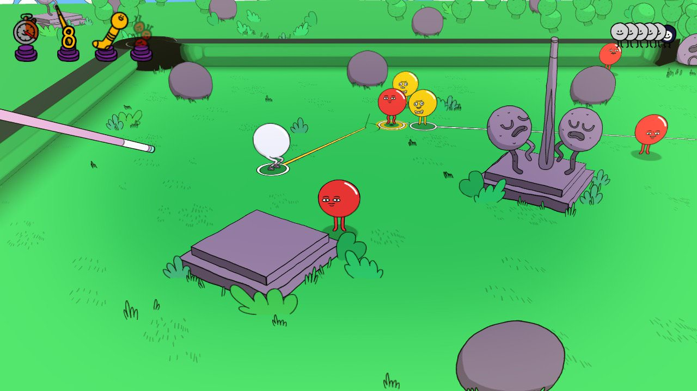

În ceea ce mă privește sunt și voi fi mereu un neîndemânatic. Indiferent că e vorba de reparat lucruri prin casă, condus mașina sau chiar și jucat pe consolă, niciodată nu simt că am controlul complet asupra acțiunii. Unele lucruri îmi scapă, atât la propriu cât și la figurat. De multe ori privesc în urmă și mă întreb cum am reușit să duc la bun sfârșit una sau alta. Vorba cunoscutului interpret de șlagăre și muzică dansantă, James, getting away with it all messed up.

Ceea ce ne aduce la jocul despre care voi vorbi puțin azi, Pool Panic. De la început s-a prezentat ca fiind probabil cel mai nerealist joc de biliard pe care l-am încercat vreodată. Un motto la care reușesc să ader fără nici o ezitare, pentru că și eu sunt probabil cel mai inconsistent jucător de biliard pe care l-am întâlnit vreodată. Poate poate acesta o fi jocul care îmi va ierta stângăcia și îmi va recompensa consecvența.



În afară de scurtul tutorial care te învață cum să controlezi bila albă și tacul, nu prea am mai întâlnit cuvinte. Tot ce se transmite e prin limbajul „gibberish”, cum zice englezul. Plămădeala aceea de sunete care aduce a conversație, dar de fapt nu înseamnă nimic. 

Însă trebuie să recunosc că nu doar prin cuvintele sale alese m-a atras jocul acesta, ci și prin stilul grafic. La o simplă aruncare de ochi peste screenshot-uri se observă de la o poștă influențele valului de comedii animate care inundă media de câțiva ani. În sensul bun al cuvântului. Nici nu aș avea alte așteptări de la un joc publicat de Adult Swim. Dacă e să ne luăm după majoritatea internetului, jocul ar semăna cu Rick & Morty. Ar putea la fel de bine să fie un episod din Bob's Burgers dacă mă întrebați pe mine. Ba aș merge pâna într-acolo încât să zic că ar putea fi un episod pierdut din Beavis & Butt-Head. 

Harta destul de mare a jocului, cu cele peste 100 de nivele, e cât se poate de frumos desenată și diversă. Avem ocazia să ne desfășurăm activitatea în parcuri de distracții, la fermă, într-un castel, pe un teren de fotbal, în pădure, între garaje înconjurați de zombie, la bancă și în multe multe alte locuri. Curiozitatea de a vedea ce mai urmează te îndeamnă să mai joci un nivel și încă un nivel și tot așa. Personajele cu care avem de-a face sunt bilele de biliard în toate formele posibile. Animațiile sunt voit exagerate și veți întâlni bile de biliard în cele mai variate ipostaze, de obicei cu costumații care se potrivesc scenei.

Costumațiile nu au rol doar estetic, ci și practic. Cavalerii, de exemplu, vor fi vulnerabili atacurilor noastre doar după ce îi izbim de câteva ori cu bila albă și le distrugem scuturile. Ba mai mult, dacă sunt atacați frontal vor riposta și ei cu sabia și scutul de la purtător. Un alt exemplu simpatic sunt bilele care se deghizează în obiecte din mediul înconjurător. Uneori sunt greu de observat și mi s-a întâmplat să dau peste ele din greșeală. Odată găsite, te vor însoți pe harta și vor da acces înspre nivele secrete. Mai apoi există și bile cu abilități mai speciale. Unele se feresc din calea ta în pași de dans, altele se înfurie când sunt atinse și explodează, ba sunt chiar și unele care se așează intenționat între bila ta albă și alte bile pe care le țintești ca să le apere. Acestea sunt doar câteva exemple, dar jocul vine cu o multitudine de personaje pe care o să vă las să le descoperiți.

Din punct de vedere al gameplay-ului, nu avem de a face cu nici o mecanică complexă. Cei care v-ați petrecut tinerețea pe Yahoo Messenger jucând Yahoo Pool puteți să vă considerați experți deja. Fiecare nivel poate fi considerat o masă de biliard, însă găurile și obstacolele sunt destul de inedit plasate încât să facă lucrurile interesante. Scenele sunt statice în sensul că nu se pot roti, iar funcția de zoom nu e controlată de către jucator, ci e lăsată pe seama camerei. Camera mai dă rateuri, poziționându-se uneori în locuri incomode, dar nu e nimic peste ce să nu putem trece.

Eu am parcurs jocul folosind controller-ul. Cu un joystick controlezi mișcările bilei albe, iar cu celălalt controlezi direcția tacului și puterea loviturii. N-aș putea să laud controlul ca fiind precis, ba dimpotrivă, a ajuns să fie frustrant uneori. Aș putea să pun asta pe seama neîndemânării mele pe care o aminteam la început, dar nu am simțit îmbunătățiri nici după 80 de nivele parcurse. Tot timpul aveam impresia că m-aș fi descurcat mai bine cu un mouse. Și n-am putut scăpa de senzația că avansez în joc mai degrabă din noroc și încăpățânare decât din iscusință.



Din punct de vedere al rejucabilității, țin să menționez că fiecare nivel vine cu niște provocări care nu sunt obligatorii. Totuși, asta te îndeamnă să reiei nivelul doar ca să îți demonstrezi că poți să te încadrezi în parametri. Există în primul rând o limită de timp pe care foarte probabil am depășit-o de fiecare dată. Se dă premiu special și pentru cei care reușesc să „curețe” scenele de biliard într-un număr impus de mișcări, un alt capitol la care mă fac constant de rușine. În schimb am reușit de destule ori să termin un nivel fără să plasez bila albă în gaură. Și, preferata mea, provocarea de a găsi TOATE bilele dintr-o scena.

Am apreciat faptul că jocul nu mă obligă să bat recorduri de puncte ca să avansez la următorul nivel. E adevărat și că entuziasmul mi-a scăzut pe parcurs, în mare parte din cauza controlului pe care îl consider a nu fi destul de precis (probabil și controller-ul zice același lucru despre mine în review-ul lui). Curiozitatea de a vedea ce mai urmează, acompaniată de umorul ușurel, m-au determinat însă să explorez mai departe. A ajutat mult și faptul că l-am parcurs pe Switch, deci îl aveam la purtător reușind să mai joc câte un nivel în momentele de repaus din drumeții.

Îl recomand? Da, în doze mai mari la început și apoi în doze tot mai mici. Recomandat pentru neîndemânatici și nu numai! ■
